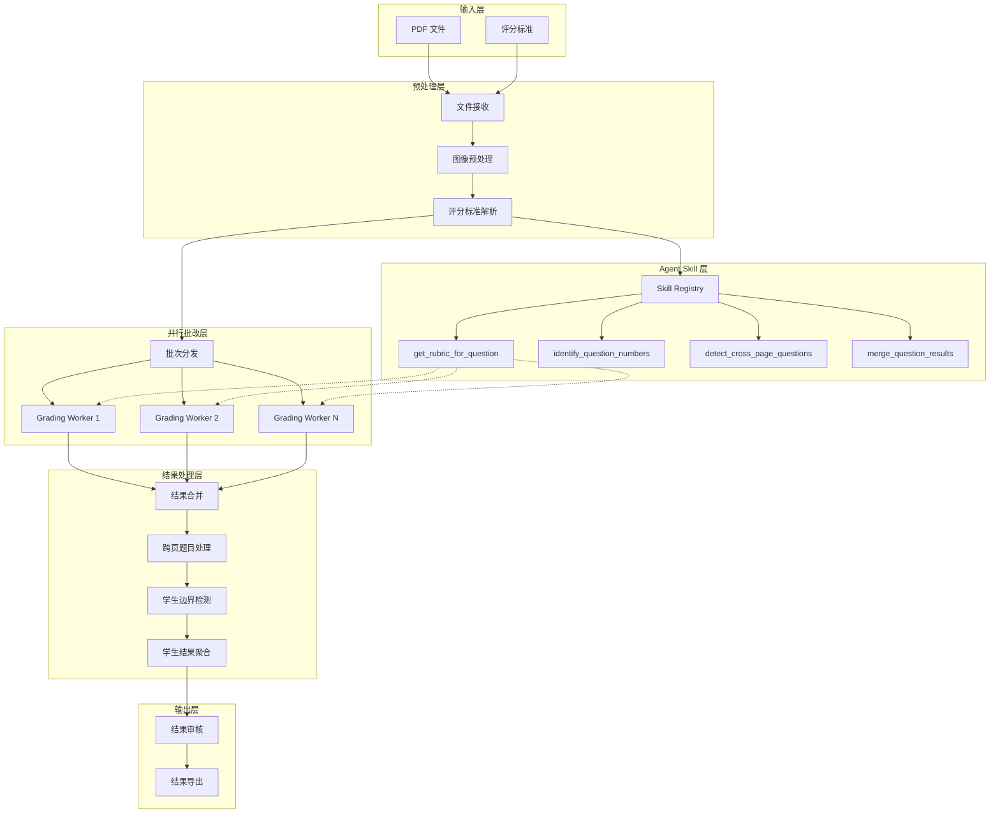
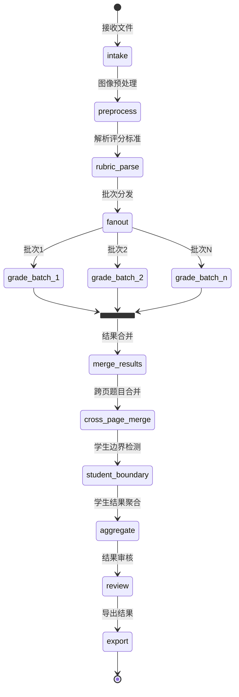

# Design Document: 批改工作流优化

## Overview

本设计文档描述了批改工作流的优化方案，采用 LangGraph + Agent Skill 架构，实现：
1. 动态评分标准获取：批改 Worker 通过 Agent Skill 动态获取指定题目的评分标准
2. 跨页题目识别与合并：解决一道题分两页导致小题当大题算的问题
3. 并行批改能力：确保大规模批改的高速处理能力
4. 结果智能合并：分批并行操作后的结果统一合并
5. 轻量级部署：支持无数据库模式运行，降低使用门槛

## Architecture

### 整体架构图



### LangGraph 工作流



## Components and Interfaces

### 1. Rubric Registry（评分标准注册中心）

负责存储和管理所有题目的评分标准，支持动态查询。

```python
@dataclass
class RubricRegistry:
    """评分标准注册中心"""
    
    rubrics: Dict[str, QuestionRubric]  # 题号 -> 评分标准
    total_score: float                   # 总分
    version: str                         # 版本号
    
    def get_rubric_for_question(self, question_id: str) -> Optional[QuestionRubric]:
        """获取指定题目的评分标准"""
        pass
    
    def get_all_rubrics(self) -> List[QuestionRubric]:
        """获取所有评分标准"""
        pass
    
    def update_rubric(self, question_id: str, rubric: QuestionRubric) -> None:
        """更新评分标准"""
        pass
```

### 2. Agent Skills（Agent 技能模块）

```python
class GradingSkills:
    """批改相关的 Agent Skills"""
    
    @skill
    async def get_rubric_for_question(
        self,
        question_id: str,
        registry: RubricRegistry
    ) -> QuestionRubric:
        """
        获取指定题目的评分标准
        
        Args:
            question_id: 题目编号（如 "1", "7a", "15"）
            registry: 评分标准注册中心
            
        Returns:
            QuestionRubric: 该题目的完整评分标准
        """
        pass
    
    @skill
    async def identify_question_numbers(
        self,
        page_image: bytes,
        llm_client: LLMClient
    ) -> List[str]:
        """
        从页面图像中识别题目编号
        
        Args:
            page_image: 页面图像
            llm_client: LLM 客户端
            
        Returns:
            List[str]: 识别出的题目编号列表
        """
        pass
    
    @skill
    async def detect_cross_page_questions(
        self,
        page_results: List[PageGradingResult]
    ) -> List[CrossPageQuestion]:
        """
        检测跨页题目
        
        Args:
            page_results: 各页面的批改结果
            
        Returns:
            List[CrossPageQuestion]: 检测到的跨页题目列表
        """
        pass
    
    @skill
    async def merge_question_results(
        self,
        results: List[QuestionResult],
        cross_page_info: Optional[CrossPageQuestion]
    ) -> QuestionResult:
        """
        合并同一题目的多个评分结果
        
        Args:
            results: 待合并的评分结果列表
            cross_page_info: 跨页信息（如果是跨页题目）
            
        Returns:
            QuestionResult: 合并后的评分结果
        """
        pass
```

### 3. Question Merger（题目合并器）

```python
@dataclass
class CrossPageQuestion:
    """跨页题目信息"""
    question_id: str           # 题目编号
    page_indices: List[int]    # 涉及的页面索引
    confidence: float          # 合并置信度
    merge_reason: str          # 合并原因

@dataclass
class QuestionMerger:
    """题目合并器"""
    
    confidence_threshold: float = 0.8
    
    def detect_cross_page_questions(
        self,
        page_results: List[PageGradingResult]
    ) -> List[CrossPageQuestion]:
        """检测跨页题目"""
        pass
    
    def merge_cross_page_results(
        self,
        page_results: List[PageGradingResult],
        cross_page_questions: List[CrossPageQuestion]
    ) -> List[QuestionResult]:
        """合并跨页题目的评分结果"""
        pass
    
    def _is_same_question(
        self,
        q1: str,
        q2: str
    ) -> bool:
        """判断两个题号是否为同一题目"""
        pass
    
    def _is_continuation(
        self,
        prev_page: PageGradingResult,
        curr_page: PageGradingResult
    ) -> bool:
        """判断当前页是否是上一页题目的延续"""
        pass
```

### 4. Grading Worker（批改工作单元）

```python
class GradingWorker:
    """批改工作单元"""
    
    def __init__(
        self,
        llm_client: LLMClient,
        rubric_registry: RubricRegistry,
        skills: GradingSkills
    ):
        self.llm_client = llm_client
        self.rubric_registry = rubric_registry
        self.skills = skills
    
    async def grade_page(
        self,
        page_image: bytes,
        page_index: int
    ) -> PageGradingResult:
        """
        批改单页
        
        1. 识别页面中的题目编号
        2. 为每道题获取评分标准
        3. 逐题评分
        4. 返回页面批改结果
        """
        # 1. 识别题目编号
        question_numbers = await self.skills.identify_question_numbers(
            page_image, self.llm_client
        )
        
        # 2. 为每道题获取评分标准并评分
        question_results = []
        for q_num in question_numbers:
            rubric = await self.skills.get_rubric_for_question(
                q_num, self.rubric_registry
            )
            result = await self._grade_question(page_image, q_num, rubric)
            question_results.append(result)
        
        return PageGradingResult(
            page_index=page_index,
            question_results=question_results,
            # ...
        )
```

### 5. Result Merger（结果合并器）

```python
class ResultMerger:
    """结果合并器"""
    
    def __init__(self, question_merger: QuestionMerger):
        self.question_merger = question_merger
    
    def merge_batch_results(
        self,
        batch_results: List[List[PageGradingResult]]
    ) -> List[PageGradingResult]:
        """
        合并多个批次的结果
        
        1. 按页码排序
        2. 去重
        3. 返回有序结果
        """
        pass
    
    def merge_cross_page_questions(
        self,
        page_results: List[PageGradingResult]
    ) -> List[QuestionResult]:
        """
        处理跨页题目合并
        
        1. 检测跨页题目
        2. 合并跨页评分
        3. 确保满分不重复计算
        """
        # 检测跨页题目
        cross_page_questions = self.question_merger.detect_cross_page_questions(
            page_results
        )
        
        # 合并跨页结果
        merged_results = self.question_merger.merge_cross_page_results(
            page_results, cross_page_questions
        )
        
        return merged_results
    
    def validate_total_score(
        self,
        question_results: List[QuestionResult],
        expected_total: float
    ) -> Tuple[bool, float]:
        """
        验证总分
        
        Returns:
            Tuple[bool, float]: (是否通过验证, 实际总分)
        """
        actual_total = sum(r.score for r in question_results)
        return (abs(actual_total - expected_total) < 0.01, actual_total)
```

## Data Models

### 核心数据模型

```python
@dataclass
class QuestionRubric:
    """单题评分标准"""
    question_id: str                    # 题号
    max_score: float                    # 满分
    question_text: str                  # 题目内容
    standard_answer: str                # 标准答案
    scoring_points: List[ScoringPoint]  # 得分点列表
    alternative_solutions: List[AlternativeSolution]  # 另类解法
    grading_notes: str                  # 批改注意事项

@dataclass
class ScoringPoint:
    """得分点"""
    description: str    # 得分点描述
    score: float        # 该得分点的分值
    is_required: bool   # 是否必须

@dataclass
class QuestionResult:
    """单题评分结果"""
    question_id: str                    # 题号
    score: float                        # 得分
    max_score: float                    # 满分
    confidence: float                   # 置信度
    feedback: str                       # 反馈
    scoring_point_results: List[ScoringPointResult]  # 得分点明细
    page_indices: List[int]             # 出现在哪些页面
    is_cross_page: bool                 # 是否跨页题目
    merge_source: Optional[List[str]]   # 合并来源（如果是合并结果）
    student_answer: str                 # 学生答案

@dataclass
class ScoringPointResult:
    """得分点评分结果"""
    scoring_point: ScoringPoint  # 对应的得分点
    awarded: float               # 获得的分数
    evidence: str                # 证据/依据

@dataclass
class PageGradingResult:
    """单页批改结果"""
    page_index: int                     # 页码
    question_results: List[QuestionResult]  # 该页的题目结果
    student_info: Optional[StudentInfo]  # 学生信息（如果识别到）
    is_blank_page: bool                 # 是否空白页
    raw_response: str                   # LLM 原始响应

@dataclass
class StudentResult:
    """学生批改结果"""
    student_key: str                    # 学生标识
    student_id: Optional[str]           # 学号
    student_name: Optional[str]         # 姓名
    start_page: int                     # 起始页
    end_page: int                       # 结束页
    total_score: float                  # 总分
    max_total_score: float              # 满分
    question_results: List[QuestionResult]  # 各题结果
    confidence: float                   # 置信度
    needs_confirmation: bool            # 是否需要人工确认

@dataclass
class BatchGradingResult:
    """批量批改结果"""
    batch_id: str                       # 批次ID
    student_results: List[StudentResult]  # 学生结果列表
    total_pages: int                    # 总页数
    processed_pages: int                # 已处理页数
    cross_page_questions: List[CrossPageQuestion]  # 跨页题目信息
    errors: List[Dict[str, Any]]        # 错误列表
    timestamps: Dict[str, str]          # 时间戳
```

## Correctness Properties

*A property is a characteristic or behavior that should hold true across all valid executions of a system-essentially, a formal statement about what the system should do. Properties serve as the bridge between human-readable specifications and machine-verifiable correctness guarantees.*

### Property 1: 评分标准获取完整性

*For any* 有效的题目编号，当 Grading_Worker 请求该题目的评分标准时，Rubric_Registry 返回的结果应包含完整的得分点列表、标准答案和另类解法（如果存在）。

**Validates: Requirements 1.1, 1.3**

### Property 2: 跨页题目识别正确性

*For any* 连续页面序列，如果页面 N 和页面 N+1 包含相同的题目编号，Question_Merger 应将其识别为跨页题目并合并为单一题目上下文。

**Validates: Requirements 2.1, 2.2, 2.3**

### Property 3: 跨页题目满分不重复计算

*For any* 跨页题目，合并后的评分结果中，该题目的满分应只计算一次，等于评分标准中定义的满分值，而不是各页面满分之和。

**Validates: Requirements 2.4, 4.3**

### Property 4: 并行批次独立性与错误隔离

*For any* 并行执行的批次集合，如果其中一个批次处理失败，其他批次应能够独立完成处理，且失败批次的错误不应影响其他批次的结果。

**Validates: Requirements 3.2, 3.3**

### Property 5: 结果合并顺序正确性

*For any* 并行批改产生的结果集合，合并后的结果应按页码升序排列，且不存在重复的页面结果。

**Validates: Requirements 4.1, 4.2**

### Property 6: 总分等于各题得分之和

*For any* 学生的批改结果，总分应等于该学生所有题目得分之和，且不存在重复计算的题目。

**Validates: Requirements 4.5**

### Property 7: 学生边界检测与聚合正确性

*For any* 批改结果序列，当检测到学生边界时，该学生范围内的所有题目结果应被正确聚合，且跨页题目不应被重复计算。

**Validates: Requirements 6.1, 6.2, 6.3, 6.5**

### Property 8: Grading_Result 数据结构完整性

*For any* 有效的 Grading_Result 对象，应包含以下必要字段：题目编号、得分、满分、置信度、反馈、得分点明细列表、页面索引列表、is_cross_page 标记、merge_source 字段。

**Validates: Requirements 8.1, 8.2, 8.3, 8.4, 8.5**

### Property 9: JSON 序列化 Round-Trip

*For any* 有效的 Grading_Result 对象，序列化为 JSON 后再反序列化应得到等价的对象。

**Validates: Requirements 8.6**

### Property 10: 无数据库模式缓存行为

*For any* 无数据库模式下的批改请求，评分标准应被缓存在内存中，后续对同一题目的评分标准请求应返回相同的结果。

**Validates: Requirements 11.3**

### Property 11: 数据库降级行为

*For any* 配置了数据库但连接失败的情况，系统应自动降级到无数据库模式继续运行，且批改功能不受影响。

**Validates: Requirements 11.7**

## Error Handling

### 错误类型与处理策略

| 错误类型 | 处理策略 | 重试次数 | 降级方案 |
|---------|---------|---------|---------|
| LLM API 调用失败 | 指数退避重试 | 3次 | 标记为失败，继续其他页面 |
| 评分标准获取失败 | 使用默认规则 | 1次 | 返回低置信度结果 |
| 跨页合并失败 | 保留原始结果 | 0次 | 标记需人工确认 |
| 学生边界检测失败 | 使用单学生模式 | 0次 | 所有页面归为一个学生 |
| 数据库连接失败 | 降级到无数据库模式 | 3次 | 使用内存缓存 |
| 批次处理失败 | 重试该批次 | 2次 | 标记失败，保存已完成结果 |

### 错误日志格式

```python
@dataclass
class ErrorLog:
    """错误日志"""
    timestamp: str           # ISO 格式时间戳
    error_type: str          # 错误类型
    error_message: str       # 错误消息
    context: Dict[str, Any]  # 上下文信息
    stack_trace: str         # 堆栈信息
    batch_id: str            # 批次ID
    page_index: Optional[int]  # 页码（如果适用）
    question_id: Optional[str]  # 题号（如果适用）
    retry_count: int         # 重试次数
    resolved: bool           # 是否已解决
```

## Testing Strategy

### 单元测试

单元测试用于验证各组件的独立功能：

1. **RubricRegistry 测试**
   - 测试评分标准的增删改查
   - 测试不存在题目的处理
   - 测试版本更新

2. **QuestionMerger 测试**
   - 测试跨页题目检测
   - 测试题号匹配逻辑
   - 测试合并结果正确性

3. **ResultMerger 测试**
   - 测试批次结果合并
   - 测试去重逻辑
   - 测试总分验证

4. **GradingWorker 测试**
   - 测试单页批改流程
   - 测试 Skill 调用

### 属性测试

使用 Hypothesis 库进行属性测试，验证系统的正确性属性：

```python
# 测试框架配置
# 使用 pytest + hypothesis
# 每个属性测试至少运行 100 次迭代

@given(question_id=st.text(min_size=1, max_size=10))
def test_rubric_retrieval_completeness(question_id):
    """
    Property 1: 评分标准获取完整性
    Feature: grading-workflow-optimization, Property 1
    Validates: Requirements 1.1, 1.3
    """
    # 测试实现
    pass

@given(page_results=st.lists(st.builds(PageGradingResult)))
def test_cross_page_detection(page_results):
    """
    Property 2: 跨页题目识别正确性
    Feature: grading-workflow-optimization, Property 2
    Validates: Requirements 2.1, 2.2, 2.3
    """
    # 测试实现
    pass

@given(cross_page_question=st.builds(CrossPageQuestion))
def test_cross_page_max_score_not_duplicated(cross_page_question):
    """
    Property 3: 跨页题目满分不重复计算
    Feature: grading-workflow-optimization, Property 3
    Validates: Requirements 2.4, 4.3
    """
    # 测试实现
    pass
```

### 集成测试

1. **端到端批改流程测试**
   - 从 PDF 输入到结果导出的完整流程
   - 验证各组件协作正确性

2. **并行批改测试**
   - 测试多批次并行执行
   - 测试错误隔离

3. **无数据库模式测试**
   - 测试无数据库启动
   - 测试内存缓存行为
   - 测试结果导出
