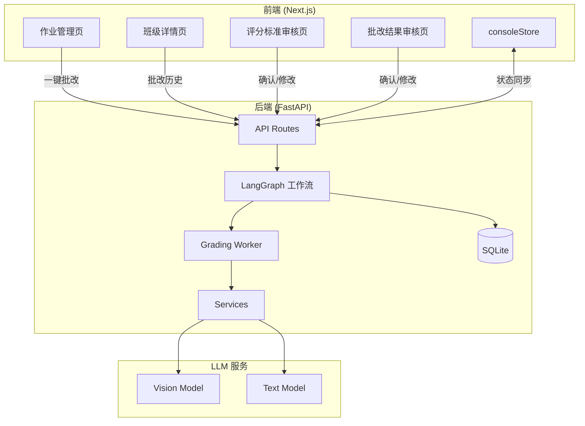
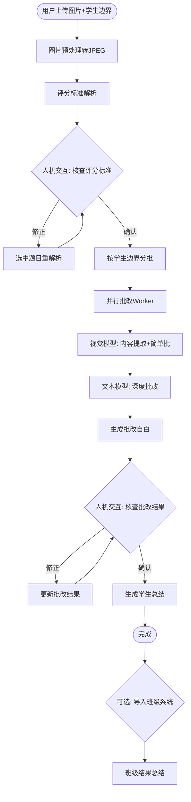

# Design Document: 批改工作流系统重构 v2

## Overview

本设计文档描述批改工作流系统 v2 的技术架构和实现方案。系统采用 LangGraph 状态机实现工作流编排，支持双阶段批改（视觉模型+文本模型）、工作流暂停态设计、SQLite 持久化存储，并与现有班级系统深度集成。

核心设计决策：
- **模型适配**: OpenRouter 适配（已完成）
- **数据存储**: SQLite 简单持久化
- **作业批改**: 老师一键批改，不自动触发
- **人机交互**: 工作流进入暂停态（WAITING_FOR_HUMAN），无超时
- **批改自白**: 在人机交互之前生成，辅助查漏补缺

## Architecture

### 系统架构图



### 核心工作流



## Components and Interfaces

### 1. 工作流状态管理

#### WorkflowStatus 枚举
```python
class WorkflowStatus(Enum):
    RUNNING = "running"
    WAITING_FOR_HUMAN = "waiting_for_human"  # 暂停态
    COMPLETED = "completed"
    FAILED = "failed"
```

#### PausePoint 枚举
```python
class PausePoint(Enum):
    RUBRIC_REVIEW = "rubric_review"      # 评分标准检查
    GRADING_REVIEW = "grading_review"    # 批改结果检查
```

### 2. 后端服务组件

#### 2.1 GradingWorker (新增)
位置: `backend/src/services/grading_worker.py`

```python
class GradingWorker:
    """双阶段批改 Worker"""
    
    async def process_student(
        self,
        student_key: str,
        images: List[bytes],
        parsed_rubric: Dict[str, Any]
    ) -> StudentGradingResult:
        """
        处理单个学生的批改
        
        阶段1: 视觉模型 - 内容提取 + 初步批改
        阶段2: 文本模型 - 深度批改 + 详细评语
        """
        pass
    
    async def vision_grading(
        self,
        images: List[bytes],
        rubric_context: str
    ) -> VisionGradingResult:
        """视觉模型批改"""
        pass
    
    async def text_grading(
        self,
        vision_result: VisionGradingResult,
        rubric_context: str
    ) -> TextGradingResult:
        """文本模型深度批改"""
        pass
```

#### 2.2 StudentSummary (新增)
位置: `backend/src/services/student_summary.py`

```python
class StudentSummaryService:
    """学生总结生成服务"""
    
    async def generate_summary(
        self,
        student_result: StudentGradingResult
    ) -> str:
        """生成学生批改总结"""
        pass
```

#### 2.3 GradingSelfReport (新增)
位置: `backend/src/services/grading_self_report.py`

```python
class GradingSelfReportService:
    """批改自白生成服务"""
    
    async def generate_self_report(
        self,
        grading_result: Dict[str, Any],
        rubric: Dict[str, Any]
    ) -> str:
        """
        生成批改自白
        
        包含:
        - 批改过程说明
        - 可疑位置标记
        - 建议人工复核的点
        """
        pass
```

#### 2.4 工作流恢复 API (新增)
位置: `backend/src/api/routes/grading_resume.py`

```python
@router.post("/grading/{batch_id}/resume")
async def resume_workflow(
    batch_id: str,
    action: ResumeAction,
    data: Optional[Dict[str, Any]] = None
):
    """
    恢复工作流执行
    
    action:
    - confirm_rubric: 确认评分标准
    - modify_rubric: 修改评分标准
    - confirm_results: 确认批改结果
    - modify_result: 修改单个学生结果
    """
    pass

@router.get("/grading/{batch_id}/state")
async def get_workflow_state(batch_id: str):
    """获取工作流当前状态"""
    pass
```

### 3. 前端组件

#### 3.1 批改结果核查页 (新增)
位置: `frontend/src/app/grading/results-review/[batchId]/page.tsx`

```typescript
interface ResultsReviewPageProps {
  batchId: string;
}

// 功能:
// - 显示所有学生的批改结果
// - 显示每个学生的批改自白
// - 支持修改分数和评语
// - 确认后生成学生总结
```

#### 3.2 班级详情页扩展 (修改)
位置: `frontend/src/app/teacher/class/[id]/page.tsx`

```typescript
// 新增 "批改历史" Tab
// - 显示该班级的所有批改记录
// - 点击记录跳转到批改结果页
```

#### 3.3 作业管理页扩展 (修改)
位置: `frontend/src/app/teacher/homework/page.tsx`

```typescript
// 新增 "一键批改" 按钮
// - 触发批改工作流
// - 显示批改进度
```

#### 3.4 consoleStore 扩展 (修改)
位置: `frontend/src/store/consoleStore.ts`

```typescript
interface ConsoleState {
  // 新增暂停态管理
  workflowStatus: WorkflowStatus;
  pausePoint: PausePoint | null;
  pausedData: any;
  
  // 新增方法
  resumeWorkflow: (action: string, data?: any) => Promise<void>;
  refreshWorkflowState: () => Promise<void>;
}
```

### 4. API 接口设计

#### 4.1 班级系统集成 API

```typescript
// 导入批改结果到班级
POST /api/grading/{batch_id}/import-to-class
Body: {
  class_ids: string[],
  student_mapping: { student_key: student_id }[]
}

// 撤销导入
POST /api/grading/{batch_id}/revoke
Body: {
  class_id: string
}

// 获取班级批改历史
GET /api/class/{class_id}/grading-history
Response: GradingHistory[]

// 一键批改
POST /api/homework/{homework_id}/grade
Body: {
  submission_ids?: string[]  // 可选，不传则批改全部
}
```

## Data Models

### SQLite 数据库表

#### grading_history (批改历史)
```sql
CREATE TABLE grading_history (
    id TEXT PRIMARY KEY,
    batch_id TEXT UNIQUE NOT NULL,
    class_ids TEXT,              -- JSON array
    created_at TEXT NOT NULL,
    completed_at TEXT,
    status TEXT NOT NULL DEFAULT 'pending',  -- pending, waiting, completed, imported, revoked
    total_students INTEGER DEFAULT 0,
    average_score REAL,
    result_data TEXT             -- JSON: 完整批改结果
);
```

#### student_grading_results (学生批改结果)
```sql
CREATE TABLE student_grading_results (
    id TEXT PRIMARY KEY,
    grading_history_id TEXT REFERENCES grading_history(id),
    student_key TEXT NOT NULL,
    class_id TEXT,
    student_id TEXT,             -- 关联的班级系统学生ID
    score REAL,
    max_score REAL,
    summary TEXT,                -- 学生总结
    self_report TEXT,            -- 批改自白
    result_data TEXT,            -- JSON: 详细批改数据
    imported_at TEXT,
    revoked_at TEXT
);
```

#### workflow_state (工作流状态)
```sql
CREATE TABLE workflow_state (
    id TEXT PRIMARY KEY,
    batch_id TEXT UNIQUE NOT NULL,
    status TEXT NOT NULL DEFAULT 'running',  -- running, waiting_for_human, completed, failed
    pause_point TEXT,            -- rubric_review, grading_review
    state_data TEXT,             -- JSON: 完整工作流状态
    created_at TEXT NOT NULL,
    updated_at TEXT NOT NULL
);
```

### Pydantic 模型

```python
class WorkflowStateModel(BaseModel):
    id: str
    batch_id: str
    status: WorkflowStatus
    pause_point: Optional[PausePoint]
    state_data: Optional[Dict[str, Any]]
    created_at: datetime
    updated_at: datetime

class GradingHistoryModel(BaseModel):
    id: str
    batch_id: str
    status: str
    class_ids: Optional[List[str]]
    created_at: datetime
    completed_at: Optional[datetime]
    total_students: int
    average_score: Optional[float]

class StudentGradingResultModel(BaseModel):
    id: str
    grading_history_id: str
    student_key: str
    class_id: Optional[str]
    student_id: Optional[str]
    score: Optional[float]
    max_score: Optional[float]
    summary: Optional[str]
    self_report: Optional[str]
    result_data: Optional[Dict[str, Any]]
    imported_at: Optional[datetime]
    revoked_at: Optional[datetime]
```

## Correctness Properties

*A property is a characteristic or behavior that should hold true across all valid executions of a system—essentially, a formal statement about what the system should do. Properties serve as the bridge between human-readable specifications and machine-verifiable correctness guarantees.*

### Property 1: Image Preprocessing Format Consistency
*For any* valid image input (PNG, JPEG, WebP, etc.), the preprocessing function SHALL output a valid JPEG image that can be decoded without errors.
**Validates: Requirements 1.1, 1.3**

### Property 2: Workflow State Transition Validity
*For any* workflow execution, the state transitions SHALL follow the valid state machine:
- RUNNING → WAITING_FOR_HUMAN (at pause points)
- WAITING_FOR_HUMAN → RUNNING (on resume)
- RUNNING → COMPLETED (on success)
- RUNNING → FAILED (on error)
- WAITING_FOR_HUMAN → FAILED (on error)
**Validates: Requirements 2.1, 2.4, 4.1, 4.5**

### Property 3: State Persistence Round-Trip
*For any* workflow state saved to SQLite, retrieving the state SHALL return an equivalent object with all fields preserved.
**Validates: Requirements 2.5, 6.2, 6.3**

### Property 4: Student Boundary Splitting Completeness
*For any* set of images with student boundaries, splitting by boundaries SHALL produce exactly one group per student, and the union of all groups SHALL equal the original image set.
**Validates: Requirements 3.1**

### Property 5: Report Generation Completeness
*For any* completed grading workflow, every student SHALL have both a self_report (generated before review) and a summary (generated after confirmation).
**Validates: Requirements 3.4, 4.4**

### Property 6: Class Import Mapping Correctness
*For any* import operation with a student_key to student_id mapping, the resulting student_grading_results SHALL have the correct class_id and student_id fields populated.
**Validates: Requirements 5.2, 5.3**

### Property 7: Grading Result Modification Persistence
*For any* modification to a student's grading result, the updated score and feedback SHALL be persisted and retrievable.
**Validates: Requirements 4.3**

### Property 8: Class Grading History Filtering
*For any* class_id query, the returned grading history SHALL only contain records where class_ids includes the queried class_id.
**Validates: Requirements 5.4**

### Property 9: Revocation Status Update
*For any* revocation operation, the affected student_grading_results SHALL have revoked_at set to a non-null timestamp.
**Validates: Requirements 5.5**

### Property 10: Error State Persistence
*For any* workflow that fails, the error state SHALL be persisted with error details, and the workflow SHALL be resumable or retryable.
**Validates: Requirements 6.4**

## Error Handling

### 工作流错误处理

1. **LLM 调用失败**
   - 自动重试 3 次，指数退避
   - 记录错误到 workflow_state.state_data
   - 状态转为 FAILED，允许手动重试

2. **图像处理失败**
   - 跳过无法处理的图像
   - 记录警告，继续处理其他图像
   - 在结果中标记跳过的页面

3. **数据库操作失败**
   - 事务回滚
   - 记录错误日志
   - 返回友好错误信息

4. **暂停态超时**
   - 无超时限制
   - 状态持久化到 SQLite
   - 支持任意时间后恢复

### 前端错误处理

1. **API 调用失败**
   - 显示错误提示
   - 提供重试按钮
   - 保持当前状态

2. **WebSocket 断开**
   - 自动重连
   - 恢复状态同步
   - 显示连接状态

## Testing Strategy

### 单元测试

1. **服务层测试**
   - GradingWorker 双阶段批改逻辑
   - StudentSummaryService 总结生成
   - GradingSelfReportService 自白生成
   - SQLite 数据操作

2. **API 测试**
   - 工作流恢复 API
   - 班级集成 API
   - 状态查询 API

### 属性测试 (Property-Based Testing)

使用 Hypothesis 库进行属性测试：

1. **Property 1**: 图像格式转换一致性
2. **Property 2**: 工作流状态转换有效性
3. **Property 3**: 状态持久化往返一致性
4. **Property 4**: 学生边界分割完整性
5. **Property 5**: 报告生成完整性
6. **Property 6**: 班级导入映射正确性
7. **Property 7**: 批改结果修改持久化
8. **Property 8**: 班级历史过滤正确性
9. **Property 9**: 撤销状态更新
10. **Property 10**: 错误状态持久化

### 集成测试

1. **端到端工作流测试**
   - 完整批改流程
   - 暂停和恢复
   - 班级导入

2. **前端集成测试**
   - 页面交互
   - 状态同步
   - 错误处理

## File Changes Summary

### 新增文件

| 文件 | 说明 |
|------|------|
| `backend/src/services/grading_worker.py` | 双阶段批改 Worker |
| `backend/src/services/student_summary.py` | 学生总结生成 |
| `backend/src/services/grading_self_report.py` | 批改自白生成 |
| `backend/src/api/routes/grading_resume.py` | 工作流恢复 API |
| `frontend/src/app/grading/results-review/[batchId]/page.tsx` | 批改结果核查页面 |

### 修改文件

| 文件 | 修改内容 |
|------|----------|
| `backend/src/graphs/batch_grading.py` | 暂停态逻辑、双阶段 Worker |
| `backend/src/services/rubric_parser.py` | ScoringPoint 修复（已完成） |
| `frontend/src/components/bookscan/Gallery.tsx` | 文件删除冲突修复 |
| `frontend/src/app/grading/rubric-review/[batchId]/page.tsx` | 人机交互增强 |
| `frontend/src/app/teacher/class/[id]/page.tsx` | 批改历史 Tab |
| `frontend/src/app/teacher/homework/page.tsx` | 一键批改按钮 |
| `frontend/src/store/consoleStore.ts` | 暂停态状态管理 |

### 已完成文件（无需修改）

| 文件 | 说明 |
|------|------|
| `backend/src/db/sqlite.py` | SQLite 初始化和操作（已完成） |
| `backend/src/config/llm.py` | LLM 配置（已完成） |
| `backend/src/services/llm_client.py` | 统一 LLM 客户端（已完成） |
