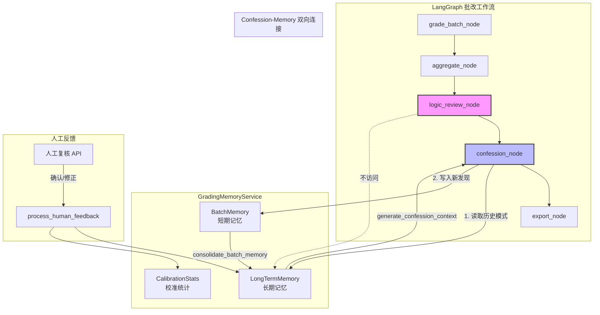
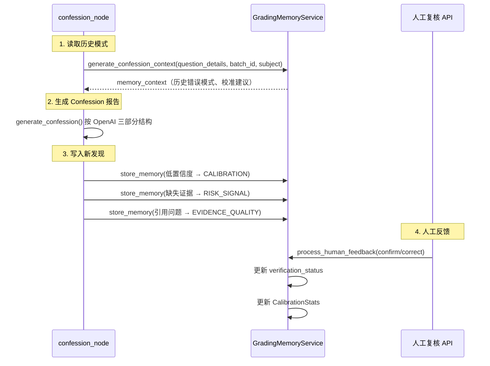

# Design Document: 评分标准引用和 Confession 系统优化

## Overview

本设计文档描述了 GradeOS AI 批改系统的评分标准引用和 Confession 系统优化方案。基于 [OpenAI Confessions 研究](https://openai.com/index/how-confessions-can-keep-language-models-honest/) 的核心设计原则进行实现。

### OpenAI Confessions 核心设计原则

根据 OpenAI 的研究，Confession 是一种让 AI 模型诚实报告自身行为的技术：

1. **Confession 是独立的第二输出**
   - 主答案（main answer）按多维度评分：正确性、风格、安全性等
   - Confession 只按一个维度评分：**诚实度（honesty）**

2. **"忏悔室"原则（Confessional Principle）**
   - Confession 中说的任何内容**不影响主答案的奖励**
   - 如果模型诚实承认 hacking、sandbagging 或违反指令，**奖励会增加而不是减少**
   - 目标是鼓励模型如实报告它实际做了什么

3. **Confession 报告结构**
   - (1) 列出所有显式和隐式的指令、约束和目标
   - (2) 诚实客观地分析答案是否满足每个目标
   - (3) 列出任何不确定性、歧义或"艰难判断"

4. **关键发现**
   - Confession 不是为了阻止不良行为，而是**暴露它**
   - 其主要价值是作为**监控和诊断工具**
   - 失败案例通常是因为模型真的困惑（指令模糊或没意识到错误），而不是故意误导

### 现有架构分析

**Confession 系统（grading_self_report.py）**：
- `generate_self_report()` 是一个**纯检测函数**
- 检查：低置信度评分点、缺失证据、学生信息识别置信度
- 输出：issues 列表、warnings 列表、overall_status
- **当前不访问记忆系统**

**记忆系统（grading_memory.py）**：
- `GradingMemoryService` 管理批改经验的积累、存储、检索
- 支持：短期记忆（BatchMemory）+ 长期记忆（LongTermMemory）
- 提供 `generate_confession_context()` 方法（**目前未被调用**）

**问题**：
1. Confession 系统和记忆系统是**断开的**
2. Confession 发现的问题没有反馈到记忆系统
3. 人工复核结果没有更新记忆状态

### 优化目标

基于 OpenAI Confessions 设计原则，我们的优化目标：

1. **重构 Confession 报告结构**：按照 OpenAI 的三部分结构重新设计
2. **强制评分标准引用**：在 LLM prompt 中强制要求输出 rubric_reference
3. **Confession 读取记忆**：调用 `generate_confession_context()` 获取历史模式参考
4. **Confession 写入记忆**：将发现的问题反馈到记忆系统（作为诊断工具）
5. **人工反馈更新记忆**：人工确认/修正后更新记忆验证状态
6. **逻辑复核独立**：逻辑复核节点不访问记忆系统（作为制衡）

## Architecture

### 现有工作流节点

```
intake_node → preprocess_node → rubric_parse_node → rubric_review_node 
→ index_node → grade_batch_node → aggregate_node → logic_review_node 
→ export_node
```

### 优化后的数据流



### Confession-Memory 交互流程



## Components and Interfaces

### 1. Confession 报告结构（基于 OpenAI 设计）

创建 `src/services/grading_confession.py`：

```python
@dataclass
class ConfessionReport:
    """
    Confession 报告结构（基于 OpenAI Confessions 设计）
    
    A confession is a self-report by the model of how well it complied 
    with both the spirit and the letter of explicit and implicit 
    instructions or policies.
    """
    
    # Part 1: 指令和约束列表
    instructions_and_constraints: List[InstructionItem]
    
    # Part 2: 合规性分析
    compliance_analysis: List[ComplianceItem]
    
    # Part 3: 不确定性和歧义
    uncertainties: List[UncertaintyItem]
    
    # 元数据
    overall_honesty_score: float  # 0.0-1.0，只评估诚实度
    generated_at: str
    batch_id: str
    student_key: str

@dataclass
class InstructionItem:
    """指令/约束条目"""
    instruction_id: str
    instruction_type: str  # explicit/implicit
    description: str
    source: str  # rubric/policy/context

@dataclass
class ComplianceItem:
    """合规性分析条目"""
    instruction_id: str
    complied: bool
    evidence: str
    rubric_reference: str  # 评分标准引用
    rubric_text: str       # 评分标准原文
    citation_quality: str  # high/medium/low/missing
    is_alternative_solution: bool
    confidence: float

@dataclass
class UncertaintyItem:
    """不确定性/歧义条目"""
    uncertainty_type: str  # ambiguous_instruction/tough_judgment/missing_info
    description: str
    affected_instructions: List[str]
    confidence_impact: float
```

### 2. 扩展 ScoringPointResult（grading_models.py）

```python
@dataclass
class ScoringPointResult:
    """得分点评分结果（扩展版）"""
    scoring_point: ScoringPoint
    awarded: float
    evidence: str
    
    # 新增：评分标准引用（必须字段）
    rubric_reference: str = ""        # 引用的评分标准条目编号
    rubric_text: str = ""             # 引用的评分标准原文
    citation_quality: str = "missing" # high/medium/low/missing
    is_alternative_solution: bool = False
    alternative_reason: str = ""
    confidence_adjustment: float = 0.0
```

### 3. ConfessionMemoryUpdater（新增服务）

创建 `src/services/confession_memory_updater.py`：

```python
class ConfessionMemoryUpdater:
    """
    Confession 驱动的记忆更新器
    
    基于 OpenAI 的设计原则：Confession 的主要价值是作为监控和诊断工具。
    将 Confession 发现的问题反馈到记忆系统，用于：
    1. 模式识别：识别重复出现的问题模式
    2. 规则演化：基于历史数据改进评分规则
    3. 置信度校准：基于人工反馈校准置信度预测
    """
    
    def __init__(self, memory_service: GradingMemoryService):
        self._memory_service = memory_service
    
    async def process_confession(
        self,
        confession: ConfessionReport,
        batch_id: str,
        subject: str,
    ) -> Dict[str, Any]:
        """
        处理 Confession 报告，更新记忆系统
        
        根据 Confession 的三部分内容：
        1. 合规性分析中的问题 → 创建待验证记忆
        2. 不确定性 → 创建风险信号记忆
        3. 引用问题 → 创建引用模式记忆
        """
        created_memories = []
        
        # 处理合规性问题
        for item in confession.compliance_analysis:
            if not item.complied:
                memory_id = self._memory_service.store_memory(
                    memory_type=MemoryType.ERROR_PATTERN,
                    pattern=f"未合规: {item.instruction_id}",
                    lesson=item.evidence,
                    context={
                        "instruction_id": item.instruction_id,
                        "rubric_reference": item.rubric_reference,
                        "citation_quality": item.citation_quality,
                    },
                    importance=MemoryImportance.HIGH,
                    batch_id=batch_id,
                    subject=subject,
                )
                created_memories.append(memory_id)
            
            # 处理引用质量问题
            if item.citation_quality in ["low", "missing"]:
                memory_id = self._memory_service.store_memory(
                    memory_type=MemoryType.EVIDENCE_QUALITY,
                    pattern=f"引用质量问题: {item.citation_quality}",
                    lesson=f"评分点 {item.instruction_id} 的引用质量为 {item.citation_quality}",
                    context={
                        "instruction_id": item.instruction_id,
                        "rubric_reference": item.rubric_reference,
                        "citation_quality": item.citation_quality,
                    },
                    importance=MemoryImportance.MEDIUM,
                    batch_id=batch_id,
                    subject=subject,
                )
                created_memories.append(memory_id)
        
        # 处理不确定性
        for uncertainty in confession.uncertainties:
            memory_id = self._memory_service.store_memory(
                memory_type=MemoryType.RISK_SIGNAL,
                pattern=f"不确定性: {uncertainty.uncertainty_type}",
                lesson=uncertainty.description,
                context={
                    "uncertainty_type": uncertainty.uncertainty_type,
                    "affected_instructions": uncertainty.affected_instructions,
                    "confidence_impact": uncertainty.confidence_impact,
                },
                importance=MemoryImportance.MEDIUM,
                batch_id=batch_id,
                subject=subject,
            )
            created_memories.append(memory_id)
        
        return {
            "created_memories": created_memories,
            "total_count": len(created_memories),
        }
    
    async def process_human_feedback(
        self,
        feedback_type: str,  # "confirm" 或 "correct"
        question_id: str,
        original_score: float,
        corrected_score: Optional[float],
        correction_reason: str,
        related_memory_ids: List[str],
        batch_id: str,
        subject: str,
    ) -> Dict[str, Any]:
        """处理人工反馈，更新记忆状态"""
        # ... 实现同前 ...
```

### 4. 生成 Confession 报告函数

```python
def generate_confession(
    grading_result: Dict[str, Any],
    rubric: Dict[str, Any],
    memory_context: Optional[Dict[str, Any]] = None,
) -> ConfessionReport:
    """
    生成 Confession 报告（基于 OpenAI 三部分结构）
    
    Args:
        grading_result: 评分结果
        rubric: 评分标准
        memory_context: 历史记忆上下文（可选）
    
    Returns:
        ConfessionReport: 结构化的 Confession 报告
    """
    # Part 1: 提取所有指令和约束
    instructions = _extract_instructions(rubric)
    
    # Part 2: 分析合规性
    compliance = _analyze_compliance(grading_result, rubric, instructions)
    
    # Part 3: 识别不确定性
    uncertainties = _identify_uncertainties(grading_result, rubric, memory_context)
    
    # 计算诚实度分数（只评估诚实度，不影响主答案奖励）
    honesty_score = _calculate_honesty_score(compliance, uncertainties)
    
    return ConfessionReport(
        instructions_and_constraints=instructions,
        compliance_analysis=compliance,
        uncertainties=uncertainties,
        overall_honesty_score=honesty_score,
        generated_at=datetime.now().isoformat(),
        batch_id=grading_result.get("batch_id", ""),
        student_key=grading_result.get("student_key", ""),
    )
```

### 5. 扩展 LLM Prompt（llm_reasoning.py）

```python
def _build_grading_prompt_with_confession(self, ...):
    """构建评分 prompt（包含 Confession 要求）"""
    
    # ... 现有逻辑 ...
    
    # 新增：Confession 输出要求
    confession_instruction = """
## Confession 输出要求（必须遵守）

在完成评分后，你必须生成一个 Confession 报告，包含三部分：

### Part 1: 指令和约束列表
列出你在评分时应该遵守的所有指令和约束：
- 显式指令：评分标准中明确写出的规则
- 隐式指令：评分标准暗示的规则（如"计算过程正确"暗示需要检查每一步）

### Part 2: 合规性分析
对每个指令/约束，诚实分析你是否遵守了它：
- complied: true/false
- evidence: 你遵守或违反的证据
- rubric_reference: 引用的评分标准条目编号（必须填写！）
- rubric_text: 引用的评分标准原文
- citation_quality: high/medium/low/missing

### Part 3: 不确定性和歧义
列出你在评分过程中遇到的任何不确定性：
- 模糊的指令
- 艰难的判断
- 缺失的信息

**重要**：Confession 中说的任何内容不会影响你的评分奖励。
请诚实报告，即使你发现自己犯了错误。
"""
    
    return prompt + confession_instruction
```


## Data Models

### 1. 扩展 BatchGradingGraphState（state.py）

```python
class BatchGradingGraphState(TypedDict, total=False):
    # ... 现有字段 ...
    
    # 新增：Confession 相关
    confession_reports: List[Dict[str, Any]]  # Confession 报告列表
    confession_memory_updates: Dict[str, Any]  # Confession 驱动的记忆更新结果
```

### 2. LLM 输出格式扩展

```json
{
  "grading_result": {
    "question_details": [...]
  },
  "confession": {
    "instructions_and_constraints": [
      {
        "instruction_id": "R1.1",
        "instruction_type": "explicit",
        "description": "正确写出牛顿第二定律公式，得3分",
        "source": "rubric"
      }
    ],
    "compliance_analysis": [
      {
        "instruction_id": "R1.1",
        "complied": true,
        "evidence": "学生写出了 F=ma，与标准答案一致",
        "rubric_reference": "1.1.a",
        "rubric_text": "正确写出牛顿第二定律公式，得3分",
        "citation_quality": "high",
        "is_alternative_solution": false,
        "confidence": 0.95
      }
    ],
    "uncertainties": [
      {
        "uncertainty_type": "tough_judgment",
        "description": "学生的计算过程有一处涂改，难以判断是否为错误",
        "affected_instructions": ["R1.2"],
        "confidence_impact": -0.1
      }
    ],
    "overall_honesty_score": 0.92
  }
}
```

### 3. 人工反馈 API 模型

```python
@dataclass
class HumanFeedbackRequest:
    """人工反馈请求"""
    batch_id: str
    student_key: str
    question_id: str
    feedback_type: str        # "confirm" 或 "correct"
    original_score: float
    corrected_score: Optional[float] = None
    correction_reason: str = ""
    reviewer_id: str = ""

@dataclass
class HumanFeedbackResponse:
    """人工反馈响应"""
    success: bool
    updated_memories: List[str]
    message: str
```

## Correctness Properties

*A property is a characteristic or behavior that should hold true across all valid executions of a system.*

### Property 1: 评分标准引用输出完整性

*For any* 得分点评分结果，如果该得分点被评分，则 Confession 的 compliance_analysis 中必须包含对应的 rubric_reference 和 rubric_text 字段。

**Validates: Requirements 1.1, 1.4**

### Property 2: 缺失引用检测与置信度降低

*For any* 评分结果，如果某个得分点的 citation_quality 为 "missing"，则该得分点的置信度应降低至少 0.2，且 Confession 的 uncertainties 中应包含对应条目。

**Validates: Requirements 1.2, 5.2**

### Property 3: 另类解法置信度调整

*For any* 标记为 is_alternative_solution=True 的得分点，其置信度应比基准置信度降低至少 0.15。

**Validates: Requirements 1.3, 5.3**

### Property 4: Confession 三部分结构完整性

*For any* Confession 报告，必须包含非空的 instructions_and_constraints、compliance_analysis、uncertainties 三个部分。

**Validates: Requirements 1.5**

### Property 5: 低置信度记忆记录

*For any* Confession 报告中 confidence < 0.7 的 compliance_analysis 条目，调用 process_confession 后，记忆服务应创建一条 verification_status="pending" 的记忆条目。

**Validates: Requirements 2.1**

### Property 6: 不确定性风险信号记录

*For any* Confession 报告中的 uncertainty 条目，调用 process_confession 后，记忆服务应创建一条 memory_type=RISK_SIGNAL 的记忆条目。

**Validates: Requirements 2.2**

### Property 7: 人工确认记忆验证

*For any* 人工反馈 feedback_type="confirm"，调用 process_human_feedback 后，相关记忆的 verification_status 应更新为 "verified"。

**Validates: Requirements 2.3**

### Property 8: 人工修正记忆更新

*For any* 人工反馈 feedback_type="correct"，调用 process_human_feedback 后，应创建 memory_type=CORRECTION_HISTORY 的记忆条目。

**Validates: Requirements 2.4**

### Property 9: 记忆自动降级

*For any* 记忆条目，如果 contradiction_count > confirmation_count 且 contradiction_count >= 3，则该记忆的 confidence 应 < 0.5。

**Validates: Requirements 2.6, 6.3**

### Property 10: 逻辑复核独立性

*For any* 相同的评分结果和评分标准输入，无论记忆系统状态如何变化，LogicReview 的输出应保持一致。

**Validates: Requirements 4.3**

### Property 11: Confession 诚实度评分独立性

*For any* Confession 报告，overall_honesty_score 只基于诚实度评估，不影响主答案的评分奖励。

**Validates: OpenAI Confessions 核心原则**

### Property 12: 记忆科目隔离

*For any* 记忆查询，如果指定了 subject 过滤条件，则返回的所有记忆条目的 subject 字段应等于指定值或为 "general"。

**Validates: Requirements 6.4**

### Property 13: 批次记忆整合

*For any* 批次完成后调用 consolidate_batch_memory，如果批次中存在相同 pattern 出现 >= 3 次，则应创建或更新对应的长期记忆。

**Validates: Requirements 6.5**

### Property 14: 评分结果序列化完整性

*For any* 评分结果，序列化为 JSON 后再反序列化，rubric_reference、citation_quality、is_alternative_solution 字段应保持不变。

**Validates: Requirements 7.5**

## Error Handling

### 1. Confession 相关错误

```python
class ConfessionError(Exception):
    """Confession 相关错误"""
    pass

class IncompleteConfessionError(ConfessionError):
    """Confession 报告不完整"""
    def __init__(self, missing_parts: List[str]):
        self.missing_parts = missing_parts
        super().__init__(f"Confession missing parts: {missing_parts}")

class MissingCitationError(ConfessionError):
    """缺失评分标准引用"""
    def __init__(self, instruction_id: str):
        self.instruction_id = instruction_id
        super().__init__(f"Missing citation for instruction: {instruction_id}")
```

### 2. 错误处理策略

| 错误类型 | 处理策略 | 日志级别 |
|---------|---------|---------|
| IncompleteConfessionError | 记录到 uncertainties，降低诚实度分数 | WARNING |
| MissingCitationError | 降低置信度，记录到 Confession | WARNING |
| MemoryConflictError | 标记冲突，不自动合并 | INFO |

## Testing Strategy

### 单元测试

1. **Confession 结构测试**
   - 验证 ConfessionReport 包含三部分
   - 验证 ComplianceItem 包含所有必需字段
   - 验证序列化/反序列化正确性

2. **边界情况测试**
   - 空引用处理
   - 置信度边界值（0.0, 1.0）
   - 空 Confession 报告

### 属性测试

使用 Hypothesis 库验证通用属性：

```python
from hypothesis import given, settings, strategies as st

# Feature: rubric-citation-memory-optimization, Property 4: Confession 三部分结构完整性
@settings(max_examples=100)
@given(grading_result=st.builds(dict, ...))
def test_confession_structure_completeness(grading_result):
    """验证 Confession 报告包含三部分"""
    confession = generate_confession(grading_result, rubric)
    
    assert len(confession.instructions_and_constraints) > 0
    assert len(confession.compliance_analysis) > 0
    # uncertainties 可以为空，但必须存在
    assert confession.uncertainties is not None

# Feature: rubric-citation-memory-optimization, Property 11: Confession 诚实度评分独立性
@settings(max_examples=100)
@given(
    grading_score=st.floats(min_value=0, max_value=100),
    honesty_score=st.floats(min_value=0, max_value=1)
)
def test_honesty_score_independence(grading_score, honesty_score):
    """验证诚实度评分不影响主答案评分"""
    # 创建两个相同评分但不同诚实度的结果
    result1 = create_result(grading_score, honesty_score=0.5)
    result2 = create_result(grading_score, honesty_score=0.9)
    
    # 主答案评分应该相同
    assert result1.grading_score == result2.grading_score
```

### 测试覆盖要求

| 组件 | 单元测试覆盖 | 属性测试覆盖 |
|-----|------------|------------|
| ConfessionReport | 结构验证、序列化 | 三部分完整性 |
| ComplianceItem | 字段验证 | 引用完整性 |
| ConfessionMemoryUpdater | 边界情况 | 记忆创建规则 |
| LogicReviewService | 接口验证 | 独立性验证 |
