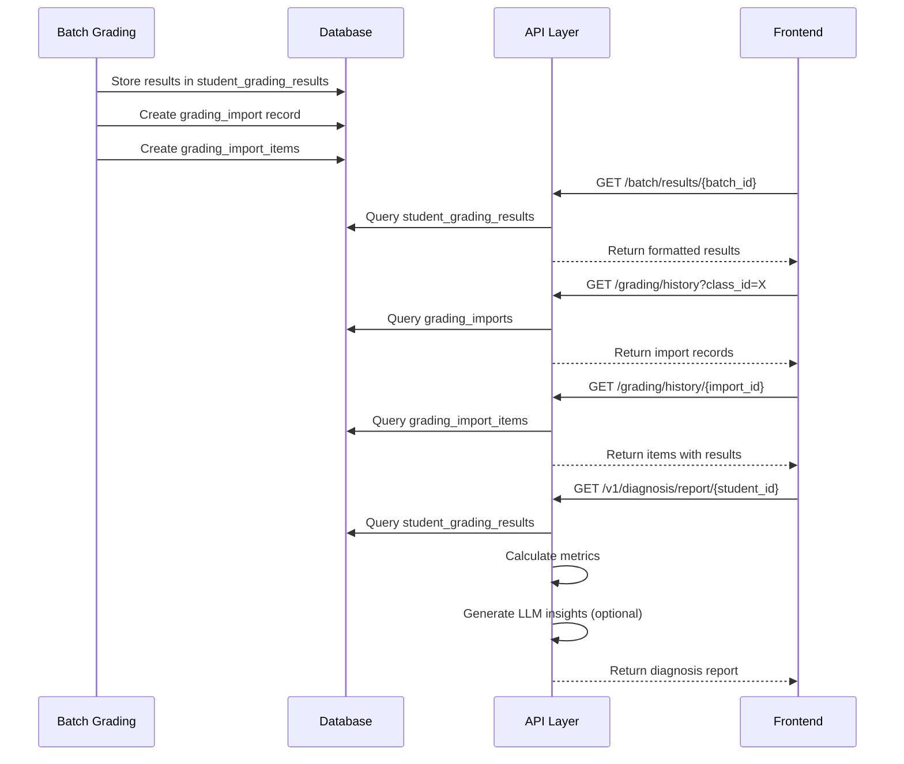

# Design Document: Teaching Cockpit, Mistake Analysis, and Progress Report

## Overview

This design document describes the implementation of three interconnected features that leverage the working batch grading results data in GradeOS:

1. **Teacher Teaching Cockpit** - Enhanced `ResultsView.tsx` component for viewing and managing batch grading results
2. **Student Mistake Analysis** - Enhanced `student/analysis/page.tsx` for extracting and displaying wrong questions
3. **Student Progress Report** - Enhanced `student/report/page.tsx` for displaying personalized learning analytics

The implementation connects existing frontend components to real backend APIs, ensuring data flows correctly from batch grading through to student-facing views.

## Architecture

```mermaid
graph TB
    subgraph Frontend
        TC[Teaching Cockpit<br/>ResultsView.tsx]
        MA[Mistake Analysis<br/>analysis/page.tsx]
        PR[Progress Report<br/>report/page.tsx]
    end
    
    subgraph API Layer
        BR[/api/batch/results/:batch_id]
        GH[/api/grading/history]
        GHD[/api/grading/history/:import_id]
        DR[/api/v1/diagnosis/report/:student_id]
    end
    
    subgraph Database
        SGR[(student_grading_results)]
        GI[(grading_imports)]
        GII[(grading_import_items)]
    end
    
    TC --> BR
    MA --> GH
    MA --> GHD
    PR --> DR
    
    BR --> SGR
    GH --> GI
    GHD --> GII
    DR --> SGR
```

## Components and Interfaces

### 1. Teaching Cockpit Component (ResultsView.tsx)

The existing `ResultsView.tsx` component already handles most of the display logic. Key enhancements:

```typescript
interface TeachingCockpitProps {
  batchId: string;
  onRefresh?: () => void;
}

interface StudentResultDisplay {
  studentName: string;
  score: number;
  maxScore: number;
  percentage: number;
  rank: number;
  startPage?: number;
  endPage?: number;
  questionResults: QuestionResultDisplay[];
  needsConfirmation?: boolean;
}

interface QuestionResultDisplay {
  questionId: string;
  score: number;
  maxScore: number;
  feedback: string;
  studentAnswer?: string;
  pageIndices: number[];
  isCrossPage: boolean;
  scoringPointResults?: ScoringPointResult[];
  confidence?: number;
}

interface ScoringPointResult {
  pointId: string;
  description: string;
  awarded: number;
  maxPoints: number;
  evidence?: string;
  decision?: string;
  reason?: string;
}
```

### 2. Mistake Analysis Component (analysis/page.tsx)

Enhanced data extraction and display:

```typescript
interface WrongQuestionEntry {
  id: string;                    // Unique identifier: `${item_id}-${questionId}`
  questionId: string;
  score: number;
  maxScore: number;
  feedback: string;
  studentAnswer: string;
  scoringPointResults: ScoringPointResult[];
  pageIndices: number[];
  sourceImportId: string;
  isCrossPage?: boolean;
}

interface SummaryStats {
  totalQuestions: number;
  wrongQuestions: number;
  totalScore: number;
  totalMax: number;
  accuracyRate: number;          // Calculated: totalScore / totalMax * 100
}

interface FocusStat {
  questionId: string;
  wrongCount: number;
  totalCount: number;
  ratio: number;                 // wrongCount / totalCount
}
```

### 3. Progress Report Component (report/page.tsx)

Interfaces for diagnosis report display:

```typescript
interface DiagnosisReport {
  studentId: string;
  reportPeriod: string;
  overallAssessment: {
    masteryScore: number;        // 0.0 - 1.0
    improvementRate: number;     // Can be negative
    consistencyScore: number;    // 0 - 100
  };
  progressTrend: TrendDataPoint[];
  knowledgeMap: KnowledgeArea[];
  errorPatterns: {
    mostCommonErrorTypes: ErrorType[];
  };
  personalizedInsights: string[];
}

interface TrendDataPoint {
  date: string;
  score: number;
  average: number;
}

interface KnowledgeArea {
  knowledgeArea: string;
  masteryLevel: number;
  weakPoints: string[];
  strengths: string[];
}

interface ErrorType {
  type: string;
  count: number;
  percentage: number;
}
```

## Data Models

### Backend Data Flow



### Database Schema (Existing)

```sql
-- student_grading_results table
CREATE TABLE student_grading_results (
    id TEXT PRIMARY KEY,
    batch_id TEXT,
    class_id TEXT,
    student_id TEXT,
    student_name TEXT,
    score REAL,
    max_score REAL,
    result_data TEXT,  -- JSON containing questionResults
    created_at TEXT
);

-- grading_imports table
CREATE TABLE grading_imports (
    import_id TEXT PRIMARY KEY,
    batch_id TEXT,
    class_id TEXT,
    assignment_id TEXT,
    student_count INTEGER,
    status TEXT,
    created_at TEXT,
    revoked_at TEXT
);

-- grading_import_items table
CREATE TABLE grading_import_items (
    item_id TEXT PRIMARY KEY,
    import_id TEXT,
    batch_id TEXT,
    class_id TEXT,
    student_id TEXT,
    student_name TEXT,
    status TEXT,
    result TEXT,  -- JSON containing full grading result
    created_at TEXT,
    revoked_at TEXT
);
```

## Correctness Properties

*A property is a characteristic or behavior that should hold true across all valid executions of a system—essentially, a formal statement about what the system should do. Properties serve as the bridge between human-readable specifications and machine-verifiable correctness guarantees.*

### Property 1: Student Results Display Completeness

*For any* batch grading result containing student data, the Teaching Cockpit SHALL display all required fields (studentName, score, maxScore, percentage) for each student, and when expanded, SHALL display all question-level details (questionId, score, maxScore, feedback, pageIndices).

**Validates: Requirements 1.2, 1.3, 1.4**

### Property 2: Results Sorting Order

*For any* list of student results displayed in the Teaching Cockpit, the students SHALL be sorted by score in descending order, such that for any adjacent pair of students (i, i+1), student[i].score >= student[i+1].score.

**Validates: Requirements 1.6**

### Property 3: Wrong Question Extraction Correctness

*For any* grading history containing question results, the Mistake Analysis System SHALL extract exactly those questions where score < maxScore. No question with score >= maxScore SHALL appear in the wrong questions list, and no question with score < maxScore SHALL be omitted.

**Validates: Requirements 2.2**

### Property 4: Wrong Question Display Completeness

*For any* wrong question entry, the Mistake Analysis System SHALL display all required fields (questionId, score, maxScore, feedback, studentAnswer, pageIndices), and when scoringPointResults are present, SHALL display the detailed scoring breakdown.

**Validates: Requirements 2.3, 2.4**

### Property 5: Summary Statistics Calculation

*For any* set of grading results, the Mistake Analysis System SHALL calculate summary statistics such that:
- totalQuestions = count of all questions with maxScore > 0
- wrongQuestions = count of questions where score < maxScore
- totalScore = sum of all question scores
- totalMax = sum of all question maxScores
- accuracyRate = (totalScore / totalMax) * 100

**Validates: Requirements 2.5**

### Property 6: Focus Area Ranking

*For any* set of wrong questions, the focus areas (薄弱集中区) SHALL be ranked by error ratio (wrongCount / totalCount) in descending order, such that for any adjacent pair (i, i+1), focusArea[i].ratio >= focusArea[i+1].ratio.

**Validates: Requirements 2.6**

### Property 7: Diagnosis Report Display Completeness

*For any* diagnosis report returned by the API, the Progress Report System SHALL display all overall assessment metrics (masteryScore, improvementRate, consistencyScore), and when available, SHALL render the progress trend chart, knowledge map radar chart, error patterns bar chart, and personalized insights.

**Validates: Requirements 3.2, 3.3, 3.4, 3.5, 3.6**

### Property 8: Mastery Score Calculation

*For any* student with grading results, the Diagnosis Report API SHALL calculate mastery_score as total_score / total_max, where total_score and total_max are aggregated from all student_grading_results for that student.

**Validates: Requirements 4.3**

### Property 9: Improvement Rate Calculation

*For any* student with at least 2 submissions, the Diagnosis Report API SHALL calculate improvement_rate as (second_half_avg - first_half_avg) / first_half_avg, where submissions are split chronologically into two halves.

**Validates: Requirements 4.4**

### Property 10: Consistency Score Calculation

*For any* student with at least 3 submissions, the Diagnosis Report API SHALL calculate consistency_score based on score variance, where lower variance results in higher consistency score (max 100, min 0).

**Validates: Requirements 4.5**

### Property 11: Cross-Page Question Display

*For any* question with isCrossPage = true, the Teaching Cockpit SHALL display a visual indicator and show all pageIndices where the answer appears. The Mistake Analysis System SHALL preserve this cross-page information when extracting wrong questions.

**Validates: Requirements 5.1, 5.2, 5.3**

### Property 12: Grading History Filtering

*For any* query to the Grading History API with student_id and class_id parameters, all returned results SHALL match the specified filters. No result with a different student_id or class_id SHALL be included.

**Validates: Requirements 4.2**

### Property 13: Class Switch Data Reload

*For any* class selection change in the Mistake Analysis page, the system SHALL reload wrong questions filtered by the newly selected class_id, and the displayed data SHALL reflect only questions from that class.

**Validates: Requirements 6.2**

### Property 14: Cross-Assignment Trend Data Accuracy

*For any* set of grading records displayed in the Performance Dashboard, the trend data SHALL reflect actual statistics from the backend API. The average_score, max_score, and min_score for each record SHALL match the values returned by the Grading_History_API with statistics.

**Validates: Requirements 7.1, 7.2**

### Property 15: Student Progress Tracking Correctness

*For any* student with grading results across multiple assignments, the Performance Dashboard SHALL correctly identify progress or regression by comparing scores chronologically. A student is "improving" if their recent average is higher than their earlier average, and "regressing" if lower.

**Validates: Requirements 7.6, 7.7**

## Performance Dashboard Component (performance/page.tsx)

### Enhanced Interfaces

```typescript
interface GradingRecordWithStats {
  import_id: string;
  batch_id: string;
  class_id: string;
  assignment_id?: string;
  assignment_title?: string;
  student_count: number;
  status: string;
  created_at: string;
  // Real statistics from API
  statistics?: {
    average_score: number;
    max_score: number;
    min_score: number;
    pass_rate: number;
    score_distribution: Record<string, number>;
  };
}

interface StudentProgressData {
  student_id: string;
  student_name: string;
  scores: Array<{
    assignment_id: string;
    assignment_title: string;
    score: number;
    max_score: number;
    date: string;
  }>;
  trend: 'improving' | 'stable' | 'regressing';
  improvement_rate: number;
}

interface AssignmentDotProps {
  assignment: HomeworkResponse;
  isSelected: boolean;
  hasGradingData: boolean;
  averageScore?: number;
  onClick: () => void;
}
```

### Assignment Dot Selector Component

The assignment selector should use circular dots similar to teacher/statistics:

```typescript
// Assignment dot indicator component
const AssignmentDot: React.FC<AssignmentDotProps> = ({
  assignment,
  isSelected,
  hasGradingData,
  averageScore,
  onClick
}) => {
  const getScoreColor = (score?: number) => {
    if (!score) return 'bg-slate-200';
    if (score >= 80) return 'bg-emerald-500';
    if (score >= 60) return 'bg-amber-500';
    return 'bg-rose-500';
  };

  return (
    <div 
      onClick={onClick}
      className={`
        relative w-10 h-10 rounded-full cursor-pointer transition-all
        ${isSelected ? 'ring-2 ring-blue-500 ring-offset-2' : ''}
        ${hasGradingData ? getScoreColor(averageScore) : 'bg-slate-200'}
        hover:scale-110
      `}
      title={`${assignment.title}${averageScore ? ` - 平均分: ${averageScore.toFixed(1)}` : ''}`}
    >
      {hasGradingData && averageScore && (
        <span className="absolute inset-0 flex items-center justify-center text-white text-xs font-bold">
          {Math.round(averageScore)}
        </span>
      )}
    </div>
  );
};
```

### API Enhancement for Statistics

The Grading_History_API should be enhanced to return statistics:

```typescript
// GET /api/grading/history?class_id=X&include_stats=true
interface GradingHistoryResponse {
  records: GradingRecordWithStats[];
  summary: {
    total_records: number;
    total_students_graded: number;
    overall_average: number;
    trend: 'improving' | 'stable' | 'regressing';
  };
}
```

## Error Handling

### Frontend Error Handling

1. **API Fetch Errors**
   - Display user-friendly error message in Chinese
   - Provide retry button
   - Log error details to console for debugging

2. **Empty Data States**
   - Teaching Cockpit: "暂无批改结果" with guidance
   - Mistake Analysis: "暂无错题记录" with empty state illustration
   - Progress Report: "暂无报告数据" with suggestion to complete assignments

3. **Loading States**
   - Show skeleton loaders during data fetch
   - Display progress indicators for long operations

### Backend Error Handling

1. **Database Errors**
   - Return 500 with generic error message
   - Log detailed error for debugging

2. **LLM Failures (Diagnosis Report)**
   - Fall back to calculated metrics without AI insights
   - Return basic personalized_insights based on mastery score

3. **Invalid Parameters**
   - Return 400 with descriptive error message
   - Validate batch_id, student_id, class_id formats

## Testing Strategy

### Unit Tests

Unit tests should cover:
- Data transformation functions (extracting wrong questions, calculating stats)
- Sorting and filtering logic
- Component rendering with various data states
- Error handling paths

### Property-Based Tests

Property-based tests should verify:
- Wrong question extraction correctness (Property 3)
- Summary statistics calculation (Property 5)
- Focus area ranking (Property 6)
- Mastery score calculation (Property 8)
- Improvement rate calculation (Property 9)
- Consistency score calculation (Property 10)

**Testing Framework**: Jest with fast-check for property-based testing

**Configuration**:
- Minimum 100 iterations per property test
- Tag format: **Feature: teaching-cockpit-analysis-report, Property {number}: {property_text}**

### Integration Tests

Integration tests should verify:
- API endpoint responses match expected schemas
- Data flows correctly from batch grading to student views
- Class filtering works correctly across components
