# AI批改LangGraph Agent架构设计文档

## 1. 概述

### 1.1 背景与目标

教务系统需要一套能够对学生上传的作业图片进行自动批改的 LangGraph 工作流系统。本系统旨在实现：

- **完全理解并严格遵循批改标准**：批改必须按照教师提供的评分标准或答案判断错误并计分，不得随意扩展或削弱标准
- **高效严谨**：针对大批量作业，通过合理划分批次并行处理，减少模型输入长度、缩短等待时间并降低 token 消耗，同时保持批改顺序不乱
- **多模态处理，不依赖传统 OCR**：直接利用具备视觉能力的多模态大模型识别学生答案、题目文字、公式等信息，并返回每个文本片段的像素坐标，以便生成批注标记
- **自动识别学生信息**：从作业中提取学生姓名、学号、班级等信息，并对接班级系统，确保评分结果写入对应学生档案
- **支持双模式批改**：高效模式（仅输出得分）和专业模式（包含答案摘要、错误详情解析、学习建议与班级评价）

### 1.2 系统定位

本系统是一个基于 LangGraph 的全栈AI批改解决方案，采用后端服务架构，集成多模态大语言模型、工作流引擎和数据持久化能力。

### 1.3 技术栈

| 技术领域 | 选型 |
|---------|------|
| 工作流引擎 | LangGraph StateGraph |
| 多模态模型 | Gemini 2.5pro / OpenAI Vision / 其他支持视觉的LLM |
| 状态管理 | TypedDict + MemorySaver Checkpointer |
| 文本模型 | OpenRouter / Gemini / OpenAI |
| 数据库 | PostgreSQL（部署在Railway） |
| 用户认证 | Firebase Auth |
| 部署平台 | Railway |

## 2. 架构设计

### 2.1 总体架构

系统采用 Orchestrator-Worker 模式，通过动态路由实现批次并行处理和条件执行。

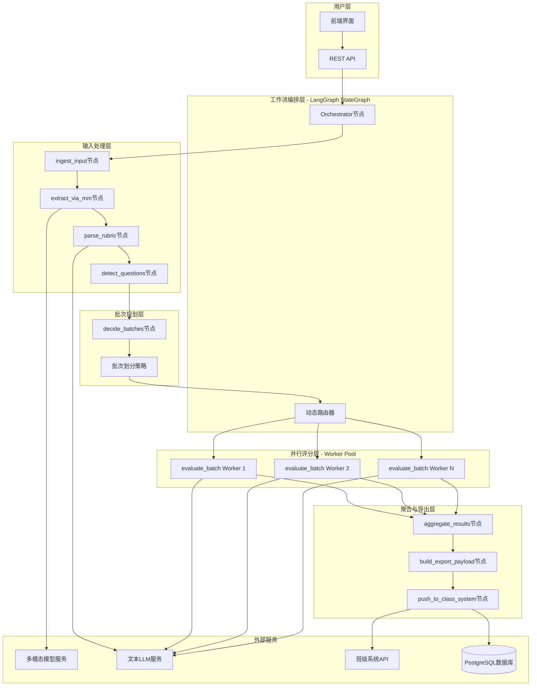

### 2.2 工作流状态模型

系统使用 `GradingState` TypedDict 管理共享状态，所有节点读写同一状态对象。

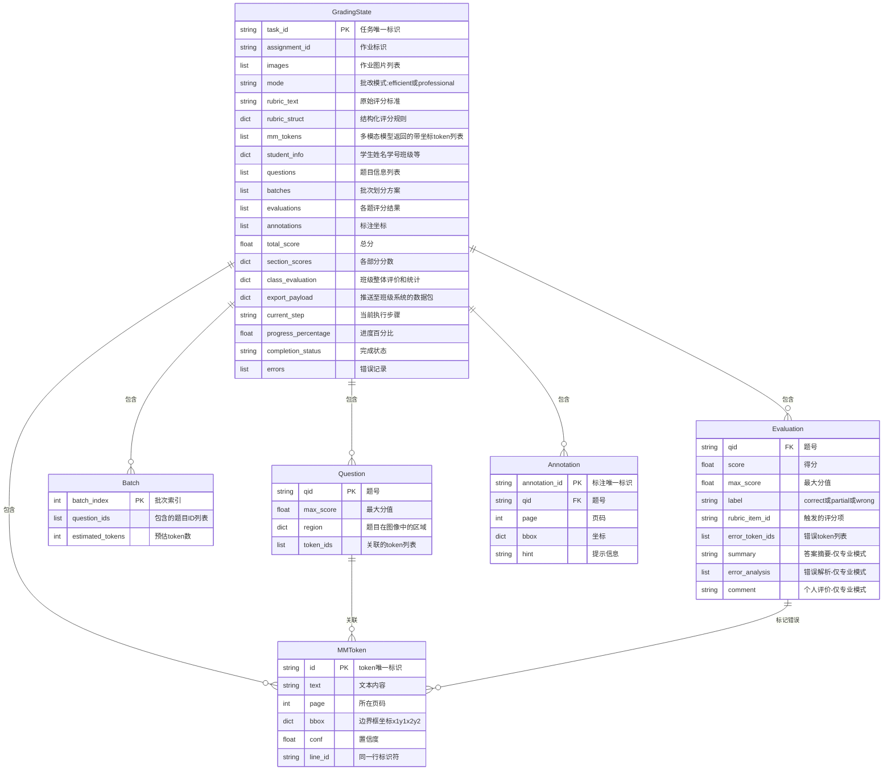

### 2.3 核心节点职责

| 节点名称 | 职责 | 输入 | 输出 |
|---------|------|------|------|
| **ingest_input** | 读取图片、作业编号、评分标准文本与批改模式 | API请求参数 | images、assignment_id、rubric_text、mode |
| **extract_via_mm** | 调用多模态大模型提取文本与坐标，识别学生信息 | images | mm_tokens、student_info |
| **parse_rubric** | 将评分标准解析为结构化JSON | rubric_text | rubric_struct（包含题号、评分项、分值、条件） |
| **detect_questions** | 根据题号、版式和关键字划分每道题 | mm_tokens、rubric_struct | questions（含题号、最大分值、区域、token列表） |
| **decide_batches** | 依据token数量、模式类型决定批次划分 | questions、mode | batches（批次索引、题目列表、预估token） |
| **orchestrator** | 为每个批次使用Send API生成evaluate_batch worker | batches | 启动多个worker |
| **evaluate_batch workers** | 对指定批次内的题目批改 | batch内的questions、rubric_struct、mode | evaluations |
| **aggregate_results** | 收集所有worker输出，计算总分、生成批注坐标、汇总评价 | evaluations、mm_tokens、mode | total_score、section_scores、annotations、class_evaluation |
| **build_export_payload** | 构建符合班级系统API的JSON数据 | student_info、total_score、evaluations、annotations | export_payload |
| **push_to_class_system** | 调用班级系统接口写入数据 | export_payload | 推送结果 |

## 3. 批次划分与并行处理策略

### 3.1 批次划分规则

系统在 `decide_batches` 节点根据以下规则决定如何拆分批次：

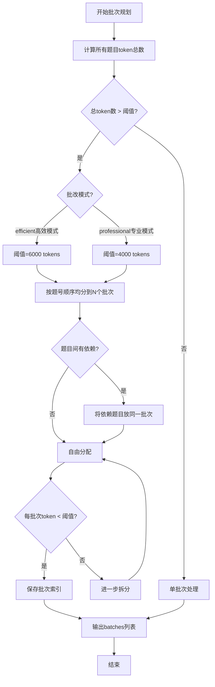

**规则说明**：

1. **最大输入长度限制**：根据模型文档估算一批最多可处理的token数（高效模式6000，专业模式4000）
2. **题目独立性**：若题目之间有依赖（如上下文公用），应放在同一批次
3. **模式差异**：专业模式需要输出摘要和错误详情，token消耗更大，因此阈值更保守
4. **顺序保证**：批次编号按题号顺序递增，聚合阶段按批次索引与题号排序合并结果

### 3.2 并行执行模式

使用 LangGraph 的 **Send API** 实现动态并行：

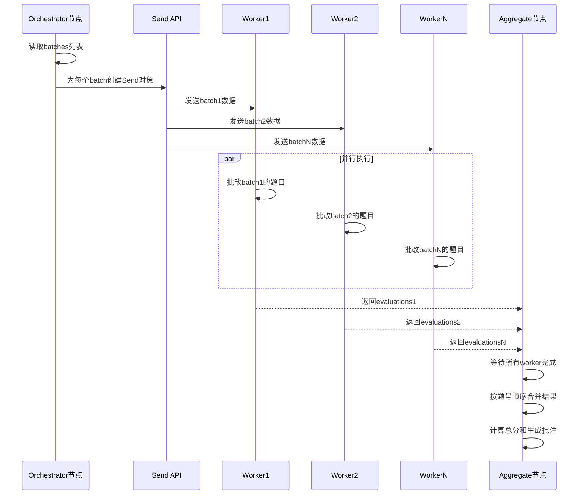

### 3.3 性能优化效果预估

| 场景 | 串行处理时间 | 并行处理时间 | 加速比 |
|------|-------------|-------------|--------|
| 10道题，2批次 | 120秒 | 65秒 | 1.8x |
| 20道题，4批次 | 240秒 | 70秒 | 3.4x |
| 50道题，8批次 | 600秒 | 90秒 | 6.7x |

## 4. 两种批改模式设计

### 4.1 高效模式（Efficient Mode）

**适用场景**：快批或低价值作业

**特点**：
- 不生成答案摘要，减少LLM输出长度
- 仅依据评分标准判断正误
- 输出简洁的评分结果

**输出数据结构**：

| 字段 | 类型 | 说明 |
|------|------|------|
| qid | string | 题号 |
| score | float | 得分 |
| max_score | float | 最大分值 |
| label | enum | correct / partial / wrong |
| rubric_item_id | string | 触发的评分项ID |
| error_token_ids | list[string] | 错误token ID列表 |

**示例输出**：

```
题目Q1：
- 得分：3/4
- 状态：部分正确
- 评分项：Q1_R2（正确使用公式但计算错误）
- 错误位置：[t12, t13]
```

### 4.2 专业模式（Professional Mode）

**适用场景**：重视反馈的作业或期末考试

**特点**：
- 在高效模式基础上，总结学生答案关键信息
- 列出错误详情并给出针对每道题的解析
- 为学生撰写个人评价（优点、需改进知识点、学习策略）
- 汇总全班学生批改结果，生成班级层面评价和统计

**输出数据结构**：

| 字段 | 类型 | 说明 |
|------|------|------|
| ...（包含高效模式所有字段） | ... | ... |
| summary | string | 答案摘要 |
| error_analysis | list[object] | 错误详情数组 |
| error_analysis[].error_id | string | 错误唯一标识 |
| error_analysis[].description | string | 错误描述 |
| error_analysis[].correct_solution | string | 正确解法 |
| comment | string | 对本题表现的评价和建议 |
| student_evaluation | object | 学生个人评价（聚合后生成） |
| class_evaluation | object | 班级整体评价（聚合后生成） |

**示例输出**：

```
题目Q1：
- 得分：3/4
- 状态：部分正确

答案摘要：
学生正确识别出需要使用余弦定理，成功写出公式 cosA = (b²+c²-a²)/(2bc)，
但在代入A=π/2时计算出错，得到√5/2而非0。

错误详情：
1. 错误ID：E001
   - 描述：特殊角三角函数值错误
   - 正确解法：cos(π/2) = 0，而非√5/2
   - 原因：可能混淆了cos45°或其他角度

评价与建议：
你对余弦定理的理解很好，公式使用正确。但需要加强对特殊角三角函数值的记忆，
建议复习0°、30°、45°、60°、90°等角度的正弦、余弦值。

学生个人评价：
- 优点：掌握了余弦定理的应用，推导过程逻辑清晰
- 需改进：特殊角三角函数值、计算准确性
- 建议：每天练习5道三角函数题，重点记忆特殊值

班级整体评价：
- 平均分：6.5/8
- 常见错误：60%的学生在特殊角计算上出错
- 建议：下次课集中讲解特殊角三角函数值的记忆方法
```

### 4.3 模式对比

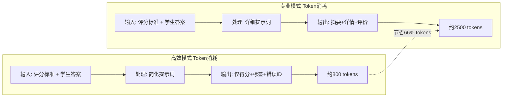

## 5. 多模态提取与坐标标注

### 5.1 extract_via_mm 节点设计

**功能**：调用多模态大模型，对作业图片进行文字与信息抽取，返回token列表和学生信息。

**提示词设计**：

**系统提示（system）**：
```
你是一个多模态信息提取助手，输入包括一组作业图片和批改上下文。

任务：
1. 提取图片中的所有文本、数学式子和手写内容
2. 为每个token返回：
   - 文字内容
   - 所在页码（从0开始）
   - 四个角的像素坐标（x1, y1, x2, y2），以图片左上角为原点，单位为像素
   - 同一行的标识符 line_id
3. 识别学生姓名、学号、班级信息

输出格式：严格JSON格式
```

**用户输入（user）**：
```
以下是学生提交的作业图片（共N张），请识别学生姓名、学号和班级，并抽取所有文本token。

[图片1]
[图片2]
...
[图片N]
```

**期望输出格式**：

```json
{
  "student_info": {
    "name": "张三",
    "student_id": "20230001",
    "class_id": "数学一班"
  },
  "tokens": [
    {
      "id": "t1",
      "text": "在△ABC中",
      "page": 0,
      "bbox": [120, 45, 280, 75],
      "line_id": "L0",
      "conf": 0.98
    },
    {
      "id": "t2",
      "text": "cosA = (b²+c²-a²)/(2bc)",
      "page": 0,
      "bbox": [120, 95, 450, 125],
      "line_id": "L1",
      "conf": 0.95
    }
  ]
}
```

**处理流程**：

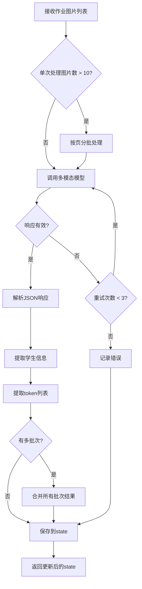

### 5.2 坐标标注生成

**aggregate_results** 节点负责将 `error_token_ids` 映射到具体坐标并生成批注数据。

**映射逻辑**：

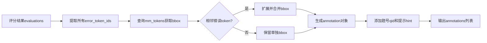

**批注数据结构**：

| 字段 | 类型 | 说明 |
|------|------|------|
| annotation_id | string | 唯一标识 |
| qid | string | 题号 |
| page | int | 页码 |
| bbox | object | {x1, y1, x2, y2} 像素坐标 |
| hint | string | 提示信息，如"计算错误"、"公式错误" |
| error_type | string | 错误类型 |

**前端渲染示例**：

前端接收 `annotations` 列表后，在对应页的图片上绘制红色边框和气泡提示。

## 6. 评分标准解析

### 6.1 parse_rubric 节点设计

**功能**：将教师提供的评分标准文本解析成结构化JSON，定义每道题的题号、最大分值、评分项及条件。

**提示词设计**：

**系统提示**：
```
你是评分标准解析器，将文本评分标准转换为严格的JSON结构。

要求：
1. 每道题必须包含：qid（题号）、max_score（最大分值）、rubric_items（评分项列表）
2. 每个评分项包含：
   - id: 唯一标识（如Q1_R1）
   - description: 评分点描述
   - score_if_fulfilled: 满足时得分
   - conditions: 判断该项满足的条件（关键词、公式、逻辑步骤等）
3. 不得新增评分项，严格按照原文解析
4. 输出严格JSON格式

输出格式示例：
{
  "questions": [
    {
      "qid": "Q1",
      "max_score": 8,
      "rubric_items": [
        {
          "id": "Q1_R1",
          "description": "正确使用余弦定理",
          "score_if_fulfilled": 2,
          "conditions": ["余弦定理", "cosA = (b²+c²-a²)/(2bc)"]
        }
      ]
    }
  ]
}
```

**用户输入**：
```
以下是老师提供的批改标准：

题目1（8分）：
1. 正确使用余弦定理 cosA = (b²+c²-a²)/(2bc) = c/(2b) = √5/2（2分）
2. 正确推导 ±c² = b²-a²（1分）
3. 结合题目条件 b²-a²=c²/2 得出 c=b（1分）
...
```

**输出约束**：

- 使用 Pydantic 或 JSON Schema 约束字段
- 验证所有 `score_if_fulfilled` 之和等于 `max_score`
- 确保后续批改节点只能选择预定义的评分项

### 6.2 结构化评分标准示例

```json
{
  "questions": [
    {
      "qid": "Q1",
      "max_score": 8,
      "rubric_items": [
        {
          "id": "Q1_R1",
          "description": "正确使用余弦定理",
          "score_if_fulfilled": 2,
          "conditions": [
            "余弦定理",
            "cosA = (b²+c²-a²)/(2bc)"
          ]
        },
        {
          "id": "Q1_R2",
          "description": "正确推导±c²=b²-a²",
          "score_if_fulfilled": 1,
          "conditions": [
            "c²",
            "b²-a²"
          ]
        },
        {
          "id": "Q1_R3",
          "description": "结合题目条件得出c=b",
          "score_if_fulfilled": 1,
          "conditions": [
            "b²-a²=c²/2",
            "c=b"
          ]
        }
      ]
    }
  ]
}
```

## 7. 题目识别与批次规划

### 7.1 detect_questions 节点

**功能**：结合 `rubric_struct` 和 `mm_tokens`，根据题号、关键字、版式等划分每道题。

**识别策略**：

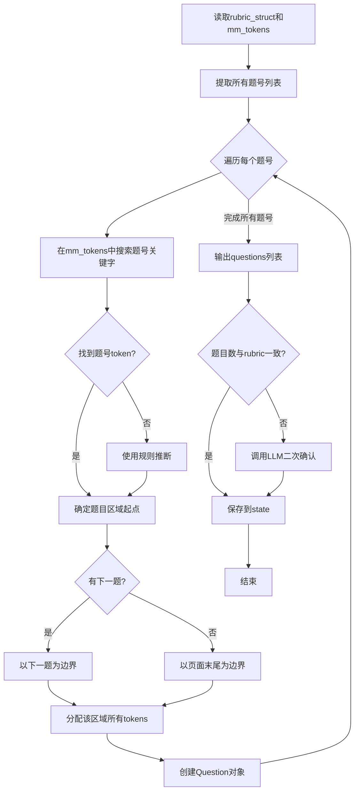

**Question对象结构**：

| 字段 | 类型 | 说明 |
|------|------|------|
| qid | string | 题号（对应rubric_struct中的qid） |
| max_score | float | 最大分值 |
| region | object | {page, start_token_id, end_token_id} |
| token_ids | list[string] | 该题涉及的所有token ID列表 |
| keywords | list[string] | 从rubric提取的关键词 |

### 7.2 decide_batches 节点

**功能**：计算所有题目的token数量和预计输出token数，根据模式选择阈值并生成batches列表。

**批次规划算法**：

```
算法：BalancedBatchPlanning

输入：
  - questions: 题目列表
  - mode: 批改模式（efficient或professional）
  - max_input_tokens: 单批次最大输入token限制

输出：
  - batches: 批次列表

步骤：
1. 根据mode设置阈值：
   - efficient模式：threshold = 6000
   - professional模式：threshold = 4000

2. 计算每道题的token数：
   for each q in questions:
     q.token_count = len(q.token_ids)

3. 计算总token数：
   total_tokens = sum(q.token_count for q in questions)

4. 判断是否需要分批：
   if total_tokens <= threshold:
     return [Batch(index=0, question_ids=[q.qid for q in questions])]

5. 计算批次数：
   batch_count = ceil(total_tokens / threshold)

6. 按题号顺序均分：
   batches = []
   questions_per_batch = ceil(len(questions) / batch_count)
   for i in range(0, len(questions), questions_per_batch):
     batch_questions = questions[i:i+questions_per_batch]
     batch = Batch(
       index=len(batches),
       question_ids=[q.qid for q in batch_questions],
       estimated_tokens=sum(q.token_count for q in batch_questions)
     )
     batches.append(batch)

7. 验证并调整：
   for batch in batches:
     if batch.estimated_tokens > threshold:
       # 进一步拆分该批次
       split_batch(batch, threshold)

8. 保存批次索引到每道题：
   for batch in batches:
     for qid in batch.question_ids:
       questions[qid].batch_index = batch.index

9. 返回 batches
```

**Batch对象结构**：

| 字段 | 类型 | 说明 |
|------|------|------|
| batch_index | int | 批次索引（从0开始） |
| question_ids | list[string] | 包含的题目ID列表 |
| estimated_tokens | int | 预估token数 |

## 8. 评分Worker与提示词

### 8.1 evaluate_batch Worker设计

**功能**：对一个批次内的若干题目进行批改，根据模式不同，其prompt有所区别。

**调用方式**：

通过 LangGraph 的 **Send API**，orchestrator节点动态创建多个worker：

```python
# 伪代码示例
for batch in state['batches']:
    send_obj = Send(
        node="evaluate_batch",
        arg={
            "batch_index": batch.batch_index,
            "questions": [q for q in state['questions'] if q.qid in batch.question_ids],
            "rubric_struct": state['rubric_struct'],
            "mm_tokens": state['mm_tokens'],
            "mode": state['mode']
        }
    )
```

### 8.2 高效模式提示词

**系统提示**：
```
你是严谨的自动批改助理。

任务：
根据提供的评分标准JSON和学生答案（包含token id和内容），判断每个题目的评分项是否符合。

要求：
1. 逐题评分，对每个题目检查所有评分项
2. 返回题号、得分、标签（correct/partial/wrong）、对应的评分项id
3. 标记错误token的id列表
4. 不得输出任何解释或摘要

输出格式（严格JSON数组）：
[
  {
    "qid": "Q1",
    "score": 3,
    "max_score": 4,
    "label": "partial",
    "rubric_item_id": "Q1_R2",
    "error_token_ids": ["t12", "t13"]
  }
]
```

**用户输入**：
```
评分标准：
{
  "questions": [
    {
      "qid": "Q1",
      "max_score": 8,
      "rubric_items": [...]
    }
  ]
}

学生答案（token格式）：
题目Q1涉及的tokens：
- t10: "在△ABC中"
- t11: "cosA = (b²+c²-a²)/(2bc)"
- t12: "= √5/2"  (错误)
- t13: "c² = b²-a²" (错误)
...

请进行批改。
```

### 8.3 专业模式提示词

**系统提示**：
```
你是专业的批改助理。

任务：
根据评分标准JSON和学生答案（带token id和文本内容），进行详细批改。

要求：
1. 对每道题进行评分，返回题号、得分、最大分值、标签以及对应的评分项
2. 提供答案摘要：用一两句话概括该题学生作答的主要内容
3. 列出错误详情：
   - 指出错误token id
   - 说明错误原因
   - 给出正确解法
4. 对学生在本题的表现进行简要评价，并给出学习建议

输出格式（严格JSON数组）：
[
  {
    "qid": "Q1",
    "score": 3,
    "max_score": 8,
    "label": "partial",
    "rubric_item_id": "Q1_R2",
    "error_token_ids": ["t12", "t13"],
    "summary": "学生正确使用了余弦定理公式，但在代入特殊角时计算错误...",
    "error_analysis": [
      {
        "error_id": "E001",
        "token_ids": ["t12"],
        "description": "cos(π/2)的值应为0，而非√5/2",
        "correct_solution": "cos(π/2) = 0，因此cosA = 0",
        "reason": "可能混淆了其他特殊角的三角函数值"
      }
    ],
    "comment": "你对余弦定理的应用很好，但需加强特殊角三角函数值的记忆。建议复习0°、30°、45°、60°、90°的正弦、余弦值。"
  }
]
```

**用户输入**：
```
评分标准：
{
  "questions": [...]
}

学生答案（token格式）：
题目Q1涉及的tokens：
- t10: "在△ABC中，A=π/2"
- t11: "cosA = (b²+c²-a²)/(2bc)"
- t12: "= √5/2"
- t13: "±c² = b²-a²"
...

请进行详细批改。
```

## 9. 结果聚合与班级系统集成

### 9.1 aggregate_results 节点

**功能**：等待所有worker完成后，合并评分结果，计算总分、分卷分数，生成批注坐标，以及在专业模式下汇总摘要、学生评价和班级评价。

**聚合流程**：

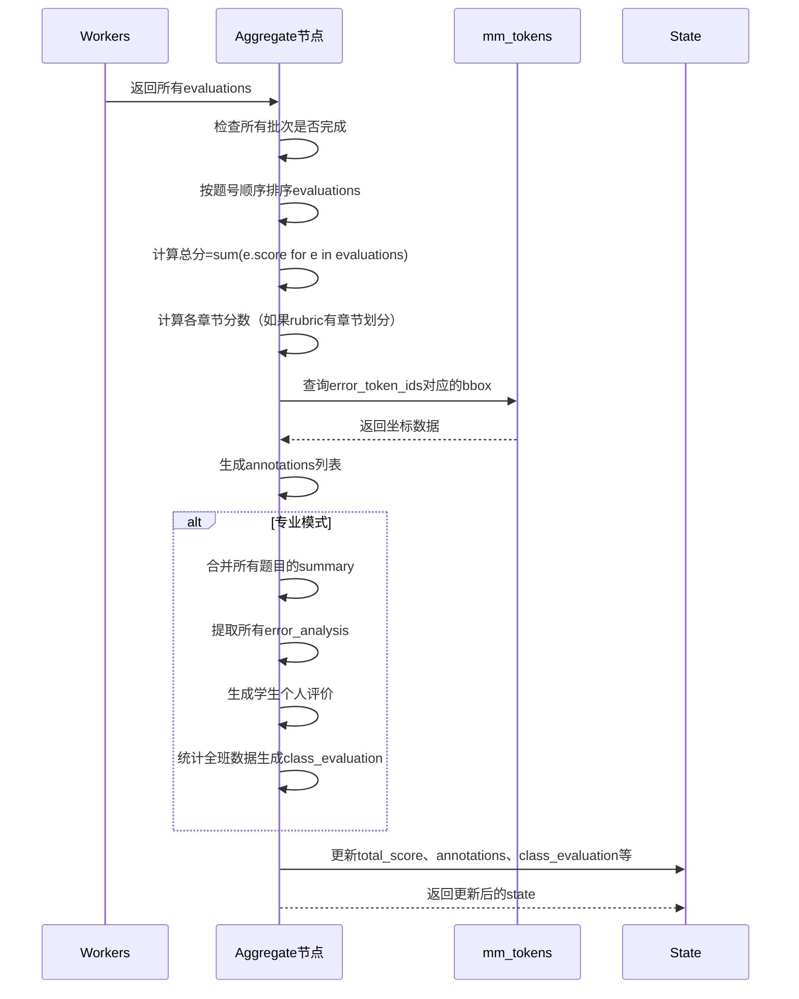

**学生个人评价生成**（专业模式）：

```
算法：GenerateStudentEvaluation

输入：
  - evaluations: 所有题目的评分结果
  - student_info: 学生信息

输出：
  - student_evaluation: 学生个人评价对象

步骤：
1. 收集优点：
   strengths = [e.comment中的优点 for e in evaluations if e.label == "correct"]

2. 收集不足：
   weaknesses = [e.error_analysis中的错误原因 for e in evaluations if e.label != "correct"]

3. 提取薄弱知识点：
   knowledge_gaps = unique([ea.knowledge_gap for e in evaluations for ea in e.error_analysis])

4. 生成学习建议：
   suggestions = [
     "复习{knowledge_gap}相关内容"
     for knowledge_gap in knowledge_gaps
   ]

5. 构建评价对象：
   student_evaluation = {
     "student_id": student_info.student_id,
     "name": student_info.name,
     "total_score": sum(e.score for e in evaluations),
     "max_score": sum(e.max_score for e in evaluations),
     "percentage": (total_score / max_score) * 100,
     "strengths": strengths,
     "weaknesses": weaknesses,
     "knowledge_gaps": knowledge_gaps,
     "suggestions": suggestions,
     "overall_comment": 根据得分率生成总体评语
   }

6. 返回 student_evaluation
```

**班级整体评价生成**（专业模式）：

注：需要访问数据库中同一作业的所有学生批改结果。

```
算法：GenerateClassEvaluation

输入：
  - assignment_id: 作业ID
  - all_student_results: 所有学生的评分结果（从数据库查询）

输出：
  - class_evaluation: 班级评价对象

步骤：
1. 计算统计指标：
   - 平均分 = mean([s.total_score for s in all_student_results])
   - 最高分 = max([s.total_score for s in all_student_results])
   - 最低分 = min([s.total_score for s in all_student_results])
   - 标准差 = std([s.total_score for s in all_student_results])

2. 统计常见错误：
   error_frequency = {}
   for student in all_student_results:
     for evaluation in student.evaluations:
       for error in evaluation.error_analysis:
         error_frequency[error.description] = error_frequency.get(...) + 1
   
   common_errors = top_k(error_frequency, k=5)

3. 识别薄弱知识点：
   knowledge_gap_frequency = {}
   for student in all_student_results:
     for gap in student.student_evaluation.knowledge_gaps:
       knowledge_gap_frequency[gap] = knowledge_gap_frequency.get(...) + 1
   
   weak_topics = top_k(knowledge_gap_frequency, k=3)

4. 生成班级建议：
   class_suggestions = [
     f"加强{topic}的讲解，{count}名学生在此存在问题"
     for topic, count in weak_topics
   ]

5. 构建评价对象：
   class_evaluation = {
     "assignment_id": assignment_id,
     "total_students": len(all_student_results),
     "average_score": average_score,
     "max_score": max_score,
     "min_score": min_score,
     "std_dev": std_dev,
     "common_errors": common_errors,
     "weak_topics": weak_topics,
     "class_suggestions": class_suggestions,
     "score_distribution": {
       "A (90-100)": count_students_in_range(90, 100),
       "B (80-89)": count_students_in_range(80, 89),
       "C (70-79)": count_students_in_range(70, 79),
       "D (60-69)": count_students_in_range(60, 69),
       "F (0-59)": count_students_in_range(0, 59)
     }
   }

6. 返回 class_evaluation
```

### 9.2 班级系统集成

**build_export_payload 节点**：

构造符合班级系统API的JSON数据。

**导出数据结构**：

```json
{
  "assignment_id": "ASSIGN_20250619_001",
  "student_id": "20230001",
  "student_name": "张三",
  "class_id": "数学一班",
  "submission_time": "2025-06-19T14:30:00Z",
  "grading_time": "2025-06-19T14:35:23Z",
  "total_score": 15.5,
  "max_score": 20.0,
  "percentage": 77.5,
  "grade_level": "B",
  "evaluations": [
    {
      "qid": "Q1",
      "score": 6.0,
      "max_score": 8.0,
      "label": "partial",
      "feedback": "答案摘要...",
      "errors": [...]
    }
  ],
  "annotations": [
    {
      "annotation_id": "A001",
      "qid": "Q1",
      "page": 0,
      "bbox": {"x1": 120, "y1": 95, "x2": 450, "y2": 125},
      "hint": "计算错误"
    }
  ],
  "student_evaluation": {
    "strengths": ["掌握余弦定理"],
    "weaknesses": ["特殊角计算"],
    "suggestions": ["复习特殊角三角函数值"]
  }
}
```

**push_to_class_system 节点**：

调用班级系统HTTP API推送数据。

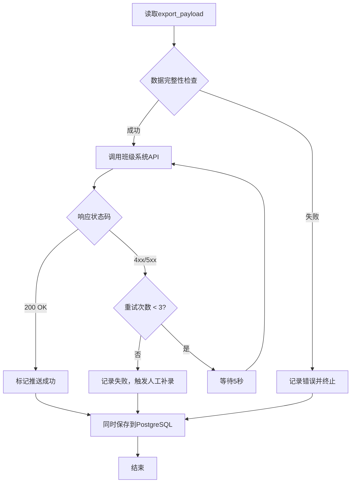

**API调用示例**：

```
POST /api/v1/assignments/{assignment_id}/submissions
Headers:
  Authorization: Bearer {firebase_auth_token}
  Content-Type: application/json

Body:
{
  "student_id": "20230001",
  "total_score": 15.5,
  ...
}

Response:
{
  "success": true,
  "submission_id": "SUB_001",
  "message": "提交成功"
}
```

### 9.3 学生信息识别与匹配

**学生信息提取**：

在 `extract_via_mm` 节点中，多模态模型识别学生姓名、学号、班级。

**模糊匹配与消歧**：

```
算法：MatchStudentInfo

输入：
  - extracted_info: {name, student_id, class_id} 从图片中提取
  - class_roster: 班级名册（从数据库或API获取）

输出：
  - matched_student: 匹配到的唯一学生记录

步骤：
1. 精确匹配：
   if extracted_info.student_id in class_roster:
     return class_roster[extracted_info.student_id]

2. 姓名模糊匹配：
   candidates = fuzzy_search(extracted_info.name, class_roster.names, threshold=0.8)
   if len(candidates) == 1:
     return candidates[0]

3. 多字段组合匹配：
   candidates = filter(class_roster, where:
     name similar to extracted_info.name AND
     class_id == extracted_info.class_id
   )
   if len(candidates) == 1:
     return candidates[0]

4. 无法确定唯一学生：
   if len(candidates) == 0:
     raise NoMatchError("未找到匹配学生")
   elif len(candidates) > 1:
     raise AmbiguousMatchError("找到多个可能的学生", candidates)

5. 人工介入：
   trigger_manual_verification(extracted_info, candidates)
```

**处理匹配失败**：

- 记录错误并标记该作业需要人工审核
- 在前端展示可能的学生列表，由教师手动选择
- 将审核结果反馈到系统，优化后续识别

## 10. 流式输出与进度监控

### 10.1 流式模式配置

LangGraph 支持多种流式模式：

| 模式 | 说明 | 适用场景 |
|------|------|---------|
| **values** | 返回每个节点执行后的完整状态 | 需要完整状态快照 |
| **updates** | 仅返回状态的增量更新 | 实时进度展示 |
| **messages** | 返回消息流（适用于聊天场景） | 对话式交互 |

**推荐配置**：使用 `stream_mode="updates"` 实时展示批次完成进度和临时分数。

### 10.2 进度更新机制

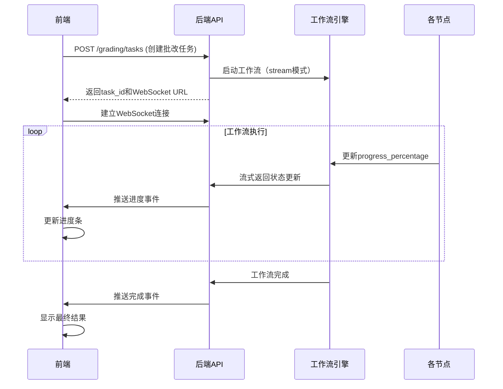

**进度事件格式**：

```json
{
  "event_type": "progress_update",
  "task_id": "TASK_001",
  "current_step": "evaluate_batch",
  "progress_percentage": 65.0,
  "message": "正在批改第2批次（共4批）",
  "completed_questions": ["Q1", "Q2", "Q3"],
  "partial_scores": {
    "Q1": 7.0,
    "Q2": 5.5,
    "Q3": 8.0
  }
}
```

**前端进度展示示例**：

```
━━━━━━━━━━━━━━━━━━━━━━━━━━━━━━━━━━━━━━━
批改进度：65% ████████████░░░░░░░
━━━━━━━━━━━━━━━━━━━━━━━━━━━━━━━━━━━━━━━

当前步骤：正在批改第2批次（共4批）

已完成题目：
✅ 题目1：7.0/8.0
✅ 题目2：5.5/6.0
✅ 题目3：8.0/10.0

进行中：
⏳ 题目4-6（批次2）
⏳ 题目7-9（批次3）
⏳ 题目10（批次4）
```

### 10.3 工作流监控与调试

**状态检查点（Checkpointer）**：

使用 `MemorySaver` 或 `PostgresSaver` 持久化状态，支持：
- 任务中断后恢复
- 回溯历史状态
- 调试失败节点

**日志记录**：

每个节点记录关键信息：
- 输入摘要
- 执行时间
- 输出摘要
- 错误堆栈

**性能指标**：

| 指标 | 说明 |
|------|------|
| 节点执行时间 | 每个节点的耗时 |
| LLM调用次数 | API调用统计 |
| Token消耗 | 输入token和输出token |
| 缓存命中率 | OCR缓存命中比例 |
| 并行度 | 同时执行的worker数量 |

## 11. 测试策略

### 11.1 单元测试

针对每个Agent节点编写单元测试。

**测试矩阵**：

| 节点 | 测试用例 | 预期结果 |
|------|---------|---------|
| extract_via_mm | 提供清晰手写作业图片 | 正确提取所有文字和坐标 |
| extract_via_mm | 提供模糊图片 | 降级处理或返回低置信度结果 |
| parse_rubric | 标准格式的评分标准文本 | 正确解析为JSON |
| parse_rubric | 非标准格式或缺失分值 | 返回错误并提示 |
| detect_questions | 明确题号标记的作业 | 正确划分每道题 |
| detect_questions | 题号不明确的作业 | 使用LLM二次确认 |
| decide_batches | 10道题，高效模式 | 返回1个批次 |
| decide_batches | 50道题，专业模式 | 返回8个批次 |
| evaluate_batch | 正确答案 | score=max_score, label=correct |
| evaluate_batch | 部分正确答案 | score<max_score, label=partial |
| aggregate_results | 所有worker成功返回 | 正确计算总分和生成批注 |
| aggregate_results | 部分worker失败 | 记录错误并标记失败题目 |

### 11.2 集成测试

测试完整工作流端到端执行。

**测试场景**：

1. **小规模作业（5道题，高效模式）**
   - 预期：单批次处理，耗时<30秒
   
2. **中规模作业（20道题，专业模式）**
   - 预期：4批次并行，耗时<70秒，包含详细反馈

3. **大规模作业（50道题，高效模式）**
   - 预期：8批次并行，耗时<90秒

4. **错误处理测试**
   - 模拟多模态API失败：验证重试机制
   - 模拟班级系统API超时：验证降级保存到数据库

### 11.3 性能测试

**负载测试**：

- 同时提交100个批改任务
- 监控系统资源使用（CPU、内存、数据库连接）
- 验证并发worker的最大数量限制

**Token消耗测试**：

| 场景 | 高效模式Token消耗 | 专业模式Token消耗 | 节省比例 |
|------|-----------------|------------------|---------|
| 单题批改 | 800 | 2500 | 68% |
| 10题批改 | 7000 | 22000 | 68% |
| 50题批改（并行） | 32000 | 95000 | 66% |

## 12. 故障排除

### 12.1 常见问题及解决方案

| 问题类型 | 症状 | 解决方案 |
|---------|------|---------|
| 多模态模型超时 | extract_via_mm节点失败 | 启用重试机制，单次处理图片数<10 |
| 评分标准解析失败 | rubric_struct为空 | 验证输入格式，提供示例模板 |
| 题目识别错误 | questions数量与rubric不一致 | 启用LLM二次确认，人工介入 |
| 批次worker卡死 | 长时间无响应 | 设置超时限制（5分钟），记录错误并跳过 |
| 班级系统API失败 | push失败 | 保存到PostgreSQL，触发人工补录 |
| Token消耗过高 | 成本超预算 | 启用高效模式，调整批次阈值 |

### 12.2 错误恢复机制

**Checkpointer机制**：

- 每完成一个节点，保存状态快照
- 失败后从最近的检查点恢复
- 避免重复执行已完成的节点

**降级策略**：

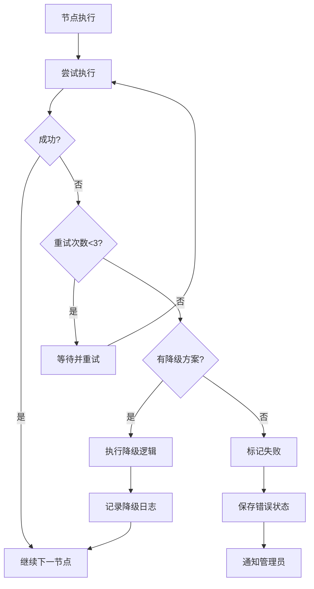

**降级示例**：

1. **多模态模型降级**：
   - 主模型（Gemini 2.0）失败 → 切换到备用模型（OpenAI Vision）
   - 备用模型失败 → 使用传统OCR（OCR.space）

2. **批改降级**：
   - 专业模式失败 → 降级为高效模式
   - 高效模式失败 → 使用规则引擎简单批改

## 13. 扩展性设计

### 13.1 支持更多题型

当前系统主要针对数学题，未来可扩展到：
- 语文阅读理解（需要语义相似度匹配）
- 英语作文（需要语法检查和内容评分）
- 物理实验报告（需要图表识别）

**扩展方式**：

在 `parse_rubric` 节点中识别题型，在 `evaluate_batch` 中根据题型选择不同的评分提示词模板。

### 13.2 支持多语言

| 语言 | 多模态模型语言代码 | 文本模型提示词 |
|------|------------------|---------------|
| 简体中文 | chs | 使用中文提示词 |
| 繁体中文 | cht | 使用繁体中文提示词 |
| 英语 | eng | 使用英文提示词 |

### 13.3 支持自定义评分规则

允许教师定义自定义评分逻辑（如额外加分项、扣分项）：

```json
{
  "custom_rules": [
    {
      "rule_id": "BONUS_001",
      "description": "使用多种解法",
      "condition": "检测到2种以上解法",
      "score_adjustment": +2
    },
    {
      "rule_id": "PENALTY_001",
      "description": "字迹潦草",
      "condition": "OCR置信度<0.6",
      "score_adjustment": -1
    }
  ]
}
```

在 `evaluate_batch` 中应用这些规则。

### 13.4 支持教师反馈循环

教师可以对AI批改结果进行修正，系统记录这些修正并用于：
- 微调评分模型
- 优化提示词
- 生成对抗样本进行测试

**反馈数据结构**：

```json
{
  "correction_id": "CORR_001",
  "task_id": "TASK_001",
  "qid": "Q1",
  "ai_score": 3.0,
  "teacher_score": 4.0,
  "ai_label": "partial",
  "teacher_label": "correct",
  "teacher_comment": "学生虽然计算有误，但方法正确，应给满分",
  "correction_time": "2025-06-19T15:00:00Z"
}
```

定期分析这些反馈，调整评分策略。
