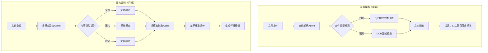
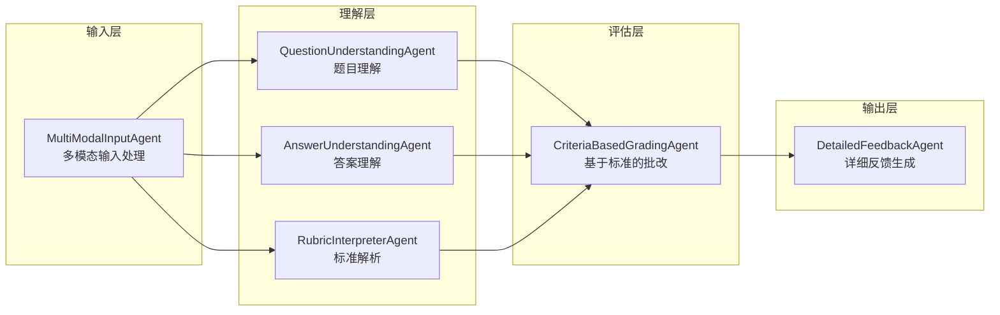
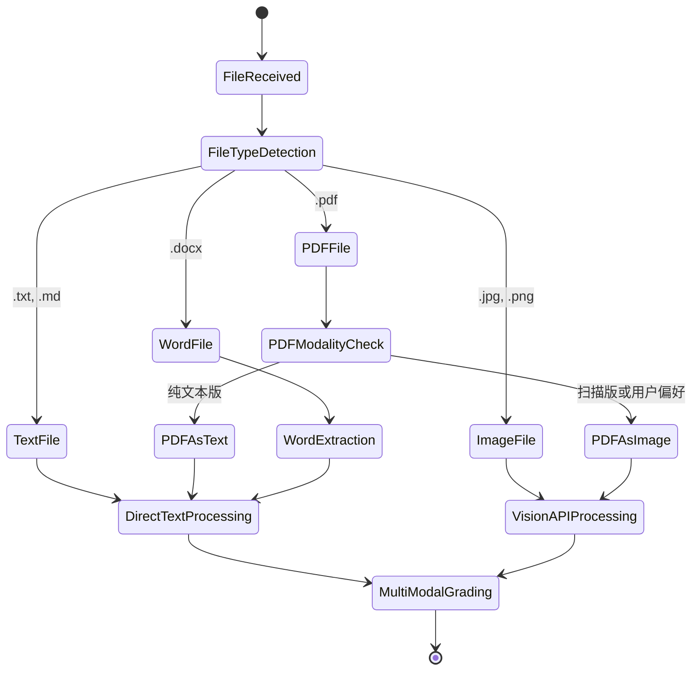
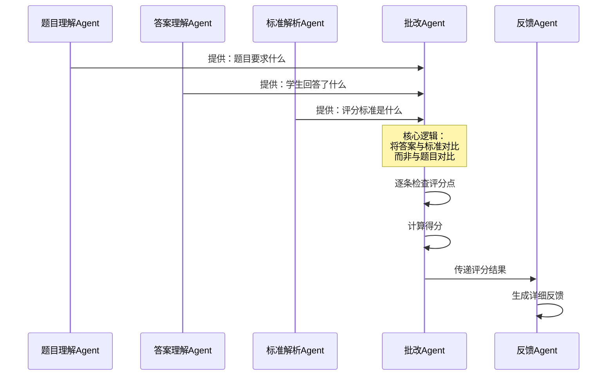
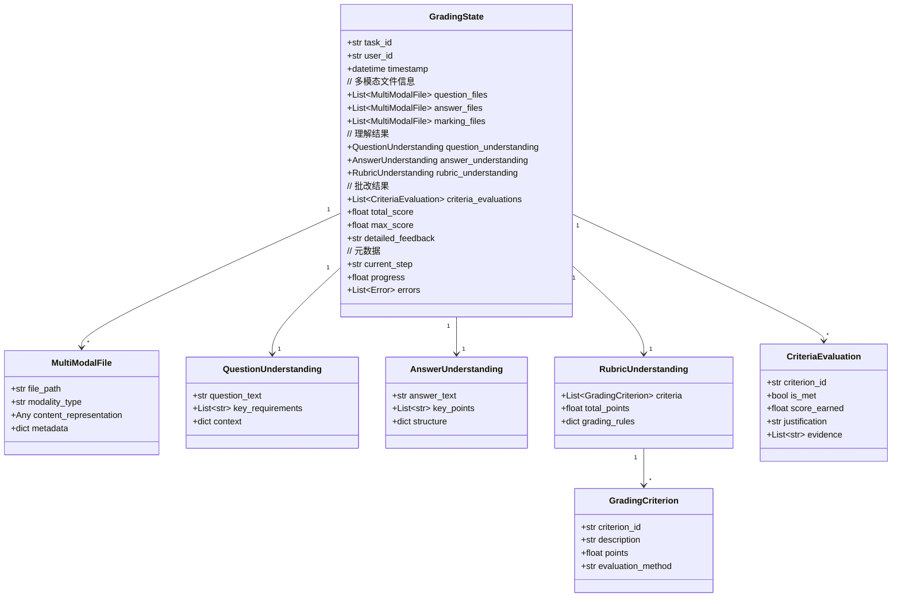
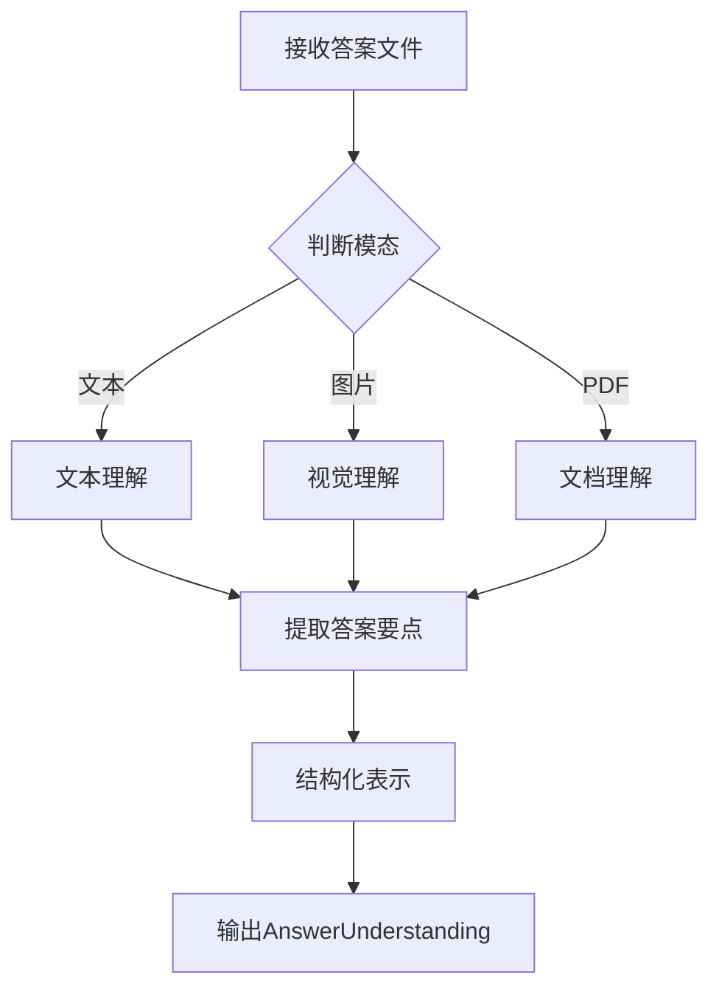
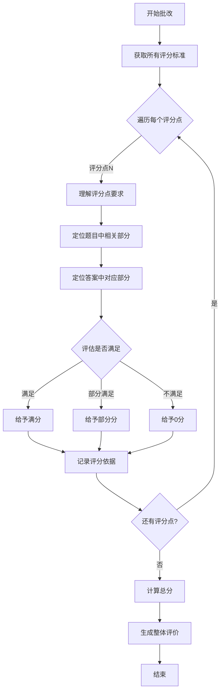
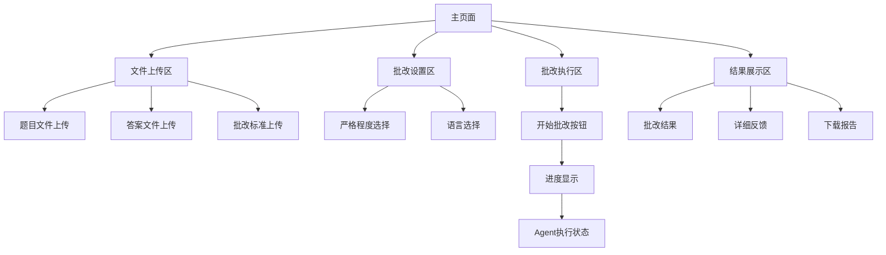
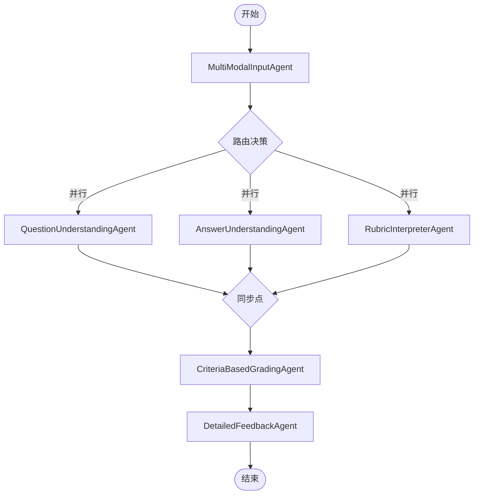
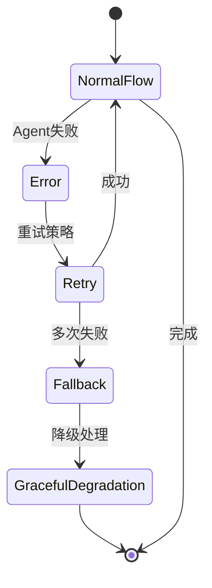

# 多模态文件处理重构设计

## 概述

### 问题诊断

当前系统存在以下核心问题：

1. **OCR依赖问题**：系统默认尝试将PDF等文件转换为文本，违背了用户要求去除OCR的需求
2. **批改逻辑错误**：评分逻辑将"学生答案与题目一致"判定为满分，忽略了应基于批改标准评分的核心原则
3. **多模态能力缺失**：系统未充分利用LLM的视觉能力，强行转换文件格式而非直接处理多模态输入
4. **工作流设计过时**：Streamlit界面与LangGraph工作流集成不完整，缺少真正的多模态处理路径

### 设计目标

| 目标 | 描述 | 优先级 |
|------|------|--------|
| 真正的多模态支持 | 直接将图片、PDF发送给LLM，无需文本转换 | P0 |
| 基于标准的批改 | 评分必须依据批改标准，而非题目内容 | P0 |
| 消除OCR依赖 | 移除所有强制OCR转换逻辑 | P0 |
| 完整工作流 | Streamlit界面完整支持LangGraph工作流 | P1 |

## 架构重构

### 系统架构对比



### 核心Agent重构



## 多模态处理策略

### 文件处理流程



### 多模态内容表示

| 模态类型 | 数据结构 | LLM输入格式 | 处理方式 |
|---------|---------|------------|---------|
| 纯文本 | `{type: "text", content: str}` | text message | 直接传递 |
| 图片 | `{type: "image", content: base64, mime: str}` | image_url with base64 | Vision API |
| PDF（图片） | `{type: "pdf_image", pages: [base64...]}` | 多个image_url | 逐页Vision |
| PDF（文本） | `{type: "pdf_text", content: str}` | text message | 文本提取 |
| Word文档 | `{type: "document", content: str}` | text message | 文本提取 |

## 批改逻辑重构

### 问题根因分析

**当前错误逻辑**：
```
IF 学生答案 == 题目内容 THEN
    得分 = 满分
    反馈 = "答案与题目完全一致，没有发现错误"
END
```

**错误原因**：
1. 混淆了题目与答案的关系
2. 忽略了批改标准的作用
3. 未理解批改的本质是"评估答案是否满足标准"

### 正确批改流程



### 评分决策表

| 评分点 | 标准要求 | 学生答案 | 判断结果 | 得分 |
|--------|---------|---------|---------|------|
| 概念理解 | 必须包含关键词A | 包含关键词A | 满足 | 满分 |
| 计算步骤 | 需要3个步骤 | 只有2个步骤 | 部分满足 | 部分分 |
| 结论正确性 | 结果为X | 结果为Y | 不满足 | 0分 |
| 表达规范 | 使用专业术语 | 使用口语表达 | 不满足 | 扣分 |

### 批改Agent伪流程

```
FOR EACH 评分点 IN 批改标准:
    要求 = 评分点.要求
    分值 = 评分点.分值
    
    # 从题目中理解该评分点的上下文
    上下文 = 从题目中提取(评分点相关内容)
    
    # 从答案中提取对应部分
    学生回答 = 从答案中提取(评分点相关内容)
    
    # 评估是否满足
    满足程度 = LLM评估(要求, 学生回答, 上下文)
    
    # 计算得分
    IF 满足程度 >= 完全满足:
        得分 += 分值
    ELSE IF 满足程度 >= 部分满足:
        得分 += 分值 * 0.5
    ELSE:
        得分 += 0
    END
    
    # 生成反馈
    反馈.添加(评分点反馈信息)
END

返回(总得分, 详细反馈)
```

## 状态模型重构

### GradingState增强



## Agent详细设计

### MultiModalInputAgent

**职责**：接收和识别多模态文件，不进行任何文本转换

**输入**：
- 文件路径列表（题目、答案、标准）

**处理逻辑**：
1. 检测文件类型（扩展名）
2. 读取文件内容
3. 根据类型构建适当的表示
   - 文本文件：直接读取文本
   - 图片文件：读取为base64
   - PDF文件：保持PDF格式或转为图片页面
   - Word文档：提取文本（可选）

**输出**：
- `MultiModalFile` 对象列表，每个包含原始内容表示

**关键原则**：
- **不进行OCR**
- **不强制转换格式**
- **保留原始模态信息**

### QuestionUnderstandingAgent

**职责**：理解题目要求（支持多模态输入）

**输入**：
- 题目文件的多模态表示

**LLM Prompt策略**：
```
对于文本题目：
  直接分析文本内容

对于图片题目：
  使用Vision API理解图片中的题目
  
对于PDF题目：
  根据情况使用Vision或文本分析
```

**输出**：
- 题目的核心要求
- 关键概念列表
- 题目上下文信息

### AnswerUnderstandingAgent

**职责**：理解学生答案（支持多模态输入）

**输入**：
- 答案文件的多模态表示

**处理流程**：


**输出**：
- 答案内容的结构化表示
- 关键答题点列表
- 答案结构分析

### RubricInterpreterAgent

**职责**：解析评分标准（支持多模态输入）

**重要性**：这是批改准确性的关键

**输入**：
- 批改标准文件的多模态表示

**输出**：
- 评分标准的结构化表示
- 每个评分点的要求
- 每个评分点的分值
- 评分规则说明

**数据结构示例**：
| 评分点ID | 描述 | 分值 | 评估方法 |
|----------|------|------|---------|
| C1 | 正确说明概念定义 | 3分 | 语义匹配 |
| C2 | 列出关键步骤 | 5分 | 步骤完整性 |
| C3 | 计算结果正确 | 7分 | 精确匹配 |
| C4 | 使用规范术语 | 2分 | 术语检测 |

### CriteriaBasedGradingAgent

**职责**：基于评分标准进行批改（核心Agent）

**输入**：
- 题目理解结果
- 答案理解结果
- 评分标准解析结果

**核心逻辑**：



**LLM Prompt模板**：

```
角色：你是一位专业的批改老师

任务：根据评分标准对学生答案进行评分

评分点：
{评分点描述}
分值：{分值}

题目上下文：
{题目相关部分}

评分标准要求：
{具体要求}

学生答案：
{学生答案相关部分}

请判断：
1. 学生答案是否满足评分标准的要求
2. 满足程度：完全满足/部分满足/不满足
3. 应得分数
4. 详细理由

输出格式：
{
  "is_met": true/false,
  "satisfaction_level": "完全满足/部分满足/不满足",
  "score_earned": <数值>,
  "justification": "<详细理由>",
  "evidence": ["<证据1>", "<证据2>"]
}
```

**输出**：
- 每个评分点的评估结果
- 总分
- 详细批改反馈

### DetailedFeedbackAgent

**职责**：生成人性化的详细反馈

**输入**：
- 所有评分点的评估结果
- 总分信息

**输出格式**：

```markdown
## 批改结果

### 总体评价
- 总分：X / Y
- 得分率：Z%
- 等级：A/B/C/D/F

### 逐项评分

#### 评分点1：[描述]
- 分值：X分
- 得分：Y分
- 评价：[满足/部分满足/不满足]
- 理由：[详细说明]
- 改进建议：[具体建议]

#### 评分点2：[描述]
...

### 整体建议
[综合建议]
```

## Streamlit界面重构

### 界面布局



### 关键交互流程

| 步骤 | 用户操作 | 系统响应 | UI反馈 |
|------|---------|---------|--------|
| 1 | 上传文件 | 接收并预览文件 | 显示文件列表和类型 |
| 2 | 点击"开始批改" | 初始化工作流 | 显示进度条 |
| 3 | 等待批改 | 执行Agent流程 | 实时更新Agent状态 |
| 4 | 批改完成 | 生成结果 | 展示详细反馈 |
| 5 | 查看结果 | 提供下载选项 | 支持导出PDF/Markdown |

### 进度反馈设计

```
批改进度：[████████░░] 80%

当前步骤：
✅ MultiModalInputAgent - 已完成
✅ QuestionUnderstandingAgent - 已完成
✅ AnswerUnderstandingAgent - 已完成
✅ RubricInterpreterAgent - 已完成
🔄 CriteriaBasedGradingAgent - 进行中 (评分点 3/5)
⏳ DetailedFeedbackAgent - 等待中
```

## 工作流编排

### 完整工作流



### 并行处理策略

**并行执行的Agent**：
- QuestionUnderstandingAgent
- AnswerUnderstandingAgent  
- RubricInterpreterAgent

**原因**：这三个Agent相互独立，可并行处理提升效率

**同步点**：在CriteriaBasedGradingAgent之前等待所有并行Agent完成

### 错误处理



**降级策略**：
| 失败Agent | 降级方案 | 影响 |
|-----------|---------|------|
| QuestionUnderstandingAgent | 使用简化理解 | 批改准确度降低 |
| AnswerUnderstandingAgent | 使用简化理解 | 批改准确度降低 |
| RubricInterpreterAgent | 使用默认标准 | 无法精确评分 |
| CriteriaBasedGradingAgent | 提示用户重试 | 无法完成批改 |

## 测试策略

### 功能测试用例

| 用例ID | 测试场景 | 输入 | 预期输出 |
|--------|---------|------|---------|
| TC01 | 纯文本批改 | txt题目+txt答案+txt标准 | 基于标准的准确评分 |
| TC02 | 图片批改 | jpg题目+jpg答案+txt标准 | 使用Vision理解并评分 |
| TC03 | 混合模态 | pdf题目+jpg答案+txt标准 | 多模态处理并评分 |
| TC04 | 无标准批改 | txt题目+txt答案 | 提示缺少标准或使用默认 |
| TC05 | 扫描PDF | 扫描版pdf | 不尝试OCR，使用Vision |

### 批改准确性测试

**测试数据集**：
- 10道数学题
- 10道语文题
- 10道英语题

**评估指标**：
- 评分准确率：系统评分与人工评分的偏差
- 反馈质量：反馈的详细程度和有用性
- 标准符合度：是否严格按照评分标准

### 性能测试

| 测试项 | 指标 | 目标值 |
|--------|------|--------|
| 单题批改时间 | 平均耗时 | < 30秒 |
| 批量批改(10题) | 平均耗时 | < 5分钟 |
| 并发处理 | 支持用户数 | >= 5 |
| 内存占用 | 峰值内存 | < 2GB |
