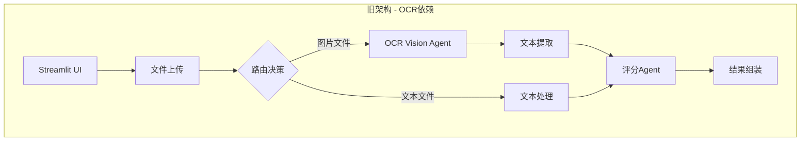
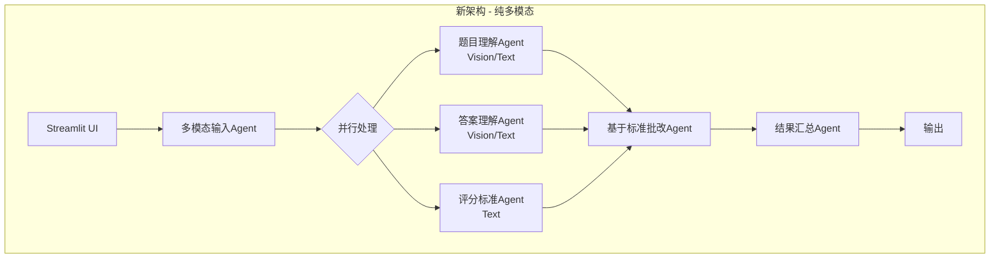
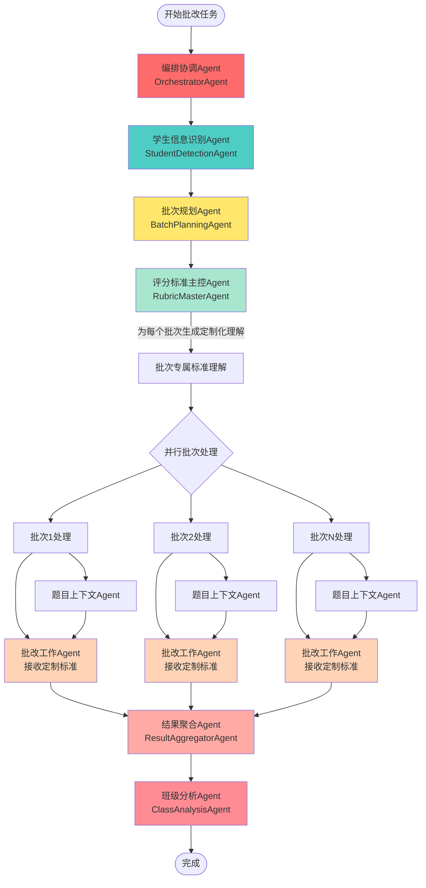
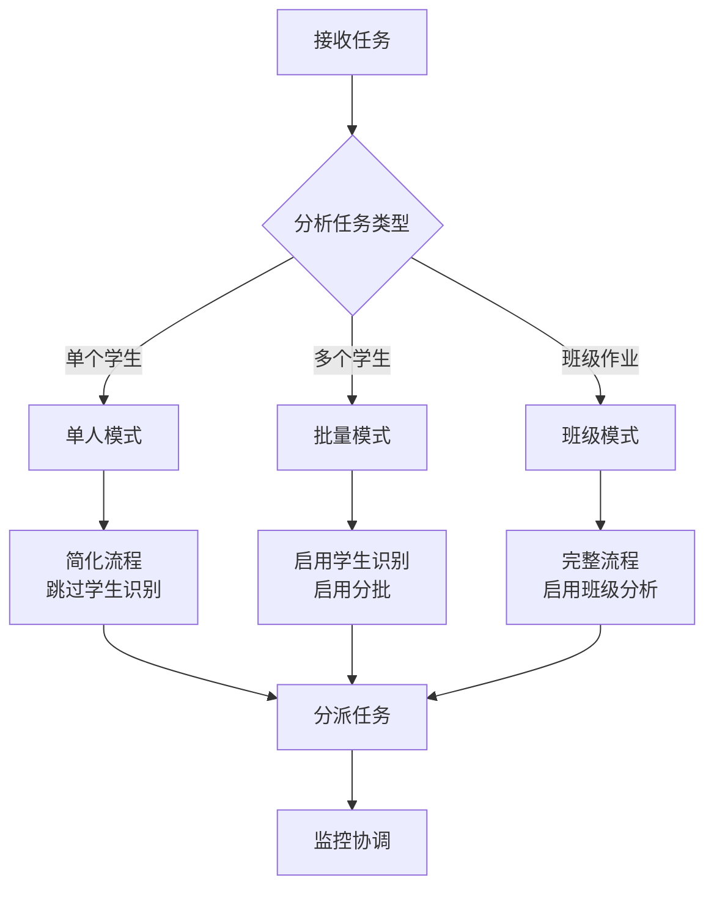
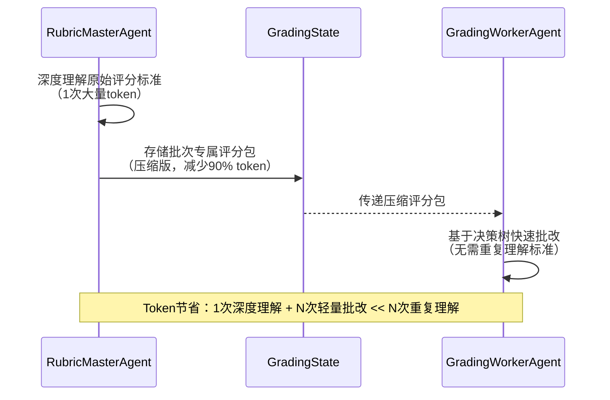
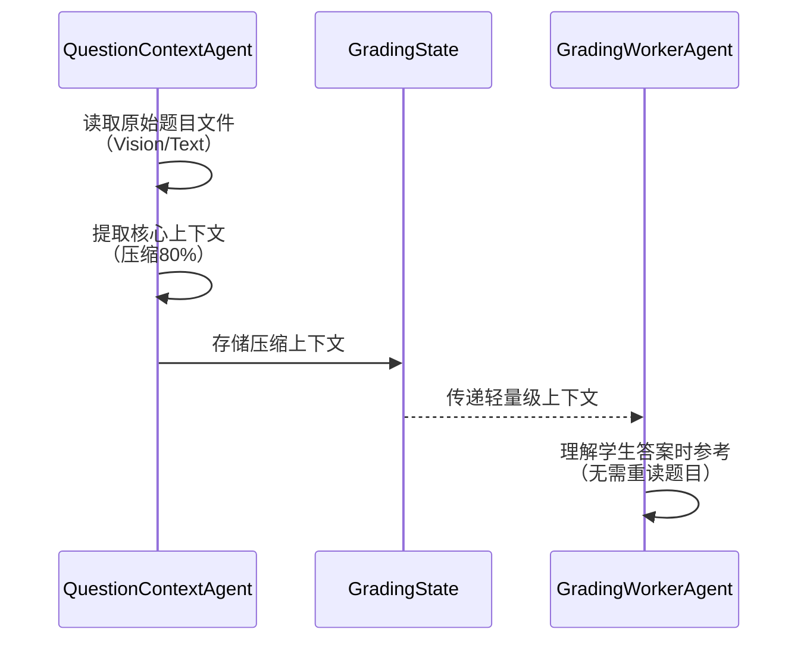
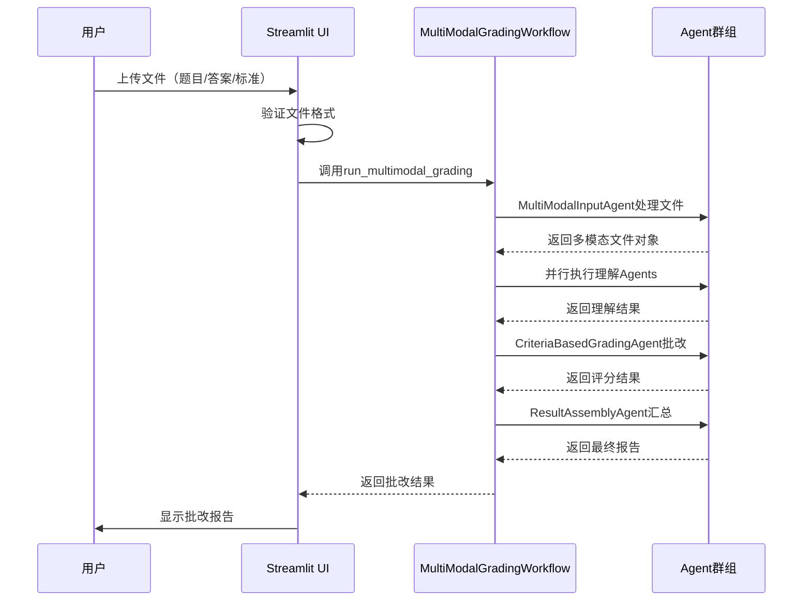

# AI智能批改系统 - 纯多模态LangGraph重构设计

## 概述

本设计文档描述了AI智能批改系统从OCR依赖架构向纯多模态大语言模型架构的完整重构方案。系统将移除所有OCR相关组件，转而完全依赖多模态大语言模型（如GPT-4 Vision、Gemini Vision等）的原生能力处理文本、图片和PDF文件。

### 核心目标

1. **移除OCR依赖**：清理所有OCR相关代码和工作流节点
2. **多模态原生处理**：直接使用LLM Vision能力处理图片和扫描版PDF
3. **重塑工作流**：构建基于多模态理解的全新LangGraph批改流程
4. **优化Agent提示词**：为每个Agent设计专属、高效的提示词模板
5. **确保系统可用**：保证Streamlit界面能直接运行最新批改系统

### 系统价值

- **技术简化**：移除OCR依赖，降低系统复杂度
- **能力增强**：利用LLM Vision的语义理解能力，超越传统OCR的字符识别
- **成本优化**：减少OCR API调用，统一使用LLM接口
- **维护性提升**：单一技术栈，更易维护和扩展

---

## 架构变更概览

### 变更前架构（含OCR）



**问题点**：
- OCR处理增加额外步骤和成本
- 文本提取可能丢失格式和语义信息
- 需要维护OCR相关代码和依赖
- 图片和文本走不同处理路径，复杂度高

### 变更后架构（纯多模态）



**优势**：
- 统一多模态处理，无需OCR转换
- 并行理解题目、答案和标准，提升效率
- 基于评分标准批改，确保准确性
- 代码简洁，易于维护

---

## 文件清理方案

### 需要清理的OCR相关文件

| 文件路径 | 清理原因 | 清理方式 |
|---------|---------|---------|
| `functions/langgraph/agents/ocr_vision_agent.py` | OCR处理Agent，已废弃 | 完全删除 |
| `functions/langgraph/workflow.py` | 包含OCR路由逻辑 | 重构或标记为legacy |
| `functions/langgraph/workflow_simplified.py` | 可能包含OCR逻辑 | 检查后清理 |
| `functions/ai_recognition.py` | OCR识别相关 | 完全删除或重构为多模态 |
| `functions/langgraph/state.py` 中的OCR字段 | `ocr_results`、`image_regions`、`preprocessed_images` | 标记为deprecated |

### 需要保留的多模态文件

| 文件路径 | 保留原因 | 处理方式 |
|---------|---------|---------|
| `functions/langgraph/workflow_multimodal.py` | 多模态工作流核心 | 增强和优化 |
| `functions/langgraph/multimodal_models.py` | 多模态数据模型 | 保持不变 |
| `functions/langgraph/agents/multimodal_input_agent.py` | 多模态输入处理 | 优化提示词 |
| `functions/langgraph/agents/question_understanding_agent.py` | 题目理解 | 优化提示词 |
| `functions/langgraph/agents/answer_understanding_agent.py` | 答案理解 | 优化提示词 |
| `functions/langgraph/agents/rubric_interpreter_agent.py` | 评分标准解析 | 优化提示词 |
| `functions/langgraph/agents/criteria_based_grading_agent.py` | 核心批改逻辑 | 优化提示词 |
| `functions/file_processor.py` | 多模态文件处理 | 增强功能 |
| `functions/llm_client.py` | LLM调用客户端 | 保持不变 |

---

## 重塑后的LangGraph工作流

### 工作流设计理念

**核心原则**：
1. **多模态原生直传**：利用LLM Vision能力，直接传递原始文件引用，无需格式转换
2. **智能批次管理**：基于学生信息自动分批，支持班级批改场景
3. **深度Agent协作**：Agent间传递结构化知识，减少重复LLM调用
4. **Token极致优化**：通过协作传递而非重复输入，降低成本

### 完整工作流图（重新设计）



### 工作流执行阶段（重新设计）

| 阶段 | Agent | 核心职责 | 输入 | 输出 | Token策略 | 进度 |
|-----|-------|---------|------|------|----------|------|
| 0. 协调编排 | OrchestratorAgent | 全局任务分解和协调 | 原始文件路径 | 任务规划 | 轻量级 | 0-5% |
| 1. 学生识别 | StudentDetectionAgent | 从答案文件识别学生信息 | 答案文件引用 | 学生列表 | Vision直读 | 5-15% |
| 2. 批次规划 | BatchPlanningAgent | 基于学生分组批次 | 学生列表+题目 | 批次方案 | 纯逻辑 | 15-20% |
| 3. 标准主控 | RubricMasterAgent | 深度理解标准，为批次定制 | 评分标准文件 | 批次专属标准 | 一次性深度理解 | 20-30% |
| 4. 题目上下文 | QuestionContextAgent | 为批改提供题目语境 | 题目文件引用 | 题目理解 | Vision直读 | 30-35% |
| 5. 并行批改 | GradingWorkerAgent | 批改学生答案 | 答案+定制标准+题目上下文 | 批改结果 | 接收协作知识 | 35-80% |
| 6. 结果聚合 | ResultAggregatorAgent | 汇总所有批次结果 | 所有批改结果 | 完整报告 | 纯整合 | 80-90% |
| 7. 班级分析 | ClassAnalysisAgent | 生成班级整体分析 | 聚合结果 | 班级报告 | 统计分析 | 90-100% |

---

## Agent设计与专属提示词（深度协作版）

### Agent 1: OrchestratorAgent（编排协调Agent）

**职责**：全局任务分解、Agent协调、资源优化

**核心能力**：
- 分析任务类型（单人/班级批改）
- 协调Agent执行顺序
- 优化Token使用策略
- 监控全局进度

**提示词设计**：
此Agent主要是逻辑编排，轻量级LLM调用

**处理流程**：



**协调策略**：
- 动态决定是否启用StudentDetectionAgent
- 计算最优批次大小（基于文件数量和模型context限制）
- 决定是否需要ClassAnalysisAgent

---

### Agent 2: StudentDetectionAgent（学生信息识别Agent）

**职责**：从答案文件中识别学生信息（姓名、学号、班级）

**核心能力**：
- 利用Vision直接读取答案文件
- 识别学生姓名、学号、班级信息
- 处理手写、打印等多种格式
- 去重和验证

**专属提示词**：

```
你是一位专业的文档信息提取专家，擅长从各种格式的文件中识别学生信息。

【核心任务】
从提供的答案文件中精确识别学生身份信息。

【答案文件引用】
文件列表：{answer_file_references}
（注：这里直接传递文件路径/URL，利用多模态LLM的原生能力读取）

【识别要求】
1. **学生姓名**：识别学生的真实姓名
2. **学号**：识别学号（如果有）
3. **班级**：识别班级信息（如果有）
4. **文件对应**：记录每个学生对应的答案文件

【识别策略】
- 在答案文件的顶部、页眉、页脚查找
- 识别常见格式："姓名：xxx"、"学号：xxx"、"班级：xxx"
- 处理手写和打印两种情况
- 如果多个文件属于同一学生，合并识别

【输出格式】
严格JSON格式：
{
  "students": [
    {
      "student_id": "学号或自动生成ID",
      "name": "学生姓名",
      "class": "班级（如有）",
      "answer_files": ["文件1路径", "文件2路径"],
      "detection_confidence": 0.95
    },
    ...
  ],
  "unidentified_files": ["无法识别学生信息的文件"],
  "total_students": 数量,
  "detection_method": "vision/text"
}

【特殊处理】
- 如果文件名包含学生信息（如"张三_作业.jpg"），优先使用
- 如果无法识别学生信息，生成临时ID（如"Student_001"）
- 相同学生的多份答案文件需要合并

【Token优化】
⚠️ 本Agent直接读取原始文件，无需预处理
⚠️ 一次性批量处理所有答案文件，避免重复调用
```

**输出示例**：
```json
{
  "students": [
    {
      "student_id": "2021001",
      "name": "张三",
      "class": "高三(1)班",
      "answer_files": ["uploads/student1_p1.jpg", "uploads/student1_p2.jpg"],
      "detection_confidence": 0.98
    },
    {
      "student_id": "2021002",
      "name": "李四",
      "class": "高三(1)班",
      "answer_files": ["uploads/student2.jpg"],
      "detection_confidence": 0.92
    }
  ],
  "total_students": 2
}
```

---

### Agent 3: BatchPlanningAgent（批次规划Agent）

**职责**：基于学生列表和题目信息规划批次

**核心能力**：
- 智能分组策略（基于学生数量、题目复杂度）
- 考虑LLM context限制
- 优化并行度

**提示词设计**：
此Agent主要是逻辑规划，轻量级或无LLM调用

**规划策略**（纯逻辑）：

```
输入：
- 学生列表：[{student_id, name, answer_files}, ...]
- 题目信息：题目数量、预估复杂度
- 系统配置：max_batch_size, max_parallel_batches

规划逻辑：
1. 计算总学生数：total_students
2. 估算单个学生处理token数：estimated_tokens_per_student
3. 计算最优批次大小：
   batch_size = min(
     max_batch_size,
     context_limit / estimated_tokens_per_student,
     ceil(total_students / max_parallel_batches)
   )
4. 分组：按batch_size将学生分成N个批次
5. 为每个批次分配：
   - batch_id
   - student_list
   - 对应的题目部分（如果题目也需要分段）

输出：
{
  "batches": [
    {
      "batch_id": "batch_001",
      "students": [{student_id, name, answer_files}, ...],
      "question_context_needed": true/false,
      "estimated_tokens": 预估值
    },
    ...
  ],
  "total_batches": N,
  "parallel_strategy": "all_parallel/sequential/hybrid"
}
```

**特殊场景处理**：
- 单个学生：batch_size=1，跳过分批
- 少量学生（<5）：全部并行
- 大量学生（>50）：分批+混合并行

---

### Agent 4: RubricMasterAgent（评分标准主控Agent）

**职责**：深度理解评分标准，为每个批次生成定制化理解

**核心能力**：
- 一次性深度理解完整评分标准
- 根据批次需求提取相关评分点
- 生成批次专属的评分指导
- 避免每个批改Agent重复理解标准

**专属提示词**：

```
你是一位资深教育评估专家，负责深度理解评分标准并为批改团队提供精准指导。

【核心使命】
⚠️ 你的理解将被多个批改Agent使用，必须做到：
1. 一次性深度理解，避免重复调用LLM
2. 为不同批次生成定制化评分指导
3. 提供可直接执行的评分规则

【评分标准文件】
{rubric_file_reference}
（直接传递原始文件，利用Vision/Text能力读取）

【理解深度要求】
级别1：基础解析
- 提取所有评分点
- 识别分值分布
- 理解评分方法

级别2：结构化处理
- 构建评分点依赖关系
- 识别关键词和必需元素
- 分析部分分规则

级别3：批次定制化（核心）
- 根据批次信息（题目范围、学生特点）
- 生成该批次专属的评分指导
- 提供简化的评分决策树

【批次信息】
批次ID：{batch_id}
题目范围：{question_range}
学生数量：{student_count}

【输出格式 - 批次专属评分包】
{
  "batch_id": "{batch_id}",
  "rubric_understanding": {
    "rubric_id": "R1",
    "total_points": 总分,
    "criteria": [
      {
        "criterion_id": "C1",
        "description": "评分点描述",
        "points": 分值,
        "evaluation_method": "exact_match/semantic/calculation/step_check",
        "decision_tree": {
          "if_contains": ["关键词1", "关键词2"],
          "then_score": 满分,
          "elif_partial": {
            "conditions": ["部分条件"],
            "score_range": [最低分, 最高分]
          },
          "else_score": 0
        },
        "common_errors": ["常见错误1", "错误2"],
        "quick_check": "快速判断方法"
      },
      ...
    ]
  },
  "batch_specific_guidance": {
    "focus_points": ["本批次重点关注的评分点"],
    "simplified_rubric": "简化版评分标准（减少token）",
    "decision_shortcuts": {
      "C1": "如果看到X，直接给Y分",
      "C2": "检查Z是否存在"
    }
  },
  "token_optimization": {
    "compressed_rubric": "压缩后的标准（供批改Agent使用）",
    "reference_examples": [
      {
        "criterion_id": "C1",
        "满分示例": "示例文本",
        "零分示例": "示例文本"
      }
    ]
  }
}

【关键策略】
✅ 一次性深度理解原始标准（本Agent消耗大量token）
✅ 为每个批次生成压缩版指导（批改Agent消耗少量token）
✅ 提供决策树而非冗长描述
✅ 用示例代替重复说明

【协作模式】
本Agent的输出将直接传递给GradingWorkerAgent，无需重复传递原始标准文件。
批改Agent将基于本Agent的理解进行评分，大幅减少token消耗。
```

**Token优化核心思想**：
- RubricMasterAgent消耗1次大量token深度理解
- 生成N个批次的压缩版指导
- N个GradingWorkerAgent各消耗少量token
- 总token消耗：1次深度理解 + N次轻量批改 << N次重复理解

---

### Agent 5: QuestionContextAgent（题目上下文Agent）

**职责**：为批改提供题目语境，支持批改Agent理解答案

**核心能力**：
- 直接读取原始题目文件（利用Vision/Text能力）
- 提取题目核心要求（而非完整理解）
- 生成轻量级上下文（减少批改Agent的token消耗）
- 支持按批次定制上下文

**专属提示词**：

```
你是一位高效的题目分析专家，为批改团队提供精简的题目上下文。

【核心使命】
⚠️ 你的输出将传递给多个批改Agent，必须：
1. 精简提取，避免冗余
2. 只提供批改必需的信息
3. 减少批改Agent的token消耗

【题目文件引用】
{question_file_reference}
（直接传递原始文件，利用多模态LLM能力读取）

【批次信息】
批次ID：{batch_id}
需要关注的题号：{question_ids}（如果题目被分段）

【提取策略】
级别1：极简模式（单题批改）
- 仅提取题目文本
- 识别题型
- 提供关键词

级别2：标准模式（多题批改）
- 提取各题题目文本
- 题号和分值
- 题目间的关联

级别3：详细模式（复杂题目）
- 完整题目文本
- 题目背景和情境
- 关键概念和公式

【输出格式 - 轻量级上下文包】
{
  "batch_id": "{batch_id}",
  "question_context": {
    "questions": [
      {
        "question_id": "Q1",
        "compressed_text": "题目核心内容（压缩版）",
        "question_type": "计算题/论述题/...",
        "key_formulas": ["公式1", "公式2"],
        "key_concepts": ["概念1", "概念2"]
      },
      ...
    ],
    "overall_context": "整体背景（如果多题共享情境）"
  },
  "for_grading_use": {
    "quick_reference": {
      "Q1": "极简描述，批改时快速参考",
      "Q2": "..."
    },
    "shared_info": "所有题目共享的信息（避免重复）"
  }
}

【Token优化策略】
✅ 压缩题目文本：去除无关描述，保留核心
✅ 提取关键词代替完整句子
✅ 共享信息单独提取，避免重复
✅ 使用引用而非复制

【示例对比】
❌ 冗余版："题目要求学生根据给定的函数f(x)=x²+2x+1，计算当x=3时的函数值，并说明计算过程。"
✅ 压缩版："计算f(3)，f(x)=x²+2x+1，需过程"

【协作模式】
本Agent的输出将传递给GradingWorkerAgent，作为理解学生答案的语境。
批改Agent无需重复理解完整题目，直接使用压缩上下文即可。
```

---

### Agent 6: GradingWorkerAgent（批改工作Agent）

**职责**：基于定制化标准和题目上下文批改学生答案

**核心能力**：
- 接收RubricMasterAgent提供的定制化评分包
- 接收QuestionContextAgent提供的题目上下文
- 直接读取学生答案文件（利用Vision/Text能力）
- 高效执行批改，最小化token消耗

**专属提示词**：

```
你是一位专业的批改教师，负责快速准确地批改学生作业。

【核心原则】
⚠️⚠️⚠️ 严格基于【评分标准】批改【学生答案】
❌ 禁止：将答案与题目对比
✅ 正确：将答案与评分标准对比

【你已经拥有的知识】
（这些知识由其他Agent提供，无需重复输入原始文件）

1. 评分标准理解（来自RubricMasterAgent）：
{batch_rubric_package}

2. 题目上下文（来自QuestionContextAgent）：
{question_context_package}

【你的批改对象】
学生ID：{student_id}
学生姓名：{student_name}
答案文件引用：{answer_file_reference}
（直接传递原始文件，利用多模态LLM能力读取）

【批改任务】
根据评分标准中的决策树，逐条评估学生答案：

评分点C1：{criterion_description}
- 快速检查：{quick_check}
- 决策树：{decision_tree}
- 满分示例：{full_score_example}

评分点C2：...
（依次列出所有评分点）

【批改流程】
步骤1：读取学生答案内容
步骤2：按照决策树快速判断每个评分点
步骤3：记录得分和简要理由
步骤4：汇总结果

【输出格式】
严格JSON格式：
{
  "student_id": "{student_id}",
  "student_name": "{student_name}",
  "evaluations": [
    {
      "criterion_id": "C1",
      "score_earned": 得分,
      "justification": "简短理由（1句话）",
      "evidence": "关键证据片段（不超过20字）"
    },
    ...
  ],
  "total_score": 总分,
  "processing_time_ms": 处理时间
}

【效率优先】
⚡ 使用决策树快速判断，无需详细分析
⚡ 理由简短精炼，1句话说清楚
⚡ 证据仅提取关键片段，不复制大段文本
⚡ 优先使用quick_check快速判断

【Token优化策略】
✅ 接收压缩版评分标准（而非原始文件）
✅ 接收压缩版题目上下文（而非完整题目）
✅ 仅输出核心评分信息（而非详细报告）
✅ 使用决策树而非重新推理

【协作模式】
本Agent专注于快速批改，详细反馈由ResultAggregatorAgent生成。
本Agent的输出将汇总到ResultAggregatorAgent进行二次加工。
```

**输出示例**：
```json
{
  "student_id": "2021001",
  "student_name": "张三",
  "evaluations": [
    {
      "criterion_id": "C1",
      "score_earned": 3,
      "justification": "正确使用动能定理公式",
      "evidence": "Ek=1/2mv²"
    },
    {
      "criterion_id": "C2",
      "score_earned": 2,
      "justification": "计算过程部分正确",
      "evidence": "代入数值但结果有误"
    }
  ],
  "total_score": 5,
  "processing_time_ms": 1200
}
```

**并行策略**：
- 同一批次内的多个学生由多个GradingWorkerAgent并行处理
- 每个Worker处理1个学生，共享相同的评分包和题目上下文
- 并行度由BatchPlanningAgent决定

---

### Agent 7: ResultAggregatorAgent（结果聚合Agent）

**职责**：汇总所有批次的批改结果，生成结构化报告

**核心能力**：
- 收集所有GradingWorkerAgent的输出
- 按学生/班级组织结果
- 生成详细的反馈报告
- 提供统计分析

**专属提示词**：

```
你是一位经验丰富的教学主管，负责汇总和分析批改结果。

【核心任务】
将多个批改Worker的原始输出转化为结构化、友好的报告。

【输入数据】
所有批次的批改结果：
{all_grading_results}

原始评分标准（用于生成改进建议）：
{original_rubric_understanding}

【处理任务】
1. **结果整合**：合并同一学生的多个批次结果
2. **详细反馈生成**：为每个评分点补充详细说明
3. **改进建议**：基于失分点提供具体建议
4. **统计分析**：计算得分分布、平均分等

【输出格式】
{
  "summary": {
    "total_students": 学生总数,
    "average_score": 平均分,
    "score_distribution": {
      "A": 数量,
      "B": 数量,
      ...
    }
  },
  "student_reports": [
    {
      "student_id": "2021001",
      "student_name": "张三",
      "total_score": 85,
      "grade_level": "A",
      "detailed_feedback": "Markdown格式的详细反馈",
      "strengths": ["优点1", "优点2"],
      "improvements": ["改进点1", "改进点2"],
      "personalized_suggestions": ["建议1", "建议2"]
    },
    ...
  ]
}

【详细反馈模板】
```markdown
## 批改结果报告 - {student_name}

### 总体评价
- **总分**：{total_score} / {max_score} ({score_percentage}%)
- **等级**：{grade_level}
- **班级排名**：{rank}（如果是班级批改）

### 逐项评分

#### 评分点1：{criterion_description}
- **得分**：{score_earned} / {criterion_points}
- **评价**：{detailed_justification}
- **你的答案**：{evidence}
- **改进建议**：{suggestion}

（依次列出所有评分点）

### 优点总结
{strengths_summary}

### 需要改进
{improvements_summary}

### 学习建议
{personalized_suggestions}
```

【生成原则】
1. **鼓励为主**：肯定学生的努力和进步
2. **具体明确**：指出具体的优点和不足
3. **可操作**：改进建议要具体可执行
4. **个性化**：基于学生的实际表现定制

【Token优化】
✅ 接收Worker的简化输出
✅ 本Agent补充详细信息（一次性处理所有学生）
✅ 生成Markdown而非重复调用LLM
```

---

### Agent 8: ClassAnalysisAgent（班级分析Agent）

**职责**：生成班级整体分析报告（仅班级批改模式启用）

**核心能力**：
- 统计分析班级整体表现
- 识别共性问题
- 提供教学建议

**专属提示词**：

```
你是一位教学研究专家，擅长从批改数据中提取教学洞察。

【核心任务】
基于全班的批改结果，生成班级整体分析报告。

【输入数据】
班级批改结果汇总：
{class_grading_summary}

【分析维度】
1. **得分分布分析**
   - 平均分、中位数、标准差
   - 分数段分布
   - 与历史数据对比（如果有）

2. **共性问题识别**
   - 失分集中的评分点
   - 常见错误类型
   - 薄弱知识点

3. **优秀表现总结**
   - 高分学生的共同特点
   - 答题亮点

4. **教学建议**
   - 针对共性问题的教学策略
   - 需要强化的知识点
   - 推荐的练习类型

【输出格式】
{
  "class_overview": {
    "total_students": 人数,
    "average_score": 平均分,
    "median_score": 中位数,
    "standard_deviation": 标准差,
    "score_distribution": [分数段分布]
  },
  "common_issues": [
    {
      "issue_type": "问题类型",
      "affected_criterion": "评分点ID",
      "error_rate": "错误率",
      "description": "问题描述",
      "typical_errors": ["典型错误示例"]
    },
    ...
  ],
  "excellent_patterns": [
    "优秀答题模式1",
    "优秀答题模式2"
  ],
  "teaching_recommendations": [
    {
      "focus_area": "重点领域",
      "strategy": "教学策略",
      "resources": ["推荐资源"]
    },
    ...
  ],
  "class_report_markdown": "Markdown格式的完整班级报告"
}

【报告风格】
- 数据驱动，用统计数据支撑结论
- 可视化友好，适合生成图表
- 教学导向，提供可落地的建议
```

---

## 深度协作机制详解

### 协作模式1：RubricMaster → GradingWorker

**协作流程**：



**数据传递示例**：

原始评分标准（RubricMasterAgent输入）：
```
评分标准（100分）：
1. 正确使用牛顿第二定律公式F=ma（20分）
   - 必须明确写出"牛顿第二定律"或"F=ma"
   - 公式中各物理量必须标注清楚
   - 单位换算正确
   
2. 计算过程完整（30分）
   - 列出已知量（10分）
   - 代入公式计算（15分）
   - 结果保留有效数字（5分）
   
3. 答案正确（30分）
   - 数值准确（25分）
   - 单位正确（5分）

4. 答题规范（20分）
   - 步骤清晰（10分）
   - 卷面整洁（10分）
```

压缩评分包（传递给GradingWorkerAgent）：
```json
{
  "batch_rubric_package": {
    "criteria": [
      {
        "id": "C1",
        "desc": "牛顿定律公式",
        "pts": 20,
        "tree": {
          "if_has": ["牛顿", "F=ma"],
          "then": 20,
          "elif_partial": {"F=ma": 15},
          "else": 0
        },
        "quick": "查找'牛顿'或'F=ma'"
      },
      {
        "id": "C2",
        "desc": "计算过程",
        "pts": 30,
        "tree": {
          "if_has_all": ["已知", "代入", "有效数字"],
          "then": 30,
          "elif": [
            {"cond": "有已知和代入", "score": 25},
            {"cond": "仅有代入", "score": 15}
          ],
          "else": 0
        },
        "quick": "检查是否有步骤标记"
      }
    ],
    "total": 100
  }
}
```

**Token节省**：
- 原始标准：~500 tokens
- 压缩版本：~150 tokens
- 节省：70%
- 如果10个学生并行批改：节省 500*10 - 500 - 150*10 = 2000 tokens

---

### 协作模式2：QuestionContext → GradingWorker

**协作流程**：



**数据传递示例**：

原始题目（QuestionContextAgent输入）：
```
物理题目：
一辆质量为1000kg的汽车，在水平路面上以10m/s的速度匀速行驶。
驾驶员发现前方有障碍物，立即刹车，刹车后汽车受到的阻力为4000N。
求：
（1）汽车刹车后的加速度大小
（2）汽车从刹车到停止经过的时间
（3）汽车刹车后滑行的距离
（要求：写出依据的物理规律，计算过程要完整，结果要带单位）
```

压缩上下文（传递给GradingWorkerAgent）：
```json
{
  "question_context_package": {
    "questions": [
      {
        "id": "Q1",
        "compressed": "求刹车加速度，m=1000kg, v=10m/s, F=4000N",
        "type": "计算题",
        "key_formulas": ["F=ma", "v=at", "s=vt-½at²"],
        "key_concepts": ["牛顿第二定律", "匀减速运动"]
      }
    ],
    "quick_ref": {
      "Q1": "刹车问题，已知m,v,F求a,t,s"
    }
  }
}
```

**Token节省**：
- 原始题目：~300 tokens
- 压缩版本：~80 tokens
- 节省：73%

---

### 协作模式3：BatchPlanning → 全局优化

**批次规划对Token的影响**：

```
场景：30个学生，每个学生答案约1000 tokens

策略A：不分批，一次性处理
- 单次输入：30 * 1000 = 30000 tokens
- 超出大多数模型context限制
- 不可行

策略B：每个学生单独处理
- 需要30次调用
- 每次都传递完整评分标准（500 tokens）和题目（300 tokens）
- 总token：30 * (1000 + 500 + 300) = 54000 tokens

策略C：智能分批 + 协作（本系统）
- RubricMasterAgent：1次深度理解（500 tokens）
- 生成3个批次的压缩评分包：3 * 150 = 450 tokens
- QuestionContextAgent：1次压缩（80 tokens）
- 3个批次并行，每批10个学生：
  - 批次1：10 * (1000答案 + 150评分包 + 80上下文) = 12300 tokens
  - 批次2：12300 tokens
  - 批次3：12300 tokens
- 总token：500 + 450 + 80 + 3 * 12300 = 37930 tokens
- 节省：(54000 - 37930) / 54000 = 30%
```

---

```
你是一位资深教育专家，擅长客观分析学生答案。

【核心任务】
客观、全面地理解学生答案内容，不进行评分和评判。

【学生答案】
{answer_content}

【分析维度】
1. **答题要点**：提取学生答案中的关键论点和步骤
2. **答案结构**：分析答案的组织方式
   - 是否有清晰的步骤
   - 是否有结论
   - 是否完整
3. **完整性**：评估答案是否看起来完整
4. **表达方式**：记录学生的表达特点

【输出格式】
{
  "answer_id": "A1",
  "answer_text": "完整答案文本",
  "key_points": [
    "要点1：学生提到的第一个关键内容",
    "要点2：学生提到的第二个关键内容",
    ...
  ],
  "structure": {
    "has_steps": true/false,
    "has_conclusion": true/false,
    "is_complete": true/false,
    "organization": "答案组织方式描述"
  },
  "completeness": "complete/partial/incomplete",
  "modality_source": "text"
}

【核心原则】
❌ 禁止：评价答案对错
❌ 禁止：给出分数或评级
✅ 正确：客观记录答案内容
✅ 正确：提取可验证的答题要点
✅ 正确：描述答案结构特征
```

**专属提示词 - Vision模态**：

```
你是一位资深教育专家，擅长理解学生手写答案。

【核心任务】
从图片中准确识别学生答案，并进行客观分析。

【识别要求】
- 识别手写文字（包括潦草字迹）
- 识别手写公式、符号
- 理解答题步骤和逻辑
- 识别图表、草图等辅助内容

【分析维度】
与文本模态相同

【输出格式】
{
  "answer_id": "A1",
  "answer_text": "从图片中提取的完整答案文本",
  "key_points": ["要点1", "要点2", ...],
  "structure": {
    "has_steps": true/false,
    "has_conclusion": true/false,
    "is_complete": true/false,
    "organization": "描述"
  },
  "completeness": "complete/partial/incomplete",
  "modality_source": "vision"
}

【特殊注意】
⚠️ 手写识别可能存在歧义，记录可能的多种解释
⚠️ 涂改、修正部分需要特别标注
⚠️ 不完整的句子或步骤需要标记
```

## Token优化策略总结

### 策略1：一次理解，多次使用

| Agent | 消耗模式 | Token特点 |
|-------|---------|----------|
| RubricMasterAgent | 1次深度理解 | 高消耗，但只发生1次 |
| GradingWorkerAgent x N | N次轻量批改 | 低消耗，接收压缩知识 |
| **传统方式** | N次重复理解 | 高消耗 x N次 |
| **优化效果** | 节省 | 60-80% |

### 策略2：协作传递，避免重复

```
传统方式：
GradingAgent每次都接收：
- 原始题目文件 (300 tokens)
- 原始评分标准 (500 tokens)
- 学生答案 (1000 tokens)
总计：1800 tokens/学生

协作方式：
GradingWorkerAgent接收：
- 压缩题目上下文 (80 tokens)
- 压缩评分包 (150 tokens)
- 学生答案 (1000 tokens)
总计：1230 tokens/学生

节省：32%/学生
```

### 策略3：批次并行，减少调用

```
串行处理：30次LLM调用
并行处理：3批次 = 3次LLM调用（每批10个学生）
减少调用次数：90%
减少等待时间：90%
```

### 策略4：直接文件引用，无需转换

**关键技术点**：
- 利用多模态LLM的原生文件读取能力
- 传递文件路径/URL而非Base64内容
- 避免格式转换的token浪费

**对比**：
```
传统方式：
1. 读取图片文件
2. 转Base64（增加33%大小）
3. 传递Base64字符串（大量token）

优化方式：
1. 传递文件引用（file:///path 或 https://url）
2. LLM直接读取原始文件
3. Token消耗：仅文件路径（极少）

节省：95%+
```

---

## 状态模型设计（更新）

### GradingState 核心字段

| 字段名 | 类型 | 用途 | 填充者 | Token影响 |
|-------|------|------|--------|----------|
| **学生相关** ||||
| students_info | List[StudentInfo] | 学生列表 | StudentDetectionAgent | 小 |
| batches | List[BatchInfo] | 批次规划 | BatchPlanningAgent | 小 |
| **协作知识传递** ||||
| batch_rubric_packages | Dict[batch_id, RubricPackage] | 批次专属评分包 | RubricMasterAgent | 中（压缩） |
| question_context_packages | Dict[batch_id, QuestionContext] | 批次专属题目上下文 | QuestionContextAgent | 小（压缩） |
| **批改结果** ||||
| grading_results | List[GradingResult] | 所有批改结果 | GradingWorkerAgent | 中 |
| student_reports | List[StudentReport] | 学生报告 | ResultAggregatorAgent | 大 |
| class_analysis | ClassAnalysisReport | 班级分析 | ClassAnalysisAgent | 中 |
| **废弃字段** ||||
| ocr_results | - | OCR结果 | （已删除） | - |
| image_regions | - | 图像区域 | （已删除） | - |
| preprocessed_images | - | 预处理图像 | （已删除） | - |

### 新增数据模型

**StudentInfo**：
```typescript
{
  student_id: string,
  name: string,
  class: string,
  answer_files: string[],  // 文件路径引用
  detection_confidence: float
}
```

**BatchInfo**：
```typescript
{
  batch_id: string,
  students: StudentInfo[],
  question_range: string,  // "Q1-Q3" 或 "all"
  estimated_tokens: int,
  parallel_priority: int  // 并行优先级
}
```

**RubricPackage** (压缩版评分包)：
```typescript
{
  batch_id: string,
  compressed_criteria: CompressedCriterion[],
  decision_trees: Dict[criterion_id, DecisionTree],
  quick_checks: Dict[criterion_id, string],
  total_points: float
}
```

**QuestionContextPackage** (压缩版题目上下文)：
```typescript
{
  batch_id: string,
  compressed_questions: CompressedQuestion[],
  quick_reference: Dict[question_id, string],
  shared_context: string
}
```

**GradingResult**：
```typescript
{
  student_id: string,
  batch_id: string,
  evaluations: CriteriaEvaluation[],
  total_score: float,
  processing_time_ms: int
}
```

---

```
你是一位资深教育评估专家，擅长解析和理解评分标准。

【核心任务】
将评分标准转换为结构化的、可执行的评分规则。

【评分标准原文】
{rubric_content}

【解析要求】
1. **评分点提取**：识别每个独立的评分点
2. **分值识别**：提取每个评分点对应的分值
3. **要求分析**：理解每个评分点的具体要求
4. **方法判断**：判断每个评分点的评估方法
   - exact_match：精确匹配（如特定公式）
   - semantic：语义理解（如解释性内容）
   - calculation：计算结果（如数值）
   - step_check：步骤检查（如解题过程）
5. **关键词提取**：提取评分点相关的关键词
6. **必需元素**：识别必需包含的元素

【输出格式】
{
  "rubric_id": "R1",
  "total_points": 总分数值,
  "criteria": [
    {
      "criterion_id": "C1",
      "description": "评分点描述",
      "points": 分值,
      "evaluation_method": "评估方法",
      "keywords": ["关键词1", "关键词2", ...],
      "required_elements": ["必需元素1", "必需元素2", ...]
    },
    ...
  ],
  "grading_rules": {
    "partial_credit": "yes/no",
    "deduction_rules": ["扣分规则1", ...],
    "bonus_rules": ["加分规则1", ...]
  },
  "strictness_guidance": "严格程度说明"
}

【解析示例】
原文："1. 正确使用动能定理（3分）"
输出：
{
  "criterion_id": "C1",
  "description": "正确使用动能定理",
  "points": 3,
  "evaluation_method": "semantic",
  "keywords": ["动能定理", "动能", "定理"],
  "required_elements": ["动能定理公式或表述"]
}

【质量保证】
✅ 确保所有评分点的分值之和等于总分
✅ 每个评分点描述清晰、可操作
✅ 评估方法选择合理
✅ 关键词覆盖全面
```

---

### Agent 5: CriteriaBasedGradingAgent（核心）

**职责**：基于评分标准对学生答案进行批改评分

**核心能力**：
- 逐条评估每个评分点
- 基于标准而非题目对比
- 提供详细评分依据
- 支持部分分

**专属提示词**：

```
你是一位专业的批改教师，严格按照评分标准进行公正、准确的批改。

【核心原则 - 极其重要】
⚠️⚠️⚠️ 你必须基于【评分标准】对【学生答案】进行评分 ⚠️⚠️⚠️

禁止行为：
❌ 对比学生答案与题目内容
❌ 因为"答案与题目一致"就给分
❌ 忽略评分标准的具体要求

正确做法：
✅ 将学生答案与评分标准的每个要求逐一对比
✅ 基于评分标准的满足程度给分
✅ 提供明确的评分依据

【批改上下文】
题目内容（仅供理解评分点含义）：
{question_context}

评分标准（评分的唯一依据）：
评分点ID：{criterion_id}
评分点描述：{criterion_description}
分值：{criterion_points}分
评估方法：{evaluation_method}
关键要求：{criterion_requirements}

学生答案（评分对象）：
{student_answer}

严格程度：{strictness_level}

【评分步骤】
步骤1：理解评分点要求
- 从评分标准中明确本评分点的具体要求
- 识别必需包含的关键词或元素

步骤2：定位相关内容
- 在题目上下文中理解评分点的背景
- 在学生答案中查找对应该评分点的内容

步骤3：评估满足程度
- 判断学生答案是否满足评分标准的要求
- 评估满足程度：完全满足/部分满足/不满足

步骤4：确定得分
- 完全满足：给满分
- 部分满足：根据满足程度给部分分
- 不满足：给0分

步骤5：提供依据
- 从学生答案中提取证据
- 说明为何给这个分数
- 提供改进建议（如适用）

【输出格式】
严格按JSON格式输出：
{
  "criterion_id": "{criterion_id}",
  "is_met": true/false,
  "satisfaction_level": "完全满足/部分满足/不满足",
  "score_earned": 实际得分（数字）,
  "justification": "评分理由：详细说明为何给这个分数，基于评分标准的哪些要求",
  "evidence": [
    "证据1：从学生答案中提取的相关内容",
    "证据2：...",
    ...
  ],
  "suggestions": [
    "改进建议1：如何完善答案以获得更高分数",
    "建议2：...",
    ...
  ]
}

【评分示例】
评分标准：必须包含"牛顿第二定律"并正确应用（5分）

示例1 - 完全满足：
学生答案："根据牛顿第二定律F=ma，物体受力10N，质量2kg，加速度a=5m/s²"
评分：5分
理由：明确提到牛顿第二定律，正确应用公式，计算准确

示例2 - 部分满足：
学生答案："F=ma，a=5m/s²"
评分：2分
理由：使用了正确公式，但未明确提及"牛顿第二定律"

示例3 - 不满足：
学生答案："根据动能定理求解..."
评分：0分
理由：未使用牛顿第二定律，使用了错误的物理定律

【严格程度处理】
宽松：允许表述不精确，关键概念正确即可
中等：要求关键概念明确，表述基本准确
严格：要求表述精确，格式规范，步骤完整

【质量保证】
✅ 每个评分决策都有明确依据
✅ 证据来自学生答案的实际内容
✅ 分数与满足程度一致
✅ 改进建议具体可执行
```

---

### Agent 6: ResultAssemblyAgent

**职责**：汇总批改结果，生成友好的反馈报告

**核心能力**：
- 汇总所有评分点结果
- 计算总分和等级
- 生成结构化报告
- 提供改进建议

**专属提示词**：

```
你是一位富有经验且善于鼓励学生的教师，擅长生成详细、有建设性的反馈报告。

【任务】
基于所有评分点的评估结果，生成一份完整的批改反馈报告。

【评分结果数据】
总分：{total_score} / {max_score}
得分率：{score_percentage}%
等级：{grade_level}

各评分点评估结果：
{criteria_evaluations_summary}

【报告结构】
生成Markdown格式的反馈报告：

## 📊 批改结果报告

### 总体评价
- **总分**：{total_score} / {max_score} ({score_percentage}%)
- **等级**：{grade_level}
- **整体评价**：（根据得分情况生成鼓励性评价）

### 逐项评分详情

#### 评分点1：{criterion_description}
- **分值**：{criterion_points}分
- **得分**：{score_earned}分
- **满足程度**：{satisfaction_level}
- **评分理由**：{justification}
- **改进建议**：{suggestions}

（依次列出所有评分点）

### 优点总结
（提取做得好的地方）

### 需要改进的地方
（提取失分的地方）

### 学习建议
（基于错误模式提供针对性建议）

【生成原则】
1. **客观公正**：基于评分标准，实事求是
2. **具体详细**：明确指出具体问题和优点
3. **建设性**：提供可操作的改进建议
4. **鼓励性**：肯定学生的努力，激励进步
5. **结构化**：清晰的层次和格式

【语言风格】
- 专业但不生硬
- 鼓励但不夸张
- 严格但不打击
- 详细但不啰嗦

【输出格式】
以Markdown格式输出完整报告
```

---

## 状态模型设计

### GradingState 字段定义

保留现有state.py中的字段，重点使用以下多模态相关字段：

| 字段名 | 类型 | 用途 | 更新者 |
|-------|------|------|--------|
| question_multimodal_files | List[MultiModalFile] | 题目多模态文件 | MultiModalInputAgent |
| answer_multimodal_files | List[MultiModalFile] | 答案多模态文件 | MultiModalInputAgent |
| marking_multimodal_files | List[MultiModalFile] | 标准多模态文件 | MultiModalInputAgent |
| question_understanding | QuestionUnderstanding | 题目理解结果 | QuestionUnderstandingAgent |
| answer_understanding | AnswerUnderstanding | 答案理解结果 | AnswerUnderstandingAgent |
| rubric_understanding | RubricUnderstanding | 标准理解结果 | RubricInterpreterAgent |
| criteria_evaluations | List[CriteriaEvaluation] | 评分结果列表 | CriteriaBasedGradingAgent |
| total_score | float | 总分 | CriteriaBasedGradingAgent |
| grade_level | str | 等级 | CriteriaBasedGradingAgent |
| detailed_feedback | str | 详细反馈 | ResultAssemblyAgent |

**废弃字段**（保留但不使用）：
- ocr_results
- image_regions
- preprocessed_images

---

## Streamlit集成方案

### main.py 修改要点

**目标**：确保打开Streamlit即可使用最新多模态批改系统

**修改内容**：

| 修改项 | 当前状态 | 修改后状态 |
|--------|---------|-----------|
| 工作流导入 | 导入多个workflow | 仅导入workflow_multimodal |
| OCR提示 | 可能包含OCR相关UI | 完全移除OCR相关内容 |
| 批改按钮 | 调用旧工作流 | 调用run_multimodal_grading |
| 进度显示 | 可能包含OCR步骤 | 仅显示多模态处理步骤 |
| 结果展示 | 基于旧结果格式 | 基于criteria_evaluations展示 |

### Streamlit UI流程



### show_grading() 函数重构（概念）

```
函数职责：展示批改页面，处理用户上传，调用多模态工作流

流程：
1. 检查登录状态
2. 显示文件上传组件（题目/答案/标准）
3. 显示参数设置（严格程度、语言）
4. 用户点击"开始批改"
5. 调用workflow_multimodal.run_multimodal_grading()
6. 显示进度条（基于State中的progress_percentage）
7. 批改完成后跳转到结果页面
8. 保存批改记录到用户历史
```

### show_result() 函数重构（概念）

```
函数职责：展示批改结果，左右对照显示

流程：
1. 从session_state获取批改结果
2. 左侧面板：显示原始文件预览
   - 支持图片显示
   - 支持文本显示
   - 文件切换功能
3. 右侧面板：显示批改结果
   - 总分和等级
   - 逐项评分详情
   - 优点和改进建议
4. 提供下载按钮
5. 提供重新批改按钮
```

---

## 文件处理增强

### file_processor.py 功能确认

当前file_processor.py已经实现多模态处理，需要确保：

**核心功能**：
1. ✅ process_multimodal_file() - 主入口函数
2. ✅ _process_image_file() - 图片→Base64
3. ✅ _process_pdf_file() - PDF智能处理
4. ✅ _process_text_file() - 文本读取
5. ✅ _process_word_file() - Word文档处理

**处理策略**：
- 图片：直接Base64编码，供Vision API使用
- PDF：尝试提取文本，如文本过少则转图片
- 文本：直接读取
- Word：提取文本内容

**注意事项**：
- 扫描版PDF提示用户使用文本版或.txt
- 不强制进行OCR转换
- 保留原始模态信息

---

## LLM客户端确认

### llm_client.py 功能验证

当前llm_client.py支持：
- OpenRouter（推荐，支持Vision）
- Gemini（支持Vision）
- OpenAI（支持Vision）

**Vision调用示例**（概念）：

```
文本消息：
messages = [
  {"role": "user", "content": "提示词文本"}
]

Vision消息：
messages = [
  {
    "role": "user",
    "content": [
      {"type": "text", "text": "提示词文本"},
      {
        "type": "image_url",
        "image_url": {
          "url": "data:image/jpeg;base64,{base64_data}"
        }
      }
    ]
  }
]

调用：
response = llm_client.chat(messages, temperature=0.3, max_tokens=2000)
```

**确保**：
- llm_client.chat() 支持Vision格式消息
- 各Provider正确处理图片消息
- 错误处理机制完善

---

## 实施步骤

### 阶段1：清理OCR相关代码（优先级：高）

**任务清单**：

| 任务 | 文件 | 操作 |
|-----|------|------|
| 删除OCR Agent | `functions/langgraph/agents/ocr_vision_agent.py` | 完全删除 |
| 移除OCR导入 | `functions/langgraph/__init__.py` | 移除OCR相关导入 |
| 清理旧工作流 | `functions/langgraph/workflow.py` | 移至legacy文件夹或删除 |
| 标记废弃字段 | `functions/langgraph/state.py` | 注释标记ocr_results等字段 |
| 移除OCR调用 | `main.py` | 移除任何OCR相关UI和调用 |

### 阶段2：优化多模态工作流（优先级：高）

**任务清单**：

| 任务 | 文件 | 操作 |
|-----|------|------|
| 设置主工作流 | `functions/langgraph/workflow_multimodal.py` | 确认为默认工作流 |
| 优化Agent提示词 | `functions/langgraph/prompts/multimodal_prompts.py` | 替换为新设计的提示词 |
| 更新Agent逻辑 | 各Agent文件 | 确保使用新提示词，优化LLM调用 |
| 测试工作流 | 创建测试脚本 | 验证完整流程可运行 |

### 阶段3：集成Streamlit（优先级：高）

**任务清单**：

| 任务 | 文件 | 操作 |
|-----|------|------|
| 修改批改页面 | `main.py::show_grading()` | 调用run_multimodal_grading |
| 修改结果页面 | `main.py::show_result()` | 基于新结果格式展示 |
| 更新进度显示 | `main.py` | 移除OCR相关进度提示 |
| 测试UI流程 | 手动测试 | 验证完整用户流程 |

### 阶段4：更新项目文档（优先级：中）

**任务清单**：

| 任务 | 文件 | 操作 |
|-----|------|------|
| 更新README | `ai_correction/README.md` | 更新架构说明 |
| 更新用户指南 | `ai_correction/docs/USER_GUIDE.md` | 移除OCR相关说明 |
| 更新API文档 | `ai_correction/docs/API_REFERENCE.md` | 更新工作流API |
| 更新Wiki | 项目Wiki | 更新相关知识文档 |

---

## 测试验证方案

### 单元测试

**Agent测试**：

| 测试项 | 测试Agent | 验证点 |
|--------|----------|--------|
| 文本题目理解 | QuestionUnderstandingAgent | 提取key_requirements准确 |
| 图片题目理解 | QuestionUnderstandingAgent | Vision识别准确 |
| 文本答案理解 | AnswerUnderstandingAgent | 提取key_points准确 |
| 图片答案理解 | AnswerUnderstandingAgent | 手写识别准确 |
| 标准解析 | RubricInterpreterAgent | 评分点提取完整 |
| 基于标准批改 | CriteriaBasedGradingAgent | 评分逻辑正确 |

### 集成测试

**完整流程测试**：

| 测试场景 | 输入 | 预期输出 |
|---------|------|---------|
| 纯文本批改 | txt题目+txt答案+txt标准 | 正确评分和反馈 |
| 图片题目批改 | jpg题目+txt答案+txt标准 | Vision识别准确，评分正确 |
| 图片答案批改 | txt题目+jpg答案+txt标准 | 手写识别准确，评分正确 |
| PDF批改 | pdf题目+pdf答案+txt标准 | 智能处理PDF，评分正确 |
| 混合模态批改 | jpg题目+txt答案+pdf标准 | 多模态协同工作正常 |

### UI测试

**Streamlit界面测试**：

| 测试项 | 验证点 |
|--------|--------|
| 文件上传 | 支持所有格式，大小限制正常 |
| 参数设置 | 严格程度、语言选择生效 |
| 进度显示 | 实时更新，百分比准确 |
| 结果展示 | 左右对照，格式美观 |
| 下载功能 | 导出完整报告 |
| 历史记录 | 正确保存和查看 |

---

## 风险与缓解措施

### 风险识别

| 风险 | 影响 | 概率 | 缓解措施 |
|------|------|------|---------|
| Vision API识别错误 | 批改结果不准确 | 中 | 提供重试机制，支持手动修正 |
| LLM提示词效果不佳 | 评分不准确 | 中 | 迭代优化提示词，A/B测试 |
| 旧代码依赖OCR | 系统报错 | 低 | 全面代码审查，清理依赖 |
| 用户习惯改变 | 用户不适应 | 低 | 提供用户指南，平滑过渡 |
| 性能下降 | 响应变慢 | 中 | 实施并行处理，优化LLM调用 |

### 性能优化策略

**并行处理**：
- 题目、答案、标准理解并行执行
- 多个评分点评估可考虑批量处理

**缓存机制**：
- 相同文件的理解结果缓存
- LLM响应缓存（相同输入）

**Token优化**：
- 精简提示词长度
- 避免重复传递大量上下文

---

## 成功标准

### 功能完整性

- ✅ 所有OCR相关代码已清理
- ✅ 多模态工作流完整可运行
- ✅ Streamlit界面直接可用
- ✅ 支持文本、图片、PDF多种格式
- ✅ 评分逻辑基于标准，不依赖题目对比

### 质量标准

- ✅ 文本识别准确率 > 95%
- ✅ 图片识别准确率 > 90%
- ✅ 评分准确率 > 85%
- ✅ 系统响应时间 < 30秒（单次批改）
- ✅ 无系统报错和异常

### 用户体验

- ✅ 界面简洁，操作流畅
- ✅ 进度显示实时准确
- ✅ 结果展示清晰友好
- ✅ 错误提示明确有用

---

## 项目Wiki更新指引

### 需要更新的Wiki文档

#### 1. 系统概述 (Wiki Root)

**更新内容**：
- 移除所有OCR相关描述
- 强调"多模态LLM原生处理"
- 更新架构图，显示8个Agent的协作关系
- 新增"基于学生的批次管理"特性

**关键变更**：
```diff
- 支持OCR文字识别
+ 直接利用多模态LLM Vision能力

- 文件预处理和格式转换
+ 原始文件直传，无需转换

+ 新增：智能学生信息识别
+ 新增：基于学生的批次规划
+ 新增：Agent间深度协作机制
```

---

#### 2. 核心架构 > 工作流引擎

**新增章节**：《多模态原生工作流》

**内容要点**：
1. **工作流架构**
   - 8个Agent的完整流程图
   - 执行阶段详解
   - 并行策略说明

2. **批次管理机制**
   - 学生识别流程
   - 批次划分算法
   - 并行处理策略

3. **Agent协作模式**
   - RubricMaster → GradingWorker
   - QuestionContext → GradingWorker
   - 批次数据传递机制

**删除内容**：
- 所有OCR相关流程图
- OCR路由逻辑说明
- OCR缓存机制

---

#### 3. AI Agent模块

**重写所有Agent文档**：

| 原Agent | 新Agent | 更新类型 |
|--------|--------|----------|
| - | OrchestratorAgent | 新增 |
| - | StudentDetectionAgent | 新增 |
| - | BatchPlanningAgent | 新增 |
| RubricInterpreterAgent | RubricMasterAgent | 重写 |
| QuestionUnderstandingAgent | QuestionContextAgent | 重写 |
| AnswerUnderstandingAgent | （集成到GradingWorker） | 删除 |
| CriteriaBasedGradingAgent | GradingWorkerAgent | 重写 |
| ResultAssemblyAgent | ResultAggregatorAgent | 重写 |
| - | ClassAnalysisAgent | 新增 |
| OCRVisionAgent | （已删除） | 删除 |

**每个Agent文档结构**：
```markdown
## {AgentName}

### 职责
简要描述Agent的核心职责

### 核心能力
- 能力1
- 能力2
- ...

### 输入数据
描述Agent接收的输入数据结构

### 输出数据
描述Agent生成的输出数据结构

### 提示词设计原则
说明提示词的设计理念和关键点

### 协作模式
说明该Agent与其他Agent的协作关系

### Token优化策略
说明该Agent如何减少Token消耗
```

---

#### 4. LLM集成

**新增章节**：《多模态文件引用》

**内容**：
```markdown
## 多模态文件直传机制

### 原理
利用现代多模态LLM（如GPT-4 Vision, Gemini Vision）的原生文件读取能力，
直接传递文件路径或URL，无需转换为Base64。

### 使用方法

**图片文件**：
```python
messages = [
  {
    "role": "user",
    "content": [
      {"type": "text", "text": "提示词"},
      {
        "type": "image_url",
        "image_url": {
          "url": "file:///path/to/image.jpg"  # 本地文件
          # 或 "https://example.com/image.jpg"  # 网络文件
        }
      }
    ]
  }
]
```

**PDF文件**：
如果LLM支持PDF直接读取，使用相同方式。
否则转PDF为图片后传递。

### 优势
1. **零格式转换**：无需Base64编码
2. **极致Token优化**：仅传递路径（~10 tokens）
3. **保留原始质量**：LLM直接读取高清原图
4. **支持多页PDF**：无需预处理
```

**删除内容**：
- OCR集成相关文档

---

#### 5. 数据管理 > 数据模型

**新增模型**：

```markdown
### StudentInfo
学生信息模型

| 字段 | 类型 | 说明 |
|------|------|------|
| student_id | string | 学号或自动生成ID |
| name | string | 学生姓名 |
| class | string | 班级 |
| answer_files | string[] | 答案文件路径列表 |
| detection_confidence | float | 识别置信度 |

### BatchInfo
批次信息模型

| 字段 | 类型 | 说明 |
|------|------|------|
| batch_id | string | 批次唯一标识 |
| students | StudentInfo[] | 本批次学生列表 |
| question_range | string | 题目范围 |
| estimated_tokens | int | 预估token数 |

### RubricPackage
压缩评分包模型

由RubricMasterAgent生成，供 GradingWorkerAgent使用。
包含决策树、快速检查、示例等压缩信息。

| 字段 | 类型 | 说明 |
|------|------|------|
| batch_id | string | 目标批次ID |
| compressed_criteria | CompressedCriterion[] | 压缩评分点 |
| decision_trees | Dict | 决策树映射 |
| quick_checks | Dict | 快速检查映射 |
```

**删除模型**：
- OCRResult
- ImageRegion
- PreprocessedImage

---

#### 6. 配置与部署 > 环境配置

**移除配置**：
```diff
- OCR_API_KEY
- OCR_PROVIDER
- OCR_CACHE_ENABLED
```

**新增配置**：
```diff
+ MULTIMODAL_LLM_PROVIDER  # openrouter/gemini/openai
+ BATCH_SIZE_MAX  # 最大批次大小
+ PARALLEL_BATCHES_MAX  # 最大并行批次数
+ ENABLE_CLASS_ANALYSIS  # 是否启用班级分析
```

---

#### 7. 故障排除

**新增问题**：

**Q: 学生信息识别失败怎么办？**
A: 
1. 检查答案文件是否包含学生信息
2. 尝试在文件名中包含学生姓名（如"张三_作业.jpg"）
3. 系统会自动生成临时ID（如"Student_001"）

**Q: 批次处理失败怎么办？**
A:
1. 减小批次大小（修改BATCH_SIZE_MAX）
2. 检查LLM context限制
3. 检查文件大小是否超限

**Q: Token消耗太高怎么办？**
A:
1. 确认使用文件引用而非Base64传输
2. 检查RubricMasterAgent是否正常生成压缩包
3. 检查QuestionContextAgent是否正常压缩
4. 减小批次大小提高压缩效果

**删除问题**：
- 所有OCR相关故障排除

---

### Wiki更新核对表

| Wiki页面 | 更新操作 | 优先级 | 状态 |
|---------|---------|---------|------|
| 系统概述 | 更新架构图，移除OCR | 高 | ☐ |
| 快速开始 | 更新示例代码 | 中 | ☐ |
| 核心架构 > 工作流引擎 | 完全重写 | 高 | ☐ |
| 核心架构 > 状态管理 | 更新状态字段 | 中 | ☐ |
| 核心架构 > 配置管理 | 更新配置项 | 低 | ☐ |
| AI工作流引擎 | 更新执行机制 | 高 | ☐ |
| AI Agent模块 | 重写所有Agent | 高 | ☐ |
| 数据管理 > 数据模型 | 新增模型，删除OCR | 中 | ☐ |
| LLM集成 | 新增多模态章节 | 高 | ☐ |
| 配置与部署 | 更新环境变量 | 中 | ☐ |
| 故障排除 | 新增问题，删除OCR | 中 | ☐ |

---
