# API参考

<cite>
**本文档引用的文件**
- [workflow_multimodal.py](file://ai_correction\functions\langgraph\workflow_multimodal.py) - *重构版多模态批改工作流*
- [orchestrator_agent.py](file://ai_correction\functions\langgraph\agents\orchestrator_agent.py) - *任务编排Agent*
- [student_detection_agent.py](file://ai_correction\functions\langgraph\agents\student_detection_agent.py) - *学生信息识别Agent*
- [batch_planning_agent.py](file://ai_correction\functions\langgraph\agents\batch_planning_agent.py) - *批次规划Agent*
- [rubric_master_agent.py](file://ai_correction\functions\langgraph\agents\rubric_master_agent.py) - *评分标准主控Agent*
- [question_context_agent.py](file://ai_correction\functions\langgraph\agents\question_context_agent.py) - *题目上下文Agent*
- [grading_worker_agent.py](file://ai_correction\functions\langgraph\agents\grading_worker_agent.py) - *批改工作Agent*
- [result_aggregator_agent.py](file://ai_correction\functions\langgraph\agents\result_aggregator_agent.py) - *结果聚合Agent*
- [class_analysis_agent.py](file://ai_correction\functions\langgraph\agents\class_analysis_agent.py) - *班级分析Agent*
- [state.py](file://ai_correction\functions\langgraph\state.py) - *状态模型定义*
- [file_processor.py](file://ai_correction/functions/file_processor.py)
- [install_pdf_support.py](file://ai_correction/install_pdf_support.py)
- [result_formatter.py](file://ai_correction/functions/langgraph/result_formatter.py)
- [llm_client.py](file://ai_correction/functions/llm_client.py)
- [workflow.py](file://ai_correction/functions/langgraph/workflow.py)
- [question_understanding_agent.py](file://ai_correction/functions/langgraph/agents/question_understanding_agent.py)
- [rubric_interpreter_agent.py](file://ai_correction/functions/langgraph/agents/rubric_interpreter_agent.py)
- [scoring_agent.py](file://ai_correction/functions/langgraph/agents/scoring_agent.py)
- [result_aggregator_agent.py](file://ai_correction/functions/langgraph/agents/result_aggregator_agent.py)
- [multimodal_models.py](file://ai_correction/functions/langgraph/multimodal_models.py)
- [multimodal_prompts.py](file://ai_correction/functions/langgraph/prompts/multimodal_prompts.py)
- [multimodal_input_agent.py](file://ai_correction/functions/langgraph/agents/multimodal_input_agent.py)
- [test_multimodal_grading.py](file://ai_correction/test_multimodal_grading.py)
- [test_scoring.py](file://ai_correction/test_scoring.py)
</cite>

## 更新摘要
**变更内容**  
- 新增深度协作的8个Agent架构说明
- 更新批改工作流为重构版多模态工作流
- 新增OrchestratorAgent任务编排机制
- 新增基于批次的批改流程
- 新增Token优化策略说明
- 更新结果聚合与报告生成流程
- 修订系统架构概览图
- 更新核心Agent实现章节

## 目录
1. [简介](#简介)
2. [系统架构概览](#系统架构概览)
3. [多模态文件处理模块](#多模态文件处理模块)
4. [核心Agent实现](#核心agent实现)
5. [批改工作流](#批改工作流)
6. [结果聚合与报告生成](#结果聚合与报告生成)
7. [LLM客户端集成](#llm客户端集成)
8. [数据模型与状态管理](#数据模型与状态管理)
9. [性能优化策略](#性能优化策略)
10. [故障排除指南](#故障排除指南)

## 简介

AI批改系统是一个基于LangGraph框架的智能批改平台，采用多模态处理技术和基于标准的评分方法。系统支持文本、图片、PDF等多种文件格式，通过多个专门的Agent协同工作，实现高效的自动批改功能。

### 核心特性

- **多模态文件处理**：支持文本、图片、PDF、Word文档等多种格式
- **基于标准的评分**：严格按照评分标准进行批改，避免主观偏差
- **智能Agent协作**：多个专门Agent协同完成批改任务
- **性能优化**：并行处理、缓存机制、Token优化等
- **灵活配置**：支持多种批改模式和严格程度设置

## 系统架构概览

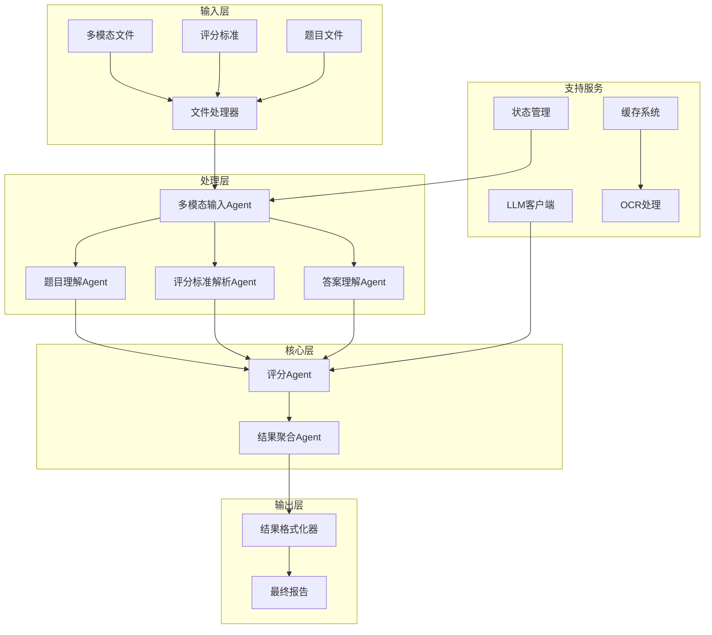

**图表来源**
- [workflow.py](file://ai_correction/functions/langgraph/workflow.py#L1-L100)
- [state.py](file://ai_correction/functions/langgraph/state.py#L1-L50)

## 多模态文件处理模块

### 文件处理器架构

文件处理器是系统的基础组件，负责将各种格式的文件转换为多模态表示，支持直接的LLM视觉能力，避免传统的OCR转换流程。

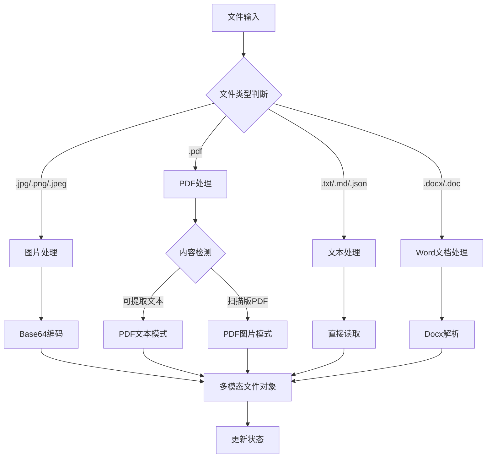

**图表来源**
- [file_processor.py](file://ai_correction/functions/file_processor.py#L30-L150)

### 支持的文件格式

| 文件类型 | 支持模式 | 处理方式 | 输出格式 |
|---------|---------|---------|---------|
| 图片文件 | Vision模式 | Base64编码 | ImageContent |
| PDF文件 | 文本/图片模式 | 自动检测内容 | PDFTextContent/PDFImageContent |
| 文本文件 | 直接处理 | UTF-8读取 | TextContent |
| Word文档 | 文本提取 | python-docx解析 | DocumentContent |

### 多模态数据模型

系统定义了统一的多模态数据模型，支持不同文件类型的标准化表示：

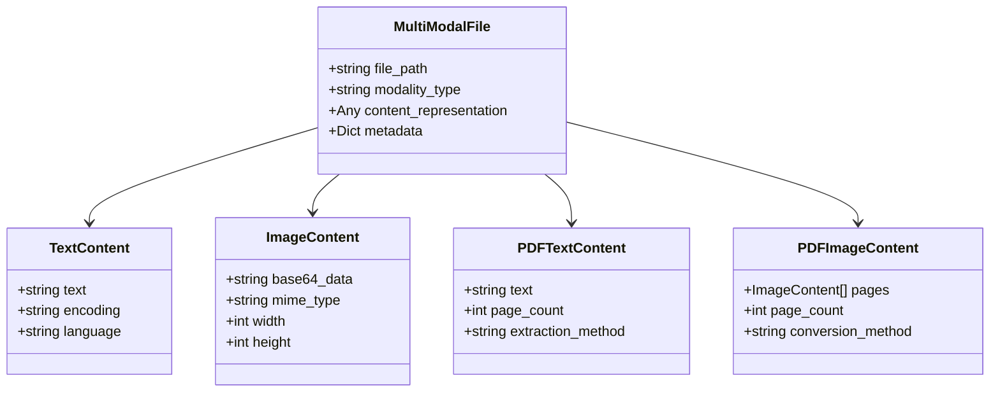

**图表来源**
- [multimodal_models.py](file://ai_correction/functions/langgraph/multimodal_models.py#L15-L100)

**章节来源**
- [file_processor.py](file://ai_correction/functions/file_processor.py#L1-L502)
- [multimodal_models.py](file://ai_correction/functions/langgraph/multimodal_models.py#L1-L307)

## 核心Agent实现

### 题目理解Agent

题目理解Agent负责解析和理解题目内容，支持文本和图片两种输入模态。

#### 核心功能

- **多模态输入处理**：支持文本和Vision模式
- **结构化信息提取**：提取题目关键要求、上下文信息
- **难度和主题识别**：自动识别题目难度级别和所属学科

#### 处理流程

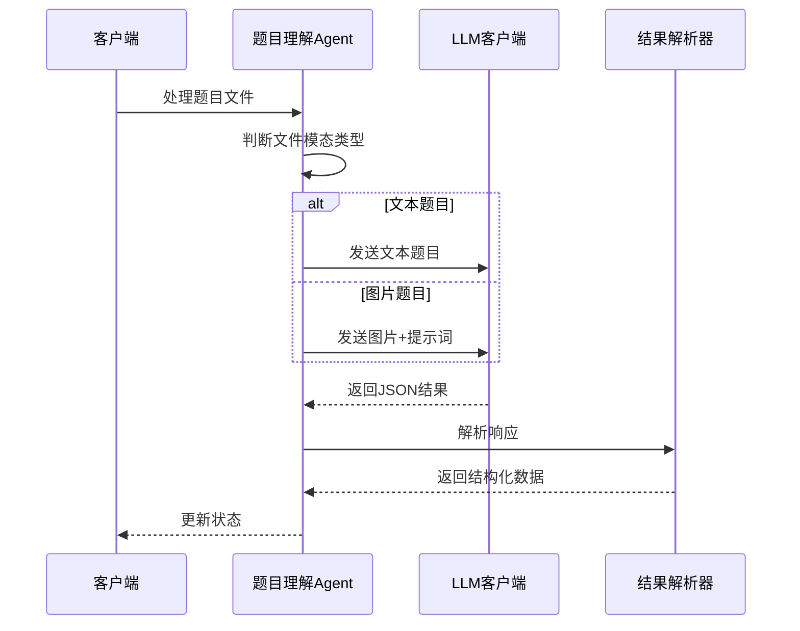

**图表来源**
- [question_understanding_agent.py](file://ai_correction/functions/langgraph/agents/question_understanding_agent.py#L20-L80)

#### 输入输出格式

**输入格式**：
- 文本题目：纯文本字符串
- 图片题目：包含base64编码的图片数据

**输出格式**：
```json
{
  "question_id": "Q1",
  "question_text": "题目完整文本",
  "key_requirements": ["要求1", "要求2"],
  "context": {
    "subject": "数学",
    "difficulty_level": "medium",
    "question_type": "计算题"
  },
  "modality_source": "text/vision"
}
```

**章节来源**
- [question_understanding_agent.py](file://ai_correction/functions/langgraph/agents/question_understanding_agent.py#L1-L157)

### 评分标准解析Agent

评分标准解析Agent将评分标准转换为结构化的评分点数据，为后续的智能评分提供基础。

#### 解析策略

系统采用多层次的解析策略：

1. **LLM解析**：使用大语言模型直接解析复杂的评分标准
2. **正则表达式提取**：针对简单格式的评分标准进行快速提取
3. **默认标准生成**：当解析失败时生成默认评分标准

#### 评分点结构

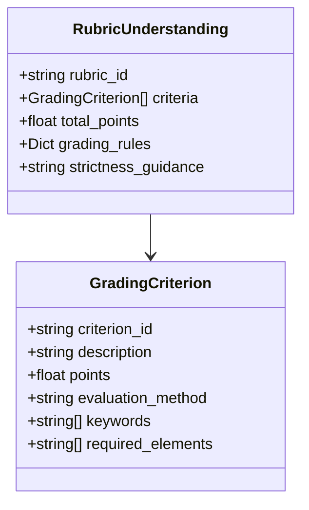

**图表来源**
- [rubric_interpreter_agent.py](file://ai_correction/functions/langgraph/agents/rubric_interpreter_agent.py#L15-L50)

#### 默认评分标准

当无法解析评分标准时，系统会生成默认的评分标准：

```json
{
  "rubric_id": "R_DEFAULT",
  "criteria": [
    {
      "criterion_id": "C1",
      "description": "答案完整性和正确性",
      "points": 100.0,
      "evaluation_method": "semantic"
    }
  ],
  "total_points": 100.0,
  "grading_rules": {
    "partial_credit": "yes"
  }
}
```

**章节来源**
- [rubric_interpreter_agent.py](file://ai_correction/functions/langgraph/agents/rubric_interpreter_agent.py#L1-L205)

### 评分Agent

评分Agent是系统的核心组件，负责基于评分标准对学生答案进行智能评分。

#### 评分流程

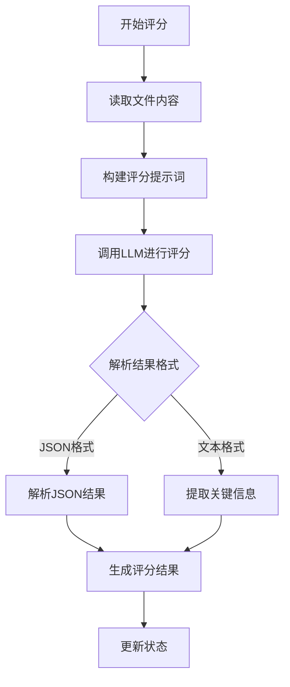

**图表来源**
- [scoring_agent.py](file://ai_correction/functions/langgraph/agents/scoring_agent.py#L50-L150)

#### 评分算法

评分Agent采用基于标准的评分方法，严格遵循评分标准的要求：

1. **标准对比**：将学生答案与评分标准逐一对比
2. **满足程度评估**：判断学生答案是否满足每个评分点的要求
3. **分数计算**：根据满足程度计算实际得分
4. **反馈生成**：生成详细的评分反馈

#### 评分结果格式

```json
{
  "final_score": 85.0,
  "grade_level": "B",
  "detailed_feedback": [
    {
      "type": "error",
      "content": "计算过程中出现错误",
      "severity": "medium"
    }
  ],
  "errors": [],
  "strengths": ["答案结构清晰"],
  "suggestions": ["注意计算细节"]
}
```

**章节来源**
- [scoring_agent.py](file://ai_correction/functions/langgraph/agents/scoring_agent.py#L1-L408)

## 批改工作流

### 工作流架构

系统采用LangGraph框架实现智能工作流编排，支持并行处理和条件执行。新版本引入了深度协作的8个Agent架构，优化了Token使用效率。

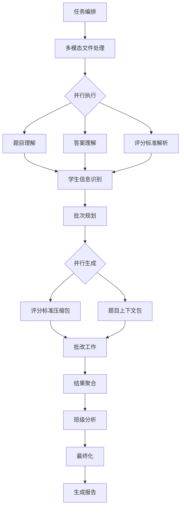

**图表来源**
- [workflow_multimodal.py](file://ai_correction\functions\langgraph\workflow_multimodal.py#L39-L254)

### 深度协作架构

新版本工作流采用8个深度协作的Agent，实现更高效的批改流程：

1. **OrchestratorAgent**：任务编排与协调优化
2. **StudentDetectionAgent**：学生信息识别
3. **BatchPlanningAgent**：批次规划
4. **RubricMasterAgent**：评分标准主控（生成压缩包）
5. **QuestionContextAgent**：题目上下文（生成压缩包）
6. **GradingWorkerAgent**：批改工作（基于压缩包）
7. **ResultAggregatorAgent**：结果聚合
8. **ClassAnalysisAgent**：班级分析（可选）

#### 任务编排流程

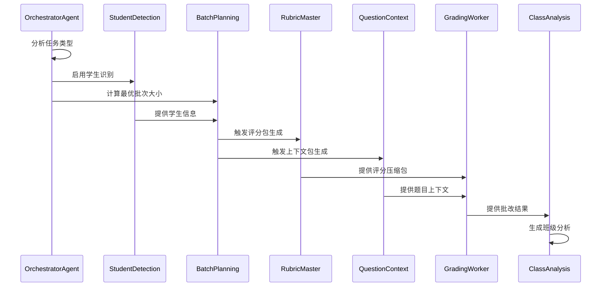

**章节来源**
- [workflow_multimodal.py](file://ai_correction\functions\langgraph\workflow_multimodal.py#L39-L254)
- [orchestrator_agent.py](file://ai_correction\functions\langgraph\agents\orchestrator_agent.py#L19-L128)

### 工作流优化策略

#### 并行处理

系统支持多个Agent并行执行，提高处理效率：

- **OCR和评分标准解析并行**：同时处理多模态文件
- **评分后的并行分析**：坐标标注和知识点挖掘同时进行

#### 条件执行

根据文件类型和配置自动选择最优处理路径：

- **跳过不必要的步骤**：纯文本文件跳过OCR处理
- **智能路由**：根据评分结果决定是否进行详细分析

#### 缓存机制

系统实现了多层缓存机制：

- **文件哈希缓存**：避免重复处理相同文件
- **OCR结果缓存**：缓存OCR处理结果
- **LLM响应缓存**：缓存相似查询的响应

**章节来源**
- [workflow.py](file://ai_correction/functions/langgraph/workflow.py#L1-L617)

## 结果聚合与报告生成

### 结果聚合Agent

结果聚合Agent负责汇总所有批改结果，生成结构化的报告。

#### 聚合流程

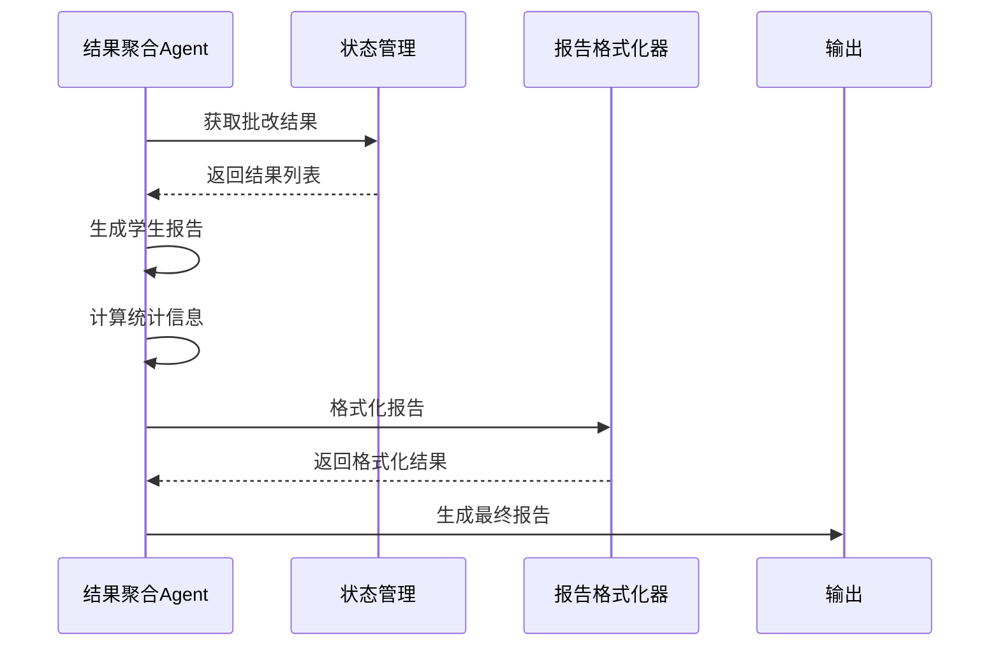

**图表来源**
- [result_aggregator_agent.py](file://ai_correction/functions/langgraph/agents/result_aggregator_agent.py#L20-L80)

#### 报告结构

系统生成多层次的报告结构：

1. **总体统计**：平均分、完成率、等级分布
2. **学生个体报告**：每个学生的详细评分和反馈
3. **知识点分析**：薄弱知识点和学习建议
4. **班级整体分析**：班级表现和改进建议

### 结果格式化器

结果格式化器提供多种输出格式，满足不同的使用场景。

#### 格式化选项

| 格式类型 | 用途 | 特点 |
|---------|------|------|
| 详细版 | 教师批改 | 包含所有评分细节 |
| 简洁版 | 快速查看 | 只显示关键信息 |
| 导出版 | 系统集成 | 结构化数据格式 |

#### 详细报告示例

```markdown
# 📋 AI 批改结果报告

## 📊 总体成绩

**总分**: 85/100 分  
**得分率**: 85.0%  
**等级**: B  
**答对题数**: 8/10

## 📝 逐题详情

### 📝 题目 1：三角形定义
**📊 总体成绩**: 25/30 分 (83.3%)

**✍️ 学生答案**:
```
三角形是由三条边组成的封闭图形。
```

**📋 逐点评分详情**:

✅ **评分点 1**: 说明三角形的定义 (3分)
   **得分**: 3/3 分
   📌 **分析**:
   答案准确描述了三角形的基本定义
   
**❌ **评分点 2**: 指出三角形有三条边 (2分)
   **得分**: 0/2 分
   📌 **分析**:
   答案没有明确提到"三条边"
```

**章节来源**
- [result_aggregator_agent.py](file://ai_correction/functions/langgraph/agents/result_aggregator_agent.py#L1-L143)
- [result_formatter.py](file://ai_correction/functions/langgraph/result_formatter.py#L1-L274)

## LLM客户端集成

### 客户端架构

LLM客户端提供统一的接口，支持多个大语言模型提供商。

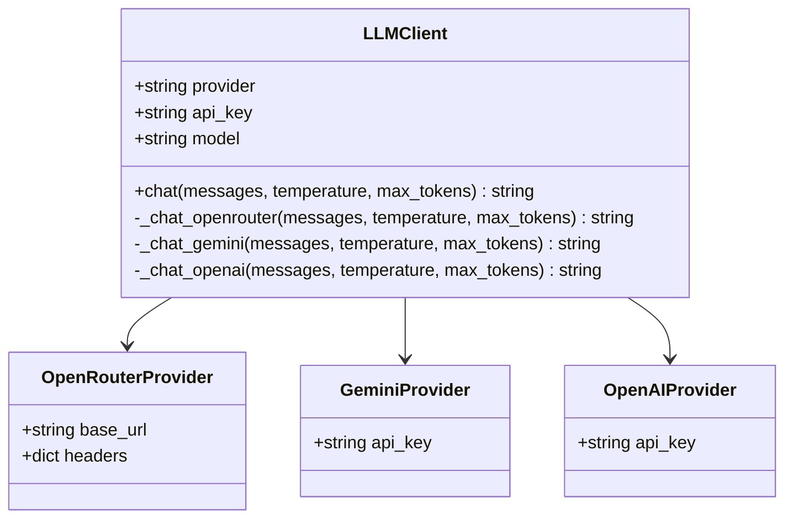

**图表来源**
- [llm_client.py](file://ai_correction/functions/llm_client.py#L20-L80)

### 支持的提供商

| 提供商 | 模型 | 特点 | 适用场景 |
|-------|------|------|---------|
| OpenRouter | 多种模型 | 兼容性强 | 生产环境 |
| Gemini | Gemini Pro | Google生态 | 谷歌用户 |
| OpenAI | GPT系列 | 性能稳定 | 高质量要求 |

### 配置管理

系统支持多种配置方式：

- **环境变量**：通过环境变量设置API密钥
- **配置文件**：通过config.py集中管理
- **运行时参数**：支持动态指定提供商和模型

**章节来源**
- [llm_client.py](file://ai_correction/functions/llm_client.py#L1-L190)

## 数据模型与状态管理

### 状态模型设计

系统采用TypedDict定义状态模型，确保类型安全和数据一致性。

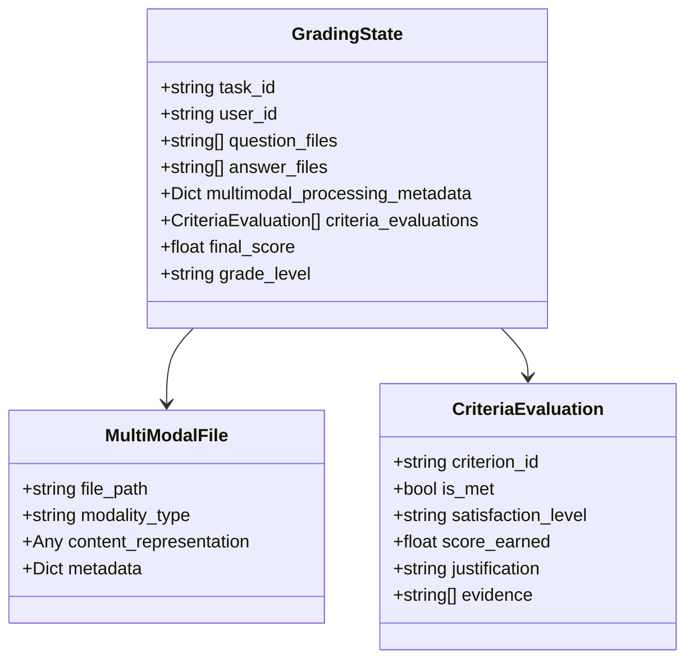

**图表来源**
- [state.py](file://ai_correction/functions/langgraph/state.py#L50-L150)

### 多模态状态扩展

系统为多模态处理添加了专门的状态字段：

- **多模态文件列表**：分别存储题目、答案、评分标准的多模态表示
- **理解结果**：存储题目理解、答案理解、评分标准理解的结果
- **评估结果**：存储基于评分标准的评估结果

### 数据流转

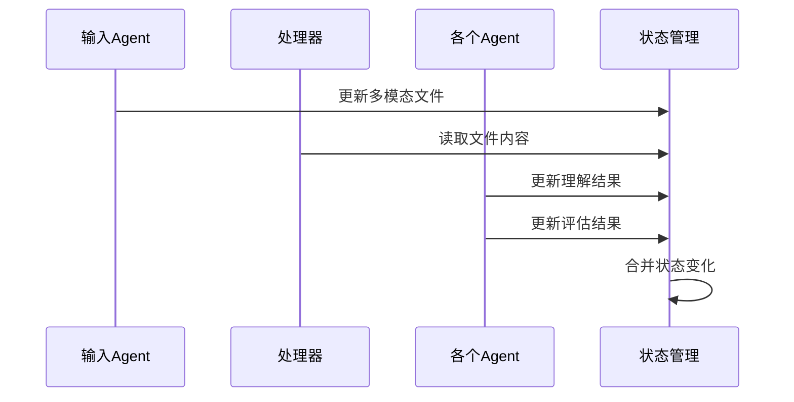

**图表来源**
- [state.py](file://ai_correction/functions/langgraph/state.py#L200-L269)

**章节来源**
- [state.py](file://ai_correction/functions/langgraph/state.py#L1-L269)
- [multimodal_models.py](file://ai_correction/functions/langgraph/multimodal_models.py#L1-L307)

## 性能优化策略

### Token优化

系统采用多种策略减少Token使用：

1. **状态压缩**：只传递必要的字段给LLM
2. **内容截断**：对长文本进行截断处理
3. **结构化提示词**：使用明确的JSON格式提示词
4. **压缩包机制**：RubricMasterAgent生成压缩版评分包，节约60-80% Token

### 缓存机制

- **文件哈希缓存**：基于文件内容生成唯一标识
- **OCR结果缓存**：缓存OCR处理结果
- **LLM响应缓存**：缓存相似查询的响应

### 并行处理

- **多文件并行**：同时处理多个文件
- **Agent并行**：多个Agent同时执行
- **条件执行**：根据情况跳过不必要步骤

### 内存管理

- **状态清理**：及时清理不需要的状态数据
- **流式处理**：对大文件采用流式处理
- **资源池化**：复用LLM客户端连接

## 故障排除指南

### 常见问题及解决方案

#### 文件处理问题

**问题**：PDF文件无法正确解析
**解决方案**：
1. 检查PDF是否为扫描版
2. 安装pdf2image库：`pip install pdf2image poppler-utils`
3. 使用文本版PDF代替扫描版

**问题**：Word文档处理失败
**解决方案**：
1. 安装python-docx库：`pip install python-docx`
2. 检查文档格式是否损坏

#### LLM调用问题

**问题**：API调用失败
**解决方案**：
1. 检查API密钥配置
2. 验证网络连接
3. 检查模型可用性

**问题**：响应格式错误
**解决方案**：
1. 调整温度参数
2. 简化提示词
3. 使用默认结果

#### 性能问题

**问题**：处理速度慢
**解决方案**：
1. 启用缓存机制
2. 使用高效模式
3. 减少并发数量

**问题**：内存占用过高
**解决方案**：
1. 清理缓存
2. 减少单次处理文件数量
3. 优化状态管理

### 调试工具

系统提供了丰富的调试功能：

- **进度跟踪**：实时监控处理进度
- **错误日志**：详细的错误信息记录
- **性能统计**：处理时间和资源使用情况
- **状态检查**：随时查看当前状态

**章节来源**
- [workflow.py](file://ai_correction/functions/langgraph/workflow.py#L500-L617)

## 总结

AI批改系统通过模块化的设计和智能的Agent协作，实现了高效、准确的自动批改功能。系统的主要优势包括：

1. **多模态支持**：支持各种文件格式，无需传统OCR流程
2. **基于标准评分**：严格遵循评分标准，保证评分公平性
3. **智能协作**：多个Agent协同工作，提高处理效率
4. **性能优化**：多种优化策略确保系统高效运行
5. **易于扩展**：模块化设计便于功能扩展和维护

通过合理配置和使用，该系统能够显著提高批改效率，减轻教师负担，同时为学生提供及时、准确的反馈。