# 工作流执行

<cite>
**本文档引用的文件**
- [workflow_multimodal.py](file://ai_correction/functions/langgraph/workflow_multimodal.py)
- [state.py](file://ai_correction/functions/langgraph/state.py)
- [streaming.py](file://ai_correction/functions/langgraph/streaming.py)
- [checkpointer.py](file://ai_correction/functions/langgraph/checkpointer.py)
- [routing.py](file://ai_correction/functions/langgraph/routing.py)
- [test_multimodal_grading.py](file://ai_correction/test_multimodal_grading.py)
</cite>

## 目录
1. [概述](#概述)
2. [工作流架构](#工作流架构)
3. [execute方法详解](#execute方法详解)
4. [initial_state初始化策略](#initial_state初始化策略)
5. [配置绑定机制](#配置绑定机制)
6. [astream接口异步迭代](#astream接口异步迭代)
7. [状态更新机制](#状态更新机制)
8. [最终状态提取](#最终状态提取)
9. [异常捕获策略](#异常捕获策略)
10. [性能考虑](#性能考虑)
11. [故障排除指南](#故障排除指南)

## 概述

MultiModalGradingWorkflow类的execute方法实现了完整的多模态批改工作流异步执行，采用LangGraph框架的流式处理机制，支持实时进度监控和状态跟踪。该方法通过异步迭代模式，逐步推进工作流的各个阶段，同时维护详细的执行状态和错误处理机制。

## 工作流架构

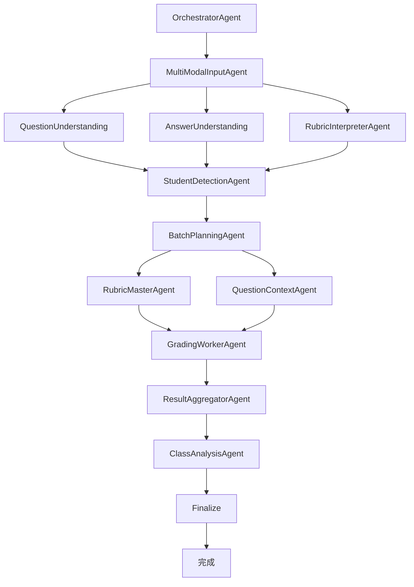

**图表来源**
- [workflow_multimodal.py](file://ai_correction/functions/langgraph/workflow_multimodal.py#L47-L89)

**章节来源**
- [workflow_multimodal.py](file://ai_correction/functions/langgraph/workflow_multimodal.py#L25-L89)

## execute方法详解

execute方法是MultiModalGradingWorkflow的核心执行引擎，负责协调整个批改流程的异步执行。

### 方法签名和职责

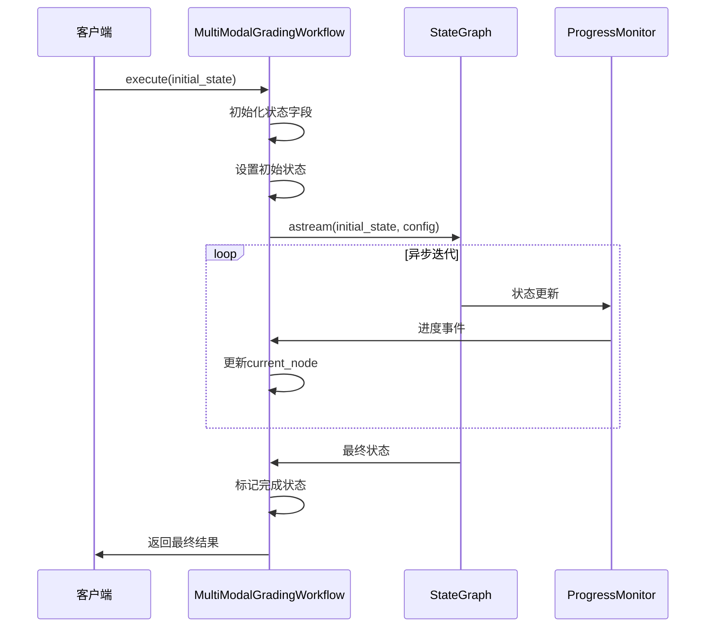

**图表来源**
- [workflow_multimodal.py](file://ai_correction/functions/langgraph/workflow_multimodal.py#L103-L217)
- [streaming.py](file://ai_correction/functions/langgraph/streaming.py#L47-L110)

### 执行流程控制

execute方法采用异步迭代模式，通过LangGraph的astream接口实现实时状态更新：

1. **状态初始化阶段**：预设所有关键字段的默认值
2. **配置设置阶段**：建立任务隔离机制
3. **异步执行阶段**：实时监控工作流进展
4. **状态收敛阶段**：提取最终执行结果
5. **异常处理阶段**：确保错误状态的正确标记

**章节来源**
- [workflow_multimodal.py](file://ai_correction/functions/langgraph/workflow_multimodal.py#L103-L217)

## initial_state初始化策略

initial_state的初始化是工作流执行的基础，涉及多个关键字段的预设逻辑。

### 核心字段初始化

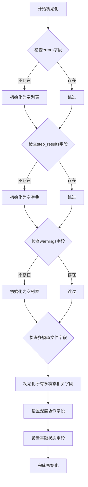

**图表来源**
- [workflow_multimodal.py](file://ai_correction/functions/langgraph/workflow_multimodal.py#L109-L159)

### 字段分类和用途

| 字段类别 | 字段名称 | 默认值 | 用途说明 |
|---------|---------|--------|----------|
| **错误处理** | `errors` | `[]` | 存储执行过程中的错误信息 |
| **步骤记录** | `step_results` | `{}` | 记录各步骤的执行结果 |
| **警告信息** | `warnings` | `[]` | 存储执行过程中的警告 |
| **多模态文件** | `question_multimodal_files` | `[]` | 多模态题目文件列表 |
| **多模态文件** | `answer_multimodal_files` | `[]` | 多模态答案文件列表 |
| **多模态文件** | `marking_multimodal_files` | `[]` | 多模态评分标准文件列表 |
| **深度协作** | `students_info` | `[]` | 学生信息列表 |
| **深度协作** | `batches_info` | `[]` | 批次规划信息 |
| **深度协作** | `batch_rubric_packages` | `{}` | 批次专属评分包 |
| **深度协作** | `question_context_packages` | `{}` | 批次专属题目上下文 |
| **深度协作** | `grading_results` | `[]` | 批改结果列表 |
| **深度协作** | `student_reports` | `[]` | 学生报告列表 |
| **深度协作** | `class_analysis` | `{}` | 班级分析报告 |

### 深度协作字段的重要性

深度协作架构引入了大量新的状态字段，这些字段支持基于学生的批次管理和并行处理策略：

- **students_info**：存储识别到的学生信息，支持个性化批改
- **batches_info**：记录批次规划结果，指导并行处理
- **batch_rubric_packages**：为每个批次生成专门的评分包
- **question_context_packages**：维护每个批次的题目上下文
- **grading_results**：累积所有批改结果
- **student_reports**：生成学生个体报告
- **class_analysis**：进行班级整体分析

**章节来源**
- [workflow_multimodal.py](file://ai_correction/functions/langgraph/workflow_multimodal.py#L109-L159)
- [state.py](file://ai_correction/functions/langgraph/state.py#L120-L140)

## 配置绑定机制

thread_id的绑定机制是实现任务隔离的核心技术，确保不同任务之间的状态不会相互干扰。

### 配置结构设计

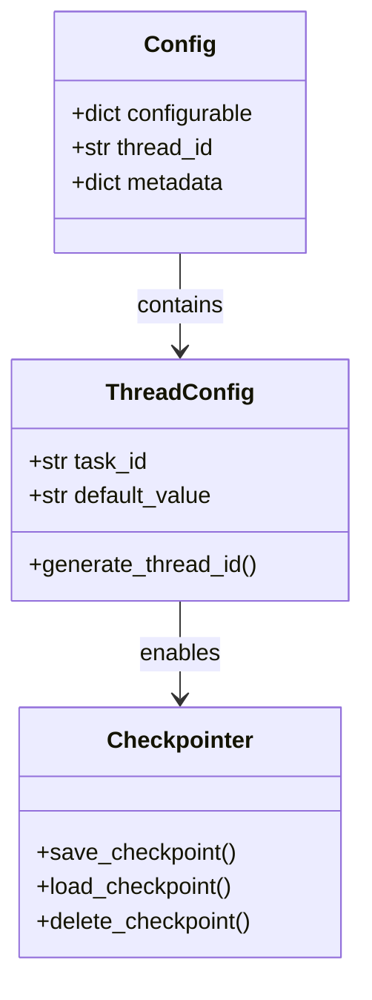

**图表来源**
- [workflow_multimodal.py](file://ai_correction/functions/langgraph/workflow_multimodal.py#L167-L169)
- [checkpointer.py](file://ai_correction/functions/langgraph/checkpointer.py#L130-L140)

### 绑定机制实现

配置绑定通过以下方式实现任务隔离：

1. **动态thread_id生成**：使用initial_state中的task_id作为thread_id
2. **默认回退机制**：当task_id缺失时使用'default'作为默认值
3. **持久化支持**：通过Checkpointer实现状态的持久化存储
4. **并发安全**：确保同一时刻只有一个任务可以访问特定thread_id的状态

### 配置传递流程

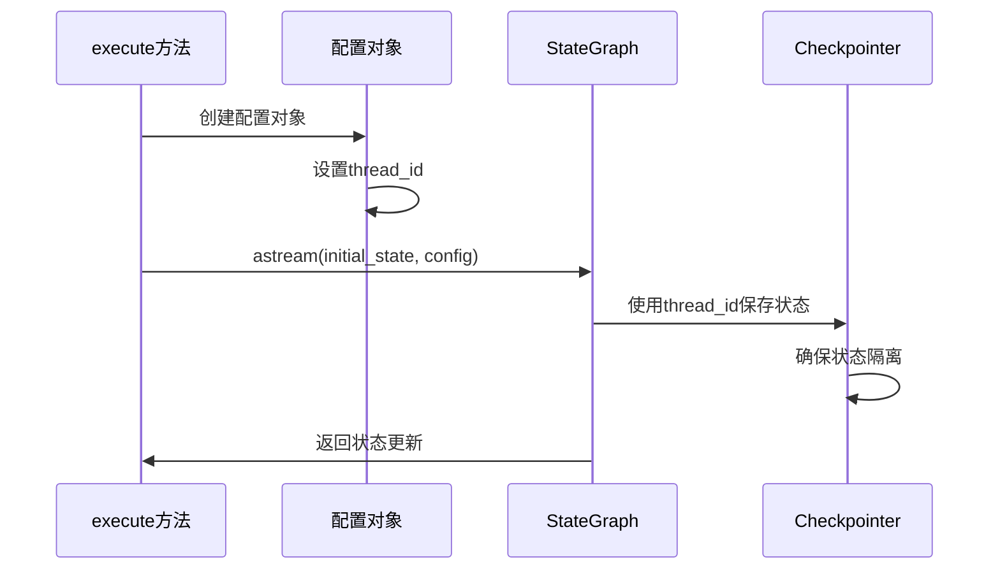

**图表来源**
- [workflow_multimodal.py](file://ai_correction/functions/langgraph/workflow_multimodal.py#L167-L169)
- [checkpointer.py](file://ai_correction/functions/langgraph/checkpointer.py#L130-L140)

**章节来源**
- [workflow_multimodal.py](file://ai_correction/functions/langgraph/workflow_multimodal.py#L167-L169)
- [checkpointer.py](file://ai_correction/functions/langgraph/checkpointer.py#L130-L140)

## astream接口异步迭代

astream接口是LangGraph提供的核心流式处理功能，支持实时状态更新和进度监控。

### 异步迭代机制

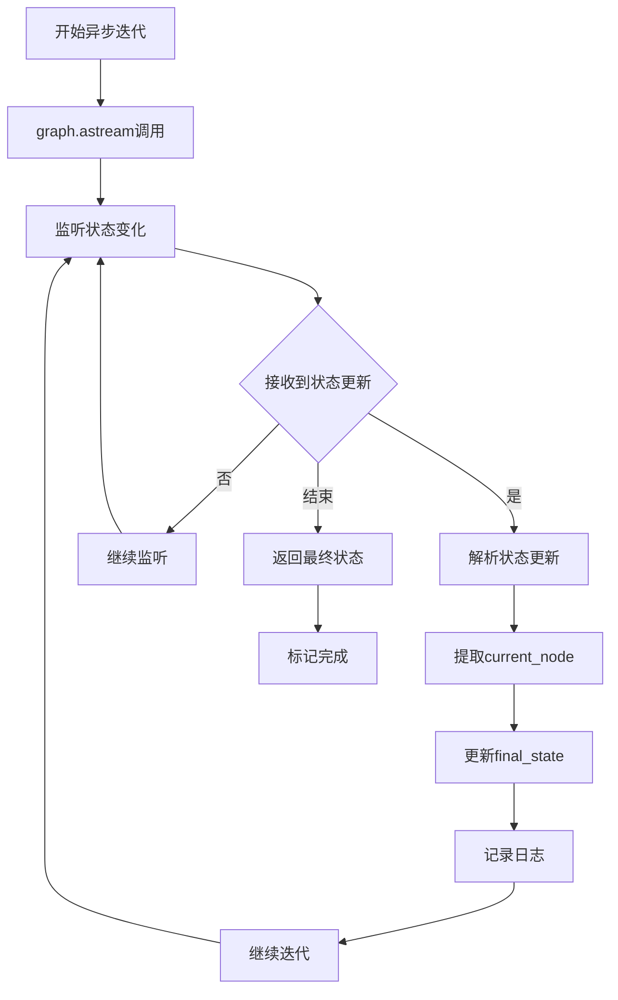

**图表来源**
- [workflow_multimodal.py](file://ai_correction/functions/langgraph/workflow_multimodal.py#L171-L182)
- [streaming.py](file://ai_correction/functions/langgraph/streaming.py#L73-L110)

### 状态更新解析

每次状态更新都包含当前节点的信息和状态变更：

1. **状态结构**：`{node_name: state_update}`
2. **节点识别**：通过`list(state.keys())[0]`获取当前执行节点
3. **状态合并**：将新状态合并到final_state中
4. **实时更新**：立即反映到进度监控系统

### 迭代过程监控

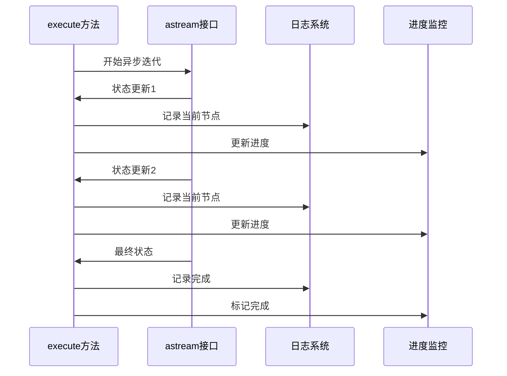

**图表来源**
- [workflow_multimodal.py](file://ai_correction/functions/langgraph/workflow_multimodal.py#L171-L182)
- [streaming.py](file://ai_correction/functions/langgraph/streaming.py#L106-L147)

**章节来源**
- [workflow_multimodal.py](file://ai_correction/functions/langgraph/workflow_multimodal.py#L171-L182)
- [streaming.py](file://ai_correction/functions/langgraph/streaming.py#L73-L110)

## 状态更新机制

状态更新机制确保工作流执行过程中的实时可见性和可追踪性。

### current_node实时更新

current_node的实时更新是进度监控的核心机制：

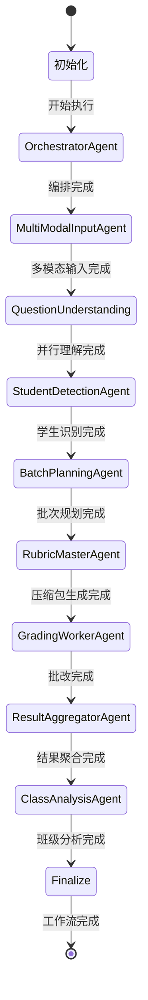

**图表来源**
- [workflow_multimodal.py](file://ai_correction/functions/langgraph/workflow_multimodal.py#L175-L182)

### progress_percentage计算

进度百分比通过以下逻辑计算：

1. **节点级进度**：每个Agent节点完成后更新进度
2. **步骤级进度**：复杂步骤内部的细分进度
3. **总体进度**：基于已完成的节点数量估算
4. **实时更新**：每次状态更新都同步更新进度

### 状态传播机制

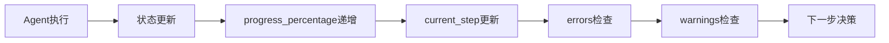

**图表来源**
- [workflow_multimodal.py](file://ai_correction/functions/langgraph/workflow_multimodal.py#L175-L182)

**章节来源**
- [workflow_multimodal.py](file://ai_correction/functions/langgraph/workflow_multimodal.py#L175-L182)

## 最终状态提取

最终状态提取是工作流执行的收尾阶段，负责将中间状态转换为最终结果。

### 状态收敛过程

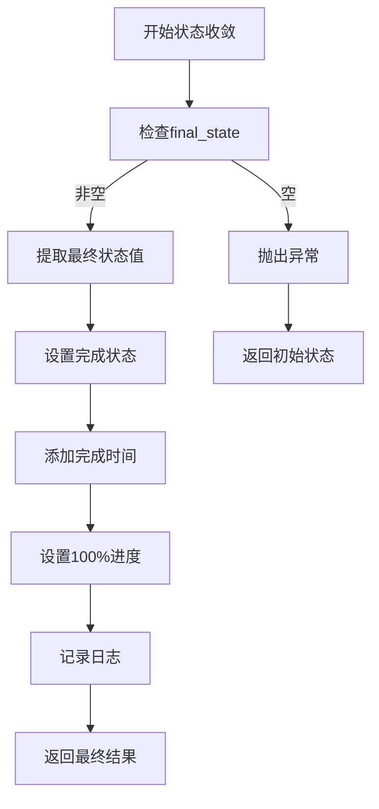

**图表来源**
- [workflow_multimodal.py](file://ai_correction/functions/langgraph/workflow_multimodal.py#L184-L200)

### completion_status状态转换

completion_status经历了以下转换过程：

1. **初始化**："pending" → "in_progress"
2. **执行中**："in_progress" → "completed" 或 "failed"
3. **异常情况**："failed"保持不变

### 最终结果字段

最终状态包含以下关键字段：

| 字段名称 | 类型 | 描述 |
|---------|------|------|
| `completion_status` | str | 完成状态：completed/failed |
| `completed_at` | str | 完成时间戳 |
| `progress_percentage` | float | 完成进度（100.0） |
| `total_score` | float | 总分 |
| `grade_level` | str | 等级评定 |
| `errors` | list | 错误列表 |
| `warnings` | list | 警告列表 |

**章节来源**
- [workflow_multimodal.py](file://ai_correction/functions/langgraph/workflow_multimodal.py#L184-L200)

## 异常捕获策略

异常捕获策略确保工作流在遇到错误时能够优雅地处理并提供有用的错误信息。

### 异常处理层次

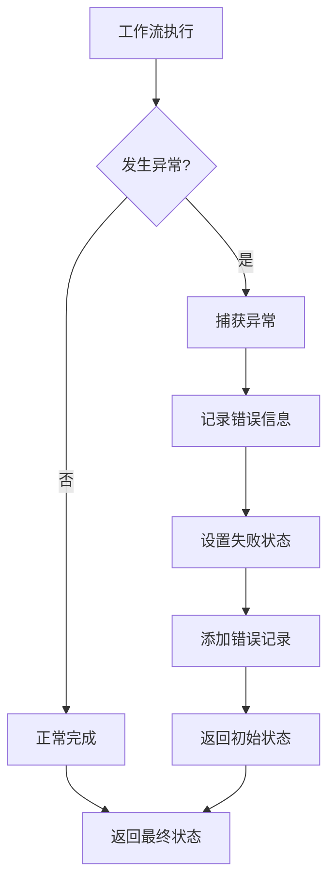

**图表来源**
- [workflow_multimodal.py](file://ai_correction/functions/langgraph/workflow_multimodal.py#L202-L217)

### 错误记录机制

错误记录包含以下关键信息：

```python
{
    'step': 'workflow_execution',  # 错误发生的步骤
    'error': error_message,        # 具体错误信息
    'timestamp': timestamp         # 时间戳
}
```

### 失败恢复建议

当工作流执行失败时，系统提供以下恢复建议：

1. **检查输入参数**：验证initial_state的完整性
2. **检查网络连接**：确认外部服务可用性
3. **检查资源限制**：确保有足够的内存和CPU
4. **查看错误日志**：分析具体的错误原因
5. **重试机制**：对于临时性错误，可以尝试重新执行

### 异常类型处理

| 异常类型 | 处理策略 | 恢复建议 |
|---------|---------|----------|
| **网络异常** | 重试机制 | 检查网络连接，增加重试次数 |
| **内存不足** | 分批处理 | 减少并发数量，优化内存使用 |
| **配置错误** | 参数验证 | 检查配置文件，修正参数 |
| **文件读取错误** | 文件检查 | 验证文件路径和权限 |
| **模型调用失败** | 降级处理 | 使用备用模型或简化处理 |

**章节来源**
- [workflow_multimodal.py](file://ai_correction/functions/langgraph/workflow_multimodal.py#L202-L217)

## 性能考虑

工作流执行涉及大量的异步操作和状态管理，性能优化至关重要。

### 并发控制

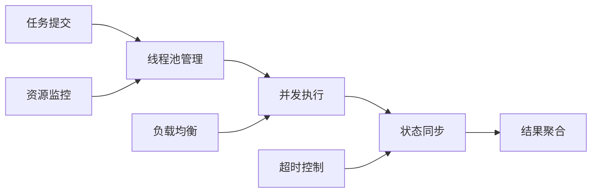

### 内存管理

1. **状态清理**：定期清理历史状态数据
2. **批量处理**：对大量数据采用分批处理
3. **缓存策略**：合理使用缓存减少重复计算
4. **垃圾回收**：及时释放不再使用的对象

### 网络优化

1. **连接池**：复用HTTP连接
2. **超时设置**：合理设置请求超时
3. **重试机制**：智能重试策略
4. **断路器**：防止级联故障

## 故障排除指南

### 常见问题诊断

| 问题症状 | 可能原因 | 解决方案 |
|---------|---------|----------|
| **工作流卡住** | 死锁或无限循环 | 检查Agent间的依赖关系 |
| **内存泄漏** | 状态未正确清理 | 实现状态清理机制 |
| **性能下降** | 并发度过高 | 调整并发控制参数 |
| **状态丢失** | Checkpointer配置错误 | 检查持久化配置 |
| **进度不更新** | 异步迭代中断 | 检查异常处理逻辑 |

### 调试技巧

1. **启用详细日志**：设置DEBUG级别日志
2. **状态快照**：定期保存状态快照
3. **性能监控**：监控CPU和内存使用
4. **网络追踪**：追踪网络请求和响应
5. **异常堆栈**：保存完整的异常信息

### 监控指标

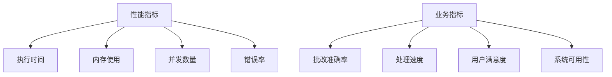

**章节来源**
- [workflow_multimodal.py](file://ai_correction/functions/langgraph/workflow_multimodal.py#L202-L217)
- [streaming.py](file://ai_correction/functions/langgraph/streaming.py#L28-L73)