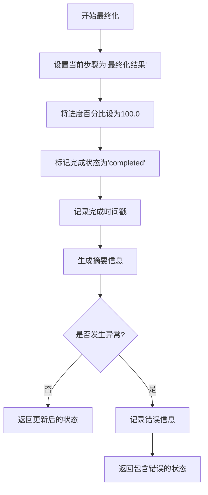
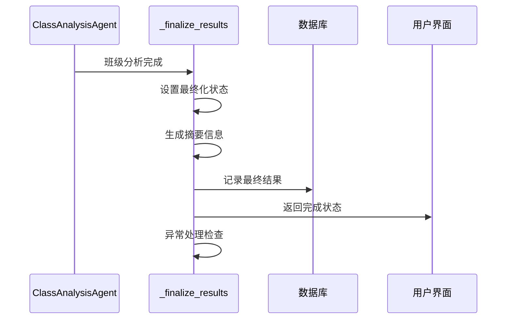
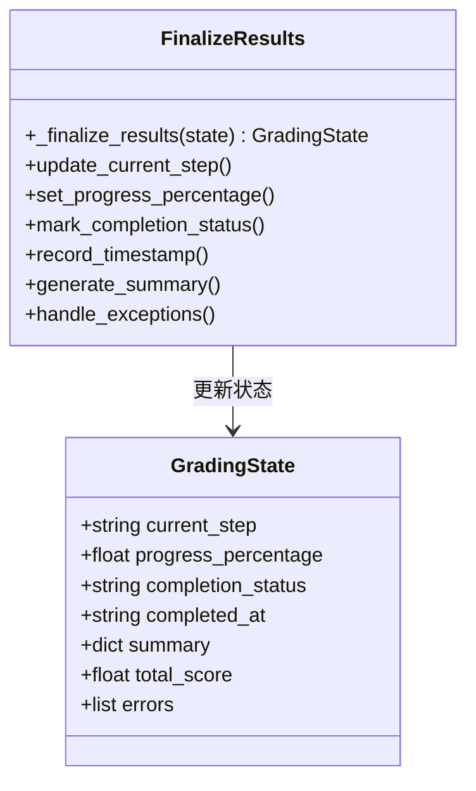
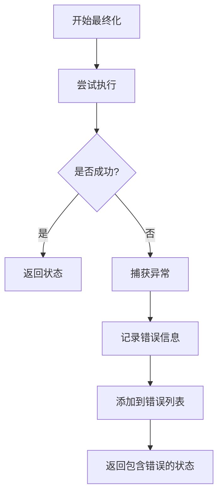
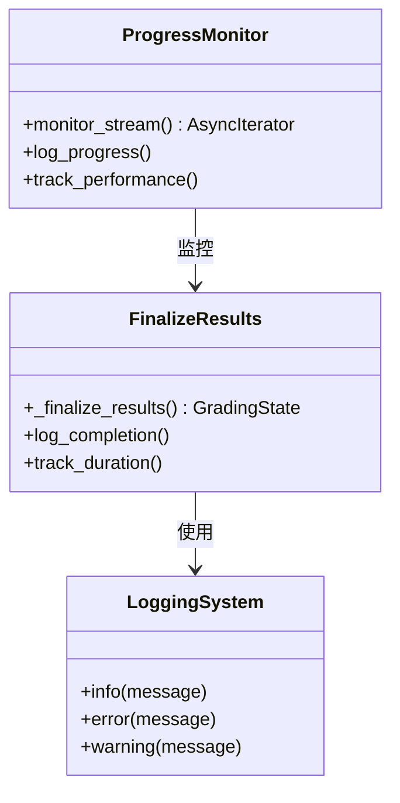

# 结果最终化

<cite>
**本文档中引用的文件**
- [workflow_multimodal.py](file://ai_correction/functions/langgraph/workflow_multimodal.py)
- [state.py](file://ai_correction/functions/langgraph/state.py)
- [workflow.py](file://ai_correction/functions/langgraph/workflow.py)
- [streaming.py](file://ai_correction/functions/langgraph/streaming.py)
</cite>

## 目录
1. [简介](#简介)
2. [方法概述](#方法概述)
3. [调用时机和工作流位置](#调用时机和工作流位置)
4. [状态更新逻辑](#状态更新逻辑)
5. [摘要信息生成](#摘要信息生成)
6. [异常处理机制](#异常处理机制)
7. [性能监控和日志审计](#性能监控和日志审计)
8. [最佳实践建议](#最佳实践建议)
9. [总结](#总结)

## 简介

`_finalize_results` 方法是多模态批改工作流中的关键组件，负责在批改流程的最后阶段对所有结果进行最终化处理。该方法确保批改工作的完整性，生成统计摘要，并正确标记工作流的完成状态。

## 方法概述

`_finalize_results` 方法是一个私有方法，属于 `MultiModalGradingWorkflow` 类，专门用于处理工作流末尾的结果最终化工作。该方法接收当前状态作为输入，执行一系列状态更新操作，并返回更新后的状态。

**图表来源**
- [workflow_multimodal.py](file://ai_correction/functions/langgraph/workflow_multimodal.py#L218-L254)

**章节来源**
- [workflow_multimodal.py](file://ai_correction/functions/langgraph/workflow_multimodal.py#L218-L254)

## 调用时机和工作流位置

`_finalize_results` 方法在工作流的执行过程中被安排在最后一个节点，作为整个批改流程的收尾工作。根据工作流图的定义，该方法在 `ClassAnalysisAgent` 完成其任务后被调用。

**图表来源**
- [workflow_multimodal.py](file://ai_correction/functions/langgraph/workflow_multimodal.py#L84-L121)

该方法在整个工作流中的调用位置体现了其作为"收尾者"的角色，确保所有前置步骤都已完成，且所有中间结果都已经准备好进行最终处理。

**章节来源**
- [workflow_multimodal.py](file://ai_correction/functions/langgraph/workflow_multimodal.py#L84-L121)

## 状态更新逻辑

`_finalize_results` 方法执行四个关键的状态更新操作，这些操作共同构成了工作流完成状态的核心标志：

### 1. 当前步骤更新
方法将 `current_step` 字段设置为 `"最终化结果"`，明确指示当前处于工作流的最后阶段。

### 2. 进度百分比设置
通过将 `progress_percentage` 设置为 `100.0`，表示工作流已经100%完成，没有任何剩余任务需要处理。

### 3. 完成状态标记
将 `completion_status` 字段设置为 `"completed"`，这是工作流成功完成的标准标志。

### 4. 时间戳记录
使用 `datetime.now()` 记录当前时间，并将其转换为字符串格式存储在 `completed_at` 字段中，为后续的审计和追踪提供时间参考。

**图表来源**
- [state.py](file://ai_correction/functions/langgraph/state.py#L44-L163)
- [workflow_multimodal.py](file://ai_correction/functions/langgraph/workflow_multimodal.py#L218-L254)

**章节来源**
- [workflow_multimodal.py](file://ai_correction/functions/langgraph/workflow_multimodal.py#L225-L235)

## 摘要信息生成

摘要信息的生成是 `_finalize_results` 方法的重要组成部分，它提供了批改结果的关键统计信息。方法主要关注三个核心指标：

### 总分统计
从 `state.get('total_score', 0)` 获取总分信息，如果没有总分则默认为0。

### 学生数量统计
通过 `summary.get('total_students', 0)` 获取参与批改的学生总数，这反映了本次批改任务的规模。

### 平均分计算
计算并显示平均分，格式化为一位小数，便于用户理解和分析。

**图表来源**
- [workflow_multimodal.py](file://ai_correction/functions/langgraph/workflow_multimodal.py#L237-L245)

这种方法的设计确保了即使某些统计数据缺失，系统也能提供有意义的摘要信息，避免因数据不完整而导致的处理中断。

**章节来源**
- [workflow_multimodal.py](file://ai_correction/functions/langgraph/workflow_multimodal.py#L237-L245)

## 异常处理机制

`_finalize_results` 方法实现了完善的异常处理机制，确保即使在最终化过程中出现错误，系统仍能保持稳定并保留基本结果数据。

### 异常捕获策略
方法使用 `try-except` 结构捕获所有可能的异常，包括但不限于：
- 数据访问异常（如键不存在）
- 类型转换错误
- 格式化问题
- 系统资源不足

### 错误记录机制
当捕获到异常时，系统会：
1. 记录详细的错误信息
2. 将错误添加到 `errors` 列表中
3. 包含具体的错误类型、时间戳和相关上下文信息

### 优雅降级
即使最终化失败，方法仍然返回更新后的状态，确保：
- 工作流状态的一致性
- 前序步骤结果的完整性
- 错误信息的可追溯性

**图表来源**
- [workflow_multimodal.py](file://ai_correction/functions/langgraph/workflow_multimodal.py#L247-L254)

这种设计遵循了"失败安全"原则，确保系统的健壮性和数据的完整性。

**章节来源**
- [workflow_multimodal.py](file://ai_correction/functions/langgraph/workflow_multimodal.py#L247-L254)

## 性能监控和日志审计

虽然 `_finalize_results` 方法本身不直接涉及性能监控，但它在工作流的整体性能监控体系中扮演重要角色。结合其他组件，可以实现全面的性能监控和审计功能。

### 日志记录策略
方法使用 `logger.info` 和 `logger.error` 实现分级日志记录：
- 成功完成时记录详细信息
- 异常发生时记录错误详情
- 提供足够的上下文信息用于调试

### 审计跟踪
通过记录 `completed_at` 时间戳，系统能够：
- 跟踪工作流的执行时间
- 分析批改效率
- 支持合规性审计

### 性能指标收集
结合 `ProgressMonitor` 组件，可以实现：
- 工作流各阶段的耗时统计
- 资源使用情况监控
- 性能瓶颈识别

**图表来源**
- [streaming.py](file://ai_correction/functions/langgraph/streaming.py#L28-L73)
- [workflow_multimodal.py](file://ai_correction/functions/langgraph/workflow_multimodal.py#L220-L225)

**章节来源**
- [workflow_multimodal.py](file://ai_correction/functions/langgraph/workflow_multimodal.py#L220-L225)

## 最佳实践建议

基于 `_finalize_results` 方法的设计和实现，以下是推荐的最佳实践：

### 1. 状态一致性保证
确保在调用最终化方法之前，所有前置步骤都已正确完成，且状态数据完整有效。

### 2. 错误处理优先级
在异常处理中，优先考虑数据的完整性而非功能的可用性，确保即使失败也能保留有价值的数据。

### 3. 日志记录规范
采用结构化的日志格式，包含足够的上下文信息，便于后续的问题排查和性能分析。

### 4. 监控指标设计
建立完善的工作流监控体系，包括：
- 完成率统计
- 平均处理时间
- 失败率分析
- 资源使用效率

### 5. 性能优化策略
考虑以下优化措施：
- 异步处理机制
- 缓存策略应用
- 并行化处理可能性
- 资源池管理

## 总结

`_finalize_results` 方法作为多模态批改工作流的收尾环节，承担着确保工作流完整性的重要职责。通过精确的状态更新、完善的异常处理和有效的摘要生成，该方法为整个批改流程提供了可靠的结束保障。

方法的设计体现了现代软件工程的最佳实践：
- **健壮性**：完善的异常处理确保系统稳定性
- **可观测性**：详细的日志记录支持问题诊断
- **可维护性**：清晰的代码结构便于后续维护
- **可扩展性**：模块化设计支持功能扩展

这种设计不仅满足了当前的功能需求，也为未来的系统演进奠定了坚实的基础。通过持续的监控和优化，该方法能够适应不断变化的业务需求和技术环境。