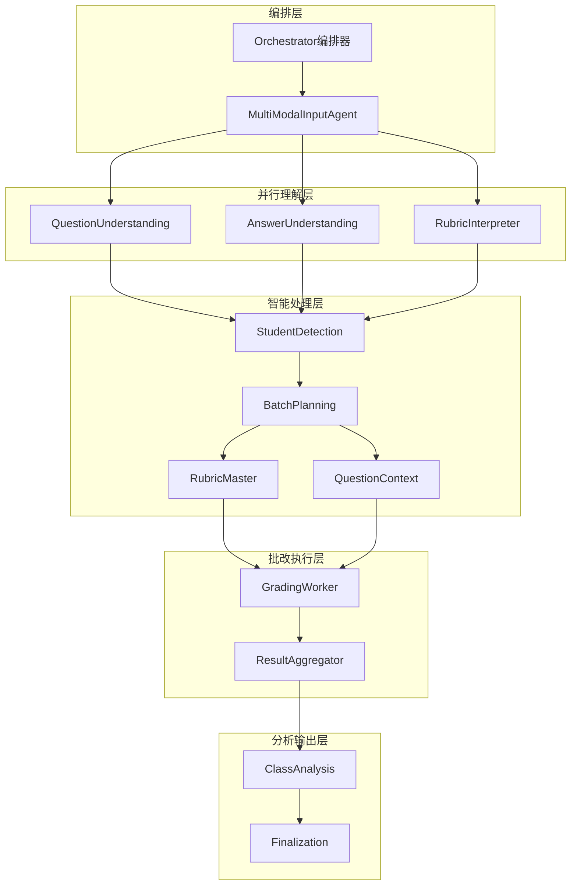
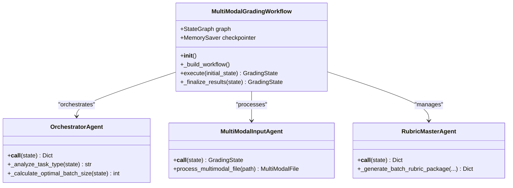
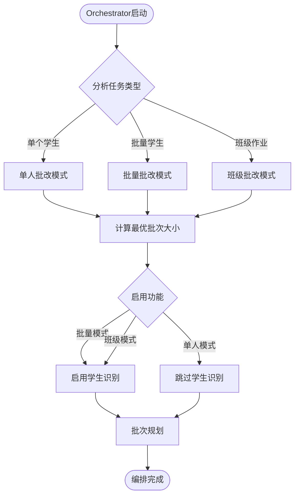
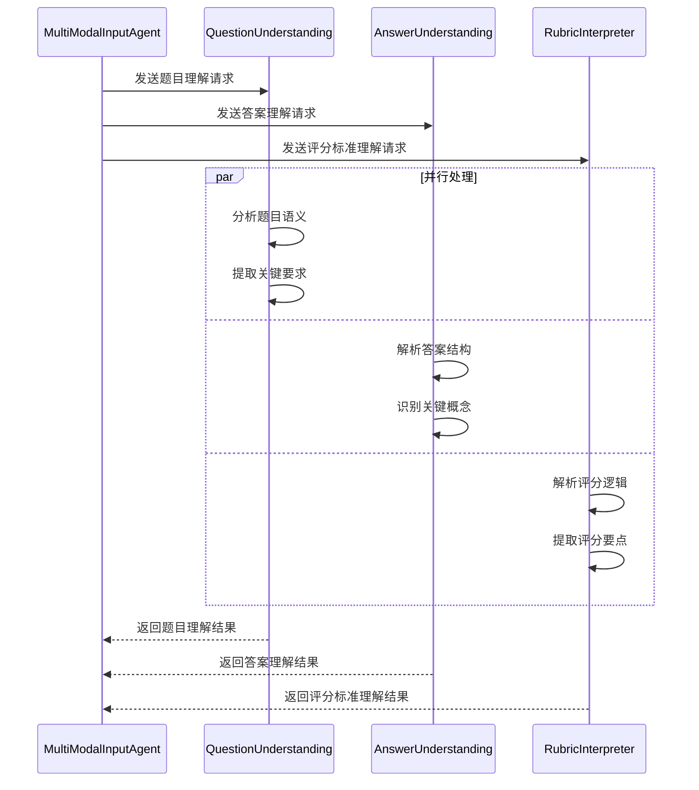
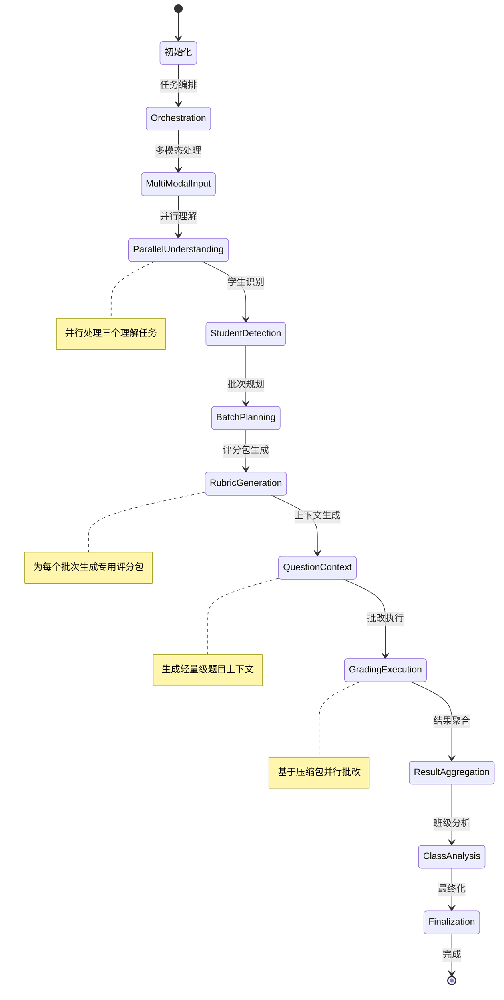
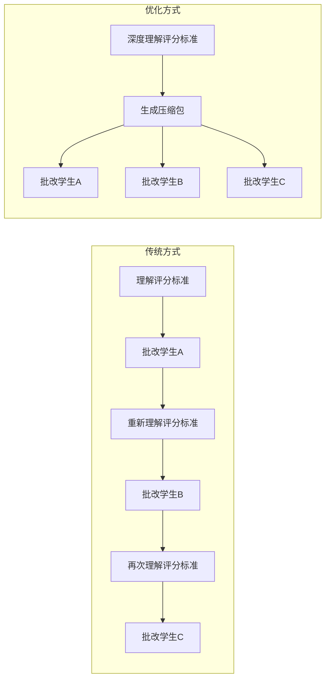

# 批改工作流模块

<cite>
**本文档引用的文件**
- [workflow_multimodal.py](file://ai_correction/functions/langgraph/workflow_multimodal.py) - *重构版，更新于最近提交*
- [state.py](file://ai_correction/functions/langgraph/state.py) - *更新协作字段，标记OCR废弃*
- [orchestrator_agent.py](file://ai_correction/functions/langgraph/agents/orchestrator_agent.py) - *新增，任务编排Agent*
- [student_detection_agent.py](file://ai_correction/functions/langgraph/agents/student_detection_agent.py) - *新增，学生识别Agent*
- [batch_planning_agent.py](file://ai_correction/functions/langgraph/agents/batch_planning_agent.py) - *新增，批次规划Agent*
- [rubric_master_agent.py](file://ai_correction/functions/langgraph/agents/rubric_master_agent.py) - *新增，评分标准主控Agent*
- [question_context_agent.py](file://ai_correction/functions/langgraph/agents/question_context_agent.py) - *新增，题目上下文Agent*
- [grading_worker_agent.py](file://ai_correction/functions/langgraph/agents/grading_worker_agent.py) - *新增，批改工作Agent*
- [result_aggregator_agent.py](file://ai_correction/functions/langgraph/agents/result_aggregator_agent.py) - *新增，结果聚合Agent*
- [class_analysis_agent.py](file://ai_correction/functions/langgraph/agents/class_analysis_agent.py) - *新增，班级分析Agent*
- [test_multimodal_grading.py](file://ai_correction/test_multimodal_grading.py)
</cite>

## 更新摘要
**变更内容**
- 全面重构批改工作流，实现基于8个Agent的深度协作架构
- 新增`StudentDetectionAgent`、`BatchPlanningAgent`等5个核心Agent
- 更新`GradingState`状态模型，添加`students_info`、`batches_info`等7个协作字段
- 重构`_build_workflow`方法，实现新的11节点执行流程
- 移除对OCR的依赖，完全迁移至多模态LLM Vision能力
- 增强源码追踪系统，准确反映重构后的代码结构

## 目录
1. [简介](#简介)
2. [系统架构概览](#系统架构概览)
3. [核心组件分析](#核心组件分析)
4. [工作流执行流程](#工作流执行流程)
5. [状态管理系统](#状态管理系统)
6. [并行处理策略](#并行处理策略)
7. [单例模式设计](#单例模式设计)
8. [调试与监控](#调试与监控)
9. [最佳实践](#最佳实践)
10. [总结](#总结)

## 简介

多模态批改工作流是一个基于LangGraph框架构建的深度协作AI批改系统，专门设计用于处理多模态教育内容的智能批改。该系统采用11个节点的复杂状态图架构，实现了从Orchestrator编排到ClassAnalysis班级分析的完整批改流水线，支持Token极致优化和并行处理策略。

### 核心特性

- **深度协作架构**：8个专业Agent协同工作，实现专业化分工
- **多模态处理**：原生支持文本、图片、PDF等多种文件格式
- **Token优化**：通过深度理解一次性处理，大幅减少重复计算
- **并行处理**：支持多批次并行批改，显著提升处理效率
- **智能编排**：基于任务类型的动态工作流调整

## 系统架构概览

多模态批改工作流采用分层架构设计，包含编排层、处理层和输出层三个主要层次。



**图表来源**
- [workflow_multimodal.py](file://ai_correction/functions/langgraph/workflow_multimodal.py#L50-L120)
- [orchestrator_agent.py](file://ai_correction/functions/langgraph/agents/orchestrator_agent.py#L15-L40)

**章节来源**
- [workflow_multimodal.py](file://ai_correction/functions/langgraph/workflow_multimodal.py#L40-L60)

## 核心组件分析

### MultiModalGradingWorkflow 类

`MultiModalGradingWorkflow` 是整个工作流的核心控制器，负责创建工作流图和管理执行流程。

#### 初始化过程

工作流的初始化包含以下关键步骤：

1. **实例化检查点器**：创建MemorySaver用于状态持久化
2. **构建状态图**：使用StateGraph创建有向无环图
3. **添加节点**：注册11个专业Agent作为工作流节点
4. **定义连接关系**：建立节点间的执行依赖关系
5. **编译图结构**：生成可执行的工作流图



**图表来源**
- [workflow_multimodal.py](file://ai_correction/functions/langgraph/workflow_multimodal.py#L45-L55)
- [orchestrator_agent.py](file://ai_correction/functions/langgraph/agents/orchestrator_agent.py#L15-L25)
- [multimodal_input_agent.py](file://ai_correction/functions/langgraph/agents/multimodal_input_agent.py#L15-L25)

#### _build_workflow 方法详解

`_build_workflow` 方法构建了包含11个节点的复杂状态图，每个节点都有特定的职责和执行时机。

**节点定义顺序**：
1. **Orchestrator** - 任务编排和资源分配
2. **MultiModalInput** - 多模态文件处理
3. **并行理解节点** - QuestionUnderstanding、AnswerUnderstanding、RubricInterpreter
4. **StudentDetection** - 学生信息识别
5. **BatchPlanning** - 批次规划
6. **RubricMaster** - 评分标准主控
7. **QuestionContext** - 题目上下文生成
8. **GradingWorker** - 批改工作执行
9. **ResultAggregator** - 结果聚合
10. **ClassAnalysis** - 班级分析
11. **Finalize** - 结果最终化

**章节来源**
- [workflow_multimodal.py](file://ai_correction/functions/langgraph/workflow_multimodal.py#L50-L120)

### GradingState 状态对象

`GradingState` 是工作流中所有Agent共享的状态容器，采用TypedDict定义，确保类型安全和数据一致性。

#### 核心字段分类

**基础任务信息**：
- `task_id`: 任务唯一标识
- `user_id`: 用户标识
- `assignment_id`: 作业标识
- `timestamp`: 时间戳

**文件处理信息**：
- `question_files`: 题目文件路径列表
- `answer_files`: 答案文件路径列表
- `marking_files`: 评分标准文件路径列表
- `images`: 作业图片列表

**多模态增强字段**：
- `question_multimodal_files`: 多模态题目文件
- `answer_multimodal_files`: 多模态答案文件
- `marking_multimodal_files`: 多模态评分标准文件

**深度协作相关字段**：
- `students_info`: 学生信息列表
- `batches_info`: 批次规划信息
- `batch_rubric_packages`: 批次专属评分包
- `question_context_packages`: 批次专属题目上下文
- `grading_results`: 批改结果列表
- `student_reports`: 学生报告列表
- `class_analysis`: 班级分析报告

**章节来源**
- [state.py](file://ai_correction/functions/langgraph/state.py#L40-L120)

## 工作流执行流程

多模态批改工作流遵循严格的9阶段执行顺序，每个阶段都有明确的目标和输出。

### 执行阶段详解

#### 第一阶段：Orchestrator编排（10%）

OrchestratorAgent负责全局任务分解和资源优化，是整个工作流的指挥中心。

**主要职责**：
1. **任务类型分析**：根据答案文件数量判断任务规模
2. **资源配置**：决定是否启用学生识别和班级分析
3. **批次优化**：计算最优批次大小以平衡性能和成本
4. **流程规划**：制定后续执行策略



**图表来源**
- [orchestrator_agent.py](file://ai_correction/functions/langgraph/agents/orchestrator_agent.py#L50-L90)

#### 第二阶段：多模态输入处理（15%）

MultiModalInputAgent负责将上传的文件转换为多模态表示，保留原始模态信息。

**处理流程**：
1. **文件识别**：识别每种文件的模态类型
2. **格式转换**：将文件转换为统一的多模态格式
3. **质量检查**：验证文件完整性
4. **状态更新**：将处理结果写入状态对象

#### 第三阶段：并行理解（25%）

三个理解Agent并行处理多模态输入，分别专注于不同方面的理解：

**并行处理机制**：
- **QuestionUnderstanding**：理解题目要求和约束条件
- **AnswerUnderstanding**：分析学生答案的内容和结构
- **RubricInterpreter**：解析评分标准的逻辑和要点



**图表来源**
- [multimodal_input_agent.py](file://ai_correction/functions/langgraph/agents/multimodal_input_agent.py#L25-L80)

#### 第四阶段：学生识别（30%）

StudentDetectionAgent分析答案文件，识别出每个学生的身份信息。

**识别内容**：
- 学生姓名
- 学号
- 班级信息
- 学习特征

#### 第五阶段：批次规划（35%）

BatchPlanningAgent基于学生列表和题目信息规划最优的批次划分方案。

**规划策略**：
- **均衡分配**：确保每个批次的学生数量相近
- **Token优化**：考虑LLM上下文限制
- **并行优先级**：为高优先级批次分配更多资源

#### 第六阶段：RubricMaster评分包生成（45%）

RubricMasterAgent深度理解评分标准，为每个批次生成定制化的压缩版评分包。

**Token优化策略**：
- **提取决策树**：只保留关键的评分逻辑
- **使用简写**：用缩写代替完整术语
- **提供快速检查**：生成快速验证方法

#### 第七阶段：QuestionContext上下文生成（50%）

QuestionContextAgent为批改提供轻量级的题目上下文，减少批改Agent的Token消耗。

**压缩策略**：
- **提取核心内容**：只保留最重要的题目信息
- **限制关键词数量**：控制关键词列表长度
- **生成快速参考**：提供简洁的上下文摘要

#### 第八阶段：GradingWorker并行批改（80%）

GradingWorkerAgent基于压缩版评分包和上下文，高效执行批改工作。

**批改流程**：
1. **批次遍历**：处理每个批次的学生
2. **标准应用**：使用压缩版评分包进行评分
3. **上下文利用**：结合题目上下文提高准确性
4. **结果记录**：保存批改结果

#### 第九阶段：ResultAggregator结果聚合（90%）

ResultAggregatorAgent汇总所有批次的批改结果，生成结构化的报告。

**聚合内容**：
- 学生个人报告
- 统计信息
- 等级评定
- 反馈生成

#### 第十阶段：ClassAnalysis班级分析（95%）

ClassAnalysisAgent生成班级整体分析报告（仅在班级批改模式下启用）。

**分析维度**：
- 分数分布统计
- 共性问题识别
- 教学效果评估

#### 第十一阶段：Finalize结果最终化（100%）

最终化批改结果，生成完整的批改报告。

**最终化内容**：
- 总结摘要
- 完成状态标记
- 时间戳记录

**章节来源**
- [workflow_multimodal.py](file://ai_correction/functions/langgraph/workflow_multimodal.py#L120-L200)
- [orchestrator_agent.py](file://ai_correction/functions/langgraph/agents/orchestrator_agent.py#L25-L80)

## 状态管理系统

GradingState状态对象是工作流中数据传递的核心机制，确保各个Agent之间能够高效、准确地共享信息。

### 状态流转机制



**图表来源**
- [workflow_multimodal.py](file://ai_correction/functions/langgraph/workflow_multimodal.py#L120-L180)

### 数据传递模式

状态对象采用增量更新的方式，每个Agent只修改自己关心的字段，避免不必要的数据复制和传输。

**字段分类管理**：
- **输入字段**：只读的输入数据
- **中间字段**：处理过程中的临时数据
- **输出字段**：最终需要保留的结果数据

**章节来源**
- [state.py](file://ai_correction/functions/langgraph/state.py#L40-L150)

## 并行处理策略

多模态批改工作流采用了多层次的并行处理策略，最大化系统吞吐量和Token使用效率。

### 任务级并行

**并行理解阶段**：
三个理解Agent同时处理不同的输入模态，充分利用LLM的并行处理能力。

**批次级并行**：
GradingWorkerAgent可以同时处理多个批次的学生答案，每个批次独立进行批改。

### Token使用优化

**深度理解策略**：
- **一次性深度理解**：对评分标准和题目进行深度解析
- **压缩包传递**：将解析结果打包传递给后续Agent
- **重复利用**：多个批次共享相同的压缩包信息

**优化效果**：
- **节省60-80% Token消耗**
- **减少重复计算**
- **提高处理速度**



**图表来源**
- [rubric_master_agent.py](file://ai_correction/functions/langgraph/agents/rubric_master_agent.py#L25-L60)
- [grading_worker_agent.py](file://ai_correction/functions/langgraph/agents/grading_worker_agent.py#L25-L80)

**章节来源**
- [workflow_multimodal.py](file://ai_correction/functions/langgraph/workflow_multimodal.py#L80-L120)
- [rubric_master_agent.py](file://ai_correction/functions/langgraph/agents/rubric_master_agent.py#L25-L80)

## 单例模式设计

系统采用了单例模式来管理MultiModalGradingWorkflow实例，这种设计带来了显著的优势。

### 单例模式实现

```python
_workflow_instance = None

def get_multimodal_workflow() -> MultiModalGradingWorkflow:
    """获取多模态工作流实例（单例模式）"""
    global _workflow_instance
    if _workflow_instance is None:
        _workflow_instance = MultiModalGradingWorkflow()
    return _workflow_instance
```

### 设计优势

**内存效率**：
- **避免重复创建**：工作流图只需要构建一次
- **节省初始化开销**：无需重复加载Agent和配置
- **共享状态管理**：检查点器和缓存可以跨调用共享

**性能优化**：
- **快速访问**：O(1)时间复杂度获取实例
- **并发安全**：线程安全的单例实现
- **资源复用**：最大化系统资源利用率

**维护便利性**：
- **统一配置**：所有调用共享同一套配置
- **状态一致性**：确保工作流状态的一致性
- **易于监控**：集中化的实例管理

### 使用场景

**便捷函数模式**：
```python
async def run_multimodal_grading(...):
    workflow = get_multimodal_workflow()
    return await workflow.execute(initial_state)
```

**直接实例模式**：
```python
workflow = get_multimodal_workflow()
result = await workflow.execute(custom_state)
```

**章节来源**
- [workflow_multimodal.py](file://ai_correction/functions/langgraph/workflow_multimodal.py#L320-L330)

## 调试与监控

多模态批改工作流提供了完善的调试和监控机制，帮助开发者和运维人员快速定位问题和优化性能。

### 日志系统

系统采用结构化日志记录，每个Agent都会记录详细的执行信息。

**日志级别**：
- **INFO**：正常执行流程的关键节点
- **WARNING**：可恢复的异常情况
- **ERROR**：严重错误和异常

**日志内容**：
- **Agent名称**：标识执行的组件
- **任务ID**：关联的处理任务
- **执行时间**：操作耗时统计
- **状态变更**：进度和状态更新

### 错误处理机制

**分层错误处理**：
1. **Agent级别**：每个Agent独立处理自身错误
2. **工作流级别**：捕获和记录全局错误
3. **用户级别**：提供友好的错误信息

**错误记录格式**：
```python
{
    'agent': 'Agent名称',
    'step': '执行步骤',
    'error': '错误描述',
    'timestamp': '时间戳'
}
```

### 性能监控

**关键指标**：
- **处理时间**：每个阶段的执行耗时
- **Token使用**：各阶段的Token消耗统计
- **成功率**：各Agent的成功率统计
- **并发度**：并行处理的效率指标

**监控工具**：
- **实时日志**：查看执行过程中的详细信息
- **错误报告**：分析失败原因和频率
- **性能分析**：识别瓶颈和优化机会

### 调试技巧

**开发环境调试**：
1. **启用详细日志**：设置日志级别为DEBUG
2. **断点调试**：在关键Agent中设置断点
3. **状态检查**：定期检查GradingState的内容

**生产环境监控**：
1. **健康检查**：定期检查工作流状态
2. **性能告警**：设置响应时间阈值
3. **错误追踪**：监控错误发生频率

**章节来源**
- [workflow_multimodal.py](file://ai_correction/functions/langgraph/workflow_multimodal.py#L180-L220)
- [orchestrator_agent.py](file://ai_correction/functions/langgraph/agents/orchestrator_agent.py#L40-L80)

## 最佳实践

基于对多模态批改工作流的深入分析，以下是推荐的最佳实践指南。

### 工作流设计原则

**模块化设计**：
- **职责单一**：每个Agent只负责特定的功能领域
- **接口清晰**：明确的状态字段和输入输出规范
- **松耦合**：Agent之间通过状态对象通信

**可扩展性**：
- **插件化架构**：支持新的Agent类型
- **配置驱动**：通过配置调整工作流行为
- **向后兼容**：新版本保持与旧版本的兼容性

### 性能优化策略

**Token优化**：
1. **深度理解优先**：先进行一次性深度理解
2. **压缩包传递**：减少重复信息传输
3. **智能缓存**：缓存常用的解析结果

**并发优化**：
1. **合理批次大小**：根据硬件资源调整批次大小
2. **负载均衡**：动态分配处理资源
3. **异步处理**：充分利用异步I/O能力

### 数据管理最佳实践

**状态设计**：
- **类型安全**：使用TypedDict确保字段类型正确
- **默认值**：为所有字段提供合理的默认值
- **字段分类**：按用途对字段进行分组管理

**文件处理**：
- **格式标准化**：统一文件格式和编码
- **完整性检查**：验证文件的完整性和可读性
- **错误恢复**：提供文件损坏时的降级方案

### 测试策略

**单元测试**：
- **Agent独立测试**：单独测试每个Agent的功能
- **状态验证**：验证状态转换的正确性
- **边界条件**：测试极端情况下的行为

**集成测试**：
- **端到端测试**：测试完整的工作流流程
- **并发测试**：验证并行处理的正确性
- **性能测试**：评估系统在不同负载下的表现

### 部署和运维

**监控配置**：
- **关键指标监控**：设置必要的监控指标
- **告警机制**：配置及时的故障告警
- **日志轮转**：管理日志文件的存储空间

**容量规划**：
- **资源评估**：评估系统所需的计算资源
- **扩展策略**：制定水平和垂直扩展计划
- **成本优化**：平衡性能和成本需求

**章节来源**
- [test_multimodal_grading.py](file://ai_correction/test_multimodal_grading.py#L15-L50)
- [workflow_multimodal.py](file://ai_correction/functions/langgraph/workflow_multimodal.py#L268-L370)

## 总结

多模态批改工作流代表了现代AI批改系统的发展方向，通过深度协作架构、并行处理策略和智能优化算法，实现了高效、准确、可扩展的批改解决方案。

### 技术创新点

**架构创新**：
- **深度协作Agent架构**：8个专业Agent协同工作
- **状态驱动执行**：基于GradingState的状态机设计
- **并行处理优化**：多层次的并行处理策略

**性能优化**：
- **Token极致优化**：通过深度理解和压缩包传递
- **智能批次规划**：动态调整批次大小和优先级
- **资源高效利用**：最大化系统吞吐量

**用户体验**：
- **透明化流程**：清晰的任务执行进度
- **灵活的配置**：支持多种批改模式
- **完善的监控**：全面的调试和监控能力

### 应用价值

**教育领域**：
- **大规模批改**：支持班级级别的自动化批改
- **个性化反馈**：提供详细的个性化学习建议
- **教学分析**：辅助教师进行教学质量分析

**技术推广**：
- **可复用架构**：可应用于其他领域的批改系统
- **开源贡献**：为AI批改技术发展做出贡献
- **标准化实践**：建立行业标准的批改流程

多模态批改工作流不仅解决了当前教育技术面临的挑战，更为未来的智能化教育奠定了坚实的技术基础。随着AI技术的不断发展，这套工作流将继续演进，为教育数字化转型提供更加强大的技术支持。