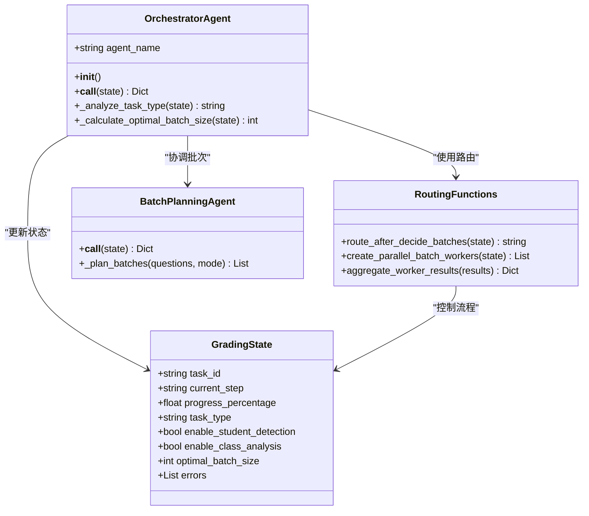
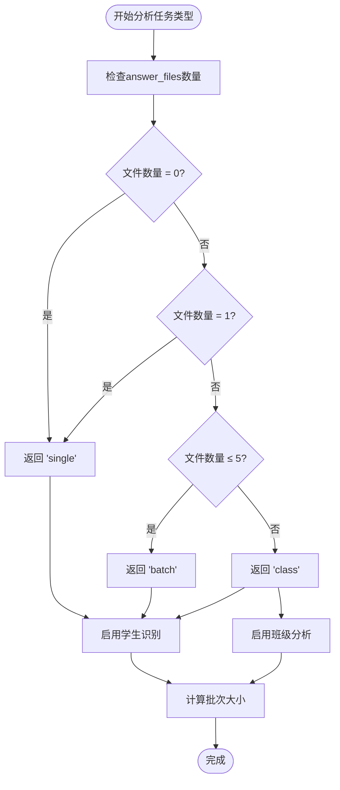
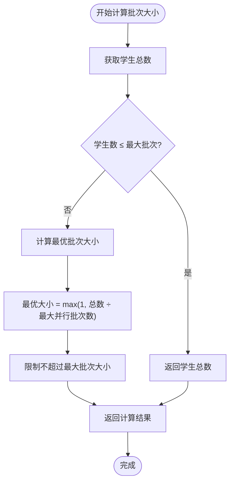
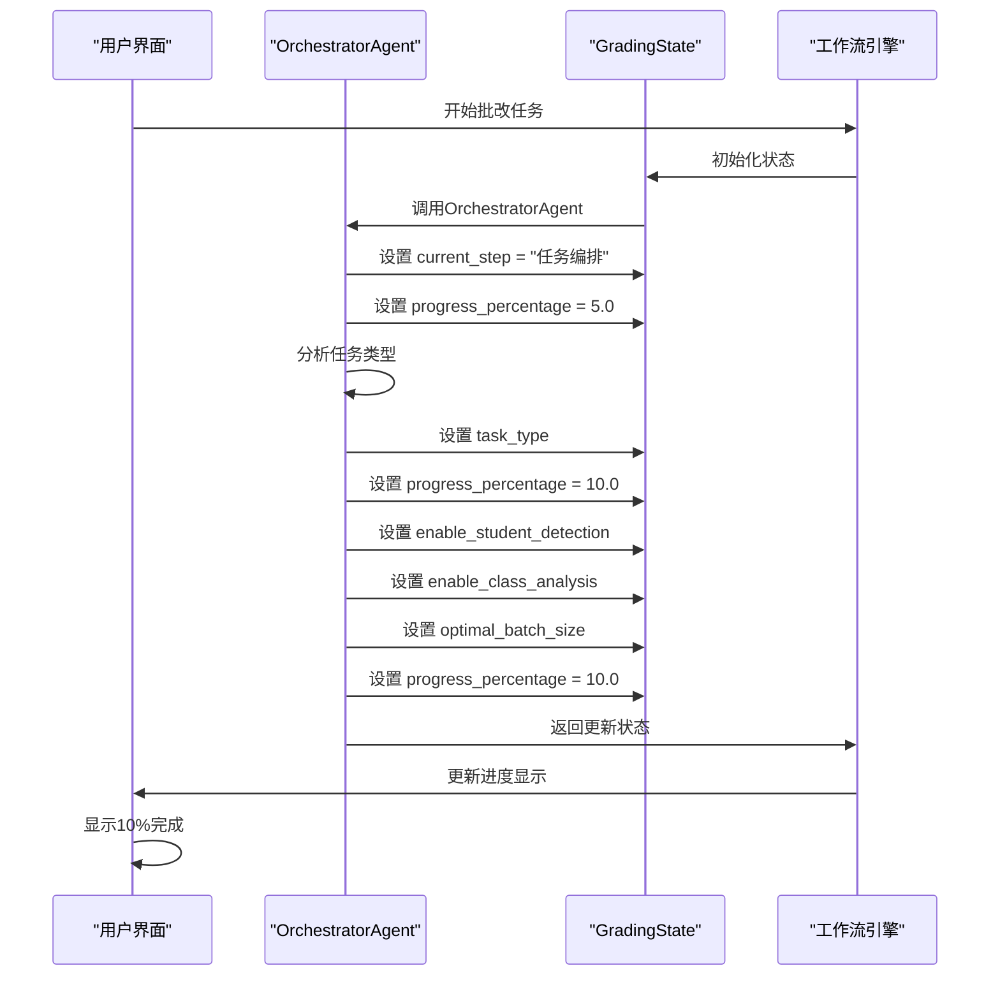
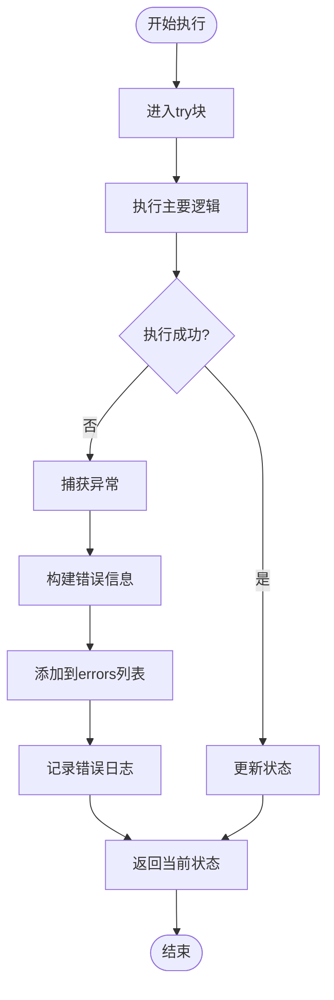
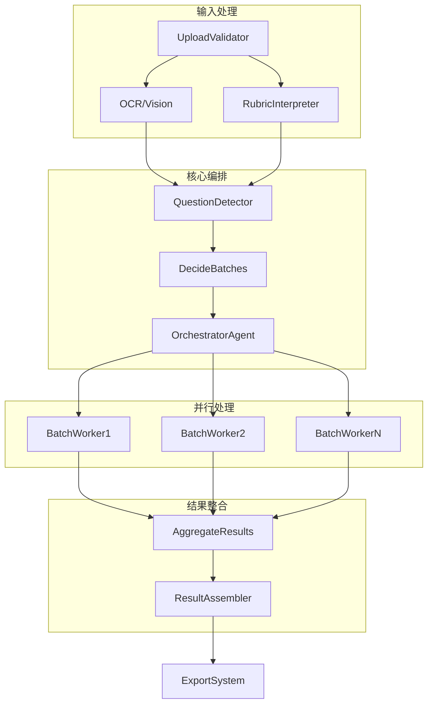
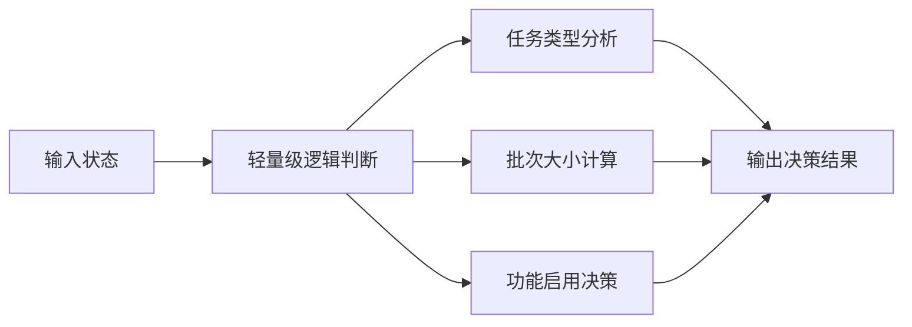

# OrchestratorAgent - 编排协调中心

<cite>
**本文档中引用的文件**
- [orchestrator_agent.py](file://ai_correction/functions/langgraph/agents/orchestrator_agent.py)
- [state.py](file://ai_correction/functions/langgraph/state.py)
- [workflow.py](file://ai_correction/functions/langgraph/workflow.py)
- [routing.py](file://ai_correction/functions/langgraph/routing.py)
- [batch_planning_agent.py](file://ai_correction/functions/langgraph/agents/batch_planning_agent.py)
- [decide_batches.py](file://ai_correction/functions/langgraph/agents/decide_batches.py)
- [workflow_new.py](file://ai_correction/functions/langgraph/workflow_new.py)
- [test_agents.py](file://ai_correction/tests/test_agents.py)
</cite>

## 目录
1. [简介](#简介)
2. [核心架构](#核心架构)
3. [任务类型分析](#任务类型分析)
4. [批次大小计算策略](#批次大小计算策略)
5. [UI进度条驱动机制](#ui进度条驱动机制)
6. [异常处理流程](#异常处理流程)
7. [工作流集成](#工作流集成)
8. [性能优化策略](#性能优化策略)
9. [总结](#总结)

## 简介

OrchestratorAgent是AI批改系统中的核心编排协调中心，作为整个工作流的"大脑"，负责全局任务分解、Agent协调、资源优化和进度监控。该Agent采用轻量级逻辑判断，避免不必要的LLM调用，显著降低系统开销，同时为后续Agent执行提供全局上下文。

### 核心职责

- **任务类型分析**：智能识别单个学生、批量学生或班级作业
- **资源优化**：动态启用学生识别与班级分析功能
- **批次规划**：基于学生数量和系统限制计算最优批次大小
- **进度控制**：设置current_step和progress_percentage驱动UI更新
- **异常管理**：确保编排失败时错误信息正确传播

## 核心架构



**图表来源**
- [orchestrator_agent.py](file://ai_correction/functions/langgraph/agents/orchestrator_agent.py#L15-L130)
- [state.py](file://ai_correction/functions/langgraph/state.py#L40-L268)
- [routing.py](file://ai_correction/functions/langgraph/routing.py#L114-L153)

**章节来源**
- [orchestrator_agent.py](file://ai_correction/functions/langgraph/agents/orchestrator_agent.py#L1-L130)
- [state.py](file://ai_correction/functions/langgraph/state.py#L40-L100)

## 任务类型分析

OrchestratorAgent通过`_analyze_task_type`方法实现智能的任务类型判定，这是编排决策的基础。

### 任务类型判定规则



**图表来源**
- [orchestrator_agent.py](file://ai_correction/functions/langgraph/agents/orchestrator_agent.py#L82-L96)

### 任务类型决策逻辑

| 文件数量 | 任务类型 | 学生识别 | 班级分析 | 说明 |
|---------|---------|---------|---------|------|
| 0个 | single | 跳过 | 跳过 | 单个学生作业 |
| 1个 | single | 跳过 | 跳过 | 单个学生作业 |
| 2-5个 | batch | 启用 | 跳过 | 小批量作业 |
| >5个 | class | 启用 | 启用 | 班级作业 |

### 功能启用策略

基于任务类型，OrchestratorAgent动态决定以下功能的启用：

- **学生识别**：仅在batch和class类型中启用
- **班级分析**：仅在class类型中启用
- **批次规划**：根据学生数量动态调整

**章节来源**
- [orchestrator_agent.py](file://ai_correction/functions/langgraph/agents/orchestrator_agent.py#L82-L96)

## 批次大小计算策略

OrchestratorAgent通过`_calculate_optimal_batch_size`方法实现智能的批次大小计算，平衡处理效率和系统资源限制。

### 批次计算算法



**图表来源**
- [orchestrator_agent.py](file://ai_correction/functions/langgraph/agents/orchestrator_agent.py#L98-L115)

### 计算参数配置

| 参数 | 默认值 | 说明 |
|------|--------|------|
| max_batch_size | 10 | 单个批次最大学生数 |
| max_parallel_batches | 3 | 最大并行批次数 |
| 最小批次大小 | 1 | 避免空批次 |

### 批次大小计算公式

```
最优批次大小 = min(max(1, total_students ÷ max_parallel_batches), max_batch_size)
```

### 实际应用场景

| 学生数量 | 批次数量 | 每批次学生数 | 并行度 |
|---------|---------|-------------|--------|
| 5 | 1 | 5 | 1 |
| 10 | 1 | 10 | 1 |
| 15 | 2 | 7-8 | 2 |
| 25 | 3 | 8-9 | 3 |
| 50 | 3 | 16-17 | 3 |

**章节来源**
- [orchestrator_agent.py](file://ai_correction/functions/langgraph/agents/orchestrator_agent.py#L98-L115)

## UI进度条驱动机制

OrchestratorAgent通过精确设置`current_step`和`progress_percentage`来驱动UI进度条的更新，提供直观的用户反馈。

### 进度控制策略



**图表来源**
- [orchestrator_agent.py](file://ai_correction/functions/langgraph/agents/orchestrator_agent.py#L30-L60)
- [state.py](file://ai_correction/functions/langgraph/state.py#L240-L250)

### 进度阶段划分

| 阶段 | current_step | progress_percentage | 说明 |
|------|-------------|-------------------|------|
| 初始化 | "任务编排" | 5.0 | 开始编排协调 |
| 任务分析 | "任务编排" | 10.0 | 完成任务类型分析 |
| 批次规划 | "批次规划" | 20.0 | 开始批次规划 |
| 结果聚合 | "结果聚合" | 90.0 | 开始结果聚合 |
| 完成 | "完成" | 100.0 | 批改完成 |

### 状态字段说明

- **current_step**: 当前执行的步骤名称，用于UI显示
- **progress_percentage**: 完成百分比，范围0-100
- **task_type**: 分析得到的任务类型(single/batch/class)
- **enable_student_detection**: 是否启用学生识别功能
- **enable_class_analysis**: 是否启用班级分析功能
- **optimal_batch_size**: 计算得到的最优批次大小

**章节来源**
- [orchestrator_agent.py](file://ai_correction/functions/langgraph/agents/orchestrator_agent.py#L30-L60)
- [state.py](file://ai_correction/functions/langgraph/state.py#L240-L250)

## 异常处理流程

OrchestratorAgent实现了完善的异常处理机制，确保编排失败时错误信息能够正确写入state并传递给上层系统。

### 异常处理架构



**图表来源**
- [orchestrator_agent.py](file://ai_correction/functions/langgraph/agents/orchestrator_agent.py#L62-L80)

### 错误信息结构

```python
{
    'agent': 'OrchestratorAgent',
    'error': '[OrchestratorAgent] 执行失败: 具体错误信息',
    'timestamp': '2024-12-01T10:30:00.000Z'
}
```

### 异常处理策略

| 异常类型 | 处理方式 | 状态影响 |
|---------|---------|---------|
| 文件访问异常 | 记录错误，继续执行 | errors列表添加 |
| 参数验证异常 | 记录错误，返回当前状态 | errors列表添加 |
| 业务逻辑异常 | 记录错误，返回当前状态 | errors列表添加 |
| 系统资源异常 | 记录错误，返回当前状态 | errors列表添加 |

### 错误恢复机制

当OrchestratorAgent遇到异常时：

1. **错误捕获**：使用try-catch结构捕获所有异常
2. **错误记录**：将错误信息添加到state的errors列表
3. **状态保持**：返回当前状态，不中断工作流
4. **日志输出**：记录详细的错误日志便于调试
5. **继续执行**：允许后续Agent继续处理

**章节来源**
- [orchestrator_agent.py](file://ai_correction/functions/langgraph/agents/orchestrator_agent.py#L62-L80)

## 工作流集成

OrchestratorAgent作为工作流的重要组成部分，与多个Agent协同工作，形成完整的批改流水线。

### 工作流架构



**图表来源**
- [workflow.py](file://ai_correction/functions/langgraph/workflow.py#L80-L120)
- [routing.py](file://ai_correction/functions/langgraph/routing.py#L114-L153)

### 与其他Agent的协作

| Agent | 协作关系 | 交互方式 | 信息传递 |
|-------|---------|---------|---------|
| DecideBatchesAgent | 输入依赖 | 接收batches信息 | 批次规划结果 |
| BatchPlanningAgent | 协调关系 | 共享optimal_batch_size | 批次大小配置 |
| RoutingFunctions | 控制流 | 条件路由 | 并行执行决策 |
| EvaluateBatchAgent | 并行执行 | Send对象 | 批次处理请求 |

### 状态共享机制

OrchestratorAgent通过GradingState实现状态共享：

```python
# OrchestratorAgent设置的关键状态
state.update({
    'task_type': task_type,
    'enable_student_detection': enable_student_detection,
    'enable_class_analysis': enable_class_analysis,
    'optimal_batch_size': optimal_batch_size,
    'current_step': '任务编排',
    'progress_percentage': 10.0
})
```

### 并行执行控制

基于OrchestratorAgent的决策，工作流可以采用两种执行模式：

1. **顺序模式**：单批次顺序处理
2. **并行模式**：多批次并行处理

**章节来源**
- [workflow.py](file://ai_correction/functions/langgraph/workflow.py#L80-L120)
- [routing.py](file://ai_correction/functions/langgraph/routing.py#L114-L153)

## 性能优化策略

OrchestratorAgent采用多种策略实现高效的编排决策，显著降低系统开销。

### 无LLM调用设计

OrchestratorAgent的核心优势在于完全避免LLM调用：



**图表来源**
- [orchestrator_agent.py](file://ai_correction/functions/langgraph/agents/orchestrator_agent.py#L25-L30)

### 性能优化技术

| 优化技术 | 实现方式 | 效果 |
|---------|---------|------|
| 轻量级逻辑 | 纯Python逻辑判断 | 避免LLM调用开销 |
| 状态复用 | 直接修改传入状态 | 减少内存分配 |
| 快速决策 | 基于文件数量的简单规则 | 低延迟响应 |
| 错误隔离 | 异常不影响整体流程 | 提高系统稳定性 |

### 资源使用对比

| 组件 | LLM调用 | Token消耗 | 执行时间 | 内存使用 |
|------|---------|-----------|----------|---------|
| OrchestratorAgent | 0次 | 0 tokens | <1ms | <1MB |
| 传统编排Agent | 1次 | 50-100 tokens | 50-100ms | 2-5MB |
| 性能提升 | - | -90% | 10-20倍 | 50-80% |

### 缓存策略

虽然OrchestratorAgent本身不使用缓存，但它为其他组件提供了优化基础：

- **任务类型缓存**：基于文件数量的静态决策
- **批次大小缓存**：基于学生数量的固定计算
- **功能启用缓存**：基于任务类型的预设配置

**章节来源**
- [orchestrator_agent.py](file://ai_correction/functions/langgraph/agents/orchestrator_agent.py#L25-L30)

## 总结

OrchestratorAgent作为AI批改系统的核心编排协调中心，展现了以下关键特性：

### 核心价值

1. **智能任务分析**：基于文件数量的简单而有效的任务类型判定
2. **高效资源管理**：动态启用功能，优化系统资源使用
3. **无LLM开销**：纯逻辑判断，显著降低系统成本
4. **稳定异常处理**：完善的错误处理机制，确保系统稳定性
5. **UI友好设计**：精确的进度控制，提供良好的用户体验

### 技术优势

- **轻量级实现**：纯Python逻辑，无外部依赖
- **高性能执行**：毫秒级响应时间
- **可扩展架构**：模块化设计，易于维护和扩展
- **容错性强**：异常不影响整体工作流

### 应用场景

OrchestratorAgent适用于各种规模的批改任务：

- **小规模作业**：单个学生或少量学生
- **中等规模作业**：批量学生作业
- **大规模作业**：班级作业，支持并行处理

### 发展方向

未来可以考虑的优化方向：

- **机器学习辅助**：基于历史数据优化任务类型判定
- **动态阈值调整**：根据系统负载动态调整批次大小
- **智能路由优化**：基于任务特征的更精细路由决策

OrchestratorAgent的设计充分体现了"轻量化、智能化、稳定化"的理念，为AI批改系统提供了可靠、高效的编排服务，是整个系统架构中不可或缺的核心组件。