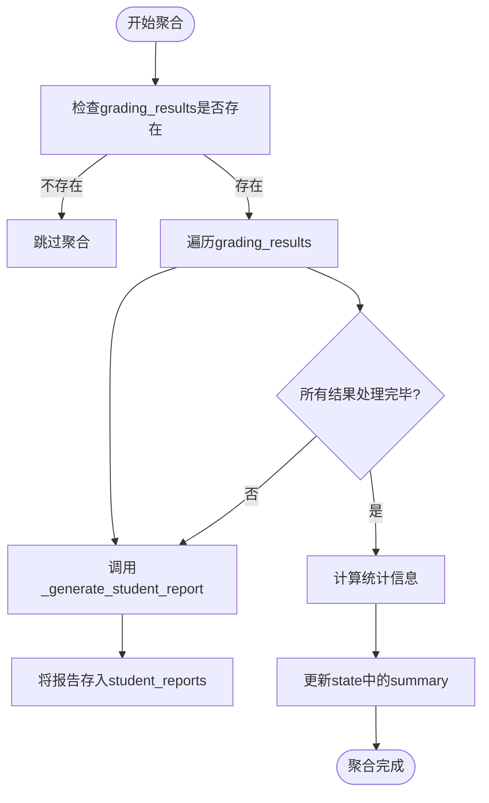
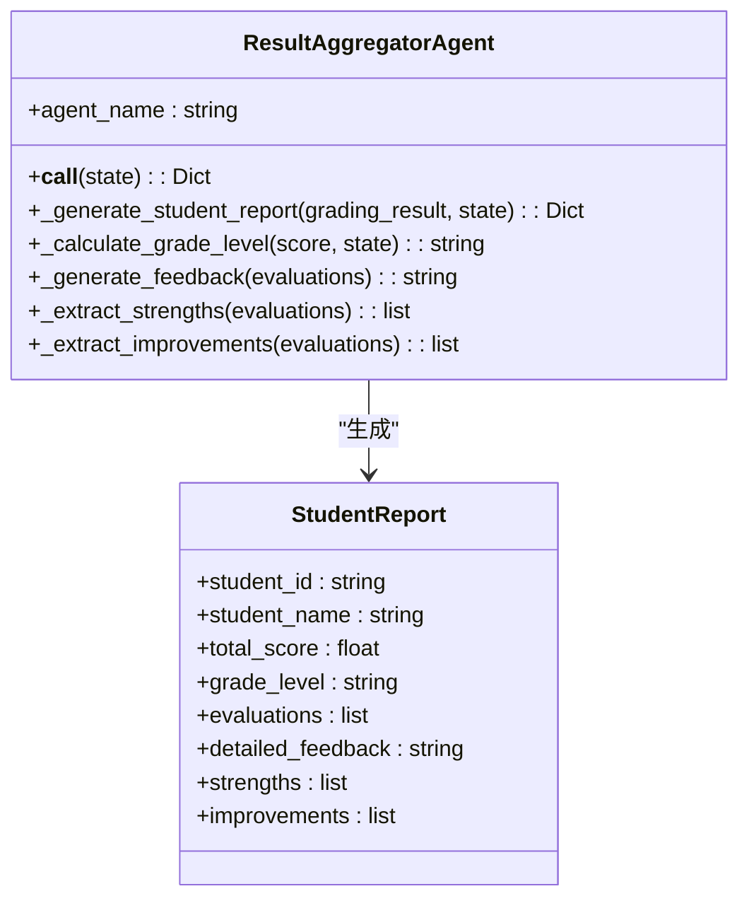
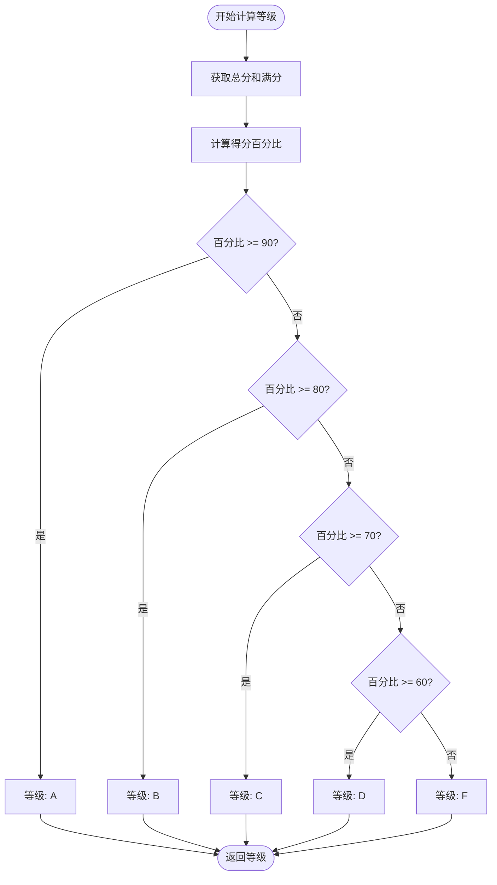
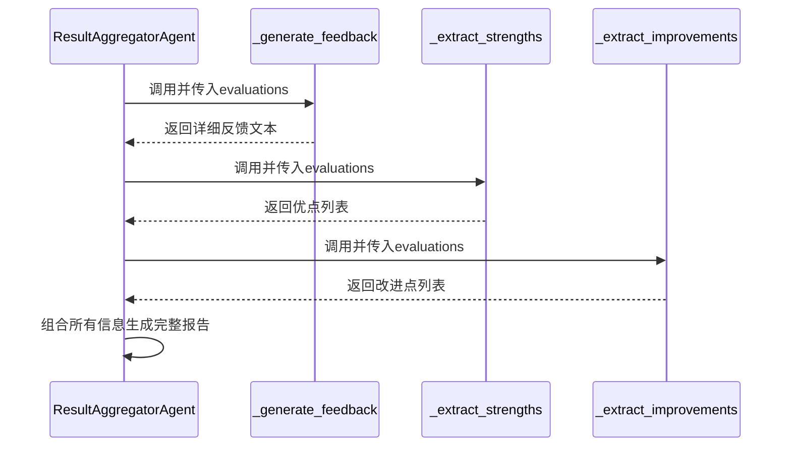

# ResultAggregatorAgent - 批改结果聚合

<cite>
**本文档引用的文件**
- [result_aggregator_agent.py](file://ai_correction/functions/langgraph/agents/result_aggregator_agent.py)
- [state.py](file://ai_correction/functions/langgraph/state.py)
</cite>

## 目录
1. [简介](#简介)
2. [核心功能分析](#核心功能分析)
3. [学生报告生成流程](#学生报告生成流程)
4. [等级计算机制](#等级计算机制)
5. [反馈内容构建](#反馈内容构建)
6. [统计信息生成](#统计信息生成)
7. [学生报告JSON结构示例](#学生报告json结构示例)
8. [价值与应用](#价值与应用)

## 简介
ResultAggregatorAgent是AI批改系统中的关键组件，负责将分散的批改结果整合为结构化的学生报告。该Agent在批改流程的后期阶段执行，接收来自各个批改工作节点的评分结果，通过系统化的处理流程，为每位学生生成包含总分、等级、详细反馈、优点和改进点的完整报告。同时，它还生成班级层面的统计摘要信息，为前端展示和教学分析提供数据基础。

**Section sources**
- [result_aggregator_agent.py](file://ai_correction/functions/langgraph/agents/result_aggregator_agent.py#L1-L20)

## 核心功能分析
ResultAggregatorAgent的核心功能是遍历`grading_results`列表，为每个学生调用`_generate_student_report`方法生成个性化报告，并在`state`中生成`summary`统计信息。该Agent作为批改流程的聚合点，将分散的评分数据转化为结构化、可读性强的教育反馈。

Agent首先检查`state`中是否存在`grading_results`，若不存在则跳过聚合过程。若存在，则遍历每个批改结果，调用私有方法生成详细的学生报告，并将所有报告存储在`state['student_reports']`中。最后，计算班级平均分等统计信息并存入`state['summary']。



**Diagram sources**
- [result_aggregator_agent.py](file://ai_correction/functions/langgraph/agents/result_aggregator_agent.py#L25-L50)

**Section sources**
- [result_aggregator_agent.py](file://ai_correction/functions/langgraph/agents/result_aggregator_agent.py#L25-L50)
- [state.py](file://ai_correction/functions/langgraph/state.py#L124-L125)

## 学生报告生成流程
ResultAggregatorAgent通过`_generate_student_report`方法为每个学生生成完整的报告。该方法接收单个学生的`grading_result`和全局`state`作为输入，提取学生ID、姓名、总分和各项评估结果。

报告的核心内容包括：
- **基础信息**：学生ID和姓名
- **成绩信息**：总分和等级
- **评估详情**：原始的评估列表
- **详细反馈**：通过`_generate_feedback`方法生成的文本反馈
- **优点列表**：通过`_extract_strengths`方法提取的优点
- **改进点列表**：通过`_extract_improvements`方法提取的改进点



**Diagram sources**
- [result_aggregator_agent.py](file://ai_correction/functions/langgraph/agents/result_aggregator_agent.py#L75-L100)

**Section sources**
- [result_aggregator_agent.py](file://ai_correction/functions/langgraph/agents/result_aggregator_agent.py#L75-L100)

## 等级计算机制
`_calculate_grade_level`方法根据学生的总分和满分计算等级（A-F）。该方法从`state`中获取满分值，通常来自`batch_rubric_packages`中的`total_points`字段。通过计算得分百分比，按照预设的阈值划分等级：

- 90%及以上：A级
- 80%-89%：B级
- 70%-79%：C级
- 60%-69%：D级
- 60%以下：F级

这种等级划分机制确保了评分的标准化和一致性，使教师能够快速了解学生的整体表现水平。



**Diagram sources**
- [result_aggregator_agent.py](file://ai_correction/functions/langgraph/agents/result_aggregator_agent.py#L102-L115)

**Section sources**
- [result_aggregator_agent.py](file://ai_correction/functions/langgraph/agents/result_aggregator_agent.py#L102-L115)

## 反馈内容构建
ResultAggregatorAgent通过一系列辅助方法构建个性化的反馈内容，提升报告的可读性和教育价值。

### 详细反馈生成
`_generate_feedback`方法遍历学生的各项评估，为每个评分标准生成一行反馈文本，格式为"标准ID: 满足程度 (得分)"。这为学生提供了清晰的逐项反馈。

### 优点提取
`_extract_strengths`方法提取所有`is_met`为`True`的评估项，将其转化为优点列表。每项优点的格式为"标准ID: 理由"，突出学生的强项。

### 改进点提取
`_extract_improvements`方法提取所有`is_met`为`False`的评估项，将其转化为改进建议列表。每项建议的格式为"标准ID: 需要改进"，明确指出需要提升的方面。



**Diagram sources**
- [result_aggregator_agent.py](file://ai_correction/functions/langgraph/agents/result_aggregator_agent.py#L117-L142)

**Section sources**
- [result_aggregator_agent.py](file://ai_correction/functions/langgraph/agents/result_aggregator_agent.py#L117-L142)

## 统计信息生成
在生成所有学生报告后，ResultAggregatorAgent会计算班级层面的统计信息并存入`state['summary']`。这些信息包括：

- **总学生数**：参与批改的学生总数
- **平均分**：所有学生总分的算术平均值
- **完成时间**：聚合操作完成的时间戳

这些统计信息为教师提供了班级整体表现的概览，是进行教学分析和决策的重要依据。

**Section sources**
- [result_aggregator_agent.py](file://ai_correction/functions/langgraph/agents/result_aggregator_agent.py#L40-L48)

## 学生报告JSON结构示例
以下是ResultAggregatorAgent生成的学生报告的JSON结构示例：

```json
{
  "student_id": "20210001",
  "student_name": "张三",
  "total_score": 8.5,
  "grade_level": "B",
  "evaluations": [
    {
      "criterion_id": "C1",
      "score_earned": 2.0,
      "is_met": true,
      "satisfaction_level": "完全满足",
      "justification": "答案完全正确"
    },
    {
      "criterion_id": "C2",
      "score_earned": 1.5,
      "is_met": true,
      "satisfaction_level": "部分满足",
      "justification": "答案基本正确，但表述不够完整"
    }
  ],
  "detailed_feedback": "- C1: 完全满足 (2.0分)\n- C2: 部分满足 (1.5分)",
  "strengths": [
    "C1: 答案完全正确"
  ],
  "improvements": [
    "C2: 需要改进"
  ]
}
```

此结构化的数据格式便于前端展示和进一步的数据分析。

**Section sources**
- [result_aggregator_agent.py](file://ai_correction/functions/langgraph/agents/result_aggregator_agent.py#L85-L100)

## 价值与应用
ResultAggregatorAgent在提升批改结果的可读性和可用性方面具有重要价值。通过将分散的评分数据整合为结构化的学生报告，它为教师和学生提供了清晰、全面的反馈信息。

该Agent生成的数据为前端展示提供了坚实的基础，可以轻松实现学生个人报告、班级成绩分布、知识点掌握情况等多种可视化展示。同时，`summary`统计信息支持教师进行班级整体分析，识别教学中的共性问题，优化教学策略。

作为批改流程的关键环节，ResultAggregatorAgent实现了从原始评分到教育洞察的转化，是连接AI技术与教育实践的重要桥梁。

**Section sources**
- [result_aggregator_agent.py](file://ai_correction/functions/langgraph/agents/result_aggregator_agent.py#L25-L142)
- [state.py](file://ai_correction/functions/langgraph/state.py#L124-L125)