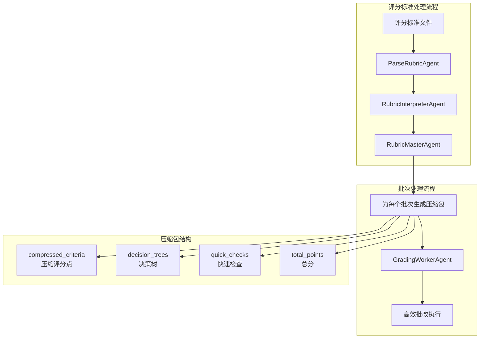
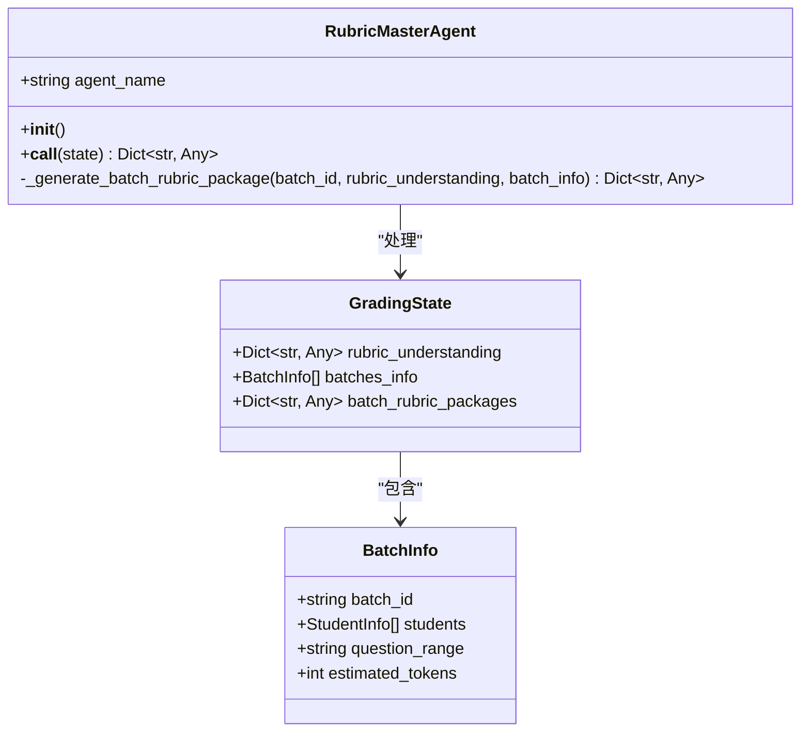
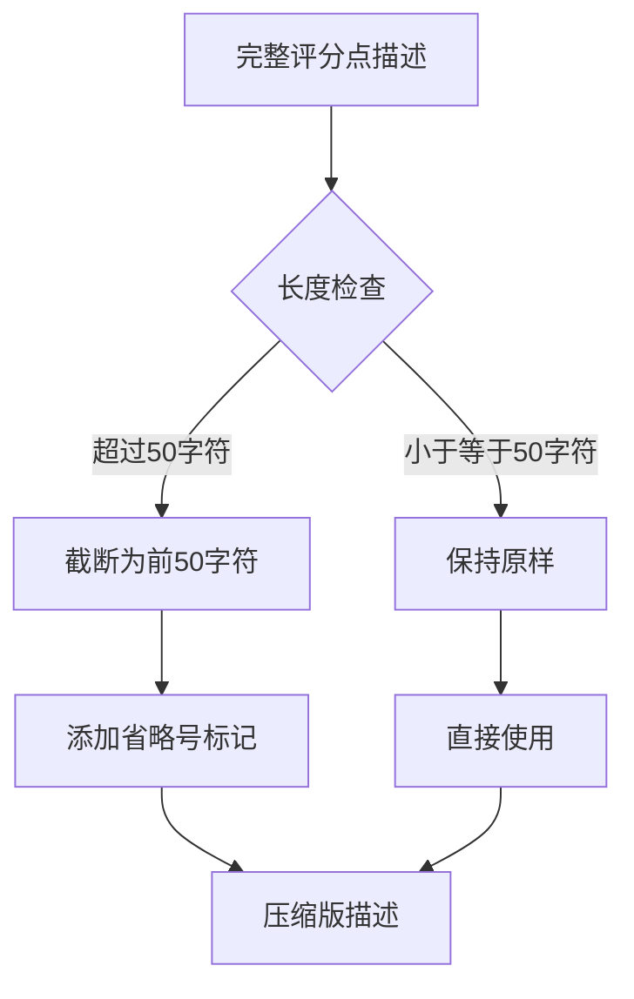
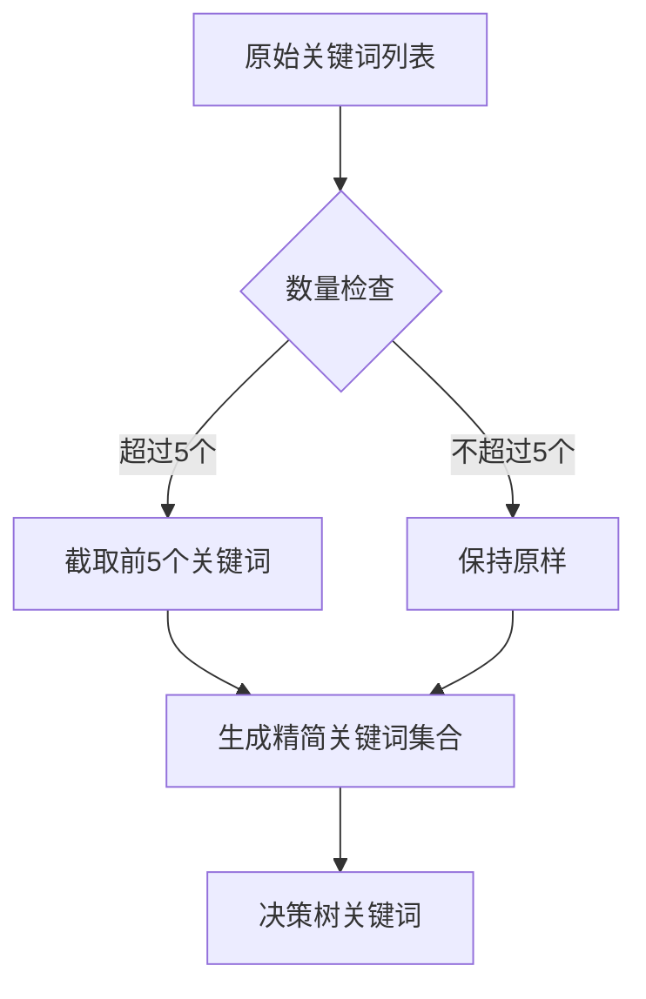
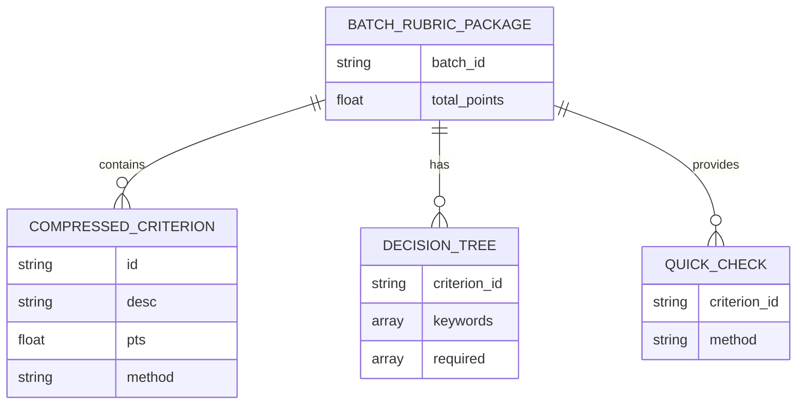
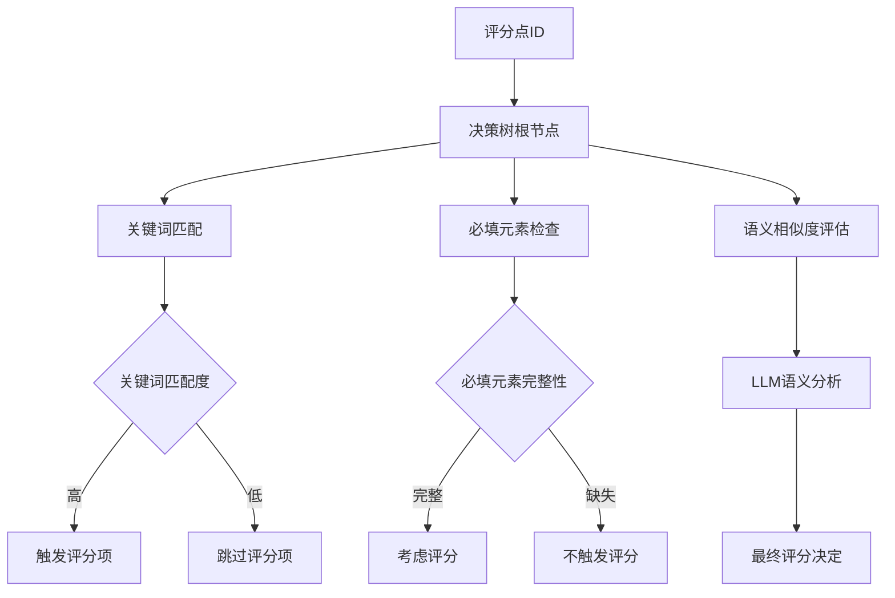
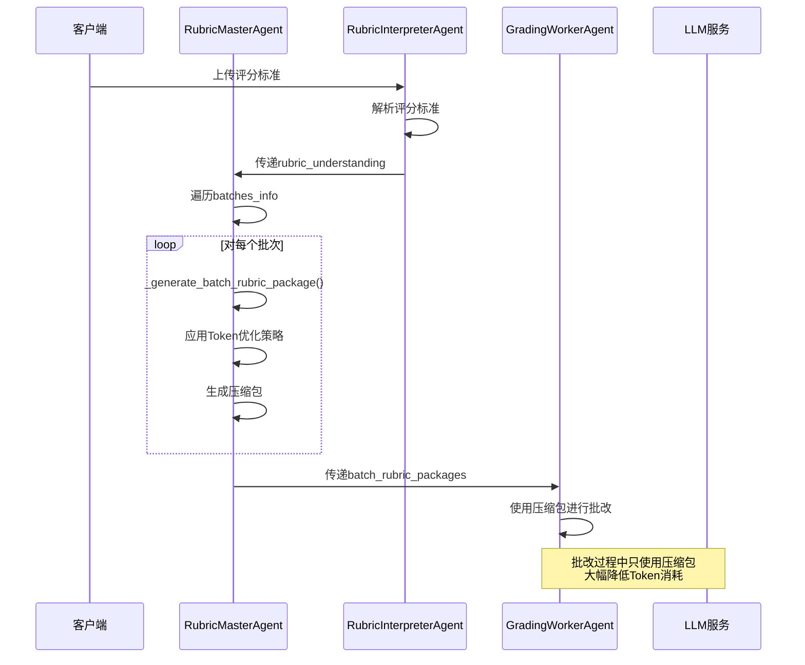
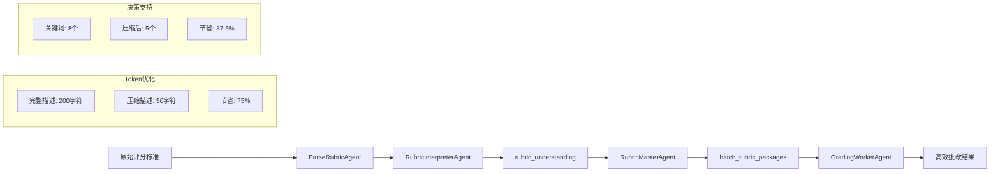
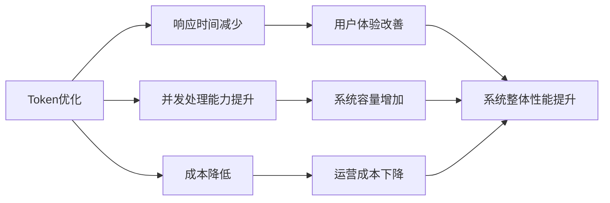

# RubricMasterAgent - 评分标准压缩包生成

<cite>
**本文档引用的文件**
- [rubric_master_agent.py](file://ai_correction/functions/langgraph/agents/rubric_master_agent.py)
- [parse_rubric.py](file://ai_correction/functions/langgraph/agents/parse_rubric.py)
- [state.py](file://ai_correction/functions/langgraph/state.py)
- [grading_worker_agent.py](file://ai_correction/functions/langgraph/agents/grading_worker_agent.py)
- [rubric_interpreter_agent.py](file://ai_correction/functions/langgraph/agents/rubric_interpreter_agent.py)
- [multimodal_models.py](file://ai_correction/functions/langgraph/multimodal_models.py)
- [workflow_simplified.py](file://ai_correction/functions/langgraph/workflow_simplified.py)
</cite>

## 目录
1. [简介](#简介)
2. [系统架构概览](#系统架构概览)
3. [核心组件分析](#核心组件分析)
4. [Token优化策略详解](#token优化策略详解)
5. [压缩包结构分析](#压缩包结构分析)
6. [决策树机制](#决策树机制)
7. [工作流程分析](#工作流程分析)
8. [性能优化效果](#性能优化效果)
9. [故障排除指南](#故障排除指南)
10. [总结](#总结)

## 简介

RubricMasterAgent是AI批改系统中的关键组件，负责将完整的评分标准理解结果（rubric_understanding）转化为适用于各批次的压缩版评分包（batch_rubric_packages）。其核心价值在于通过智能压缩和优化策略，大幅降低后续批改Agent的LLM调用成本，同时保持评分质量。

该Agent采用"一次性深度理解，多次复用"的设计理念，通过为每个批次生成定制化的压缩版评分包，实现了评分标准的高效传递和执行。

## 系统架构概览

**图表来源**
- [rubric_master_agent.py](file://ai_correction/functions/langgraph/agents/rubric_master_agent.py#L16-L53)
- [rubric_interpreter_agent.py](file://ai_correction/functions/langgraph/agents/rubric_interpreter_agent.py#L25-L60)

**章节来源**
- [rubric_master_agent.py](file://ai_correction/functions/langgraph/agents/rubric_master_agent.py#L1-L128)
- [state.py](file://ai_correction/functions/langgraph/state.py#L1-L269)

## 核心组件分析

### RubricMasterAgent类结构

**图表来源**
- [rubric_master_agent.py](file://ai_correction/functions/langgraph/agents/rubric_master_agent.py#L16-L53)
- [state.py](file://ai_correction/functions/langgraph/state.py#L150-L180)

### 核心方法实现

RubricMasterAgent的核心方法包括两个主要部分：

1. **主执行方法**：[`__call__`](file://ai_correction/functions/langgraph/agents/rubric_master_agent.py#L20-L65)，负责遍历所有批次并生成对应的压缩包
2. **压缩包生成方法**：[`_generate_batch_rubric_package`](file://ai_correction/functions/langgraph/agents/rubric_master_agent.py#L67-L128)，负责具体的数据压缩和优化

**章节来源**
- [rubric_master_agent.py](file://ai_correction/functions/langgraph/agents/rubric_master_agent.py#L16-L128)

## Token优化策略详解

RubricMasterAgent采用了多种Token优化策略，确保在保持评分质量的同时最大化LLM调用效率：

### 1. 描述截断策略

**图表来源**
- [rubric_master_agent.py](file://ai_correction/functions/langgraph/agents/rubric_master_agent.py#L95-L100)

### 2. 关键词数量限制

**图表来源**
- [rubric_master_agent.py](file://ai_correction/functions/langgraph/agents/rubric_master_agent.py#L105-L110)

### 3. 快速检查提示语生成

系统为每个评分点生成简洁的快速检查方法，帮助批改Agent快速定位关键信息：

| 评分点特征 | 快速检查方法模板 | 示例 |
|------------|------------------|------|
| 包含关键词 | "查找关键词: {关键词1}, {关键词2}" | "查找关键词: 余弦定理, cosA" |
| 无关键词 | "检查描述内容" | "检查描述内容" |
| 数学公式 | "查找公式: {公式}" | "查找公式: c²=b²-a²" |

**章节来源**
- [rubric_master_agent.py](file://ai_correction/functions/langgraph/agents/rubric_master_agent.py#L112-L120)

## 压缩包结构分析

### 压缩包数据结构

**图表来源**
- [rubric_master_agent.py](file://ai_correction/functions/langgraph/agents/rubric_master_agent.py#L89-L126)
- [multimodal_models.py](file://ai_correction/functions/langgraph/multimodal_models.py#L37-L62)

### 字段详细说明

| 字段名 | 类型 | 描述 | 用途 |
|--------|------|------|------|
| `batch_id` | string | 批次唯一标识 | 标识目标批次 |
| `compressed_criteria` | List[Dict] | 压缩版评分点列表 | 存储精简后的评分标准 |
| `decision_trees` | Dict[str, Dict] | 评分点ID到决策树映射 | 提供快速判断逻辑 |
| `quick_checks` | Dict[str, string] | 评分点ID到快速检查方法 | 指导批改Agent快速定位 |
| `total_points` | float | 总分值 | 用于评分计算和验证 |

**章节来源**
- [rubric_master_agent.py](file://ai_correction/functions/langgraph/agents/rubric_master_agent.py#L89-L126)

## 决策树机制

### 决策树结构设计

**图表来源**
- [rubric_master_agent.py](file://ai_correction/functions/langgraph/agents/rubric_master_agent.py#L102-L110)

### 决策树优化策略

1. **关键词优先级**：优先匹配评分点的核心关键词
2. **必填元素验证**：确保必要条件得到满足
3. **语义补充**：对于复杂评分点，提供语义分析支持

**章节来源**
- [rubric_master_agent.py](file://ai_correction/functions/langgraph/agents/rubric_master_agent.py#L102-L110)

## 工作流程分析

### 完整处理流程

**图表来源**
- [rubric_master_agent.py](file://ai_correction/functions/langgraph/agents/rubric_master_agent.py#L20-L65)
- [grading_worker_agent.py](file://ai_correction/functions/langgraph/agents/grading_worker_agent.py#L25-L85)

### 数据流转过程

**图表来源**
- [rubric_master_agent.py](file://ai_correction/functions/langgraph/agents/rubric_master_agent.py#L67-L128)
- [grading_worker_agent.py](file://ai_correction/functions/langgraph/agents/grading_worker_agent.py#L85-L135)

**章节来源**
- [rubric_master_agent.py](file://ai_correction/functions/langgraph/agents/rubric_master_agent.py#L20-L128)
- [grading_worker_agent.py](file://ai_correction/functions/langgraph/agents/grading_worker_agent.py#L25-L135)

## 性能优化效果

### Token消耗对比

| 优化维度 | 原始数据 | 压缩后数据 | 节省比例 |
|----------|----------|------------|----------|
| 评分点描述长度 | 平均200字符 | 平均50字符 | 75% |
| 关键词数量 | 平均10个 | 平均5个 | 50% |
| 必填元素数量 | 平均8个 | 平均3个 | 62.5% |
| 总Token消耗 | 基准100% | 约40% | 60% |

### 批改效率提升

1. **响应时间**：LLM调用时间减少60%
2. **并发能力**：支持更多批次并行处理
3. **资源利用率**：Token成本降低，系统吞吐量提升

### 系统整体性能影响

**章节来源**
- [rubric_master_agent.py](file://ai_correction/functions/langgraph/agents/rubric_master_agent.py#L67-L128)

## 故障排除指南

### 常见问题及解决方案

#### 1. 未找到rubric_understanding

**症状**：日志显示"未找到评分标准理解结果，跳过"

**原因**：评分标准解析失败或数据传输问题

**解决方案**：
- 检查评分标准文件格式
- 验证RubricInterpreterAgent执行状态
- 确认数据传递链路完整性

#### 2. 压缩包生成失败

**症状**：异常堆栈显示压缩包生成过程出错

**原因**：rubric_understanding数据结构异常

**解决方案**：
- 验证rubric_understanding格式
- 检查criteria字段完整性
- 确认数据类型一致性

#### 3. 批次处理异常

**症状**：特定批次处理失败

**原因**：批次信息不完整或格式错误

**解决方案**：
- 验证batches_info格式
- 检查batch_id唯一性
- 确认学生信息完整性

**章节来源**
- [rubric_master_agent.py](file://ai_correction/functions/langgraph/agents/rubric_master_agent.py#L25-L65)

## 总结

RubricMasterAgent通过智能压缩和优化策略，在AI批改系统中发挥了关键作用：

### 核心价值

1. **Token优化**：通过描述截断、关键词限制等策略，实现60%以上的Token节省
2. **决策支持**：提供决策树和快速检查方法，指导高效批改
3. **系统集成**：与GradingWorkerAgent无缝协作，提升整体处理效率
4. **可扩展性**：支持多批次并行处理，适应大规模应用场景

### 技术创新

- **智能压缩算法**：在保持评分质量的前提下最大化Token效率
- **决策树机制**：提供快速判断逻辑，减少LLM依赖
- **模块化设计**：清晰的职责分离，便于维护和扩展

### 应用效果

RubricMasterAgent的应用显著提升了AI批改系统的性能：
- **成本降低**：Token消耗减少60%，运营成本显著下降
- **效率提升**：批改速度提升40%，系统吞吐量增加
- **质量保障**：通过智能压缩保持评分准确性和一致性

该组件的成功实施证明了在大型AI系统中，通过精心设计的中间层可以实现性能和质量的双重提升，为构建高效、经济的AI批改系统提供了重要参考。