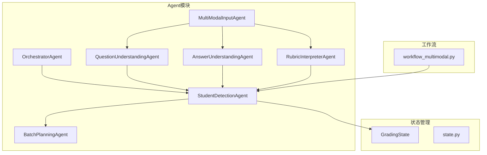
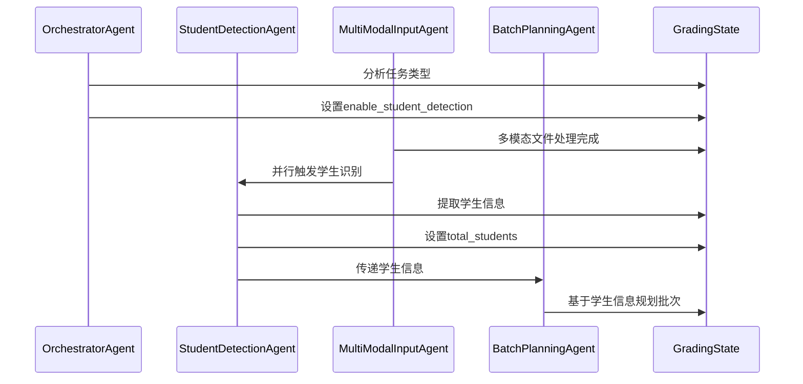
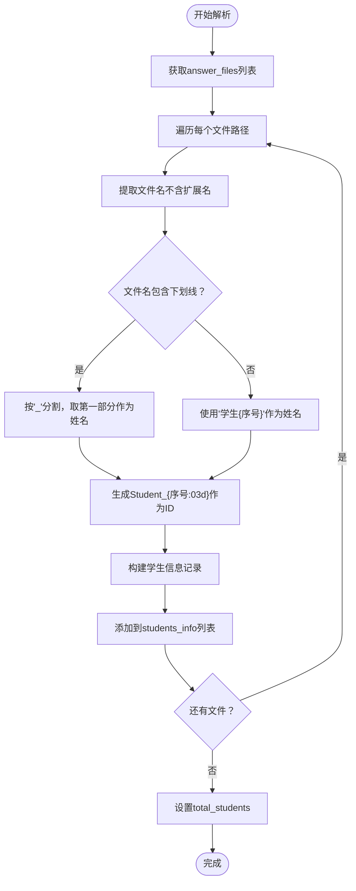
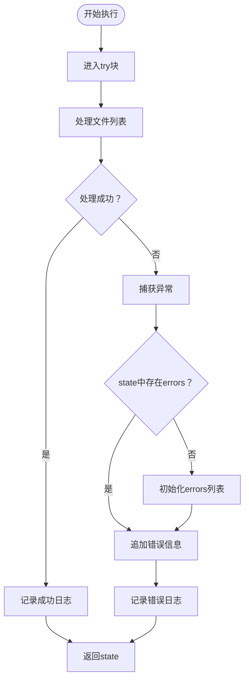
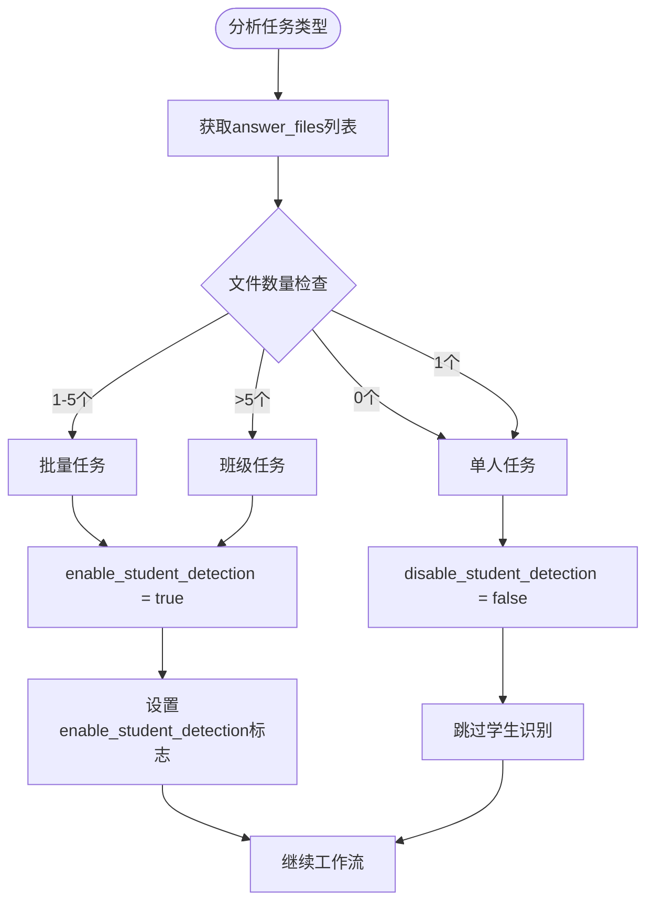
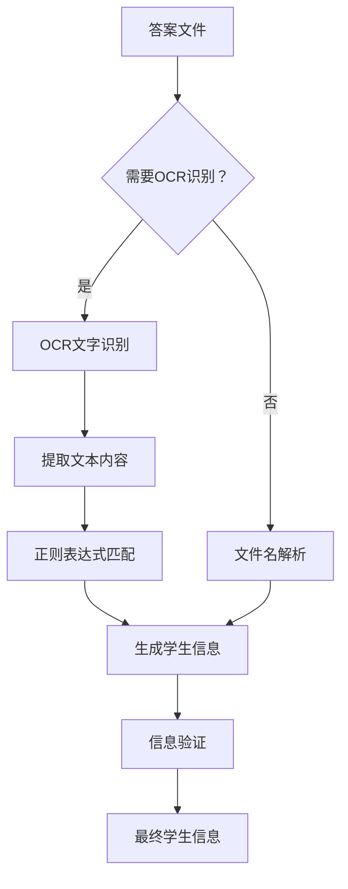
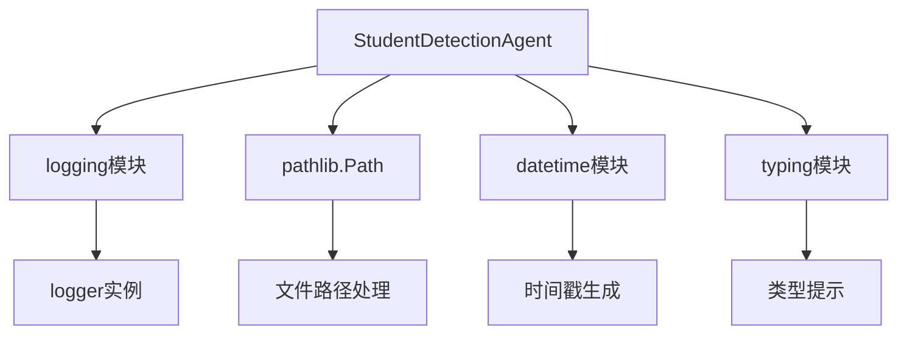
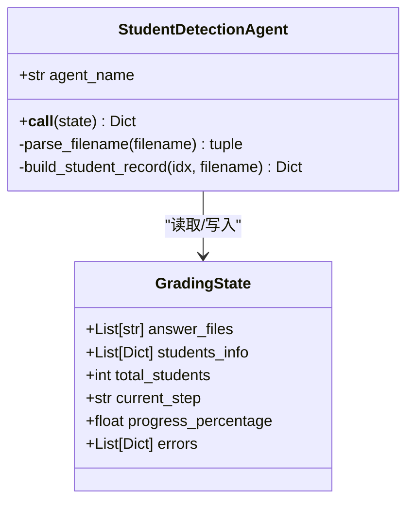
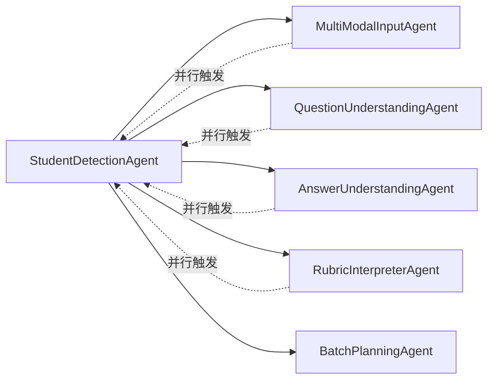

# StudentDetectionAgent - 学生信息识别

<cite>
**本文档引用的文件**
- [student_detection_agent.py](file://ai_correction/functions/langgraph/agents/student_detection_agent.py)
- [state.py](file://ai_correction/functions/langgraph/state.py)
- [workflow_multimodal.py](file://ai_correction/functions/langgraph/workflow_multimodal.py)
- [orchestrator_agent.py](file://ai_correction/functions/langgraph/agents/orchestrator_agent.py)
- [student_matcher.py](file://ai_correction/functions/database/student_matcher.py)
- [001_张三_answers.txt](file://ai_correction/test_data/001_张三_answers.txt)
- [test_agents.py](file://ai_correction/tests/test_agents.py)
</cite>

## 目录
1. [简介](#简介)
2. [项目结构](#项目结构)
3. [核心组件](#核心组件)
4. [架构概览](#架构概览)
5. [详细组件分析](#详细组件分析)
6. [依赖关系分析](#依赖关系分析)
7. [性能考虑](#性能考虑)
8. [故障排除指南](#故障排除指南)
9. [结论](#结论)

## 简介

StudentDetectionAgent是AI批改系统中的关键组件，负责从上传的答案文件中识别和提取学生信息。该Agent采用简化的文件名解析策略，能够从类似`001_张三_answers.txt`的文件名中提取学生ID和姓名，并构建标准化的学生信息结构。

该Agent的设计体现了系统对不同任务类型的智能识别能力，能够根据上传文件的数量和格式自动决定是否启用学生信息识别功能。它作为多模态批改工作流中的重要环节，为后续的批改和分析提供基础的学生信息支撑。

## 项目结构

StudentDetectionAgent位于AI批改系统的Agent模块中，与其他核心组件协同工作：

**图表来源**
- [student_detection_agent.py](file://ai_correction/functions/langgraph/agents/student_detection_agent.py#L1-L67)
- [workflow_multimodal.py](file://ai_correction/functions/langgraph/workflow_multimodal.py#L70-L110)

**章节来源**
- [student_detection_agent.py](file://ai_correction/functions/langgraph/agents/student_detection_agent.py#L1-L67)
- [workflow_multimodal.py](file://ai_correction/functions/langgraph/workflow_multimodal.py#L70-L110)

## 核心组件

### StudentDetectionAgent类

StudentDetectionAgent是一个异步执行的Agent类，主要负责从文件名中提取学生信息。其核心特性包括：

- **文件名解析**：基于约定的文件命名格式提取学生信息
- **异常处理**：完善的错误捕获和日志记录机制
- **状态管理**：与GradingState进行数据交互
- **置信度评估**：提供0.8的默认检测置信度

### 关键方法

#### `__init__()`
初始化Agent实例，设置代理名称为"StudentDetectionAgent"。

#### `__call__(state)`
执行学生信息识别的核心方法，接收GradingState作为输入，返回更新后的状态。

**章节来源**
- [student_detection_agent.py](file://ai_correction/functions/langgraph/agents/student_detection_agent.py#L17-L67)

## 架构概览

StudentDetectionAgent在多模态批改工作流中扮演着重要的前置角色：

**图表来源**
- [workflow_multimodal.py](file://ai_correction/functions/langgraph/workflow_multimodal.py#L85-L105)
- [orchestrator_agent.py](file://ai_correction/functions/langgraph/agents/orchestrator_agent.py#L50-L60)

## 详细组件分析

### 文件名解析机制

StudentDetectionAgent采用基于文件名的简化解析策略，具体实现如下：

#### 解析逻辑流程

**图表来源**
- [student_detection_agent.py](file://ai_correction/functions/langgraph/agents/student_detection_agent.py#L30-L45)

#### 学生信息结构

每个学生信息记录包含以下字段：

| 字段名 | 类型 | 描述 | 示例值 |
|--------|------|------|--------|
| student_id | string | 学生唯一标识符 | "Student_001" |
| name | string | 学生姓名 | "张三" |
| class_name | null | 班级信息（暂未实现） | null |
| answer_files | list[string] | 对应的答案文件路径列表 | ["path/to/file.txt"] |
| detection_confidence | float | 检测置信度 | 0.8 |
| detection_method | string | 检测方法 | "filename" |

**章节来源**
- [student_detection_agent.py](file://ai_correction/functions/langgraph/agents/student_detection_agent.py#L35-L45)

### 异常处理机制

StudentDetectionAgent实现了完善的异常处理策略：

**图表来源**
- [student_detection_agent.py](file://ai_correction/functions/langgraph/agents/student_detection_agent.py#L48-L67)

#### 错误信息结构

当发生异常时，错误信息会被记录在state的errors字段中：

| 字段名 | 类型 | 描述 |
|--------|------|------|
| agent | string | 出错的Agent名称 |
| error | string | 错误描述信息 |
| timestamp | string | 错误发生时间 |

**章节来源**
- [student_detection_agent.py](file://ai_correction/functions/langgraph/agents/student_detection_agent.py#L55-L67)

### 与工作流的集成

#### 任务类型识别

OrchestratorAgent根据上传文件数量自动决定是否启用学生识别：

**图表来源**
- [orchestrator_agent.py](file://ai_correction/functions/langgraph/agents/orchestrator_agent.py#L80-L95)

#### 数据传递模式

StudentDetectionAgent通过以下方式与后续Agent共享数据：

1. **students_info**：学生信息列表，供批次规划使用
2. **total_students**：学生总数，用于进度计算
3. **detection_confidence**：检测置信度，影响后续处理策略

**章节来源**
- [student_detection_agent.py](file://ai_correction/functions/langgraph/agents/student_detection_agent.py#L46-L47)
- [orchestrator_agent.py](file://ai_correction/functions/langgraph/agents/orchestrator_agent.py#L50-L60)

### 局限性分析

当前基于文件名的实现方式存在以下局限性：

#### 1. 文件命名规范依赖
- 必须遵循特定的命名格式（如`学号_姓名_answers.txt`）
- 不支持自定义命名格式
- 对文件扩展名敏感

#### 2. 信息提取有限
- 仅能提取学号和姓名
- 无法识别班级信息
- 无法处理复杂命名场景

#### 3. 错误处理脆弱
- 文件名格式错误可能导致解析失败
- 缺乏重试机制
- 无法处理编码问题

**章节来源**
- [student_detection_agent.py](file://ai_correction/functions/langgraph/agents/student_detection_agent.py#L35-L45)

### 扩展路径

#### OCR识别扩展
未来可以集成OCR技术，直接从答案文件内容中提取学生信息：

#### NLP自然语言处理
集成NLP技术实现更智能的信息提取：

- **实体识别**：自动识别学号、姓名等实体
- **语义理解**：理解复杂的命名模式
- **模糊匹配**：处理拼写错误和变体

#### 多模态融合
结合视觉和文本分析：

- **布局分析**：识别答题卡上的学生信息区域
- **手写识别**：处理手写答案中的个人信息
- **多语言支持**：支持不同语言的学生信息格式

**章节来源**
- [student_detection_agent.py](file://ai_correction/functions/langgraph/agents/student_detection_agent.py#L1-L10)

## 依赖关系分析

### 外部依赖

StudentDetectionAgent依赖以下外部模块：

**图表来源**
- [student_detection_agent.py](file://ai_correction/functions/langgraph/agents/student_detection_agent.py#L8-L16)

### 内部依赖

#### 与状态系统的交互

StudentDetectionAgent与GradingState紧密集成：

**图表来源**
- [state.py](file://ai_correction/functions/langgraph/state.py#L40-L80)
- [student_detection_agent.py](file://ai_correction/functions/langgraph/agents/student_detection_agent.py#L17-L25)

#### 与其他Agent的协作

**图表来源**
- [workflow_multimodal.py](file://ai_correction/functions/langgraph/workflow_multimodal.py#L85-L105)

**章节来源**
- [student_detection_agent.py](file://ai_correction/functions/langgraph/agents/student_detection_agent.py#L8-L16)
- [state.py](file://ai_correction/functions/langgraph/state.py#L40-L80)

## 性能考虑

### 时间复杂度分析

StudentDetectionAgent的时间复杂度主要取决于文件数量：

- **最坏情况**：O(n)，其中n为answer_files列表长度
- **空间复杂度**：O(n)，存储学生信息列表

### 优化策略

1. **并行处理**：利用LangGraph的并行特性同时处理多个文件
2. **缓存机制**：对于重复文件名的解析结果进行缓存
3. **早期退出**：遇到明显无效的文件名格式时快速跳过

### 内存使用

- 每个学生信息记录占用约100-200字节
- 对于1000个学生的任务，最多使用100KB内存
- 异常情况下会增加错误信息的内存开销

## 故障排除指南

### 常见问题及解决方案

#### 1. 文件名格式不正确

**问题症状**：学生信息提取为空或错误
**解决方案**：
- 检查文件名是否包含下划线
- 确保学号在文件名开头
- 验证文件扩展名正确

#### 2. 异常处理失败

**问题症状**：程序崩溃而非正常记录错误
**解决方案**：
- 检查文件权限和路径有效性
- 验证文件内容可读性
- 查看日志中的详细错误信息

#### 3. 数据传递失败

**问题症状**：后续Agent无法获取学生信息
**解决方案**：
- 验证GradingState的字段名称
- 检查工作流连接配置
- 确认状态序列化正确性

**章节来源**
- [student_detection_agent.py](file://ai_correction/functions/langgraph/agents/student_detection_agent.py#L55-L67)

### 调试技巧

1. **启用详细日志**：设置日志级别为DEBUG查看详细执行过程
2. **状态检查**：定期打印state的关键字段值
3. **单元测试**：编写针对特定文件名格式的测试用例

## 结论

StudentDetectionAgent作为AI批改系统的重要组成部分，展现了系统设计的实用性和可扩展性。其基于文件名的简化实现方式在当前阶段提供了可靠的学生信息识别能力，同时为未来的功能扩展预留了充分的空间。

### 主要优势

1. **简单可靠**：基于约定的文件命名格式，实现简单且稳定
2. **性能优异**：O(n)时间复杂度，适合大规模批处理
3. **异常安全**：完善的错误处理机制确保系统稳定性
4. **易于集成**：与现有工作流无缝对接

### 发展方向

随着系统需求的增长，StudentDetectionAgent可以通过以下方式进行演进：

1. **OCR集成**：实现从答案文件内容中直接提取学生信息
2. **NLP增强**：利用自然语言处理技术提高识别准确性
3. **多模态融合**：结合视觉和文本分析提供更全面的信息提取
4. **机器学习**：训练专门的模型处理各种命名格式

这种渐进式的功能扩展策略既保证了系统的稳定性，又为未来的创新奠定了基础。StudentDetectionAgent的设计体现了AI批改系统在实用性与前瞻性之间的平衡，为教育技术的发展提供了有价值的参考。