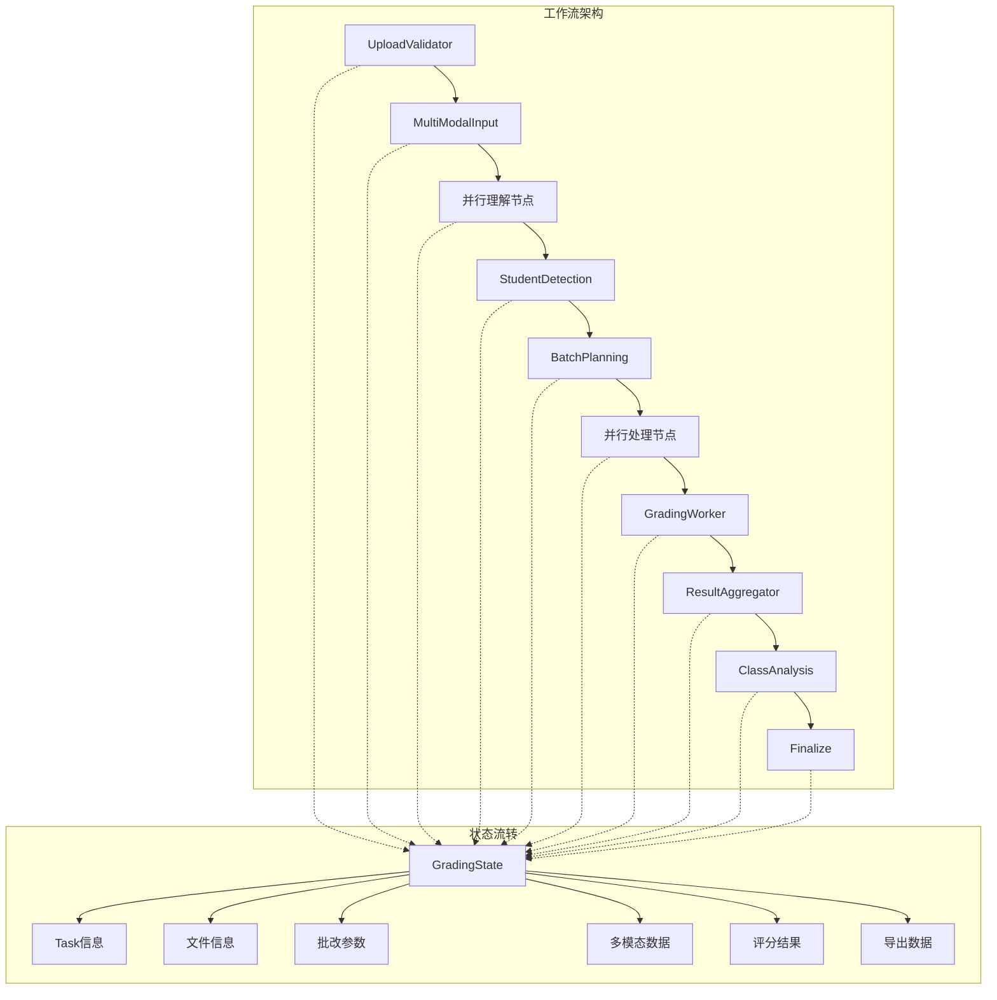
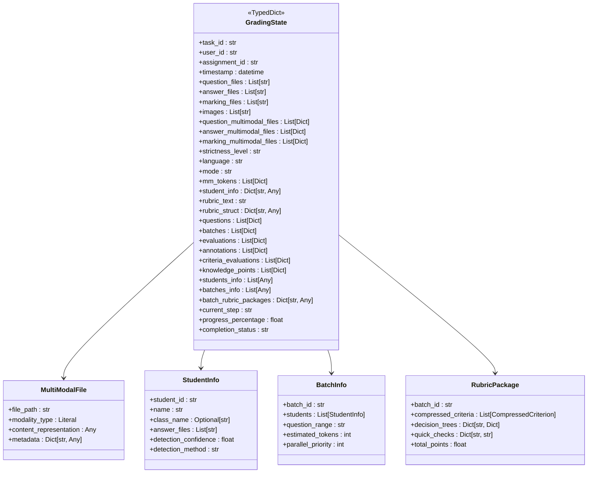

# GradingState状态模型定义

<cite>
**本文档引用的文件**
- [state.py](file://ai_correction/functions/langgraph/state.py)
- [multimodal_models.py](file://ai_correction/functions/langgraph/multimodal_models.py)
- [workflow.py](file://ai_correction/functions/langgraph/workflow.py)
- [workflow_multimodal.py](file://ai_correction/functions/langgraph/workflow_multimodal.py)
- [workflow_new.py](file://ai_correction/functions/langgraph/workflow_new.py)
- [routing.py](file://ai_correction/functions/langgraph/routing.py)
- [aggregate_results.py](file://ai_correction/functions/langgraph/agents/aggregate_results.py)
- [annotation_builder.py](file://ai_correction/functions/langgraph/agents/annotation_builder.py)
- [ingest_input.py](file://ai_correction/functions/langgraph/agents/ingest_input.py)
- [push_to_class_system.py](file://ai_correction/functions/langgraph/agents/push_to_class_system.py)
</cite>

## 目录
1. [概述](#概述)
2. [核心设计理念](#核心设计理念)
3. [状态模型架构](#状态模型架构)
4. [字段分类详解](#字段分类详解)
5. [设计原则与规范](#设计原则与规范)
6. [使用示例与最佳实践](#使用示例与最佳实践)
7. [废弃字段迁移策略](#废弃字段迁移策略)
8. [性能优化考虑](#性能优化考虑)
9. [总结](#总结)

## 概述

GradingState是LangGraph AI批改系统的核心状态模型，作为整个批改工作流的单一数据源，贯穿11个Agent节点的数据传递。该TypedDict定义了完整的批改生命周期所需的所有数据字段，支持高效的批次并行处理、多模态token坐标处理、双模式批改（高效/专业）等功能。

### 核心功能特性

- **批次并行处理**：通过`batches`和`evaluations`字段支持大规模并行批改
- **多模态token坐标**：利用`mm_tokens`实现精确的图像定位和内容关联
- **学生信息识别**：通过`student_info`字段支持个性化批改
- **双模式批改**：支持`efficient`（高效）和`professional`（专业）两种批改模式
- **坐标标注**：通过`annotations`字段实现精确的错误定位
- **知识点挖掘**：通过`knowledge_points`字段支持智能学习分析

## 核心设计理念

### 单一数据源原则

GradingState遵循"单一数据源"设计原则，所有Agent节点都基于同一个状态对象进行操作，确保数据一致性和流程可控性。



**图表来源**
- [workflow_multimodal.py](file://ai_correction/functions/langgraph/workflow_multimodal.py#L50-L120)
- [state.py](file://ai_correction/functions/langgraph/state.py#L44-L163)

### 类型安全与向后兼容

状态模型采用Python TypedDict实现类型安全，同时通过合理的默认值设置和字段初始化策略确保向后兼容性。

## 状态模型架构

### 整体结构概览



**图表来源**
- [state.py](file://ai_correction/functions/langgraph/state.py#L44-L163)
- [multimodal_models.py](file://ai_correction/functions/langgraph/multimodal_models.py#L15-L100)

**节来源**
- [state.py](file://ai_correction/functions/langgraph/state.py#L44-L163)

## 字段分类详解

### 基础任务信息

| 字段名 | 数据类型 | 业务含义 | 使用场景 |
|--------|----------|----------|----------|
| `task_id` | `str` | 任务唯一标识符 | 工作流跟踪、日志记录、状态持久化 |
| `user_id` | `str` | 用户唯一标识 | 权限控制、审计追踪、个性化服务 |
| `assignment_id` | `str` | 作业标识 | 作业管理、成绩统计、数据分析 |
| `timestamp` | `datetime` | 时间戳 | 任务调度、超时控制、历史记录 |

### 文件信息

| 字段名 | 数据类型 | 业务含义 | 使用场景 |
|--------|----------|----------|----------|
| `question_files` | `List[str]` | 题目文件路径列表 | 题目解析、内容提取、格式验证 |
| `answer_files` | `List[str]` | 学生答案文件路径列表 | 答案处理、批改执行、结果生成 |
| `marking_files` | `List[str]` | 评分标准文件路径列表 | 标准解析、评分规则生成、质量控制 |
| `images` | `List[str]` | 作业图片完整路径列表 | 图像处理、OCR执行、可视化生成 |

### 多模态文件信息（新增）

| 字段名 | 数据类型 | 业务含义 | 使用场景 |
|--------|----------|----------|----------|
| `question_multimodal_files` | `List[Dict[str, Any]]` | 多模态题目文件信息 | 题目理解、内容分析、智能解析 |
| `answer_multimodal_files` | `List[Dict[str, Any]]` | 多模态答案文件信息 | 答案理解、语义分析、评分依据 |
| `marking_multimodal_files` | `List[Dict[str, Any]]` | 多模态评分标准文件 | 标准理解、规则提取、评分指导 |

### 批改参数

| 字段名 | 数据类型 | 业务含义 | 使用场景 |
|--------|----------|----------|----------|
| `strictness_level` | `str` | 严格程度：宽松/中等/严格 | 评分标准调整、质量控制、个性化设置 |
| `language` | `str` | 语言：zh/en | 提示词选择、模型调用、本地化支持 |
| `mode` | `str` | 批改模式：efficient/professional | 功能开关、性能优化、用户体验 |

### 多模态提取结果（核心）

| 字段名 | 数据类型 | 业务含义 | 使用场景 |
|--------|----------|----------|----------|
| `mm_tokens` | `List[Dict[str, Any]]` | 多模态模型返回的带坐标token列表 | 精确定位、内容关联、错误标注 |
| `student_info` | `Dict[str, Any]` | 学生信息（姓名、学号、班级） | 个性化批改、成绩管理、学习分析 |

### 评分标准解析

| 字段名 | 数据类型 | 业务含义 | 使用场景 |
|--------|----------|----------|----------|
| `rubric_text` | `str` | 原始评分标准文本 | 标准解析、规则提取、质量评估 |
| `rubric_struct` | `Dict[str, Any]` | 结构化评分规则（JSON格式） | 评分执行、规则验证、动态调整 |

### 理解结果（新增）

| 字段名 | 数据类型 | 业务含义 | 使用场景 |
|--------|----------|----------|----------|
| `question_understanding` | `Optional[Dict[str, Any]]` | 题目理解结果 | 题目分析、难度评估、个性化指导 |
| `answer_understanding` | `Optional[Dict[str, Any]]` | 答案理解结果 | 答案分析、评分依据、错误诊断 |
| `rubric_understanding` | `Optional[Dict[str, Any]]` | 评分标准理解结果 | 标准解读、评分一致性、质量保证 |

### 题目识别与批次规划

| 字段名 | 数据类型 | 业务含义 | 使用场景 |
|--------|----------|----------|----------|
| `questions` | `List[Dict[str, Any]]` | 题目信息列表（含题号、分值、区域、tokens） | 题目管理、评分分配、结果汇总 |
| `batches` | `List[Dict[str, Any]]` | 批次划分方案 | 并行处理、负载均衡、性能优化 |

### AI评分结果

| 字段名 | 数据类型 | 业务含义 | 使用场景 |
|--------|----------|----------|----------|
| `evaluations` | `List[Dict[str, Any]]` | 各题评分结果列表 | 成绩计算、结果汇总、质量评估 |
| `criteria_evaluations` | `List[Dict[str, Any]]` | 基于评分标准的评估结果列表 | 详细评分、错误分析、改进建议 |

### 坐标标注（核心功能）

| 字段名 | 数据类型 | 业务含义 | 使用场景 |
|--------|----------|----------|----------|
| `annotations` | `List[Dict[str, Any]]` | 标注坐标列表（含页码、bbox、提示） | 错误定位、可视化展示、教学指导 |
| `coordinate_annotations` | `List[Dict]` | 坐标标注数据（保留兼容性） | 向后兼容、功能迁移 |
| `error_regions` | `List[Dict]` | 错误区域坐标（保留兼容性） | 错误分析、问题定位 |
| `cropped_regions` | `List[Dict]` | 裁剪区域数据（保留兼容性） | 局部分析、细节展示 |

### 知识点挖掘（核心功能）

| 字段名 | 数据类型 | 业务含义 | 使用场景 |
|--------|----------|----------|----------|
| `knowledge_points` | `List[Dict]` | 知识点分析 | 学习路径规划、薄弱环节识别 |
| `error_analysis` | `Dict[str, Any]` | 错题分析 | 错误统计、教学改进 |
| `learning_suggestions` | `List[str]` | 学习建议 | 个性化指导、学习计划 |
| `difficulty_assessment` | `Dict[str, Any]` | 难度评估 | 题目难度分析、教学策略 |

### 深度协作新增字段

| 字段名 | 数据类型 | 业务含义 | 使用场景 |
|--------|----------|----------|----------|
| `students_info` | `List[Any]` | 学生信息列表（StudentInfo[]） | 批量处理、个性化服务 |
| `batches_info` | `List[Any]` | 批次规划信息（BatchInfo[]） | 并行优化、资源分配 |
| `batch_rubric_packages` | `Dict[str, Any]` | 批次专属评分包 | 评分标准化、质量控制 |
| `question_context_packages` | `Dict[str, Any]` | 批次专属题目上下文 | 上下文感知、智能批改 |
| `grading_results` | `List[Dict[str, Any]]` | 所有批改结果 | 结果汇总、数据分析 |
| `student_reports` | `List[Dict[str, Any]]` | 学生报告 | 个性化反馈、学习跟踪 |
| `class_analysis` | `Dict[str, Any]` | 班级分析报告 | 整体评估、教学改进 |

### 处理状态

| 字段名 | 数据类型 | 业务含义 | 使用场景 |
|--------|----------|----------|----------|
| `current_step` | `str` | 当前步骤 | 进度跟踪、错误定位 |
| `progress_percentage` | `float` | 进度百分比（0-100） | 用户界面、性能监控 |
| `completion_status` | `str` | 完成状态：in_progress/completed/failed | 流程控制、异常处理 |
| `completed_at` | `str` | 完成时间 | 性能分析、历史记录 |

### 错误和步骤记录

| 字段名 | 数据类型 | 业务含义 | 使用场景 |
|--------|----------|----------|----------|
| `errors` | `List[Dict[str, Any]]` | 错误记录 | 调试分析、故障排除 |
| `step_results` | `Dict[str, Any]` | 步骤结果 | 性能监控、过程分析 |

### 最终结果

| 字段名 | 数据类型 | 业务含义 | 使用场景 |
|--------|----------|----------|----------|
| `final_score` | `float` | 最终得分 | 成绩计算、排名统计 |
| `grade_level` | `str` | 等级评定（A/B/C/D/F） | 成绩分级、评估报告 |
| `warnings` | `List[str]` | 警告信息 | 质量提醒、异常提示 |

### 元数据

| 字段名 | 数据类型 | 业务含义 | 使用场景 |
|--------|----------|----------|----------|
| `processing_time` | `float` | 处理时间（秒） | 性能优化、资源规划 |
| `model_versions` | `Dict[str, str]` | 使用的模型版本 | 版本控制、质量追溯 |
| `quality_metrics` | `Dict[str, float]` | 质量指标 | 质量评估、持续改进 |

**节来源**
- [state.py](file://ai_correction/functions/langgraph/state.py#L44-L163)

## 设计原则与规范

### 字段命名规范

1. **语义明确**：字段名称必须准确反映其业务含义
2. **驼峰命名**：采用camelCase命名法，如`studentInfo`、`questionFiles`
3. **避免歧义**：使用具体而非抽象的名称，如`coordinateAnnotations`而非`annotations`
4. **一致性原则**：相似功能的字段使用相同的命名模式

### 类型安全性

1. **TypedDict使用**：所有状态字段都使用TypedDict定义，确保类型安全
2. **可选字段标记**：使用`Optional`标记可选字段，如`questionUnderstanding`
3. **枚举类型**：对有限取值的字段使用Literal类型，如`mode: Literal['efficient', 'professional']`
4. **集合类型**：使用泛型类型注解，如`List[Dict[str, Any]]`

### 向后兼容性处理

1. **废弃字段标记**：已废弃的字段使用`[DEPRECATED]`标记
2. **兼容性字段**：保留兼容性字段但标记为已废弃
3. **迁移策略**：提供明确的迁移指南和替代方案
4. **渐进式淘汰**：逐步移除废弃字段，给予充分的迁移时间

### 数据完整性

1. **必填字段**：明确标识必填字段，如`task_id`、`user_id`
2. **默认值设置**：为可选字段提供合理的默认值
3. **验证机制**：在Agent中添加必要的数据验证
4. **错误处理**：完善的错误处理和恢复机制

## 使用示例与最佳实践

### 初始化状态对象

```python
# 基础状态初始化
initial_state = {
    # 基础任务信息
    'task_id': 'task_20241201_001',
    'user_id': 'user_12345',
    'assignment_id': 'hw_math_20241201',
    'timestamp': datetime.now(),
    
    # 配置参数
    'mode': 'professional',
    'strictness_level': '中等',
    'language': 'zh',
    
    # 文件信息
    'question_files': ['/path/to/question.pdf'],
    'answer_files': ['/path/to/student_answer.jpg'],
    'marking_files': ['/path/to/rubric.txt'],
    
    # 处理状态
    'current_step': '初始化',
    'progress_percentage': 0.0,
    'completion_status': 'in_progress'
}

# 深度协作相关字段初始化
initial_state.update({
    'students_info': [],
    'batches_info': [],
    'batch_rubric_packages': {},
    'question_context_packages': {},
    'grading_results': [],
    'student_reports': [],
    'class_analysis': {}
})
```

### 访问状态字段

```python
# 安全访问状态字段
def process_grading_state(state: GradingState) -> None:
    # 基础信息访问
    task_id = state.get('task_id', 'unknown')
    user_id = state.get('user_id', 'anonymous')
    
    # 文件信息处理
    question_count = len(state.get('question_files', []))
    answer_count = len(state.get('answer_files', []))
    
    # 批改参数检查
    mode = state.get('mode', 'professional')
    strictness = state.get('strictness_level', '中等')
    
    # 评分结果处理
    evaluations = state.get('evaluations', [])
    total_score = sum(eval_item.get('score', 0) for eval_item in evaluations)
    
    # 多模态数据处理
    mm_tokens = state.get('mm_tokens', [])
    student_info = state.get('student_info', {})
    
    # 状态更新
    state['progress_percentage'] = 50.0
    state['current_step'] = '评分中'
```

### 状态更新模式

```python
# 在Agent中更新状态的最佳实践
async def update_state_with_error_handling(
    state: GradingState, 
    new_data: Dict[str, Any]
) -> GradingState:
    """带错误处理的状态更新"""
    try:
        # 验证新数据
        if not isinstance(new_data, dict):
            raise ValueError("新数据必须是字典")
        
        # 更新状态
        state.update(new_data)
        
        # 更新进度
        state['progress_percentage'] = calculate_progress(state)
        state['current_step'] = get_current_step(state)
        
        return state
        
    except Exception as e:
        # 记录错误
        error_info = {
            'step': '状态更新',
            'error': str(e),
            'timestamp': str(datetime.now()),
            'affected_fields': list(new_data.keys())
        }
        state['errors'].append(error_info)
        
        return state
```

### 状态序列化与持久化

```python
# 状态序列化示例
def serialize_grading_state(state: GradingState) -> Dict[str, Any]:
    """序列化GradingState以便持久化"""
    serialized = {}
    
    for key, value in state.items():
        if key in ['timestamp', 'completed_at']:
            # 时间戳转换为字符串
            serialized[key] = str(value) if value else None
        elif key in ['mm_tokens', 'annotations', 'evaluations']:
            # 复杂对象转换为JSON可序列化格式
            serialized[key] = [
                {k: str(v) if isinstance(v, datetime) else v 
                 for k, v in item.items()}
                for item in value
            ]
        else:
            serialized[key] = value
    
    return serialized

# 状态反序列化示例
def deserialize_grading_state(data: Dict[str, Any]) -> GradingState:
    """从序列化数据重建GradingState"""
    deserialized = {}
    
    for key, value in data.items():
        if key in ['timestamp', 'completed_at'] and value:
            deserialized[key] = datetime.fromisoformat(value)
        elif key in ['mm_tokens', 'annotations', 'evaluations'] and value:
            deserialized[key] = [
                {k: datetime.fromisoformat(v) if k in ['timestamp'] else v 
                 for k, v in item.items()}
                for item in value
            ]
        else:
            deserialized[key] = value
    
    return deserialized
```

**节来源**
- [workflow_multimodal.py](file://ai_correction/functions/langgraph/workflow_multimodal.py#L131-L216)
- [ingest_input.py](file://ai_correction/functions/langgraph/agents/ingest_input.py#L251-L289)

## 废弃字段迁移策略

### 已废弃字段概览

| 废弃字段 | 新替代字段 | 迁移策略 | 迁移时间线 |
|----------|------------|----------|------------|
| `ocr_results` | `question_multimodal_files` | 直接替换 | 立即生效 |
| `image_regions` | `answer_multimodal_files` | 直接替换 | 立即生效 |
| `preprocessed_images` | `marking_multimodal_files` | 直接替换 | 立即生效 |

### 迁移策略详解

#### 1. 多模态能力迁移

```python
# 旧版OCR结果转换为新版多模态格式
def migrate_ocr_to_multimodal(ocr_results: Dict) -> List[Dict]:
    """将OCR结果迁移到新的多模态格式"""
    multimodal_files = []
    
    for file_path, ocr_data in ocr_results.items():
        if ocr_data.get('success', False):
            multimodal_files.append({
                'file_path': file_path,
                'modality_type': 'text',
                'content_representation': ocr_data.get('text', ''),
                'metadata': {
                    'format': 'ocr',
                    'confidence': ocr_data.get('confidence', 0.8),
                    'word_count': len(ocr_data.get('words', []))
                }
            })
    
    return multimodal_files

# 使用示例
def migrate_state_ocr(state: GradingState) -> GradingState:
    """迁移状态中的OCR相关字段"""
    if 'ocr_results' in state:
        # 转换OCR结果
        state['question_multimodal_files'] = migrate_ocr_to_multimodal(
            state.pop('ocr_results', {})
        )
    
    if 'image_regions' in state:
        # 转换图像区域
        state['answer_multimodal_files'] = migrate_ocr_to_multimodal(
            state.pop('image_regions', {})
        )
    
    return state
```

#### 2. 向后兼容性保障

```python
# 兼容性包装器
class GradingStateCompatibility:
    """GradingState的兼容性包装器"""
    
    @staticmethod
    def get_ocr_results(state: GradingState) -> Dict:
        """获取OCR结果（向后兼容）"""
        if 'ocr_results' in state:
            return state['ocr_results']
        elif 'question_multimodal_files' in state:
            # 从多模态文件中提取OCR结果
            return GradingStateCompatibility._extract_ocr_from_multimodal(
                state['question_multimodal_files']
            )
        return {}
    
    @staticmethod
    def _extract_ocr_from_multimodal(multimodal_files: List[Dict]) -> Dict:
        """从多模态文件中提取OCR结果"""
        ocr_results = {}
        for file_info in multimodal_files:
            if file_info.get('modality_type') == 'text':
                file_path = file_info.get('file_path', '')
                content = file_info.get('content_representation', '')
                ocr_results[file_path] = {
                    'success': True,
                    'text': content,
                    'confidence': 0.9,
                    'words': [{'text': word, 'confidence': 0.9} 
                             for word in content.split()]
                }
        return ocr_results
```

#### 3. 渐进式迁移策略

```python
# 迁移监控和验证
class MigrationMonitor:
    """迁移过程监控"""
    
    def __init__(self):
        self.migration_stats = {
            'total_tasks': 0,
            'successful_migrations': 0,
            'failed_migrations': 0,
            'migration_errors': []
        }
    
    def monitor_migration(self, old_state: Dict, new_state: GradingState):
        """监控迁移过程"""
        self.migration_stats['total_tasks'] += 1
        
        try:
            # 验证数据完整性
            self._validate_migration(old_state, new_state)
            self.migration_stats['successful_migrations'] += 1
        except Exception as e:
            self.migration_stats['failed_migrations'] += 1
            self.migration_stats['migration_errors'].append(str(e))
    
    def _validate_migration(self, old_state: Dict, new_state: GradingState):
        """验证迁移结果"""
        # 验证关键字段一致性
        assert new_state.get('task_id') == old_state.get('task_id')
        assert new_state.get('user_id') == old_state.get('user_id')
        
        # 验证数据完整性
        assert len(new_state.get('question_multimodal_files', [])) > 0
        assert len(new_state.get('answer_multimodal_files', [])) > 0
```

**节来源**
- [state.py](file://ai_correction/functions/langgraph/state.py#L85-L87)
- [workflow_multimodal.py](file://ai_correction/functions/langgraph/workflow_multimodal.py#L159-L187)

## 性能优化考虑

### 内存优化策略

1. **字段懒加载**：对于大型数据结构（如`mm_tokens`），采用懒加载策略
2. **数据压缩**：对大量文本数据进行压缩存储
3. **缓存机制**：合理使用缓存减少重复计算

### 并发处理优化

```python
# 并发状态更新优化
class ConcurrentStateProcessor:
    """并发状态处理器"""
    
    def __init__(self):
        self.lock = asyncio.Lock()
    
    async def update_state_concurrently(
        self, 
        state: GradingState,
        updates: Dict[str, Any]
    ) -> GradingState:
        """并发安全的状态更新"""
        async with self.lock:
            try:
                # 批量更新
                for key, value in updates.items():
                    if key in state:
                        state[key] = value
                
                # 更新进度
                state['progress_percentage'] = self._calculate_concurrent_progress(state)
                
                return state
                
            except Exception as e:
                await self._handle_concurrent_error(state, e)
                return state
    
    def _calculate_concurrent_progress(self, state: GradingState) -> float:
        """并发环境下的进度计算"""
        # 基于已完成的Agent数量计算进度
        completed_agents = len([
            agent for agent, status in state.get('agent_statuses', {}).items()
            if status == 'completed'
        ])
        total_agents = len(state.get('agent_statuses', {}))
        
        return (completed_agents / total_agents) * 100 if total_agents > 0 else 0
```

### Token优化策略

```python
# Token使用优化
class TokenOptimizer:
    """Token使用优化器"""
    
    def optimize_state_for_scoring(self, state: GradingState) -> GradingState:
        """优化状态以减少Token使用"""
        optimized_state = state.copy()
        
        # 只保留评分必需的字段
        essential_fields = [
            'task_id', 'user_id', 'mode', 'strictness_level', 'language',
            'question_files', 'answer_files', 'marking_files',
            'mm_tokens', 'rubric_struct', 'questions'
        ]
        
        # 压缩OCR结果 - 只保留前1000字符
        if 'mm_tokens' in optimized_state:
            for token in optimized_state['mm_tokens']:
                if isinstance(token.get('text'), str) and len(token['text']) > 1000:
                    token['text'] = token['text'][:1000] + "...[截断]"
        
        return optimized_state
```

## 总结

GradingState状态模型作为LangGraph AI批改系统的核心数据结构，体现了现代软件架构设计的最佳实践：

### 核心优势

1. **统一数据源**：作为整个工作流的单一数据源，确保数据一致性和流程可控性
2. **类型安全**：基于TypedDict的类型定义，提供编译时和运行时的类型检查
3. **模块化设计**：清晰的功能分区，便于维护和扩展
4. **向后兼容**：完善的废弃字段迁移策略，保障系统平滑升级
5. **性能优化**：针对大规模批改场景的专门优化

### 设计亮点

- **多模态支持**：原生支持文本、图像、PDF等多种模态的数据处理
- **深度协作**：专为多人协作场景设计的字段结构
- **智能分析**：内置的知识点挖掘和学习分析功能
- **灵活模式**：支持高效和专业的双模式批改

### 应用价值

GradingState不仅是一个技术实现，更是教育智能化转型的重要基础设施。它支撑着从基础批改到智能分析的完整功能链，为教育数字化提供了坚实的技术底座。

通过合理使用GradingState状态模型，开发者可以构建出既高效又智能的AI批改系统，真正实现"让技术服务于教育"的愿景。