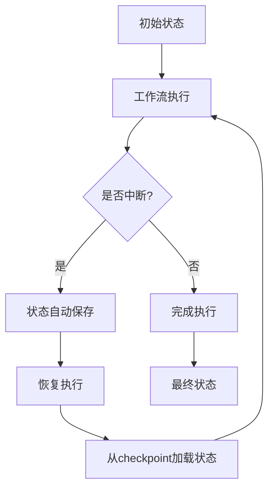
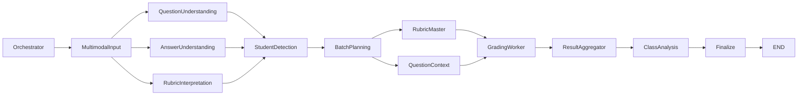

# 状态生命周期管理

<cite>
**本文档引用的文件**   
- [state.py](file://ai_correction/functions/langgraph/state.py)
- [workflow_multimodal.py](file://ai_correction/functions/langgraph/workflow_multimodal.py)
- [checkpointer.py](file://ai_correction/functions/langgraph/checkpointer.py)
- [student_detection_agent.py](file://ai_correction/functions/langgraph/agents/student_detection_agent.py)
- [batch_planning_agent.py](file://ai_correction/functions/langgraph/agents/batch_planning_agent.py)
</cite>

## 目录
1. [GradingState状态对象概述](#gradingstate状态对象概述)
2. [工作流初始化与默认值设置](#工作流初始化与默认值设置)
3. [深度协作字段的预初始化逻辑](#深度协作字段的预初始化逻辑)
4. [状态持久化机制](#状态持久化机制)
5. [状态在节点间的流转过程](#状态在节点间的流转过程)
6. [状态管理最佳实践](#状态管理最佳实践)
7. [状态生命周期中的常见陷阱](#状态生命周期中的常见陷阱)

## GradingState状态对象概述

`GradingState`是多模态批改工作流的核心状态对象，采用`TypedDict`类型定义，贯穿整个工作流的生命周期。该状态对象包含30多个字段，涵盖了从基础任务信息到复杂批改结果的完整数据结构。

状态对象的设计遵循Orchestrator-Worker模式，支持批次并行处理、多模态token坐标、双模式批改等核心功能。其字段组织具有清晰的逻辑分组，包括基础任务信息、文件信息、批改参数、多模态提取结果、评分标准解析、AI评分结果、专业模式扩展字段、导出与集成、深度协作相关字段、处理状态、错误和步骤记录、最终结果以及元数据等。

**Section sources**
- [state.py](file://ai_correction/functions/langgraph/state.py#L44-L75)

## 工作流初始化与默认值设置

工作流初始化时对`GradingState`对象的30多个字段进行系统性的默认值设置，确保状态对象的完整性和一致性。初始化过程在`MultiModalGradingWorkflow`类的`execute`方法中实现，通过检查并设置缺失字段来保证状态的健壮性。

初始化策略采用防御性编程原则，对所有关键字段进行存在性检查，并为缺失字段设置合理的默认值。例如，`errors`字段初始化为空列表，`step_results`和`warnings`同样初始化为空容器，而`question_multimodal_files`、`answer_multimodal_files`和`marking_multimodal_files`等多模态文件信息字段也被初始化为空列表。

这种初始化策略确保了即使在部分输入数据缺失的情况下，工作流也能正常启动和执行，提高了系统的容错能力。同时，通过在初始化阶段设置`current_step`为"初始化"，`progress_percentage`为0.0，`completion_status`为"in_progress"，为后续的进度跟踪和状态监控奠定了基础。

**Section sources**
- [workflow_multimodal.py](file://ai_correction/functions/langgraph/workflow_multimodal.py#L130-L161)

## 深度协作字段的预初始化逻辑

`execute`方法中对深度协作字段进行了专门的预初始化处理，这些字段是实现复杂批改逻辑的关键。预初始化的深度协作字段包括`students_info`、`batches_info`、`batch_rubric_packages`、`question_context_packages`、`grading_results`、`student_reports`和`class_analysis`等。

这些字段的预初始化逻辑体现了工作流的深度协作架构设计。`students_info`用于存储从答案文件中识别的学生信息，`batches_info`包含基于学生列表和题目信息规划的批次方案，而`batch_rubric_packages`和`question_context_packages`则作为批次专属的评分包和题目上下文，为并行批改提供必要的数据支持。

预初始化过程确保了这些复杂数据结构在工作流执行前就具备了正确的容器类型，避免了在后续Agent处理过程中因访问未初始化字段而导致的运行时错误。这种设计模式支持了工作流中多个Agent之间的数据共享和协作，是实现高效并行处理的基础。

**Section sources**
- [workflow_multimodal.py](file://ai_correction/functions/langgraph/workflow_multimodal.py#L159-L161)

## 状态持久化机制

`GradingState`对象通过LangGraph的`MemorySaver` checkpointer实现持久化，支持工作流中断后的恢复执行。持久化机制在`MultiModalGradingWorkflow`的初始化过程中配置，通过`MemorySaver()`实例作为checkpointer参数传递给工作流编译器。

**Diagram sources**
- [workflow_multimodal.py](file://ai_correction/functions/langgraph/workflow_multimodal.py#L52)
- [checkpointer.py](file://ai_correction/functions/langgraph/checkpointer.py#L38)

该机制允许工作流在长时间运行过程中安全地保存中间状态，当系统重启或网络中断后，可以通过任务ID重新加载之前的状态继续执行，而无需从头开始。这种能力对于处理大量学生作业的批改任务尤为重要，确保了系统的可靠性和用户体验。

**Section sources**
- [workflow_multimodal.py](file://ai_correction/functions/langgraph/workflow_multimodal.py#L52)
- [checkpointer.py](file://ai_correction/functions/langgraph/checkpointer.py#L38)

## 状态在节点间的流转过程

`GradingState`对象通过`_astream`调用在11个节点间进行流转，实现了渐进式填充的处理模式。工作流的执行流程定义了状态对象的流转路径：从`orchestrator`开始，经过`multimodal_input`，并行处理`question_understanding`、`answer_understanding`和`rubric_interpretation`，然后依次经过`student_detection`、`batch_planning`、`rubric_master`、`question_context`、`grading_worker`、`result_aggregator`和`class_analysis`，最终到达`finalize`节点。

**Diagram sources**
- [workflow_multimodal.py](file://ai_correction/functions/langgraph/workflow_multimodal.py#L74-L99)

每个节点在处理过程中都会更新状态对象的特定字段，实现数据的渐进式填充。例如，`student_detection`节点填充`students_info`字段，`batch_planning`节点填充`batches_info`字段，而`grading_worker`节点则负责填充`grading_results`等核心批改结果。这种设计模式确保了状态对象的演化过程与业务逻辑的执行步骤严格对应。

**Section sources**
- [workflow_multimodal.py](file://ai_correction/functions/langgraph/workflow_multimodal.py#L74-L99)

## 状态管理最佳实践

### 错误处理
`errors`字段是状态对象中关键的错误处理机制，采用列表结构存储执行过程中的所有错误记录。每个Agent在捕获异常时都会向该字段追加详细的错误信息，包括错误来源、错误描述和时间戳。这种集中式错误管理方式便于后续的错误分析和用户反馈。

### 进度跟踪
`progress_percentage`字段实现了精细化的进度跟踪，不同节点会根据其在工作流中的位置设置相应的进度值。例如，`student_detection`节点将进度设置为15.0，`batch_planning`节点设置为20.0，而`grading_worker`节点则设置为80.0。这种渐进式的进度更新为用户提供了准确的执行状态反馈。

### 性能优化
为避免状态对象过度膨胀，系统采用了多项优化策略。首先，通过合理的字段分组和命名规范保持状态结构的清晰性；其次，在非必要情况下避免存储大型二进制数据；最后，利用深度协作字段的预初始化减少运行时的动态分配开销。

**Section sources**
- [student_detection_agent.py](file://ai_correction/functions/langgraph/agents/student_detection_agent.py#L55-L57)
- [batch_planning_agent.py](file://ai_correction/functions/langgraph/agents/batch_planning_agent.py#L55-L57)
- [workflow_multimodal.py](file://ai_correction/functions/langgraph/workflow_multimodal.py#L130-L161)

## 状态生命周期中的常见陷阱

### 字段未初始化导致的KeyError
最常见的陷阱是访问未初始化的状态字段，这会导致`KeyError`异常。尽管系统在`execute`方法中进行了预初始化，但在某些异常路径或边界条件下仍可能出现字段缺失。最佳实践是在访问任何状态字段前进行存在性检查，或使用`dict.get()`方法提供默认值。

### 状态污染问题
状态污染是指在工作流执行过程中意外修改了不应被改变的状态字段。由于`GradingState`是贯穿整个工作流的共享对象，一个Agent的错误修改可能影响后续所有节点的执行。为避免此问题，应遵循最小权限原则，每个Agent只修改其职责范围内的字段，并在修改前进行必要的验证。

### 并发访问冲突
在并行处理场景下，多个Agent可能同时访问和修改状态对象，导致数据竞争和不一致。系统通过LangGraph的执行模型避免了真正的并发修改，但在逻辑上仍需注意字段的访问顺序和依赖关系，确保数据的一致性和完整性。

**Section sources**
- [workflow_multimodal.py](file://ai_correction/functions/langgraph/workflow_multimodal.py#L130-L161)
- [student_detection_agent.py](file://ai_correction/functions/langgraph/agents/student_detection_agent.py#L55-L57)