# 状态管理

<cite>
**本文档中引用的文件**
- [state.py](file://ai_correction/functions/langgraph/state.py)
- [workflow.py](file://ai_correction/functions/langgraph/workflow.py)
- [workflow_multimodal.py](file://ai_correction/functions/langgraph/workflow_multimodal.py)
- [checkpointer.py](file://ai_correction/functions/langgraph/checkpointer.py)
- [multimodal_models.py](file://ai_correction/functions/langgraph/multimodal_models.py)
- [batch_planning_agent.py](file://ai_correction/functions/langgraph/agents/batch_planning_agent.py)
- [rubric_master_agent.py](file://ai_correction/functions/langgraph/agents/rubric_master_agent.py)
- [grading_worker_agent.py](file://ai_correction/functions/langgraph/agents/grading_worker_agent.py)
- [workflow_new.py](file://ai_correction/functions/langgraph/workflow_new.py)
</cite>

## 目录
1. [概述](#概述)
2. [GradingState核心设计](#gradingstate核心设计)
3. [深度协作新增字段详解](#深度协作新增字段详解)
4. [状态持久化机制](#状态持久化机制)
5. [状态初始化策略](#状态初始化策略)
6. [状态流转与管理](#状态流转与管理)
7. [最佳实践与陷阱规避](#最佳实践与陷阱规避)
8. [性能优化策略](#性能优化策略)
9. [总结](#总结)

## 概述

GradingState作为LangGraph工作流的核心状态对象，是一个基于TypedDict的复杂数据结构，承载着整个AI批改系统超过50个字段的数据。它不仅作为11个节点间的数据交换中心，更是深度协作架构中学生信息管理、批次规划、上下文提供和结果收集的统一数据源。

该状态对象的设计体现了现代AI系统对数据一致性、可追踪性和可恢复性的严格要求，通过精心的字段组织和生命周期管理，实现了从文件上传到最终报告生成的完整工作流闭环。

## GradingState核心设计

### TypedDict架构设计

GradingState采用Python的TypedDict作为基础数据结构，提供了类型安全和IDE友好的开发体验。整个状态对象按照功能域进行清晰的层次化组织：

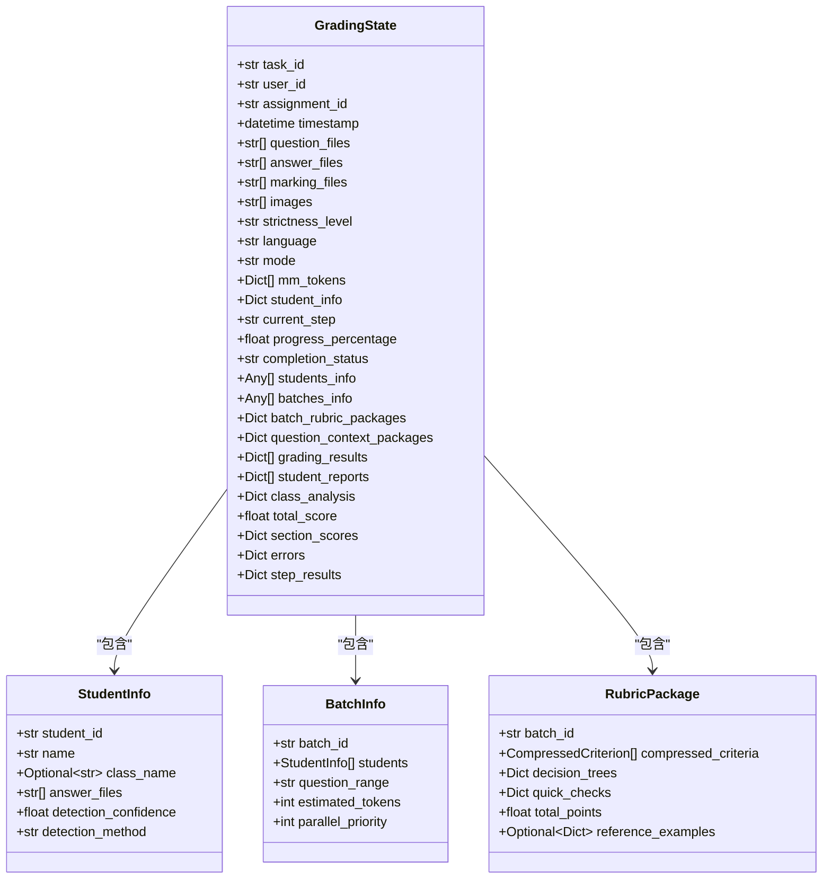

**图表来源**
- [state.py](file://ai_correction/functions/langgraph/state.py#L44-L268)
- [multimodal_models.py](file://ai_correction/functions/langgraph/multimodal_models.py#L37-L62)

### 字段分类体系

状态对象的字段按照功能重要性和使用频率分为以下几个主要类别：

| 字段类别 | 字段数量 | 主要用途 | 生命周期 |
|---------|---------|----------|----------|
| 基础信息 | 4 | 任务标识、时间戳、用户信息 | 整个工作流 |
| 文件管理 | 7 | 多模态文件处理 | 文件上传阶段 |
| 批改参数 | 3 | 模式、严格程度、语言 | 初始化阶段 |
| 多模态处理 | 3 | OCR结果、token坐标、理解结果 | 多模态处理阶段 |
| 题目与批次 | 3 | 题目信息、批次规划 | 分析阶段 |
| 评分结果 | 3 | 评估结果、详细反馈、坐标标注 | 评分阶段 |
| 知识点挖掘 | 3 | 知识点分析、错误分析、学习建议 | 分析阶段 |
| 专业模式 | 4 | 总分、部分分数、评价、导出数据 | 专业模式专用 |
| 深度协作 | 7 | 学生信息、批次信息、上下文包、结果、报告、分析 | 深度协作阶段 |
| 状态控制 | 5 | 当前步骤、进度、完成状态、错误记录、步骤结果 | 整个工作流 |

**章节来源**
- [state.py](file://ai_correction/functions/langgraph/state.py#L44-L268)

## 深度协作新增字段详解

### students_info列表 - 学生信息管理

students_info字段是一个包含StudentInfo对象的列表，专门用于深度协作架构中的学生信息管理。每个StudentInfo对象封装了单个学生的完整信息：

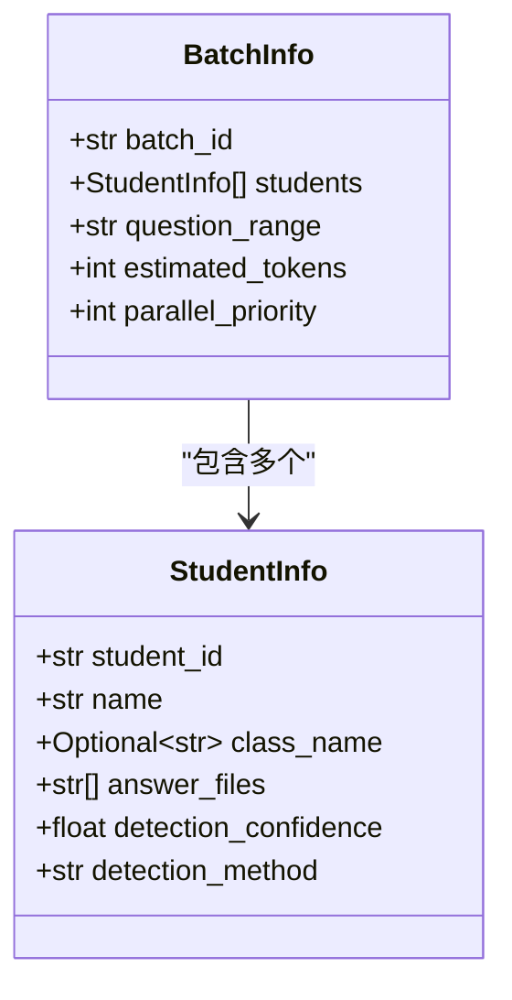

**图表来源**
- [multimodal_models.py](file://ai_correction/functions/langgraph/multimodal_models.py#L32-L39)

#### 字段详解

- **student_id**: 唯一标识符，可以是学号或系统自动生成的ID
- **name**: 学生姓名，用于个性化报告生成
- **class_name**: 可选的班级信息，支持班级层面的分析
- **answer_files**: 该学生对应的答案文件路径列表
- **detection_confidence**: 学生身份识别的置信度（0-1）
- **detection_method**: 识别方法，支持视觉识别、文件名解析或手动确认

### batches_info列表 - 批次规划详情

batches_info字段记录了基于学生信息和题目分析的批次规划详情，是并行处理的核心数据结构：

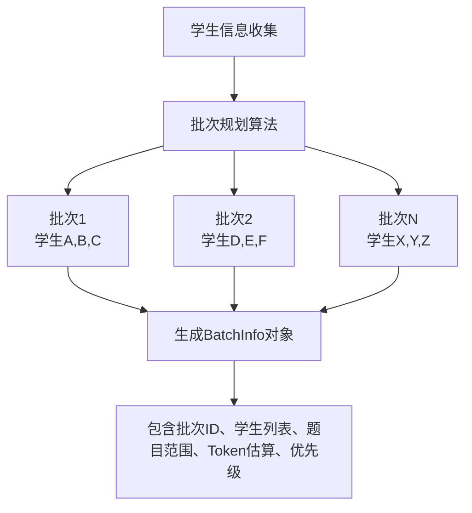

**图表来源**
- [batch_planning_agent.py](file://ai_correction/functions/langgraph/agents/batch_planning_agent.py#L25-L50)

#### 批次规划策略

批次规划采用动态大小调整算法，考虑以下因素：

- **最优批次大小**: 默认10个学生，可根据Token消耗调整
- **Token预算**: 基于学生数量和题目复杂度预估Token消耗
- **并行优先级**: 按批次顺序分配优先级，确保公平性
- **题目范围**: 支持全量批改或特定题目范围

### batch_rubric_packages字典 - 批次专属评分包

batch_rubric_packages是一个以批次ID为键的字典，存储为每个批次生成的专属评分包：

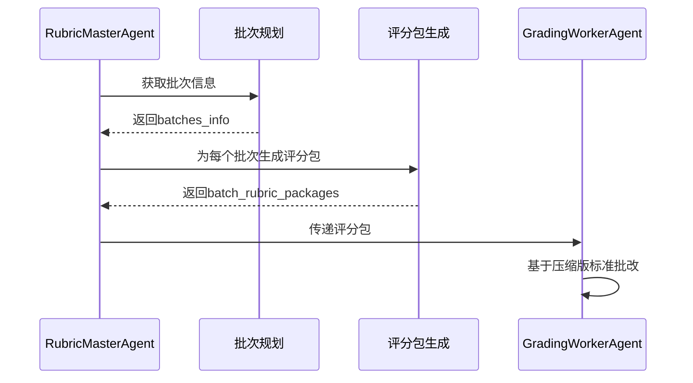

**图表来源**
- [rubric_master_agent.py](file://ai_correction/functions/langgraph/agents/rubric_master_agent.py#L30-L80)

#### Token优化策略

评分包采用多种Token优化技术：

- **压缩描述**: 评分点描述截断为50字符以内
- **关键词限制**: 关键词列表限制为前5个
- **决策树简化**: 提取核心判断逻辑而非完整描述
- **快速检查**: 提供简化的检查方法

### question_context_packages字典 - 批次专属上下文

question_context_packages为每个批次提供定制化的题目上下文，支持高效的批改执行：

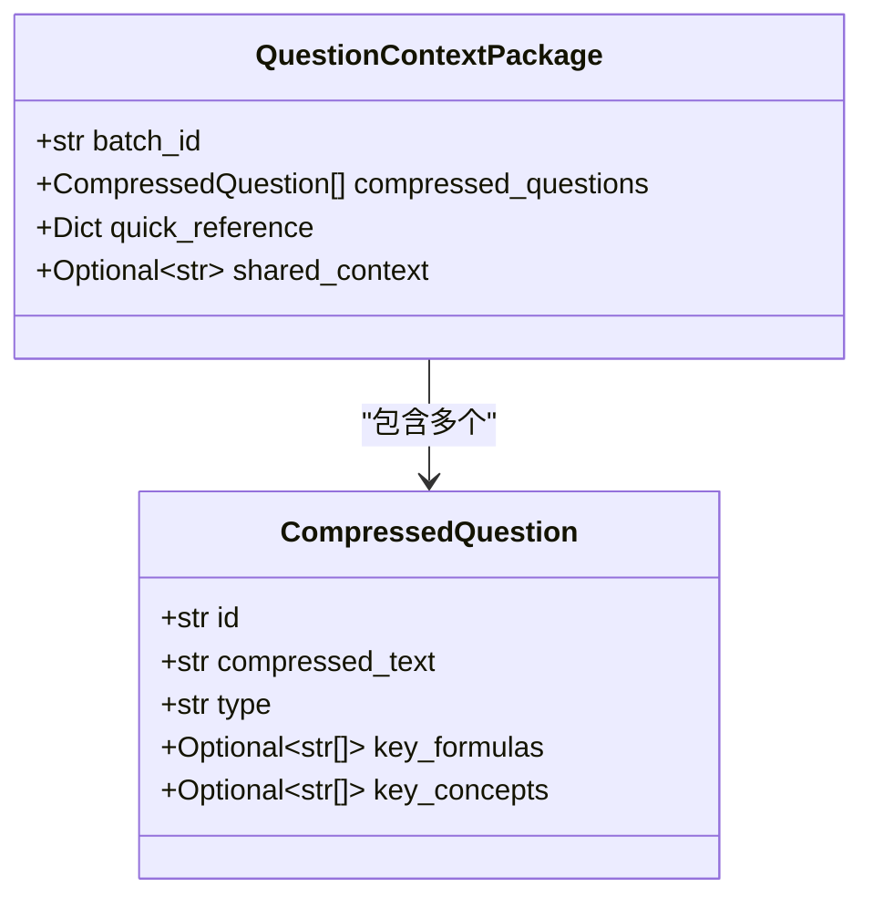

**图表来源**
- [multimodal_models.py](file://ai_correction/functions/langgraph/multimodal_models.py#L64-L75)

#### 上下文优化机制

- **压缩题目**: 移除冗余信息，保留核心内容
- **关键元素**: 提取公式、概念等关键要素
- **快速参考**: 提供极简描述便于快速检索
- **共享背景**: 为相关题目提供共同背景信息

### grading_results列表 - 批改结果收集

grading_results字段收集所有批次的批改结果，形成完整的评分报告：

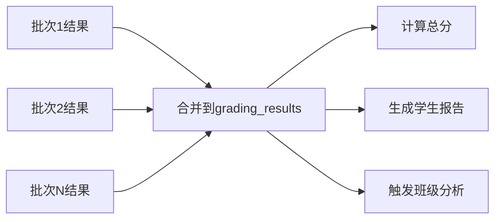

**图表来源**
- [grading_worker_agent.py](file://ai_correction/functions/langgraph/agents/grading_worker_agent.py#L48-L81)

#### 结果标准化

每个批改结果包含标准化的字段：
- **student_id**: 学生标识
- **student_name**: 学生姓名
- **evaluations**: 评分点评估列表
- **total_score**: 总得分
- **processing_time_ms**: 处理时间

### student_reports列表 - 个性化报告生成

student_reports字段存储为每个学生生成的个性化报告，支持精细化的反馈：

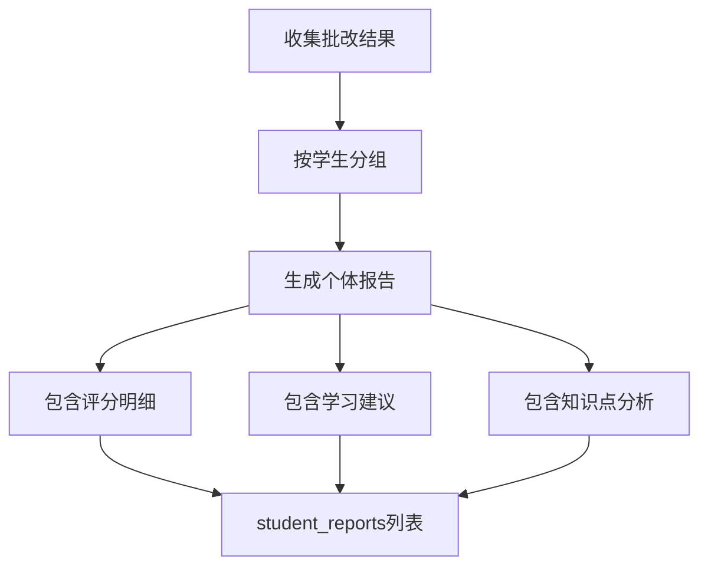

### class_analysis字典 - 班级分析数据

class_analysis字段存储班级层面的综合分析数据：

- **平均分统计**: 各维度的平均得分
- **分布分析**: 成绩分布情况
- **薄弱环节**: 班级普遍存在的问题
- **进步趋势**: 与历史数据的对比分析

**章节来源**
- [state.py](file://ai_correction/functions/langgraph/state.py#L180-L195)
- [multimodal_models.py](file://ai_correction/functions/langgraph/multimodal_models.py#L32-L75)

## 状态持久化机制

### LangGraph Checkpointer集成

GradingState通过LangGraph的checkpointer机制实现工作流的持久化和恢复：

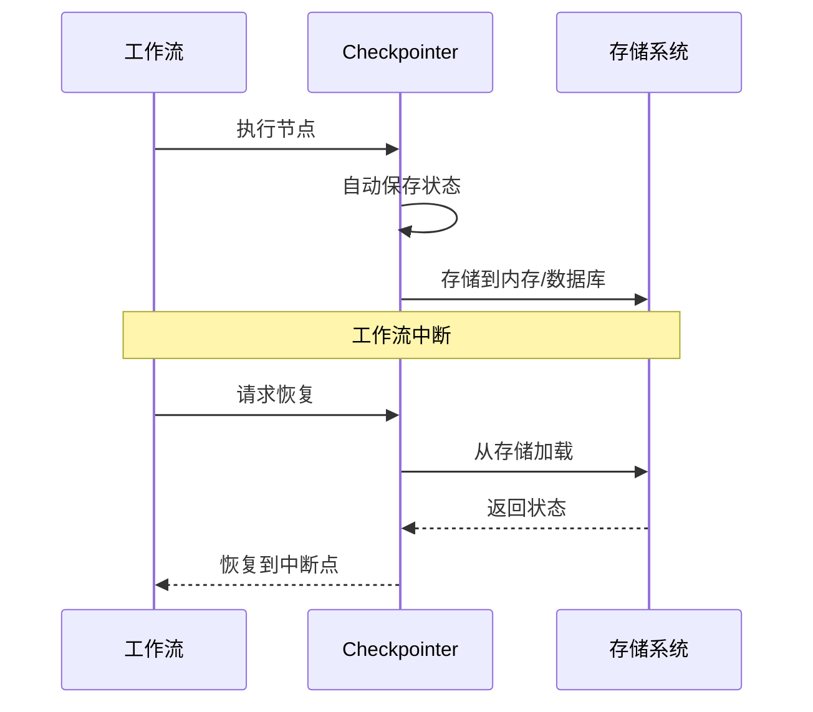

**图表来源**
- [checkpointer.py](file://ai_correction/functions/langgraph/checkpointer.py#L80-L120)

### Checkpointer工厂模式

系统采用工厂模式管理不同环境下的Checkpointer：

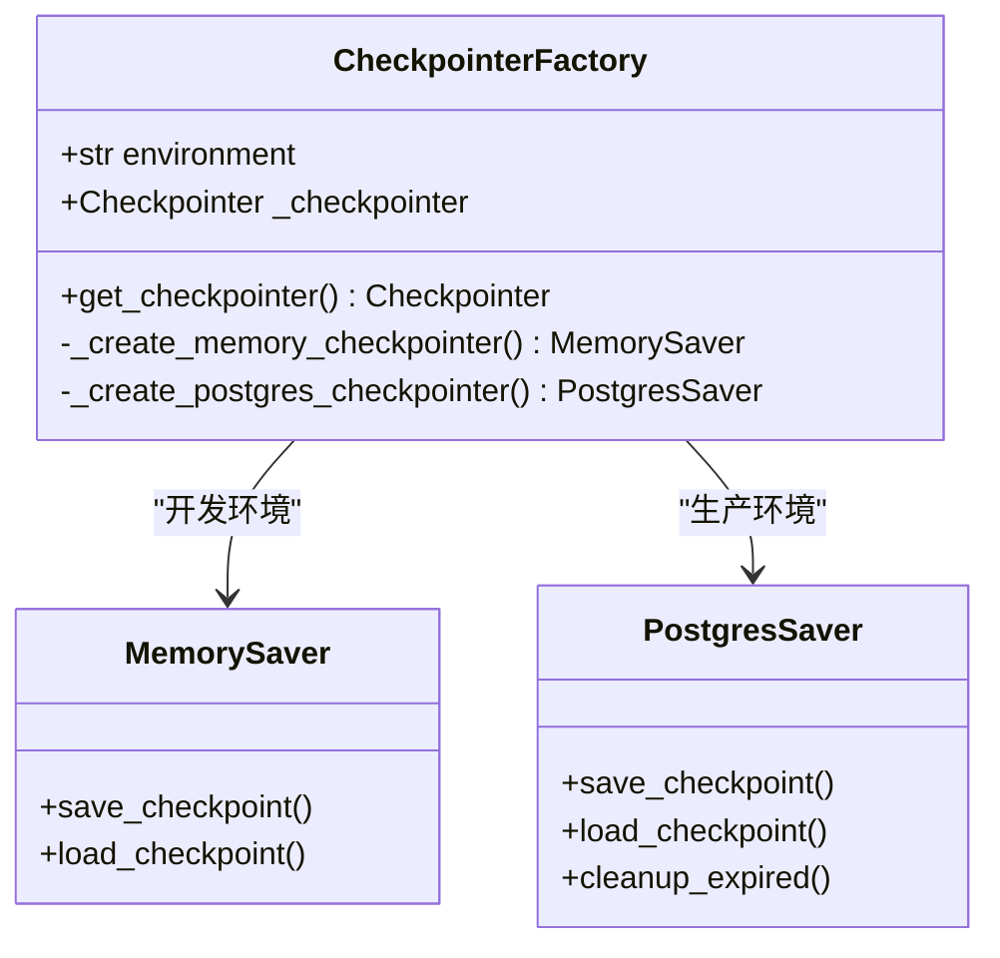

**图表来源**
- [checkpointer.py](file://ai_correction/functions/langgraph/checkpointer.py#L25-L80)

### 环境适配策略

- **开发环境**: 自动尝试PostgreSQL，失败则回退到MemorySaver
- **测试环境**: 强制使用MemorySaver确保隔离性
- **生产环境**: 优先使用PostgresSaver确保可靠性

**章节来源**
- [checkpointer.py](file://ai_correction/functions/langgraph/checkpointer.py#L25-L150)

## 状态初始化策略

### 默认值设置策略

状态初始化采用渐进式填充策略，确保每个字段都有合理的默认值：

```mermaid
flowchart TD
A[创建初始状态] --> B[设置基础信息]
B --> C[初始化空容器]
C --> D[设置进度跟踪]
D --> E[配置错误处理]
E --> F[标记为进行中]
B --> B1[task_id, user_id, timestamp]
C --> C1[lists: [], dicts: {}, scores: 0.0]
D --> D1[current_step, progress_percentage, completion_status]
E --> E1[errors: [], step_results: {}]
```

**图表来源**
- [workflow.py](file://ai_correction/functions/langgraph/workflow.py#L429-L480)

### 字段初始化清单

系统为30多个关键字段设置了明确的初始化策略：

| 字段类别 | 初始化方式 | 默认值 | 作用 |
|---------|-----------|--------|------|
| 基础信息 | 直接赋值 | 用户提供的值 | 任务标识 |
| 容器字段 | 空容器 | [] 或 {} | 数据存储 |
| 数值字段 | 零值 | 0.0 | 计算基准 |
| 状态字段 | 字符串 | "in_progress" | 流程控制 |
| 时间字段 | 当前时间 | datetime.now() | 调试追踪 |
| 错误字段 | 空列表 | [] | 错误收集 |

### 渐进式填充模式

状态在执行过程中采用渐进式填充，每个Agent只负责更新相关的字段：

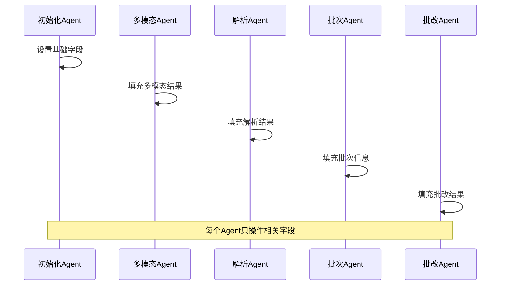

**图表来源**
- [workflow_multimodal.py](file://ai_correction/functions/langgraph/workflow_multimodal.py#L130-L187)

**章节来源**
- [workflow.py](file://ai_correction/functions/langgraph/workflow.py#L429-L480)
- [workflow_multimodal.py](file://ai_correction/functions/langgraph/workflow_multimodal.py#L130-L187)

## 状态流转与管理

### 工作流节点间的状态传递

GradingState在11个节点间实现高效的状态传递：

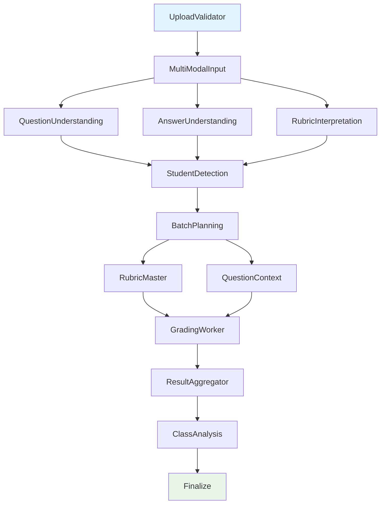

**图表来源**
- [workflow_multimodal.py](file://ai_correction/functions/langgraph/workflow_multimodal.py#L74-L120)

### 状态更新模式

每个Agent采用以下状态更新模式：

1. **字段检查**: 检查目标字段是否存在
2. **数据填充**: 填充相关业务数据
3. **进度更新**: 更新当前步骤和进度百分比
4. **错误处理**: 记录异常信息

### 并行处理协调

在并行处理场景中，状态对象需要协调多个Agent的执行：

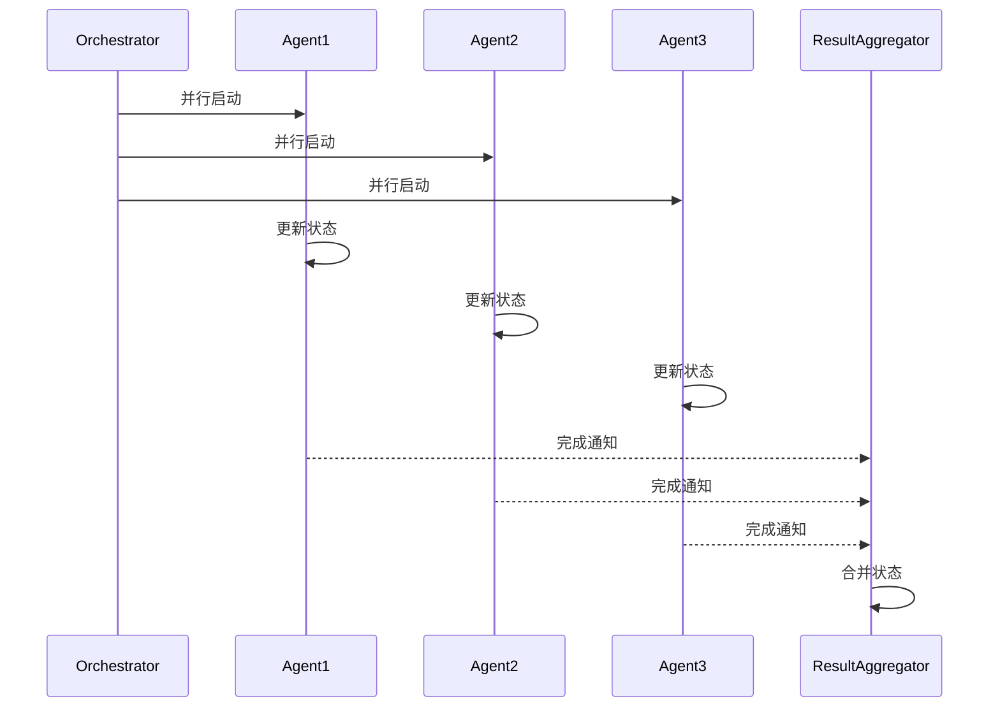

**章节来源**
- [workflow_multimodal.py](file://ai_correction/functions/langgraph/workflow_multimodal.py#L74-L120)

## 最佳实践与陷阱规避

### 状态管理最佳实践

#### 1. 字段初始化规范

```python
# 推荐：显式初始化所有字段
if 'students_info' not in state:
    state['students_info'] = []
if 'batches_info' not in state:
    state['batches_info'] = []
```

#### 2. 类型安全保证

```python
# 推荐：使用TypedDict确保类型安全
from typing import TypedDict, List, Dict, Any

class GradingState(TypedDict):
    students_info: List[Dict[str, Any]]
    batches_info: List[Dict[str, Any]]
```

#### 3. 错误处理策略

```python
# 推荐：统一的错误处理模式
try:
    # 业务逻辑
    state['result_field'] = result
except Exception as e:
    if 'errors' not in state:
        state['errors'] = []
    state['errors'].append({
        'agent': self.agent_name,
        'error': str(e),
        'timestamp': str(datetime.now())
    })
```

### 常见陷阱规避

#### 1. 字段覆盖风险

**问题**: 后续Agent覆盖前面Agent的重要数据

**解决方案**: 使用条件检查和数据合并

```python
# 避免：直接覆盖
state['students_info'] = new_students  # 可能丢失之前的数据

# 推荐：合并数据
state['students_info'].extend(new_students)
```

#### 2. 状态污染

**问题**: Agent之间意外修改共享对象

**解决方案**: 使用深拷贝或不可变数据结构

```python
# 推荐：创建副本
import copy
safe_state = copy.deepcopy(original_state)
```

#### 3. 内存泄漏

**问题**: 长时间运行累积大量中间数据

**解决方案**: 及时清理不需要的字段

```python
# 推荐：清理临时数据
if 'temp_data' in state:
    del state['temp_data']
```

#### 4. 并发冲突

**问题**: 多个Agent同时修改同一字段

**解决方案**: 使用原子操作和锁机制

```python
# 推荐：使用线程安全的数据结构
from threading import Lock
lock = Lock()

with lock:
    state['shared_field'] = new_value
```

### 性能监控指标

建立以下性能监控指标：

| 指标类型 | 监控内容 | 阈值建议 | 处理策略 |
|---------|---------|----------|----------|
| 内存使用 | 状态对象大小 | < 10MB | 压缩数据 |
| 执行时间 | 单节点耗时 | < 30秒 | 异步处理 |
| 错误率 | 失败节点比例 | < 5% | 重试机制 |
| 并发度 | 同时处理任务数 | < 100 | 负载均衡 |

**章节来源**
- [workflow_multimodal.py](file://ai_correction/functions/langgraph/workflow_multimodal.py#L159-L187)
- [batch_planning_agent.py](file://ai_correction/functions/langgraph/agents/batch_planning_agent.py#L25-L72)

## 性能优化策略

### Token优化技术

#### 1. 数据压缩

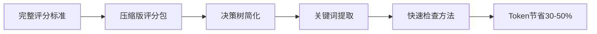

**图表来源**
- [rubric_master_agent.py](file://ai_correction/functions/langgraph/agents/rubric_master_agent.py#L80-L127)

#### 2. 缓存机制

系统实现了多层缓存机制：

- **文件哈希缓存**: 避免重复文件处理
- **OCR结果缓存**: 缓存多模态提取结果
- **解析结果缓存**: 缓存评分标准解析结果

#### 3. 条件执行

根据文件类型和内容智能跳过不必要的步骤：

```python
def _should_skip_rubric(marking_files: List[str]) -> bool:
    """判断是否可以跳过评分标准解析"""
    return not marking_files or len(marking_files) == 0
```

### 并行处理优化

#### 1. 批次并行

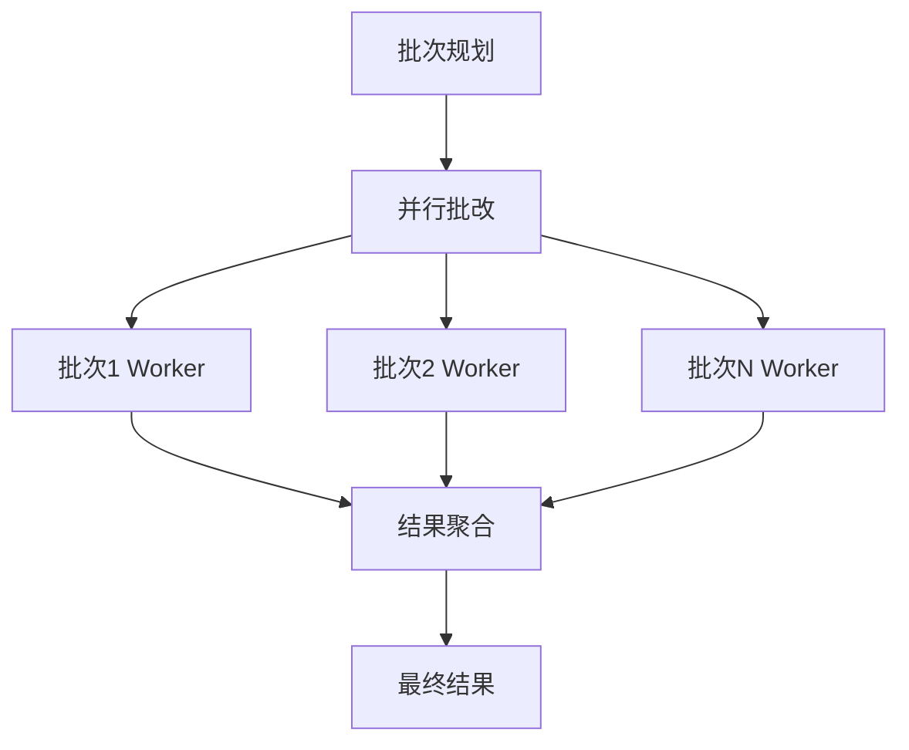

**图表来源**
- [grading_worker_agent.py](file://ai_correction/functions/langgraph/agents/grading_worker_agent.py#L48-L81)

#### 2. 理解并行

多个Agent并行执行不同的理解任务：

- **题目理解**: 分析题目要求
- **答案理解**: 解析学生答案
- **标准理解**: 解析评分标准

### 内存管理优化

#### 1. 流式处理

对于大型文件，采用流式处理避免内存溢出：

```python
# 推荐：流式读取大文件
with open(file_path, 'r', encoding='utf-8') as f:
    for line in f:
        process_line(line)
```

#### 2. 对象池化

重用频繁创建的对象：

```python
# 推荐：使用对象池
from collections import defaultdict
object_pool = defaultdict(list)

def get_compressed_criterion():
    if object_pool['criterion']:
        return object_pool['criterion'].pop()
    return CompressedCriterion()
```

**章节来源**
- [workflow.py](file://ai_correction/functions/langgraph/workflow.py#L200-L250)
- [rubric_master_agent.py](file://ai_correction/functions/langgraph/agents/rubric_master_agent.py#L80-L127)

## 总结

GradingState状态对象作为AI批改系统的核心数据枢纽，展现了现代AI系统在数据管理方面的先进设计理念。通过精心设计的TypedDict架构、深度协作的新增字段、可靠的持久化机制和优化的性能策略，该状态对象成功支撑了从文件上传到最终报告生成的完整工作流程。

### 关键成就

1. **统一数据源**: 50+字段的统一管理，确保数据一致性和可追踪性
2. **深度协作**: 新增字段有效支持多学生、多批次的并行处理
3. **可靠持久化**: LangGraph Checkpointer确保工作流的可恢复性
4. **性能优化**: 多种优化策略显著提升系统效率

### 设计亮点

- **类型安全**: TypedDict提供编译时类型检查
- **渐进式填充**: 避免字段遗漏和空指针异常
- **并行友好**: 支持多Agent并发访问和更新
- **扩展性强**: 易于添加新的字段和功能

### 应用价值

该状态管理模式不仅适用于AI批改系统，也为其他复杂的AI工作流提供了优秀的参考范例。通过合理的设计和优化，可以在保证功能完整性的同时，实现高性能和高可靠性的系统目标。