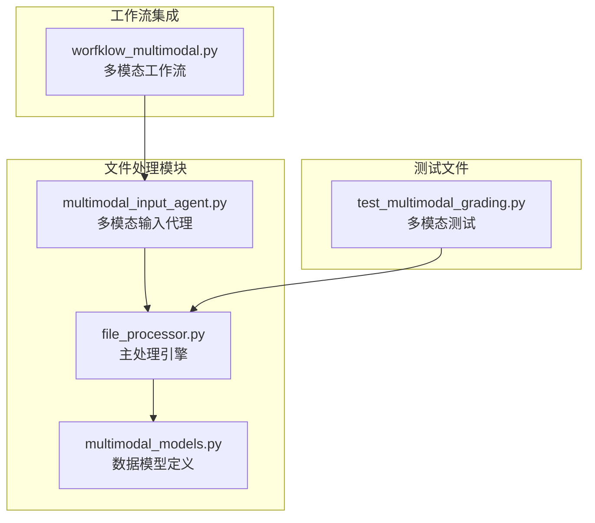
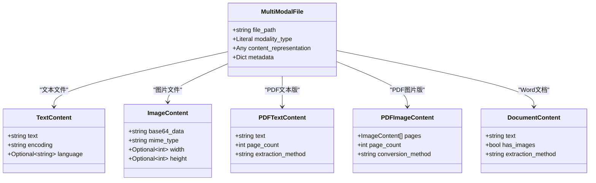
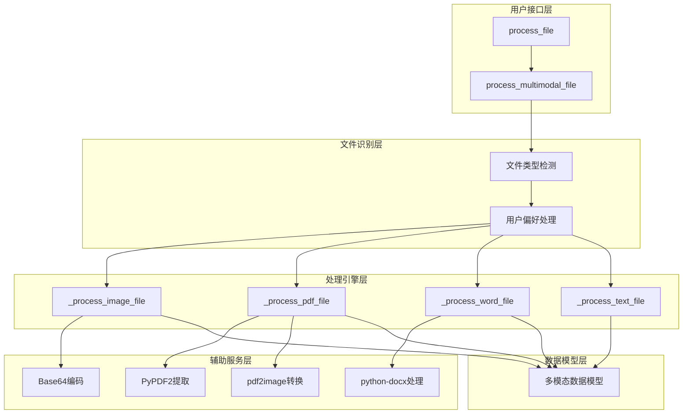
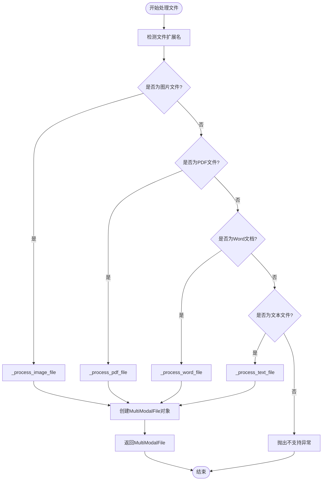
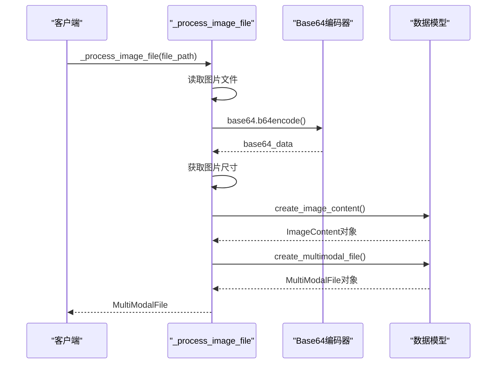
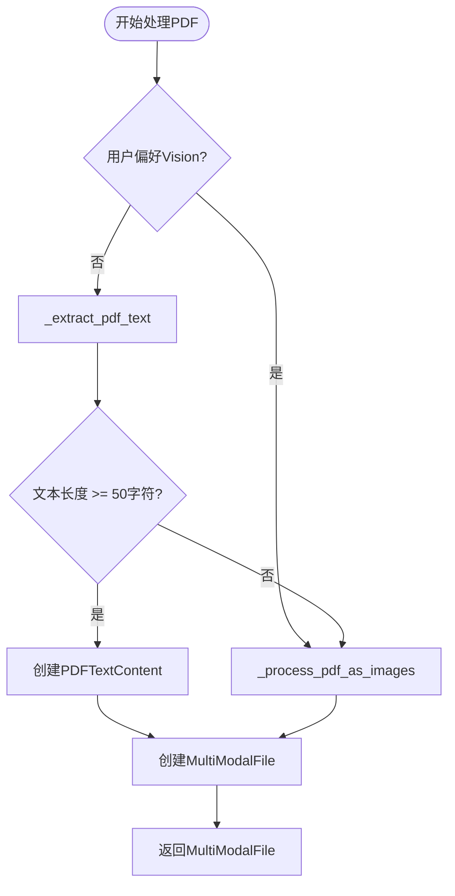
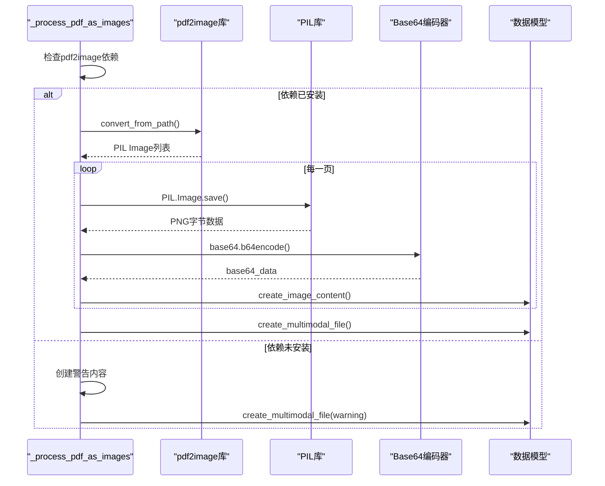
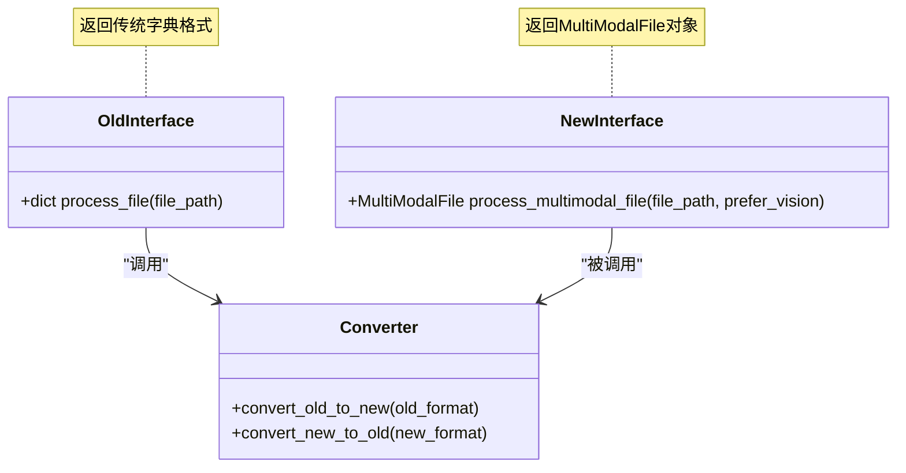
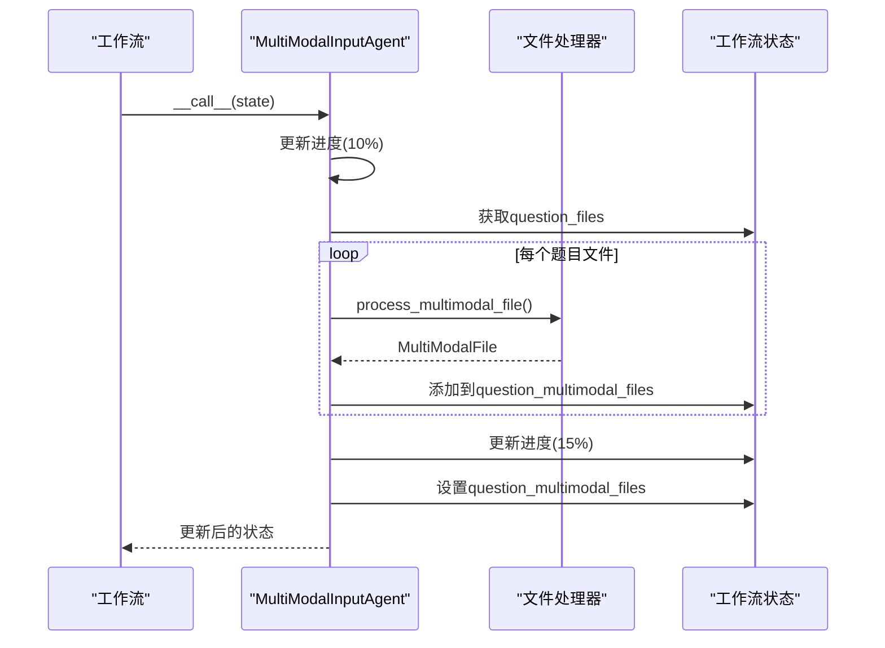
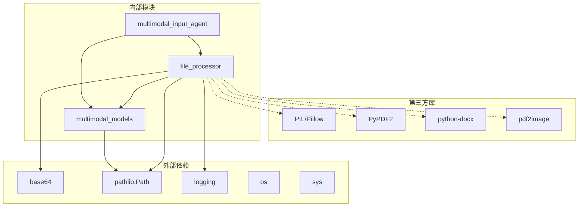

现在我有了足够的信息来创建详细的文档。让我生成完整的文件处理模块文档：

<docs>
# 文件处理模块

<cite>
**本文档引用的文件**
- [file_processor.py](file://ai_correction/functions/file_processor.py)
- [multimodal_models.py](file://ai_correction/functions/langgraph/multimodal_models.py)
- [multimodal_input_agent.py](file://ai_correction/functions/langgraph/agents/multimodal_input_agent.py)
- [test_multimodal_grading.py](file://ai_correction/test_multimodal_grading.py)
- [workflow_multimodal.py](file://ai_correction/functions/langgraph/workflow_multimodal.py)
</cite>

## 目录
1. [简介](#简介)
2. [项目结构](#项目结构)
3. [核心组件](#核心组件)
4. [架构概览](#架构概览)
5. [详细组件分析](#详细组件分析)
6. [依赖关系分析](#依赖关系分析)
7. [性能考虑](#性能考虑)
8. [故障排除指南](#故障排除指南)
9. [结论](#结论)

## 简介

文件处理模块是AI批改系统的核心组件，专门负责处理多模态文件输入。该模块采用"真正的多模态支持"设计理念，不进行强制OCR转换，而是保留原始文件模态，并支持LLM Vision能力。模块支持多种文件格式，包括文本文件、图片文件、PDF文件和Word文档，能够根据文件特性和用户偏好选择最优的处理策略。

### 设计原则

1. **不进行强制OCR转换** - 保留原始文件模态
2. **支持LLM Vision能力** - 利用视觉模型处理图片和扫描版PDF
3. **用户明确要求时才提示使用文本版本** - 提供灵活的处理选项
4. **向后兼容性** - 保留旧版本接口以确保系统平稳迁移

## 项目结构

文件处理模块主要包含以下核心文件：



**图表来源**
- [file_processor.py](file://ai_correction/functions/file_processor.py#L1-L50)
- [multimodal_models.py](file://ai_correction/functions/langgraph/multimodal_models.py#L1-L50)

**章节来源**
- [file_processor.py](file://ai_correction/functions/file_processor.py#L1-L32)
- [multimodal_models.py](file://ai_correction/functions/langgraph/multimodal_models.py#L1-L30)

## 核心组件

### MultiModalFile 数据结构

MultiModalFile是模块的核心数据结构，提供了统一的多模态文件表示方式：



**图表来源**
- [multimodal_models.py](file://ai_correction/functions/langgraph/multimodal_models.py#L15-L130)

### 主要处理函数

模块提供了两个主要的处理函数：

1. **process_multimodal_file()** - 新版本多模态处理接口
2. **process_file()** - 旧版本兼容接口

**章节来源**
- [file_processor.py](file://ai_correction/functions/file_processor.py#L32-L74)
- [file_processor.py](file://ai_correction/functions/file_processor.py#L77-L168)

## 架构概览

文件处理模块采用分层架构设计，从上到下包括：



**图表来源**
- [file_processor.py](file://ai_correction/functions/file_processor.py#L32-L74)
- [file_processor.py](file://ai_correction/functions/file_processor.py#L115-L168)

## 详细组件分析

### process_multimodal_file 函数

这是模块的核心入口函数，负责根据文件类型选择合适的处理策略：



**图表来源**
- [file_processor.py](file://ai_correction/functions/file_processor.py#L32-L74)

#### 图片文件处理 (_process_image_file)

图片文件处理是最直接的流程，将图片转换为base64编码：



**图表来源**
- [file_processor.py](file://ai_correction/functions/file_processor.py#L120-L168)

#### PDF文件处理策略 (_process_pdf_file)

PDF文件处理采用智能判断策略：



**图表来源**
- [file_processor.py](file://ai_correction/functions/file_processor.py#L171-L216)

#### PDF转图片处理 (_process_pdf_as_images)

当PDF无法提取文本或用户偏好Vision模式时，使用此函数：



**图表来源**
- [file_processor.py](file://ai_correction/functions/file_processor.py#L219-L280)

**章节来源**
- [file_processor.py](file://ai_correction/functions/file_processor.py#L120-L280)

### 旧版本兼容接口

为了确保系统平稳迁移，模块保留了旧版本的兼容接口：



**图表来源**
- [file_processor.py](file://ai_correction/functions/file_processor.py#L77-L168)

**章节来源**
- [file_processor.py](file://ai_correction/functions/file_processor.py#L77-L168)

### 多模态输入代理

MultiModalInputAgent负责在工作流中集成文件处理功能：



**图表来源**
- [multimodal_input_agent.py](file://ai_correction/functions/langgraph/agents/multimodal_input_agent.py#L21-L122)

**章节来源**
- [multimodal_input_agent.py](file://ai_correction/functions/langgraph/agents/multimodal_input_agent.py#L21-L122)

## 依赖关系分析

模块的依赖关系体现了清晰的分层架构：



**图表来源**
- [file_processor.py](file://ai_correction/functions/file_processor.py#L10-L32)
- [multimodal_models.py](file://ai_correction/functions/langgraph/multimodal_models.py#L10-L15)

### 可选依赖处理

模块对可选依赖进行了优雅的降级处理：

| 依赖库 | 功能 | 降级策略 |
|--------|------|----------|
| pdf2image | PDF转图片 | 返回警告信息，标记为pdf_image类型 |
| PyPDF2 | PDF文本提取 | 返回空字符串，继续尝试图片模式 |
| python-docx | Word文档处理 | 抛出ImportError异常 |
| PIL | 图片处理 | 获取尺寸信息失败时返回None |

**章节来源**
- [file_processor.py](file://ai_correction/functions/file_processor.py#L219-L253)
- [file_processor.py](file://ai_correction/functions/file_processor.py#L283-L314)

## 性能考虑

### 异常处理策略

模块采用了多层次的异常处理机制：

1. **文件级异常处理** - 单个文件处理失败不影响其他文件
2. **功能级降级** - 功能不可用时提供替代方案
3. **日志记录** - 详细的错误日志便于调试

### 内存优化

- **流式处理** - 图片和PDF文件采用流式读取
- **延迟加载** - 可选依赖仅在需要时导入
- **及时释放** - 处理完成后立即释放资源

### 并发处理

虽然当前实现是同步的，但架构设计支持未来的异步改造：


## 故障排除指南

### 常见问题及解决方案

#### 1. pdf2image未安装

**症状**: PDF文件被转换为图片模式，但出现"未安装pdf2image"警告

**解决方案**:
```bash
pip install pdf2image poppler-utils
```

**配置说明**:
- `poppler-utils` - PDF转图片所需的命令行工具
- `pdf2image` - Python包装库

#### 2. PyPDF2缺失

**症状**: PDF文本提取失败，返回空字符串

**解决方案**:
```bash
pip install PyPDF2
```

#### 3. python-docx未安装

**症状**: Word文档处理失败，抛出ImportError异常

**解决方案**:
```bash
pip install python-docx
```

#### 4. 图片尺寸获取失败

**症状**: 图片文件处理成功，但宽高信息为None

**原因**: PIL库不可用或图片格式不支持

**解决方案**: 继续使用，不影响核心功能

### 调试技巧

#### 启用详细日志

```python
import logging
logging.basicConfig(level=logging.INFO)
```

#### 检查文件类型识别

```python
from pathlib import Path
path = Path("your_file.pdf")
print(f"文件扩展名: {path.suffix.lower()}")
```

#### 验证依赖安装

```python
try:
    import pdf2image
    print("pdf2image可用")
except ImportError:
    print("pdf2image未安装")

try:
    import PyPDF2
    print("PyPDF2可用")
except ImportError:
    print("PyPDF2未安装")
```

**章节来源**
- [file_processor.py](file://ai_correction/functions/file_processor.py#L219-L253)
- [file_processor.py](file://ai_correction/functions/file_processor.py#L283-L314)

## 结论

文件处理模块展现了现代AI系统中多模态处理的最佳实践。通过以下关键特性实现了高效、可靠的文件处理：

### 核心优势

1. **设计理念先进**