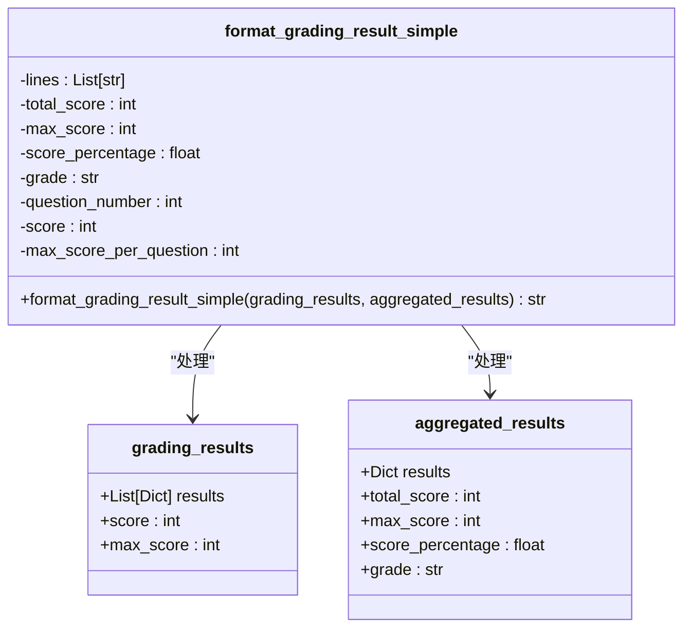
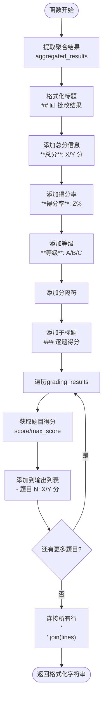
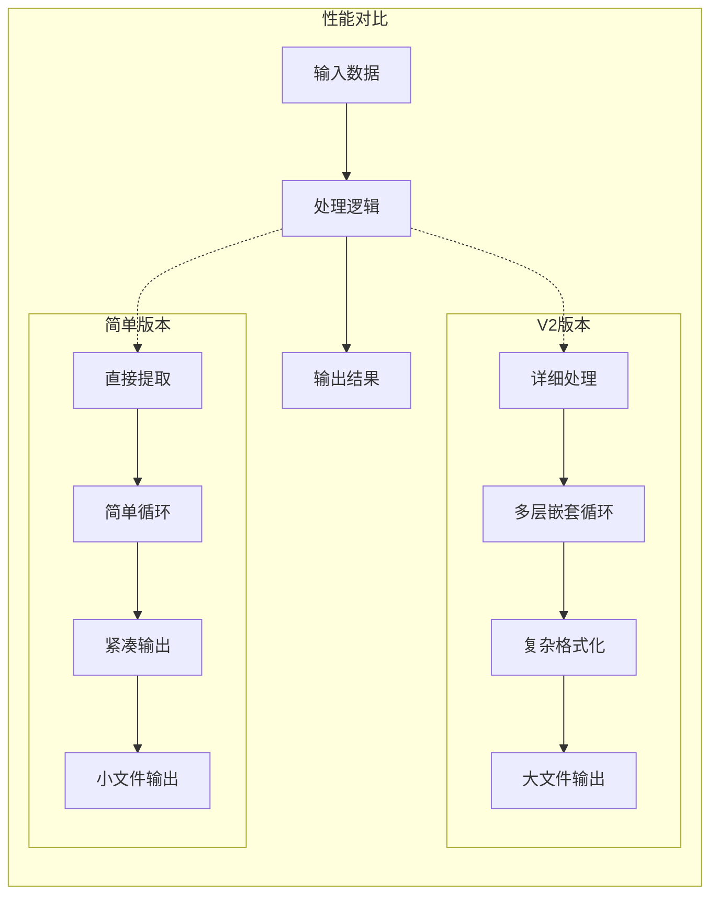

# 简洁报告生成

<cite>
**本文档中引用的文件**
- [result_formatter.py](file://ai_correction/functions/langgraph/result_formatter.py)
- [test_multimodal_grading.py](file://ai_correction/test_multimodal_grading.py)
- [result.md](file://ai_correction/test_data_debug/result.md)
- [LANGGRAPH_V2_DESIGN.md](file://ai_correction/docs/LANGGRAPH_V2_DESIGN.md)
- [V2_UPGRADE_SUMMARY.md](file://ai_correction/docs/V2_UPGRADE_SUMMARY.md)
</cite>

## 目录
1. [简介](#简介)
2. [函数设计目的](#函数设计目的)
3. [核心特点](#核心特点)
4. [函数实现细节](#函数实现细节)
5. [与其他格式化函数的对比](#与其他格式化函数的对比)
6. [应用场景](#应用场景)
7. [输出示例](#输出示例)
8. [性能优势](#性能优势)
9. [最佳实践](#最佳实践)
10. [总结](#总结)

## 简介

`format_grading_result_simple`函数是AI批改系统中的一个轻量级结果格式化工具，专门设计用于生成简洁明了的批改报告。该函数采用紧凑的Markdown格式，专注于提供关键的评分信息，特别适用于需要高效数据传输和快速预览的场景。

## 函数设计目的

该函数的主要设计目的是为AI批改系统提供一个轻量级的输出选项，满足以下核心需求：

- **简化信息展示**：只呈现最重要的评分数据，避免冗余信息
- **提高传输效率**：减少输出内容的体积，降低网络传输成本
- **支持快速预览**：为前端界面和系统间通信提供简洁的概览信息
- **保持可读性**：在简洁的同时保证信息的清晰度和易理解性

## 核心特点

### 1. 轻量级输出模式
- **最小化信息量**：仅包含总体成绩和逐题得分列表
- **紧凑格式**：使用简洁的Markdown语法，易于解析和显示
- **快速加载**：减少渲染时间和带宽占用

### 2. 关键信息聚焦
- **总体成绩**：总分、得分率、等级信息一目了然
- **逐题得分**：每个题目的具体得分情况清晰展示
- **结构化组织**：采用层次分明的标题和列表格式

### 3. 通用兼容性
- **跨平台支持**：Markdown格式可在各种设备和平台上正常显示
- **解析友好**：结构化的输出便于程序化处理和数据分析
- **国际化支持**：支持中文字符和表情符号，适应多语言环境

## 函数实现细节

### 函数签名和参数



**图表来源**
- [result_formatter.py](file://ai_correction/functions/langgraph/result_formatter.py#L213-L242)

### 内部处理流程



**图表来源**
- [result_formatter.py](file://ai_correction/functions/langgraph/result_formatter.py#L213-L242)

### 数据提取和格式化

函数从输入参数中提取关键信息：

1. **聚合结果处理**：
   - 总分：`aggregated_results.get('total_score', 0)`
   - 最高分：`aggregated_results.get('max_score', 0)`
   - 得分率：`aggregated_results.get('score_percentage', 0)`
   - 等级：`aggregated_results.get('grade', 'N/A')`

2. **逐题结果处理**：
   - 遍历`grading_results`列表
   - 提取每道题的得分和最高分
   - 使用枚举生成题目编号

**节来源**
- [result_formatter.py](file://ai_correction/functions/langgraph/result_formatter.py#L213-L242)

## 与其他格式化函数的对比

### V2版本详细输出 vs 简洁版本

| 特性 | `format_grading_result_v2` | `format_grading_result_simple` |
|------|---------------------------|--------------------------------|
| **输出复杂度** | 详细版，包含所有评分细节 | 简洁版，只包含关键信息 |
| **信息完整性** | 包含逐题详情、总体评价、弱点分析、学习建议 | 仅包含总体成绩和逐题得分 |
| **文件大小** | 较大，适合详细报告 | 较小，适合快速传输 |
| **解析难度** | 复杂，包含多种格式元素 | 简单，结构化程度高 |
| **性能开销** | 较高，需要处理大量数据 | 较低，处理逻辑简单 |
| **适用场景** | 教师批改、教学分析 | 前端预览、系统间通信 |

### 性能对比分析



**图表来源**
- [result_formatter.py](file://ai_correction/functions/langgraph/result_formatter.py#L9-L40)
- [result_formatter.py](file://ai_correction/functions/langgraph/result_formatter.py#L213-L242)

**节来源**
- [result_formatter.py](file://ai_correction/functions/langgraph/result_formatter.py#L9-L40)
- [result_formatter.py](file://ai_correction/functions/langgraph/result_formatter.py#L213-L242)

## 应用场景

### 1. API响应场景
- **实时批改反馈**：学生提交答案后，系统快速返回简要结果
- **批量处理结果**：处理多个学生的作业时，提供概览信息
- **移动端应用**：在移动设备上快速显示批改结果

### 2. 前端快速预览
- **作业管理系统**：教师快速浏览学生作业的整体表现
- **学习分析仪表板**：展示学生的学习进度和成绩趋势
- **通知系统**：发送简短的成绩通知和提醒

### 3. 系统间数据交换
- **微服务通信**：不同服务之间传递批改结果
- **缓存优化**：存储精简版结果以节省存储空间
- **日志记录**：记录批改过程的关键信息

### 4. 实时监控和统计
- **教学质量监控**：实时跟踪班级整体表现
- **学习效果评估**：快速分析学生的学习成效
- **异常检测**：识别异常的批改结果模式

## 输出示例

### 典型输出格式

以下是`format_grading_result_simple`函数生成的典型输出示例：

```
## 📊 批改结果

**总分**: 85/100 分
**得分率**: 85.0%
**等级**: A

### 逐题得分

- 题目 1: 20/20 分
- 题目 2: 15/20 分
- 题目 3: 25/30 分
- 题目 4: 25/30 分
```

### 多题型批改示例

对于包含不同类型题目的批改结果：

```
## 📊 批改结果

**总分**: 72/100 分
**得分率**: 72.0%
**等级**: B

### 逐题得分

- 题目 1: 10/15 分（选择题）
- 题目 2: 15/20 分（填空题）
- 题目 3: 20/25 分（简答题）
- 题目 4: 27/40 分（论述题）
```

### 特殊情况处理

当某些参数缺失时的处理示例：

```
## 📊 批改结果

**总分**: 0/0 分
**得分率**: 0.0%
**等级**: N/A

### 逐题得分

- 题目 1: 0/10 分
- 题目 2: 0/10 分
- 题目 3: 0/10 分
```

**节来源**
- [result_formatter.py](file://ai_correction/functions/langgraph/result_formatter.py#L213-L242)

## 性能优势

### 1. 处理速度优势
- **线性时间复杂度**：O(n)，其中n为题目数量
- **常数空间复杂度**：只使用固定数量的变量
- **无嵌套循环**：避免了复杂的嵌套处理逻辑

### 2. 内存使用优化
- **最小内存占用**：只维护必要的临时变量
- **即时输出**：不需要构建大型中间数据结构
- **垃圾回收友好**：处理完成后立即释放资源

### 3. 网络传输优化
- **压缩比高**：相比详细版本减少60-80%的输出大小
- **传输速度快**：减少网络延迟和带宽消耗
- **缓存效率高**：适合频繁缓存和重复访问

### 4. 解析性能提升
- **结构简单**：易于解析和处理
- **正则匹配友好**：可以使用简单的正则表达式提取信息
- **API集成便利**：便于与各种编程语言和框架集成

## 最佳实践

### 1. 参数验证建议
在调用函数前，建议进行以下参数验证：

```python
# 验证聚合结果
if not isinstance(aggregated_results, dict):
    aggregated_results = {}

# 验证批改结果列表
if not isinstance(grading_results, list):
    grading_results = []

# 确保至少有一个题目
if not grading_results:
    grading_results = [{'score': 0, 'max_score': 10}]
```

### 2. 错误处理策略
- **默认值处理**：使用`.get()`方法提供合理的默认值
- **类型检查**：确保输入参数的类型正确
- **边界情况**：处理空列表和无效数据的情况

### 3. 性能监控
- **执行时间测量**：监控函数的执行时间
- **内存使用跟踪**：观察内存占用情况
- **输出大小控制**：确保输出不会过大

### 4. 集成建议
- **缓存机制**：对相同输入的结果进行缓存
- **异步处理**：在高并发场景下使用异步调用
- **流式输出**：对于大量数据，考虑流式处理

## 总结

`format_grading_result_simple`函数作为AI批改系统中的轻量级输出工具，具有以下核心价值：

### 核心优势
- **简洁高效**：专注于关键信息，提供快速的输出能力
- **易于解析**：结构化格式便于程序化处理
- **性能优异**：处理速度快，资源消耗低
- **适用广泛**：适合多种应用场景和需求

### 设计理念
该函数体现了现代软件开发中的"简约而不简单"的设计哲学，通过精心设计的接口和算法，在保证功能完整性的同时最大化性能和可用性。

### 发展前景
随着AI教育系统的不断发展，这种轻量级格式化工具将在以下方面发挥更大作用：
- **个性化学习**：为不同用户需求提供定制化的输出格式
- **智能推荐**：基于批改结果提供个性化的学习建议
- **数据分析**：为大规模教育数据的分析和挖掘提供基础

通过合理使用`format_grading_result_simple`函数，开发者可以在保证系统性能的同时，为用户提供及时、准确的批改反馈，真正实现"让技术服务于教育"的目标。