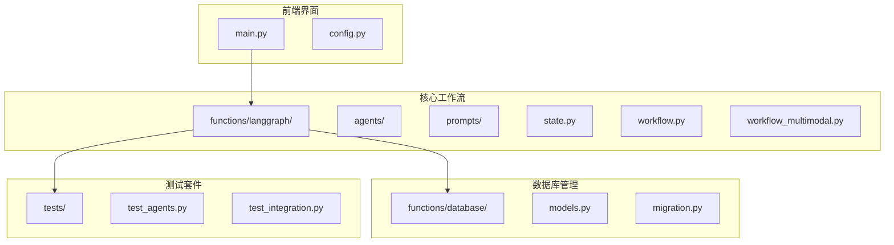
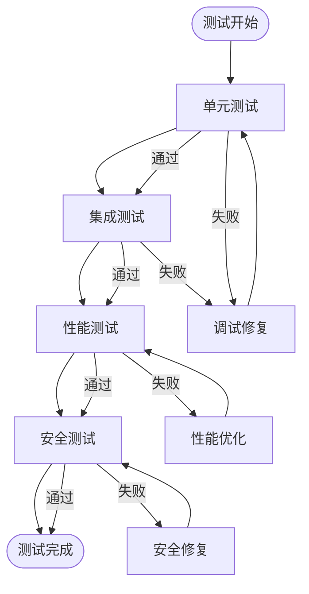
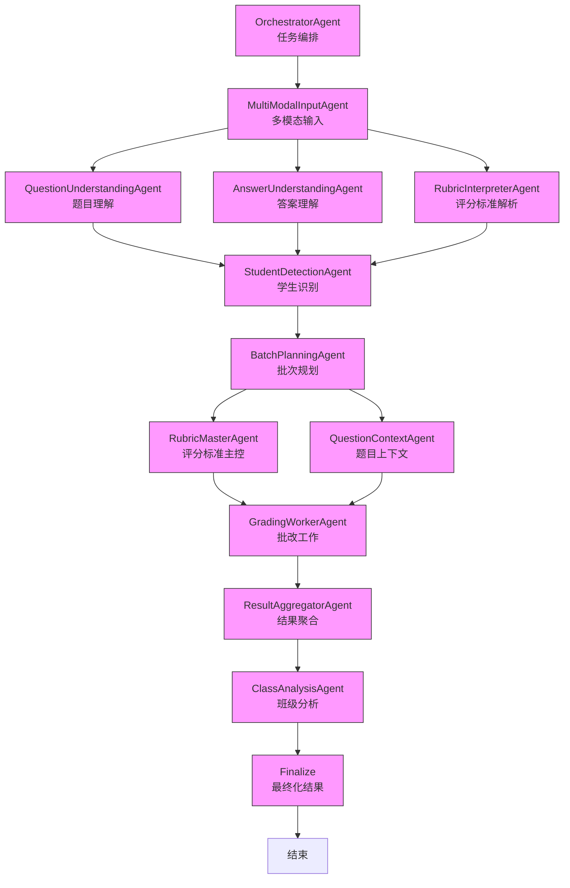

# 开发者指南

<cite>
**本文档引用的文件**
- [main.py](file://ai_correction/main.py)
- [config.py](file://ai_correction/config.py)
- [workflow.py](file://ai_correction/functions/langgraph/workflow.py)
- [workflow_multimodal.py](file://ai_correction/functions/langgraph/workflow_multimodal.py)
- [state.py](file://ai_correction/functions/langgraph/state.py)
- [orchestrator_agent.py](file://ai_correction/functions/langgraph/agents/orchestrator_agent.py)
- [scoring_agent.py](file://ai_correction/functions/langgraph/agents/scoring_agent.py)
- [efficient_mode.py](file://ai_correction/functions/langgraph/prompts/efficient_mode.py)
- [local_runner.py](file://ai_correction/local_runner.py)
- [test_agents.py](file://ai_correction/tests/test_agents.py)
- [README.md](file://ai_correction/README.md)
- [QUICKSTART.md](file://ai_correction/docs/QUICKSTART.md)
</cite>

## 目录
1. [项目结构](#项目结构)
2. [核心组件](#核心组件)
3. [开发环境设置](#开发环境设置)
4. [测试策略](#测试策略)
5. [贡献指南](#贡献指南)
6. [Agent创建示例](#agent创建示例)
7. [工作流集成](#工作流集成)

## 项目结构

AI智能批改系统采用模块化设计，主要分为前端界面、核心工作流、数据库管理和测试套件四个部分。



**图示来源**
- [main.py](file://ai_correction/main.py#L1-L100)
- [workflow.py](file://ai_correction/functions/langgraph/workflow.py#L1-L50)
- [state.py](file://ai_correction/functions/langgraph/state.py#L1-L30)

**本节来源**
- [main.py](file://ai_correction/main.py#L1-L100)
- [README.md](file://ai_correction/README.md#L1-L50)

## 核心组件

系统的核心组件包括状态管理、工作流编排和批改代理。状态管理通过`GradingState`定义批改过程中的所有数据结构，工作流编排使用LangGraph实现复杂的批改流程，批改代理则负责具体的评分任务。

**本节来源**
- [state.py](file://ai_correction/functions/langgraph/state.py#L1-L269)
- [workflow.py](file://ai_correction/functions/langgraph/workflow.py#L1-L617)
- [scoring_agent.py](file://ai_correction/functions/langgraph/agents/scoring_agent.py#L1-L408)

## 开发环境设置

### 依赖安装

```bash
pip install -r requirements.txt
```

### 环境配置

创建`.env.local`文件并配置以下变量：

```bash
OPENAI_API_KEY=your-api-key-here
DATABASE_TYPE=json
LLM_PROVIDER=openai
STREAMLIT_PORT=8501
```

### 数据库初始化

```bash
python local_runner.py
```

### 启动应用

```bash
# Windows
start_local.bat

# 或手动启动
streamlit run main.py
```

**本节来源**
- [config.py](file://ai_correction/config.py#L1-L83)
- [local_runner.py](file://ai_correction/local_runner.py#L1-L205)
- [README.md](file://ai_correction/README.md#L1-L50)

## 测试策略

系统采用单元测试和集成测试相结合的策略。单元测试针对单个Agent的功能进行验证，集成测试则确保整个工作流的正确执行。



**图示来源**
- [test_agents.py](file://ai_correction/tests/test_agents.py#L1-L225)
- [test_integration.py](file://ai_correction/tests/test_integration.py#L1-L50)

**本节来源**
- [test_agents.py](file://ai_correction/tests/test_agents.py#L1-L225)
- [test_integration.py](file://ai_correction/tests/test_integration.py#L1-L50)

## 贡献指南

### 代码规范

- 使用4个空格进行缩进
- 函数和变量名使用snake_case
- 类名使用PascalCase
- 单行代码不超过88个字符

### 提交流程

1. Fork仓库
2. 创建特性分支
3. 提交代码更改
4. 提交Pull Request

### 代码审查

- 确保代码有适当的注释
- 确保有相应的测试用例
- 确保符合编码规范
- 确保文档更新

**本节来源**
- [README.md](file://ai_correction/README.md#L1-L50)
- [CONTRIBUTING.md](file://ai_correction/CONTRIBUTING.md#L1-L50)

## Agent创建示例

### 创建新的批改Agent

```python
class CustomScoringAgent:
    """
    自定义评分代理
    """
    
    def __init__(self):
        self.agent_name = "CustomScoringAgent"
    
    async def __call__(self, state: Dict[str, Any]) -> Dict[str, Any]:
        """
        执行自定义评分
        
        Args:
            state: 当前状态
            
        Returns:
            更新后的状态
        """
        logger.info(f"开始自定义评分 - 任务ID: {state['task_id']}")
        
        try:
            # 更新进度
            state['current_step'] = "自定义评分"
            state['progress_percentage'] = 65.0
            
            # 执行自定义评分逻辑
            custom_results = await self._perform_custom_scoring(state)
            
            # 更新状态
            state['custom_scoring_results'] = custom_results
            state['final_score'] = custom_results.get('final_score', 0)
            state['grade_level'] = custom_results.get('grade_level', 'C')
            
            # 更新进度
            state['progress_percentage'] = 75.0
            
            logger.info(f"自定义评分完成 - 任务ID: {state['task_id']}, 得分: {state['final_score']}")
            return state
            
        except Exception as e:
            error_msg = f"自定义评分失败: {str(e)}"
            logger.error(error_msg)
            state['errors'].append({
                'step': 'custom_scoring',
                'error': error_msg,
                'timestamp': str(datetime.now())
            })
            return state
```

**本节来源**
- [scoring_agent.py](file://ai_correction/functions/langgraph/agents/scoring_agent.py#L1-L408)
- [orchestrator_agent.py](file://ai_correction/functions/langgraph/agents/orchestrator_agent.py#L1-L130)

## 工作流集成

### 多模态批改工作流



**图示来源**
- [workflow_multimodal.py](file://ai_correction/functions/langgraph/workflow_multimodal.py#L1-L374)
- [state.py](file://ai_correction/functions/langgraph/state.py#L1-L269)

**本节来源**
- [workflow_multimodal.py](file://ai_correction/functions/langgraph/workflow_multimodal.py#L1-L374)
- [workflow.py](file://ai_correction/functions/langgraph/workflow.py#L1-L617)