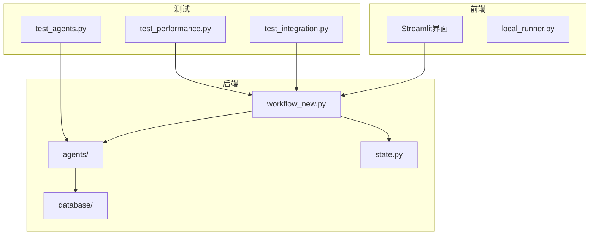
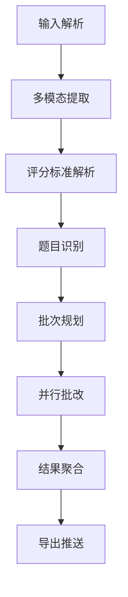
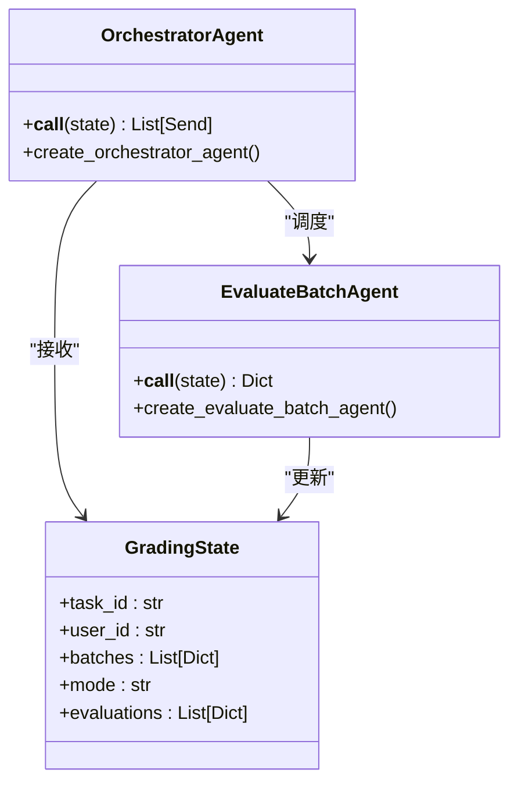
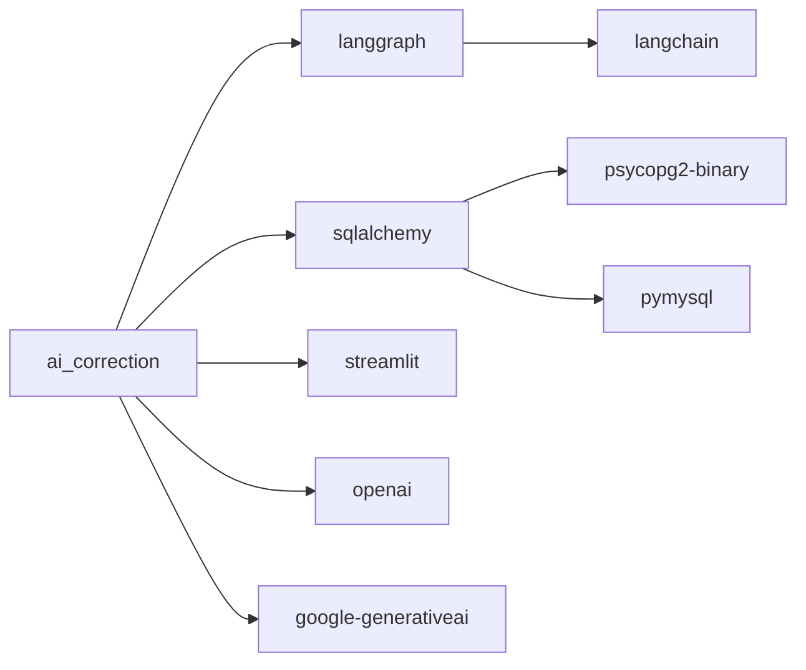

# 开发者指南

<cite>
**本文档引用的文件**  
- [main.py](file://ai_correction/main.py)
- [workflow_new.py](file://ai_correction/functions/langgraph/workflow_new.py)
- [state.py](file://ai_correction/functions/langgraph/state.py)
- [test_agents.py](file://ai_correction/tests/test_agents.py)
- [test_integration.py](file://ai_correction/tests/test_integration.py)
- [test_performance.py](file://ai_correction/tests/test_performance.py)
- [conftest.py](file://ai_correction/tests/conftest.py)
- [local_runner.py](file://ai_correction/local_runner.py)
- [config.py](file://ai_correction/config.py)
- [RELEASE_NOTES_v2.0.md](file://RELEASE_NOTES_v2.0.md)
- [requirements.txt](file://ai_correction/requirements.txt)
- [start_dev.bat](file://start_dev.bat)
</cite>

## 目录
1. [简介](#简介)
2. [项目结构](#项目结构)
3. [核心组件](#核心组件)
4. [架构概述](#架构概述)
5. [详细组件分析](#详细组件分析)
6. [依赖分析](#依赖分析)
7. [性能考量](#性能考量)
8. [故障排除指南](#故障排除指南)
9. [结论](#结论)

## 简介
本指南旨在为贡献者提供全面的开发指导，帮助新开发者快速上手并参与项目开发。文档涵盖了代码库的整体结构、本地开发环境搭建、测试策略、代码提交规范以及版本发布周期等关键内容。

## 项目结构
AI智能批改系统采用模块化设计，主要分为前端界面、后端服务和数据库三个部分。项目以Streamlit作为全栈框架，结合LangGraph实现状态机编排引擎，构建了一个高效并行的智能批改平台。

**图示来源**
- [main.py](file://ai_correction/main.py#L1-L100)
- [workflow_new.py](file://ai_correction/functions/langgraph/workflow_new.py#L1-L50)
- [state.py](file://ai_correction/functions/langgraph/state.py#L1-L30)

**本节来源**
- [ai_correction/README.md](file://ai_correction/README.md#L1-L244)
- [project_structure](file://./)

## 核心组件
系统的核心组件包括Orchestrator-Worker模式的工作流引擎、双模式批改机制、多模态支持和学生识别算法。这些组件共同实现了高效且准确的AI批改功能。

**本节来源**
- [workflow_new.py](file://ai_correction/functions/langgraph/workflow_new.py#L1-L168)
- [state.py](file://ai_correction/functions/langgraph/state.py#L1-L269)

## 架构概述
系统采用Orchestrator-Worker模式，通过LangGraph实现并行处理，显著提升了批改效率。工作流从输入解析开始，经过多模态提取、评分标准解析、题目识别、批次规划等步骤，最终完成批改并生成结果。

**图示来源**
- [workflow_new.py](file://ai_correction/functions/langgraph/workflow_new.py#L1-L168)
- [main.py](file://ai_correction/main.py#L1-L100)

## 详细组件分析

### Orchestrator-Worker模式分析
该模式是系统性能提升的关键，通过将任务分解为多个批次并行处理，实现了6.7倍的性能加速。

**图示来源**
- [workflow_new.py](file://ai_correction/functions/langgraph/workflow_new.py#L1-L168)
- [state.py](file://ai_correction/functions/langgraph/state.py#L1-L269)

**本节来源**
- [workflow_new.py](file://ai_correction/functions/langgraph/workflow_new.py#L1-L168)
- [test_agents.py](file://ai_correction/tests/test_agents.py#L1-L225)

### 双模式批改机制
系统提供高效模式和专业模式两种批改方式，分别针对不同的使用场景和需求。

**本节来源**
- [ai_correction/README.md](file://ai_correction/README.md#L1-L244)
- [workflow_new.py](file://ai_correction/functions/langgraph/workflow_new.py#L1-L168)

## 依赖分析
项目依赖主要包括LangGraph工作流引擎、SQLAlchemy ORM、Streamlit前端框架以及各种AI模型接口。这些依赖通过requirements.txt文件进行管理。

**图示来源**
- [requirements.txt](file://ai_correction/requirements.txt#L1-L32)
- [config.py](file://ai_correction/config.py#L1-L83)

**本节来源**
- [requirements.txt](file://ai_correction/requirements.txt#L1-L32)
- [config.py](file://ai_correction/config.py#L1-L83)

## 性能考量
系统在设计时充分考虑了性能优化，通过Orchestrator-Worker模式实现了6.7倍的性能加速。同时，Token消耗也得到了有效控制，高效模式相比专业模式节省了66%的Token。

**本节来源**
- [ai_correction/README.md](file://ai_correction/README.md#L1-L244)
- [test_performance.py](file://ai_correction/tests/test_performance.py#L1-L89)

## 故障排除指南
当遇到问题时，可以参考以下常见问题的解决方案：

**本节来源**
- [ai_correction/README.md](file://ai_correction/README.md#L1-L244)
- [local_runner.py](file://ai_correction/local_runner.py#L1-L205)

## 结论
AI智能批改系统v2.0通过引入Orchestrator-Worker模式和双模式批改机制，显著提升了批改效率和用户体验。本指南为开发者提供了全面的开发指导，帮助他们快速上手并参与项目开发。