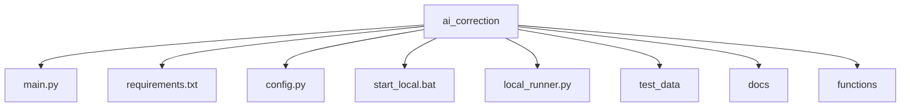
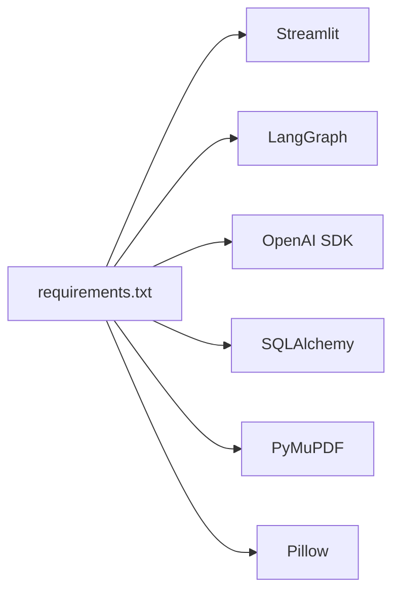
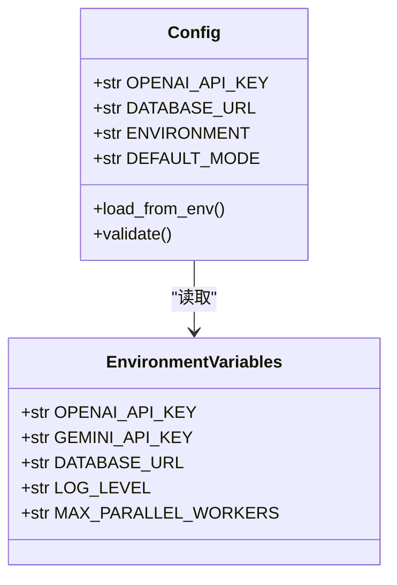
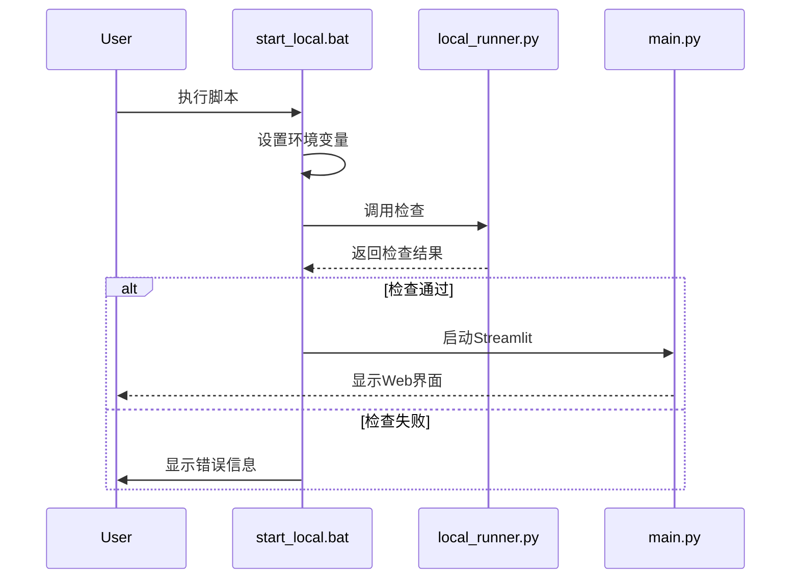
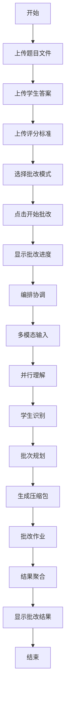

# 快速入门指南

<cite>
**本文档中引用的文件**  
- [README.md](file://ai_correction/README.md)
- [requirements.txt](file://ai_correction/requirements.txt)
- [config.py](file://ai_correction/config.py)
- [start_local.bat](file://ai_correction/start_local.bat)
- [main.py](file://ai_correction/main.py)
- [local_runner.py](file://ai_correction/local_runner.py)
- [ENVIRONMENT_VARIABLES.md](file://ai_correction/docs/ENVIRONMENT_VARIABLES.md)
- [test_data](file://ai_correction/test_data)
</cite>

## 目录
1. [简介](#简介)
2. [项目结构](#项目结构)
3. [环境准备](#环境准备)
4. [依赖安装](#依赖安装)
5. [环境配置](#环境配置)
6. [启动服务](#启动服务)
7. [端到端示例](#端到端示例)
8. [常见问题与解决方案](#常见问题与解决方案)
9. [结论](#结论)

## 简介
本指南旨在帮助新手开发者在本地环境中快速启动并运行aiguru系统。通过本指南，您将学习如何从克隆仓库开始，完成依赖安装、环境配置、服务启动，并成功执行一次AI批改任务。整个过程设计为在10分钟内完成首次成功运行。

**Section sources**
- [README.md](file://ai_correction/README.md)

## 项目结构
aiguru项目采用模块化设计，主要包含以下目录和文件：

- `ai_correction/`：核心应用目录
  - `main.py`：Streamlit应用入口
  - `requirements.txt`：Python依赖包列表
  - `config.py`：系统配置文件
  - `start_local.bat`：Windows本地启动脚本
  - `local_runner.py`：本地运行器，用于环境检查和测试
  - `test_data/`：测试数据目录，包含示例文件
  - `docs/`：完整文档集合
  - `functions/`：核心功能模块



**Diagram sources**
- [README.md](file://ai_correction/README.md)

**Section sources**
- [README.md](file://ai_correction/README.md)

## 环境准备
在开始之前，请确保您的开发环境满足以下要求：

- Python 3.8 或更高版本
- Git（用于克隆仓库）
- Windows操作系统（支持批处理脚本）

首先，克隆项目仓库到本地：
```bash
git clone https://github.com/your-repo/aiguru.git
cd aiguru
```

**Section sources**
- [README.md](file://ai_correction/README.md)

## 依赖安装
项目依赖通过`requirements.txt`文件管理。安装依赖的步骤如下：

1. 确保您位于`ai_correction`目录下
2. 执行以下命令安装所有必需的Python包：

```bash
pip install -r requirements.txt
```

如果遇到网络问题，可以使用国内镜像源：
```bash
pip install -r requirements.txt -i https://pypi.tuna.tsinghua.edu.cn/simple
```

关键依赖包括：
- Streamlit：用于构建Web界面
- LangGraph：工作流编排引擎
- OpenAI SDK：与AI模型交互
- SQLAlchemy：数据库ORM



**Diagram sources**
- [requirements.txt](file://ai_correction/requirements.txt)

**Section sources**
- [requirements.txt](file://ai_correction/requirements.txt)

## 环境配置
正确的环境配置是系统正常运行的关键。主要配置文件和变量如下：

### 配置文件
- `.env.local`：本地开发环境配置（不提交到版本控制）
- `config.py`：主配置文件，包含默认设置

### 关键环境变量
根据`docs/ENVIRONMENT_VARIABLES.md`文档，需要设置以下环境变量：

| 变量名 | 说明 | 示例值 |
|-------|------|-------|
| OPENAI_API_KEY | OpenAI API密钥 | sk-xxxxxxxxxxxxxxxxxxxx |
| DATABASE_URL | 数据库连接字符串 | sqlite:///ai_correction.db |
| ENVIRONMENT | 运行环境 | development |
| DEFAULT_MODE | 默认批改模式 | professional |

创建`.env.local`文件并添加以下内容：
```bash
OPENAI_API_KEY=your-openai-api-key-here
DATABASE_URL=sqlite:///ai_correction.db
ENVIRONMENT=development
DEFAULT_MODE=professional
```



**Diagram sources**
- [config.py](file://ai_correction/config.py)
- [ENVIRONMENT_VARIABLES.md](file://ai_correction/docs/ENVIRONMENT_VARIABLES.md)

**Section sources**
- [config.py](file://ai_correction/config.py)
- [ENVIRONMENT_VARIABLES.md](file://ai_correction/docs/ENVIRONMENT_VARIABLES.md)

## 启动服务
系统提供了两种启动方式：

### 方式1：一键启动（推荐）
对于Windows用户，使用提供的批处理脚本：
```bash
start_local.bat
```

该脚本会自动执行以下操作：
1. 检查并激活虚拟环境（如果存在）
2. 设置必要的环境变量
3. 运行`local_runner.py`进行环境检查
4. 启动Streamlit应用

### 方式2：手动启动
```bash
# 1. 运行本地运行器（检查环境）
python local_runner.py

# 2. 启动应用
streamlit run main.py
```

启动成功后，系统会自动打开浏览器访问`http://localhost:8501`。



**Diagram sources**
- [start_local.bat](file://ai_correction/start_local.bat)
- [local_runner.py](file://ai_correction/local_runner.py)
- [main.py](file://ai_correction/main.py)

**Section sources**
- [start_local.bat](file://ai_correction/start_local.bat)
- [local_runner.py](file://ai_correction/local_runner.py)
- [main.py](file://ai_correction/main.py)

## 端到端示例
本节将指导您完成一次完整的AI批改任务。

### 准备测试数据
系统提供了示例数据在`test_data/`目录中：
- `三角形题目.txt`：数学题目
- `学生答案_三角形.txt`：学生作答
- `三角形评分标准.txt`：评分细则

### 执行批改任务
1. 启动服务后，打开`http://localhost:8501`
2. 在Streamlit界面中：
   - 上传题目文件
   - 上传学生答案文件
   - 上传评分标准文件
3. 选择批改模式（高效模式或专业模式）
4. 点击"开始批改"按钮

系统将显示批改进度，包括8个Agent阶段：
1. 编排协调
2. 多模态输入
3. 并行理解
4. 学生识别
5. 批次规划
6. 生成压缩包
7. 批改作业
8. 结果聚合

批改完成后，您可以在界面中查看详细结果，包括总分、各题得分和详细反馈。



**Diagram sources**
- [test_data](file://ai_correction/test_data)
- [main.py](file://ai_correction/main.py)

**Section sources**
- [test_data](file://ai_correction/test_data)
- [main.py](file://ai_correction/main.py)

## 常见问题与解决方案
### 1. 依赖安装失败
**问题**：pip安装包时超时或失败
**解决方案**：使用国内镜像源
```bash
pip install -r requirements.txt -i https://pypi.tuna.tsinghua.edu.cn/simple
```

### 2. API密钥缺失
**问题**：系统提示"OpenAI API连接失败"
**解决方案**：检查`.env.local`文件中的`OPENAI_API_KEY`是否正确设置

### 3. 数据库初始化失败
**问题**：无法创建数据库文件
**解决方案**：
1. 删除旧的`ai_correction.db`文件
2. 重新运行`local_runner.py`

### 4. LangGraph导入错误
**问题**：ImportError: No module named 'langgraph'
**解决方案**：确保安装正确版本
```bash
pip install langgraph>=0.0.40 langchain>=0.1.0
```

### 5. 文件格式错误
**问题**：上传PDF或图片文件无法处理
**解决方案**：确保安装了PDF支持
```bash
python install_pdf_support.py
```

**Section sources**
- [local_runner.py](file://ai_correction/local_runner.py)
- [ENVIRONMENT_VARIABLES.md](file://ai_correction/docs/ENVIRONMENT_VARIABLES.md)

## 结论
通过本指南，您已经学会了如何在本地环境中快速启动并运行aiguru系统。从克隆仓库到成功执行AI批改任务，整个过程设计简洁高效。记住关键步骤：安装依赖、配置环境变量、启动服务，然后使用提供的测试数据进行首次运行。遇到问题时，参考常见问题解决方案部分。现在，您可以开始探索系统的更多功能了！