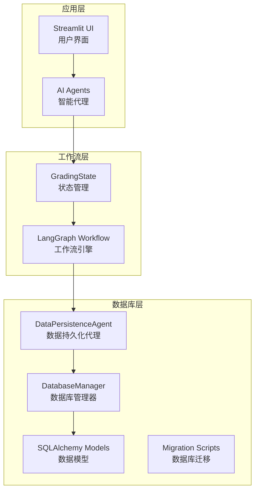
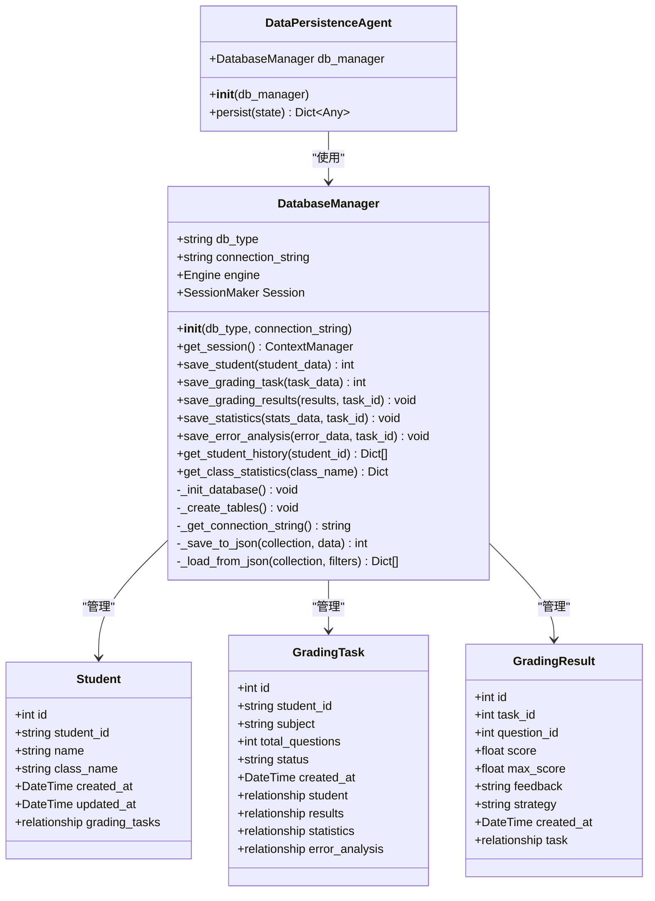
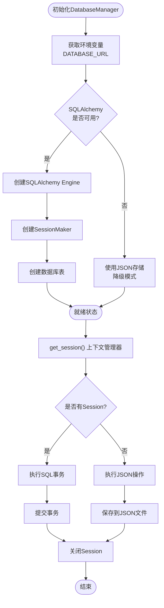
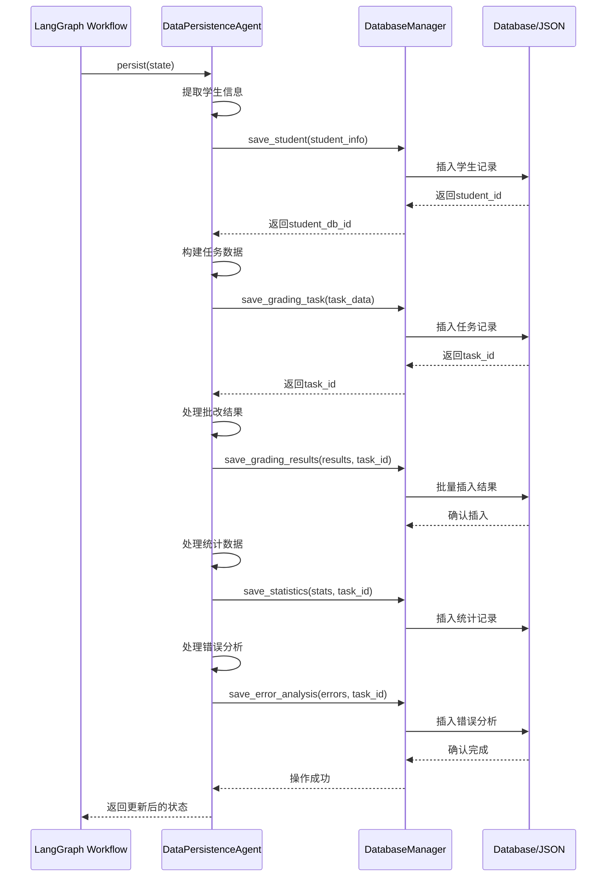
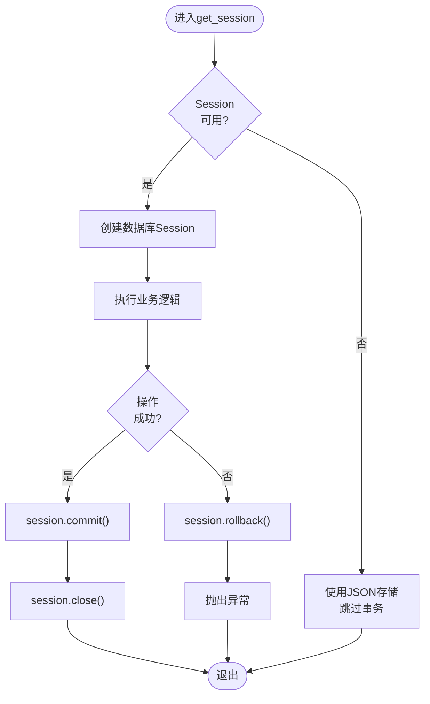
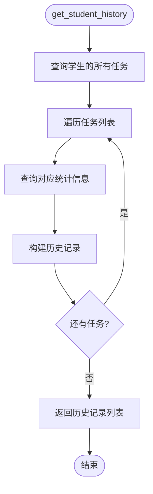
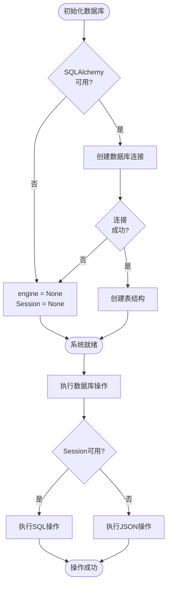
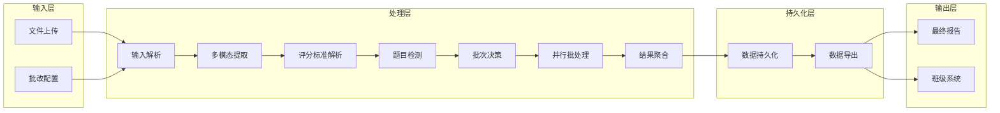
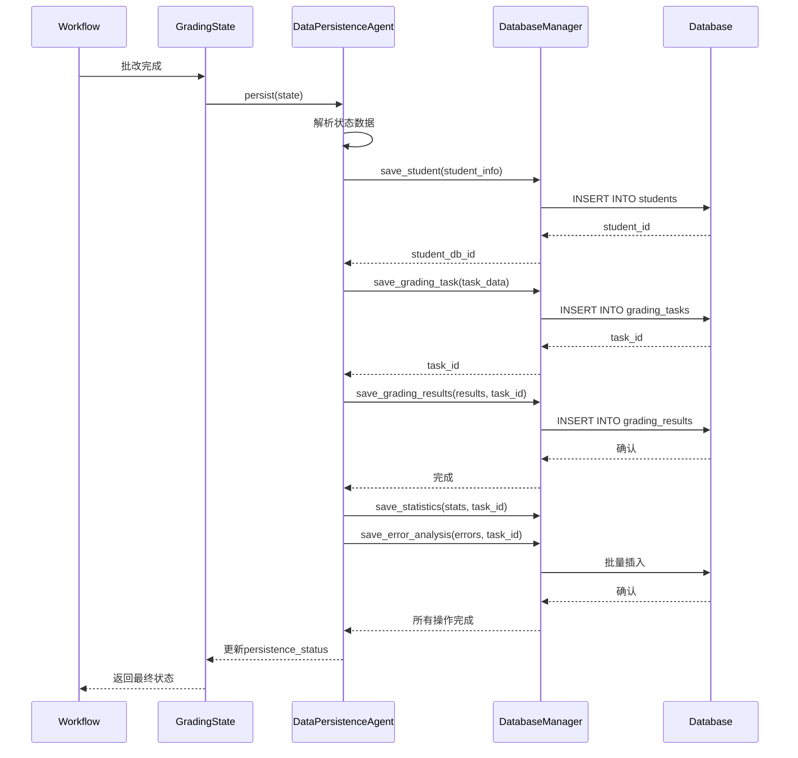
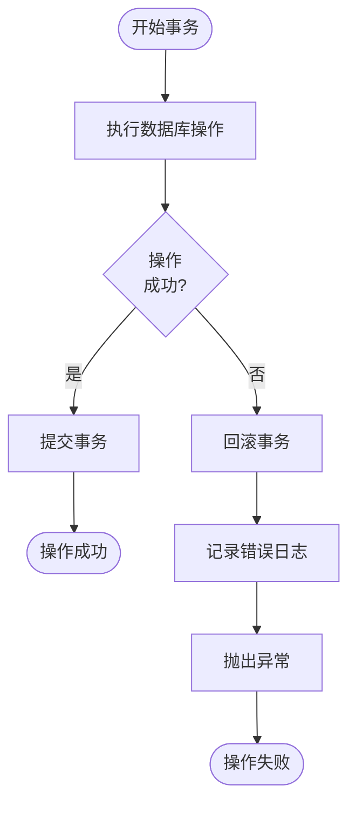

# ORM映射与数据访问层文档

<cite>
**本文档引用的文件**
- [db_manager.py](file://ai_correction/functions/database/db_manager.py)
- [models.py](file://ai_correction/functions/database/models.py)
- [migration.py](file://ai_correction/functions/database/migration.py)
- [state.py](file://ai_correction/functions/langgraph/state.py)
- [workflow_new.py](file://ai_correction/functions/langgraph/workflow_new.py)
- [test_integration.py](file://ai_correction/tests/test_integration.py)
</cite>

## 目录
1. [简介](#简介)
2. [项目结构概览](#项目结构概览)
3. [核心组件分析](#核心组件分析)
4. [SQLAlchemy ORM映射详解](#sqlalchemy-orm映射详解)
5. [DatabaseManager类深度解析](#databasemanager类深度解析)
6. [数据持久化代理](#数据持久化代理)
7. [事务控制与上下文管理](#事务控制与上下文管理)
8. [查询方法与业务逻辑](#查询方法与业务逻辑)
9. [降级策略与JSON存储](#降级策略与json存储)
10. [LangGraph工作流集成](#langgraph工作流集成)
11. [异常处理与回滚机制](#异常处理与回滚机制)
12. [使用示例与最佳实践](#使用示例与最佳实践)
13. [总结](#总结)

## 简介

本文档详细介绍了AIGuru项目中的ORM映射与数据访问层架构，重点分析`db_manager.py`中的`DatabaseManager`类及其相关组件。该系统采用SQLAlchemy ORM框架，实现了完整的数据库操作抽象层，支持PostgreSQL和MySQL数据库，并提供了智能的降级策略以确保系统稳定性。

## 项目结构概览



**图表来源**
- [db_manager.py](file://ai_correction/functions/database/db_manager.py#L1-L50)
- [workflow_new.py](file://ai_correction/functions/langgraph/workflow_new.py#L1-L50)

**章节来源**
- [db_manager.py](file://ai_correction/functions/database/db_manager.py#L1-L333)
- [models.py](file://ai_correction/functions/database/models.py#L1-L260)

## 核心组件分析

### 数据库管理器架构



**图表来源**
- [db_manager.py](file://ai_correction/functions/database/db_manager.py#L15-L100)
- [models.py](file://ai_correction/functions/database/models.py#L15-L150)

**章节来源**
- [db_manager.py](file://ai_correction/functions/database/db_manager.py#L15-L333)
- [models.py](file://ai_correction/functions/database/models.py#L1-L260)

## SQLAlchemy ORM映射详解

### 模型关系设计

系统采用声明式ORM映射，通过SQLAlchemy的declarative_base()创建基础模型类。每个模型都定义了明确的字段属性和关系映射：

#### 学生模型（Student）
- **主键**: `id` (自增整数)
- **唯一标识**: `student_id` (字符串，唯一约束)
- **扩展字段**: `class_name`, `email`, `phone`, `extra_metadata` (JSON)
- **时间戳**: `created_at`, `updated_at` (自动管理)
- **关系**: 一对多关系到`GradingTask`

#### 批改任务模型（GradingTask）
- **外键**: `student_id` (指向Student.student_id)
- **状态管理**: `status` (pending/processing/completed/failed)
- **统计信息**: `total_questions`, `subject`
- **时间戳**: `created_at`, `completed_at`
- **关系**: 多对一到Student，一对多到GradingResult、GradingStatistics、ErrorAnalysis

#### 批改结果模型（GradingResult）
- **复合主键**: `id` (自增)，`task_id` (外键)
- **评分信息**: `score`, `max_score`, `feedback`
- **策略字段**: `strategy` (keyword_match/semantic/rubric/step_by_step)
- **关系**: 多对一到GradingTask

**章节来源**
- [models.py](file://ai_correction/functions/database/models.py#L15-L150)

## DatabaseManager类深度解析

### 初始化与连接管理

DatabaseManager类负责数据库连接的生命周期管理，支持多种数据库类型和智能降级策略：



**图表来源**
- [db_manager.py](file://ai_correction/functions/database/db_manager.py#L15-L80)

### 写入方法实现逻辑

#### save_student方法
- **参数规范**: 接收包含`id`和`name`字段的字典
- **业务逻辑**: 创建Student对象，设置班级信息，默认值为'unknown'
- **返回值**: 新创建学生的数据库ID
- **异常处理**: 数据库连接失败时自动降级到JSON存储

#### save_grading_task方法  
- **参数规范**: 接收包含`student_id`、`subject`、`total_questions`的字典
- **业务逻辑**: 创建GradingTask对象，设置初始状态为'pending'
- **返回值**: 新创建任务的数据库ID
- **批量处理**: 支持并发调用，每个调用独立事务

#### save_grading_results方法
- **参数规范**: 接收结果列表和任务ID
- **业务逻辑**: 遍历结果列表，为每个结果创建GradingResult对象
- **性能优化**: 使用批量插入提高效率
- **数据完整性**: 确保所有结果都属于同一个任务

**章节来源**
- [db_manager.py](file://ai_correction/functions/database/db_manager.py#L80-L150)

## 数据持久化代理

### DataPersistenceAgent架构

DataPersistenceAgent作为LangGraph工作流中的数据持久化桥梁，负责将复杂的批改状态转换为标准化的数据库操作：



**图表来源**
- [db_manager.py](file://ai_correction/functions/database/db_manager.py#L273-L333)

### 状态持久化流程

DataPersistenceAgent的persist方法遵循严格的业务逻辑顺序：

1. **学生信息保存**: 提取state中的student_info，调用save_student
2. **批改任务创建**: 基于学生信息和问题数量创建GradingTask
3. **批改结果存储**: 处理grading_results列表，建立任务与结果的关联
4. **统计数据保存**: 处理aggregated_results中的统计信息
5. **错误分析记录**: 处理error_analysis中的错误分析数据

**章节来源**
- [db_manager.py](file://ai_correction/functions/database/db_manager.py#L273-L333)

## 事务控制与上下文管理

### get_session上下文管理器

get_session方法实现了完整的事务生命周期管理：



**图表来源**
- [db_manager.py](file://ai_correction/functions/database/db_manager.py#L60-L80)

### 事务特性

- **自动提交**: 成功执行业务逻辑后自动提交
- **自动回滚**: 异常发生时自动回滚所有更改
- **资源管理**: 确保Session正确关闭，避免连接泄漏
- **隔离性**: 每个事务相互隔离，保证数据一致性

**章节来源**
- [db_manager.py](file://ai_correction/functions/database/db_manager.py#L60-L80)

## 查询方法与业务逻辑

### get_student_history方法

该方法提供学生历史记录查询功能：



**图表来源**
- [db_manager.py](file://ai_correction/functions/database/db_manager.py#L170-L200)

### get_class_statistics方法

提供班级级别的统计分析：

| 统计指标 | 计算方式 | 用途 |
|---------|---------|------|
| 学生数量 | COUNT(DISTINCT students) | 班级规模统计 |
| 总任务数 | COUNT(tasks) | 批改活动频率 |
| 平均分数 | AVG(statistics.percentage) | 学习效果评估 |
| 班级成绩分布 | 分组统计各等级比例 | 教学质量分析 |

**章节来源**
- [db_manager.py](file://ai_correction/functions/database/db_manager.py#L200-L240)

## 降级策略与JSON存储

### 智能降级机制

当SQLAlchemy不可用或数据库连接失败时，系统自动切换到JSON文件存储：



**图表来源**
- [db_manager.py](file://ai_correction/functions/database/db_manager.py#L30-L60)

### JSON存储实现

#### _save_to_json方法
- **文件组织**: 按集合名称创建独立的JSON文件
- **ID生成**: 自动分配递增ID，确保唯一性
- **时间戳**: 记录创建时间，便于排序和审计
- **数据序列化**: 使用json.dump处理复杂数据类型

#### _load_from_json方法
- **过滤支持**: 支持按字段值过滤记录
- **内存加载**: 一次性加载整个文件到内存
- **兼容性**: 保持与数据库操作相同的接口

**章节来源**
- [db_manager.py](file://ai_correction/functions/database/db_manager.py#L240-L270)

## LangGraph工作流集成

### 工作流架构



**图表来源**
- [workflow_new.py](file://ai_correction/functions/langgraph/workflow_new.py#L30-L80)

### DataPersistenceAgent集成

在LangGraph工作流中，DataPersistenceAgent作为最后一个处理节点，负责将批改结果持久化到数据库：



**图表来源**
- [db_manager.py](file://ai_correction/functions/database/db_manager.py#L283-L333)
- [workflow_new.py](file://ai_correction/functions/langgraph/workflow_new.py#L100-L168)

**章节来源**
- [workflow_new.py](file://ai_correction/functions/langgraph/workflow_new.py#L1-L168)
- [db_manager.py](file://ai_correction/functions/database/db_manager.py#L273-L333)

## 异常处理与回滚机制

### 异常处理策略

系统采用多层次的异常处理机制：

#### 数据库层异常
- **连接异常**: 捕获SQLAlchemy连接错误，自动降级
- **事务异常**: 捕获SQL执行错误，自动回滚
- **约束异常**: 处理唯一性约束、外键约束等数据库约束

#### JSON存储异常
- **文件权限**: 处理文件写入权限不足
- **磁盘空间**: 检测磁盘空间不足
- **序列化异常**: 处理复杂数据类型的序列化失败

### 回滚逻辑



**图表来源**
- [db_manager.py](file://ai_correction/functions/database/db_manager.py#L60-L80)

**章节来源**
- [db_manager.py](file://ai_correction/functions/database/db_manager.py#L300-L333)

## 使用示例与最佳实践

### 完整批改任务示例

以下展示了如何使用DatabaseManager保存一次完整的批改任务：

```python
# 初始化数据库管理器
db_manager = DatabaseManager()

# 1. 保存学生信息
student_data = {
    'id': 'STU2024001',
    'name': '张三',
    'class': '高三(1)班'
}
student_id = db_manager.save_student(student_data)

# 2. 保存批改任务
task_data = {
    'student_id': 'STU2024001',
    'subject': '数学',
    'total_questions': 5
}
task_id = db_manager.save_grading_task(task_data)

# 3. 保存批改结果
grading_results = [
    {
        'question_id': 1,
        'score': 8.5,
        'max_score': 10,
        'feedback': '计算过程正确，但最后一步符号错误',
        'strategy': 'step_by_step'
    },
    {
        'question_id': 2,
        'score': 9.0,
        'max_score': 10,
        'feedback': '思路清晰，表达准确',
        'strategy': 'semantic'
    }
]
db_manager.save_grading_results(grading_results, task_id)

# 4. 保存统计数据
stats_data = {
    'total_score': 17.5,
    'max_score': 20,
    'percentage': 87.5,
    'grade': 'A',
    'statistics': {
        'correct': 2,
        'partial': 1,
        'wrong': 2
    }
}
db_manager.save_statistics(stats_data, task_id)

# 5. 保存错误分析
error_analysis = {
    'error_questions': [
        {
            'question_id': 1,
            'feedback': '符号处理错误，需要强调正负号的重要性'
        },
        {
            'question_id': 3,
            'feedback': '概念理解偏差，建议补充相关知识点讲解'
        }
    ]
}
db_manager.save_error_analysis(error_analysis, task_id)
```

### 查询示例

```python
# 获取学生历史记录
student_history = db_manager.get_student_history('STU2024001')
for record in student_history:
    print(f"任务ID: {record['task_id']}")
    print(f"科目: {record['subject']}")
    print(f"总分: {record['total_score']}/{record['max_score']}")
    print(f"等级: {record['grade']}")

# 获取班级统计
class_stats = db_manager.get_class_statistics('高三(1)班')
print(f"班级: {class_stats['class_name']}")
print(f"学生人数: {class_stats['student_count']}")
print(f"平均分数: {class_stats['average_score']:.2f}%")
```

### LangGraph集成示例

```python
# 在工作流中使用DataPersistenceAgent
from functions.database.db_manager import DataPersistenceAgent

class GradingWorkflow:
    def __init__(self):
        self.persistence_agent = DataPersistenceAgent()
    
    async def process_grading(self, state: dict) -> dict:
        # 执行批改逻辑...
        
        # 持久化结果
        state_with_persistence = self.persistence_agent.persist(state)
        
        # 检查持久化状态
        if state_with_persistence.get('persistence_status') == 'success':
            print(f"批改任务 {state_with_persistence['task_id']} 持久化成功")
        else:
            print("持久化失败:", state_with_persistence.get('persistence_errors'))
        
        return state_with_persistence
```

### 最佳实践建议

1. **事务边界**: 将相关的数据库操作放在同一个事务中
2. **错误处理**: 始终检查持久化状态，处理可能的异常
3. **性能优化**: 对大量数据使用批量插入
4. **监控告警**: 监控数据库连接状态和操作性能
5. **备份策略**: 定期备份重要数据，特别是JSON存储的数据

**章节来源**
- [db_manager.py](file://ai_correction/functions/database/db_manager.py#L80-L333)
- [test_integration.py](file://ai_correction/tests/test_integration.py#L1-L102)

## 总结

AIGuru项目的ORM映射与数据访问层展现了现代Python应用程序的最佳实践：

### 技术亮点

1. **ORM抽象**: 通过SQLAlchemy实现数据库无关的编程模型
2. **智能降级**: 自动检测数据库可用性并切换到JSON存储
3. **事务安全**: 完整的ACID特性保证数据一致性
4. **性能优化**: 支持批量操作和连接池
5. **可扩展性**: 易于添加新的数据模型和业务逻辑

### 架构优势

- **松耦合设计**: 数据访问层与业务逻辑分离
- **测试友好**: 清晰的接口和依赖注入
- **维护性**: 模块化设计便于功能扩展
- **可靠性**: 多层次的错误处理和降级策略

### 应用价值

该数据访问层不仅支持当前的AI批改功能，还为未来的功能扩展奠定了坚实的基础。通过LangGraph工作流的集成，实现了完整的批改流程自动化，从文件上传到结果导出的全链路数据持久化。