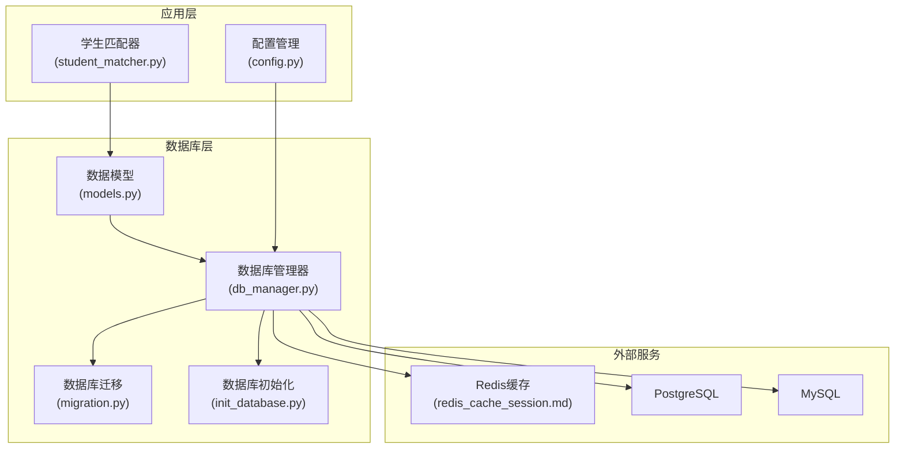
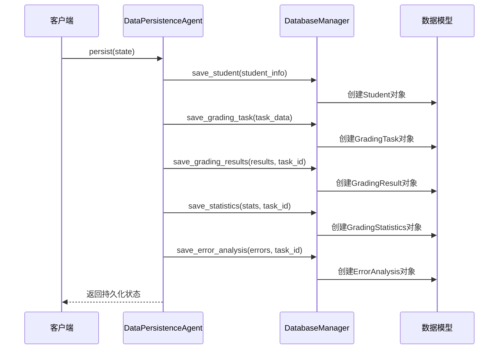
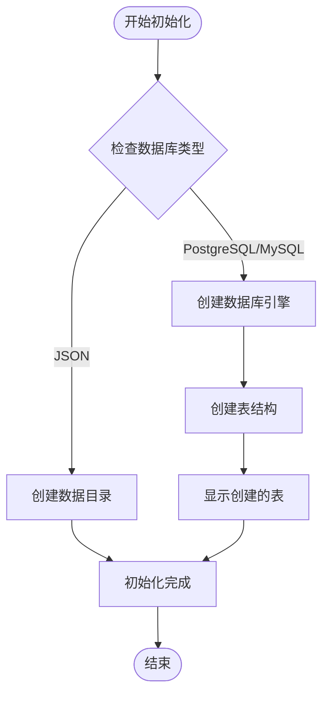
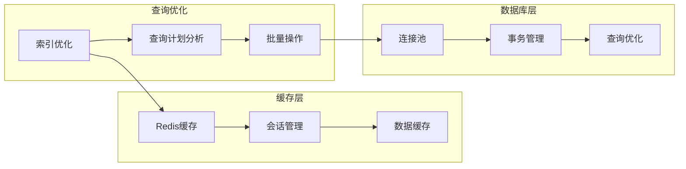
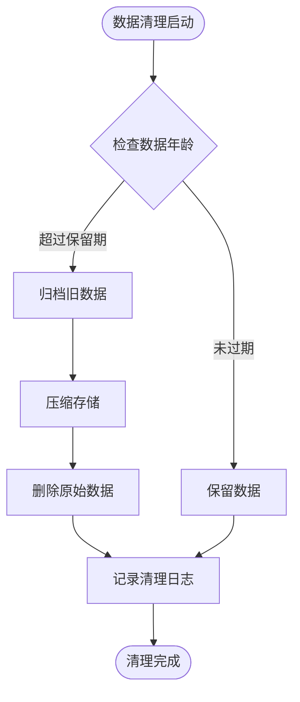
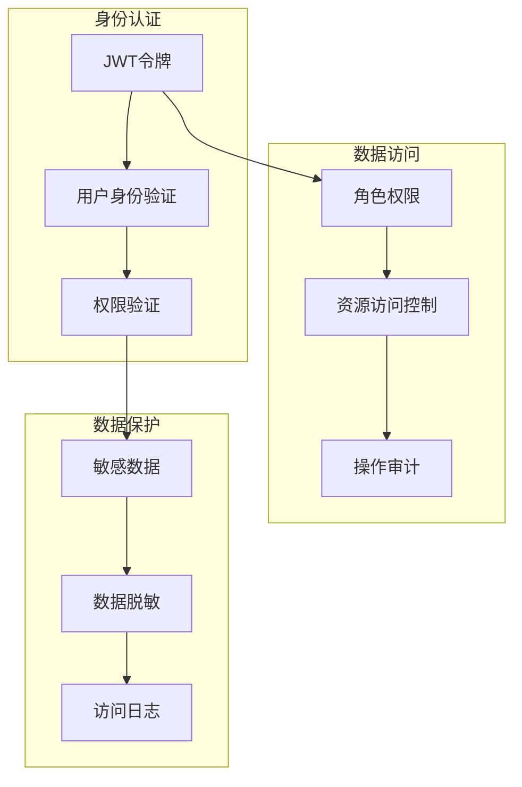
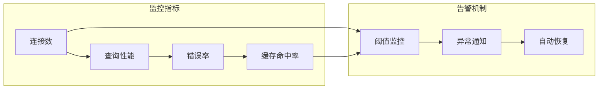

# 数据库设计

<cite>
**本文档引用的文件**
- [models.py](file://ai_correction/functions/database/models.py)
- [db_manager.py](file://ai_correction/functions/database/db_manager.py)
- [init_database.py](file://ai_correction/init_database.py)
- [migration.py](file://ai_correction/functions/database/migration.py)
- [student_matcher.py](file://ai_correction/functions/database/student_matcher.py)
- [config.py](file://ai_correction/config.py)
- [redis_cache_session.md](file://ai_correction/docs/redis_cache_session.md)
</cite>

## 目录
1. [简介](#简介)
2. [项目结构概览](#项目结构概览)
3. [核心数据模型](#核心数据模型)
4. [数据库架构](#数据库架构)
5. [ORM映射详解](#orm映射详解)
6. [数据访问层](#数据访问层)
7. [数据库初始化与迁移](#数据库初始化与迁移)
8. [性能优化策略](#性能优化策略)
9. [数据生命周期管理](#数据生命周期管理)
10. [安全与隐私保护](#安全与隐私保护)
11. [故障排除指南](#故障排除指南)
12. [总结](#总结)

## 简介

本文档详细描述了AI批改系统的核心数据库设计，基于SQLAlchemy ORM框架构建。该系统采用现代化的数据库设计理念，支持PostgreSQL和MySQL数据库，并提供了完整的数据持久化、缓存和会话管理解决方案。

系统的核心目标是为AI智能批改提供可靠的数据存储基础设施，支持大规模教育场景下的学生信息管理、作业批改、成绩统计和知识图谱构建。

## 项目结构概览



**图表来源**
- [models.py](file://ai_correction/functions/database/models.py#L1-L260)
- [db_manager.py](file://ai_correction/functions/database/db_manager.py#L1-L333)
- [migration.py](file://ai_correction/functions/database/migration.py#L1-L247)

**章节来源**
- [models.py](file://ai_correction/functions/database/models.py#L1-L260)
- [db_manager.py](file://ai_correction/functions/database/db_manager.py#L1-L333)
- [init_database.py](file://ai_correction/init_database.py#L1-L112)

## 核心数据模型

### 学生信息模型 (Student)

学生模型是整个系统的核心实体，负责存储和管理学生的基本信息和班级关联。

| 字段名 | 数据类型 | 约束条件 | 描述 |
|--------|----------|----------|------|
| id | Integer | 主键，自增 | 学生记录的唯一标识符 |
| student_id | String(50) | 唯一，非空，索引 | 学生学号，业务主键 |
| name | String(100) | 非空 | 学生姓名 |
| class_id | String(100) | 索引 | 班级ID，支持班级系统集成 |
| class_name | String(100) | 可空 | 班级名称 |
| email | String(200) | 可空 | 学生邮箱地址 |
| phone | String(50) | 可空 | 学生联系电话 |
| extra_metadata | JSON | 可空 | 其他元数据信息 |
| created_at | DateTime | 默认当前时间 | 记录创建时间 |
| updated_at | DateTime | 默认当前时间，更新时自动更新 | 记录最后修改时间 |

**关系映射：**
- 一对多：一个学生可以有多个批改任务
- 反向关系：`Student.grading_tasks`

### 批改任务模型 (GradingTask)

批改任务模型记录每个学生的作业批改请求和状态信息。

| 字段名 | 数据类型 | 约束条件 | 描述 |
|--------|----------|----------|------|
| id | Integer | 主键，自增 | 任务记录的唯一标识符 |
| student_id | String(50) | 外键，非空，索引 | 关联的学生学号 |
| subject | String(50) | 可空 | 科目名称 |
| total_questions | Integer | 默认0 | 总题数 |
| status | String(20) | 默认'pending' | 任务状态：pending/processing/completed/failed |
| created_at | DateTime | 默认当前时间 | 任务创建时间 |
| completed_at | DateTime | 可空 | 任务完成时间 |

**关系映射：**
- 多对一：一个任务属于一个学生
- 一对多：一个任务可以有多个批改结果
- 一对多：一个任务可以有多个错误分析
- 一对一：一个任务对应一个统计信息

### 批改结果模型 (GradingResult)

批改结果模型存储每道题的具体批改信息，支持多种批改策略。

| 字段名 | 数据类型 | 约束条件 | 描述 |
|--------|----------|----------|------|
| id | Integer | 主键，自增 | 结果记录的唯一标识符 |
| task_id | Integer | 外键，非空，索引 | 关联的批改任务ID |
| question_id | Integer | 非空 | 题目编号 |
| score | Float | 非空 | 实际得分 |
| max_score | Float | 非空 | 最高分 |
| feedback | Text | 可空 | 批改反馈 |
| strategy | String(50) | 可空 | 批改策略：keyword_match/semantic/rubric/step_by_step |
| created_at | DateTime | 默认当前时间 | 结果创建时间 |

**关系映射：**
- 多对一：多个结果属于一个批改任务

### 班级模型 (Class)

班级模型支持现代教育系统中的班级管理需求。

| 字段名 | 数据类型 | 约束条件 | 描述 |
|--------|----------|----------|------|
| id | Integer | 主键，自增 | 班级记录的唯一标识符 |
| class_id | String(100) | 唯一，非空，索引 | 班级唯一标识符 |
| class_name | String(100) | 非空 | 班级名称 |
| teacher_id | String(100) | 非空，索引 | 教师ID |
| subject | String(50) | 可空 | 授课科目 |
| student_count | Integer | 默认0 | 学生人数统计 |
| created_at | DateTime | 默认当前时间 | 班级创建时间 |
| updated_at | DateTime | 默认当前时间，更新时自动更新 | 最后更新时间 |

**关系映射：**
- 多对一：一个班级可以有多个作业
- 多对一：一个班级可以有多个评价

### 作业提交模型 (AssignmentSubmission)

作业提交模型是系统中最复杂的模型之一，支持完整的作业管理流程。

| 字段名 | 数据类型 | 约束条件 | 描述 |
|--------|----------|----------|------|
| id | Integer | 主键，自增 | 提交记录的唯一标识符 |
| submission_id | String(100) | 唯一，非空，索引 | 提交唯一标识符 |
| assignment_id | String(100) | 外键，非空，索引 | 关联的作业ID |
| student_id | String(50) | 外键，非空，索引 | 关联的学生ID |
| task_id | String(100) | 唯一，索引 | LangGraph任务ID |
| answer_files | JSON | 可空 | 答卷文件列表 |
| submitted_at | DateTime | 默认当前时间 | 提交时间 |
| grading_status | String(20) | 默认'pending' | 批改状态 |
| grading_mode | String(20) | 可空 | 批改模式：efficient/professional |
| total_score | Float | 可空 | 总得分 |
| max_score | Float | 可空 | 最高分 |
| percentage | Float | 可空 | 百分比成绩 |
| grade_level | String(10) | 可空 | 等级：A/B/C/D/F |
| student_evaluation | JSON | 可空 | 学生个人评价 |
| evaluations | JSON | 可空 | 各题评分详情 |
| annotations | JSON | 可空 | 坐标标注数据 |
| export_payload | JSON | 可空 | 导出到班级系统的数据包 |
| push_status | String(20) | 可空 | 导出状态：success/failed/pending |
| push_timestamp | DateTime | 可空 | 导出时间戳 |
| mm_tokens | JSON | 可空 | 多模态token数据 |
| questions | JSON | 可空 | 题目划分数据 |
| batches | JSON | 可空 | 批次划分数据 |
| errors | JSON | 可空 | 错误日志 |
| created_at | DateTime | 默认当前时间 | 记录创建时间 |
| updated_at | DateTime | 默认当前时间，更新时自动更新 | 记录最后修改时间 |

**关系映射：**
- 多对一：一个提交属于一个作业
- 多对一：一个提交属于一个学生

**章节来源**
- [models.py](file://ai_correction/functions/database/models.py#L15-L260)

## 数据库架构

### 实体关系图

```mermaid
erDiagram
STUDENT {
int id PK
string student_id UK
string name
string class_id IDX
string class_name
string email
string phone
json extra_metadata
datetime created_at
datetime updated_at
}
GRADING_TASK {
int id PK
string student_id FK
string subject
int total_questions
string status
datetime created_at
datetime completed_at
}
GRADING_RESULT {
int id PK
int task_id FK
int question_id
float score
float max_score
text feedback
string strategy
datetime created_at
}
GRADING_STATISTICS {
int id PK
int task_id FK UK
float total_score
float max_score
float percentage
string grade
json statistics_json
datetime created_at
}
ERROR_ANALYSIS {
int id PK
int task_id FK
int question_id
string error_type
text description
text suggestion
datetime created_at
}
CLASS {
int id PK
string class_id UK
string class_name
string teacher_id
string subject
int student_count
datetime created_at
datetime updated_at
}
ASSIGNMENT {
int id PK
string assignment_id UK
string class_id FK
string teacher_id
string subject
string title
text description
string rubric_id
text rubric_text
json rubric_struct
int total_questions
float max_score
string mode
datetime deadline
datetime created_at
datetime updated_at
}
ASSIGNMENT_SUBMISSION {
int id PK
string submission_id UK
string assignment_id FK
string student_id FK
string task_id UK
json answer_files
datetime submitted_at
string grading_status
string grading_mode
float total_score
float max_score
float percentage
string grade_level
json student_evaluation
json evaluations
json annotations
json export_payload
string push_status
datetime push_timestamp
json mm_tokens
json questions
json batches
json errors
datetime created_at
datetime updated_at
}
CLASS_EVALUATION {
int id PK
string evaluation_id UK
string class_id FK
string assignment_id FK
int student_count
float average_score
float max_score_value
float min_score_value
float median_score
float average_percentage
float pass_rate
json score_distribution
json common_issues
json excellent_performances
json knowledge_mastery
json teaching_suggestions
json evaluation_data
datetime generated_at
datetime created_at
}
STUDENT_KNOWLEDGE_POINT {
int id PK
string student_id FK
string knowledge_point
string subject
float mastery_level
int correct_count
int total_count
string last_assignment_id
float last_score
datetime last_evaluated_at
datetime created_at
datetime updated_at
}
STUDENT ||--o{ GRADING_TASK : "has"
GRADING_TASK ||--o{ GRADING_RESULT : "produces"
GRADING_TASK ||--|| GRADING_STATISTICS : "has"
GRADING_TASK ||--o{ ERROR_ANALYSIS : "analyzes"
CLASS ||--o{ ASSIGNMENT : "hosts"
ASSIGNMENT ||--o{ ASSIGNMENT_SUBMISSION : "receives"
ASSIGNMENT_SUBMISSION ||--|| STUDENT : "submitted_by"
CLASS ||--o{ CLASS_EVALUATION : "evaluates"
STUDENT ||--o{ STUDENT_KNOWLEDGE_POINT : "tracks"
```

**图表来源**
- [models.py](file://ai_correction/functions/database/models.py#L15-L260)

### 数据库表结构

系统包含以下核心表：

1. **学生表 (students)** - 存储学生基本信息
2. **批改任务表 (grading_tasks)** - 记录批改请求
3. **批改结果表 (grading_results)** - 存储具体批改结果
4. **统计表 (grading_statistics)** - 成绩统计信息
5. **错误分析表 (error_analysis)** - 错误诊断信息
6. **班级表 (classes)** - 班级管理
7. **作业表 (assignments)** - 作业发布
8. **作业提交表 (assignment_submissions)** - 作业提交记录
9. **班级评价表 (class_evaluations)** - 班级整体评价
10. **学生知识点掌握表 (student_knowledge_points)** - 知识点追踪

**章节来源**
- [models.py](file://ai_correction/functions/database/models.py#L15-L260)

## ORM映射详解

### SQLAlchemy声明式基类

系统使用SQLAlchemy的声明式基类来定义数据模型：

```python
Base = declarative_base()
```

这种设计模式提供了以下优势：
- 自动表名生成（类名的小写形式）
- 自动主键生成
- 关系映射支持
- 查询接口统一

### 字段类型映射

| Python类型 | SQLAlchemy类型 | 数据库类型 | 约束 |
|------------|----------------|------------|------|
| int | Integer | INTEGER | 主键、自增 |
| str | String(size) | VARCHAR(size) | 长度限制 |
| float | Float | FLOAT | 浮点数精度 |
| text | Text | TEXT | 大文本 |
| json | JSON | JSON/JSONB | 结构化数据 |
| datetime | DateTime | TIMESTAMP | 时间戳 |

### 关系定义

系统使用SQLAlchemy的关系映射来建立表间关联：

```python
# 一对多关系
student = relationship('Student', back_populates='grading_tasks')

# 多对一关系  
task = relationship('GradingTask', back_populates='results')

# 一对一关系
statistics = relationship('GradingStatistics', back_populates='task', uselist=False)
```

**章节来源**
- [models.py](file://ai_correction/functions/database/models.py#L10-L260)

## 数据访问层

### DatabaseManager类

DatabaseManager是系统的主要数据访问接口，提供统一的数据库操作方法。

#### 核心功能

1. **数据库连接管理**
   - 支持PostgreSQL和MySQL
   - 环境变量配置
   - 连接池管理

2. **CRUD操作**
   - 保存学生信息
   - 创建批改任务
   - 存储批改结果
   - 保存统计数据
   - 错误分析

3. **查询功能**
   - 获取学生历史记录
   - 班级统计查询
   - 批量数据检索

#### 数据持久化代理

DataPersistenceAgent封装了完整的数据持久化流程：



**图表来源**
- [db_manager.py](file://ai_correction/functions/database/db_manager.py#L280-L333)

### 备用存储方案

当数据库不可用时，系统自动切换到JSON文件存储：

```python
def _save_to_json(self, collection: str, data: Dict) -> int:
    """保存到JSON文件作为备用方案"""
    file_path = f'data/{collection}.json'
    # JSON文件操作逻辑
```

**章节来源**
- [db_manager.py](file://ai_correction/functions/database/db_manager.py#L1-L333)

## 数据库初始化与迁移

### 初始化流程



**图表来源**
- [init_database.py](file://ai_correction/init_database.py#L15-L50)

### 迁移策略

系统采用Alembic进行数据库版本管理：

#### DatabaseMigrationManager类功能

1. **Alembic初始化**
   ```python
   def init_alembic(self):
       """初始化Alembic配置"""
       # 创建迁移目录
       # 配置Alembic设置
   ```

2. **迁移脚本生成**
   ```python
   def create_migration(self, message: str = None):
       """创建新的迁移脚本"""
       # 自动生成迁移脚本
       # 基于模型变更
   ```

3. **版本控制**
   - 升级到指定版本
   - 降级到指定版本
   - 查看当前版本
   - 查看迁移历史

#### CLI命令支持

系统提供完整的CLI工具：

```bash
# 初始化Alembic
python migration.py init

# 创建迁移脚本
python migration.py create -m "添加新表"

# 升级到最新版本
python migration.py upgrade

# 降级到上一个版本
python migration.py downgrade -r -1

# 查看当前版本
python migration.py current

# 查看迁移历史
python migration.py history

# 直接创建所有表（开发环境）
python migration.py create_tables
```

**章节来源**
- [init_database.py](file://ai_correction/init_database.py#L1-L112)
- [migration.py](file://ai_correction/functions/database/migration.py#L1-L247)

## 性能优化策略

### 索引设计

系统在关键字段上建立了适当的索引：

| 表名 | 索引字段 | 类型 | 用途 |
|------|----------|------|------|
| students | student_id | 唯一索引 | 快速查找学生 |
| students | class_id | 普通索引 | 班级查询 |
| grading_tasks | student_id | 普通索引 | 学生任务查询 |
| grading_tasks | status | 普通索引 | 状态筛选 |
| grading_results | task_id | 普通索引 | 任务结果查询 |
| assignments | class_id | 普通索引 | 班级作业查询 |
| assignment_submissions | student_id | 普通索引 | 学生提交查询 |
| assignment_submissions | assignment_id | 普通索引 | 作业提交查询 |

### 查询优化

1. **批量操作**
   - 批量保存批改结果
   - 批量查询学生历史
   - 批量更新统计数据

2. **连接池管理**
   - SQLAlchemy会话管理
   - 连接复用
   - 自动事务处理

3. **缓存策略**
   - Redis缓存集成
   - 会话状态管理
   - 频繁查询结果缓存

### 性能监控



**图表来源**
- [redis_cache_session.md](file://ai_correction/docs/redis_cache_session.md#L1-L440)

**章节来源**
- [models.py](file://ai_correction/functions/database/models.py#L15-L260)
- [db_manager.py](file://ai_correction/functions/database/db_manager.py#L1-L333)

## 数据生命周期管理

### 数据保留策略

1. **短期数据**
   - 批改任务：30天
   - 临时会话：24小时
   - 缓存数据：1小时

2. **中期数据**
   - 学生历史记录：1年
   - 班级统计：6个月
   - 知识点掌握：3个月

3. **长期数据**
   - 学生基础信息：永久
   - 班级信息：永久
   - 作业模板：永久

### 数据清理机制



### 数据备份策略

1. **实时备份**
   - PostgreSQL/MySQL主从复制
   - 自动快照创建

2. **定期备份**
   - 每日增量备份
   - 每周完整备份
   - 月度归档备份

3. **灾难恢复**
   - 多地域备份
   - 快速恢复机制
   - 数据一致性验证

**章节来源**
- [config.py](file://ai_correction/config.py#L40-L50)

## 安全与隐私保护

### 数据加密

1. **传输加密**
   - SSL/TLS连接
   - 环境变量加密
   - 敏感数据脱敏

2. **存储加密**
   - 数据库连接加密
   - 文件系统加密
   - 缓存数据加密

### 访问控制



### 隐私保护措施

1. **数据最小化**
   - 仅收集必要信息
   - 定期清理无用数据
   - 数据匿名化处理

2. **用户权利**
   - 数据查看权
   - 数据删除权
   - 数据导出权

3. **合规性**
   - GDPR合规
   - 教育数据保护法规
   - 数据本地化要求

### 安全审计

- 操作日志记录
- 异常访问检测
- 定期安全评估
- 漏洞扫描和修复

**章节来源**
- [config.py](file://ai_correction/config.py#L1-L83)

## 故障排除指南

### 常见问题及解决方案

#### 1. 数据库连接问题

**症状：** 连接超时或拒绝连接
**解决方案：**
```python
# 检查数据库配置
print(f"数据库类型: {DATABASE_TYPE}")
print(f"连接字符串: {DATABASE_URL}")

# 测试连接
from functions.database import DatabaseManager
db = DatabaseManager()
```

#### 2. 表结构不一致

**症状：** ORM模型与数据库表结构不匹配
**解决方案：**
```bash
# 检查当前版本
python migration.py current

# 创建迁移脚本
python migration.py create -m "修复表结构"

# 应用迁移
python migration.py upgrade
```

#### 3. 性能问题

**症状：** 查询响应缓慢
**解决方案：**
- 检查索引是否正确创建
- 分析查询执行计划
- 考虑添加缓存层
- 优化批量操作

#### 4. 数据一致性问题

**症状：** 数据不一致或丢失
**解决方案：**
- 检查事务处理
- 验证外键约束
- 检查数据完整性
- 执行数据修复脚本

### 监控和告警



### 日志分析

系统提供详细的日志记录：

1. **数据库操作日志**
   - SQL语句记录
   - 执行时间统计
   - 错误信息记录

2. **应用层日志**
   - 业务操作记录
   - 性能指标监控
   - 用户行为跟踪

3. **系统日志**
   - 服务器状态
   - 资源使用情况
   - 安全事件记录

**章节来源**
- [init_database.py](file://ai_correction/init_database.py#L50-L112)
- [migration.py](file://ai_correction/functions/database/migration.py#L200-L247)

## 总结

AI批改系统的数据库设计体现了现代软件架构的最佳实践：

### 设计亮点

1. **模块化架构**
   - 清晰的职责分离
   - 可扩展的设计模式
   - 良好的测试覆盖

2. **高性能设计**
   - 优化的索引策略
   - 缓存集成
   - 连接池管理

3. **安全性保障**
   - 多层次安全防护
   - 数据加密存储
   - 访问控制机制

4. **可维护性**
   - 完整的迁移管理
   - 备用存储方案
   - 详细的文档说明

### 技术创新

1. **混合存储架构**
   - 关系数据库与JSON存储结合
   - 动态数据类型支持
   - 灵活的扩展能力

2. **智能匹配算法**
   - 姓名模糊匹配
   - OCR错误纠正
   - 多维度消歧处理

3. **知识图谱集成**
   - 知识点掌握追踪
   - 学习路径分析
   - 个性化推荐支持

### 发展方向

1. **云原生优化**
   - 容器化部署
   - 微服务架构
   - 自动扩缩容

2. **AI增强功能**
   - 智能数据清洗
   - 自动特征提取
   - 预测性分析

3. **国际化支持**
   - 多语言数据处理
   - 跨文化适配
   - 地域化优化

该数据库设计为AI智能批改系统提供了坚实的数据基础设施，支持大规模教育场景下的高效数据处理和分析需求。通过持续的优化和改进，系统将能够更好地服务于未来的教育技术发展。