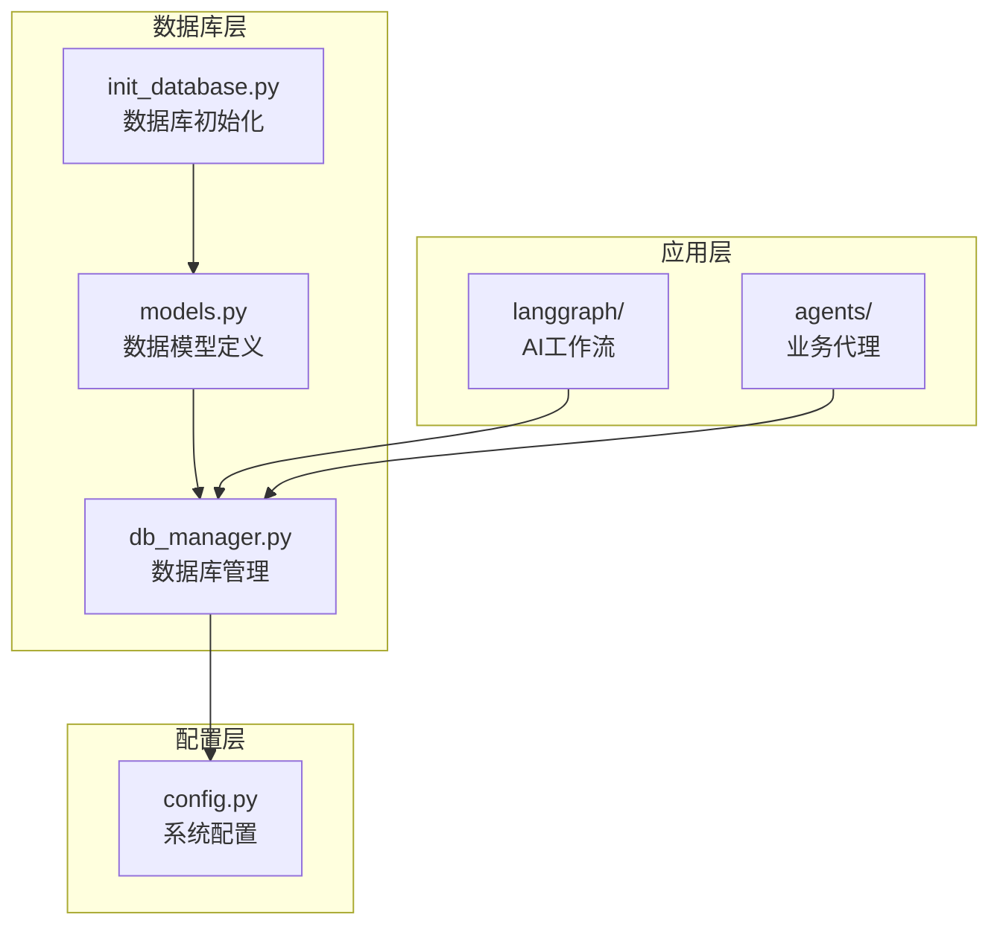
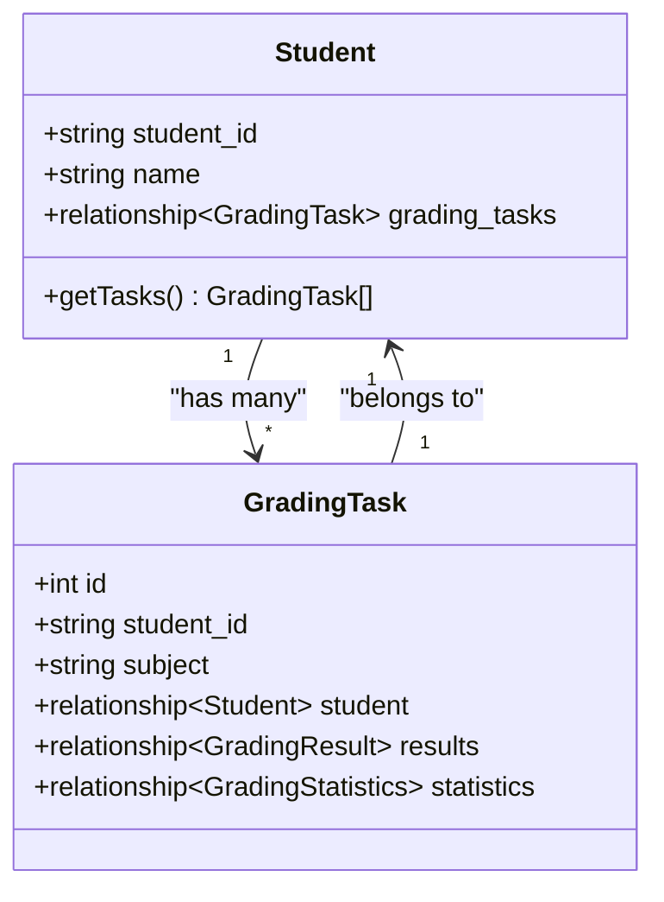
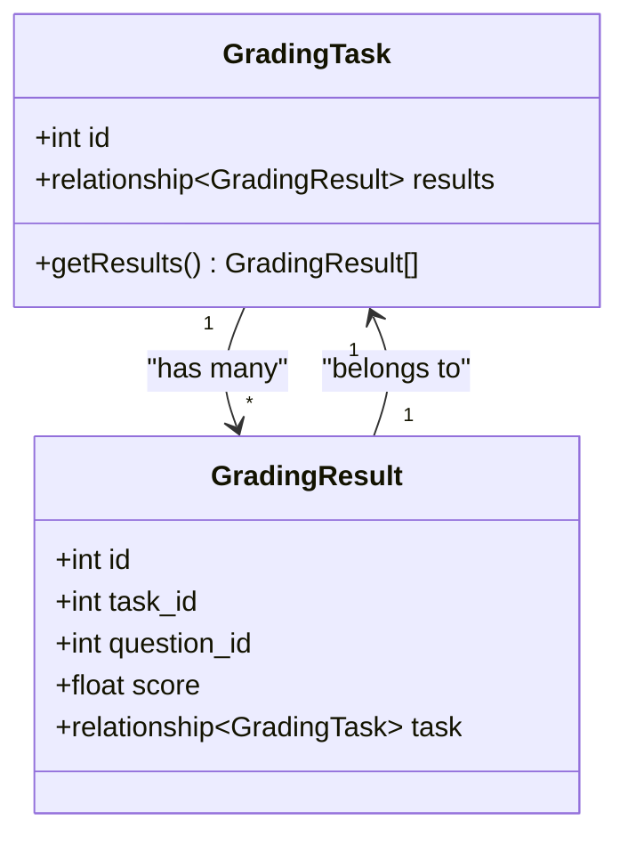
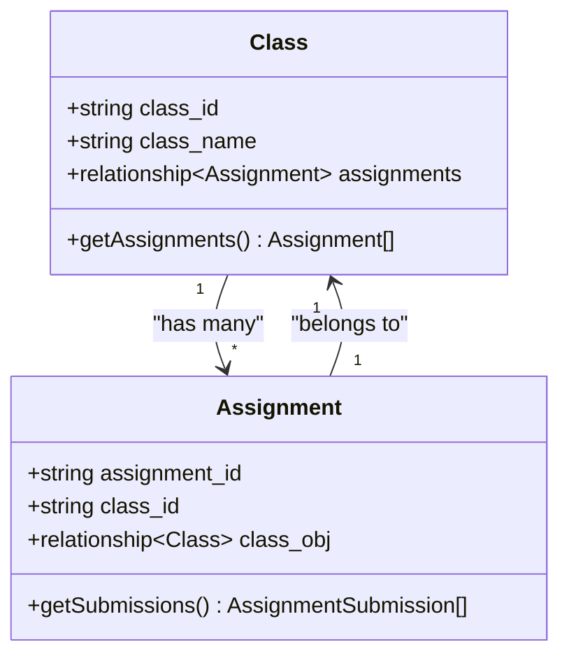
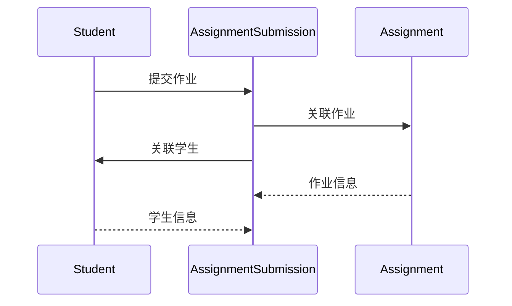

现在我有了足够的信息来创建完整的数据模型文档。让我基于分析的内容生成文档：

<docs>
# 数据模型

<cite>
**本文档引用的文件**
- [models.py](file://ai_correction/functions/database/models.py)
- [db_manager.py](file://ai_correction/functions/database/db_manager.py)
- [init_database.py](file://ai_correction/init_database.py)
- [config.py](file://ai_correction/config.py)
</cite>

## 目录
1. [简介](#简介)
2. [项目结构概览](#项目结构概览)
3. [核心数据模型](#核心数据模型)
4. [实体关系图](#实体关系图)
5. [字段详细说明](#字段详细说明)
6. [JSON字段使用场景](#json字段使用场景)
7. [索引策略与性能优化](#索引策略与性能优化)
8. [模型关系分析](#模型关系分析)
9. [业务场景应用](#业务场景应用)
10. [总结](#总结)

## 简介

本文档详细描述了AI批改系统中的核心数据模型，基于`models.py`文件中定义的实体关系。该系统采用SQLAlchemy ORM框架，支持PostgreSQL、MySQL和JSON文件存储三种数据库模式，为教育领域的智能批改提供了完整的数据基础设施。

## 项目结构概览



**图表来源**
- [models.py](file://ai_correction/functions/database/models.py#L1-L260)
- [db_manager.py](file://ai_correction/functions/database/db_manager.py#L1-L333)
- [config.py](file://ai_correction/config.py#L1-L83)

**章节来源**
- [models.py](file://ai_correction/functions/database/models.py#L1-L260)
- [db_manager.py](file://ai_correction/functions/database/db_manager.py#L1-L333)

## 核心数据模型

系统定义了九个核心数据模型，涵盖了学生管理、作业管理、批改流程和数据分析的完整业务链路。

### Student（学生表）

学生表是整个系统的基础实体，扩展支持班级系统集成。

| 字段名 | 数据类型 | 约束 | 描述 |
|--------|----------|------|------|
| id | Integer | 主键，自增 | 学生记录唯一标识 |
| student_id | String(50) | 唯一，非空，索引 | 学生编号 |
| name | String(100) | 非空 | 学生姓名 |
| class_id | String(100) | 索引 | 班级编号 |
| class_name | String(100) | - | 班级名称 |
| email | String(200) | - | 邮箱地址 |
| phone | String(50) | - | 联系电话 |
| extra_metadata | JSON | - | 其他元数据 |
| created_at | DateTime | 默认当前时间 | 创建时间 |
| updated_at | DateTime | 默认当前时间，自动更新 | 更新时间 |

### GradingTask（批改任务表）

批改任务表记录每个学生的批改请求和进度状态。

| 字段名 | 数据类型 | 约束 | 描述 |
|--------|----------|------|------|
| id | Integer | 主键，自增 | 任务唯一标识 |
| student_id | String(50) | 外键，非空，索引 | 关联的学生编号 |
| subject | String(50) | - | 科目名称 |
| total_questions | Integer | 默认0 | 总题数 |
| status | String(20) | 默认'pending' | 任务状态 |
| created_at | DateTime | 默认当前时间 | 创建时间 |
| completed_at | DateTime | - | 完成时间 |

### GradingResult（批改结果表）

逐题记录批改结果，支持多种评分策略。

| 字段名 | 数据类型 | 约束 | 描述 |
|--------|----------|------|------|
| id | Integer | 主键，自增 | 结果记录唯一标识 |
| task_id | Integer | 外键，非空，索引 | 关联的任务ID |
| question_id | Integer | 非空 | 题目编号 |
| score | Float | 非空 | 实得分数 |
| max_score | Float | 非空 | 最高分 |
| feedback | Text | - | 评语 |
| strategy | String(50) | - | 评分策略 |
| created_at | DateTime | 默认当前时间 | 创建时间 |

### Assignment（作业表）

作业表支持班级系统集成，管理作业的完整生命周期。

| 字段名 | 数据类型 | 约束 | 描述 |
|--------|----------|------|------|
| id | Integer | 主键，自增 | 作业唯一标识 |
| assignment_id | String(100) | 唯一，非空，索引 | 作业编号 |
| class_id | String(100) | 外键，非空，索引 | 班级编号 |
| teacher_id | String(100) | 非空，索引 | 教师编号 |
| subject | String(50) | - | 科目 |
| title | String(200) | 非空 | 作业标题 |
| description | Text | - | 作业描述 |
| rubric_id | String(100) | - | 评分标准ID |
| rubric_text | Text | - | 评分标准文本 |
| rubric_struct | JSON | - | 结构化评分标准 |
| total_questions | Integer | 默认0 | 总题数 |
| max_score | Float | 默认0 | 最高分 |
| mode | String(20) | 默认'professional' | 批改模式 |
| deadline | DateTime | - | 截止时间 |
| created_at | DateTime | 默认当前时间 | 创建时间 |
| updated_at | DateTime | 默认当前时间，自动更新 | 更新时间 |

### ClassEvaluation（班级评价表）

班级评价表提供班级整体分析和教学建议。

| 字段名 | 数据类型 | 约束 | 描述 |
|--------|----------|------|------|
| id | Integer | 主键，自增 | 评价记录唯一标识 |
| evaluation_id | String(100) | 唯一，非空，索引 | 评价编号 |
| class_id | String(100) | 外键，非空，索引 | 班级编号 |
| assignment_id | String(100) | 外键，非空，索引 | 作业编号 |
| student_count | Integer | 非空 | 学生人数 |
| average_score | Float | - | 平均分 |
| max_score_value | Float | - | 最高分 |
| min_score_value | Float | - | 最低分 |
| median_score | Float | - | 中位数 |
| average_percentage | Float | - | 平均百分比 |
| pass_rate | Float | - | 及格率 |
| score_distribution | JSON | - | 分数分布 |
| common_issues | JSON | - | 共性问题 |
| excellent_performances | JSON | - | 优秀表现 |
| knowledge_mastery | JSON | - | 知识点掌握情况 |
| teaching_suggestions | JSON | - | 教学建议 |
| evaluation_data | JSON | - | 完整评价数据 |
| generated_at | DateTime | 默认当前时间 | 生成时间 |
| created_at | DateTime | 默认当前时间 | 创建时间 |

**章节来源**
- [models.py](file://ai_correction/functions/database/models.py#L15-L260)

## 实体关系图

```mermaid
erDiagram
STUDENT {
integer id PK
string student_id UK
string name
string class_id IDX
string class_name
string email
string phone
json extra_metadata
datetime created_at
datetime updated_at
}
GRADING_TASK {
integer id PK
string student_id FK
string subject
integer total_questions
string status
datetime created_at
datetime completed_at
}
GRADING_RESULT {
integer id PK
integer task_id FK
integer question_id
float score
float max_score
text feedback
string strategy
datetime created_at
}
ASSIGNMENT {
integer id PK
string assignment_id UK
string class_id FK
string teacher_id IDX
string subject
string title
text description
string rubric_id
text rubric_text
json rubric_struct
integer total_questions
float max_score
string mode
datetime deadline
datetime created_at
datetime updated_at
}
CLASS_EVALUATION {
integer id PK
string evaluation_id UK
string class_id FK
string assignment_id FK
integer student_count
float average_score
float max_score_value
float min_score_value
float median_score
float average_percentage
float pass_rate
json score_distribution
json common_issues
json excellent_performances
json knowledge_mastery
json teaching_suggestions
json evaluation_data
datetime generated_at
datetime created_at
}
CLASS {
integer id PK
string class_id UK
string class_name
string teacher_id IDX
string subject
integer student_count
datetime created_at
datetime updated_at
}
ASSIGNMENT_SUBMISSION {
integer id PK
string submission_id UK
string assignment_id FK
string student_id FK
string task_id UK
json answer_files
datetime submitted_at
string grading_status
string grading_mode
float total_score
float max_score
float percentage
string grade_level
json student_evaluation
json evaluations
json annotations
json export_payload
string push_status
datetime push_timestamp
json mm_tokens
json questions
json batches
json errors
datetime created_at
datetime updated_at
}
STUDENT_KNOWLEDGE_POINT {
integer id PK
string student_id FK
string knowledge_point
string subject
float mastery_level
integer correct_count
integer total_count
string last_assignment_id
float last_score
datetime last_evaluated_at
datetime created_at
datetime updated_at
}
STUDENT ||--o{ GRADING_TASK : "has many"
GRADING_TASK ||--o{ GRADING_RESULT : "has many"
GRADING_TASK ||--|| STUDENT : "belongs to"
CLASS ||--o{ ASSIGNMENT : "has many"
ASSIGNMENT ||--o{ ASSIGNMENT_SUBMISSION : "has many"
ASSIGNMENT ||--|| CLASS : "belongs to"
CLASS ||--o{ CLASS_EVALUATION : "has many"
CLASS_EVALUATION ||--|| CLASS : "belongs to"
CLASS_EVALUATION ||--|| ASSIGNMENT : "evaluates"
STUDENT ||--o{ ASSIGNMENT_SUBMISSION : "submits"
ASSIGNMENT_SUBMISSION ||--|| STUDENT : "submitted by"
ASSIGNMENT_SUBMISSION ||--|| ASSIGNMENT : "for"
STUDENT ||--o{ STUDENT_KNOWLEDGE_POINT : "has many"
STUDENT_KNOWLEDGE_POINT ||--|| STUDENT : "belongs to"
```

**图表来源**
- [models.py](file://ai_correction/functions/database/models.py#L15-L260)

## 字段详细说明

### 主键设计原则

所有模型都采用自增Integer作为主键，确保数据的唯一性和查询效率。对于业务相关的字段，如`student_id`、`assignment_id`等，采用String类型并设置唯一约束。

### 外键关系映射

系统建立了清晰的外键关系：

1. **Student ↔ GradingTask**: 一对多关系，一个学生可以有多个批改任务
2. **GradingTask ↔ GradingResult**: 一对多关系，一个任务包含多个题目的批改结果
3. **Class ↔ Assignment**: 多对一关系，一个班级可以有多个作业
4. **Assignment ↔ AssignmentSubmission**: 多对一关系，一个作业可以有多个提交记录
5. **Class ↔ ClassEvaluation**: 多对一关系，一个班级可以有多次评价

### 时间戳字段

所有模型都包含`created_at`和`updated_at`字段，支持：
- `created_at`: 记录创建时间，默认值为当前时间
- `updated_at`: 记录更新时间，使用`onupdate=datetime.now`自动更新

**章节来源**
- [models.py](file://ai_correction/functions/database/models.py#L15-L260)

## JSON字段使用场景

系统大量使用JSON字段来存储结构化数据，提供了极大的灵活性和扩展性。

### 主要JSON字段用途

| 字段名 | 数据类型 | 使用场景 | 数据结构示例 |
|--------|----------|----------|--------------|
| extra_metadata | JSON | 学生额外信息 | `{"age": 12, "gender": "male", "preferences": {...}}` |
| rubric_struct | JSON | 结构化评分标准 | `{"questions": [{"qid": "Q1", "max_score": 10, "rubric_items": [...]}]}` |
| answer_files | JSON | 答卷文件列表 | `["file1.pdf", "file2.jpg"]` |
| student_evaluation | JSON | 学生个人评价 | `{"overall": "good", "strengths": [...], "improvements": [...]}` |
| evaluations | JSON | 各题评分详情 | `[{"question_id": 1, "score": 8, "feedback": "..."}]` |
| annotations | JSON | 坐标标注数据 | `[{"page": 1, "bbox": [x1,y1,x2,y2], "type": "highlight"}]` |
| export_payload | JSON | 导出到班级系统的数据包 | `{...}` |
| score_distribution | JSON | 分数分布统计 | `{"A": 10, "B": 15, "C": 5}` |
| common_issues | JSON | 共性问题列表 | `["计算错误", "概念理解不清"]` |
| knowledge_mastery | JSON | 知识点掌握情况 | `{"代数": 0.8, "几何": 0.6}` |

### JSON字段的优势

1. **灵活的数据结构**: 支持动态变化的数据格式
2. **减少表结构变更**: 避免频繁修改数据库结构
3. **提高开发效率**: 快速迭代和功能扩展
4. **保持数据完整性**: 通过应用层验证确保数据质量

**章节来源**
- [models.py](file://ai_correction/functions/database/models.py#L146-L260)

## 索引策略与性能优化

### 关键字段索引

系统在关键查询字段上建立了索引以优化查询性能：

| 表名 | 索引字段 | 索引类型 | 查询场景 |
|------|----------|----------|----------|
| students | student_id | 唯一索引 | 学生查询和关联 |
| students | class_id | 普通索引 | 班级查询 |
| grading_tasks | student_id | 普通索引 | 学生任务查询 |
| grading_tasks | id | 主键索引 | 任务查询 |
| grading_results | task_id | 普通索引 | 任务结果查询 |
| grading_results | id | 主键索引 | 结果查询 |
| assignments | assignment_id | 唯一索引 | 作业查询 |
| assignments | class_id | 普通索引 | 班级作业查询 |
| assignments | teacher_id | 普通索引 | 教师作业查询 |
| assignment_submissions | submission_id | 唯一索引 | 提交记录查询 |
| assignment_submissions | assignment_id | 普通索引 | 作业提交查询 |
| assignment_submissions | student_id | 普通索引 | 学生提交查询 |
| class_evaluations | evaluation_id | 唯一索引 | 评价查询 |
| class_evaluations | class_id | 普通索引 | 班级评价查询 |
| class_evaluations | assignment_id | 普通索引 | 作业评价查询 |
| student_knowledge_points | student_id | 普通索引 | 学生知识点查询 |
| student_knowledge_points | knowledge_point | 普通索引 | 知识点查询 |

### 索引对查询性能的影响

1. **单字段索引**: 提高单字段查询速度，如`student_id`查询
2. **复合索引**: 适用于多字段组合查询，减少索引数量
3. **唯一索引**: 确保数据唯一性，同时提供快速查询
4. **覆盖索引**: 包含查询所需的所有字段，避免回表查询

### 性能优化建议

1. **查询优化**: 使用适当的索引，避免全表扫描
2. **批量操作**: 对于大量数据操作，使用批量插入和更新
3. **缓存策略**: 对于频繁查询的数据，实施缓存机制
4. **分页查询**: 对于大数据集，实施分页查询避免内存溢出

**章节来源**
- [models.py](file://ai_correction/functions/database/models.py#L15-L260)

## 模型关系分析

### 一对多关系详解

#### Student ↔ GradingTask


**图表来源**
- [models.py](file://ai_correction/functions/database/models.py#L15-L66)

这种关系允许：
- 一个学生可以参与多个批改任务
- 每个任务只能属于一个学生
- 支持按学生查询所有任务
- 支持按任务查询所属学生

#### GradingTask ↔ GradingResult


**图表来源**
- [models.py](file://ai_correction/functions/database/models.py#L33-L66)

这种关系的特点：
- 一个任务包含多个题目的批改结果
- 每个结果只能属于一个任务
- 支持按任务查询所有结果
- 支持按结果查询所属任务

### 多对一关系详解

#### Assignment ↔ Class


**图表来源**
- [models.py](file://ai_correction/functions/database/models.py#L102-L125)

这种关系的优势：
- 一个班级可以管理多个作业
- 每个作业只能属于一个班级
- 支持按班级查询所有作业
- 支持按作业查询所属班级

### 多对多关系实现

虽然直接的多对多关系较少，但通过中间表实现了复杂的关系：

#### AssignmentSubmission ↔ Student


**图表来源**
- [models.py](file://ai_correction/functions/database/models.py#L146-L191)

**章节来源**
- [models.py](file://ai_correction/functions/database/models.py#L15-L260)

## 业务场景应用

### 学生管理场景

#### 场景1：学生信息查询
```python
# 查询学生基本信息
student = session.query(Student).filter_by(student_id='STUDENT_001').first()

# 查询学生所有批改任务
tasks = session.query(GradingTask).filter_by(student_id='STUDENT_001').all()

# 查询学生知识点掌握情况
knowledge_points = session.query(StudentKnowledgePoint).filter_by(student_id='STUDENT_001').all()
```

#### 场景2：学生学习分析
```python
# 获取学生历史成绩趋势
history = session.query(GradingTask, GradingStatistics).\
    join(GradingStatistics).\
    filter(GradingTask.student_id == 'STUDENT_001').\
    order_by(GradingTask.created_at.desc()).all()
```

### 作业管理场景

#### 场景3：作业发布与提交
```python
# 发布新作业
