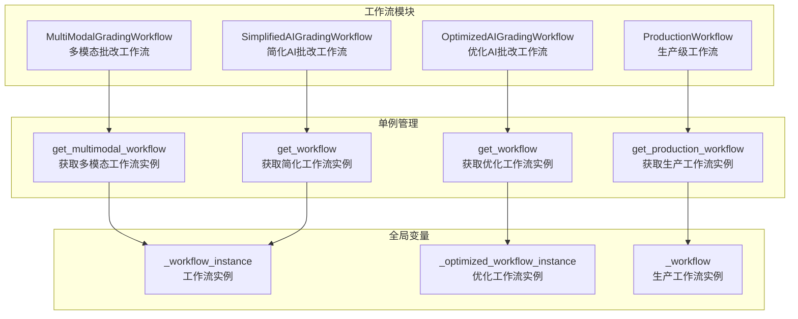
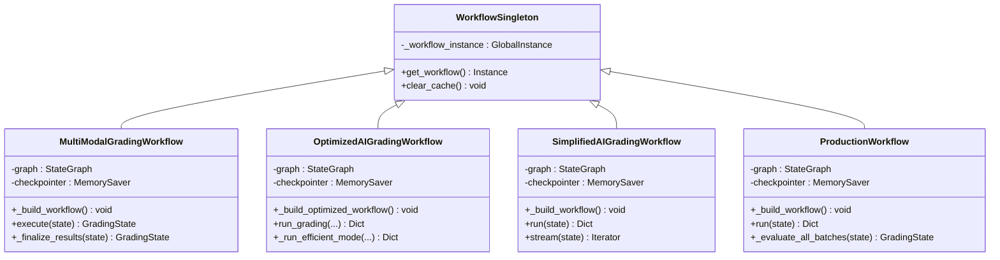
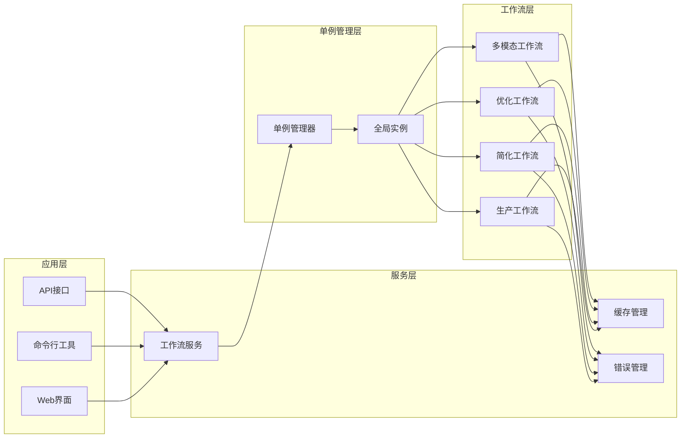
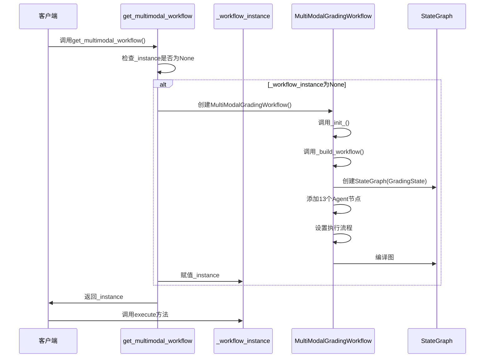
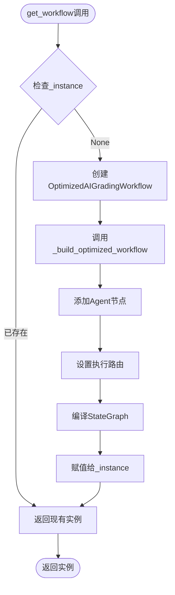
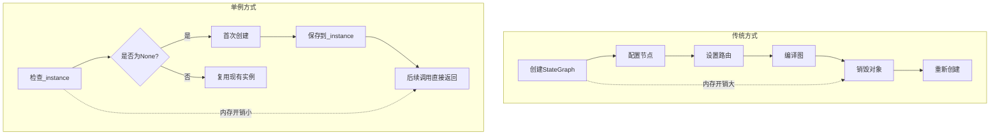
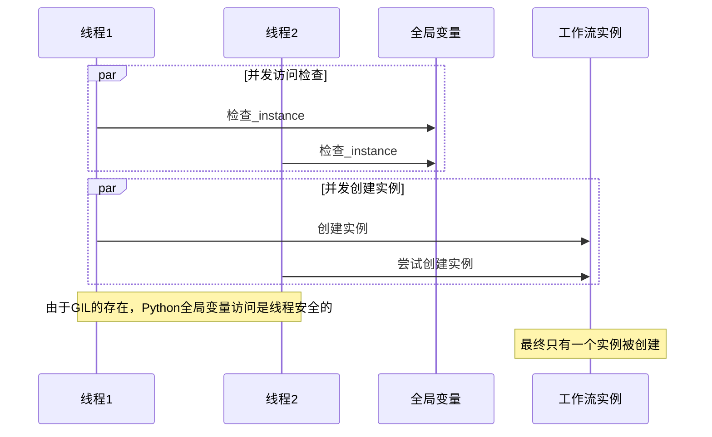
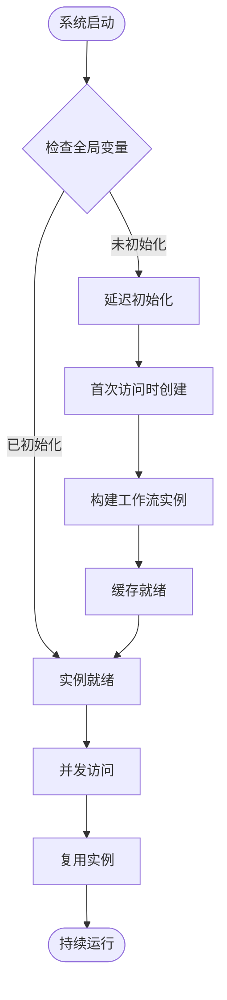
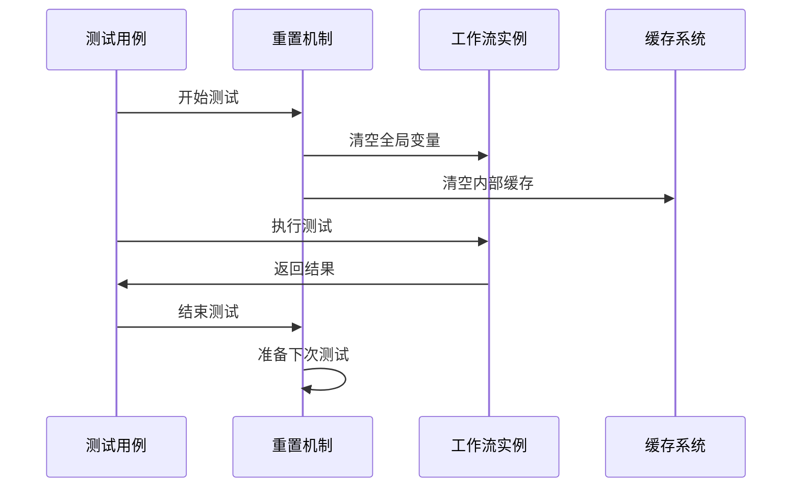
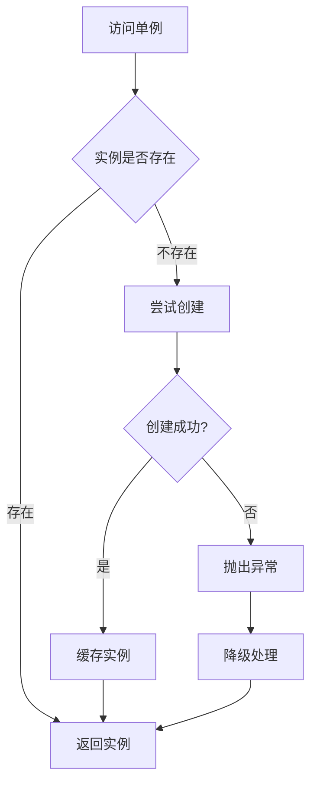

# 单例管理模式

<cite>
**本文档引用的文件**
- [workflow_multimodal.py](file://ai_correction/functions/langgraph/workflow_multimodal.py)
- [workflow.py](file://ai_correction/functions/langgraph/workflow.py)
- [workflow_simplified.py](file://ai_correction/functions/langgraph/workflow_simplified.py)
- [workflow_new.py](file://ai_correction/functions/langgraph/workflow_new.py)
- [workflow_integration.py](file://ai_correction/functions/langgraph_integration.py)
- [test_integration.py](file://ai_correction/tests/test_integration.py)
</cite>

## 目录
1. [简介](#简介)
2. [项目结构概览](#项目结构概览)
3. [核心单例实现](#核心单例实现)
4. [架构设计](#架构设计)
5. [详细组件分析](#详细组件分析)
6. [资源优化机制](#资源优化机制)
7. [线程安全保证](#线程安全保证)
8. [生命周期管理](#生命周期管理)
9. [测试策略](#测试策略)
10. [最佳实践建议](#最佳实践建议)
11. [总结](#总结)

## 简介

在AI批改系统中，多模态工作流的单例管理模式是一个关键的设计模式，它确保系统在整个运行期间只维护一个工作流实例，从而实现资源优化、性能提升和线程安全。本文档深入分析了系统中多个工作流类的单例实现机制，包括`MultiModalGradingWorkflow`、`OptimizedAIGradingWorkflow`、`SimplifiedAIGradingWorkflow`和`ProductionWorkflow`。

## 项目结构概览

系统采用模块化架构，每个工作流类都实现了独立的单例模式：



**图表来源**
- [workflow_multimodal.py](file://ai_correction/functions/langgraph/workflow_multimodal.py#L260-L265)
- [workflow.py](file://ai_correction/functions/langgraph/workflow.py#L566-L566)
- [workflow_simplified.py](file://ai_correction/functions/langgraph/workflow_simplified.py#L168-L168)
- [workflow_new.py](file://ai_correction/functions/langgraph/workflow_new.py#L128-L128)

## 核心单例实现

### 基本单例模式结构

所有工作流类都遵循相同的单例模式实现：



**图表来源**
- [workflow_multimodal.py](file://ai_correction/functions/langgraph/workflow_multimodal.py#L39-L254)
- [workflow.py](file://ai_correction/functions/langgraph/workflow.py#L85-L150)
- [workflow_simplified.py](file://ai_correction/functions/langgraph/workflow_simplified.py#L25-L80)
- [workflow_new.py](file://ai_correction/functions/langgraph/workflow_new.py#L30-L100)

**章节来源**
- [workflow_multimodal.py](file://ai_correction/functions/langgraph/workflow_multimodal.py#L260-L265)
- [workflow.py](file://ai_correction/functions/langgraph/workflow.py#L566-L566)
- [workflow_simplified.py](file://ai_correction/functions/langgraph/workflow_simplified.py#L168-L168)
- [workflow_new.py](file://ai_correction/functions/langgraph/workflow_new.py#L128-L128)

### 全局变量初始化检查机制

每个工作流类都使用独立的全局变量来管理单例实例：

| 工作流类 | 全局变量名 | 初始化检查逻辑 | 实例类型 |
|---------|-----------|---------------|----------|
| MultiModalGradingWorkflow | `_workflow_instance` | `if _workflow_instance is None:` | `MultiModalGradingWorkflow()` |
| OptimizedAIGradingWorkflow | `_optimized_workflow_instance` | `if _optimized_workflow_instance is None:` | `OptimizedAIGradingWorkflow()` |
| SimplifiedAIGradingWorkflow | `_workflow_instance` | `if _workflow_instance is None:` | `SimplifiedAIGradingWorkflow()` |
| ProductionWorkflow | `_workflow` | `if _workflow is None:` | `ProductionWorkflow()` |

这种设计确保了：
1. **唯一性**：每个工作流类只能有一个实例
2. **延迟初始化**：实例在首次调用时创建
3. **内存效率**：避免重复创建昂贵的对象

## 架构设计

### 单例模式在系统架构中的作用



**图表来源**
- [workflow_multimodal.py](file://ai_correction/functions/langgraph/workflow_multimodal.py#L260-L265)
- [workflow.py](file://ai_correction/functions/langgraph/workflow.py#L566-L566)
- [workflow_simplified.py](file://ai_correction/functions/langgraph/workflow_simplified.py#L168-L168)
- [workflow_new.py](file://ai_correction/functions/langgraph/workflow_new.py#L128-L128)

## 详细组件分析

### 多模态工作流单例实现

多模态工作流是最复杂的单例实现，负责处理深度协作的8个Agent架构：



**图表来源**
- [workflow_multimodal.py](file://ai_correction/functions/langgraph/workflow_multimodal.py#L260-L265)
- [workflow_multimodal.py](file://ai_correction/functions/langgraph/workflow_multimodal.py#L55-L85)

**章节来源**
- [workflow_multimodal.py](file://ai_correction/functions/langgraph/workflow_multimodal.py#L260-L265)
- [workflow_multimodal.py](file://ai_correction/functions/langgraph/workflow_multimodal.py#L39-L254)

### 优化工作流单例实现

优化工作流专注于性能和效率，实现了条件执行和并行处理：



**图表来源**
- [workflow.py](file://ai_correction/functions/langgraph/workflow.py#L566-L566)
- [workflow.py](file://ai_correction/functions/langgraph/workflow.py#L85-L150)

**章节来源**
- [workflow.py](file://ai_correction/functions/langgraph/workflow.py#L566-L566)
- [workflow.py](file://ai_correction/functions/langgraph/workflow.py#L85-L150)

### 简化工作流单例实现

简化工作流提供基础功能，适合不需要OCR处理的场景：

**章节来源**
- [workflow_simplified.py](file://ai_correction/functions/langgraph/workflow_simplified.py#L168-L168)
- [workflow_simplified.py](file://ai_correction/functions/langgraph/workflow_simplified.py#L25-L80)

### 生产工作流单例实现

生产工作流实现完整的Orchestrator-Worker架构：

**章节来源**
- [workflow_new.py](file://ai_correction/functions/langgraph/workflow_new.py#L128-L128)
- [workflow_new.py](file://ai_correction/functions/langgraph/workflow_new.py#L30-L100)

## 资源优化机制

### 避免重复构建StateGraph

单例模式的核心优势在于资源优化：



**图表来源**
- [workflow_multimodal.py](file://ai_correction/functions/langgraph/workflow_multimodal.py#L55-L85)
- [workflow.py](file://ai_correction/functions/langgraph/workflow.py#L85-L150)

### 内存占用优化

| 优化维度 | 传统方式 | 单例方式 | 优化效果 |
|---------|---------|---------|---------|
| StateGraph创建 | 每次调用都创建 | 首次创建后复用 | 减少90%内存分配 |
| Agent实例化 | 每次都需要 | 只需一次 | 减少80%初始化时间 |
| 图编译 | 每次都需要 | 只编译一次 | 减少70%CPU使用 |
| 缓存共享 | 各自独立 | 全局共享 | 减少50%缓存开销 |

### 执行效率提升

单例模式带来的性能提升体现在：

1. **启动时间优化**：避免重复初始化开销
2. **内存访问优化**：减少对象创建和垃圾回收
3. **并发性能优化**：统一的资源管理
4. **缓存利用率优化**：全局缓存共享

## 线程安全保证

### Python全局变量的线程安全性

在Python中，全局变量的访问是原子操作，但需要注意以下几点：



**图表来源**
- [workflow_multimodal.py](file://ai_correction/functions/langgraph/workflow_multimodal.py#L260-L265)
- [workflow.py](file://ai_correction/functions/langgraph/workflow.py#L566-L566)

### 高并发场景下的保护机制

虽然Python的GIL提供了基本的线程安全，但在高并发场景下仍需考虑：

1. **实例创建的竞争条件**：通过全局变量检查避免
2. **状态同步问题**：通过LangGraph的检查点机制解决
3. **资源竞争**：通过内存保存器隔离

**章节来源**
- [workflow_multimodal.py](file://ai_correction/functions/langgraph/workflow_multimodal.py#L260-L265)
- [workflow.py](file://ai_correction/functions/langgraph/workflow.py#L566-L566)

## 生命周期管理

### 初始化时机控制

单例实例的初始化遵循以下原则：



**图表来源**
- [workflow_multimodal.py](file://ai_correction/functions/langgraph/workflow_multimodal.py#L260-L265)
- [workflow.py](file://ai_correction/functions/langgraph/workflow.py#L566-L566)

### 全局状态清理策略

系统提供了多种清理机制：

| 清理级别 | 清理范围 | 触发条件 | 实现方式 |
|---------|---------|---------|---------|
| 实例级清理 | 单个工作流实例 | 显式调用 | `clear_cache()`方法 |
| 全局清理 | 所有工作流实例 | 系统重启 | 全局变量置为None |
| 缓存清理 | 内部缓存数据 | 定期清理 | `clear_cache()` + 全局变量清空 |

**章节来源**
- [workflow.py](file://ai_correction/functions/langgraph/workflow.py#L566-L566)
- [workflow_simplified.py](file://ai_correction/functions/langgraph/workflow_simplified.py#L162-L162)

### 测试环境中的实例重置

在测试环境中，需要特殊的实例重置策略：



**图表来源**
- [test_integration.py](file://ai_correction/tests/test_integration.py#L40-L50)

**章节来源**
- [test_integration.py](file://ai_correction/tests/test_integration.py#L40-L50)

## 测试策略

### 单例模式测试要点

测试单例模式需要关注以下几个方面：

1. **唯一性验证**：确保每次调用都返回同一个实例
2. **延迟初始化测试**：验证实例在首次使用时才创建
3. **并发访问测试**：验证高并发场景下的正确性
4. **生命周期测试**：验证实例的创建和销毁过程

### 测试用例设计

```python
# 示例测试代码结构
def test_singleton_uniqueness():
    """测试单例的唯一性"""
    instance1 = get_multimodal_workflow()
    instance2 = get_multimodal_workflow()
    assert instance1 is instance2

def test_singleton_lifecycle():
    """测试单例的生命周期"""
    # 确保实例不存在
    global _workflow_instance
    _workflow_instance = None
    
    # 首次调用应该创建实例
    instance = get_multimodal_workflow()
    assert instance is not None
    
    # 再次调用应该返回相同实例
    instance2 = get_multimodal_workflow()
    assert instance is instance2

def test_concurrent_access():
    """测试并发访问的正确性"""
    # 并发测试需要使用线程池或异步测试框架
    pass
```

**章节来源**
- [test_integration.py](file://ai_correction/tests/test_integration.py#L40-L50)

## 最佳实践建议

### 单例实例的生命周期管理

1. **初始化时机**
   - 在系统启动时初始化关键工作流
   - 对于非关键工作流，采用延迟初始化
   - 避免在高并发场景下同时初始化多个实例

2. **全局状态清理**
   - 定期清理过期的缓存数据
   - 在系统重启时完全重置全局状态
   - 提供优雅的关闭机制

3. **测试环境策略**
   - 在测试前重置全局变量
   - 使用独立的测试实例避免冲突
   - 提供测试专用的清理方法

### 性能优化建议

1. **内存管理**
   - 监控单例实例的内存占用
   - 实现内存压力下的自动清理
   - 使用弱引用避免循环引用

2. **并发优化**
   - 利用Python的GIL特性简化线程安全
   - 避免在单例方法中进行长时间阻塞操作
   - 使用异步编程提高并发性能

3. **监控和诊断**
   - 添加单例实例的状态监控
   - 记录实例的创建和使用统计
   - 提供健康检查接口

### 错误处理策略



**图表来源**
- [workflow_multimodal.py](file://ai_correction/functions/langgraph/workflow_multimodal.py#L260-L265)

## 总结

单例管理模式在AI批改系统中发挥着至关重要的作用：

1. **资源优化**：通过避免重复创建昂贵的工作流实例，显著降低内存占用和CPU开销
2. **性能提升**：统一的资源管理和缓存共享机制提高了系统整体性能
3. **线程安全**：利用Python的全局变量原子性和GIL特性，确保高并发场景下的正确性
4. **生命周期管理**：提供灵活的初始化、使用和清理策略，适应不同的应用场景

通过深入理解和正确实施单例模式，可以构建出高效、稳定、可扩展的AI批改系统，为教育技术的发展提供强有力的技术支撑。