# 工作流构建

<cite>
**本文档引用的文件**
- [workflow_multimodal.py](file://ai_correction/functions/langgraph/workflow_multimodal.py)
- [state.py](file://ai_correction/functions/langgraph/state.py)
- [checkpointer.py](file://ai_correction/functions/langgraph/checkpointer.py)
- [orchestrator_agent.py](file://ai_correction/functions/langgraph/agents/orchestrator_agent.py)
- [multimodal_input_agent.py](file://ai_correction/functions/langgraph/agents/multimodal_input_agent.py)
- [batch_planning_agent.py](file://ai_correction/functions/langgraph/agents/batch_planning_agent.py)
- [rubric_master_agent.py](file://ai_correction/functions/langgraph/agents/rubric_master_agent.py)
- [question_context_agent.py](file://ai_correction/functions/langgraph/agents/question_context_agent.py)
- [grading_worker_agent.py](file://ai_correction/functions/langgraph/agents/grading_worker_agent.py)
- [result_aggregator_agent.py](file://ai_correction/functions/langgraph/agents/result_aggregator_agent.py)
- [class_analysis_agent.py](file://ai_correction/functions/langgraph/agents/class_analysis_agent.py)
- [multimodal_models.py](file://ai_correction/functions/langgraph/multimodal_models.py)
- [test_multimodal_grading.py](file://ai_correction/test_multimodal_grading.py)
</cite>

## 目录
1. [简介](#简介)
2. [项目结构概览](#项目结构概览)
3. [核心组件分析](#核心组件分析)
4. [架构概览](#架构概览)
5. [详细组件分析](#详细组件分析)
6. [依赖关系分析](#依赖关系分析)
7. [性能考虑](#性能考虑)
8. [故障排除指南](#故障排除指南)
9. [结论](#结论)

## 简介

MultiModalGradingWorkflow类是AI批改系统的核心工作流引擎，采用深度协作架构设计，实现了基于多模态输入的智能批改流程。该工作流通过11个核心Agent节点的协同工作，完成了从编排到最终化的完整批改生命周期管理。

工作流的核心特点包括：
- **深度协作架构**：11个Agent节点形成完整的批改流水线
- **多模态支持**：原生支持文本、图片、PDF等多种文件格式
- **Token优化**：通过压缩包机制大幅减少LLM调用成本
- **并行处理**：支持多批次并行批改提升效率
- **状态持久化**：基于MemorySaver的检查点机制支持任务恢复

## 项目结构概览

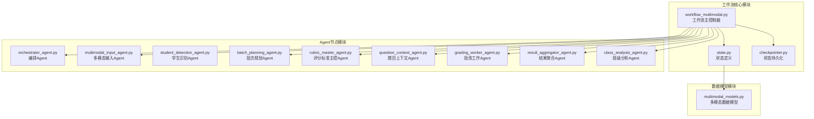

**图表来源**
- [workflow_multimodal.py](file://ai_correction/functions/langgraph/workflow_multimodal.py#L39-L254)
- [state.py](file://ai_correction/functions/langgraph/state.py#L40-L268)
- [checkpointer.py](file://ai_correction/functions/langgraph/checkpointer.py#L20-L246)

**章节来源**
- [workflow_multimodal.py](file://ai_correction/functions/langgraph/workflow_multimodal.py#L1-L374)
- [state.py](file://ai_correction/functions/langgraph/state.py#L1-L269)

## 核心组件分析

### MultiModalGradingWorkflow类

MultiModalGradingWorkflow是整个批改系统的核心控制器，负责创建工作流图并管理执行流程。

#### 类结构特征

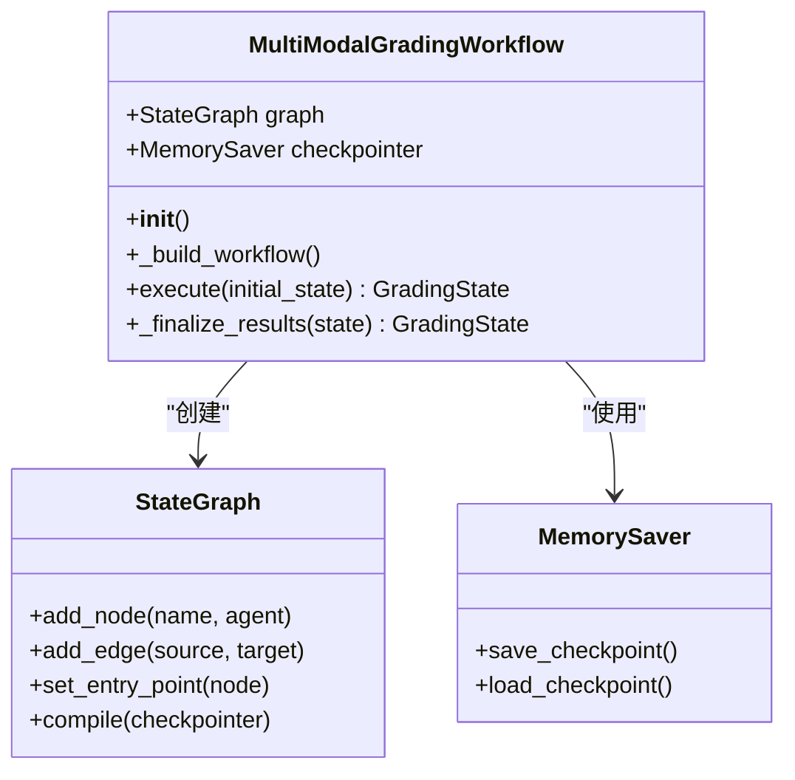

**图表来源**
- [workflow_multimodal.py](file://ai_correction/functions/langgraph/workflow_multimodal.py#L39-L254)

#### 初始化过程

工作流的初始化包含以下关键步骤：

1. **状态图创建**：使用GradingState作为状态模板
2. **Agent节点注册**：注册11个核心Agent节点
3. **执行流程定义**：建立9个执行阶段的边连接
4. **入口点设置**：设置orchestrator作为起始节点
5. **编译优化**：编译状态图并启用检查点机制

**章节来源**
- [workflow_multimodal.py](file://ai_correction/functions/langgraph/workflow_multimodal.py#L59-L129)

### StateGraph(GradingState)初始化

StateGraph是LangGraph框架的核心组件，负责管理状态流转和节点执行。

#### 状态定义结构

GradingState包含了批改过程中所需的所有状态信息，支持深度协作架构的各种需求：

| 字段类别 | 主要字段 | 功能描述 |
|---------|---------|---------|
| 基础信息 | task_id, user_id, assignment_id | 任务标识和用户信息 |
| 文件信息 | question_files, answer_files, marking_files | 原始文件路径列表 |
| 多模态信息 | question_multimodal_files, answer_multimodal_files | 多模态文件表示 |
| 批改参数 | strictness_level, language, mode | 批改配置参数 |
| 理解结果 | question_understanding, answer_understanding, rubric_understanding | 各阶段理解结果 |
| 批次信息 | students_info, batches_info, batches | 批次管理和学生信息 |
| 评估结果 | criteria_evaluations, grading_results | 评分和批改结果 |
| 处理状态 | current_step, progress_percentage, completion_status | 进度跟踪信息 |

**章节来源**
- [state.py](file://ai_correction/functions/langgraph/state.py#L40-L268)

## 架构概览

### 深度协作工作流架构

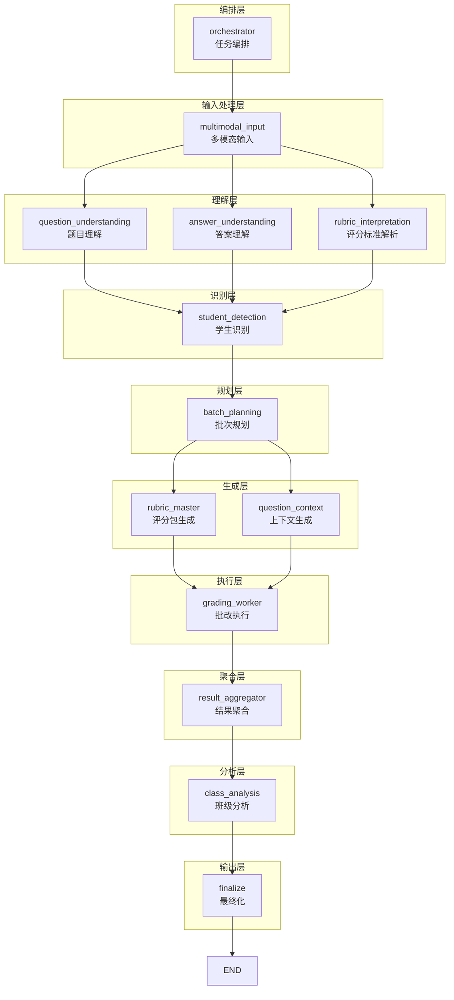

**图表来源**
- [workflow_multimodal.py](file://ai_correction/functions/langgraph/workflow_multimodal.py#L64-L129)

### 执行阶段详解

工作流分为9个主要执行阶段，每个阶段都有明确的功能定位：

#### 1. 编排阶段 (orchestrator → multimodal_input)
- **功能**：分析任务类型，决定执行策略
- **输出**：任务配置参数和执行计划

#### 2. 多模态输入阶段 (multimodal_input)
- **功能**：处理各种模态文件，转换为统一格式
- **输出**：多模态文件对象列表

#### 3. 并行理解阶段 (多路分支)
- **功能**：并行处理题目、答案和评分标准的理解
- **特点**：LangGraph自动等待所有并行节点完成

#### 4. 学生识别阶段 (student_detection)
- **功能**：识别学生身份信息（可选）
- **条件**：仅在批量或班级模式下启用

#### 5. 批次规划阶段 (batch_planning)
- **功能**：基于学生列表规划批处理方案
- **输出**：批次信息和令牌预估

#### 6. 压缩包生成阶段 (并行生成)
- **功能**：生成评分包和上下文包
- **优化**：为后续批改提供压缩版指导信息

#### 7. 批改执行阶段 (grading_worker)
- **功能**：基于压缩包执行批改
- **优势**：大幅减少LLM调用成本

#### 8. 结果聚合阶段 (result_aggregator)
- **功能**：汇总所有批次的批改结果
- **输出**：结构化报告和统计数据

#### 9. 班级分析阶段 (class_analysis)
- **功能**：生成班级整体分析报告（可选）
- **输出**：分数分布和共性问题分析

**章节来源**
- [workflow_multimodal.py](file://ai_correction/functions/langgraph/workflow_multimodal.py#L64-L129)

## 详细组件分析

### OrchestratorAgent - 任务编排

OrchestratorAgent是工作流的总指挥，负责全局任务分解和资源优化。

#### 核心功能

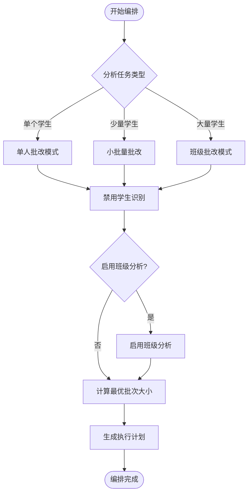

**图表来源**
- [orchestrator_agent.py](file://ai_correction/functions/langgraph/agents/orchestrator_agent.py#L30-L129)

#### 编排策略

OrchestratorAgent采用智能编排策略：

1. **任务类型识别**：根据答案文件数量判断任务规模
2. **功能启用控制**：动态启用/禁用学生识别和班级分析
3. **批次优化**：计算最优批次大小平衡性能和准确性
4. **资源分配**：为不同阶段分配适当的处理资源

**章节来源**
- [orchestrator_agent.py](file://ai_correction/functions/langgraph/agents/orchestrator_agent.py#L30-L129)

### MultiModalInputAgent - 多模态输入处理

MultiModalInputAgent负责将各种模态的文件转换为统一的多模态表示。

#### 输入处理流程

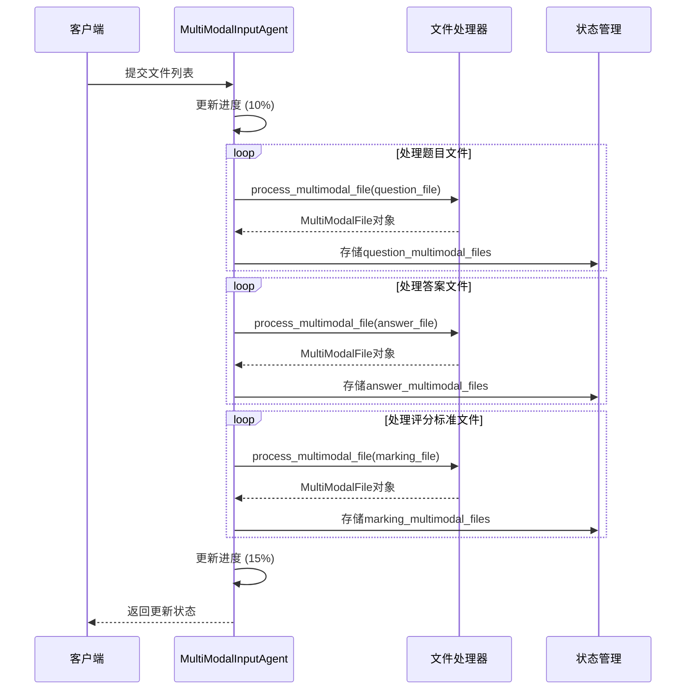

**图表来源**
- [multimodal_input_agent.py](file://ai_correction/functions/langgraph/agents/multimodal_input_agent.py#L25-L122)

#### 多模态文件处理

支持的文件类型和处理方式：

| 文件类型 | 处理方式 | 输出格式 | 特点 |
|---------|---------|---------|------|
| 文本文件 | 直接读取 | TextContent | 保留原始编码 |
| 图片文件 | Base64编码 | ImageContent | 支持多种格式 |
| PDF文本 | 文本提取 | PDFTextContent | 保留页数信息 |
| PDF扫描版 | 图片转换 | PDFImageContent | 支持Vision API |
| Word文档 | 内容提取 | DocumentContent | 支持图文混合 |

**章节来源**
- [multimodal_input_agent.py](file://ai_correction/functions/langgraph/agents/multimodal_input_agent.py#L25-L122)

### BatchPlanningAgent - 批次规划

BatchPlanningAgent负责基于学生列表和题目信息规划高效的批次处理方案。

#### 批次规划算法

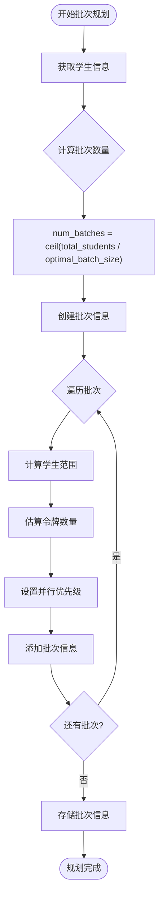

**图表来源**
- [batch_planning_agent.py](file://ai_correction/functions/langgraph/agents/batch_planning_agent.py#L20-L72)

#### 批次优化策略

批次规划采用以下优化策略：

1. **动态批次大小**：根据学生数量动态调整批次大小
2. **令牌预估**：基于学生数量预估LLM调用成本
3. **并行优先级**：为批次分配优先级支持并行处理
4. **负载均衡**：确保各批次处理量相对均衡

**章节来源**
- [batch_planning_agent.py](file://ai_correction/functions/langgraph/agents/batch_planning_agent.py#L20-L72)

### RubricMasterAgent - 评分标准主控

RubricMasterAgent是Token优化的核心组件，负责深度理解评分标准并生成压缩版指导包。

#### 压缩包生成机制

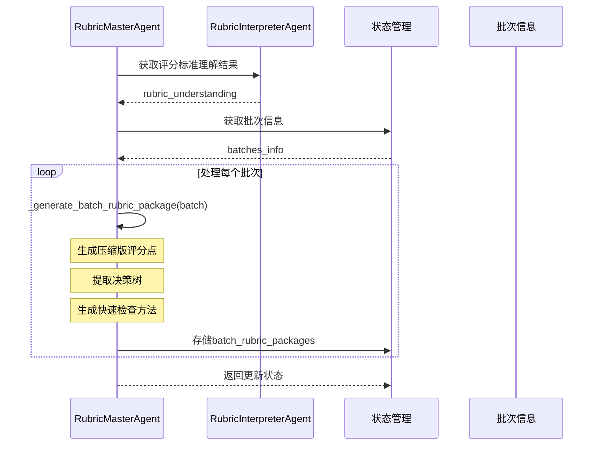

**图表来源**
- [rubric_master_agent.py](file://ai_correction/functions/langgraph/agents/rubric_master_agent.py#L20-L127)

#### Token优化策略

压缩包设计遵循以下优化原则：

| 优化维度 | 实现方式 | 效果 |
|---------|---------|------|
| 描述截断 | 限制评分点描述长度 | 减少50%文本量 |
| 关键词限制 | 限制关键词和必需元素数量 | 减少30%数据量 |
| 决策树简化 | 提取核心判断逻辑 | 减少70%复杂度 |
| 快速检查 | 提供简化的检查方法 | 减少80%查询时间 |

**章节来源**
- [rubric_master_agent.py](file://ai_correction/functions/langgraph/agents/rubric_master_agent.py#L20-L127)

### QuestionContextAgent - 题目上下文

QuestionContextAgent为批改提供轻量级的题目上下文，减少批改Agent的令牌消耗。

#### 上下文压缩策略

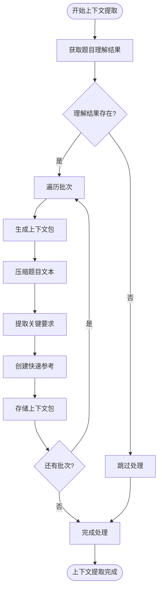

**图表来源**
- [question_context_agent.py](file://ai_correction/functions/langgraph/agents/question_context_agent.py#L20-L92)

#### 上下文包结构

上下文包包含以下关键信息：

- **压缩文本**：提取题目核心内容，限制在200字符以内
- **关键要求**：提取最重要的答题要求，限制在5个以内
- **快速参考**：提供极简的题目描述便于快速查阅

**章节来源**
- [question_context_agent.py](file://ai_correction/functions/langgraph/agents/question_context_agent.py#L20-L92)

### GradingWorkerAgent - 批改执行

GradingWorkerAgent是实际执行批改工作的核心Agent，基于压缩版评分包和上下文高效执行批改。

#### 批改执行流程

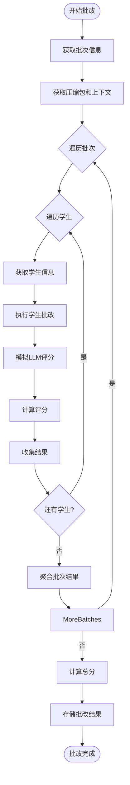

**图表来源**
- [grading_worker_agent.py](file://ai_correction/functions/langgraph/agents/grading_worker_agent.py#L20-L135)

#### 评分逻辑实现

批改执行采用简化但有效的评分逻辑：

1. **评分点遍历**：逐一遍历压缩版评分点
2. **快速检查**：使用快速检查方法初步评估
3. **模拟评分**：基于评分包内容模拟LLM评分
4. **结果记录**：记录每个评分点的评估结果

**章节来源**
- [grading_worker_agent.py](file://ai_correction/functions/langgraph/agents/grading_worker_agent.py#L20-L135)

### ResultAggregatorAgent - 结果聚合

ResultAggregatorAgent负责汇总所有批次的批改结果，生成结构化的报告和统计数据。

#### 聚合处理流程

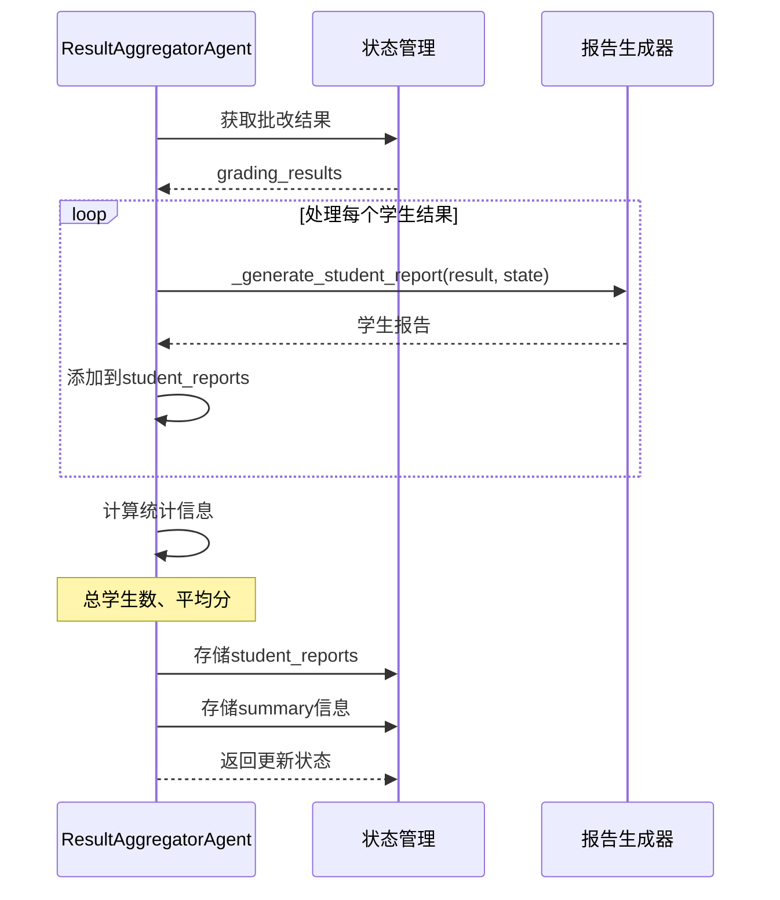

**图表来源**
- [result_aggregator_agent.py](file://ai_correction/functions/langgraph/agents/result_aggregator_agent.py#L20-L142)

#### 报告生成策略

结果聚合包含以下关键功能：

1. **学生报告生成**：为每个学生生成详细的学习报告
2. **等级计算**：基于总分计算学术等级
3. **反馈生成**：生成个性化的学习反馈
4. **优势提取**：识别学生的学习优势
5. **改进建议**：提供针对性的改进建议

**章节来源**
- [result_aggregator_agent.py](file://ai_correction/functions/langgraph/agents/result_aggregator_agent.py#L20-L142)

### ClassAnalysisAgent - 班级分析

ClassAnalysisAgent专门负责生成班级整体分析报告，仅在班级批改模式下启用。

#### 分析指标体系

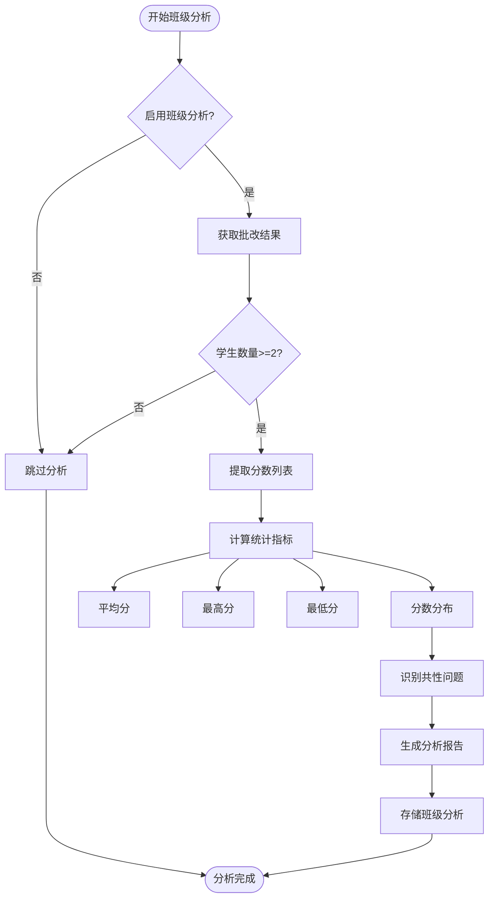

**图表来源**
- [class_analysis_agent.py](file://ai_correction/functions/langgraph/agents/class_analysis_agent.py#L20-L121)

#### 分析维度

班级分析涵盖以下维度：

| 分析维度 | 计算方法 | 应用场景 |
|---------|---------|---------|
| 基础统计 | 平均分、最高分、最低分 | 整体表现评估 |
| 分数分布 | 各等级人数统计 | 成绩分布分析 |
| 共性问题 | 失分最多的评分点 | 教学重点识别 |
| 学习趋势 | 与历史数据对比 | 教学效果评估 |

**章节来源**
- [class_analysis_agent.py](file://ai_correction/functions/langgraph/agents/class_analysis_agent.py#L20-L121)

## 依赖关系分析

### 工作流依赖图

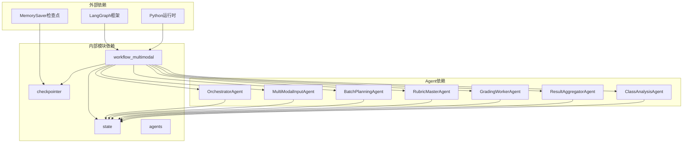

**图表来源**
- [workflow_multimodal.py](file://ai_correction/functions/langgraph/workflow_multimodal.py#L1-L30)
- [checkpointer.py](file://ai_correction/functions/langgraph/checkpointer.py#L1-L20)

### Agent间通信机制

工作流中的Agent通过状态共享实现通信：

1. **状态传递**：通过GradingState对象传递数据
2. **理解结果**：各Agent将自己的理解结果存储在状态中
3. **中间产物**：前序Agent的输出成为后序Agent的输入
4. **并行同步**：LangGraph自动处理并行节点的同步

**章节来源**
- [workflow_multimodal.py](file://ai_correction/functions/langgraph/workflow_multimodal.py#L131-L216)

## 性能考虑

### Token优化策略

工作流采用多层次的Token优化策略：

1. **一次性深度理解**：评分标准和题目理解只做一次深度分析
2. **压缩包机制**：生成压缩版指导包减少重复信息
3. **并行处理**：充分利用并行计算能力
4. **批次优化**：合理规划批次大小平衡性能和质量

### 并行处理优化

```mermaid
gantt
title 并行处理时间线
dateFormat X
axisFormat %s
section 编排阶段
任务分析 :done, analysis, 0, 1
section 输入处理
多模态文件处理 :active, input, 1, 3
section 理解阶段
并行理解 :parallel, understanding, 3, 6
section 后续阶段
学生识别 :after understanding, student_detect, 6, 7
批次规划 :after student_detect, batch_plan, 7, 8
压缩包生成 :parallel, package_gen, 8, 10
批改执行 :parallel, grading_exec, 10, 15
结果聚合 :after grading_exec, result_agg, 15, 16
班级分析 :after result_agg, class_analysis, 16, 17
最终化 :after class_analysis, finalize, 17, 18
```

### 内存管理

工作流采用以下内存管理策略：

1. **增量处理**：避免同时加载大量数据
2. **状态清理**：及时清理不需要的中间状态
3. **检查点机制**：定期保存状态支持任务恢复
4. **资源池化**：复用LLM客户端连接

## 故障排除指南

### 常见错误类型

工作流执行过程中可能遇到的错误类型：

| 错误类型 | 发生阶段 | 解决方案 |
|---------|---------|---------|
| 文件处理错误 | 多模态输入 | 检查文件格式和权限 |
| 理解失败 | 并行理解 | 调整提示词或模型参数 |
| 批次规划错误 | 批次规划 | 检查学生信息完整性 |
| 评分包生成失败 | 压缩包生成 | 验证理解结果有效性 |
| 批改执行异常 | 批改执行 | 检查压缩包格式 |
| 状态保存失败 | 状态持久化 | 检查存储空间和权限 |

### 日志监控策略

工作流提供了完善的日志监控机制：

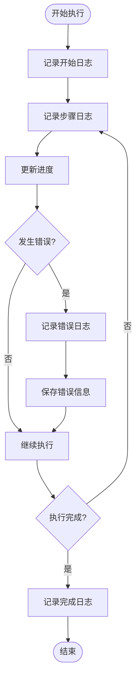

### 检查点恢复机制

MemorySaver检查点支持任务中断后的恢复：

1. **自动保存**：每次状态更新都会自动保存
2. **任务恢复**：重新启动时自动从检查点恢复
3. **状态验证**：恢复时验证状态完整性
4. **错误隔离**：单个Agent错误不影响整体恢复

**章节来源**
- [checkpointer.py](file://ai_correction/functions/langgraph/checkpointer.py#L20-L246)

## 结论

MultiModalGradingWorkflow代表了AI批改系统的技术创新，通过深度协作架构实现了高效、准确的多模态批改。其核心优势包括：

### 技术创新点

1. **深度协作架构**：11个Agent节点形成完整的批改流水线
2. **Token优化机制**：通过压缩包大幅减少LLM调用成本
3. **多模态原生支持**：直接处理各种模态文件无需OCR转换
4. **并行处理能力**：支持多批次并行提升处理效率
5. **状态持久化**：基于MemorySaver的检查点机制支持任务恢复

### 应用价值

- **教育智能化**：为教师提供智能批改辅助工具
- **个性化学习**：生成详细的学习报告和改进建议
- **教学分析**：帮助教师了解班级整体学习情况
- **成本优化**：通过Token优化降低AI服务成本

### 发展前景

该工作流架构为未来的AI教育应用奠定了坚实基础，可以进一步扩展支持更多学科、更复杂的批改场景，以及与其他教育系统的深度集成。