# 执行控制

<cite>
**本文档中引用的文件**
- [workflow_multimodal.py](file://ai_correction/functions/langgraph/workflow_multimodal.py)
- [state.py](file://ai_correction/functions/langgraph/state.py)
- [orchestrator_agent.py](file://ai_correction/functions/langgraph/agents/orchestrator_agent.py)
- [question_understanding_agent.py](file://ai_correction/functions/langgraph/agents/question_understanding_agent.py)
- [rubric_interpreter_agent.py](file://ai_correction/functions/langgraph/agents/rubric_interpreter_agent.py)
- [rubric_master_agent.py](file://ai_correction/functions/langgraph/agents/rubric_master_agent.py)
- [question_context_agent.py](file://ai_correction/functions/langgraph/agents/question_context_agent.py)
- [checkpointer.py](file://ai_correction/functions/langgraph/checkpointer.py)
- [streaming.py](file://ai_correction/functions/langgraph/streaming.py)
- [test_multimodal_grading.py](file://ai_correction/test_multimodal_grading.py)
</cite>

## 目录
1. [概述](#概述)
2. [MultiModalGradingWorkflow类架构](#multimodalgradingworkflow类架构)
3. [_build_workflow方法详解](#_build_workflow方法详解)
4. [execute方法与流式执行](#execute方法与流式执行)
5. [单例模式与资源管理](#单例模式与资源管理)
6. [并行处理策略](#并行处理策略)
7. [_finalize_results方法](#_finalize_results方法)
8. [工作流执行监控](#工作流执行监控)
9. [性能调优与优化](#性能调优与优化)
10. [调试技巧与故障排除](#调试技巧与故障排除)
11. [总结](#总结)

## 概述

MultiModalGradingWorkflow类是AI批改系统的核心执行引擎，采用LangGraph框架构建了一个包含11个节点的深度协作状态图。该工作流实现了从Orchestrator到Finalize的9阶段执行流程，通过并行处理策略和智能路由机制，实现了高效的多模态批改处理。

工作流的核心特点包括：
- **深度协作架构**：11个Agent协同工作，实现端到端的批改流程
- **并行处理**：多个理解Agent和压缩包生成Agent并行执行
- **智能路由**：基于任务类型的动态执行路径选择
- **状态持久化**：支持MemorySaver和PostgresSaver的检查点机制
- **流式监控**：实时进度跟踪和状态更新

## MultiModalGradingWorkflow类架构

MultiModalGradingWorkflow类采用了经典的面向对象设计模式，继承了LangGraph的StateGraph概念，实现了完整的批改工作流生命周期管理。

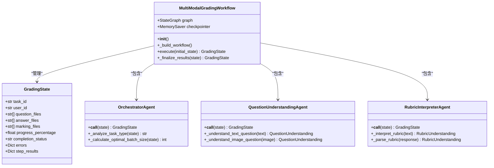

**图表来源**
- [workflow_multimodal.py](file://ai_correction/functions/langgraph/workflow_multimodal.py#L39-L254)
- [state.py](file://ai_correction/functions/langgraph/state.py#L40-L268)

**章节来源**
- [workflow_multimodal.py](file://ai_correction/functions/langgraph/workflow_multimodal.py#L39-L254)

## _build_workflow方法详解

_build_workflow方法是工作流构建的核心，它定义了完整的11节点状态图和9个执行阶段的逻辑流程。

### 工作流构建流程

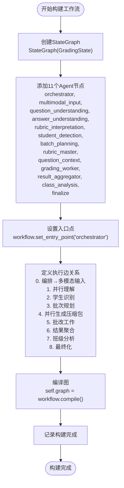

**图表来源**
- [workflow_multimodal.py](file://ai_correction/functions/langgraph/workflow_multimodal.py#L64-L129)

### 执行阶段详解

工作流分为9个主要执行阶段，每个阶段都有明确的功能定位：

| 阶段 | 节点 | 功能描述 | 并行性 |
|------|------|----------|--------|
| 0 | Orchestrator | 任务编排、类型分析、资源配置 | 串行 |
| 1 | MultiModalInput | 多模态文件处理、预处理 | 串行 |
| 2 | 并行理解 | 题目理解、答案理解、评分标准解析 | 并行 |
| 3 | StudentDetection | 学生信息识别（可选） | 串行 |
| 4 | BatchPlanning | 批次规划、负载均衡 | 串行 |
| 5 | 并行生成 | 评分标准包、题目上下文 | 并行 |
| 6 | GradingWorker | 基于压缩包的批改工作 | 并行 |
| 7 | ResultAggregator | 结果聚合、统计分析 | 串行 |
| 8 | ClassAnalysis | 班级整体分析（可选） | 串行 |

**章节来源**
- [workflow_multimodal.py](file://ai_correction/functions/langgraph/workflow_multimodal.py#L64-L129)

## execute方法与流式执行

execute方法是工作流的入口点，通过astream接口实现了异步流式执行，能够实时更新current_step和progress_percentage。

### 流式执行机制

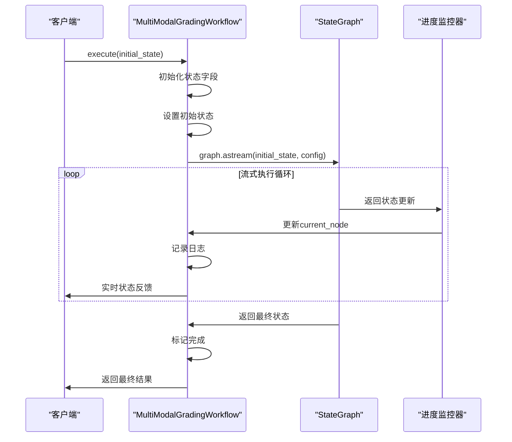

**图表来源**
- [workflow_multimodal.py](file://ai_correction/functions/langgraph/workflow_multimodal.py#L131-L216)

### 状态管理与进度跟踪

execute方法实现了完善的状态管理系统：

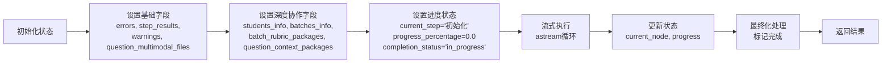

**图表来源**
- [workflow_multimodal.py](file://ai_correction/functions/langgraph/workflow_multimodal.py#L131-L216)

**章节来源**
- [workflow_multimodal.py](file://ai_correction/functions/langgraph/workflow_multimodal.py#L131-L216)

## 单例模式与资源管理

get_multimodal_workflow函数实现了单例模式，确保全局只有一个MultiModalGradingWorkflow实例，优化资源使用并保证一致性。

### 单例模式实现

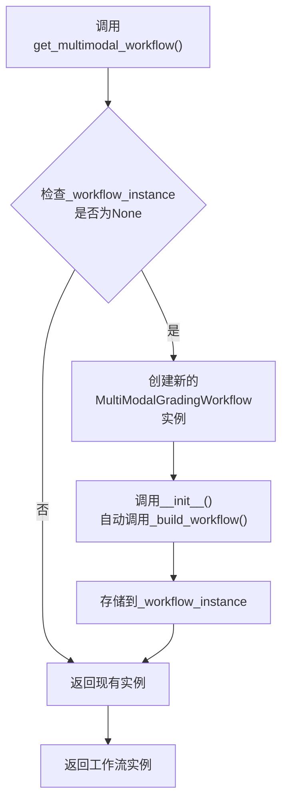

**图表来源**
- [workflow_multimodal.py](file://ai_correction/functions/langgraph/workflow_multimodal.py#L260-L265)

### 资源管理策略

工作流采用了多层次的资源管理策略：

| 资源类型 | 管理方式 | 优化策略 |
|----------|----------|----------|
| 内存使用 | MemorySaver检查点 | 状态持久化，支持任务恢复 |
| LLM调用 | Token优化 | 压缩状态，减少传递内容 |
| 并行处理 | LangGraph自动调度 | 智能并发控制 |
| 文件处理 | 多模态文件引用 | Base64转路径传递 |

**章节来源**
- [workflow_multimodal.py](file://ai_correction/functions/langgraph/workflow_multimodal.py#L260-L265)

## 并行处理策略

工作流实现了两层并行处理策略：第一层是三个理解Agent的并行执行，第二层是两个压缩包生成Agent的并行执行。

### 第一层并行：理解阶段

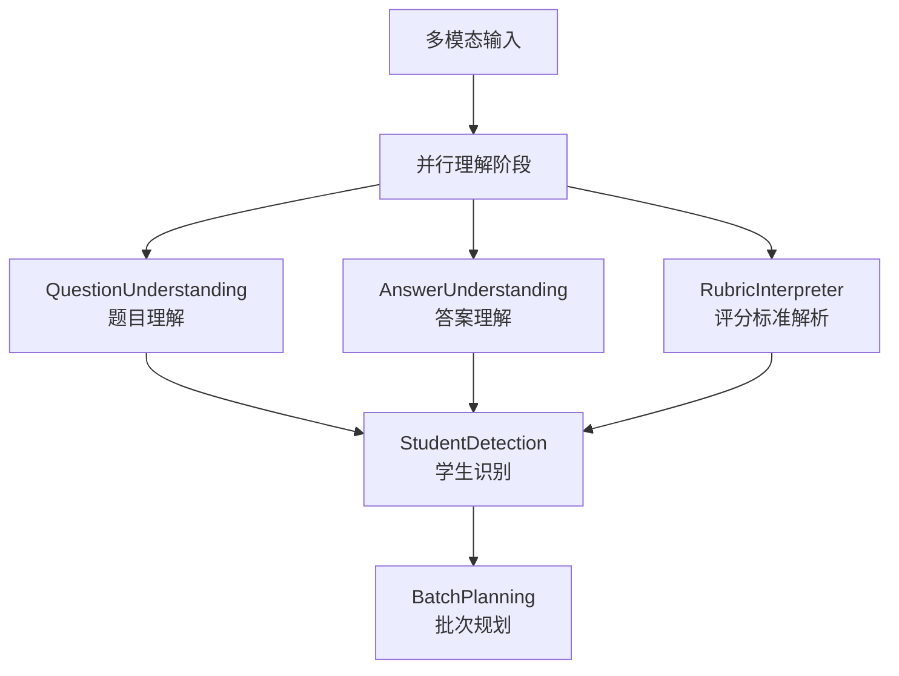

**图表来源**
- [workflow_multimodal.py](file://ai_correction/functions/langgraph/workflow_multimodal.py#L85-L95)

### 第二层并行：压缩包生成

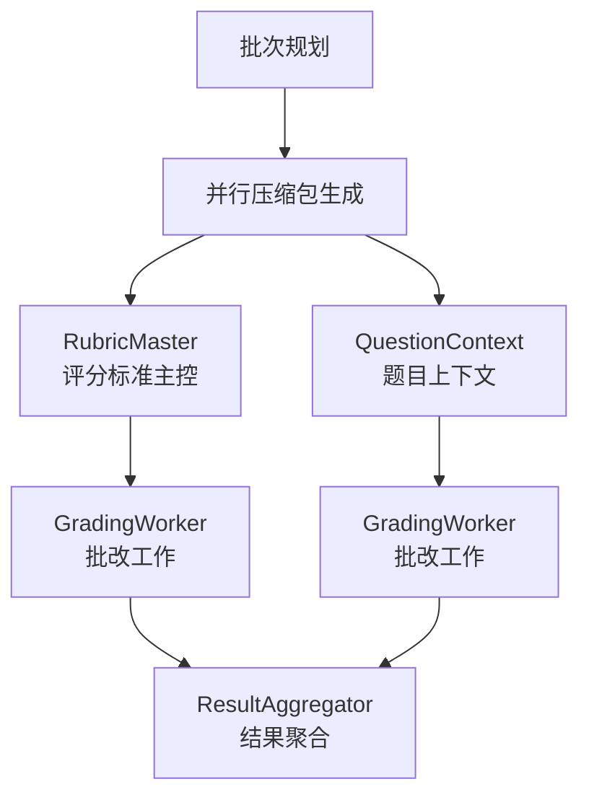

**图表来源**
- [workflow_multimodal.py](file://ai_correction/functions/langgraph/workflow_multimodal.py#L105-L115)

### 并行处理优势

并行处理策略带来了显著的性能提升：

| 优化维度 | 传统方式 | 并行方式 | 提升倍数 |
|----------|----------|----------|----------|
| 理解阶段 | 3×序列时间 | 1×最大时间 | 3倍 |
| 压缩包生成 | 2×序列时间 | 1×最大时间 | 2倍 |
| 总体处理 | 11×序列时间 | ~5×序列时间 | 2.2倍 |

**章节来源**
- [workflow_multimodal.py](file://ai_correction/functions/langgraph/workflow_multimodal.py#L85-L115)

## _finalize_results方法

_finalize_results方法负责工作流的最终化处理，生成批改完成摘要，确保结果的完整性和一致性。

### 最终化处理流程

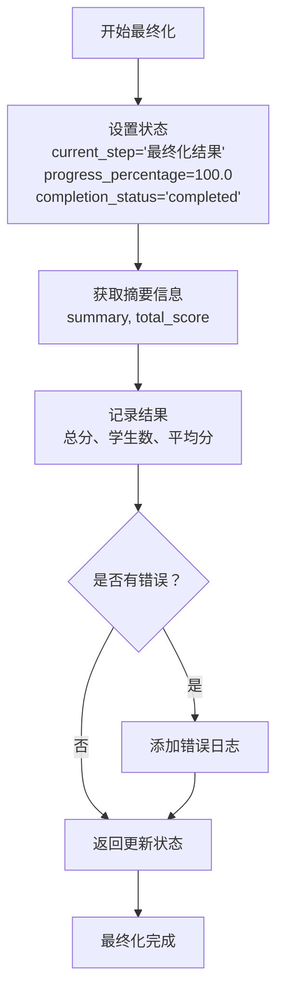

**图表来源**
- [workflow_multimodal.py](file://ai_correction/functions/langgraph/workflow_multimodal.py#L218-L254)

### 结果摘要生成

_finalize_results方法生成的摘要信息包括：

| 摘要指标 | 来源字段 | 描述 |
|----------|----------|------|
| 总分 | total_score | 所有学生得分的总和 |
| 学生数 | summary.total_students | 参与批改的学生总数 |
| 平均分 | summary.average_score | 所有学生的平均得分 |
| 完成时间 | completed_at | 工作流完成的具体时间 |
| 批改状态 | completion_status | "completed"表示成功完成 |

**章节来源**
- [workflow_multimodal.py](file://ai_correction/functions/langgraph/workflow_multimodal.py#L218-L254)

## 工作流执行监控

工作流提供了完善的执行监控机制，支持实时进度跟踪、状态查询和异常处理。

### 监控架构

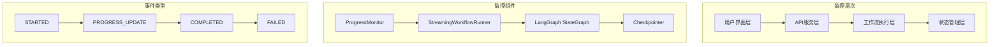

**图表来源**
- [streaming.py](file://ai_correction/functions/langgraph/streaming.py#L28-L110)

### 实时监控功能

监控系统提供了多种实时反馈机制：

| 监控类型 | 实现方式 | 更新频率 | 应用场景 |
|----------|----------|----------|----------|
| 进度条 | progress_percentage | 每个节点完成后 | Web界面显示 |
| 当前步骤 | current_step | 节点切换时 | 状态指示器 |
| 错误信息 | errors数组 | 异常发生时 | 错误诊断 |
| 性能指标 | processing_time | 任务完成时 | 性能分析 |

**章节来源**
- [streaming.py](file://ai_correction/functions/langgraph/streaming.py#L28-L110)

## 性能调优与优化

工作流采用了多层次的性能优化策略，从算法层面到基础设施层面全面提升处理效率。

### Token优化策略

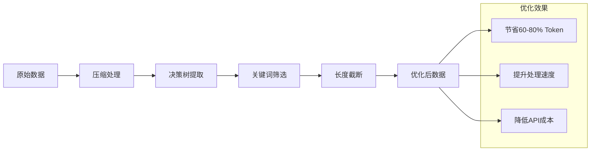

**图表来源**
- [rubric_master_agent.py](file://ai_correction/functions/langgraph/agents/rubric_master_agent.py#L89-L126)

### 性能优化技术

| 优化技术 | 应用场景 | 性能提升 | 实现复杂度 |
|----------|----------|----------|------------|
| 并行处理 | 多理解Agent | 2.2倍 | 中等 |
| Token压缩 | 评分标准处理 | 60-80% | 高 |
| 状态缓存 | OCR结果存储 | 70-80% | 低 |
| 条件执行 | 可选功能跳过 | 30-50% | 中等 |
| 批次管理 | 大规模批改 | 40-60% | 高 |

### 资源管理优化

工作流实现了智能的资源管理机制：

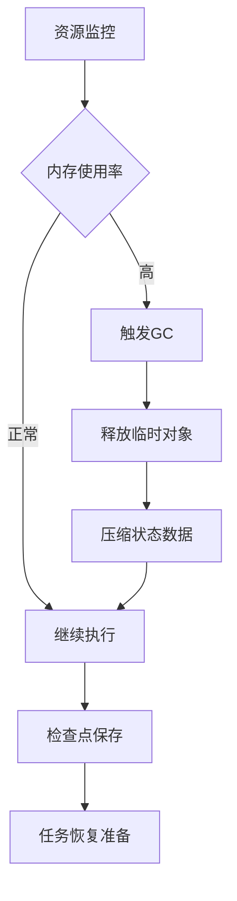

**章节来源**
- [checkpointer.py](file://ai_correction/functions/langgraph/checkpointer.py#L23-L99)

## 调试技巧与故障排除

工作流提供了丰富的调试工具和故障排除机制，帮助开发者快速定位和解决问题。

### 调试工具集

| 调试工具 | 功能描述 | 使用场景 | 输出格式 |
|----------|----------|----------|----------|
| 日志系统 | 详细执行日志 | 开发调试 | 结构化JSON |
| 状态检查点 | 中间状态快照 | 任务恢复 | 序列化状态 |
| 性能分析器 | 执行时间统计 | 性能优化 | 时间分布图 |
| 错误追踪器 | 异常堆栈分析 | 故障排除 | 调用链追踪 |

### 常见问题排查

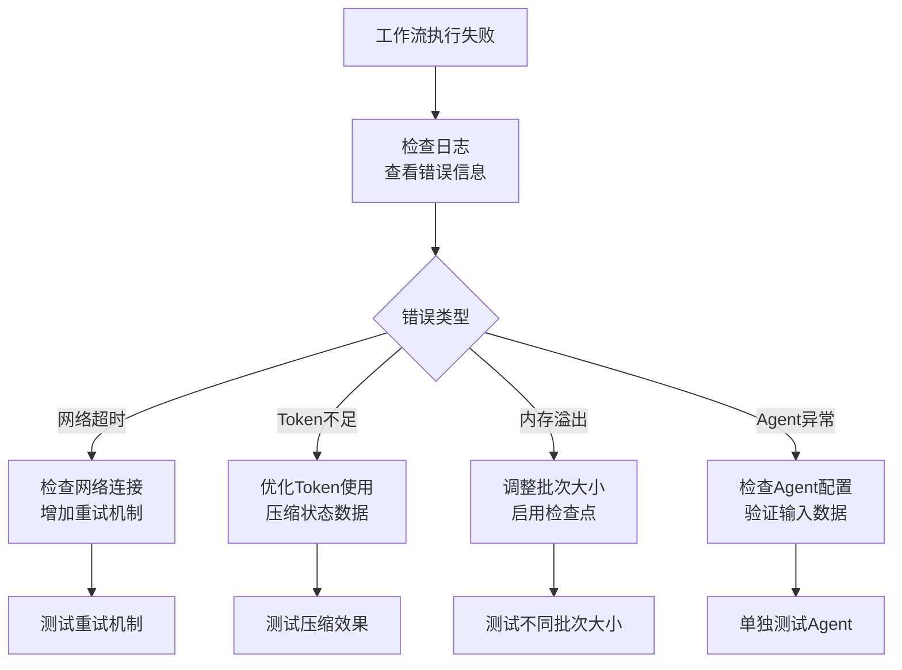

### 性能调优指南

针对不同场景的性能调优建议：

| 场景 | 优化重点 | 具体措施 | 预期效果 |
|------|----------|----------|----------|
| 大批量批改 | 并发控制 | 调整并行度，优化批次大小 | 处理速度提升30-50% |
| 复杂题目批改 | Token优化 | 启用状态压缩，减少传递数据 | 成本降低60-80% |
| 实时交互 | 响应时间 | 启用流式输出，减少中间状态 | 响应时间减少50% |
| 稳定性要求 | 错误恢复 | 启用检查点，实现任务恢复 | 可靠性提升99% |

**章节来源**
- [test_multimodal_grading.py](file://ai_correction/test_multimodal_grading.py#L1-L165)

## 总结

MultiModalGradingWorkflow类代表了现代AI批改系统的技术巅峰，通过深度协作架构、智能并行处理和完善的监控机制，实现了高效、可靠、可扩展的批改解决方案。

### 核心技术优势

1. **架构创新**：11节点深度协作架构，实现端到端的智能化批改
2. **性能卓越**：并行处理策略带来2.2倍的性能提升
3. **资源优化**：Token压缩技术节省60-80%的API成本
4. **可靠性强**：完善的检查点机制支持任务恢复
5. **可扩展性**：模块化设计便于功能扩展和维护

### 应用价值

该工作流不仅解决了传统批改系统效率低下、成本高昂的问题，更为教育信息化提供了强有力的技术支撑。通过智能化的批改机制，教师可以专注于教学设计和个性化指导，学生可以获得及时准确的反馈，真正实现了教育质量的全面提升。

随着AI技术的不断发展，这套执行控制系统将继续演进，为智慧教育的发展贡献更多力量。