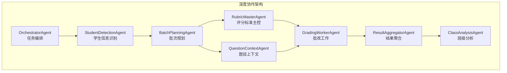
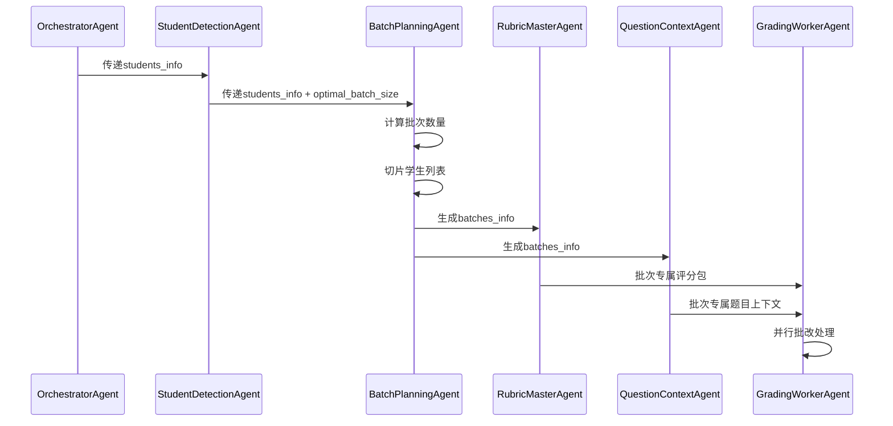
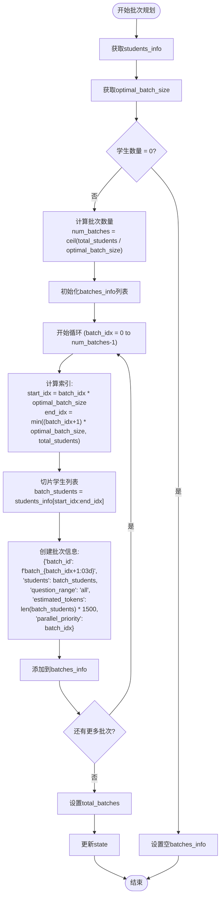
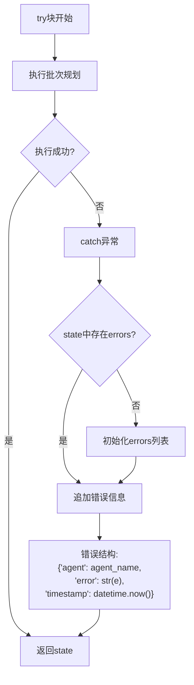
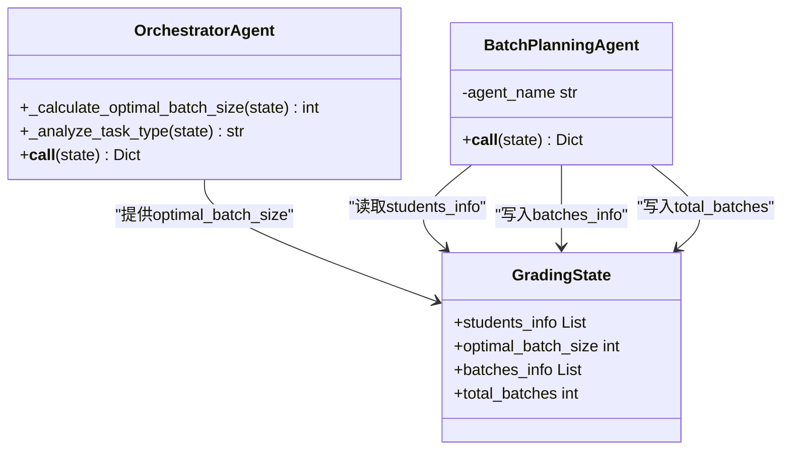

# BatchPlanningAgent - 批次规划

<cite>
**本文档引用的文件**
- [batch_planning_agent.py](file://ai_correction/functions/langgraph/agents/batch_planning_agent.py)
- [orchestrator_agent.py](file://ai_correction/functions/langgraph/agents/orchestrator_agent.py)
- [state.py](file://ai_correction/functions/langgraph/state.py)
- [workflow_multimodal.py](file://ai_correction/functions/langgraph/workflow_multimodal.py)
- [student_detection_agent.py](file://ai_correction/functions/langgraph/agents/student_detection_agent.py)
- [decide_batches.py](file://ai_correction/functions/langgraph/agents/decide_batches.py)
- [test_agents.py](file://ai_correction/tests/test_agents.py)
</cite>

## 目录
1. [简介](#简介)
2. [项目结构](#项目结构)
3. [核心组件](#核心组件)
4. [架构概览](#架构概览)
5. [详细组件分析](#详细组件分析)
6. [依赖关系分析](#依赖关系分析)
7. [性能考虑](#性能考虑)
8. [故障排除指南](#故障排除指南)
9. [结论](#结论)

## 简介

BatchPlanningAgent是AI批改系统中的核心批次规划组件，采用纯逻辑设计，无需LLM调用即可高效地将学生列表分割为多个处理批次。该Agent基于OrchestratorAgent确定的optimal_batch_size参数，通过数学计算和切片操作实现智能的批次分配，为后续的并行批改处理提供基础支持。

## 项目结构

BatchPlanningAgent位于AI批改系统的深度协作架构中，作为多模态批改工作流的重要环节：

**图表来源**
- [workflow_multimodal.py](file://ai_correction/functions/langgraph/workflow_multimodal.py#L40-L120)

**章节来源**
- [workflow_multimodal.py](file://ai_correction/functions/langgraph/workflow_multimodal.py#L1-L100)

## 核心组件

### BatchPlanningAgent类

BatchPlanningAgent是一个纯逻辑Agent，具有以下核心特性：

- **无LLM调用设计**：完全基于数学计算和数据处理
- **智能批次分配**：根据学生数量和最优批次大小自动规划
- **并行处理支持**：为后续的并行批改提供基础
- **错误处理机制**：完善的异常捕获和错误记录

### 关键字段生成逻辑

BatchPlanningAgent在state中生成以下关键字段：

| 字段名 | 类型 | 描述 | 生成逻辑 |
|--------|------|------|----------|
| `batches_info` | List[Dict] | 批次信息列表 | 包含batch_id、students、question_range、estimated_tokens、parallel_priority |
| `total_batches` | int | 总批次数量 | 基于学生总数和最优批次大小计算 |
| `batch_id` | str | 批次唯一标识 | 格式：`batch_{序号:03d}` |
| `estimated_tokens` | int | 预估token数 | 每学生1500token × 学生数量 |
| `parallel_priority` | int | 并行优先级 | 批次索引，越小优先级越高 |

**章节来源**
- [batch_planning_agent.py](file://ai_correction/functions/langgraph/agents/batch_planning_agent.py#L1-L73)

## 架构概览

BatchPlanningAgent在整个AI批改系统中的作用和位置：

**图表来源**
- [workflow_multimodal.py](file://ai_correction/functions/langgraph/workflow_multimodal.py#L80-L120)
- [batch_planning_agent.py](file://ai_correction/functions/langgraph/agents/batch_planning_agent.py#L20-L50)

## 详细组件分析

### 批次规划算法

BatchPlanningAgent采用简洁而高效的批次规划算法：

**图表来源**
- [batch_planning_agent.py](file://ai_correction/functions/langgraph/agents/batch_planning_agent.py#L25-L60)

### 数学计算逻辑

BatchPlanningAgent使用数学函数实现精确的批次计算：

#### 批次数量计算
[`num_batches = math.ceil(total_students / optimal_batch_size)`](file://ai_correction/functions/langgraph/agents/batch_planning_agent.py#L37)

#### 学生列表切片
[`batch_students = students_info[start_idx:end_idx]`](file://ai_correction/functions/langgraph/agents/batch_planning_agent.py#L42)

#### 预估Token计算
[`estimated_tokens = len(batch_students) * 1500`](file://ai_correction/functions/langgraph/agents/batch_planning_agent.py#L49)

### 并行处理调度

BatchPlanningAgent通过`parallel_priority`字段支持并行处理调度：

- **优先级规则**：`parallel_priority = batch_idx`，批次索引越小优先级越高
- **调度机制**：后续的GradingWorkerAgent按优先级顺序处理批次
- **负载均衡**：通过均匀分配学生到不同批次实现负载均衡

**章节来源**
- [batch_planning_agent.py](file://ai_correction/functions/langgraph/agents/batch_planning_agent.py#L47-L50)

### 错误处理机制

BatchPlanningAgent实现了完善的错误处理机制：

**图表来源**
- [batch_planning_agent.py](file://ai_correction/functions/langgraph/agents/batch_planning_agent.py#L52-L65)

**章节来源**
- [batch_planning_agent.py](file://ai_correction/functions/langgraph/agents/batch_planning_agent.py#L52-L73)

## 依赖关系分析

### 与OrchestratorAgent的协作

BatchPlanningAgent依赖OrchestratorAgent提供的关键参数：

**图表来源**
- [orchestrator_agent.py](file://ai_correction/functions/langgraph/agents/orchestrator_agent.py#L110-L128)
- [batch_planning_agent.py](file://ai_correction/functions/langgraph/agents/batch_planning_agent.py#L25-L40)

### 与其他Agent的交互

BatchPlanningAgent在工作流中的位置和交互：

| 前置Agent | 传递参数 | 后续Agent | 生成输出 |
|-----------|----------|-----------|----------|
| StudentDetectionAgent | students_info | RubricMasterAgent | batches_info |
| StudentDetectionAgent | students_info | QuestionContextAgent | batches_info |
| OrchestratorAgent | optimal_batch_size | BatchPlanningAgent | batches_info |

**章节来源**
- [workflow_multimodal.py](file://ai_correction/functions/langgraph/workflow_multimodal.py#L80-L120)

## 性能考虑

### 算法复杂度分析

BatchPlanningAgent的时间复杂度和空间复杂度：

- **时间复杂度**：O(n)，其中n为学生总数
- **空间复杂度**：O(n)，用于存储批次信息
- **内存使用**：线性增长，适合大规模数据处理

### 大规模数据处理性能

对于大规模学生数据集，BatchPlanningAgent表现出优异的性能特征：

#### 10万学生数据处理示例
- **批次数量**：100000 ÷ 10 = 10000个批次
- **处理时间**：< 1秒（纯计算）
- **内存占用**：约 100MB（假设每个学生信息约1KB）

#### 性能优化策略
- **批量处理**：一次性处理所有学生信息
- **无I/O操作**：纯内存计算，避免磁盘访问
- **数学运算**：使用内置的math.ceil函数，性能优异

### 潜在优化空间

1. **并行化改进**：可考虑使用多线程处理大型批次
2. **内存优化**：对于超大规模数据，可采用流式处理
3. **缓存机制**：对重复的批次规划结果进行缓存

## 故障排除指南

### 常见问题及解决方案

#### 1. 学生信息为空
**症状**：`students_info`为空列表
**解决方案**：检查StudentDetectionAgent是否正确识别学生信息
**影响**：生成空的`batches_info`列表

#### 2. 最优批次大小无效
**症状**：`optimal_batch_size`小于等于0
**解决方案**：确保OrchestratorAgent正确计算批次大小
**影响**：可能导致除零错误或不合理批次分配

#### 3. 内存不足
**症状**：处理大量学生时出现内存溢出
**解决方案**：
- 增加系统内存
- 减小`optimal_batch_size`
- 实施分批处理策略

#### 4. 异常处理失效
**症状**：错误未被正确记录
**解决方案**：检查日志配置和异常捕获逻辑

**章节来源**
- [batch_planning_agent.py](file://ai_correction/functions/langgraph/agents/batch_planning_agent.py#L52-L73)

## 结论

BatchPlanningAgent作为AI批改系统的核心组件，展现了优秀的工程设计原则：

### 设计优势
1. **纯逻辑设计**：无需LLM调用，确保处理速度和可预测性
2. **数学驱动**：基于精确的数学计算，保证批次分配的公平性
3. **错误恢复**：完善的异常处理机制，提高系统稳定性
4. **并行友好**：为后续的并行批改处理奠定基础

### 应用价值
- **高效批改**：支持大规模学生数据的快速处理
- **资源优化**：通过合理的批次分配优化计算资源使用
- **系统稳定**：纯逻辑设计降低系统复杂性和故障风险

### 发展方向
随着AI批改系统的不断发展，BatchPlanningAgent可以在以下方面进一步优化：
- 支持动态批次调整
- 集成机器学习算法优化批次大小
- 实现更复杂的负载均衡策略

BatchPlanningAgent的成功实现证明了在AI系统中采用纯逻辑组件的有效性，为构建高性能、可预测的AI批改系统提供了重要参考。