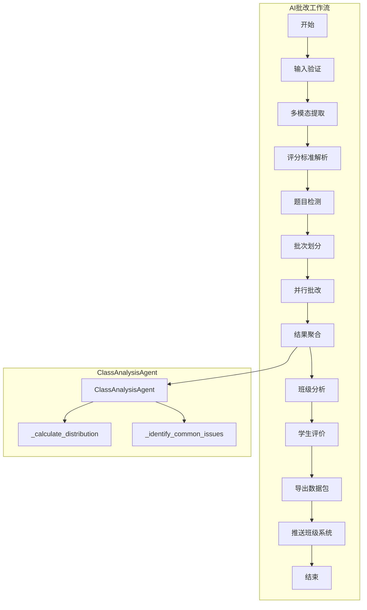
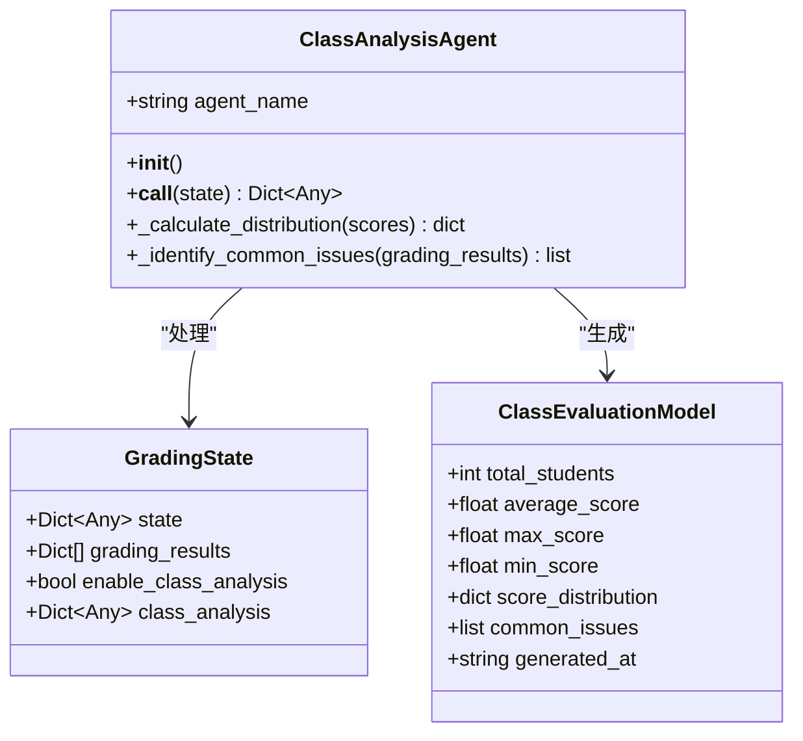
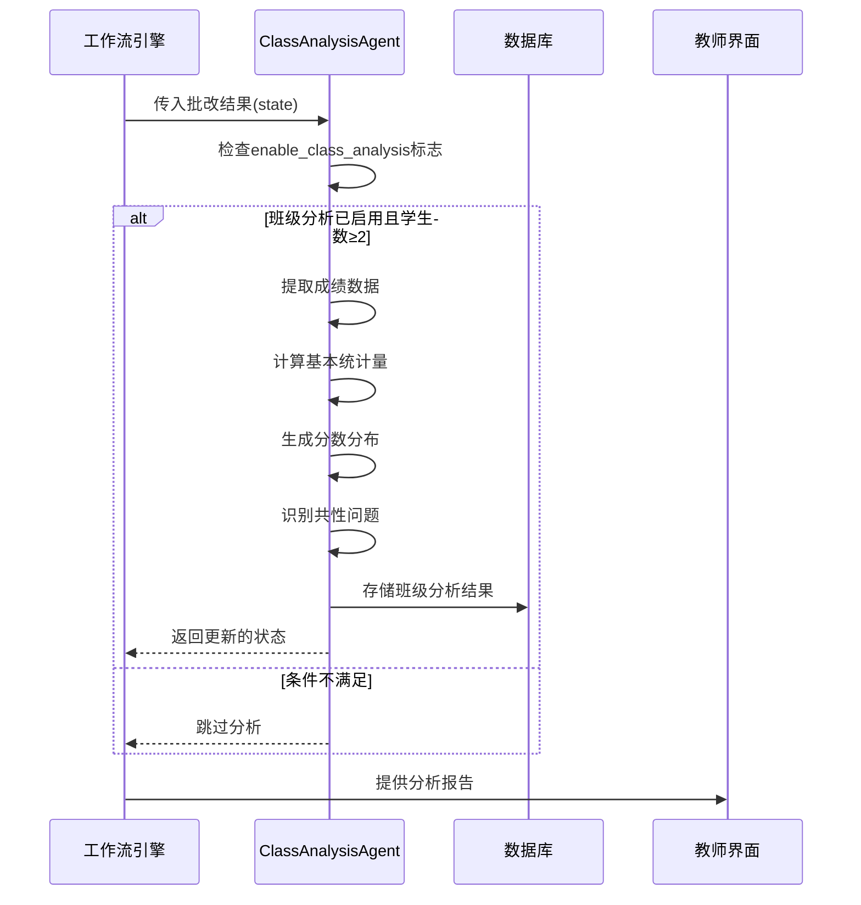
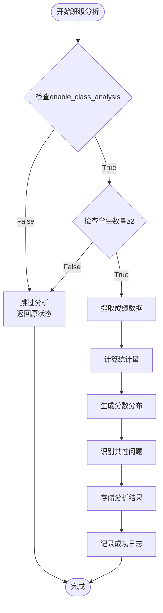
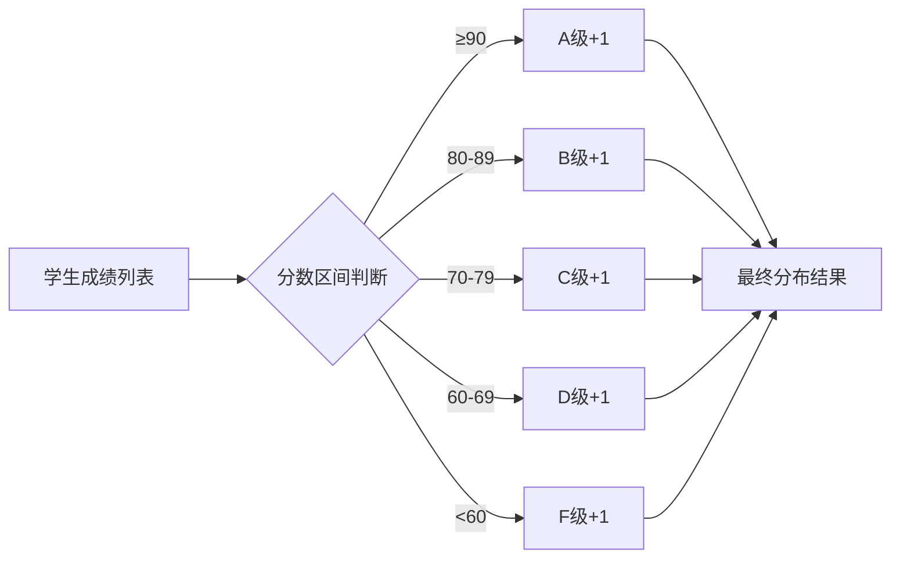
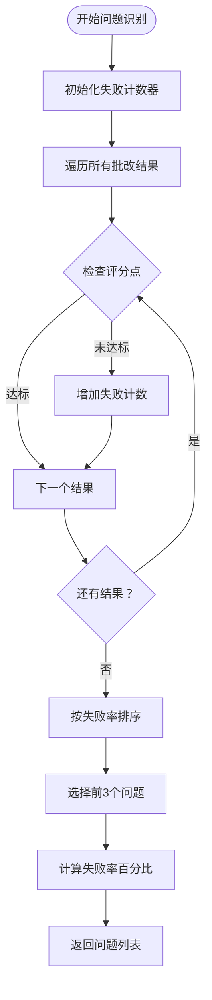
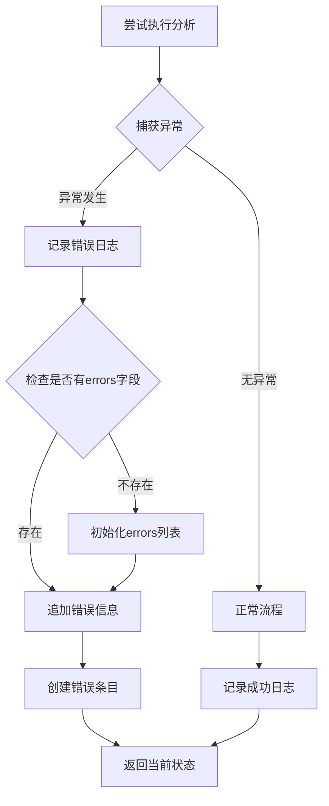
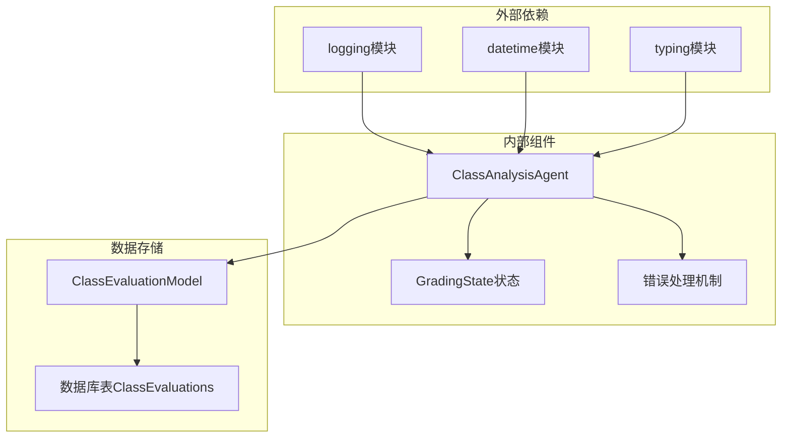

# ClassAnalysisAgent - 班级整体分析

<cite>
**本文档引用的文件**
- [class_analysis_agent.py](file://ai_correction/functions/langgraph/agents/class_analysis_agent.py)
- [state.py](file://ai_correction/functions/langgraph/state.py)
- [models.py](file://ai_correction/functions/database/models.py)
- [workflow_new.py](file://ai_correction/functions/langgraph/workflow_new.py)
- [test_agents.py](file://ai_correction/tests/test_agents.py)
- [FINAL_IMPLEMENTATION_SUMMARY.md](file://ai_correction/docs/FINAL_IMPLEMENTATION_SUMMARY.md)
</cite>

## 目录
1. [简介](#简介)
2. [项目结构](#项目结构)
3. [核心组件](#核心组件)
4. [架构概览](#架构概览)
5. [详细组件分析](#详细组件分析)
6. [依赖关系分析](#依赖关系分析)
7. [性能考虑](#性能考虑)
8. [故障排除指南](#故障排除指南)
9. [结论](#结论)

## 简介

ClassAnalysisAgent是AI批改系统中的关键组件，专门负责生成班级层面的整体分析报告。该Agent在批量批改模式下自动启用，为教师提供全面的班级学习效果洞察，帮助识别教学重点和改进方向。

ClassAnalysisAgent的核心职责包括：
- 根据`enable_class_analysis`标志决定是否执行班级分析
- 检查学生数量是否满足分析条件（至少2名学生）
- 计算基本统计量（平均分、最高分、最低分）
- 生成分数分布报告（A-F等级人数统计）
- 识别共性问题并按失败率排序
- 提供数据驱动的教学建议

## 项目结构

ClassAnalysisAgent位于AI批改系统的LangGraph工作流中，作为第五阶段的重要组件：

**图表来源**
- [workflow_new.py](file://ai_correction/functions/langgraph/workflow_new.py#L60-L100)
- [SYSTEM_ARCHITECTURE.md](file://ai_correction/docs/SYSTEM_ARCHITECTURE.md#L395-L460)

**章节来源**
- [workflow_new.py](file://ai_correction/functions/langgraph/workflow_new.py#L60-L100)
- [state.py](file://ai_correction/functions/langgraph/state.py#L140-L145)

## 核心组件

ClassAnalysisAgent由以下核心组件构成：

### 主要类结构

**图表来源**
- [class_analysis_agent.py](file://ai_correction/functions/langgraph/agents/class_analysis_agent.py#L15-L122)
- [state.py](file://ai_correction/functions/langgraph/state.py#L140-L145)

### 数据结构定义

ClassAnalysisAgent处理的关键数据结构包括：

| 字段名称 | 类型 | 描述 | 示例值 |
|---------|------|------|--------|
| total_students | int | 班级总学生数 | 45 |
| average_score | float | 平均分数 | 78.5 |
| max_score | float | 最高分 | 95.0 |
| min_score | float | 最低分 | 42.0 |
| score_distribution | dict | 分数分布统计 | {'A': 10, 'B': 20, 'C': 12, 'D': 3, 'F': 0} |
| common_issues | list | 共性问题列表 | [{'criterion_id': 'C1', 'failure_count': 15, 'failure_rate': 33.3}] |
| generated_at | string | 生成时间戳 | '2024-01-15 14:30:25' |

**章节来源**
- [class_analysis_agent.py](file://ai_correction/functions/langgraph/agents/class_analysis_agent.py#L35-L55)
- [models.py](file://ai_correction/functions/database/models.py#L194-L232)

## 架构概览

ClassAnalysisAgent在AI批改系统中的架构位置和作用：

**图表来源**
- [class_analysis_agent.py](file://ai_correction/functions/langgraph/agents/class_analysis_agent.py#L20-L85)
- [workflow_new.py](file://ai_correction/functions/langgraph/workflow_new.py#L92-L125)

## 详细组件分析

### 1. 班级分析触发机制

ClassAnalysisAgent采用条件触发机制，确保只在合适的场景下执行分析：

**图表来源**
- [class_analysis_agent.py](file://ai_correction/functions/langgraph/agents/class_analysis_agent.py#L20-L85)

#### 触发条件详解

ClassAnalysisAgent通过以下双重检查确保分析的有效性：

1. **配置检查**：验证`enable_class_analysis`标志是否启用
2. **数据完整性检查**：确保至少有2名学生的成绩数据

这种设计避免了在小样本情况下产生误导性的分析结果。

**章节来源**
- [class_analysis_agent.py](file://ai_correction/functions/langgraph/agents/class_analysis_agent.py#L25-L35)

### 2. 基本统计量计算

ClassAnalysisAgent实现了完整的统计分析功能：

#### 平均分计算
- **公式**：`sum(scores) / len(scores)`
- **边界处理**：空列表时返回0
- **精度**：保留一位小数

#### 极值分析
- **最高分**：使用Python内置`max()`函数
- **最低分**：使用Python内置`min()`函数
- **空数据处理**：返回0作为默认值

#### 分数分布统计

ClassAnalysisAgent采用五等级评分体系：

| 等级 | 分数范围 | 描述 |
|------|----------|------|
| A | 90-100 | 优秀 |
| B | 80-89 | 良好 |
| C | 70-79 | 中等 |
| D | 60-69 | 及格边缘 |
| F | 0-59 | 不及格 |

**图表来源**
- [class_analysis_agent.py](file://ai_correction/functions/langgraph/agents/class_analysis_agent.py#L86-L100)

**章节来源**
- [class_analysis_agent.py](file://ai_correction/functions/langgraph/agents/class_analysis_agent.py#L35-L55)

### 3. 共性问题识别算法

ClassAnalysisAgent通过分析评分点的失分情况来识别班级共性问题：

#### 问题识别流程

**图表来源**
- [class_analysis_agent.py](file://ai_correction/functions/langgraph/agents/class_analysis_agent.py#L102-L122)

#### 问题数据结构

每个共性问题包含以下信息：

| 字段 | 类型 | 描述 | 计算方式 |
|------|------|------|----------|
| criterion_id | string | 评分点ID | 从评分结果中提取 |
| failure_count | int | 失败次数 | 统计未达标次数 |
| failure_rate | float | 失败率（百分比） | `failure_count / total_students * 100` |

**章节来源**
- [class_analysis_agent.py](file://ai_correction/functions/langgraph/agents/class_analysis_agent.py#L102-L122)

### 4. 错误处理机制

ClassAnalysisAgent实现了完善的错误处理机制：

**图表来源**
- [class_analysis_agent.py](file://ai_correction/functions/langgraph/agents/class_analysis_agent.py#L60-L85)

**章节来源**
- [class_analysis_agent.py](file://ai_correction/functions/langgraph/agents/class_analysis_agent.py#L60-L85)

## 依赖关系分析

ClassAnalysisAgent的依赖关系图：

**图表来源**
- [class_analysis_agent.py](file://ai_correction/functions/langgraph/agents/class_analysis_agent.py#L1-L10)
- [state.py](file://ai_correction/functions/langgraph/state.py#L140-L145)

### 外部依赖

ClassAnalysisAgent依赖以下Python标准库模块：
- `logging`：提供日志记录功能
- `datetime`：生成时间戳
- `typing`：类型提示支持

### 内部依赖

主要依赖于LangGraph的工作流状态管理系统，通过`GradingState`访问批改结果数据。

**章节来源**
- [class_analysis_agent.py](file://ai_correction/functions/langgraph/agents/class_analysis_agent.py#L1-L10)
- [state.py](file://ai_correction/functions/langgraph/state.py#L140-L145)

## 性能考虑

### 时间复杂度分析

ClassAnalysisAgent的时间复杂度主要取决于学生数量n：

| 操作 | 时间复杂度 | 说明 |
|------|------------|------|
| 基本统计计算 | O(n) | 遍历所有成绩数据一次 |
| 分数分布统计 | O(n) | 对每个成绩进行等级判断 |
| 共性问题识别 | O(m×n) | m为评分点数量，n为学生数量 |
| 排序操作 | O(m log m) | 按失败率对问题排序 |

### 空间复杂度分析

- **输入空间**：O(n) - 存储所有学生成绩
- **中间变量**：O(1) - 固定数量的统计变量
- **输出空间**：O(m) - 存储共性问题列表（最多3个）

### 优化策略

1. **早期退出**：当学生数量不足时立即返回
2. **内存效率**：使用生成器表达式减少内存占用
3. **缓存机制**：避免重复计算相同的统计数据

## 故障排除指南

### 常见问题及解决方案

#### 1. 班级分析未执行

**症状**：日志显示"班级分析未启用，跳过"

**原因**：`enable_class_analysis`标志未设置为True

**解决方案**：
- 检查工作流配置
- 确保在批改设置中启用了班级分析功能

#### 2. 学生数量不足

**症状**：日志显示"学生数量不足，跳过班级分析"

**原因**：参与批改的学生数量少于2人

**解决方案**：
- 确保至少有2名学生提交了答案
- 检查文件上传和解析过程是否正确

#### 3. 分析结果为空

**症状**：`class_analysis`字段缺失或为空

**原因**：批改过程中发生异常

**解决方案**：
- 检查`errors`字段中的错误信息
- 查看详细日志以定位具体问题

#### 4. 共性问题识别不准确

**症状**：识别出的问题不符合实际情况

**原因**：
- 评分标准不够细化
- 学生答案质量差异过大

**解决方案**：
- 优化评分标准的粒度
- 增加评分点的数量和明确性

**章节来源**
- [class_analysis_agent.py](file://ai_correction/functions/langgraph/agents/class_analysis_agent.py#L25-L35)
- [class_analysis_agent.py](file://ai_correction/functions/langgraph/agents/class_analysis_agent.py#L60-L85)

## 结论

ClassAnalysisAgent是AI批改系统中不可或缺的智能分析组件，它通过以下方式显著提升了教育数据洞察的价值：

### 核心价值

1. **自动化分析**：无需人工干预即可生成全面的班级分析报告
2. **数据驱动决策**：基于真实数据提供客观的教学改进建议
3. **及时反馈**：在批改完成后立即生成分析结果
4. **可扩展性**：支持不同规模的班级和多样化的评分标准

### 教学应用价值

ClassAnalysisAgent生成的分析报告为教师提供了以下教学洞察：

- **整体学习效果**：通过平均分、极值和分布情况了解班级整体水平
- **知识薄弱点**：通过共性问题识别定位需要重点讲解的知识点
- **教学策略调整**：基于数据分析结果优化教学方法和内容安排
- **个性化指导**：识别需要额外辅导的学生群体

### 技术优势

- **鲁棒性强**：完善的错误处理和边界条件检查
- **性能高效**：线性时间复杂度，适合大规模数据处理
- **易于集成**：与现有工作流无缝对接
- **可维护性好**：清晰的代码结构和完善的日志记录

ClassAnalysisAgent代表了现代教育技术中数据分析与人工智能结合的最佳实践，为提升教学质量提供了强有力的技术支撑。