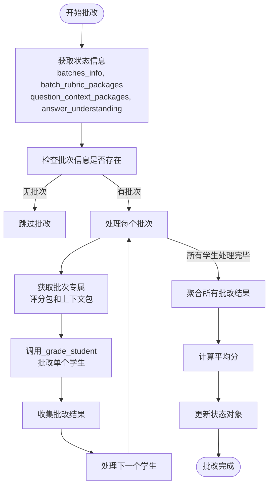
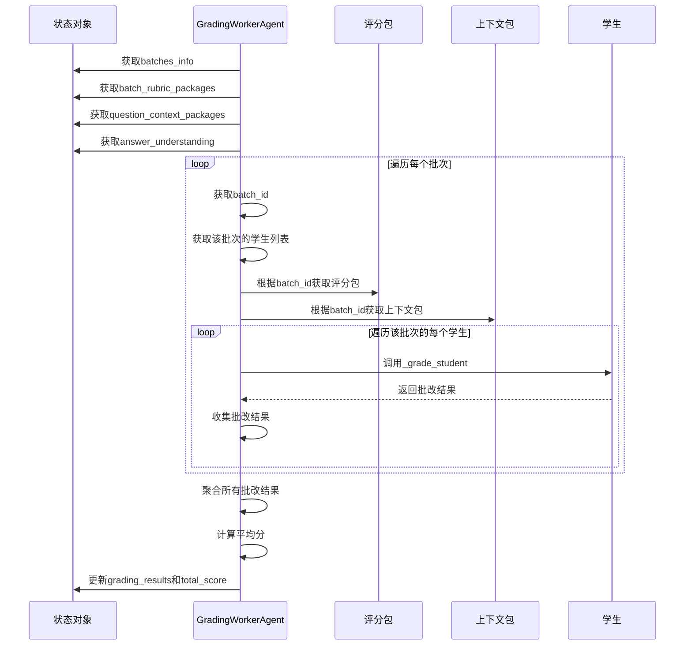
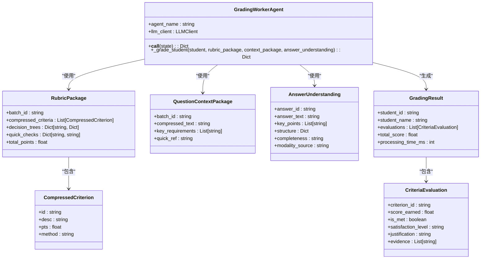
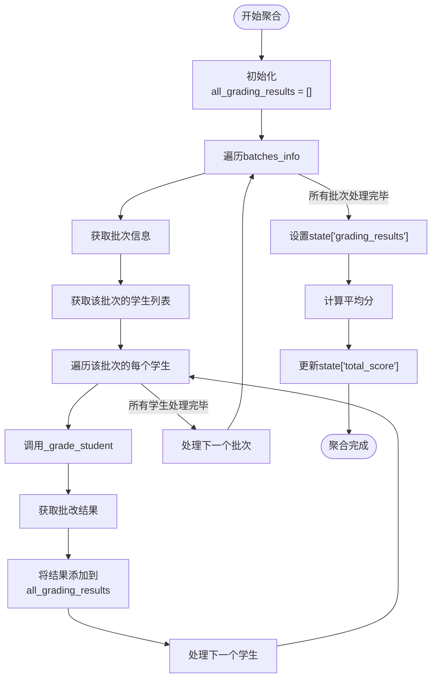
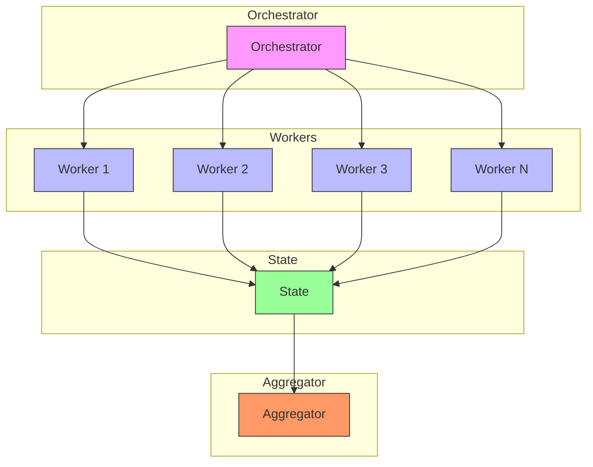
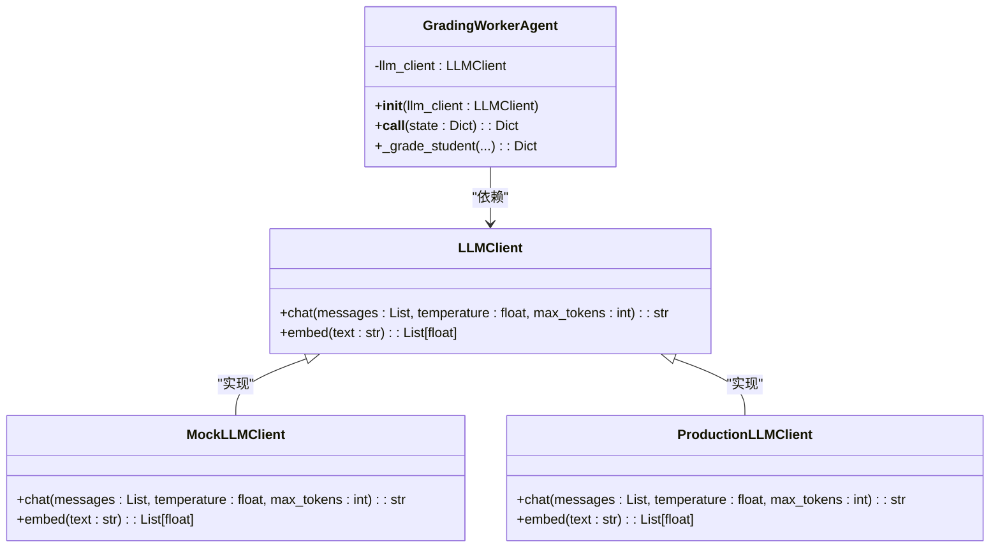
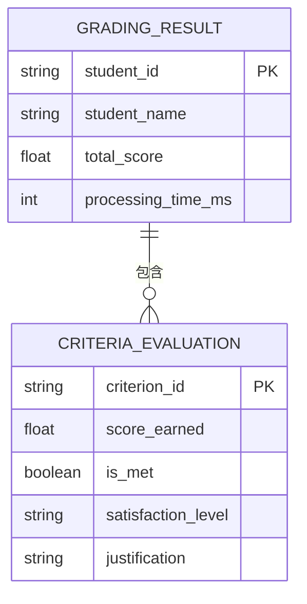
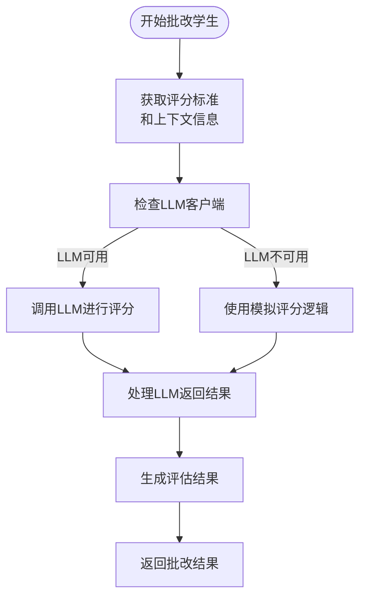

# GradingWorkerAgent - 并行批改执行

<cite>
**本文档引用的文件**
- [grading_worker_agent.py](file://ai_correction/functions/langgraph/agents/grading_worker_agent.py)
- [state.py](file://ai_correction/functions/langgraph/state.py)
- [multimodal_models.py](file://ai_correction/functions/langgraph/multimodal_models.py)
- [rubric_master_agent.py](file://ai_correction/functions/langgraph/agents/rubric_master_agent.py)
- [question_context_agent.py](file://ai_correction/functions/langgraph/agents/question_context_agent.py)
- [routing.py](file://ai_correction/functions/langgraph/routing.py)
</cite>

## 目录
1. [引言](#引言)
2. [核心工作机制](#核心工作机制)
3. [批改流程分析](#批改流程分析)
4. [评分逻辑详解](#评分逻辑详解)
5. [结果聚合与计算](#结果聚合与计算)
6. [并行处理能力](#并行处理能力)
7. [依赖注入设计](#依赖注入设计)
8. [数据结构说明](#数据结构说明)
9. [集成点分析](#集成点分析)
10. [结论](#结论)

## 引言
GradingWorkerAgent作为AI批改系统的核心执行单元，负责基于定制化评分标准和题目上下文对学生答案进行高效批改。该Agent通过接收压缩版评分包和上下文信息，实现了token消耗的最小化，同时保证了批改的准确性和效率。本文档将深入分析其工作机制、评分逻辑、并行处理能力以及与其他组件的集成方式。

## 核心工作机制
GradingWorkerAgent的核心工作机制围绕着对`batches_info`的遍历展开，为每个批次的学生调用私有方法`_grade_student`进行批改。该Agent通过整合`batch_rubric_packages`和`question_context_packages`中的压缩信息，并结合`answer_understanding`来全面评估学生答案。

Agent的执行入口是`__call__`方法，该方法接收一个包含批改任务所有相关信息的状态对象`state`。在执行过程中，Agent首先从状态中提取批次信息、评分包、上下文包和答案理解结果，然后依次处理每个批次中的学生。

**Diagram sources**
- [grading_worker_agent.py](file://ai_correction/functions/langgraph/agents/grading_worker_agent.py#L25-L85)

**Section sources**
- [grading_worker_agent.py](file://ai_correction/functions/langgraph/agents/grading_worker_agent.py#L25-L135)

## 批改流程分析
GradingWorkerAgent的批改流程始于对`batches_info`的遍历。`batches_info`是状态对象中的一个列表，包含了所有需要批改的批次信息。每个批次包含批次ID和该批次下的学生列表。

对于每个批次，Agent会从`batch_rubric_packages`中获取对应的评分包，从`question_context_packages`中获取对应的上下文包。这些包是经过压缩和优化的，旨在减少LLM调用时的token消耗。

**Diagram sources**
- [grading_worker_agent.py](file://ai_correction/functions/langgraph/agents/grading_worker_agent.py#L48-L65)
- [state.py](file://ai_correction/functions/langgraph/state.py#L200-L220)

**Section sources**
- [grading_worker_agent.py](file://ai_correction/functions/langgraph/agents/grading_worker_agent.py#L48-L85)
- [state.py](file://ai_correction/functions/langgraph/state.py#L200-L220)

## 评分逻辑详解
`_grade_student`方法是GradingWorkerAgent的核心评分逻辑所在。该方法接收学生信息、评分包、上下文包和答案理解结果，返回该学生的批改结果。

评分包（`rubric_package`）包含三个关键部分：`compressed_criteria`（压缩版评分标准）、`decision_trees`（决策树）和`quick_checks`（快速检查方法）。这些信息都是从原始评分标准中提取和压缩的，旨在提供足够的批改依据同时最小化token消耗。

**Diagram sources**
- [grading_worker_agent.py](file://ai_correction/functions/langgraph/agents/grading_worker_agent.py#L79-L118)
- [multimodal_models.py](file://ai_correction/functions/langgraph/multimodal_models.py#L65-L94)
- [rubric_master_agent.py](file://ai_correction/functions/langgraph/agents/rubric_master_agent.py#L89-L126)

**Section sources**
- [grading_worker_agent.py](file://ai_correction/functions/langgraph/agents/grading_worker_agent.py#L79-L118)
- [multimodal_models.py](file://ai_correction/functions/langgraph/multimodal_models.py#L65-L94)

## 结果聚合与计算
GradingWorkerAgent在完成所有学生的批改后，会将所有批改结果聚合到状态对象的`grading_results`字段中，并计算平均分。

聚合过程通过一个简单的循环实现，将每个学生的批改结果添加到`all_grading_results`列表中。平均分的计算采用算术平均法，即所有学生总分之和除以学生总数。

**Diagram sources**
- [grading_worker_agent.py](file://ai_correction/functions/langgraph/agents/grading_worker_agent.py#L65-L85)

**Section sources**
- [grading_worker_agent.py](file://ai_correction/functions/langgraph/agents/grading_worker_agent.py#L65-L85)

## 并行处理能力
GradingWorkerAgent的设计支持并行处理，这是通过Orchestrator-Worker模式实现的。虽然GradingWorkerAgent本身是单个Worker，但系统通过Orchestrator可以创建多个GradingWorkerAgent实例并行处理不同的批次。

`create_parallel_batch_workers`函数是实现并行处理的关键，它为每个批次创建一个独立的`Send`对象，指向`evaluate_batch_worker`节点。LangGraph框架会自动并行执行这些Worker。

**Diagram sources**
- [routing.py](file://ai_correction/functions/langgraph/routing.py#L114-L153)
- [workflow_new.py](file://ai_correction/functions/langgraph/workflow_new.py#L59-L66)

**Section sources**
- [routing.py](file://ai_correction/functions/langgraph/routing.py#L114-L153)

## 依赖注入设计
GradingWorkerAgent采用了依赖注入设计模式，通过构造函数接收`llm_client`依赖。这种设计模式提高了代码的可测试性和灵活性，使得可以在不修改Agent代码的情况下替换不同的LLM客户端实现。

**Diagram sources**
- [grading_worker_agent.py](file://ai_correction/functions/langgraph/agents/grading_worker_agent.py#L15-L23)

**Section sources**
- [grading_worker_agent.py](file://ai_correction/functions/langgraph/agents/grading_worker_agent.py#L15-L23)

## 数据结构说明
GradingWorkerAgent处理和生成的数据结构经过精心设计，以支持高效的批改流程和结果表示。

### 批改结果数据结构
批改结果以字典列表的形式存储在`grading_results`字段中，每个字典代表一个学生的批改结果。

**Diagram sources**
- [grading_worker_agent.py](file://ai_correction/functions/langgraph/agents/grading_worker_agent.py#L105-L118)
- [multimodal_models.py](file://ai_correction/functions/langgraph/multimodal_models.py#L150-L170)

**Section sources**
- [grading_worker_agent.py](file://ai_correction/functions/langgraph/agents/grading_worker_agent.py#L105-L118)

## 集成点分析
GradingWorkerAgent的评分逻辑中包含一个关键的集成点：模拟批改与实际LLM调用的集成。在当前实现中，`_grade_student`方法使用模拟逻辑（`score_earned = pts * 0.8`）来代替实际的LLM调用。

**Diagram sources**
- [grading_worker_agent.py](file://ai_correction/functions/langgraph/agents/grading_worker_agent.py#L90-L100)

**Section sources**
- [grading_worker_agent.py](file://ai_correction/functions/langgraph/agents/grading_worker_agent.py#L90-L100)

## 结论
GradingWorkerAgent作为AI批改系统的核心执行单元，通过高效的批改流程、优化的评分逻辑和灵活的架构设计，实现了对学生答案的快速准确评估。其并行处理能力和依赖注入设计模式不仅提高了系统的吞吐量和可维护性，还为未来的扩展和优化提供了坚实的基础。通过将模拟评分逻辑与实际LLM调用的集成点明确标识，系统为从开发到生产的平滑过渡提供了便利。