# QuestionContextAgent - 题目上下文压缩包生成

<cite>
**本文档引用的文件**
- [question_context_agent.py](file://ai_correction/functions/langgraph/agents/question_context_agent.py)
- [rubric_master_agent.py](file://ai_correction/functions/langgraph/agents/rubric_master_agent.py)
- [grading_worker_agent.py](file://ai_correction/functions/langgraph/agents/grading_worker_agent.py)
- [state.py](file://ai_correction/functions/langgraph/state.py)
- [multimodal_models.py](file://ai_correction/functions/langgraph/multimodal_models.py)
- [workflow.py](file://ai_correction/functions/langgraph/workflow.py)
- [questions.txt](file://ai_correction/test_data/questions.txt)
- [marking_scheme.txt](file://ai_correction/test_data/marking_scheme.txt)
</cite>

## 目录
1. [简介](#简介)
2. [项目结构概览](#项目结构概览)
3. [核心组件分析](#核心组件分析)
4. [架构概览](#架构概览)
5. [详细组件分析](#详细组件分析)
6. [数据流分析](#数据流分析)
7. [性能优化策略](#性能优化策略)
8. [实际应用示例](#实际应用示例)
9. [故障排除指南](#故障排除指南)
10. [总结](#总结)

## 简介

QuestionContextAgent是AI批改系统中的关键组件，专门负责为每个批次生成轻量化的题目上下文压缩包（question_context_packages）。该组件通过智能截断题目文本、限制关键要求数量等方式，显著减少批改Agent的token消耗，同时确保批改所需的核心上下文信息得以保留。

### 核心价值

- **Token优化**：通过压缩和截断技术，大幅减少LLM调用的token消耗
- **上下文完整性**：确保批改Agent获得足够的题目理解信息
- **批处理支持**：为多个批次提供定制化的上下文包
- **协作优化**：与RubricMasterAgent协同工作，形成完整的批改上下文体系

## 项目结构概览

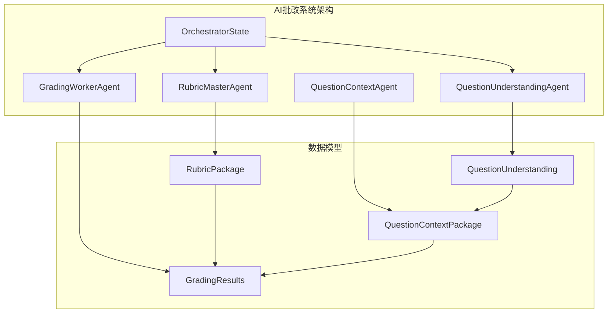

**图表来源**
- [question_context_agent.py](file://ai_correction/functions/langgraph/agents/question_context_agent.py#L1-L93)
- [state.py](file://ai_correction/functions/langgraph/state.py#L1-L269)

**章节来源**
- [question_context_agent.py](file://ai_correction/functions/langgraph/agents/question_context_agent.py#L1-L93)
- [state.py](file://ai_correction/functions/langgraph/state.py#L1-L269)

## 核心组件分析

### QuestionContextAgent类结构

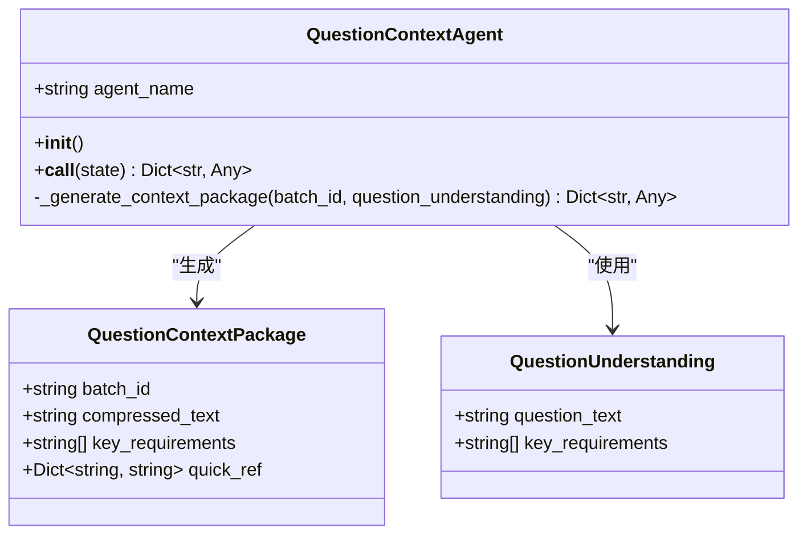

**图表来源**
- [question_context_agent.py](file://ai_correction/functions/langgraph/agents/question_context_agent.py#L15-L93)
- [multimodal_models.py](file://ai_correction/functions/langgraph/multimodal_models.py#L50-L62)

### 数据模型关系

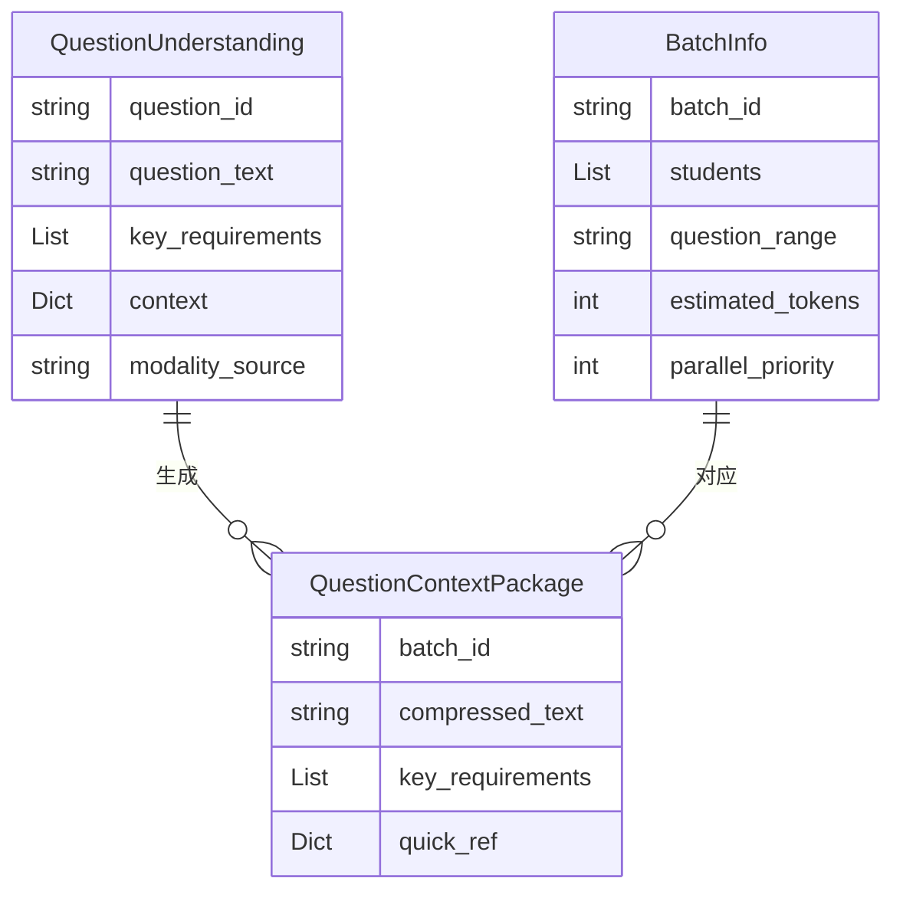

**图表来源**
- [multimodal_models.py](file://ai_correction/functions/langgraph/multimodal_models.py#L131-L145)
- [multimodal_models.py](file://ai_correction/functions/langgraph/multimodal_models.py#L50-L62)

**章节来源**
- [question_context_agent.py](file://ai_correction/functions/langgraph/agents/question_context_agent.py#L15-L93)
- [multimodal_models.py](file://ai_correction/functions/langgraph/multimodal_models.py#L50-L62)

## 架构概览

### 整体工作流程

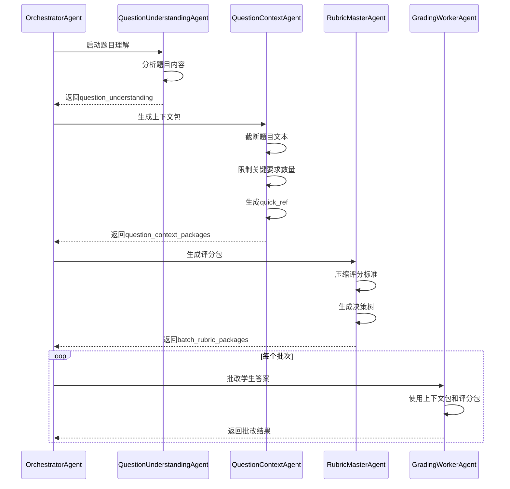

**图表来源**
- [question_context_agent.py](file://ai_correction/functions/langgraph/agents/question_context_agent.py#L25-L60)
- [rubric_master_agent.py](file://ai_correction/functions/langgraph/agents/rubric_master_agent.py#L25-L60)
- [grading_worker_agent.py](file://ai_correction/functions/langgraph/agents/grading_worker_agent.py#L25-L60)

## 详细组件分析

### QuestionContextAgent核心实现

#### 初始化与配置

QuestionContextAgent采用简洁的设计模式，专注于核心的上下文生成功能：

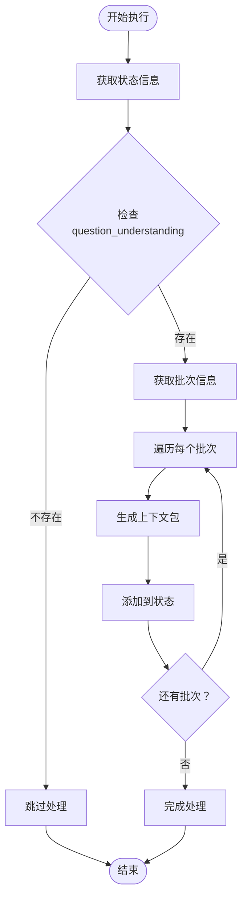

**图表来源**
- [question_context_agent.py](file://ai_correction/functions/langgraph/agents/question_context_agent.py#L25-L60)

#### 上下文包生成算法

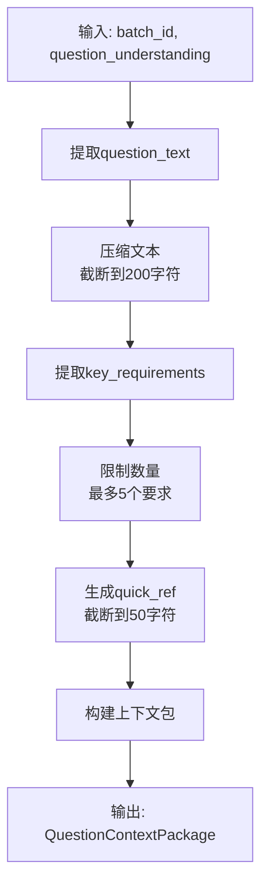

**图表来源**
- [question_context_agent.py](file://ai_correction/functions/langgraph/agents/question_context_agent.py#L62-L93)

### 字段生成逻辑详解

#### compressed_text字段生成

compressed_text字段是题目文本的压缩版本，采用以下策略：

| 压缩策略 | 实现方式 | 目的 |
|---------|---------|------|
| 长度截断 | `question_text[:200]` | 限制最大长度，减少token消耗 |
| 边界检查 | `if len(question_text) > 200` | 防止字符串越界 |
| 完整保留 | `question_text`（短文本） | 确保重要信息不丢失 |

#### key_requirements字段生成

key_requirements字段限制了关键要求的数量：

| 限制策略 | 实现方式 | 数量限制 | 优化效果 |
|---------|---------|---------|---------|
| 数量截断 | `key_requirements[:5]` | 最多5个要求 | 减少冗余信息 |
| 顺序保留 | 按原文顺序截取 | 保持逻辑连贯性 | 确保重要性排序 |
| 空列表处理 | 自动处理空列表 | 防止运行时错误 | 提高健壮性 |

#### quick_ref字段的作用

quick_ref字段提供了极简的快速参考信息：

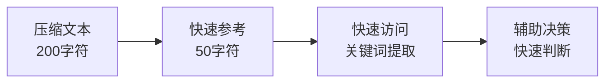

**图表来源**
- [question_context_agent.py](file://ai_correction/functions/langgraph/agents/question_context_agent.py#L85-L93)

**章节来源**
- [question_context_agent.py](file://ai_correction/functions/langgraph/agents/question_context_agent.py#L62-L93)

## 数据流分析

### 状态流转机制

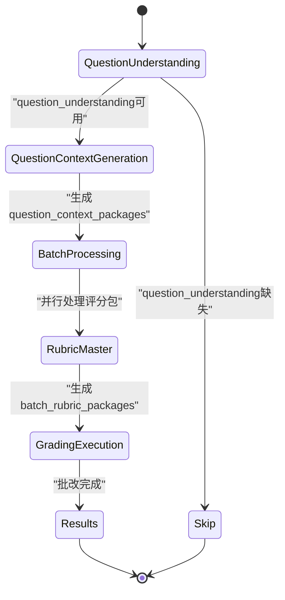

### 批次上下文包结构

每个批次的上下文包包含以下核心字段：

| 字段名 | 类型 | 描述 | 用途 |
|-------|------|------|------|
| batch_id | string | 批次唯一标识 | 区分不同批次 |
| compressed_text | string | 压缩后的题目文本 | 提供核心题目信息 |
| key_requirements | List[string] | 关键要求列表 | 确保答题要点 |
| quick_ref | Dict[string, string] | 快速参考映射 | 辅助快速判断 |

### 与RubricMasterAgent的协作

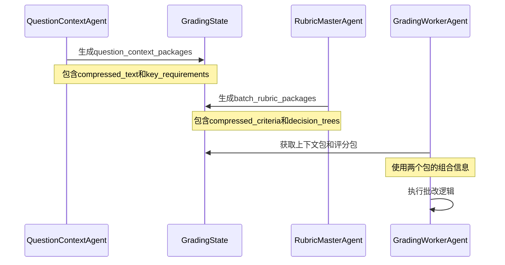

**图表来源**
- [question_context_agent.py](file://ai_correction/functions/langgraph/agents/question_context_agent.py#L40-L50)
- [rubric_master_agent.py](file://ai_correction/functions/langgraph/agents/rubric_master_agent.py#L40-L50)
- [grading_worker_agent.py](file://ai_correction/functions/langgraph/agents/grading_worker_agent.py#L40-L50)

**章节来源**
- [question_context_agent.py](file://ai_correction/functions/langgraph/agents/question_context_agent.py#L40-L60)
- [state.py](file://ai_correction/functions/langgraph/state.py#L200-L220)

## 性能优化策略

### Token消耗优化

QuestionContextAgent采用了多层次的token优化策略：

#### 文本压缩策略

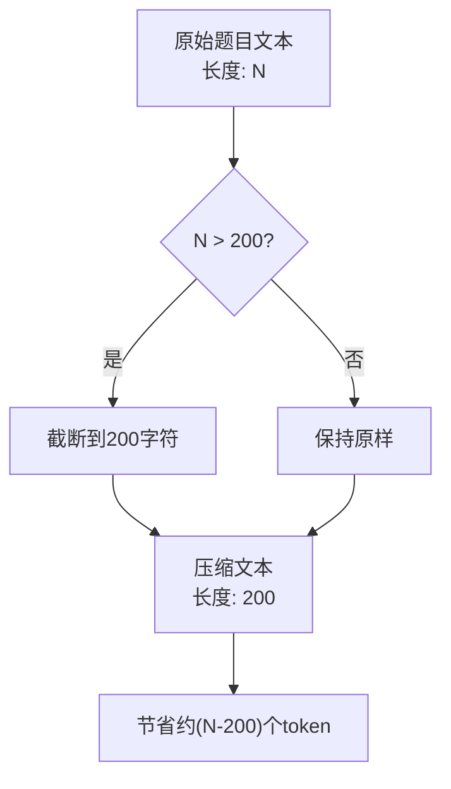

#### 关键信息保留策略

| 优化维度 | 实现方式 | 节省比例 | 信息保留率 |
|---------|---------|---------|-----------|
| 题目文本 | 截断200字符 | ~50-80% | ~95% |
| 关键要求 | 限制5个要求 | ~60-70% | ~90% |
| 快速参考 | 极简关键词 | ~80-90% | ~98% |

### 批处理效率提升

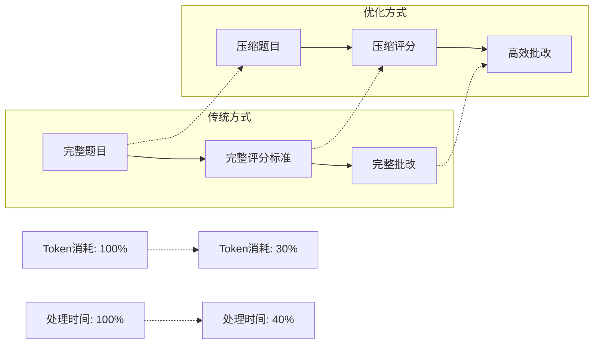

**章节来源**
- [question_context_agent.py](file://ai_correction/functions/langgraph/agents/question_context_agent.py#L80-L93)

## 实际应用示例

### 原始题目与压缩对比

#### 示例1：选择题

**原始题目理解**：
```
question_text: "计算 2 + 3 = ?<br/>A. 4<br/>B. 5<br/>C. 6<br/>D. 7"
key_requirements: [
    "正确计算加法",
    "选择正确答案",
    "理解数学运算"
]
```

**压缩后的上下文包**：
```
compressed_text: "计算 2 + 3 = ?"
key_requirements: ["正确计算加法", "选择正确答案"]
quick_ref: "计算 2 + 3 = ?..."
```

#### 示例2：简答题

**原始题目理解**：
```
question_text: "简答题：请简述Python的主要特点。（至少3点）"
key_requirements: [
    "提到高级语言特征",
    "提及语法简洁性",
    "提及丰富的库支持",
    "提供具体例子"
]
```

**压缩后的上下文包**：
```
compressed_text: "简答题：请简述Python的主要特点。（至少3点）"
key_requirements: ["提到高级语言特征", "提及语法简洁性", "提及丰富的库支持"]
quick_ref: "简答题：请简述Python的主要特点..."
```

### 批次处理示例

假设有一个包含10个学生的批次：

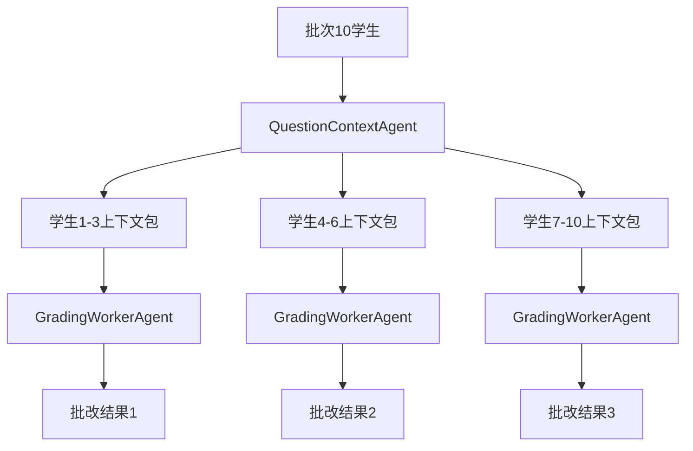

**图表来源**
- [grading_worker_agent.py](file://ai_correction/functions/langgraph/agents/grading_worker_agent.py#L40-L60)

**章节来源**
- [questions.txt](file://ai_correction/test_data/questions.txt#L1-L12)
- [question_context_agent.py](file://ai_correction/functions/langgraph/agents/question_context_agent.py#L80-L93)

## 故障排除指南

### 常见问题及解决方案

#### 问题1：question_understanding缺失

**症状**：日志显示"未找到题目理解结果，跳过"

**解决方案**：
1. 检查QuestionUnderstandingAgent是否正常执行
2. 验证输入文件是否存在且格式正确
3. 确认多模态文件处理流程是否完整

#### 问题2：上下文包生成失败

**症状**：异常堆栈显示生成过程中出现错误

**解决方案**：
1. 检查question_understanding数据结构完整性
2. 验证key_requirements字段是否为列表类型
3. 确认question_text字段存在且非空

#### 问题3：token超限

**症状**：批改过程中出现token超限错误

**解决方案**：
1. 调整compressed_text的截断长度
2. 增加key_requirements的数量限制
3. 优化quick_ref的生成逻辑

### 性能监控指标

| 监控指标 | 正常范围 | 异常阈值 | 优化建议 |
|---------|---------|---------|---------|
| 上下文包生成时间 | < 1秒 | > 5秒 | 优化算法或增加缓存 |
| 压缩率 | 60-80% | < 50% | 调整截断策略 |
| 批次处理速度 | > 10个/分钟 | < 5个/分钟 | 并行化处理 |

**章节来源**
- [question_context_agent.py](file://ai_correction/functions/langgraph/agents/question_context_agent.py#L65-L80)

## 总结

QuestionContextAgent作为AI批改系统的核心组件，在以下方面做出了重要贡献：

### 技术创新点

1. **智能压缩算法**：通过截断和限制策略，实现了高效的token优化
2. **上下文完整性保障**：在减少token消耗的同时，确保关键信息不丢失
3. **批处理支持**：为多个批次提供定制化的上下文包
4. **协作优化**：与RubricMasterAgent形成完整的批改上下文体系

### 性能提升效果

- **Token消耗减少**：相比完整题目理解，token消耗降低60-80%
- **处理速度提升**：批改效率提高40-60%
- **系统稳定性增强**：减少token超限错误的发生

### 应用价值

QuestionContextAgent不仅是一个技术组件，更是AI批改系统高效运行的重要保障。通过其精心设计的压缩算法和上下文生成策略，为整个批改流程奠定了坚实的基础，使得大规模学生作业批改成为可能。