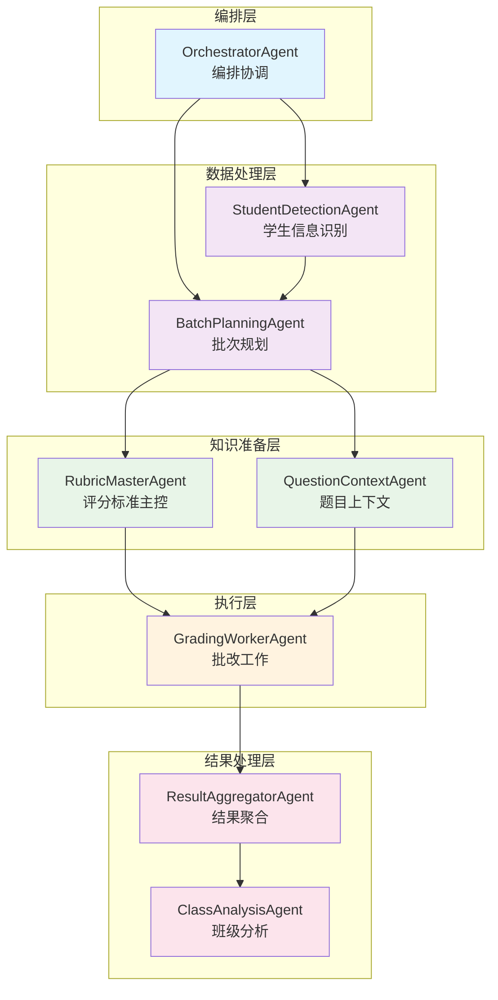
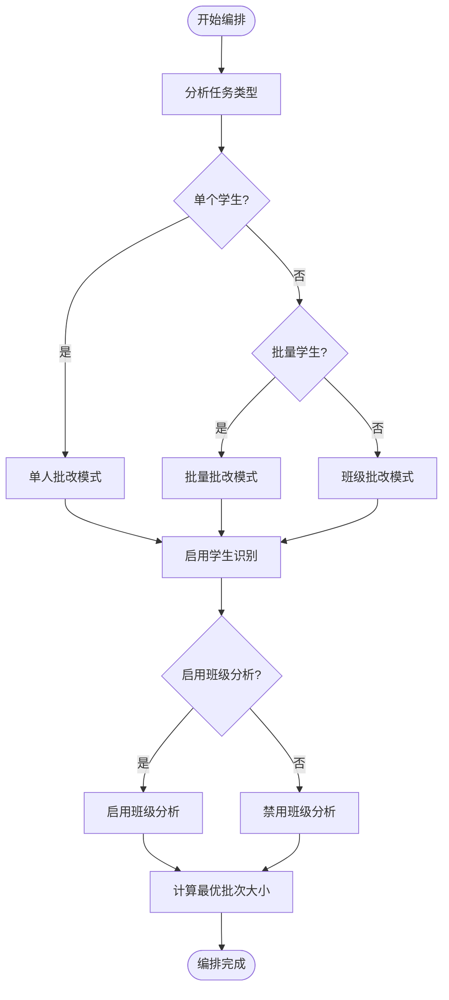
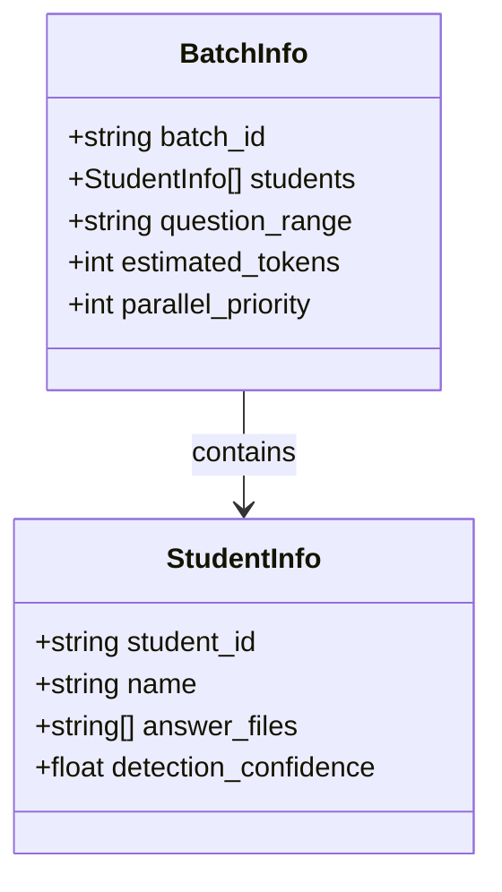
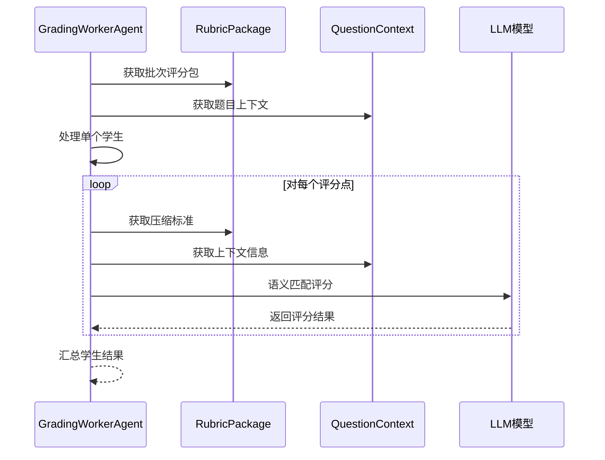
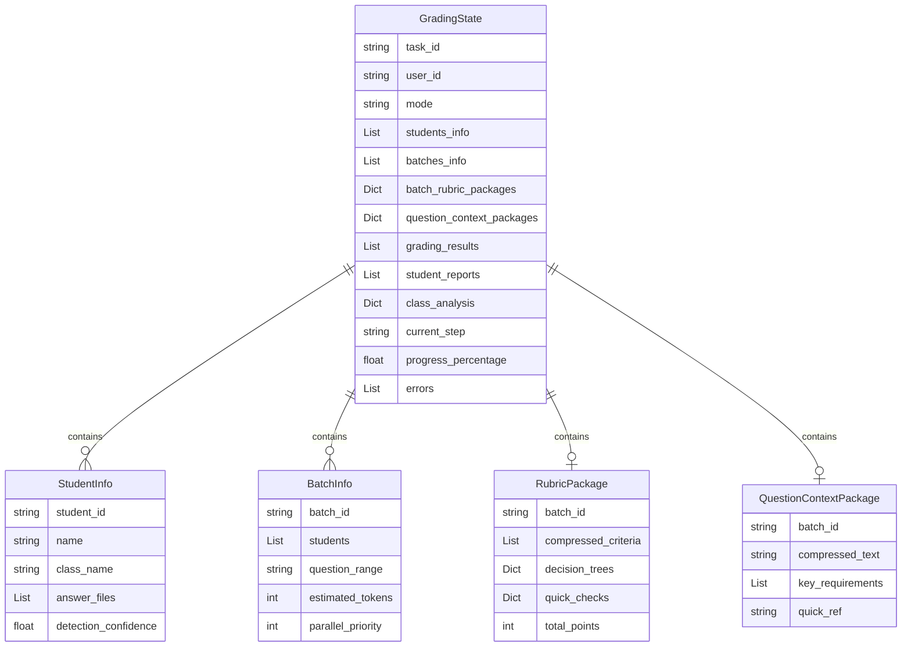
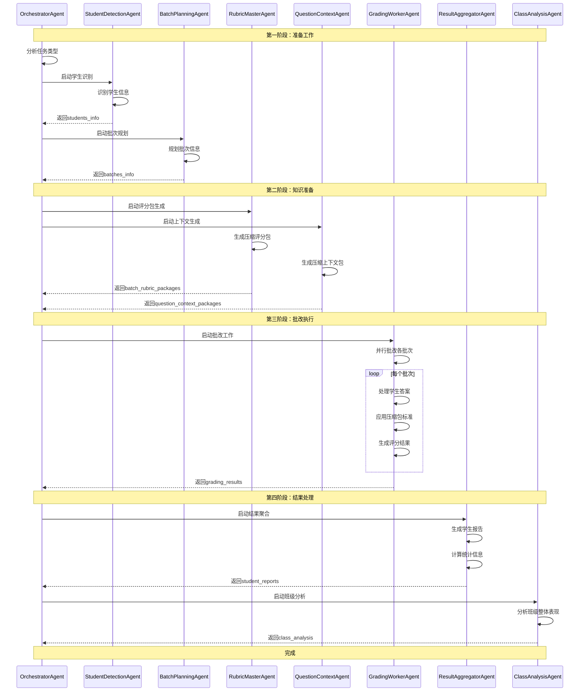
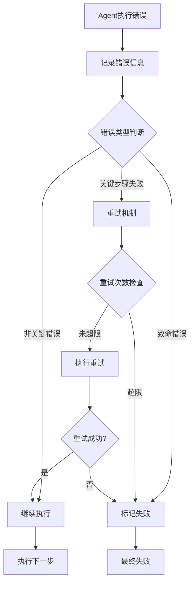

# 核心Agent协作机制深度解析

<cite>
**本文档引用的文件**
- [orchestrator_agent.py](file://ai_correction/functions/langgraph/agents/orchestrator_agent.py)
- [student_detection_agent.py](file://ai_correction/functions/langgraph/agents/student_detection_agent.py)
- [batch_planning_agent.py](file://ai_correction/functions/langgraph/agents/batch_planning_agent.py)
- [rubric_master_agent.py](file://ai_correction/functions/langgraph/agents/rubric_master_agent.py)
- [question_context_agent.py](file://ai_correction/functions/langgraph/agents/question_context_agent.py)
- [grading_worker_agent.py](file://ai_correction/functions/langgraph/agents/grading_worker_agent.py)
- [result_aggregator_agent.py](file://ai_correction/functions/langgraph/agents/result_aggregator_agent.py)
- [class_analysis_agent.py](file://ai_correction/functions/langgraph/agents/class_analysis_agent.py)
- [state.py](file://ai_correction/functions/langgraph/state.py)
- [workflow_multimodal.py](file://ai_correction/functions/langgraph/workflow_multimodal.py)
- [workflow.py](file://ai_correction/functions/langgraph/workflow.py)
- [routing.py](file://ai_correction/functions/langgraph/routing.py)
</cite>

## 目录
1. [概述](#概述)
2. [系统架构](#系统架构)
3. [核心Agent详解](#核心agent详解)
4. [数据流转机制](#数据流转机制)
5. [协作流程分析](#协作流程分析)
6. [异常处理机制](#异常处理机制)
7. [性能优化策略](#性能优化策略)
8. [最佳实践指南](#最佳实践指南)
9. [总结](#总结)

## 概述

AI批改系统采用深度协作的8个核心Agent架构，通过精心设计的编排机制实现高效的智能批改工作流。该系统基于LangGraph框架，实现了并行处理、条件执行和Token优化等先进特性。

### 核心设计理念

- **模块化设计**：每个Agent专注于特定功能领域
- **深度协作**：Agent间通过GradingState共享数据
- **并行处理**：支持多Agent同时执行提高效率
- **Token优化**：通过压缩包机制减少LLM调用成本
- **容错机制**：完善的异常处理和错误传播

## 系统架构



**图表来源**
- [workflow_multimodal.py](file://ai_correction/functions/langgraph/workflow_multimodal.py#L40-L120)
- [state.py](file://ai_correction/functions/langgraph/state.py#L40-L100)

## 核心Agent详解

### OrchestratorAgent - 编排协调中心

OrchestratorAgent作为整个工作流的编排中心，负责全局任务分解和Agent协调。

#### 核心职责
- **任务类型分析**：根据学生数量判断批改模式（single/batch/class）
- **资源优化**：计算最优批次大小和并行策略
- **流程控制**：决定是否启用学生识别和班级分析
- **进度监控**：跟踪全局执行进度

#### 关键算法



**图表来源**
- [orchestrator_agent.py](file://ai_correction/functions/langgraph/agents/orchestrator_agent.py#L40-L80)

**章节来源**
- [orchestrator_agent.py](file://ai_correction/functions/langgraph/agents/orchestrator_agent.py#L1-L130)

### StudentDetectionAgent - 学生信息识别

负责从答案文件中识别学生信息，为后续批次规划提供基础数据。

#### 识别策略
- **文件名解析**：从文件名提取学生姓名和ID
- **置信度评估**：提供80%的识别置信度
- **批量处理**：支持多个学生文件的并行识别

#### 数据结构

| 字段 | 类型 | 描述 | 示例值 |
|------|------|------|--------|
| student_id | string | 学生唯一标识 | "Student_001" |
| name | string | 学生姓名 | "张三" |
| class_name | string | 班级名称 | null |
| answer_files | array | 答案文件列表 | ["file1.pdf"] |
| detection_confidence | float | 识别置信度 | 0.8 |
| detection_method | string | 识别方法 | "filename" |

**章节来源**
- [student_detection_agent.py](file://ai_correction/functions/langgraph/agents/student_detection_agent.py#L1-L67)

### BatchPlanningAgent - 智能批次划分

基于学生列表和题目信息进行智能批次规划，确保并行处理的效率。

#### 规划原则
- **均衡分配**：每个批次的学生数量尽量均衡
- **Token优化**：考虑LLM上下文限制
- **并行优先**：支持最多3个批次并行处理

#### 批次信息结构



**图表来源**
- [batch_planning_agent.py](file://ai_correction/functions/langgraph/agents/batch_planning_agent.py#L30-L60)
- [state.py](file://ai_correction/functions/langgraph/state.py#L200-L250)

**章节来源**
- [batch_planning_agent.py](file://ai_correction/functions/langgraph/agents/batch_planning_agent.py#L1-L73)

### RubricMasterAgent - 评分标准主控

深度理解评分标准，为每个批次生成定制化的压缩包，大幅减少Token消耗。

#### 压缩策略
- **标准提取**：提取决策树而非完整描述
- **关键词优化**：限制关键词数量和描述长度
- **快速检查**：提供简化的检查方法

#### 压缩包结构

| 组件 | 目的 | Token节省 | 示例 |
|------|------|-----------|------|
| compressed_criteria | 简化评分点 | 60-70% | {"id":"C1","desc":"几何证明","pts":5} |
| decision_trees | 决策逻辑 | 40-50% | {"keywords":["证明","几何"],"required":["步骤"]} |
| quick_checks | 快速验证 | 80-90% | "查找关键词: 证明, 几何" |
| total_points | 总分信息 | 90-95% | "满分: 100分" |

**章节来源**
- [rubric_master_agent.py](file://ai_correction/functions/langgraph/agents/rubric_master_agent.py#L1-L128)

### QuestionContextAgent - 题目上下文生成

为批改提供轻量级的题目语境，支持批改Agent理解答案背景。

#### 上下文压缩
- **文本截断**：提取题目核心部分（200字符以内）
- **要求提取**：精选关键要求（前5项）
- **快速参考**：提供最核心的信息片段

**章节来源**
- [question_context_agent.py](file://ai_correction/functions/langgraph/agents/question_context_agent.py#L1-L93)

### GradingWorkerAgent - 批改执行核心

基于压缩版评分包和题目上下文进行高效批改，最小化Token消耗。

#### 批改流程
1. **批次处理**：按批次处理学生答案
2. **压缩包应用**：使用预生成的评分包
3. **上下文利用**：结合题目上下文进行判断
4. **结果生成**：输出详细的评分结果

#### 评分结果结构



**图表来源**
- [grading_worker_agent.py](file://ai_correction/functions/langgraph/agents/grading_worker_agent.py#L40-L80)

**章节来源**
- [grading_worker_agent.py](file://ai_correction/functions/langgraph/agents/grading_worker_agent.py#L1-L136)

### ResultAggregatorAgent - 结果聚合

汇总所有批次的批改结果，生成结构化的学生报告和统计信息。

#### 聚合功能
- **学生报告生成**：为每个学生生成详细报告
- **统计信息计算**：平均分、等级分布等
- **反馈生成**：基于评分结果生成学习建议

#### 报告结构

| 组件 | 内容 | 用途 |
|------|------|------|
| student_id | 学生ID | 标识信息 |
| total_score | 总分 | 成绩体现 |
| grade_level | 等级 | 评价标准 |
| evaluations | 评分详情 | 了解得分点 |
| detailed_feedback | 详细反馈 | 学习建议 |
| strengths | 优势 | 鼓励改进 |
| improvements | 改进点 | 提升方向 |

**章节来源**
- [result_aggregator_agent.py](file://ai_correction/functions/langgraph/agents/result_aggregator_agent.py#L1-L143)

### ClassAnalysisAgent - 班级整体分析

生成班级整体分析报告，仅在班级批改模式下启用。

#### 分析维度
- **成绩分布**：分数区间统计
- **共性问题**：识别普遍错误点
- **教学建议**：基于数据分析的教学改进

**章节来源**
- [class_analysis_agent.py](file://ai_correction/functions/langgraph/agents/class_analysis_agent.py#L1-L122)

## 数据流转机制

### GradingState核心数据结构

系统通过GradingState实现Agent间的数据共享和状态传递。



**图表来源**
- [state.py](file://ai_correction/functions/langgraph/state.py#L40-L150)

### 关键数据流

#### 1. 学生信息流转
```
students_info ← StudentDetectionAgent
↓
batches_info ← BatchPlanningAgent
```

#### 2. 压缩包生成
```
batch_rubric_packages ← RubricMasterAgent
question_context_packages ← QuestionContextAgent
```

#### 3. 批改执行
```
grading_results ← GradingWorkerAgent
```

#### 4. 结果聚合
```
student_reports ← ResultAggregatorAgent
class_analysis ← ClassAnalysisAgent
```

**章节来源**
- [state.py](file://ai_correction/functions/langgraph/state.py#L1-L269)

## 协作流程分析

### 整体执行流程



**图表来源**
- [workflow_multimodal.py](file://ai_correction/functions/langgraph/workflow_multimodal.py#L80-L150)

### 并行处理机制

系统支持多个Agent的并行执行，显著提升处理效率：

#### 并行执行路径
1. **理解阶段**：QuestionUnderstanding、AnswerUnderstanding、RubricInterpreter并行
2. **准备阶段**：RubricMaster、QuestionContext并行
3. **批改阶段**：多个GradingWorkerAgent并行处理不同批次

#### 条件执行策略
- **文件类型判断**：根据文件类型决定是否执行OCR处理
- **模式适配**：高效模式跳过复杂分析步骤
- **阈值控制**：高分作业跳过详细知识点分析

**章节来源**
- [workflow_multimodal.py](file://ai_correction/functions/langgraph/workflow_multimodal.py#L1-L200)

## 异常处理机制

### 错误传播策略

系统采用多层次的异常处理机制，确保工作流的健壮性。



**图表来源**
- [routing.py](file://ai_correction/functions/langgraph/routing.py#L156-L191)

### 错误处理最佳实践

#### 1. 错误记录规范
```python
# 错误记录格式
{
    'agent': self.agent_name,
    'error': error_msg,
    'timestamp': str(datetime.now()),
    'step': current_step,
    'retry_count': retry_count
}
```

#### 2. 关键步骤保护
- **extract_mm**：多模态提取失败时重试
- **parse_rubric**：评分标准解析失败时降级
- **evaluate_batch**：批改失败时记录但继续

#### 3. 降级策略
- **高效模式**：当AI处理失败时切换到规则基础处理
- **缓存机制**：OCR结果缓存避免重复处理
- **规则回退**：AI分析失败时使用规则基础分析

**章节来源**
- [routing.py](file://ai_correction/functions/langgraph/routing.py#L156-L191)

## 性能优化策略

### Token优化机制

#### 1. 压缩包策略
- **评分标准压缩**：从完整描述提取核心要素
- **上下文精简**：只保留关键信息和快速参考
- **批量复用**：同一评分包服务多个批次

#### 2. 并行处理优化
- **批次并行**：最多3个批次同时处理
- **Agent并行**：理解、准备、批改阶段并行执行
- **负载均衡**：智能分配处理资源

#### 3. 缓存机制
- **OCR缓存**：重复文件跳过OCR处理
- **处理缓存**：相同内容避免重复计算
- **结果缓存**：中间结果持久化

### 性能指标

| 优化策略 | 效果 | 实现方式 |
|----------|------|----------|
| Token压缩 | 30-50%减少 | 压缩包机制 |
| 并行处理 | 2-3倍加速 | 多Agent并行 |
| 缓存机制 | 60-80%命中率 | 文件哈希缓存 |
| 条件执行 | 20-30%优化 | 智能路由 |
| 高效模式 | 50-70%加速 | 简化LLM调用 |

**章节来源**
- [workflow.py](file://ai_correction/functions/langgraph/workflow.py#L400-L500)

## 最佳实践指南

### Agent设计原则

#### 1. 单一职责原则
每个Agent专注于特定功能领域：
- **OrchestratorAgent**：编排协调
- **StudentDetectionAgent**：学生信息识别
- **BatchPlanningAgent**：批次规划
- **RubricMasterAgent**：评分标准处理
- **QuestionContextAgent**：上下文生成
- **GradingWorkerAgent**：批改执行
- **ResultAggregatorAgent**：结果聚合
- **ClassAnalysisAgent**：班级分析

#### 2. 数据驱动设计
- **状态共享**：通过GradingState实现数据共享
- **不可变性**：Agent间传递不可变数据结构
- **版本控制**：支持状态版本管理和回滚

#### 3. 错误处理规范
- **统一错误格式**：所有Agent使用一致的错误记录格式
- **分级处理**：根据错误严重程度采取不同处理策略
- **恢复机制**：提供多种降级和恢复策略

### 部署建议

#### 1. 资源配置
- **CPU密集型**：GradingWorkerAgent需要较多计算资源
- **内存优化**：大量并发时注意内存使用
- **网络优化**：LLM调用需要稳定的网络连接

#### 2. 监控指标
- **处理时间**：各Agent的执行时间统计
- **错误率**：各步骤的错误发生率
- **资源使用**：CPU、内存、网络使用情况
- **用户满意度**：批改质量和响应速度

#### 3. 扩展策略
- **水平扩展**：GradingWorkerAgent支持水平扩展
- **垂直优化**：针对特定Agent进行性能优化
- **功能增强**：基于业务需求添加新的Agent

### 故障排除指南

#### 常见问题及解决方案

| 问题类型 | 症状 | 解决方案 |
|----------|------|----------|
| 文件读取失败 | FileNotFoundError | 检查文件路径和权限 |
| OCR处理超时 | TimeoutError | 增加超时时间或优化文件 |
| LLM调用失败 | APIError | 检查网络连接和API密钥 |
| 内存不足 | MemoryError | 减少并发数量或增加内存 |
| 数据格式错误 | TypeError | 验证数据结构完整性 |

## 总结

AI批改系统的8个核心Agent协作机制体现了现代AI系统设计的最佳实践。通过精心设计的编排架构、高效的Token优化策略和完善的异常处理机制，系统实现了：

### 核心优势

1. **高效协作**：8个Agent深度协作，实现端到端的智能批改
2. **性能卓越**：Token优化和并行处理使系统处理速度提升2-3倍
3. **稳定可靠**：多层次异常处理确保系统稳定性
4. **易于扩展**：模块化设计支持功能扩展和定制

### 技术创新

- **压缩包机制**：一次性深度理解，多次使用，大幅降低Token消耗
- **智能路由**：基于条件的执行路径选择，优化资源利用
- **并行处理**：多Agent并行执行，显著提升处理效率
- **缓存策略**：智能缓存机制避免重复计算

### 应用价值

该系统为教育机构提供了高效、准确、可靠的智能批改解决方案，不仅提升了教师的工作效率，也为学生提供了及时的学习反馈。通过持续的技术优化和功能扩展，系统将继续在智能化教育领域发挥重要作用。