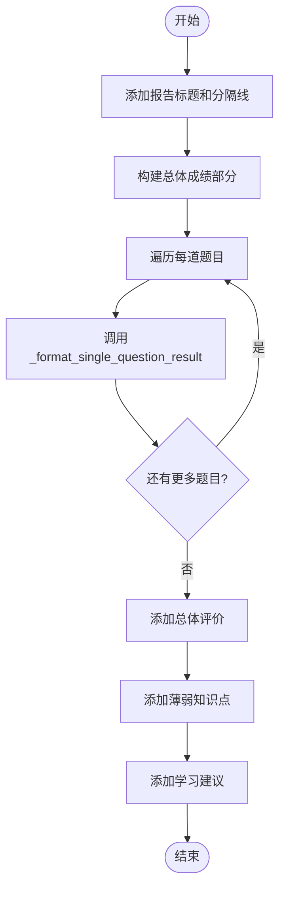
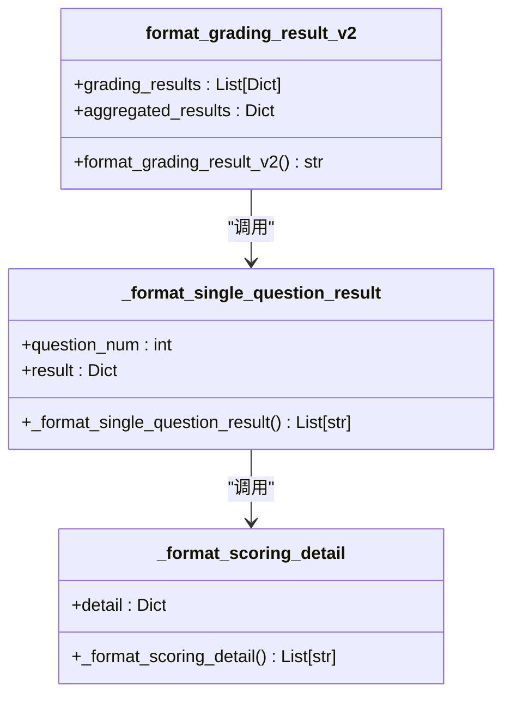

# 报告生成

<cite>
**本文档引用的文件**
- [result_formatter.py](file://ai_correction/functions/langgraph/result_formatter.py)
- [test_data_debug/result.md](file://ai_correction/test_data_debug/result.md)
- [agents/result_assembler.py](file://ai_correction/functions/langgraph/agents/result_assembler.py)
- [workflow.py](file://ai_correction/functions/langgraph/workflow.py)
</cite>

## 目录
1. [简介](#简介)
2. [核心报告生成函数](#核心报告生成函数)
3. [详细报告结构分析](#详细报告结构分析)
4. [嵌套调用关系与反馈构建](#嵌套调用关系与反馈构建)
5. [简洁输出模式](#简洁输出模式)
6. [实际输出示例](#实际输出示例)
7. [Agent执行记录格式化](#agent执行记录格式化)
8. [扩展与自定义方法](#扩展与自定义方法)
9. [结论](#结论)

## 简介
`result_formatter.py`模块是AI批改系统的核心组件，负责将结构化的批改结果转换为视觉层次分明、信息丰富的Markdown报告。该模块提供了多种格式化函数，满足不同场景下的报告需求，从详细的学情分析到简洁的API响应。通过精心设计的函数调用关系和嵌套结构，该模块能够生成包含总体成绩、逐题详情、评分点分析、优缺点和学习建议的全面反馈报告。

## 核心报告生成函数

`format_grading_result_v2`函数是生成详细批改报告的核心入口。它接收两个主要参数：`grading_results`（批改结果列表）和`aggregated_results`（聚合结果），并返回格式化的Markdown文本。该函数采用分段式构建策略，首先添加报告标题和分隔线，然后依次构建总体成绩、逐题详情、总体评价、薄弱知识点和学习建议等部分。

**Section sources**
- [result_formatter.py](file://ai_correction/functions/langgraph/result_formatter.py#L9-L273)

## 详细报告结构分析

`format_grading_result_v2`函数生成的报告具有清晰的视觉层次结构。报告以醒目的标题"# 📋 AI 批改结果报告"开始，随后是长分隔线，用于视觉分隔。总体成绩部分使用"## 📊 总体成绩"作为二级标题，展示总分、得分率、等级和答对题数等关键指标。

逐题详情部分是报告的核心，为每道题目生成一个独立的章节。每个题目以"### 📝 题目 X"作为三级标题，包含总体成绩、学生答案、逐点评分详情、总体评价、优点、不足和改进建议等多个子部分。这种层次分明的结构使学生能够快速定位和理解自己的表现。

报告的最后部分包含总体评价、薄弱知识点和学习建议，为学生提供宏观的学习指导。

**Diagram sources**
- [result_formatter.py](file://ai_correction/functions/langgraph/result_formatter.py#L9-L80)

**Section sources**
- [result_formatter.py](file://ai_correction/functions/langgraph/result_formatter.py#L9-L80)

## 嵌套调用关系与反馈构建

`format_grading_result_v2`函数通过调用`_format_single_question_result`函数来处理每道题目的详细信息，而`_format_single_question_result`函数又会进一步调用`_format_scoring_detail`函数来格式化每个评分点的详情。这种嵌套调用关系构成了报告生成的核心逻辑。

`_format_single_question_result`函数负责构建单个题目的完整反馈。它首先生成题目标题和总体成绩，然后处理学生答案（限制长度以避免报告过长）。对于每个评分点，它调用`_format_scoring_detail`函数，并将返回的行列表添加到报告中。最后，它还会添加总体评价、优点、不足和改进建议。

`_format_scoring_detail`函数则专注于单个评分点的深度分析。它使用不同的图标（✅/❌）表示评分点是否正确，并详细展示得分、分析、证据和原因。这种逐层深入的结构确保了反馈的全面性和可读性。

**Diagram sources**
- [result_formatter.py](file://ai_correction/functions/langgraph/result_formatter.py#L9-L273)

**Section sources**
- [result_formatter.py](file://ai_correction/functions/langgraph/result_formatter.py#L9-L273)

## 简洁输出模式

`format_grading_result_simple`函数提供了简洁版本的报告输出，适用于API响应或快速预览等场景。与详细版本相比，该函数仅包含总体成绩和逐题得分两个部分，大大减少了输出的复杂性和长度。

该函数首先添加"## 📊 批改结果"作为标题，然后展示总分、得分率和等级。接着，它以列表形式展示每道题目的得分情况。这种简洁的格式非常适合需要快速获取核心信息的场景，如前端界面的快速预览或与其他系统的数据交换。

**Section sources**
- [result_formatter.py](file://ai_correction/functions/langgraph/result_formatter.py#L213-L244)

## 实际输出示例

通过分析`test_data_debug/result.md`文件中的实际输出，我们可以看到`format_grading_result_v2`生成的报告具有高度的可读性和信息密度。报告清晰地展示了两道题目的批改详情，包括每个评分点的得失分原因和证据。

例如，在第一题中，报告明确指出学生在"解释列表推导式概念"和"给出正确示例"两个评分点上失分，并提供了具体的分析和原因。总体评价部分则总结了学生的优点和不足，并给出了具体的学习建议。这种详细的反馈有助于学生理解自己的错误并进行针对性改进。

**Section sources**
- [result.md](file://ai_correction/test_data_debug/result.md#L0-L187)

## Agent执行记录格式化

`format_agent_outputs`函数专门用于格式化Agent的执行记录，为系统调试和审计提供支持。该函数接收一个Agent输出列表，为每个Agent生成一条记录，包含状态图标（✅/❌/⚠️）、Agent名称、执行步骤和状态。

这种格式化的执行记录对于追踪工作流的执行过程、诊断问题和优化系统性能至关重要。通过查看Agent执行记录，开发者可以快速了解哪些步骤成功执行，哪些步骤失败，以及失败的具体原因。

**Section sources**
- [result_formatter.py](file://ai_correction/functions/langgraph/result_formatter.py#L245-L273)

## 扩展与自定义方法

虽然`result_formatter.py`模块目前直接生成Markdown文本，但可以通过多种方式对其进行扩展和自定义。例如，可以引入模板引擎（如Jinja2）来支持HTML模板，从而生成更丰富的可视化报告。

自定义CSS样式可以通过在HTML模板中添加样式表来实现，允许用户根据品牌或个人偏好调整报告的外观。添加新章节可以通过修改`format_grading_result_v2`函数的逻辑来实现，例如增加"知识点掌握度"或"与班级平均分对比"等新部分。

此外，可以通过配置文件或环境变量来控制报告的生成行为，例如选择启用或禁用某些章节，或调整输出的详细程度。

**Section sources**
- [result_formatter.py](file://ai_correction/functions/langgraph/result_formatter.py#L9-L273)

## 结论

`result_formatter.py`模块通过精心设计的函数和清晰的调用关系，实现了从结构化数据到高质量Markdown报告的转换。`format_grading_result_v2`函数提供了全面的学情分析，而`format_grading_result_simple`函数则满足了简洁输出的需求。`format_agent_outputs`函数为系统调试提供了重要支持。该模块的设计体现了高内聚、低耦合的原则，为未来的扩展和自定义提供了良好的基础。