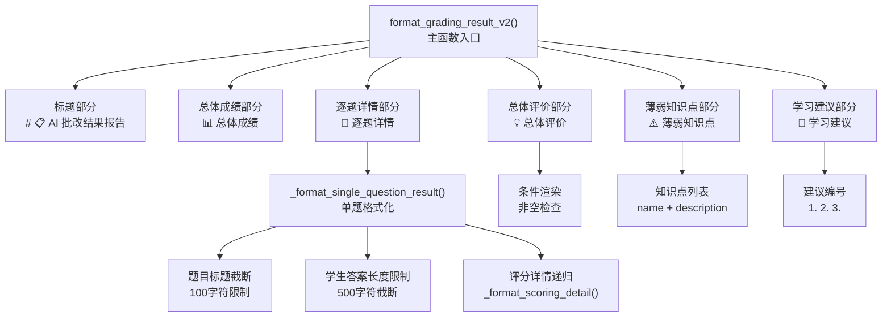
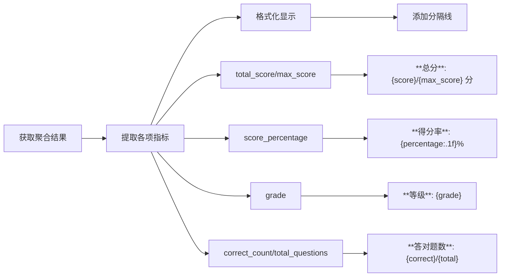
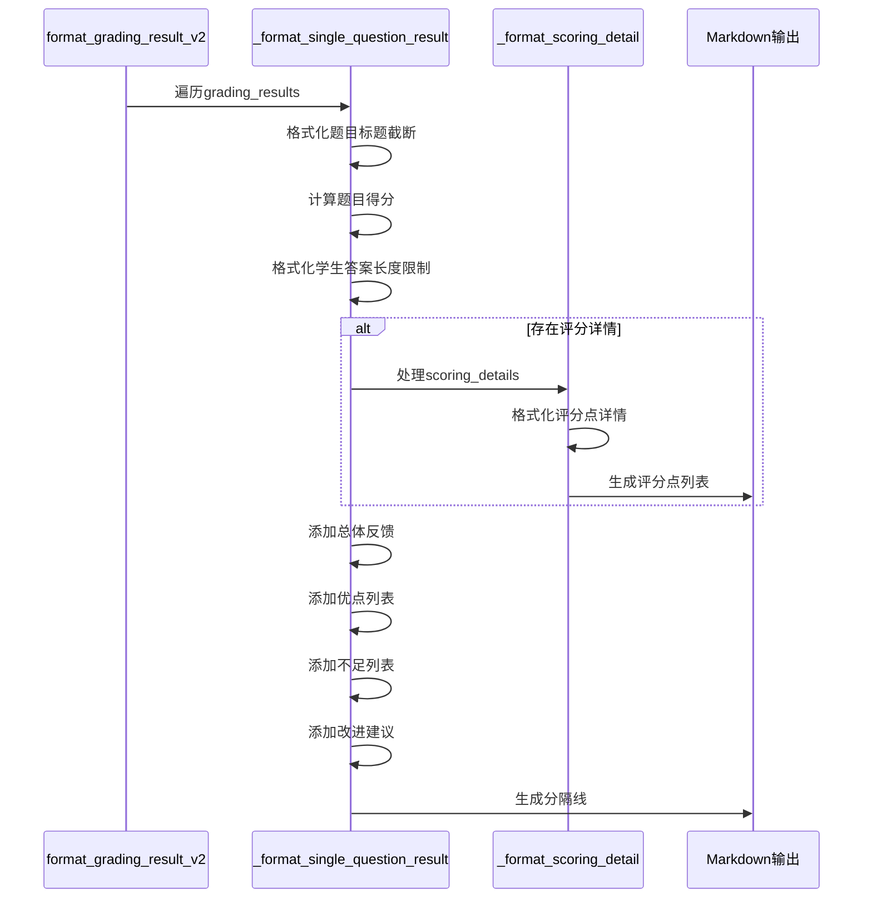
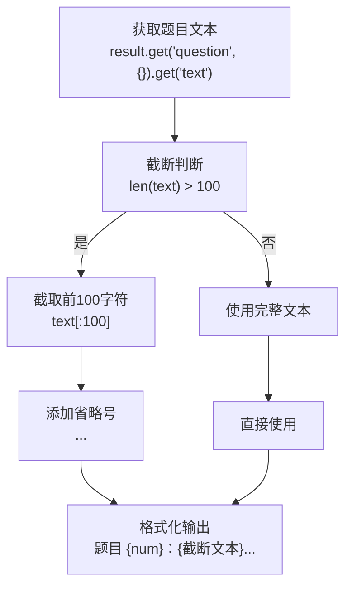
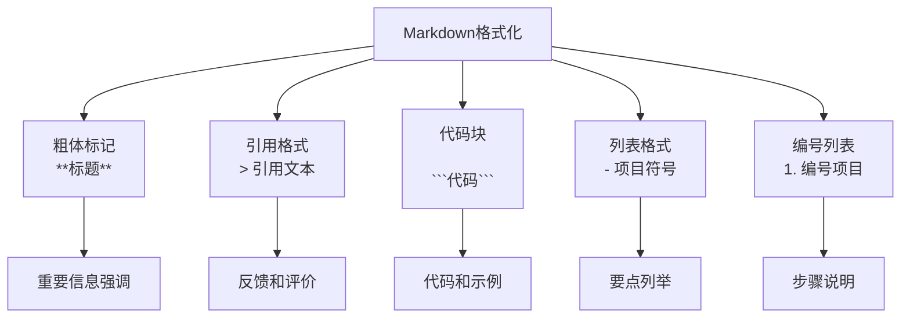
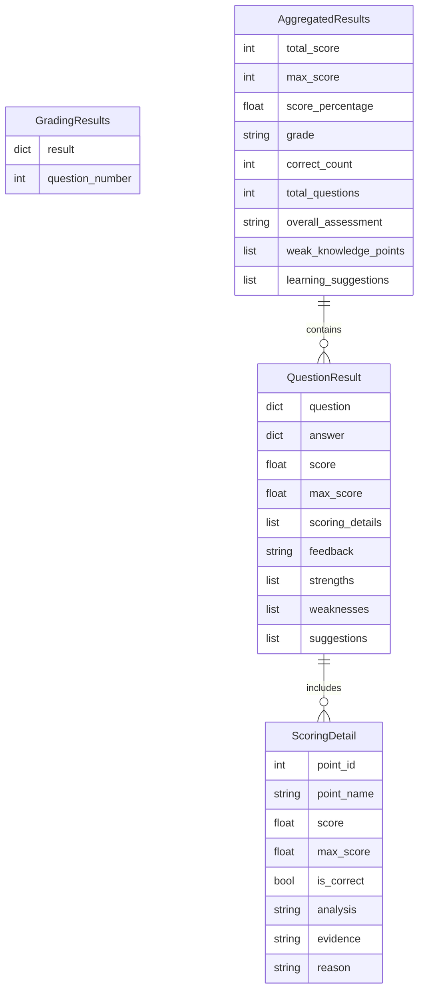
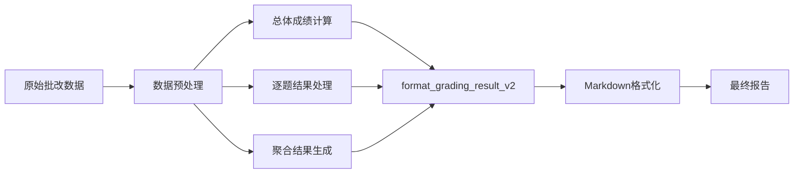
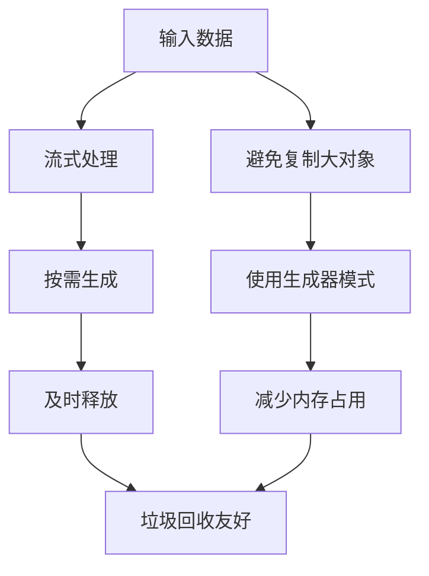

# 详细报告生成

<cite>
**本文档引用的文件**
- [result_formatter.py](file://ai_correction/functions/langgraph/result_formatter.py)
- [state.py](file://ai_correction/functions/langgraph/state.py)
- [result.md](file://ai_correction/test_data_debug/result.md)
- [V2_UPGRADE_SUMMARY.md](file://ai_correction/docs/V2_UPGRADE_SUMMARY.md)
- [production_system_architecture.md](file://ai_correction/docs/production_system_architecture.md)
</cite>

## 目录
1. [简介](#简介)
2. [函数架构概览](#函数架构概览)
3. [总体成绩部分详解](#总体成绩部分详解)
4. [逐题详情递归展开流程](#逐题详情递归展开流程)
5. [条件渲染策略](#条件渲染策略)
6. [视觉层次设计](#视觉层次设计)
7. [数据结构分析](#数据结构分析)
8. [实际应用场景](#实际应用场景)
9. [性能优化考虑](#性能优化考虑)
10. [总结](#总结)

## 简介

`format_grading_result_v2`函数是AI批改系统中的核心报告生成组件，负责将复杂的批改结果转化为结构化、视觉友好的Markdown格式报告。该函数采用模块化设计，支持教师端详细反馈和存档场景，具有信息完整性高、可读性强的特点。

该函数的主要目标是：
- 将批改结果数据转换为易于理解的Markdown格式
- 提供多层次的视觉层次结构
- 支持条件渲染，避免空内容显示
- 实现智能的内容截断和提示机制
- 适应不同的应用场景需求

## 函数架构概览

`format_grading_result_v2`函数采用分层架构设计，主要包含以下几个核心部分：



**图表来源**
- [result_formatter.py](file://ai_correction/functions/langgraph/result_formatter.py#L9-L79)

**章节来源**
- [result_formatter.py](file://ai_correction/functions/langgraph/result_formatter.py#L9-L79)

## 总体成绩部分详解

总体成绩部分是报告的核心信息展示区，包含了学生表现的关键指标。该部分的数据来源于`aggregated_results`字典，通过多个关键字段计算得出：

### 数据来源分析

总体成绩部分从以下字段提取数据：

| 字段名 | 数据类型 | 描述 | 默认值 |
|--------|----------|------|--------|
| `total_score` | int | 学生总得分 | 0 |
| `max_score` | int | 最高可能得分 | 0 |
| `score_percentage` | float | 得分百分比 | 0 |
| `grade` | str | 等级评定 | 'N/A' |
| `correct_count` | int | 答对题数 | 0 |
| `total_questions` | int | 总题数 | 0 |

### 渲染逻辑实现

总体成绩的渲染遵循以下逻辑流程：



**图表来源**
- [result_formatter.py](file://ai_correction/functions/langgraph/result_formatter.py#L25-L35)

### 计算逻辑详解

得分百分比的计算采用了精确的浮点运算：
- **计算公式**: `(score / max_score * 100) if max_score > 0 else 0`
- **精度控制**: 使用`.1f`格式化，保留一位小数
- **边界处理**: 当`max_score`为0时，得分为0%

**章节来源**
- [result_formatter.py](file://ai_correction/functions/langgraph/result_formatter.py#L25-L35)

## 逐题详情递归展开流程

逐题详情部分是报告中最复杂和详细的部分，采用递归展开机制处理每个题目的批改结果。该部分的核心函数是`_format_single_question_result()`。

### 递归展开机制



**图表来源**
- [result_formatter.py](file://ai_correction/functions/langgraph/result_formatter.py#L82-L162)

### 题目标题截断处理

题目标题的截断处理采用了智能的字符串截取机制：



**图表来源**
- [result_formatter.py](file://ai_correction/functions/langgraph/result_formatter.py#L88-L90)

### 学生答案长度限制机制

学生答案的长度限制采用了保守的500字符截断策略：

| 截断条件 | 处理方式 | 提示信息 |
|----------|----------|----------|
| 答案长度 ≤ 500字符 | 直接显示 | 无额外提示 |
| 答案长度 > 500字符 | 截断显示前500字符 | 添加"... (答案过长，已截断)" |

这种设计平衡了信息完整性和可读性，确保报告不会因为过长的答案而变得难以阅读。

**章节来源**
- [result_formatter.py](file://ai_correction/functions/langgraph/result_formatter.py#L105-L115)

## 条件渲染策略

报告生成采用了智能的条件渲染策略，只有当相关数据存在时才生成对应的章节，避免空内容的显示。

### 总体评价条件渲染

总体评价部分采用严格的非空检查：
```python
if aggregated_results.get('overall_assessment'):
    # 生成总体评价章节
```

这种设计确保只有在确实存在总体评价时才会显示该部分，避免产生空的章节标题。

### 薄弱知识点条件渲染

薄弱知识点部分支持多个知识点的存在：
```python
weak_points = aggregated_results.get('weak_knowledge_points', [])
if weak_points:
    # 生成薄弱知识点章节
    for point in weak_points:
        # 显示知识点名称和描述
```

### 学习建议条件渲染

学习建议部分同样采用非空检查：
```python
suggestions = aggregated_results.get('learning_suggestions', [])
if suggestions:
    # 生成学习建议章节
    for i, suggestion in enumerate(suggestions, 1):
        # 编号显示建议
```

**章节来源**
- [result_formatter.py](file://ai_correction/functions/langgraph/result_formatter.py#L55-L75)

## 视觉层次设计

报告采用了丰富的视觉元素来建立清晰的层次结构，主要包括分隔线、图标和格式化样式。

### 分隔线设计

分隔线是报告最重要的视觉元素之一，采用统一的格式：

```
━━━━━━━━━━━━━━━━━━━━━━━━━━━━━━━━━━━━━━━━━━━━━━━━━━━━━━━━━━━━
```

这些分隔线具有以下作用：
- **章节分隔**: 区分不同的报告部分
- **视觉引导**: 引导读者浏览报告结构
- **美观性**: 提升报告的整体视觉效果

### 图标系统

报告使用了精心设计的图标系统来增强可读性：

| 图标 | 含义 | 使用场景 |
|------|------|----------|
| 📋 | 报告标题 | 整体报告标识 |
| 📊 | 总体成绩 | 成绩统计部分 |
| 📝 | 逐题详情 | 题目详细分析 |
| 💡 | 总体评价 | 整体反馈部分 |
| ⚠️ | 薄弱知识点 | 知识点分析 |
| 🎯 | 学习建议 | 改进建议部分 |
| ✅ | 正确评分点 | 评分详情 |
| ❌ | 错误评分点 | 评分详情 |
| 📌 | 分析说明 | 评分详情 |
| 📄 | 证据引用 | 评分详情 |
| 💡 | 原因解释 | 评分详情 |

### 格式化样式

报告采用了多种格式化样式来区分不同类型的信息：



**章节来源**
- [result_formatter.py](file://ai_correction/functions/langgraph/result_formatter.py#L12-L79)

## 数据结构分析

`format_grading_result_v2`函数依赖于特定的数据结构来生成报告，这些数据结构体现了系统的整体设计理念。

### 核心数据结构



**图表来源**
- [state.py](file://ai_correction/functions/langgraph/state.py#L44-L268)
- [V2_UPGRADE_SUMMARY.md](file://ai_correction/docs/V2_UPGRADE_SUMMARY.md#L87-L125)

### 数据流向分析

报告生成的数据流向体现了系统的模块化设计：



**图表来源**
- [result_formatter.py](file://ai_correction/functions/langgraph/result_formatter.py#L9-L79)

**章节来源**
- [state.py](file://ai_correction/functions/langgraph/state.py#L44-L268)

## 实际应用场景

`format_grading_result_v2`函数设计适用于多种实际应用场景，每种场景都有其特定的需求和优化重点。

### 教师端详细反馈场景

在教师端详细反馈场景中，报告需要提供尽可能多的细节信息：

**特点**：
- 完整的逐题分析
- 详细的评分点说明
- 具体的改进建议
- 知识点薄弱分析

**优势**：
- 帮助教师快速了解学生问题
- 支持个性化教学指导
- 便于制定针对性的教学计划

### 存档场景

存档场景注重报告的完整性和长期可读性：

**特点**：
- 标准化的格式结构
- 完整的数据记录
- 便于后续查询和分析

**优势**：
- 支持历史数据对比
- 便于教学质量评估
- 符合教育档案管理要求

### 移动端展示场景

虽然主要面向桌面端，但报告设计也考虑了移动端的适配：

**优化策略**：
- 合理的分隔线间距
- 清晰的层级结构
- 适当的字体大小

**章节来源**
- [result.md](file://ai_correction/test_data_debug/result.md#L1-L187)

## 性能优化考虑

报告生成函数在设计时充分考虑了性能优化，特别是在处理大量批改结果时的效率。

### 内存使用优化



### 字符串操作优化

- **字符串拼接**: 使用列表存储行内容，最后一次性连接
- **格式化**: 使用f-string进行高效的字符串格式化
- **截断**: 采用切片操作，避免不必要的字符串复制

### 条件渲染优化

条件渲染策略显著减少了不必要的字符串生成：

```python
# 优化前：总是生成空章节
if not assessment:
    lines.append("## 总体评价")
    lines.append("")

# 优化后：仅在需要时生成
if aggregated_results.get('overall_assessment'):
    lines.append("## 总体评价")
    lines.append(aggregated_results['overall_assessment'])
```

**章节来源**
- [result_formatter.py](file://ai_correction/functions/langgraph/result_formatter.py#L9-L79)

## 总结

`format_grading_result_v2`函数代表了现代AI批改系统在报告生成方面的最佳实践。通过模块化的设计、智能的条件渲染、丰富的视觉层次和优化的性能考虑，该函数成功地将复杂的批改结果转化为易于理解和使用的Markdown报告。

### 核心优势

1. **结构化输出**: 清晰的层次结构帮助用户快速定位所需信息
2. **智能截断**: 智能的内容截断既保证了信息完整性又避免了冗余
3. **条件渲染**: 避免空内容显示，提升用户体验
4. **视觉友好**: 丰富的图标和格式化提升了报告的可读性
5. **性能优化**: 高效的数据处理和内存使用

### 应用价值

该报告生成机制不仅满足了当前的业务需求，也为未来的功能扩展奠定了坚实的基础。其模块化的设计使得添加新的分析维度或调整格式变得更加容易，体现了系统设计的前瞻性和灵活性。

通过深入理解这个函数的实现机制，开发者可以更好地利用AI批改系统的强大功能，为教育工作者和学生提供更加优质的批改体验。