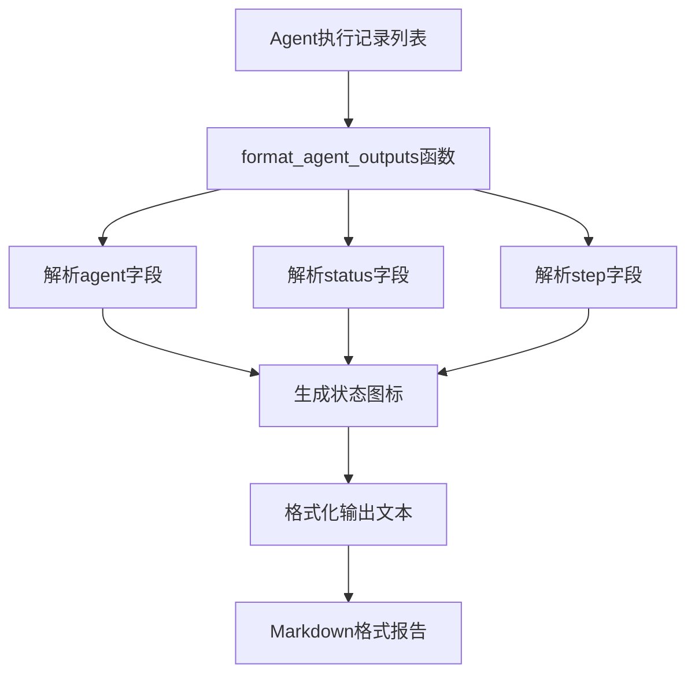
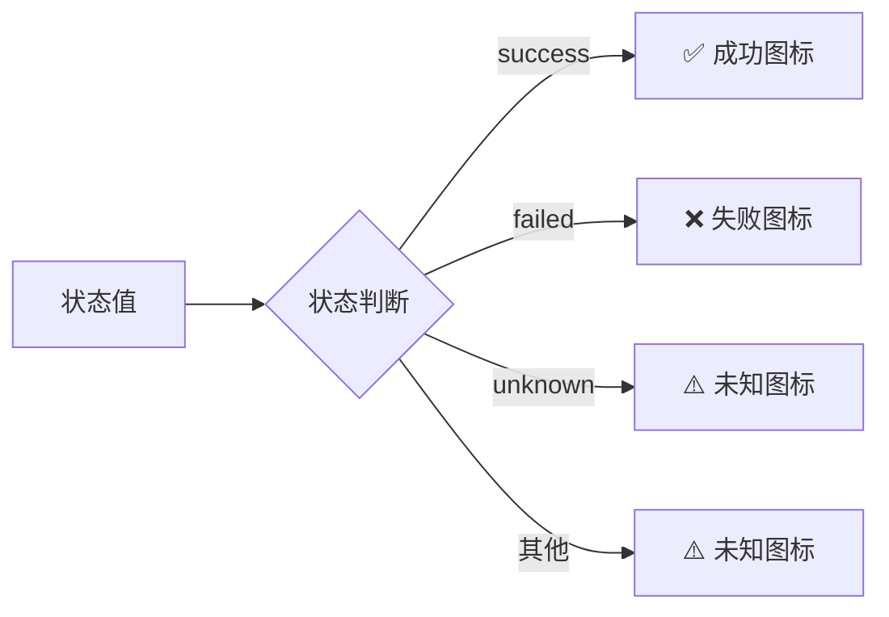
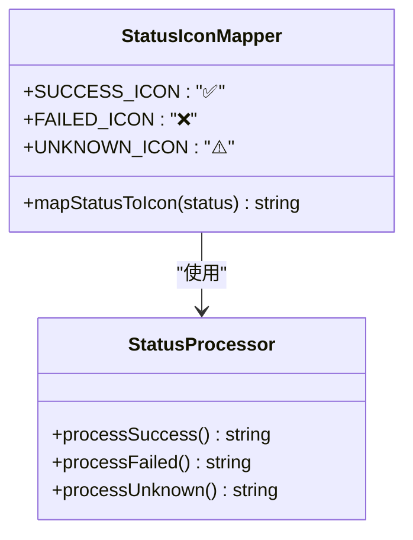
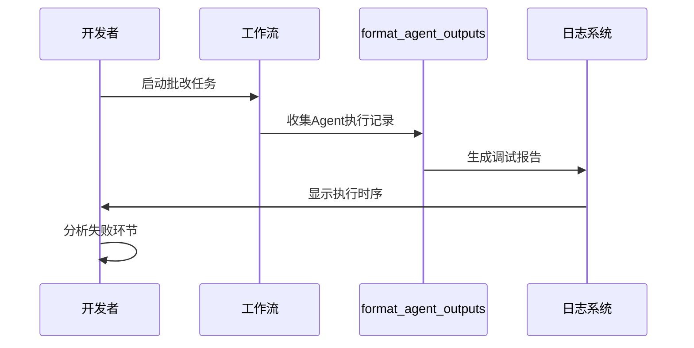

# 调试报告生成

<cite>
**本文档引用的文件**
- [result_formatter.py](file://ai_correction/functions/langgraph/result_formatter.py)
- [workflow.py](file://ai_correction/functions/langgraph/workflow.py)
- [workflow_new.py](file://ai_correction/functions/langgraph/workflow_new.py)
- [state.py](file://ai_correction/functions/langgraph/state.py)
- [ingest_input.py](file://ai_correction/functions/langgraph/agents/ingest_input.py)
- [scoring_agent.py](file://ai_correction/functions/langgraph/agents/scoring_agent.py)
- [result_assembler.py](file://ai_correction/functions/langgraph/agents/result_assembler.py)
</cite>

## 目录
1. [简介](#简介)
2. [函数概述](#函数概述)
3. [核心功能分析](#核心功能分析)
4. [数据结构解析](#数据结构解析)
5. [状态图标系统](#状态图标系统)
6. [输出格式规范](#输出格式规范)
7. [应用场景](#应用场景)
8. [性能考虑](#性能考虑)
9. [最佳实践](#最佳实践)
10. [故障排除](#故障排除)

## 简介

`format_agent_outputs`函数是AI批改系统中一个关键的调试和审计工具，专门负责将Agent执行记录格式化为清晰易读的执行时序报告。该函数在系统内部运维和问题排查中发挥着重要作用，为开发者提供了深入理解工作流执行过程的窗口。

## 函数概述

`format_agent_outputs`函数位于`result_formatter.py`模块中，是一个专门用于格式化Agent执行记录的辅助函数。它接收Agent输出列表作为输入，通过结构化的方式呈现每个Agent的执行状态、步骤信息和最终结果。



**图表来源**
- [result_formatter.py](file://ai_correction/functions/langgraph/result_formatter.py#L245-L271)

**章节来源**
- [result_formatter.py](file://ai_correction/functions/langgraph/result_formatter.py#L245-L271)

## 核心功能分析

### 输入处理机制

函数首先初始化输出行列表，然后遍历传入的Agent输出列表。对于每个输出记录，函数会提取三个关键字段：

1. **agent字段**: Agent的名称标识符
2. **status字段**: 执行状态(success/failed/unknown)
3. **step字段**: 当前执行步骤的描述

### 状态解析逻辑

函数实现了智能的状态解析机制，能够根据不同的状态值显示相应的视觉标识：



**图表来源**
- [result_formatter.py](file://ai_correction/functions/langgraph/result_formatter.py#L262-L264)

### 输出生成流程

每个Agent记录都会按照以下格式生成：
- 编号：有序的数字标识
- 状态图标：对应执行状态的Unicode符号
- Agent名称：粗体显示的Agent标识
- 步骤描述：当前执行阶段的简要说明
- 状态标签：括号内的具体状态值

**章节来源**
- [result_formatter.py](file://ai_correction/functions/langgraph/result_formatter.py#L250-L271)

## 数据结构解析

### Agent输出记录结构

Agent输出记录遵循统一的数据结构，确保格式化的一致性：

| 字段名 | 类型 | 描述 | 默认值 |
|--------|------|------|--------|
| agent | string | Agent名称标识 | 'Unknown' |
| status | string | 执行状态 | 'unknown' |
| step | string | 当前步骤描述 | 'unknown' |

### 状态枚举值

系统支持三种主要状态类型：

- **success**: Agent成功完成指定操作
- **failed**: Agent执行过程中发生错误
- **unknown**: Agent状态不明确或未设置

### 字段处理策略

函数采用了健壮的字段处理策略，当某个字段缺失时会自动使用默认值，确保格式化过程不会因数据不完整而中断。

**章节来源**
- [state.py](file://ai_correction/functions/langgraph/state.py#L1-L50)

## 状态图标系统

### 图标映射机制

`format_agent_outputs`函数实现了直观的状态可视化系统：



**图表来源**
- [result_formatter.py](file://ai_correction/functions/langgraph/result_formatter.py#L262-L264)

### 图标语义含义

- ✅ **成功图标**: 表示Agent按预期完成了指定任务
- ❌ **失败图标**: 标识Agent执行过程中遇到了错误或异常
- ⚠️ **未知图标**: 用于状态不明确或未设置的情况

这种视觉编码系统使得开发者能够快速识别工作流中的关键节点和潜在问题。

**章节来源**
- [result_formatter.py](file://ai_correction/functions/langgraph/result_formatter.py#L262-L264)

## 输出格式规范

### Markdown格式结构

函数生成的输出采用Markdown格式，便于在各种环境中展示和阅读：

```
## 🤖 Agent 执行记录

1. ✅ **AgentName** - step_description (success)
2. ❌ **AgentName** - step_description (failed)
3. ⚠️ **AgentName** - step_description (unknown)
```

### 标题层级结构

输出采用清晰的标题层级：
- 主标题：`## 🤖 Agent 执行记录`
- 内容：有序列表，每行包含编号、图标、Agent名称、步骤描述和状态

### 可读性优化

格式化输出具有以下可读性特征：
- Unicode图标提供直观的视觉反馈
- 粗体字体突出Agent名称
- 有序编号便于追踪执行顺序
- 统一的格式便于自动化处理

**章节来源**
- [result_formatter.py](file://ai_correction/functions/langgraph/result_formatter.py#L248-L271)

## 应用场景

### 内部运维监控

`format_agent_outputs`函数主要用于内部运维监控，帮助系统管理员和开发者：

- **实时监控**: 跟踪工作流执行状态
- **性能分析**: 识别执行缓慢的Agent
- **错误定位**: 快速发现失败的执行环节
- **资源优化**: 分析Agent负载分布

### 调试和问题排查

在开发和维护过程中，该函数提供了重要的调试支持：



**图表来源**
- [workflow.py](file://ai_correction/functions/langgraph/workflow.py#L180-L220)
- [result_formatter.py](file://ai_correction/functions/langgraph/result_formatter.py#L245-L271)

### 工作流审计

系统定期生成执行审计报告，记录每次批改任务的完整执行轨迹：

- **完整性检查**: 确认所有Agent都按预期执行
- **性能基准**: 记录各Agent的执行时间和成功率
- **趋势分析**: 识别重复出现的问题模式

**章节来源**
- [workflow.py](file://ai_correction/functions/langgraph/workflow.py#L180-L220)
- [result_assembler.py](file://ai_correction/functions/langgraph/agents/result_assembler.py#L500-L530)

## 性能考虑

### 内存使用优化

函数采用迭代处理方式，避免大量数据的内存占用：

- **流式处理**: 逐个处理Agent记录，不累积整个列表
- **字符串拼接**: 使用列表存储中间结果，最后一次性连接
- **最小化复制**: 直接访问字典键值，减少数据复制

### 时间复杂度分析

函数的时间复杂度为O(n)，其中n是Agent输出记录的数量：
- **遍历操作**: O(n) - 遍历每个Agent记录
- **字符串操作**: O(1) - 每个记录的格式化操作
- **最终连接**: O(n) - 连接所有输出行

### 扩展性设计

函数设计考虑了未来的扩展需求：
- **字段灵活性**: 支持未来添加新的Agent字段
- **状态扩展**: 易于添加新的状态类型
- **格式定制**: 可以轻松调整输出格式

**章节来源**
- [result_formatter.py](file://ai_correction/functions/langgraph/result_formatter.py#L245-L271)

## 最佳实践

### 数据完整性保障

为了确保格式化输出的质量，建议遵循以下最佳实践：

1. **字段验证**: 在调用格式化函数前验证Agent记录的完整性
2. **状态标准化**: 确保所有Agent使用统一的状态命名约定
3. **错误处理**: 为可能的异常情况提供适当的错误处理机制

### 输出定制化

根据不同的使用场景，可以对输出格式进行适度定制：

- **详细模式**: 包含更多元数据信息
- **简洁模式**: 只显示关键的执行状态
- **机器可读**: 生成JSON或其他结构化格式

### 集成建议

将`format_agent_outputs`函数集成到监控系统中时，建议：

- **定期轮询**: 定期收集和格式化Agent执行记录
- **阈值告警**: 基于失败率触发告警机制
- **历史对比**: 与历史数据对比识别异常模式

**章节来源**
- [ingest_input.py](file://ai_correction/functions/langgraph/agents/ingest_input.py#L70-L80)
- [scoring_agent.py](file://ai_correction/functions/langgraph/agents/scoring_agent.py#L65-L75)

## 故障排除

### 常见问题及解决方案

#### 输出为空或不完整

**症状**: 格式化输出为空白或只显示部分记录

**可能原因**:
- Agent输出列表为空
- 输入数据格式不正确
- 字段名称不匹配

**解决方案**:
1. 验证输入数据的有效性
2. 检查字段名称的一致性
3. 添加数据验证逻辑

#### 状态图标显示异常

**症状**: 状态图标显示为问号或其他异常字符

**可能原因**:
- 状态值不在预期范围内
- 字符编码问题
- Unicode支持不足

**解决方案**:
1. 验证状态值的有效性
2. 检查字符编码设置
3. 使用备用图标方案

#### 性能问题

**症状**: 格式化过程耗时过长

**可能原因**:
- Agent输出记录过多
- 字符串操作效率低
- 内存使用不当

**解决方案**:
1. 实现分页处理
2. 优化字符串拼接方式
3. 添加性能监控点

### 调试技巧

1. **日志记录**: 在关键位置添加日志输出
2. **单元测试**: 为不同输入场景编写测试用例
3. **边界测试**: 测试极端情况下的行为
4. **性能测试**: 监控大数据量下的表现

**章节来源**
- [workflow.py](file://ai_correction/functions/langgraph/workflow.py#L180-L220)

## 结论

`format_agent_outputs`函数作为AI批改系统的核心调试工具，通过简洁而有效的格式化机制，为系统运维和问题排查提供了重要支持。其设计体现了对可读性、性能和扩展性的平衡考虑，是现代AI工作流系统中不可或缺的组成部分。

该函数的成功实施展示了如何通过简单的文本格式化技术，为复杂的分布式系统提供清晰的执行洞察，为后续的系统优化和维护奠定了坚实基础。