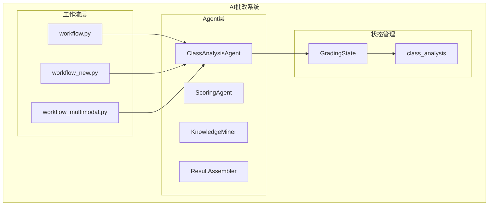
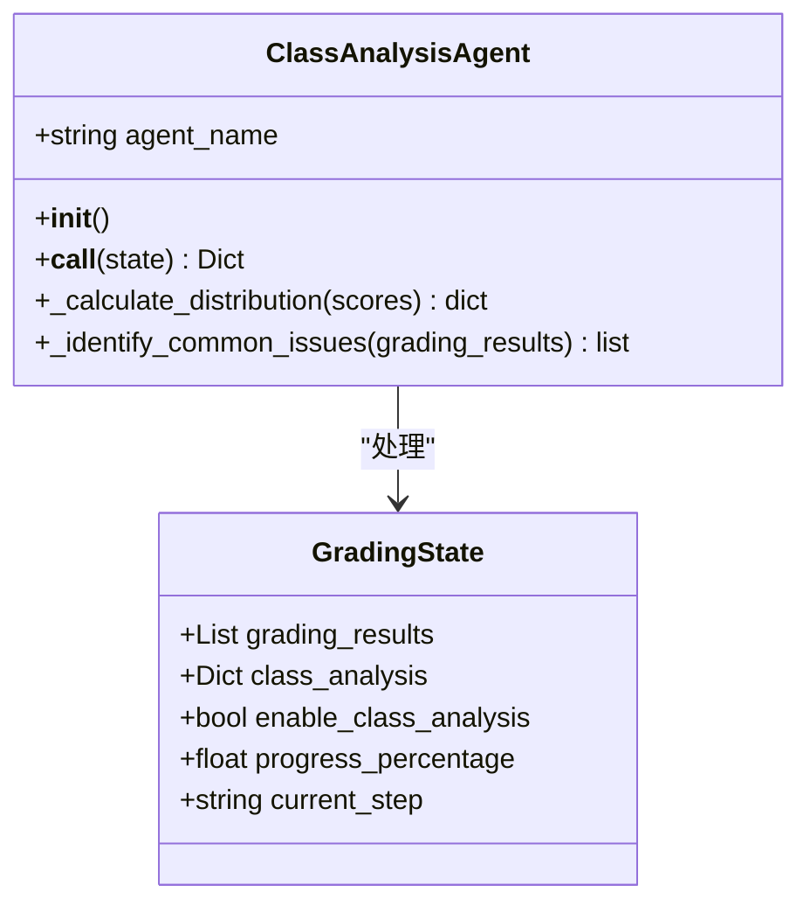
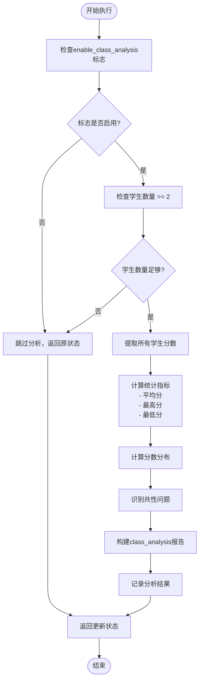
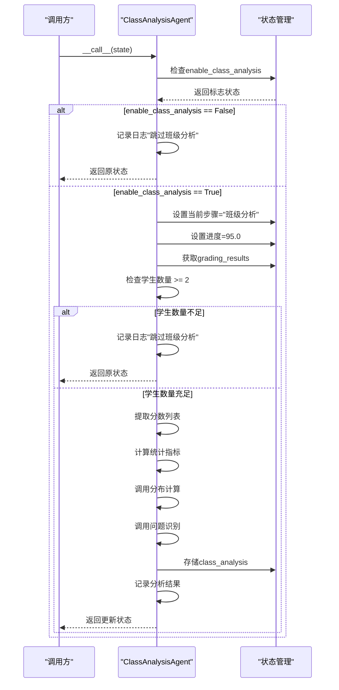
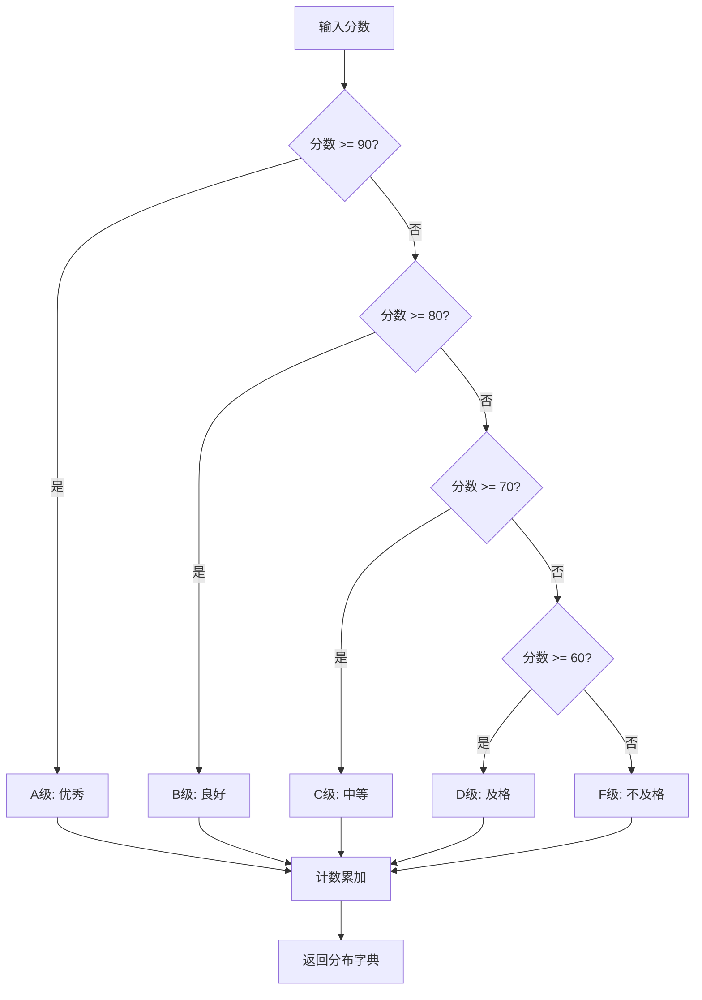
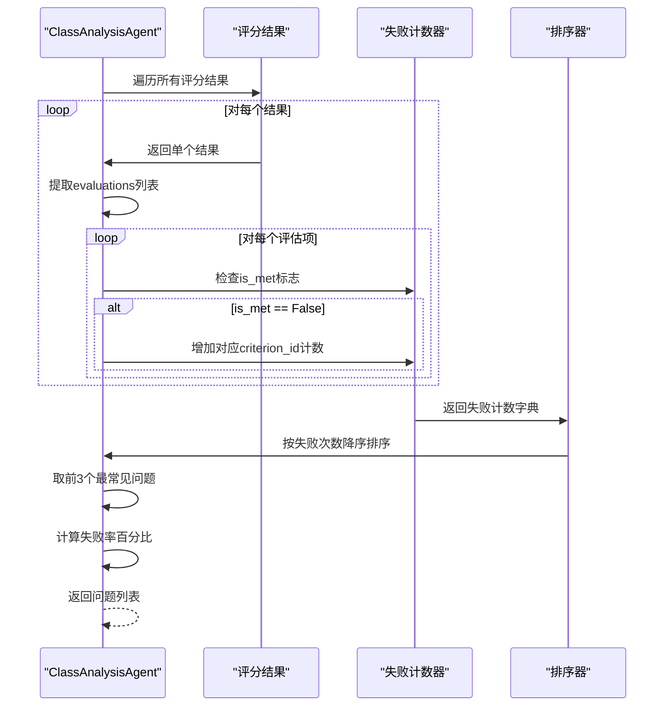
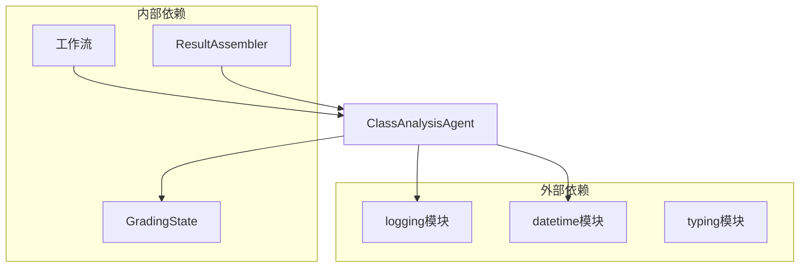

# 班级分析

<cite>
**本文档中引用的文件**
- [class_analysis_agent.py](file://ai_correction/functions/langgraph/agents/class_analysis_agent.py)
- [state.py](file://ai_correction/functions/langgraph/state.py)
- [workflow.py](file://ai_correction/functions/langgraph/workflow.py)
- [workflow_new.py](file://ai_correction/functions/langgraph/workflow_new.py)
- [test_agents.py](file://ai_correction/tests/test_agents.py)
- [result_assembler.py](file://ai_correction/functions/langgraph/agents/result_assembler.py)
- [professional_mode.py](file://ai_correction/functions/langgraph/prompts/professional_mode.py)
</cite>

## 目录
1. [简介](#简介)
2. [项目结构](#项目结构)
3. [核心组件](#核心组件)
4. [架构概述](#架构概述)
5. [详细组件分析](#详细组件分析)
6. [依赖关系分析](#依赖关系分析)
7. [性能考虑](#性能考虑)
8. [故障排除指南](#故障排除指南)
9. [结论](#结论)

## 简介

ClassAnalysisAgent是AI批改系统中的一个重要组件，专门负责生成班级整体分析报告。该Agent仅在班级批改模式下激活，能够对多个学生的评分结果进行全面分析，包括统计指标计算、分数分布分析和共性问题识别等功能。

ClassAnalysisAgent的核心职责是：
- 根据`enable_class_analysis`标志决定是否执行班级分析
- 计算班级的平均分、最高分、最低分等统计指标
- 将学生分数划分为A-F等级并生成分布统计
- 识别失分最多的共性问题（如特定评分点的失败率）
- 返回前三大常见问题及其影响程度

## 项目结构

ClassAnalysisAgent位于AI批改系统的多Agent架构中，作为独立的分析组件存在：



**图表来源**
- [workflow.py](file://ai_correction/functions/langgraph/workflow.py#L1-L50)
- [workflow_new.py](file://ai_correction/functions/langgraph/workflow_new.py#L66-L96)

**章节来源**
- [class_analysis_agent.py](file://ai_correction/functions/langgraph/agents/class_analysis_agent.py#L1-L122)

## 核心组件

ClassAnalysisAgent包含以下核心组件：

### 主要类结构



**图表来源**
- [class_analysis_agent.py](file://ai_correction/functions/langgraph/agents/class_analysis_agent.py#L15-L122)
- [state.py](file://ai_correction/functions/langgraph/state.py#L140-L150)

### 关键属性和方法

| 属性/方法 | 类型 | 描述 | 默认值 |
|----------|------|------|--------|
| `agent_name` | string | Agent名称标识 | "ClassAnalysisAgent" |
| `__call__` | method | 主要执行入口，根据条件决定是否执行分析 | - |
| `_calculate_distribution` | method | 计算分数分布，A-F等级划分 | - |
| `_identify_common_issues` | method | 识别共性问题，统计失分最多的评分点 | - |

**章节来源**
- [class_analysis_agent.py](file://ai_correction/functions/langgraph/agents/class_analysis_agent.py#L15-L40)

## 架构概述

ClassAnalysisAgent采用条件执行模式，在满足特定条件时才激活分析功能：



**图表来源**
- [class_analysis_agent.py](file://ai_correction/functions/langgraph/agents/class_analysis_agent.py#L20-L85)

## 详细组件分析

### __call__ 方法详解

`__call__`方法是ClassAnalysisAgent的主要执行入口，实现了智能的条件执行逻辑：

#### 条件检查机制



**图表来源**
- [class_analysis_agent.py](file://ai_correction/functions/langgraph/agents/class_analysis_agent.py#L20-L85)

#### 统计指标计算

ClassAnalysisAgent计算以下关键统计指标：

| 指标名称 | 计算方法 | 数据来源 | 用途 |
|----------|----------|----------|------|
| 总学生数 | `len(grading_results)` | 评分结果列表长度 | 了解班级规模 |
| 平均分 | `sum(scores) / len(scores)` | 学生分数列表 | 整体水平评估 |
| 最高分 | `max(scores)` | 学生分数列表 | 优秀表现参考 |
| 最低分 | `min(scores)` | 学生分数列表 | 待提升空间 |
| 分数分布 | `_calculate_distribution()` | 学生分数列表 | 成绩层次分析 |
| 共性问题 | `_identify_common_issues()` | 评分结果详情 | 教学改进方向 |

**章节来源**
- [class_analysis_agent.py](file://ai_correction/functions/langgraph/agents/class_analysis_agent.py#L40-L55)

### _calculate_distribution 方法

该方法负责将学生分数划分为A-F五个等级，并生成分布统计：

#### 分数等级划分规则



**图表来源**
- [class_analysis_agent.py](file://ai_correction/functions/langgraph/agents/class_analysis_agent.py#L86-L100)

#### 分布统计输出格式

分布统计结果以字典形式返回，包含各等级的学生人数：

```python
{
    'A': 5,    # 优秀学生人数
    'B': 12,   # 良好学生人数  
    'C': 8,    # 中等学生人数
    'D': 3,    # 及格学生人数
    'F': 2     # 不及格学生人数
}
```

**章节来源**
- [class_analysis_agent.py](file://ai_correction/functions/langgraph/agents/class_analysis_agent.py#L86-L100)

### _identify_common_issues 方法

该方法通过分析所有学生的评分结果来识别失分最多的共性问题：

#### 问题识别流程



**图表来源**
- [class_analysis_agent.py](file://ai_correction/functions/langgraph/agents/class_analysis_agent.py#L102-L122)

#### 问题输出格式

共性问题识别结果包含以下信息：

| 字段 | 类型 | 描述 | 示例值 |
|------|------|------|--------|
| `criterion_id` | string | 评分点ID | "CRIT_001" |
| `failure_count` | integer | 失败次数 | 15 |
| `failure_rate` | float | 失败率百分比 | 37.5 |

**章节来源**
- [class_analysis_agent.py](file://ai_correction/functions/langgraph/agents/class_analysis_agent.py#L102-L122)

### class_analysis 对象结构

ClassAnalysisAgent生成的`class_analysis`对象具有标准化的数据结构：

#### 完整数据结构

```python
class_analysis = {
    'total_students': 20,                    # 总学生数
    'average_score': 78.5,                   # 平均分
    'max_score': 95,                         # 最高分
    'min_score': 42,                         # 最低分
    'score_distribution': {                  # 分数分布
        'A': 3,                              # A级人数
        'B': 7,                              # B级人数
        'C': 6,                              # C级人数
        'D': 3,                              # D级人数
        'F': 1                               # F级人数
    },
    'common_issues': [                       # 共性问题列表
        {
            'criterion_id': 'CRIT_001',
            'failure_count': 15,
            'failure_rate': 37.5
        },
        {
            'criterion_id': 'CRIT_003',
            'failure_count': 12,
            'failure_rate': 30.0
        },
        {
            'criterion_id': 'CRIT_002',
            'failure_count': 10,
            'failure_rate': 25.0
        }
    ],
    'generated_at': '2024-01-15 14:30:22'    # 生成时间
}
```

**章节来源**
- [class_analysis_agent.py](file://ai_correction/functions/langgraph/agents/class_analysis_agent.py#L47-L55)

## 依赖关系分析

ClassAnalysisAgent与其他组件的依赖关系：



**图表来源**
- [class_analysis_agent.py](file://ai_correction/functions/langgraph/agents/class_analysis_agent.py#L1-L10)

### 工作流集成

ClassAnalysisAgent在多个工作流中被调用：

| 工作流文件 | 调用方式 | 作用 |
|------------|----------|------|
| workflow.py | 条件执行 | 传统工作流中的班级分析 |
| workflow_new.py | 直接调用 | 新工作流中的班级分析 |
| workflow_multimodal.py | 条件执行 | 多模态工作流中的班级分析 |

**章节来源**
- [workflow.py](file://ai_correction/functions/langgraph/workflow.py#L1-L50)
- [workflow_new.py](file://ai_correction/functions/langgraph/workflow_new.py#L66-L96)

## 性能考虑

### 条件执行优化

ClassAnalysisAgent采用智能的条件执行策略，避免不必要的计算：

- **标志检查**：首先检查`enable_class_analysis`标志
- **数量验证**：确保至少有两个学生才能进行有意义的分析
- **早期退出**：在不满足条件时立即返回，减少计算开销

### 算法复杂度分析

| 操作 | 时间复杂度 | 空间复杂度 | 说明 |
|------|------------|------------|------|
| 分数提取 | O(n) | O(n) | n为学生数量 |
| 统计计算 | O(n) | O(1) | 单次遍历计算 |
| 分布计算 | O(n) | O(1) | 固定5个等级的计数 |
| 问题识别 | O(m) | O(k) | m为评估项总数，k为唯一评分点数 |

其中n为学生数量，m为评估项总数，k为唯一评分点数量。

### 内存使用优化

- 使用生成器表达式减少中间列表创建
- 字典操作保持常数时间复杂度
- 避免深层嵌套数据结构

## 故障排除指南

### 常见问题及解决方案

#### 1. 班级分析未执行

**症状**：`class_analysis`对象为空或不存在

**可能原因**：
- `enable_class_analysis`标志未设置
- 学生数量不足（<2个）
- `grading_results`数据缺失

**解决方案**：
```python
# 检查标志设置
state.get('enable_class_analysis', False)

# 检查学生数量
len(state.get('grading_results', [])) >= 2

# 检查数据完整性
grading_results = state.get('grading_results', [])
if not grading_results:
    logger.warning("缺少评分结果数据")
```

#### 2. 分数分布异常

**症状**：分数分布统计不准确

**可能原因**：
- 评分结果中缺少`total_score`字段
- 分数超出预期范围（<0或>100）

**解决方案**：
```python
# 验证分数有效性
scores = [r.get('total_score', 0) for r in grading_results]
valid_scores = [s for s in scores if 0 <= s <= 100]
```

#### 3. 共性问题识别错误

**症状**：识别出的问题不符合实际情况

**可能原因**：
- 评分结果中缺少`evaluations`字段
- `criterion_id`字段缺失或格式不一致

**解决方案**：
```python
# 验证评估数据结构
for result in grading_results:
    evaluations = result.get('evaluations', [])
    for eval in evaluations:
        cid = eval.get('criterion_id', '')
        if not cid:
            logger.warning(f"评分点ID缺失: {eval}")
```

**章节来源**
- [class_analysis_agent.py](file://ai_correction/functions/langgraph/agents/class_analysis_agent.py#L25-L35)
- [class_analysis_agent.py](file://ai_correction/functions/langgraph/agents/class_analysis_agent.py#L102-L122)

## 结论

ClassAnalysisAgent是AI批改系统中不可或缺的分析组件，它通过智能的条件执行和高效的算法实现，为教师提供了有价值的班级整体分析报告。其主要优势包括：

### 核心价值

1. **智能触发**：仅在必要时执行分析，避免资源浪费
2. **全面统计**：提供完整的班级成绩统计和分布分析
3. **问题识别**：精准定位教学难点和共性问题
4. **易于集成**：与现有工作流无缝集成

### 设计亮点

- **条件执行模式**：通过`enable_class_analysis`标志控制执行时机
- **阈值保护**：确保学生数量充足时才进行分析
- **模块化设计**：清晰分离统计计算和问题识别功能
- **错误处理**：完善的异常捕获和错误记录机制

### 应用场景

ClassAnalysisAgent特别适用于以下场景：
- 班级作业批改后的整体分析
- 教学效果评估和改进
- 学习困难学生识别
- 教学质量监控

通过合理使用ClassAnalysisAgent，教育工作者可以获得深入的班级学习情况洞察，从而制定更有针对性的教学策略。