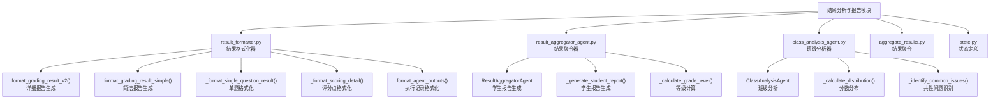
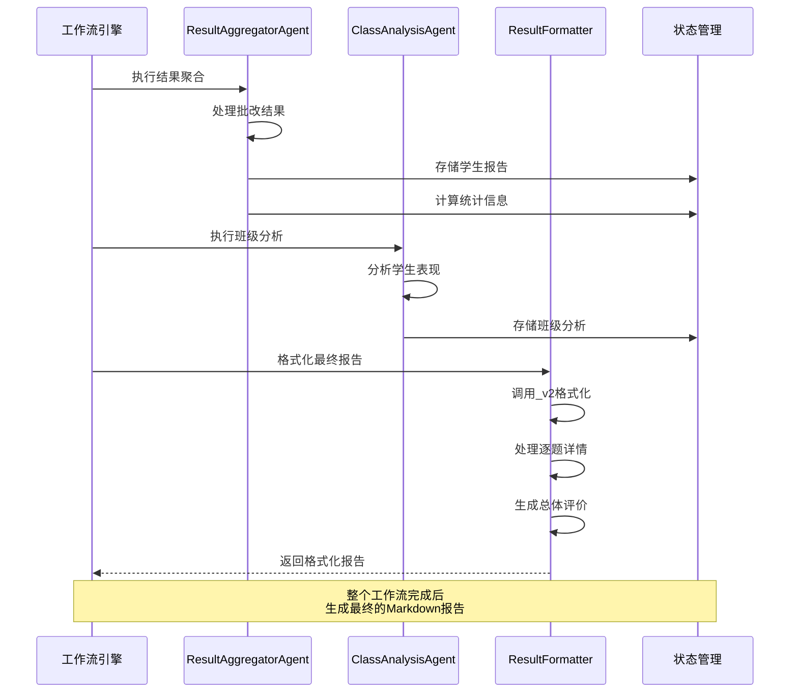
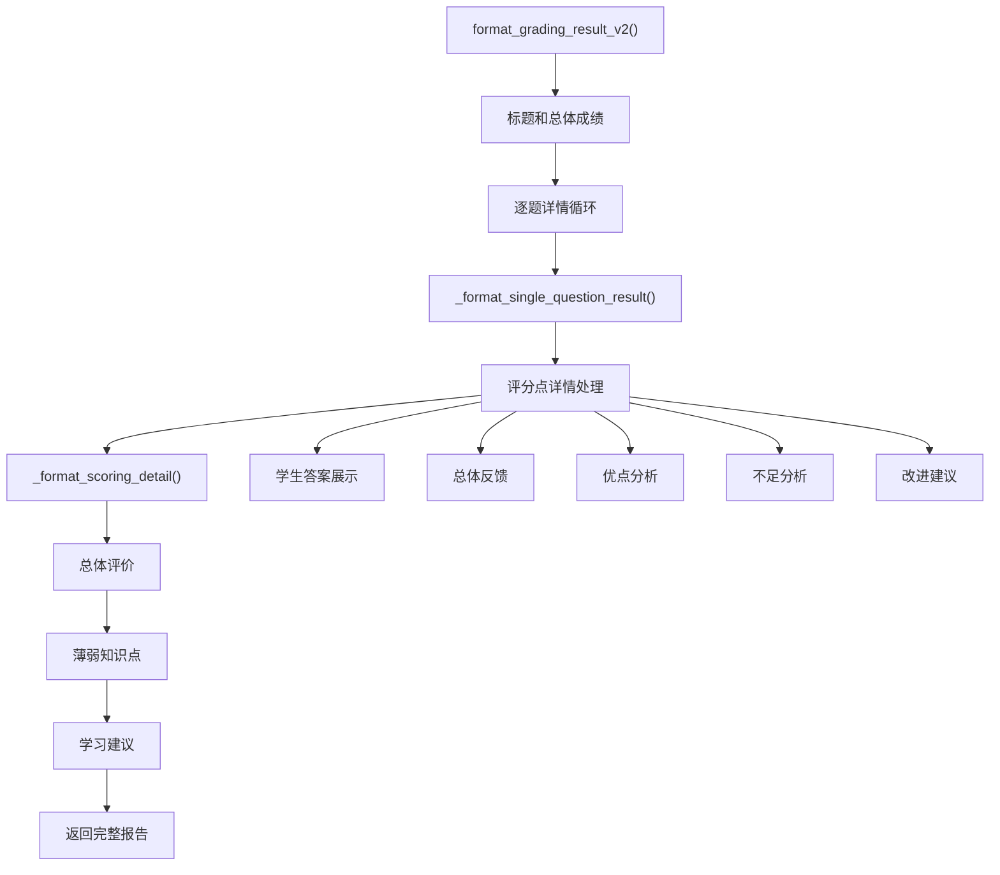
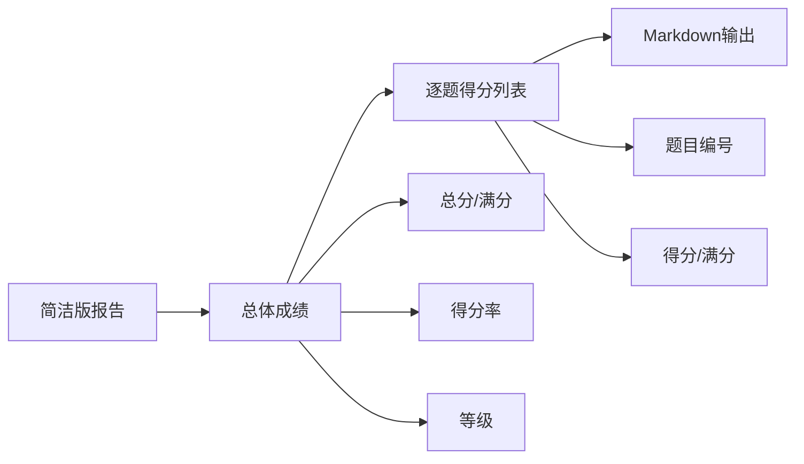
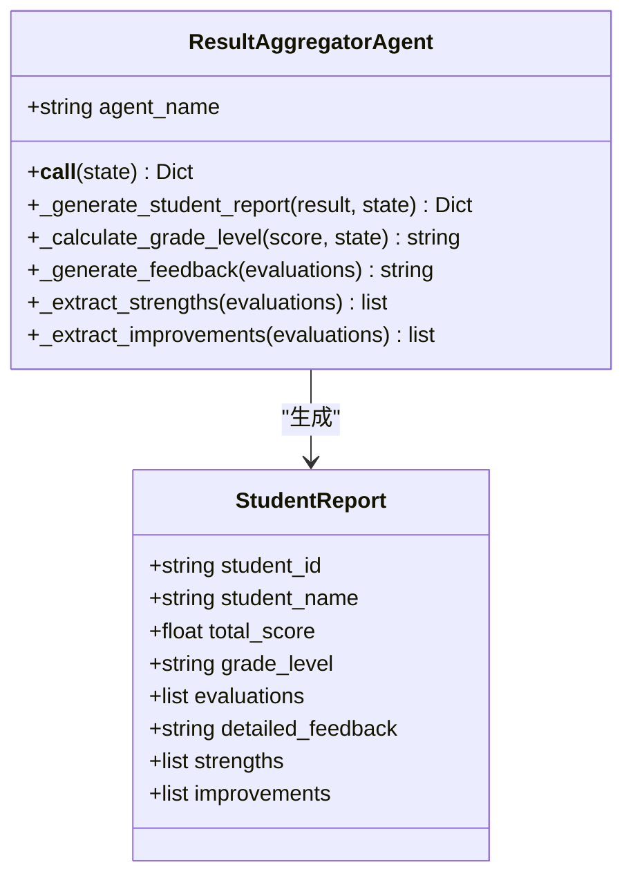
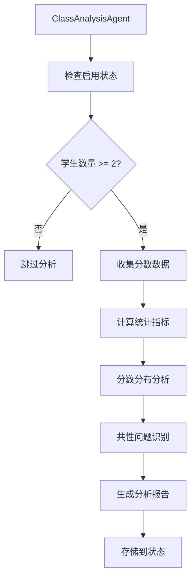
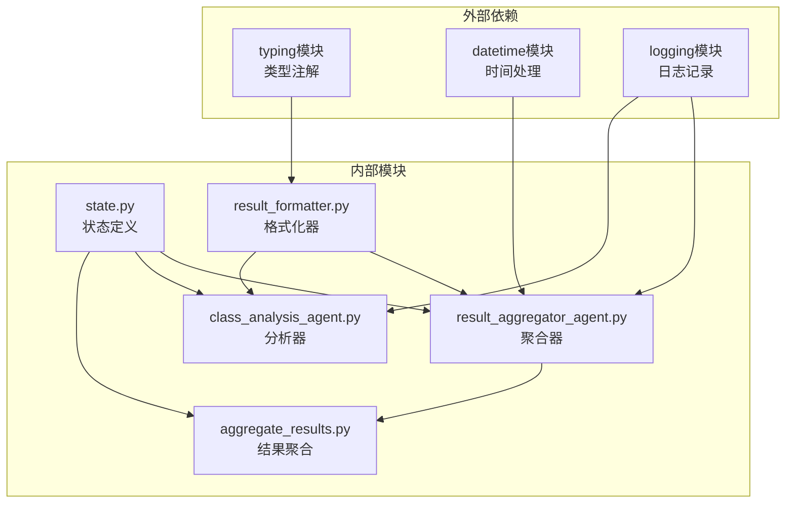

# 结果分析与报告模块

<cite>
**本文档中引用的文件**
- [result_formatter.py](file://ai_correction/functions/langgraph/result_formatter.py)
- [result_aggregator_agent.py](file://ai_correction/functions/langgraph/agents/result_aggregator_agent.py)
- [class_analysis_agent.py](file://ai_correction/functions/langgraph/agents/class_analysis_agent.py)
- [aggregate_results.py](file://ai_correction/functions/langgraph/agents/aggregate_results.py)
- [state.py](file://ai_correction/functions/langgraph/state.py)
- [result.md](file://ai_correction/test_data_debug/result.md)
</cite>

## 目录
1. [简介](#简介)
2. [项目结构](#项目结构)
3. [核心组件](#核心组件)
4. [架构概览](#架构概览)
5. [详细组件分析](#详细组件分析)
6. [依赖关系分析](#依赖关系分析)
7. [性能考虑](#性能考虑)
8. [故障排除指南](#故障排除指南)
9. [结论](#结论)

## 简介

结果分析与报告模块是AI批改系统的核心输出组件，负责将复杂的批改结果转化为美观、易读的Markdown报告。该模块包含三个主要组件：结果格式化器（Result Formatter）、结果聚合器（Result Aggregator Agent）和班级分析器（Class Analysis Agent），它们协同工作为教师和学生提供全面的学习反馈。

该模块的主要功能包括：
- 将结构化批改数据转换为美观的Markdown报告
- 生成详细的逐题分析和评分点说明
- 提供总体评价、薄弱知识点和学习建议
- 支持简洁版和详细版两种报告模式
- 生成班级整体分析报告

## 项目结构

结果分析与报告模块位于`ai_correction/functions/langgraph/`目录下，包含以下关键文件：

**图表来源**
- [result_formatter.py](file://ai_correction/functions/langgraph/result_formatter.py#L1-L274)
- [result_aggregator_agent.py](file://ai_correction/functions/langgraph/agents/result_aggregator_agent.py#L1-L143)
- [class_analysis_agent.py](file://ai_correction/functions/langgraph/agents/class_analysis_agent.py#L1-L122)

**章节来源**
- [result_formatter.py](file://ai_correction/functions/langgraph/result_formatter.py#L1-L50)
- [result_aggregator_agent.py](file://ai_correction/functions/langgraph/agents/result_aggregator_agent.py#L1-L30)

## 核心组件

### 结果格式化器（Result Formatter）

结果格式化器是报告生成的核心组件，负责将批改结果转换为美观的Markdown格式。它提供了两个主要的格式化函数：

#### format_grading_result_v2（详细版）
详细版报告包含完整的批改信息，适用于需要深入了解学生表现的场景。该函数处理以下内容：
- 总体成绩统计
- 逐题详细分析
- 评分点逐一点评
- 总体评价和建议
- 薄弱知识点识别
- 学习建议生成

#### format_grading_result_simple（简洁版）
简洁版报告提供快速概览，适用于批量查看多个学生结果的场景。该函数包含：
- 总体成绩信息
- 逐题得分情况

### 结果聚合器（Result Aggregator Agent）

结果聚合器负责整合多个学生的批改结果，生成结构化的报告数据。其主要职责包括：
- 汇总所有学生的批改结果
- 计算统计信息（平均分、完成率等）
- 生成学生个人报告
- 计算等级和评价

### 班级分析器（Class Analysis Agent）

班级分析器专门用于生成班级整体分析报告，提供教学参考价值：
- 统计班级整体表现
- 分析分数分布
- 识别共性问题
- 提供教学建议

**章节来源**
- [result_formatter.py](file://ai_correction/functions/langgraph/result_formatter.py#L10-L50)
- [result_aggregator_agent.py](file://ai_correction/functions/langgraph/agents/result_aggregator_agent.py#L15-L45)
- [class_analysis_agent.py](file://ai_correction/functions/langgraph/agents/class_analysis_agent.py#L15-L45)

## 架构概览

结果分析与报告模块采用分层架构设计，各组件职责明确，相互协作：

**图表来源**
- [result_aggregator_agent.py](file://ai_correction/functions/langgraph/agents/result_aggregator_agent.py#L20-L60)
- [class_analysis_agent.py](file://ai_correction/functions/langgraph/agents/class_analysis_agent.py#L20-L60)
- [result_formatter.py](file://ai_correction/functions/langgraph/result_formatter.py#L10-L50)

## 详细组件分析

### format_grading_result_v2 详细报告生成

`format_grading_result_v2`函数是详细版报告的核心生成器，采用模块化设计处理不同类型的批改信息：

**图表来源**
- [result_formatter.py](file://ai_correction/functions/langgraph/result_formatter.py#L10-L80)
- [result_formatter.py](file://ai_correction/functions/langgraph/result_formatter.py#L82-L150)

#### 嵌套调用关系

`format_grading_result_v2`通过以下嵌套调用关系实现复杂的数据格式化：

1. **主函数调用**：[`format_grading_result_v2`](file://ai_correction/functions/langgraph/result_formatter.py#L10-L80)
2. **单题处理**：[`_format_single_question_result`](file://ai_correction/functions/langgraph/result_formatter.py#L82-L150)
3. **评分点处理**：[`_format_scoring_detail`](file://ai_correction/functions/langgraph/result_formatter.py#L152-L190)

这种设计允许：
- **模块化维护**：每个函数专注于特定的格式化任务
- **代码复用**：评分点格式化逻辑可在多个地方重用
- **灵活扩展**：可以轻松添加新的格式化选项

### format_grading_result_simple 简洁报告生成

简洁版报告采用扁平化设计，专注于提供关键信息：

**图表来源**
- [result_formatter.py](file://ai_correction/functions/langgraph/result_formatter.py#L213-L240)

### ResultAggregatorAgent 学生报告生成

结果聚合器采用面向对象设计，提供完整的学生成绩分析：

**图表来源**
- [result_aggregator_agent.py](file://ai_correction/functions/langgraph/agents/result_aggregator_agent.py#L15-L50)
- [result_aggregator_agent.py](file://ai_correction/functions/langgraph/agents/result_aggregator_agent.py#L60-L100)

### ClassAnalysisAgent 班级分析

班级分析器专门处理多学生数据，提供教学层面的洞察：

**图表来源**
- [class_analysis_agent.py](file://ai_correction/functions/langgraph/agents/class_analysis_agent.py#L20-L80)

**章节来源**
- [result_formatter.py](file://ai_correction/functions/langgraph/result_formatter.py#L10-L274)
- [result_aggregator_agent.py](file://ai_correction/functions/langgraph/agents/result_aggregator_agent.py#L15-L143)
- [class_analysis_agent.py](file://ai_correction/functions/langgraph/agents/class_analysis_agent.py#L15-L122)

## 依赖关系分析

结果分析与报告模块的依赖关系体现了良好的软件工程实践：

**图表来源**
- [result_formatter.py](file://ai_correction/functions/langgraph/result_formatter.py#L1-L10)
- [result_aggregator_agent.py](file://ai_correction/functions/langgraph/agents/result_aggregator_agent.py#L1-L10)
- [class_analysis_agent.py](file://ai_correction/functions/langgraph/agents/class_analysis_agent.py#L1-L10)

### 模块间通信

各模块通过标准化的状态字典进行通信：

| 模块 | 输入状态字段 | 输出状态字段 | 主要功能 |
|------|-------------|-------------|----------|
| ResultFormatter | `grading_results`, `aggregated_results` | `final_report` | 报告格式化 |
| ResultAggregatorAgent | `grading_results`, `student_info` | `student_reports`, `summary` | 学生报告生成 |
| ClassAnalysisAgent | `grading_results` | `class_analysis` | 班级分析 |
| AggregateResultsAgent | `evaluations`, `mm_tokens` | `total_score`, `annotations` | 结果聚合 |

**章节来源**
- [state.py](file://ai_correction/functions/langgraph/state.py#L1-L100)
- [result_formatter.py](file://ai_correction/functions/langgraph/result_formatter.py#L1-L10)

## 性能考虑

结果分析与报告模块在设计时充分考虑了性能优化：

### 内存效率
- **流式处理**：使用列表操作而非生成器，适合中小型数据集
- **字符串拼接**：采用`'\n'.join()`而非频繁的字符串连接
- **数据压缩**：只处理必要的字段，避免内存浪费

### 计算效率
- **缓存机制**：重复计算（如等级计算）可缓存结果
- **条件跳过**：空数据时直接跳过处理
- **批量操作**：一次性处理所有题目而非逐个处理

### 扩展性设计
- **插件架构**：新格式化器可轻松集成
- **配置驱动**：通过状态控制显示内容
- **模块化设计**：各组件可独立测试和优化

## 故障排除指南

### 常见问题及解决方案

#### 报告格式异常
**症状**：生成的Markdown格式混乱
**原因**：输入数据结构不完整
**解决方案**：
- 检查`grading_results`和`aggregated_results`的完整性
- 验证必需字段的存在性
- 使用默认值处理缺失数据

#### 性能问题
**症状**：大批量数据处理缓慢
**原因**：嵌套循环过多
**解决方案**：
- 考虑使用异步处理
- 实现分页处理机制
- 优化数据结构

#### 数据丢失
**症状**：某些评分点信息未显示
**原因**：数据过滤条件过于严格
**解决方案**：
- 检查条件判断逻辑
- 添加适当的日志记录
- 提供降级处理方案

**章节来源**
- [result_formatter.py](file://ai_correction/functions/langgraph/result_formatter.py#L10-L50)
- [result_aggregator_agent.py](file://ai_correction/functions/langgraph/agents/result_aggregator_agent.py#L20-L50)

## 结论

结果分析与报告模块是AI批改系统的重要组成部分，通过精心设计的架构实现了高质量的批改结果可视化。该模块的主要优势包括：

### 技术优势
- **模块化设计**：清晰的职责分离便于维护和扩展
- **多样化输出**：支持简洁版和详细版两种报告模式
- **智能分析**：自动识别薄弱知识点和学习建议
- **班级视角**：提供教学层面的班级整体分析

### 应用价值
- **教师端**：快速了解学生整体表现和教学效果
- **学生端**：获得详细的个性化学习反馈
- **管理者**：获取班级教学质量的量化指标

### 发展方向
- **模板定制**：支持用户自定义报告模板
- **多语言支持**：扩展国际化能力
- **交互式报告**：提供动态交互功能
- **数据分析**：集成更多统计分析功能

该模块为AI批改系统提供了完整的输出解决方案，是实现智能化教育评估的重要基础设施。