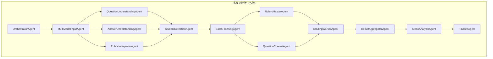
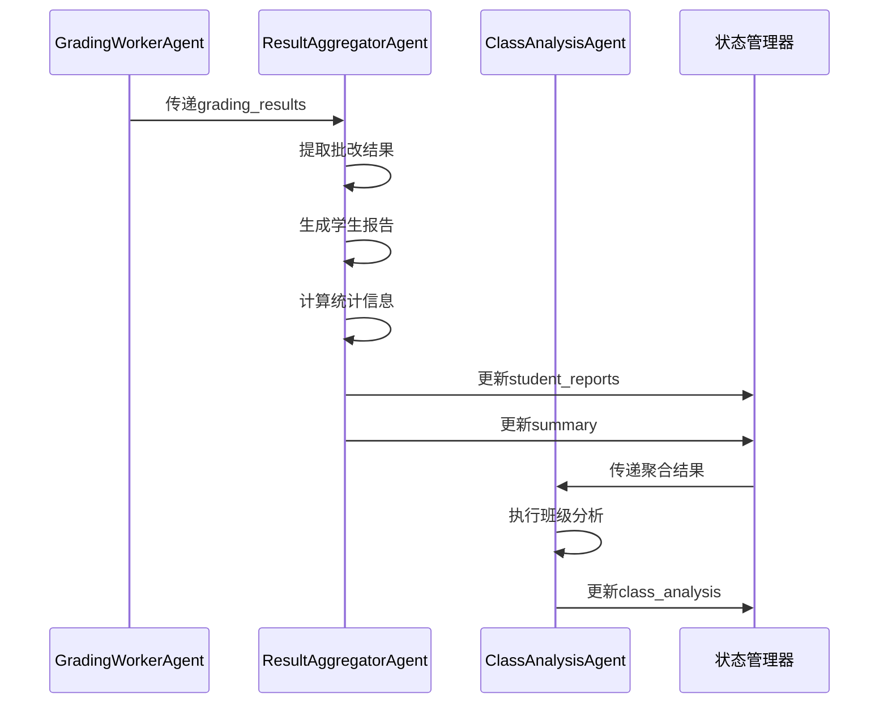
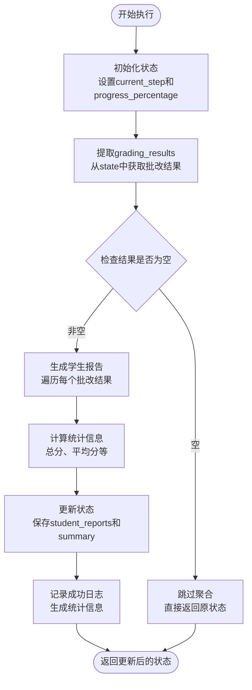
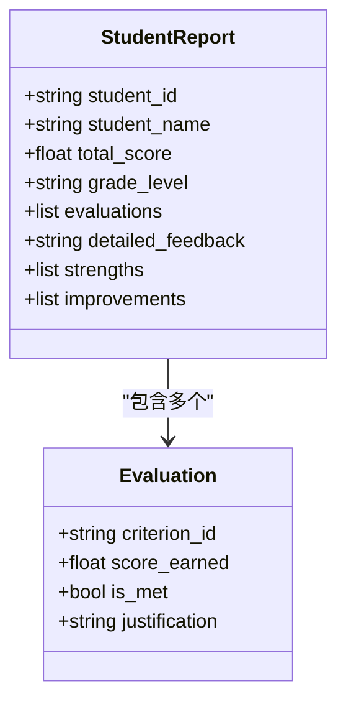
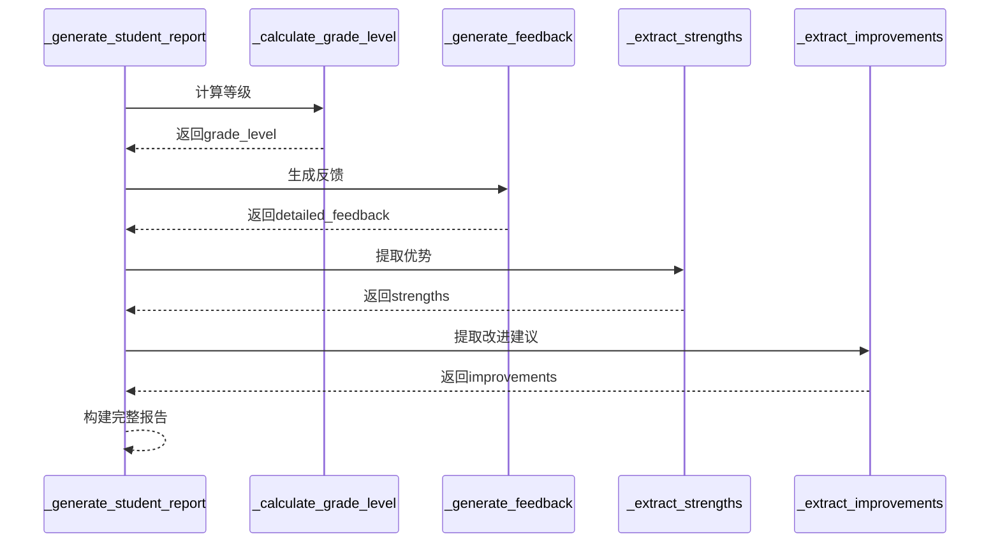
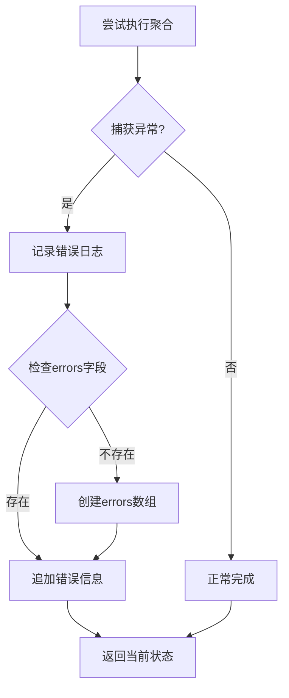

# 结果聚合

<cite>
**本文档中引用的文件**
- [result_aggregator_agent.py](file://ai_correction/functions/langgraph/agents/result_aggregator_agent.py)
- [state.py](file://ai_correction/functions/langgraph/state.py)
- [workflow_multimodal.py](file://ai_correction/functions/langgraph/workflow_multimodal.py)
- [workflow_new.py](file://ai_correction/functions/langgraph/workflow_new.py)
- [test_agents.py](file://ai_correction/tests/test_agents.py)
- [class_analysis_agent.py](file://ai_correction/functions/langgraph/agents/class_analysis_agent.py)
</cite>

## 目录
1. [简介](#简介)
2. [项目结构](#项目结构)
3. [核心组件](#核心组件)
4. [架构概览](#架构概览)
5. [详细组件分析](#详细组件分析)
6. [依赖关系分析](#依赖关系分析)
7. [性能考虑](#性能考虑)
8. [故障排除指南](#故障排除指南)
9. [结论](#结论)

## 简介

`ResultAggregatorAgent`是AI批改系统中的关键组件，负责在批改流程的最后阶段汇总所有批次的批改结果，生成结构化的学生报告和统计信息。该代理采用深度协作架构，能够处理大规模学生群体的批改需求，并提供详细的个性化反馈。

该组件的核心职责包括：
- 从状态中提取批改结果数据
- 为每个学生生成详细的评分报告
- 计算总分、等级和统计指标
- 提取学习优势和改进建议
- 实现完善的错误处理和日志记录机制

## 项目结构

`ResultAggregatorAgent`位于AI批改系统的深度协作架构中，作为第八个核心Agent参与完整的批改流程：



**图表来源**
- [workflow_multimodal.py](file://ai_correction/functions/langgraph/workflow_multimodal.py#L82-L118)

**章节来源**
- [workflow_multimodal.py](file://ai_correction/functions/langgraph/workflow_multimodal.py#L27-L55)

## 核心组件

### ResultAggregatorAgent 类

`ResultAggregatorAgent`是一个专门设计的结果聚合类，继承自Python的基本类结构。该类实现了异步调用接口，能够在LangGraph工作流中无缝集成。

#### 主要属性
- `agent_name`: 代理名称标识符，固定为"ResultAggregatorAgent"
- `logger`: 专用的日志记录器，用于跟踪执行过程和错误信息

#### 核心方法
- `__call__()`: 主要执行方法，处理状态转换和结果聚合
- `_generate_student_report()`: 生成单个学生的详细报告
- `_calculate_grade_level()`: 计算学生等级
- `_generate_feedback()`: 生成评分反馈文本
- `_extract_strengths()`: 提取学习优势
- `_extract_improvements()`: 提取改进建议

**章节来源**
- [result_aggregator_agent.py](file://ai_correction/functions/langgraph/agents/result_aggregator_agent.py#L14-L143)

## 架构概览

`ResultAggregatorAgent`在AI批改系统中扮演着承上启下的关键角色。它接收来自`GradingWorkerAgent`的批改结果，经过处理后生成结构化的输出，为后续的班级分析和最终报告提供基础数据。



**图表来源**
- [workflow_multimodal.py](file://ai_correction/functions/langgraph/workflow_multimodal.py#L115-L118)
- [result_aggregator_agent.py](file://ai_correction/functions/langgraph/agents/result_aggregator_agent.py#L20-L70)

## 详细组件分析

### __call__ 方法详解

`__call__`方法是`ResultAggregatorAgent`的核心执行入口，负责整个结果聚合流程的协调和控制。

#### 执行流程



**图表来源**
- [result_aggregator_agent.py](file://ai_correction/functions/langgraph/agents/result_aggregator_agent.py#L20-L70)

#### 状态变化示例

在聚合前后，`state`对象会发生显著的变化：

**聚合前状态 (`state['grading_results']`)：**
```python
{
    'grading_results': [
        {
            'student_id': 'S001',
            'student_name': '张三',
            'total_score': 85,
            'evaluations': [
                {'criterion_id': 'C1', 'score_earned': 5, 'is_met': True, 'justification': '正确应用公式'},
                {'criterion_id': 'C2', 'score_earned': 3, 'is_met': False, 'justification': '计算错误'}
            ]
        }
    ]
}
```

**聚合后状态 (`state['student_reports']`)：**
```python
{
    'student_reports': [
        {
            'student_id': 'S001',
            'student_name': '张三',
            'total_score': 85,
            'grade_level': 'B',
            'evaluations': [...],
            'detailed_feedback': '- C1: 正确 (5分)\n- C2: 错误 (3分)',
            'strengths': ['C1: 正确应用公式'],
            'improvements': ['C2: 需要改进']
        }
    ],
    'summary': {
        'total_students': 1,
        'average_score': 85.0,
        'completed_at': '2024-01-01 12:00:00'
    }
}
```

**章节来源**
- [result_aggregator_agent.py](file://ai_correction/functions/langgraph/agents/result_aggregator_agent.py#L20-L70)

### _generate_student_report 方法

该方法负责为单个学生生成完整的评分报告，是结果聚合的核心逻辑之一。

#### 报告结构



**图表来源**
- [result_aggregator_agent.py](file://ai_correction/functions/langgraph/agents/result_aggregator_agent.py#L72-L95)

#### 私有方法调用链



**图表来源**
- [result_aggregator_agent.py](file://ai_correction/functions/langgraph/agents/result_aggregator_agent.py#L72-L95)

**章节来源**
- [result_aggregator_agent.py](file://ai_correction/functions/langgraph/agents/result_aggregator_agent.py#L72-L95)

### 错误处理机制

`ResultAggregatorAgent`实现了完善的错误处理策略，确保系统在异常情况下的稳定性和可靠性。

#### 错误处理流程



**图表来源**
- [result_aggregator_agent.py](file://ai_correction/functions/langgraph/agents/result_aggregator_agent.py#L58-L70)

#### 日志记录策略

系统采用分级日志记录策略：

- **INFO级别**: 记录聚合开始、完成和统计信息
- **WARNING级别**: 记录空结果集等警告情况
- **ERROR级别**: 记录执行失败和异常情况

**章节来源**
- [result_aggregator_agent.py](file://ai_correction/functions/langgraph/agents/result_aggregator_agent.py#L58-L70)

### 扩展指导

#### 自定义聚合逻辑

开发者可以通过以下方式扩展`ResultAggregatorAgent`的功能：

##### 1. 重写私有方法

```python
class CustomResultAggregator(ResultAggregatorAgent):
    def _calculate_grade_level(self, score: float, state: Dict[str, Any]) -> str:
        # 自定义等级计算逻辑
        total_points = state.get('batch_rubric_packages', {}).get('batch_001', {}).get('total_points', 100)
        percentage = (score / total_points * 100) if total_points > 0 else 0
        
        # 添加自定义等级标准
        if percentage >= 95:
            return 'A+'
        elif percentage >= 90:
            return 'A'
        # ... 其他条件
```

##### 2. 添加新统计指标

```python
def __call__(self, state: Dict[str, Any]) -> Dict[str, Any]:
    # ... 原有逻辑
    
    # 添加新的统计指标
    scores = [r['total_score'] for r in grading_results]
    state['advanced_stats'] = {
        'median_score': self._calculate_median(scores),
        'score_variance': self._calculate_variance(scores),
        'top_performers': self._identify_top_performers(grading_results)
    }
    
    return state
```

##### 3. 扩展报告内容

```python
def _generate_student_report(self, grading_result: Dict[str, Any], state: Dict[str, Any]) -> Dict[str, Any]:
    base_report = super()._generate_student_report(grading_result, state)
    
    # 添加额外信息
    base_report['learning_style'] = self._analyze_learning_style(grading_result)
    base_report['recommendations'] = self._generate_recommendations(grading_result)
    
    return base_report
```

**章节来源**
- [result_aggregator_agent.py](file://ai_correction/functions/langgraph/agents/result_aggregator_agent.py#L14-L143)

## 依赖关系分析

`ResultAggregatorAgent`与其他组件存在明确的依赖关系：

```mermaid
graph TD
RA[ResultAggregatorAgent] --> State[GradingState]
RA --> Logger[logging模块]
RA --> DateTime[datetime模块]
State --> GradingResults["grading_results<br/>批改结果列表"]
State --> StudentReports["student_reports<br/>学生报告列表"]
State --> Summary["summary<br/>统计摘要"]
RA --> GA[GradingWorkerAgent]
RA --> CA[ClassAnalysisAgent]
GA --> RA : "提供输入数据"
RA --> CA : "提供输出数据"
```

**图表来源**
- [result_aggregator_agent.py](file://ai_correction/functions/langgraph/agents/result_aggregator_agent.py#L1-L10)
- [state.py](file://ai_correction/functions/langgraph/state.py#L50-L100)

**章节来源**
- [result_aggregator_agent.py](file://ai_correction/functions/langgraph/agents/result_aggregator_agent.py#L1-L10)
- [state.py](file://ai_correction/functions/langgraph/state.py#L50-L100)

## 性能考虑

### 大规模数据处理

对于包含大量学生的批改场景，`ResultAggregatorAgent`采用了以下优化策略：

1. **流式处理**: 逐个处理学生结果，避免内存溢出
2. **批量操作**: 对统计计算进行批量处理
3. **缓存机制**: 复用计算结果，减少重复计算

### 内存使用优化

- 使用生成器表达式而非列表推导式处理大型数据集
- 及时释放不再需要的中间结果
- 实现状态压缩机制

## 故障排除指南

### 常见问题及解决方案

#### 1. 空结果集问题

**症状**: 日志显示"没有批改结果，跳过聚合"

**原因**: `grading_results`为空或未正确设置

**解决方案**:
- 检查`GradingWorkerAgent`是否正确生成结果
- 验证批次处理流程是否完整执行
- 确认状态传递过程中数据完整性

#### 2. 等级计算错误

**症状**: 学生等级与预期不符

**原因**: `batch_rubric_packages`配置不正确

**解决方案**:
- 验证评分标准的总分设置
- 检查`total_points`字段的准确性
- 确认等级计算逻辑的边界条件

#### 3. 报告生成失败

**症状**: 聚合过程抛出异常

**原因**: 输入数据格式不正确

**解决方案**:
- 添加数据验证逻辑
- 实现默认值处理机制
- 增强错误恢复能力

**章节来源**
- [result_aggregator_agent.py](file://ai_correction/functions/langgraph/agents/result_aggregator_agent.py#L58-L70)

## 结论

`ResultAggregatorAgent`是AI批改系统中不可或缺的核心组件，它不仅实现了高效的批改结果聚合功能，还提供了丰富的学生反馈和统计分析能力。通过深度集成到多模态批改工作流中，该组件为教育技术的发展提供了强有力的支持。

### 主要优势

1. **模块化设计**: 清晰的方法分离和职责划分
2. **可扩展性**: 支持自定义聚合逻辑和报告格式
3. **健壮性**: 完善的错误处理和日志记录机制
4. **性能优化**: 针对大规模数据处理的优化策略

### 未来发展方向

1. **机器学习集成**: 利用AI技术提升报告质量
2. **实时分析**: 支持实时的批改结果分析
3. **多语言支持**: 扩展到更多语言环境
4. **可视化增强**: 提供更丰富的数据可视化选项

通过持续的优化和扩展，`ResultAggregatorAgent`将继续在智能教育领域发挥重要作用，为教师和学生提供更加精准和个性化的批改服务。