# 交互流程

<cite>
**本文档引用的文件**
- [main.py](file://ai_correction/main.py)
- [UI_OPTIMIZATION_SUMMARY.md](file://ai_correction/docs/UI_OPTIMIZATION_SUMMARY.md)
- [workflow_multimodal.py](file://ai_correction/functions/langgraph/workflow_multimodal.py)
- [state.py](file://ai_correction/functions/langgraph/state.py)
- [streaming.py](file://ai_correction/functions/langgraph/streaming.py)
- [langgraph_integration.py](file://ai_correction/functions/langgraph_integration.py)
- [simple_ui_helper.py](file://ai_correction/functions/langgraph/simple_ui_helper.py)
- [workflow_simplified.py](file://ai_correction/functions/langgraph/workflow_simplified.py)
- [test_new_workflow.py](file://ai_correction/test_new_workflow.py)
- [local_runner.py](file://ai_correction/local_runner.py)
- [upload_validator.py](file://ai_correction/functions/langgraph/agents/upload_validator.py)
</cite>

## 目录
1. [系统概述](#系统概述)
2. [用户登录流程](#用户登录流程)
3. [文件上传与参数配置](#文件上传与参数配置)
4. [批改任务触发机制](#批改任务触发机制)
5. [Streamlit前端与LangGraph后端通信](#streamlit前端与langgraph后端通信)
6. [状态管理系统](#状态管理系统)
7. [异步任务处理](#异步任务处理)
8. [结果展示与交互](#结果展示与交互)
9. [错误处理与故障排除](#错误处理与故障排除)
10. [性能优化策略](#性能优化策略)

## 系统概述

AI智能批改系统采用现代化的前后端分离架构，前端基于Streamlit构建简洁直观的用户界面，后端使用LangGraph实现高效的多Agent协作工作流。系统的核心优势在于简化了用户操作流程，删除了冗余的模式选择步骤，实现了从文件上传到结果展示的一站式批改体验。

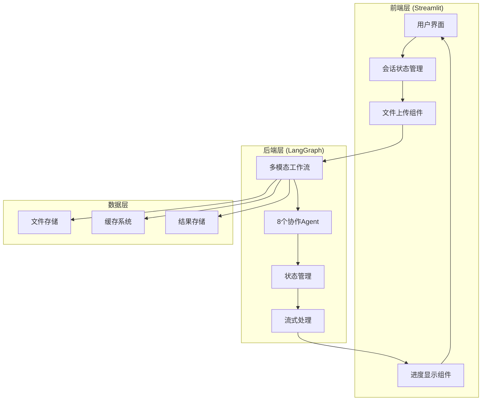

**图表来源**
- [main.py](file://ai_correction/main.py#L1-L100)
- [workflow_multimodal.py](file://ai_correction/functions/langgraph/workflow_multimodal.py#L1-L50)

## 用户登录流程

系统采用简化的登录机制，支持演示账户和正式用户两种登录方式。登录流程经过优化，减少了传统系统的复杂认证步骤。

### 登录界面设计

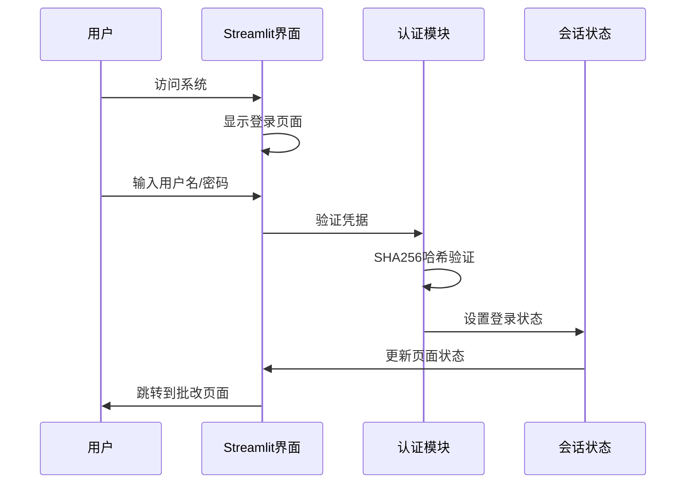

**图表来源**
- [main.py](file://ai_correction/main.py#L520-L580)

### 登录状态管理

系统使用`st.session_state`维护用户的登录状态，确保用户在整个批改流程中的身份一致性：

| 状态字段 | 类型 | 描述 | 默认值 |
|---------|------|------|--------|
| `logged_in` | bool | 登录状态标志 | False |
| `username` | str | 用户名 | "" |
| `page` | str | 当前页面 | "home" |
| `current_task_id` | str | 当前任务ID | None |

**章节来源**
- [main.py](file://ai_correction/main.py#L423-L428)

## 文件上传与参数配置

系统简化了传统的三文件上传流程，采用统一的文件选择器，支持多种文件格式的批量上传。用户无需手动区分题目、答案和评分标准文件。

### 支持的文件格式

| 文件类型 | 支持格式 | 最大文件大小 | 验证要求 |
|---------|----------|-------------|----------|
| 图像文件 | JPG, JPEG, PNG, BMP, WebP | 10MB | 尺寸检查、格式验证 |
| 文本文档 | TXT, MD | 10MB | 编码检测、内容验证 |
| PDF文件 | PDF | 10MB | 格式验证 |
| Word文档 | DOC, DOCX | 10MB | 格式验证 |

### 文件上传流程

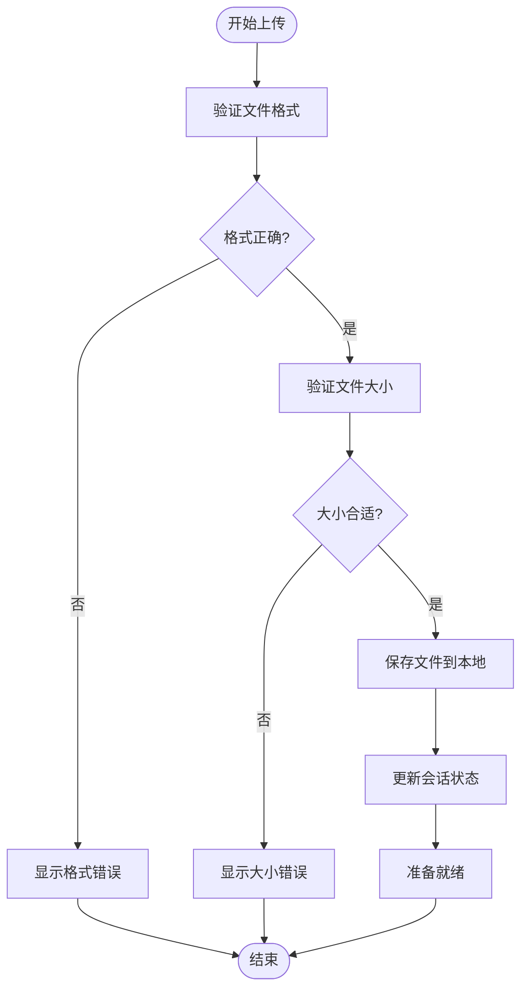

**图表来源**
- [upload_validator.py](file://ai_correction/functions/langgraph/agents/upload_validator.py#L84-L122)

### 参数配置界面

系统提供简洁的参数配置选项，用户可以选择严格程度和语言设置：

| 参数 | 可选值 | 默认值 | 说明 |
|------|--------|--------|------|
| 严格程度 | 宽松/中等/严格 | 中等 | 影响评分标准的执行力度 |
| 语言 | zh/en | zh | 系统和批改结果的语言 |

**章节来源**
- [main.py](file://ai_correction/main.py#L630-L650)

## 批改任务触发机制

系统采用事件驱动的批改任务触发机制，当用户点击"立即批改"按钮时，系统会自动收集上传的文件和配置参数，然后启动异步批改任务。

### 任务触发流程

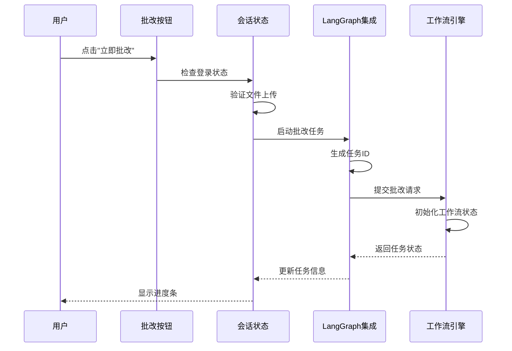

**图表来源**
- [main.py](file://ai_correction/main.py#L630-L650)
- [langgraph_integration.py](file://ai_correction/functions/langgraph_integration.py#L30-L80)

### 任务状态跟踪

系统维护详细的批改任务状态，包括进度百分比、当前步骤和错误信息：

| 状态字段 | 类型 | 描述 | 更新时机 |
|---------|------|------|----------|
| `current_step` | str | 当前处理步骤 | 每个Agent完成后更新 |
| `progress_percentage` | float | 进度百分比 | 实时更新 |
| `completion_status` | str | 完成状态 | 任务开始、完成或失败时 |
| `errors` | list | 错误信息列表 | 发生错误时追加 |

**章节来源**
- [state.py](file://ai_correction/functions/langgraph/state.py#L240-L260)

## Streamlit前端与LangGraph后端通信

系统采用异步通信机制，前端通过WebSocket或轮询方式实时获取后端的批改进度和结果。这种设计确保了用户界面的响应性和实时性。

### 通信架构

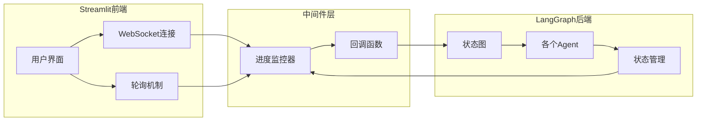

**图表来源**
- [streaming.py](file://ai_correction/functions/langgraph/streaming.py#L40-L90)

### 进度事件类型

系统定义了完整的进度事件体系，用于精确跟踪批改过程的每个阶段：

| 事件类型 | 描述 | 触发条件 |
|---------|------|----------|
| `STARTED` | 任务开始 | 工作流启动时 |
| `STEP_STARTED` | 步骤开始 | 新的Agent开始处理 |
| `STEP_COMPLETED` | 步骤完成 | Agent处理完成 |
| `PROGRESS_UPDATE` | 进度更新 | 实时进度变化 |
| `ERROR` | 错误发生 | 处理过程中出现异常 |
| `COMPLETED` | 任务完成 | 所有步骤成功完成 |
| `FAILED` | 任务失败 | 出现不可恢复的错误 |

**章节来源**
- [streaming.py](file://ai_correction/functions/langgraph/streaming.py#L20-L35)

## 状态管理系统

系统使用`st.session_state`作为主要的状态管理机制，确保用户在不同页面间切换时能够保持连续的批改体验。

### 状态字段设计

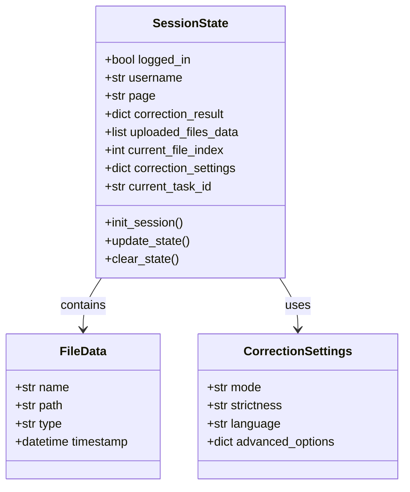

**图表来源**
- [main.py](file://ai_correction/main.py#L423-L428)

### 状态持久化策略

系统采用内存状态管理，结合文件系统存储实现状态的临时持久化：

1. **会话状态**：存储在浏览器内存中，页面刷新时丢失
2. **文件上传**：保存在本地`uploads`目录，按用户隔离
3. **批改结果**：存储在`st.session_state`中，页面切换时保留

**章节来源**
- [main.py](file://ai_correction/main.py#L423-L428)

## 异步任务处理

系统采用异步编程模型处理耗时的批改任务，确保前端界面不会因为长时间的批改操作而冻结。

### 异步执行流程

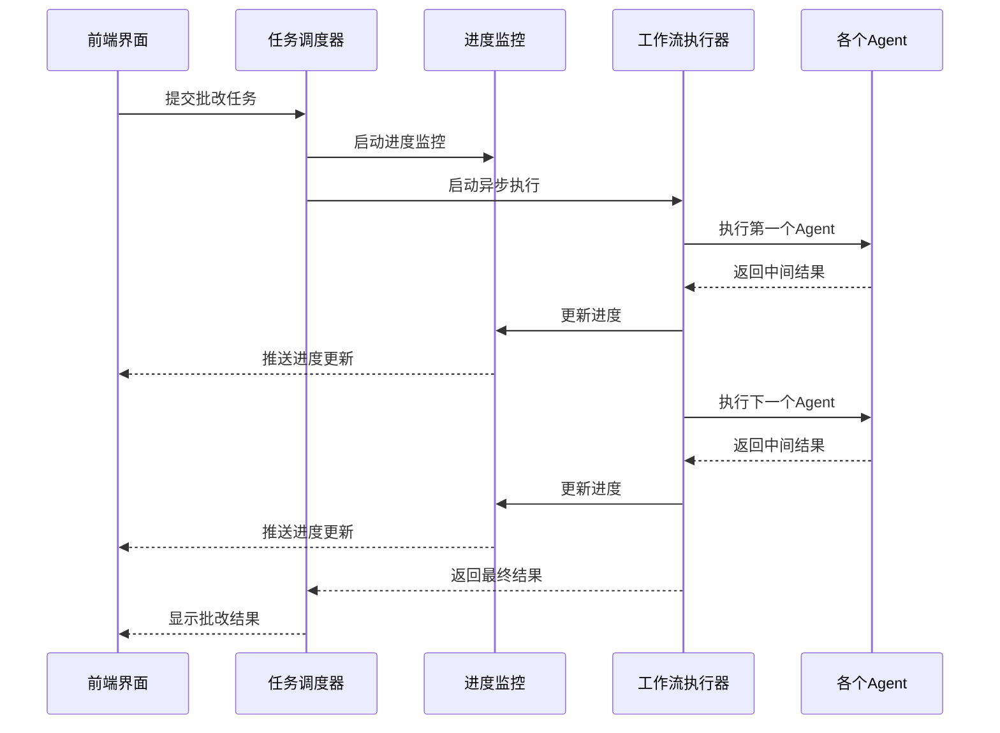

**图表来源**
- [workflow_multimodal.py](file://ai_correction/functions/langgraph/workflow_multimodal.py#L150-L200)
- [streaming.py](file://ai_correction/functions/langgraph/streaming.py#L100-L150)

### 任务生命周期管理

系统提供完整的任务生命周期管理，包括任务创建、执行、监控和清理：

| 生命周期阶段 | 操作 | 状态变更 |
|-------------|------|----------|
| 创建 | 生成任务ID，初始化状态 | pending → running |
| 执行 | 启动工作流，开始处理 | running → processing |
| 监控 | 实时更新进度，捕获错误 | processing → completed/failed |
| 清理 | 移除过期任务，释放资源 | completed/failed → cleaned |

**章节来源**
- [langgraph_integration.py](file://ai_correction/functions/langgraph_integration.py#L150-L200)

## 结果展示与交互

系统提供了丰富的结果展示功能，采用卡片式设计和折叠面板结构，使复杂的批改结果易于理解和导航。

### 批改结果界面布局

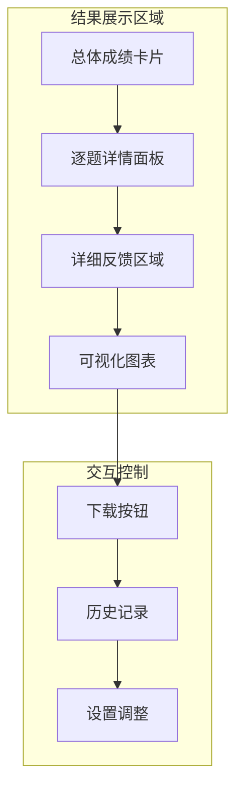

**图表来源**
- [main.py](file://ai_correction/main.py#L650-L750)

### 成绩卡片设计

系统采用四维成绩卡片设计，通过颜色编码和图标增强视觉效果：

| 指标类型 | 颜色编码 | 图标 | 说明 |
|---------|----------|------|------|
| 总分 | 蓝色 | 📊 | 当前得分/满分 |
| 得分率 | 绿色 | 🎉 | 百分比显示 |
| 等级 | 橙色 | 🏆 | 字母等级 |
| 答对题数 | 红色 | ✅ | 正确题目数量 |

### 逐题详情展示

每个题目都采用折叠面板设计，包含完整的评分信息：

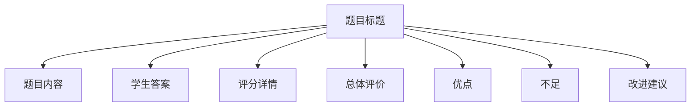

**图表来源**
- [UI_OPTIMIZATION_SUMMARY.md](file://ai_correction/docs/UI_OPTIMIZATION_SUMMARY.md#L120-L180)

**章节来源**
- [main.py](file://ai_correction/main.py#L650-L750)

## 错误处理与故障排除

系统实现了完善的错误处理机制，能够优雅地处理各种异常情况，并为用户提供清晰的错误信息和解决建议。

### 常见错误类型

| 错误类别 | 错误代码 | 描述 | 解决方案 |
|---------|----------|------|----------|
| 文件上传错误 | UPLOAD_FAILED | 文件上传失败 | 检查文件格式和大小限制 |
| 参数验证错误 | INVALID_PARAMS | 参数配置无效 | 重新检查批改参数设置 |
| 网络连接错误 | NETWORK_ERROR | 与服务器连接失败 | 检查网络连接状态 |
| 处理超时错误 | TIMEOUT_ERROR | 批改处理超时 | 减少文件大小或简化批改模式 |
| 系统内部错误 | INTERNAL_ERROR | 内部系统错误 | 联系技术支持 |

### 错误恢复策略

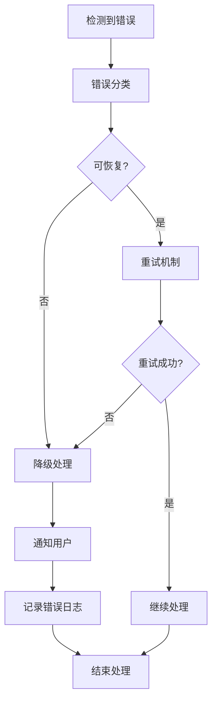

**图表来源**
- [langgraph_integration.py](file://ai_correction/functions/langgraph_integration.py#L80-L120)

### 故障排除指南

对于常见的批改问题，系统提供了详细的故障排除指南：

1. **上传失败**
   - 检查文件格式是否支持
   - 确认文件大小不超过限制
   - 验证网络连接稳定性

2. **批改结果为空**
   - 确认所有必需文件都已上传
   - 检查文件内容是否清晰可读
   - 尝试使用不同的批改模式

3. **长时间无响应**
   - 检查系统负载情况
   - 等待更长时间（可能需要几分钟）
   - 联系技术支持获取帮助

**章节来源**
- [langgraph_integration.py](file://ai_correction/functions/langgraph_integration.py#L150-L200)

## 性能优化策略

系统采用了多层次的性能优化策略，确保在处理大量文件和复杂批改任务时仍能保持良好的响应性能。

### 多模态优化

系统采用深度协作的8-Agent架构，实现了Token使用的极致优化：

- **一次理解，多次使用**：评分标准被一次性深度理解，生成压缩包传递给后续Agent
- **并行处理**：多个Agent同时处理不同类型的文件理解任务
- **批次管理**：基于学生信息的智能批次划分，提高处理效率

### 缓存策略

| 缓存层级 | 缓存内容 | 生命周期 | 清理策略 |
|---------|----------|----------|----------|
| 内存缓存 | 临时处理结果 | 会话期间 | 会话结束时清理 |
| 文件缓存 | 处理过的文件 | 24小时 | 自动清理过期文件 |
| 数据库缓存 | 批改历史记录 | 永久存储 | 手动清理 |

### 并发处理优化

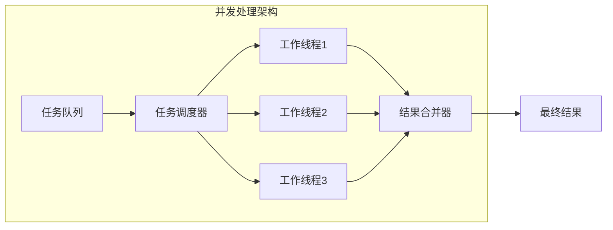

**图表来源**
- [workflow_multimodal.py](file://ai_correction/functions/langgraph/workflow_multimodal.py#L50-L100)

### 前端性能优化

前端界面采用懒加载和虚拟滚动技术，确保在处理大量批改结果时仍能保持流畅的用户体验：

- **图片预览**：采用Base64编码，减少HTTP请求
- **文件列表**：使用虚拟滚动，只渲染可见区域
- **进度更新**：采用WebSocket实时推送，避免频繁轮询

**章节来源**
- [main.py](file://ai_correction/main.py#L200-L300)