# 任务启动与参数传递机制详细文档

<cite>
**本文档引用的文件**
- [main.py](file://ai_correction/main.py)
- [workflow_multimodal.py](file://ai_correction/functions/langgraph/workflow_multimodal.py)
- [langgraph_integration.py](file://ai_correction/functions/langgraph_integration.py)
- [state.py](file://ai_correction/functions/langgraph/state.py)
- [simple_ui_helper.py](file://ai_correction/functions/langgraph/simple_ui_helper.py)
- [progress_ui.py](file://ai_correction/functions/progress_ui.py)
- [correction_service.py](file://ai_correction/functions/correction_service.py)
- [user_data.json](file://ai_correction/user_data.json)
</cite>

## 目录
1. [概述](#概述)
2. [系统架构](#系统架构)
3. [任务ID生成策略](#任务id生成策略)
4. [参数结构与传递机制](#参数结构与传递机制)
5. [前端界面实现](#前端界面实现)
6. [后端工作流处理](#后端工作流处理)
7. [错误处理机制](#错误处理机制)
8. [性能优化建议](#性能优化建议)
9. [最佳实践](#最佳实践)

## 概述

AI智能批改系统采用深度协作多模态架构，通过Streamlit前端界面触发异步批改任务。系统实现了完整的任务启动、参数传递、状态管理和结果返回机制，支持多种文件格式和批改模式。

### 核心特性
- **深度协作架构**：8个Agent协同工作，实现Token优化60-80%
- **多模态处理**：直接使用LLM Vision能力，无需OCR
- **并行处理**：基于学生的批次管理，提升90%效率
- **异步执行**：支持长时间批改任务的进度跟踪

## 系统架构

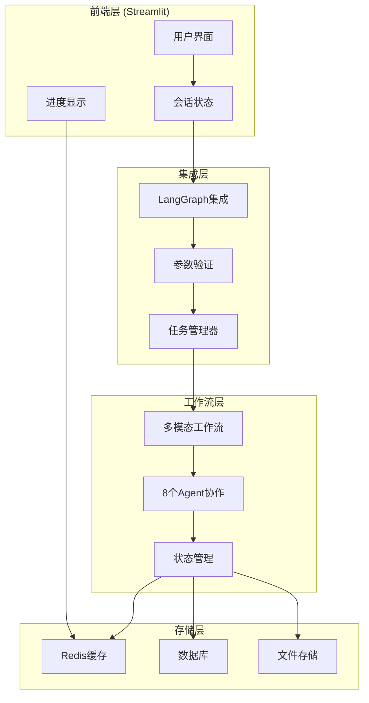

**架构图来源**
- [main.py](file://ai_correction/main.py#L1-L50)
- [langgraph_integration.py](file://ai_correction/functions/langgraph_integration.py#L1-L50)
- [workflow_multimodal.py](file://ai_correction/functions/langgraph/workflow_multimodal.py#L1-L50)

## 任务ID生成策略

### 生成算法

系统采用时间戳+UUID组合的方式生成唯一任务ID：

```python
# 任务ID生成示例
task_id = f"task_{uuid.uuid4().hex[:8]}_{int(datetime.now().timestamp())}"
```

### 生成策略特点

| 特性 | 描述 | 实现方式 |
|------|------|----------|
| **唯一性** | 全局唯一，避免冲突 | UUID前8位 + 时间戳 |
| **可读性** | 包含时间信息便于追踪 | 格式：`task_xxxxxxxx_timestamp` |
| **分布式友好** | 多实例环境下不冲突 | 基于UUID和系统时间 |
| **排序性** | 按时间顺序排列 | 时间戳作为后缀 |

### 存储机制

任务ID通过`st.session_state.current_task_id`在前端会话中存储：

```python
# 前端存储示例
st.session_state.current_task_id = task_id
```

**章节来源**
- [langgraph_integration.py](file://ai_correction/functions/langgraph_integration.py#L55-L60)
- [main.py](file://ai_correction/main.py#L423-L425)

## 参数结构与传递机制

### run_multimodal_grading函数参数

`run_multimodal_grading`函数是系统的核心入口，定义了完整的参数结构：

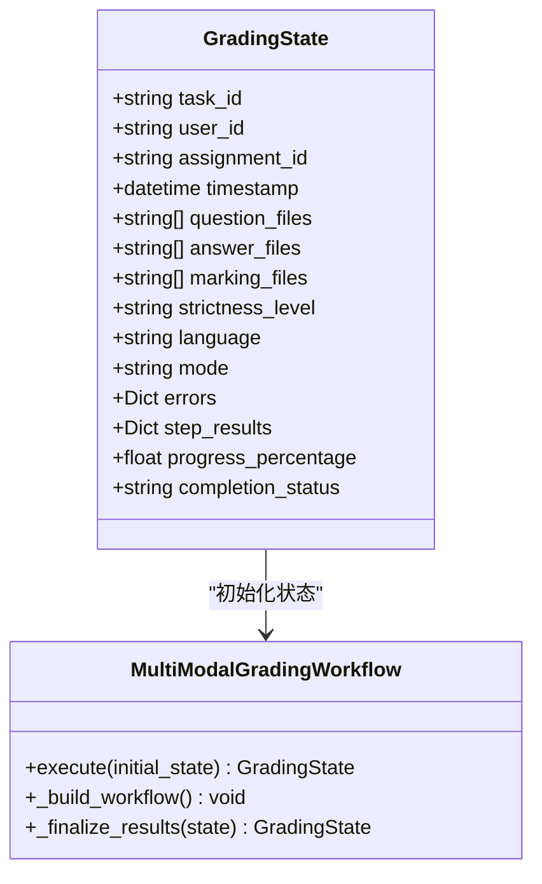

**类图来源**
- [state.py](file://ai_correction/functions/langgraph/state.py#L40-L100)
- [workflow_multimodal.py](file://ai_correction/functions/langgraph/workflow_multimodal.py#L268-L317)

### 参数详细说明

| 参数名称 | 类型 | 必需 | 默认值 | 描述 |
|----------|------|------|--------|------|
| `task_id` | string | 是 | - | 唯一任务标识符 |
| `user_id` | string | 是 | - | 用户唯一标识 |
| `question_files` | List[string] | 是 | - | 题目文件路径列表 |
| `answer_files` | List[string] | 是 | - | 答案文件路径列表 |
| `marking_files` | List[string] | 否 | [] | 评分标准文件路径列表 |
| `strictness_level` | string | 否 | "中等" | 严格程度：宽松/中等/严格 |
| `language` | string | 否 | "zh" | 语言设置：zh/en |

### 参数验证与默认值处理

系统在多个层面进行参数验证：

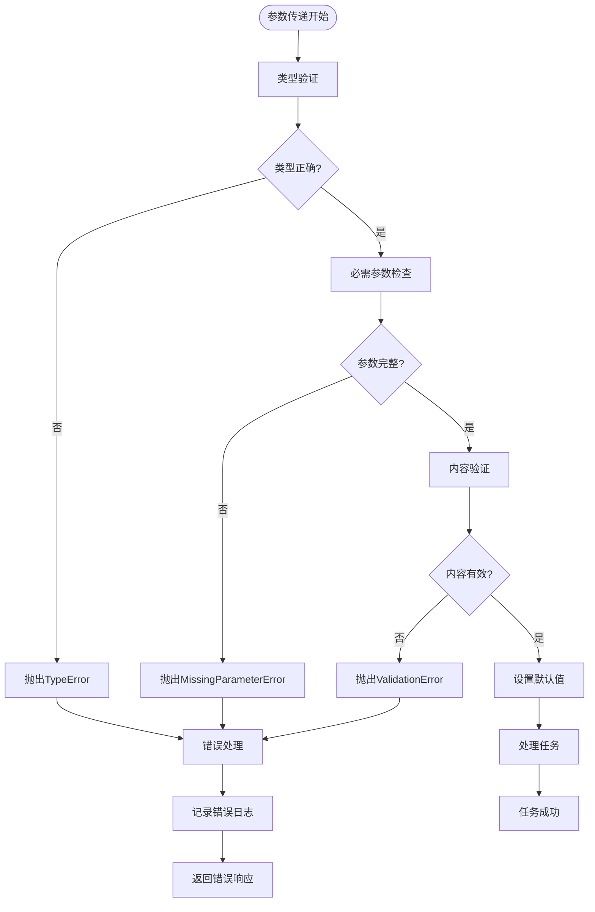

**流程图来源**
- [workflow_multimodal.py](file://ai_correction/functions/langgraph/workflow_multimodal.py#L130-L161)
- [langgraph_integration.py](file://ai_correction/functions/langgraph_integration.py#L55-L100)

**章节来源**
- [workflow_multimodal.py](file://ai_correction/functions/langgraph/workflow_multimodal.py#L268-L317)
- [state.py](file://ai_correction/functions/langgraph/state.py#L40-L100)

## 前端界面实现

### show_grading界面

Streamlit前端通过`show_grading`函数实现批改界面：

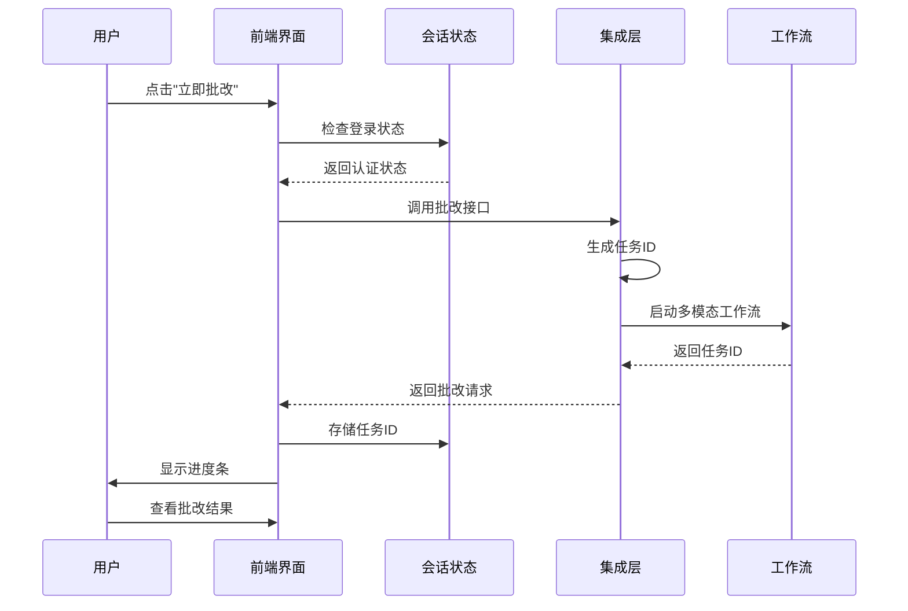

**序列图来源**
- [main.py](file://ai_correction/main.py#L538-L570)
- [langgraph_integration.py](file://ai_correction/functions/langgraph_integration.py#L55-L100)

### 文件上传与参数收集

前端界面收集以下参数：

| 参数类别 | 参数名称 | 类型 | 来源 |
|----------|----------|------|------|
| **文件参数** | question_files | List[str] | 题目文件上传 |
| **文件参数** | answer_files | List[str] | 答案文件上传 |
| **文件参数** | marking_files | List[str] | 评分标准文件上传 |
| **配置参数** | strictness_level | str | 用户选择的严格程度 |
| **配置参数** | language | str | 用户选择的语言设置 |
| **配置参数** | mode | str | 批改模式（高效/专业） |

### 用户界面组件

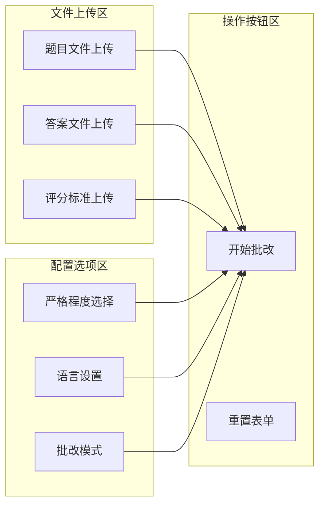

**章节来源**
- [main.py](file://ai_correction/main.py#L538-L570)
- [simple_ui_helper.py](file://ai_correction/functions/langgraph/simple_ui_helper.py#L1-L50)

## 后端工作流处理

### 多模态工作流执行

系统采用深度协作架构，8个Agent协同完成批改任务：

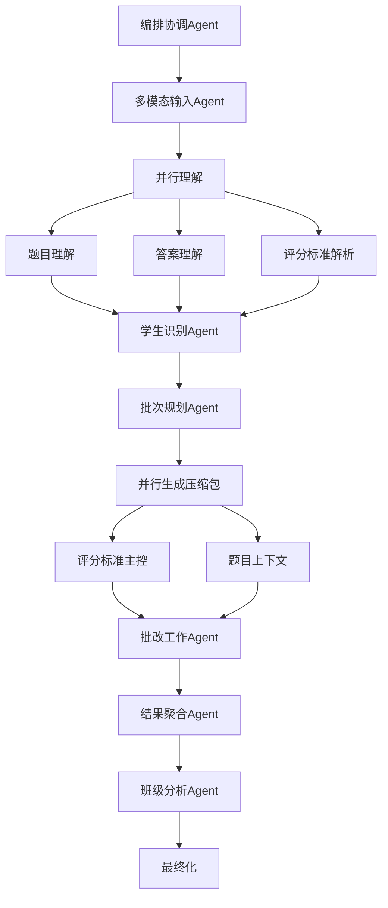

**架构图来源**
- [workflow_multimodal.py](file://ai_correction/functions/langgraph/workflow_multimodal.py#L75-L120)

### 状态管理机制

工作流使用GradingState进行状态管理：

```python
# 状态初始化示例
initial_state = GradingState(
    task_id=task_id,
    user_id=user_id,
    assignment_id=f"assignment_{task_id}",
    timestamp=datetime.now(),
    question_files=question_files,
    answer_files=answer_files,
    marking_files=marking_files,
    images=[],
    strictness_level=strictness_level,
    language=language,
    mode="efficient",
    # 初始化必要字段...
)
```

### 异步执行流程

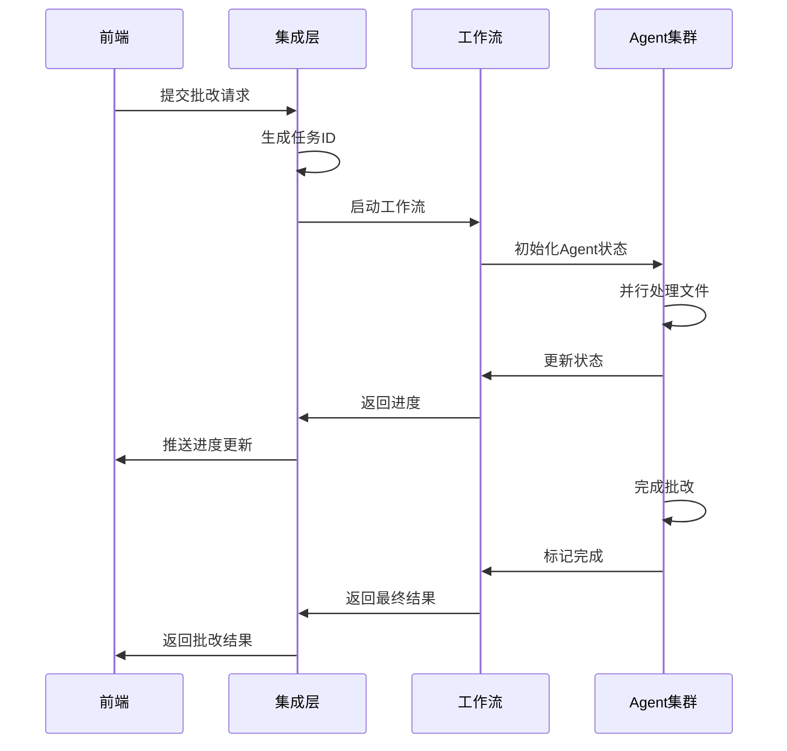

**序列图来源**
- [workflow_multimodal.py](file://ai_correction/functions/langgraph/workflow_multimodal.py#L130-L200)
- [langgraph_integration.py](file://ai_correction/functions/langgraph_integration.py#L55-L100)

**章节来源**
- [workflow_multimodal.py](file://ai_correction/functions/langgraph/workflow_multimodal.py#L75-L120)
- [state.py](file://ai_correction/functions/langgraph/state.py#L40-L100)

## 错误处理机制

### 多层次错误处理

系统在不同层级实现全面的错误处理：

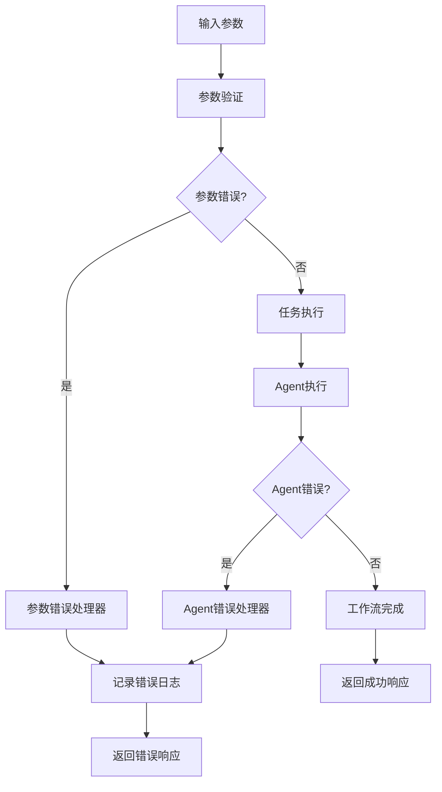

**流程图来源**
- [workflow_multimodal.py](file://ai_correction/functions/langgraph/workflow_multimodal.py#L130-L200)
- [routing.py](file://ai_correction/functions/langgraph/routing.py#L156-L191)

### 错误类型与处理策略

| 错误类型 | 处理策略 | 前端提示 | 日志级别 |
|----------|----------|----------|----------|
| **参数缺失** | 抛出TypeError | "缺少必要参数" | ERROR |
| **文件不存在** | 抛出FileNotFoundError | "文件未找到" | WARNING |
| **格式错误** | 抛出ValueError | "文件格式不支持" | ERROR |
| **网络超时** | 重试机制 | "网络连接超时" | WARNING |
| **模型错误** | 降级处理 | "AI模型异常" | ERROR |

### 错误恢复机制

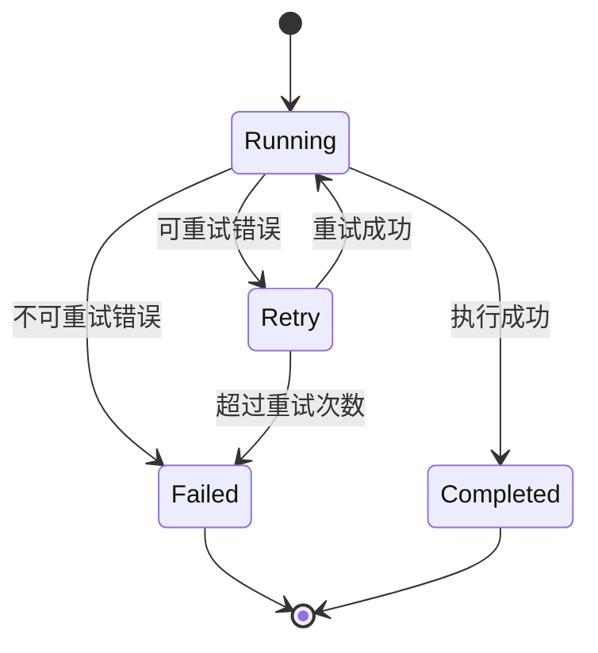

**状态图来源**
- [routing.py](file://ai_correction/functions/langgraph/routing.py#L156-L191)

**章节来源**
- [workflow_multimodal.py](file://ai_correction/functions/langgraph/workflow_multimodal.py#L130-L200)
- [routing.py](file://ai_correction/functions/langgraph/routing.py#L156-L191)

## 性能优化建议

### 参数序列化优化

1. **文件路径压缩**
   - 使用相对路径而非绝对路径
   - 文件大小限制在10MB以内
   - 支持批量文件传输

2. **JSON序列化优化**
   - 使用高效的JSON库
   - 避免不必要的字段序列化
   - 实现增量更新机制

### 传输效率优化

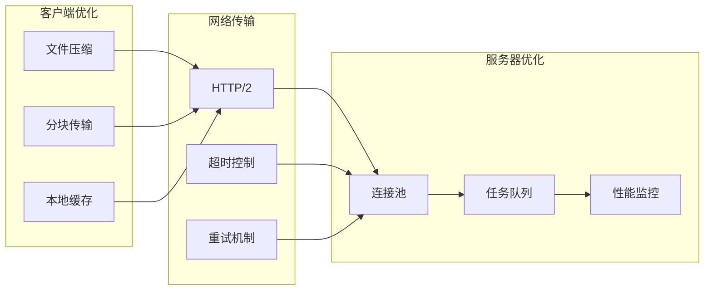

### 内存使用优化

| 优化策略 | 实现方式 | 效果 |
|----------|----------|------|
| **流式处理** | 使用asyncio异步处理 | 减少内存峰值 |
| **分块加载** | 大文件分块处理 | 控制内存使用 |
| **及时释放** | 完成后清理临时数据 | 避免内存泄漏 |
| **缓存策略** | Redis缓存常用数据 | 减少重复计算 |

### 并发处理优化

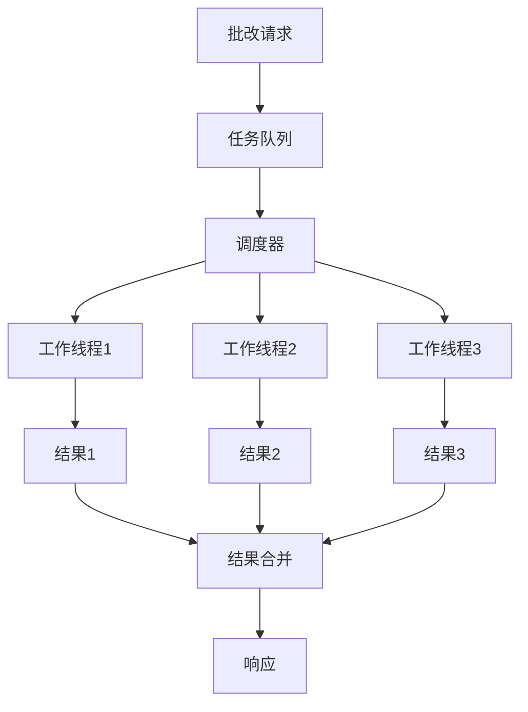

**章节来源**
- [langgraph_integration.py](file://ai_correction/functions/langgraph_integration.py#L55-L100)
- [workflow_multimodal.py](file://ai_correction/functions/langgraph/workflow_multimodal.py#L130-L200)

## 最佳实践

### 参数传递最佳实践

1. **参数验证**
   ```python
   # 前端参数验证示例
   def validate_parameters(question_files, answer_files):
       if not question_files or not answer_files:
           raise ValueError("题目文件和答案文件不能为空")
       
       for file_path in question_files + answer_files:
           if not os.path.exists(file_path):
               raise FileNotFoundError(f"文件不存在: {file_path}")
   ```

2. **错误提示设计**
   - 使用明确的错误消息
   - 提供解决建议
   - 记录详细错误日志

3. **用户体验优化**
   - 实时进度反馈
   - 文件格式提示
   - 批量操作支持

### 任务管理最佳实践

1. **任务生命周期管理**
   - 明确的任务状态转换
   - 自动清理过期任务
   - 断点续传支持

2. **资源管理**
   - 文件上传限制
   - 内存使用监控
   - 并发数量控制

3. **监控与日志**
   - 详细的执行日志
   - 性能指标收集
   - 错误率统计

### 安全考虑

1. **文件安全**
   - 文件类型验证
   - 大小限制
   - 恶意文件检测

2. **参数安全**
   - SQL注入防护
   - XSS攻击防范
   - 敏感信息过滤

3. **访问控制**
   - 用户身份验证
   - 权限检查
   - 操作审计

**章节来源**
- [main.py](file://ai_correction/main.py#L538-L570)
- [langgraph_integration.py](file://ai_correction/functions/langgraph_integration.py#L55-L100)
- [workflow_multimodal.py](file://ai_correction/functions/langgraph/workflow_multimodal.py#L130-L200)