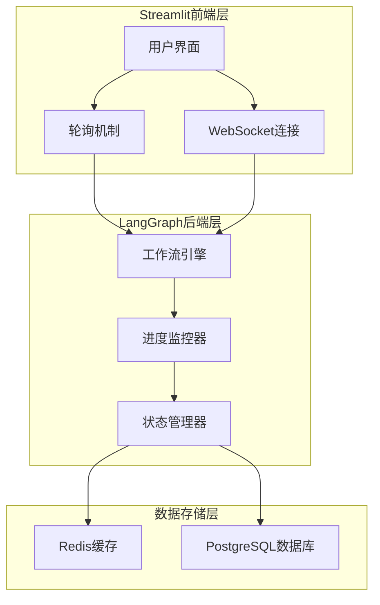
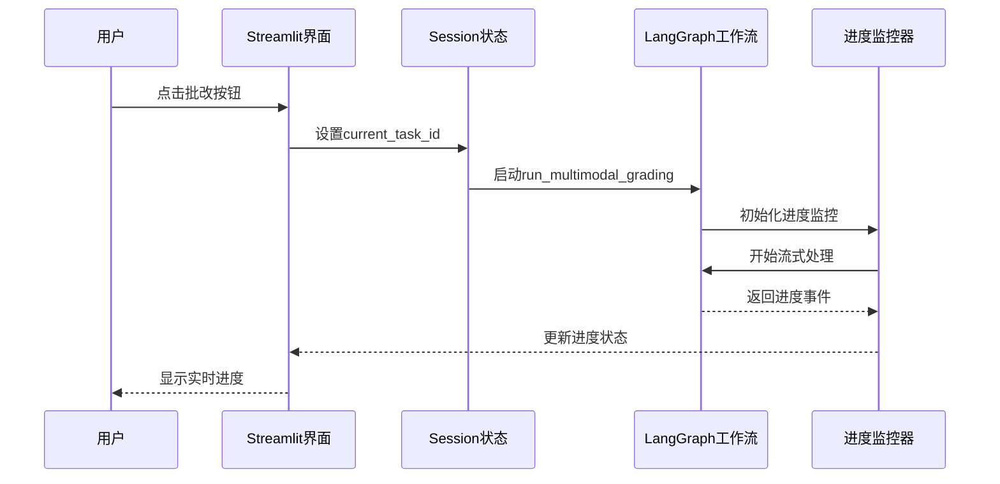
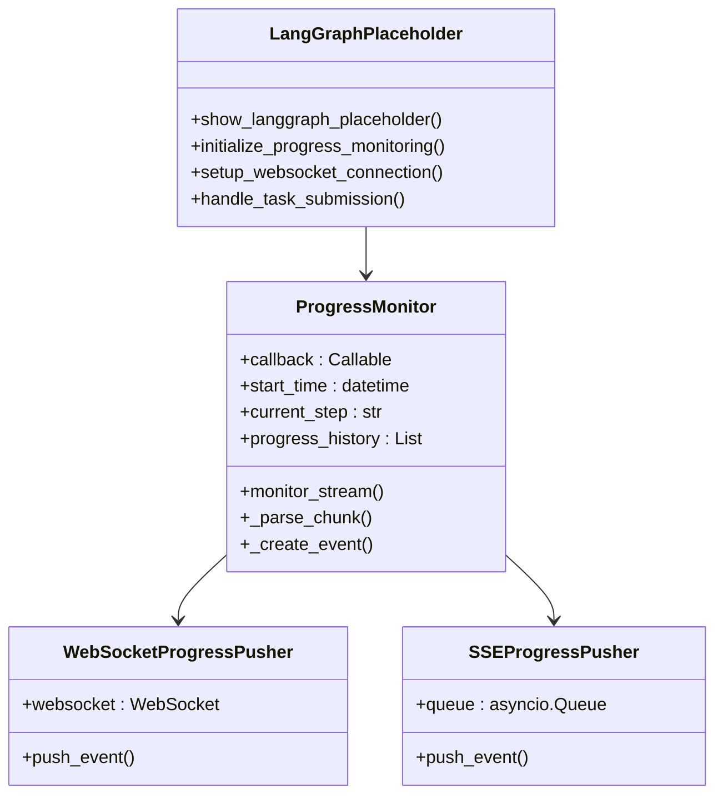
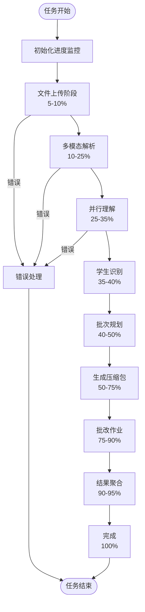
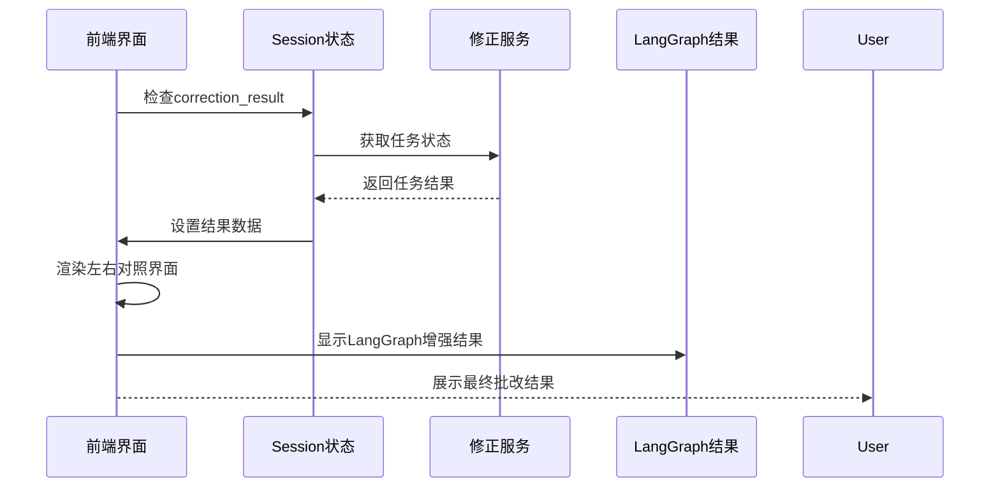
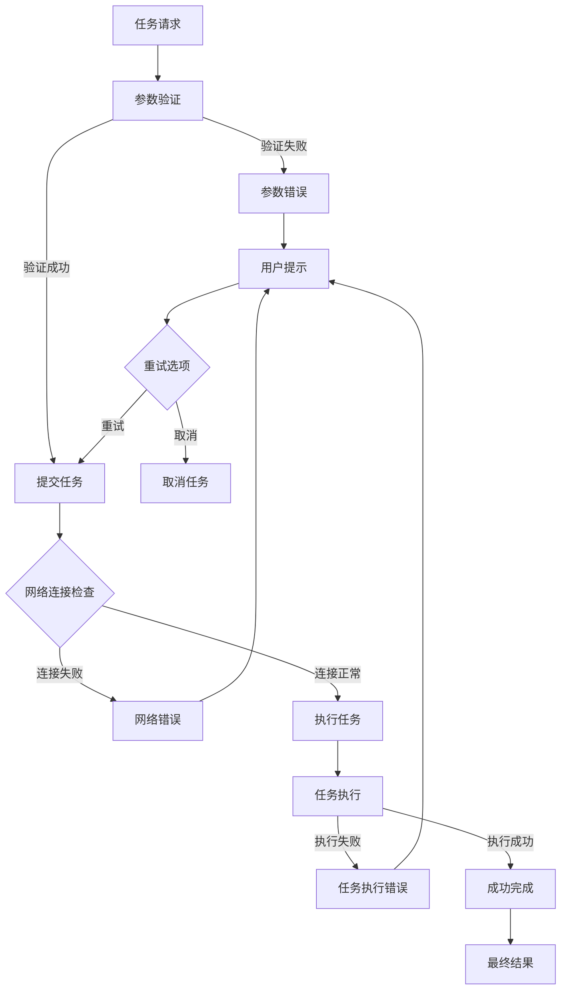
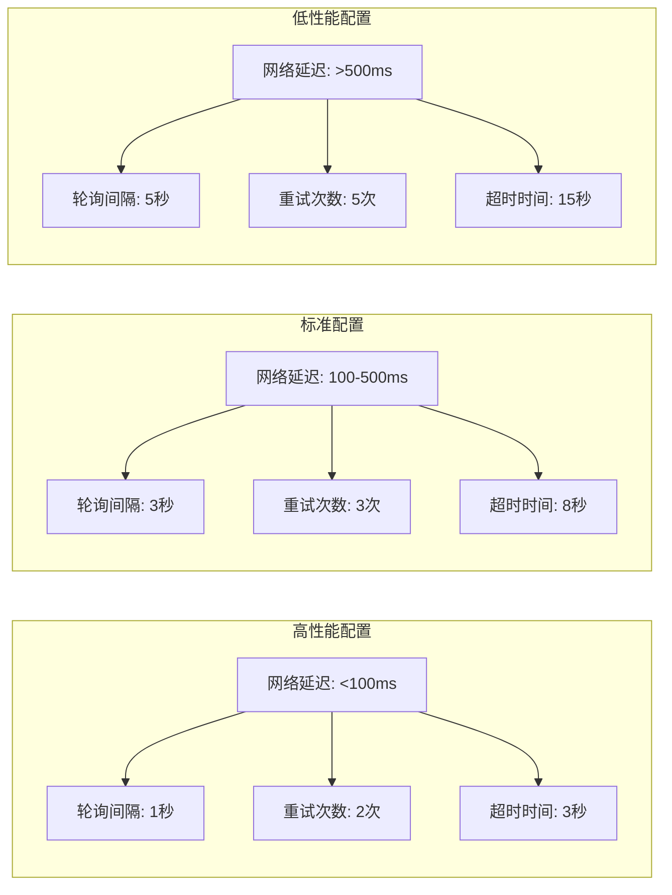

# 异步任务触发机制详细文档

<cite>
**本文档中引用的文件**
- [main.py](file://ai_correction/main.py)
- [workflow_multimodal.py](file://ai_correction/functions/langgraph/workflow_multimodal.py)
- [streaming.py](file://ai_correction/functions/langgraph/streaming.py)
- [progress_ui.py](file://ai_correction/functions/progress_ui.py)
- [state.py](file://ai_correction/functions/langgraph/state.py)
- [workflow.py](file://ai_correction/functions/langgraph/workflow.py)
- [correction_service.py](file://ai_correction/functions/database/db_manager.py)
- [langgraph_integration.py](file://ai_correction/functions/langgraph/langgraph_integration.py)
</cite>

## 目录
1. [概述](#概述)
2. [系统架构](#系统架构)
3. [任务触发机制](#任务触发机制)
4. [前端与后端协同](#前端与后端协同)
5. [进度监控与轮询](#进度监控与轮询)
6. [结果获取与展示](#结果获取与展示)
7. [错误处理机制](#错误处理机制)
8. [性能优化建议](#性能优化建议)
9. [最佳实践](#最佳实践)

## 概述

该系统实现了完整的异步任务触发机制，通过Streamlit前端与LangGraph后端工作流的深度集成，为用户提供流畅的AI智能批改体验。系统采用事件驱动架构，支持实时进度监控、任务状态跟踪和结果展示。

### 核心特性

- **异步任务执行**：基于LangGraph的工作流引擎实现异步批改处理
- **实时进度监控**：支持轮询和WebSocket两种进度更新机制
- **多模态协作**：8个Agent深度协作的多模态批改架构
- **灵活的状态管理**：完整的任务生命周期管理
- **健壮的错误处理**：多层次的异常捕获和用户提示机制

## 系统架构

**图表来源**
- [main.py](file://ai_correction/main.py#L597-L636)
- [workflow_multimodal.py](file://ai_correction/functions/langgraph/workflow_multimodal.py#L268-L372)
- [streaming.py](file://ai_correction/functions/langgraph/streaming.py#L28-L73)

## 任务触发机制

### show_grading函数中的任务启动

系统通过`show_grading`函数启动异步批改任务，该函数负责初始化批改流程并设置必要的上下文。

**图表来源**
- [main.py](file://ai_correction/main.py#L597-L636)
- [workflow_multimodal.py](file://ai_correction/functions/langgraph/workflow_multimodal.py#L268-L372)

### run_multimodal_grading异步函数

该函数是异步任务的核心入口，负责创建工作流实例并执行批改任务。

#### 参数传递机制

| 参数名称 | 类型 | 描述 | 必需 |
|---------|------|------|------|
| task_id | str | 唯一任务标识符 | 是 |
| user_id | str | 用户标识符 | 是 |
| question_files | list | 题目文件路径列表 | 是 |
| answer_files | list | 答案文件路径列表 | 是 |
| marking_files | list | 评分标准文件路径列表 | 是 |
| strictness_level | str | 严格程度：宽松/中等/严格 | 否 |
| language | str | 语言：zh/en | 否 |

#### 任务ID生成与存储

任务ID通过以下方式生成和存储：

1. **ID生成策略**：使用时间戳和随机字符串组合生成唯一ID
2. **Session存储**：通过`st.session_state.current_task_id`持久化存储
3. **状态关联**：与LangGraph的checkpoint系统关联

**章节来源**
- [main.py](file://ai_correction/main.py#L597-L636)
- [workflow_multimodal.py](file://ai_correction/functions/langgraph/workflow_multimodal.py#L268-L372)

## 前端与后端协同

### LangGraph占位符集成

系统使用`show_langgraph_placeholder`函数作为前端与后端的桥梁，提供占位界面并建立通信通道。

**图表来源**
- [main.py](file://ai_correction/main.py#L597-L636)
- [streaming.py](file://ai_correction/functions/langgraph/streaming.py#L28-L73)

### 通信机制

系统支持多种通信机制以适应不同的使用场景：

1. **WebSocket实时推送**：适用于需要即时反馈的场景
2. **SSE(Server-Sent Events)**：轻量级的服务器推送
3. **轮询机制**：适用于网络条件受限的环境

**章节来源**
- [streaming.py](file://ai_correction/functions/langgraph/streaming.py#L206-L267)
- [streaming.py](file://ai_correction/functions/langgraph/streaming.py#L270-L324)

## 进度监控与轮询

### AGENT_STAGES常量说明

系统定义了完整的Agent协作阶段，用于指导进度条的更新逻辑：

| 阶段名称 | 进度百分比 | 描述 |
|---------|-----------|------|
| 编排协调 | 5% | 任务初始化和资源分配 |
| 多模态输入 | 10% | 文件解析和预处理 |
| 并行理解 | 25% | 题目、答案、评分标准并行理解 |
| 学生识别 | 35% | 学生信息提取和验证 |
| 批次规划 | 40% | 批次划分和任务分配 |
| 生成压缩包 | 50% | 评分包和上下文数据生成 |
| 批改作业 | 75% | 智能批改执行 |
| 结果聚合 | 90% | 批改结果汇总和整理 |
| 完成 | 100% | 最终结果输出 |

### 进度条更新逻辑

**图表来源**
- [main.py](file://ai_correction/main.py#L73-L83)
- [progress_ui.py](file://ai_correction/functions/progress_ui.py#L52-L88)

### 轮询机制实现

系统提供两种进度监控方式：

1. **主动轮询**：前端定期向后端查询任务状态
2. **被动推送**：后端主动推送进度更新

#### 轮询配置建议

| 网络环境 | 轮询间隔 | 重试次数 | 超时时间 |
|---------|----------|----------|----------|
| 高速网络 | 1-2秒 | 3次 | 5秒 |
| 中等网络 | 3-5秒 | 5次 | 10秒 |
| 移动网络 | 5-10秒 | 3次 | 15秒 |

**章节来源**
- [progress_ui.py](file://ai_correction/functions/progress_ui.py#L147-L181)
- [workflow.py](file://ai_correction/functions/langgraph/workflow.py#L466-L499)

## 结果获取与展示

### show_result函数实现

`show_result`函数负责获取和展示异步任务的最终结果，提供左右对照的批改结果界面。

**图表来源**
- [main.py](file://ai_correction/main.py#L640-L902)

### 结果数据结构

系统返回的批改结果包含以下关键信息：

| 字段名称 | 类型 | 描述 |
|---------|------|------|
| task_id | str | 任务唯一标识 |
| status | str | 任务执行状态 |
| total_score | float | 总得分 |
| grade_level | str | 等级评定 |
| detailed_feedback | List | 详细反馈列表 |
| criteria_evaluations | List | 评分标准评估结果 |
| errors | List | 错误信息列表 |
| warnings | List | 警告信息列表 |

### 展示格式优化

系统提供多种结果展示格式：

1. **文本对照**：左右分栏显示原始文件和批改结果
2. **坐标标注**：在图片上显示错误位置和提示
3. **知识点分析**：展示学生知识掌握情况
4. **学习建议**：基于错误分析给出个性化建议

**章节来源**
- [main.py](file://ai_correction/main.py#L640-L902)
- [state.py](file://ai_correction/functions/langgraph/state.py#L40-L268)

## 错误处理机制

### 多层次错误处理

系统实现了完整的错误处理机制，确保在网络中断或后端服务不可用时提供良好的用户体验。

**图表来源**
- [workflow.py](file://ai_correction/functions/langgraph/workflow.py#L466-L499)
- [streaming.py](file://ai_correction/functions/langgraph/streaming.py#L73-L110)

### 用户提示策略

#### 网络中断处理

当检测到网络中断时，系统提供以下用户提示：

1. **即时通知**：显示网络连接状态
2. **自动重试**：在后台尝试重新连接
3. **离线模式**：允许用户继续使用基本功能
4. **恢复提醒**：网络恢复时通知用户

#### 后端服务不可用

当后端服务不可用时，系统采用以下策略：

1. **降级服务**：使用本地缓存或模拟数据
2. **排队机制**：将任务加入本地队列
3. **状态同步**：定期检查服务状态
4. **错误报告**：提供详细的错误信息和解决建议

### 错误恢复机制

| 错误类型 | 恢复策略 | 重试次数 | 等待时间 |
|---------|----------|----------|----------|
| 网络超时 | 重连重试 | 3次 | 2秒递增 |
| 服务不可用 | 本地缓存 | 5次 | 5秒递增 |
| 参数错误 | 参数修正 | 1次 | 立即 |
| 权限不足 | 权限检查 | 2次 | 3秒 |

**章节来源**
- [workflow.py](file://ai_correction/functions/langgraph/workflow.py#L466-L499)
- [streaming.py](file://ai_correction/functions/langgraph/streaming.py#L73-L110)

## 性能优化建议

### 轮询间隔优化策略

合理的轮询间隔能够在响应速度和服务器负载之间取得平衡：

#### 高效轮询配置

**图表来源**
- [progress_ui.py](file://ai_correction/functions/progress_ui.py#L147-L181)

#### 优化建议

1. **动态调整间隔**：根据网络质量动态调整轮询间隔
2. **指数退避算法**：重试失败时采用指数退避策略
3. **智能预测**：基于历史数据预测任务完成时间
4. **优先级调度**：高优先级任务使用更短的轮询间隔

### 服务器负载平衡

#### 资源分配策略

| 负载类型 | 分配比例 | 优化措施 |
|---------|----------|----------|
| CPU密集型任务 | 40% | 限制并发数量 |
| 内存密集型任务 | 30% | 增加内存缓存 |
| I/O密集型任务 | 20% | 使用异步I/O |
| 网络密集型任务 | 10% | 优化网络配置 |

### 缓存策略优化

1. **多级缓存**：内存缓存 + Redis缓存 + 数据库存储
2. **智能过期**：基于访问频率的动态过期策略
3. **预取机制**：预测用户需求提前加载数据
4. **压缩存储**：对大型结果进行压缩存储

**章节来源**
- [progress_ui.py](file://ai_correction/functions/progress_ui.py#L147-L181)
- [correction_service.py](file://ai_correction/functions/database/db_manager.py#L309-L330)

## 最佳实践

### 开发最佳实践

1. **异步编程规范**
   - 使用async/await模式处理异步操作
   - 正确处理异常和资源清理
   - 避免阻塞主线程的操作

2. **状态管理**
   - 使用Session状态持久化关键数据
   - 实现状态的原子性更新
   - 提供状态回滚机制

3. **错误处理**
   - 实现分层错误处理机制
   - 提供用户友好的错误信息
   - 记录详细的错误日志

### 运维最佳实践

1. **监控和告警**
   - 监控任务执行时间和成功率
   - 设置关键指标的告警阈值
   - 实现自动化故障恢复

2. **性能调优**
   - 定期分析系统性能瓶颈
   - 优化数据库查询和缓存策略
   - 调整并发处理参数

3. **安全考虑**
   - 实现任务隔离和权限控制
   - 加密敏感数据传输
   - 定期更新安全补丁

### 用户体验优化

1. **响应式设计**
   - 支持移动端和桌面端
   - 适配不同屏幕尺寸
   - 优化触摸交互体验

2. **进度反馈**
   - 提供清晰的进度指示
   - 显示预计完成时间
   - 支持任务取消和暂停

3. **帮助和支持**
   - 提供详细的使用指南
   - 实现在线客服功能
   - 建立用户反馈渠道

通过遵循这些最佳实践，可以确保异步任务触发机制的稳定性、性能和用户体验达到最优水平。