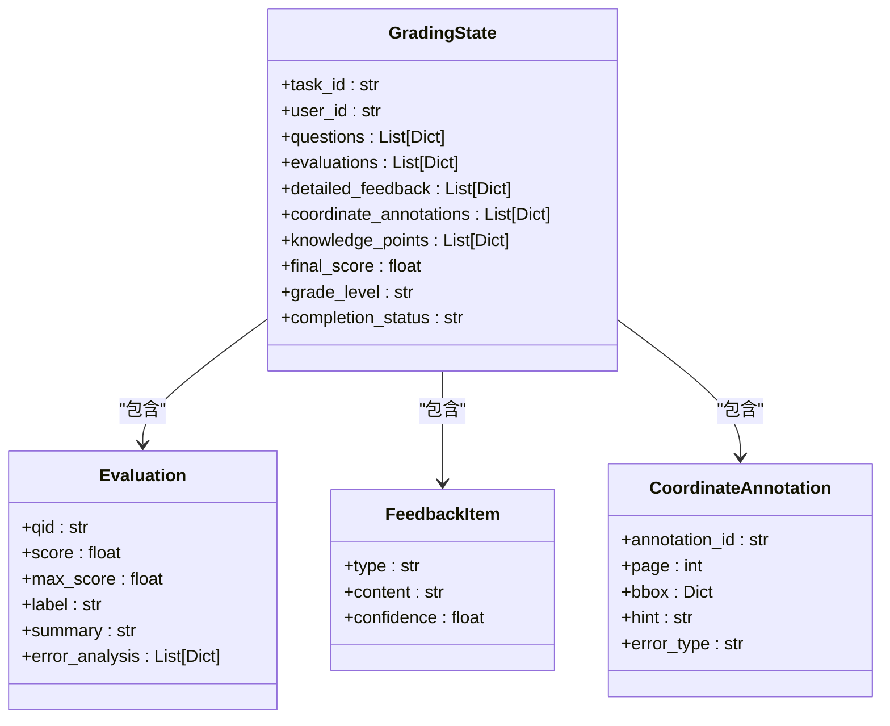
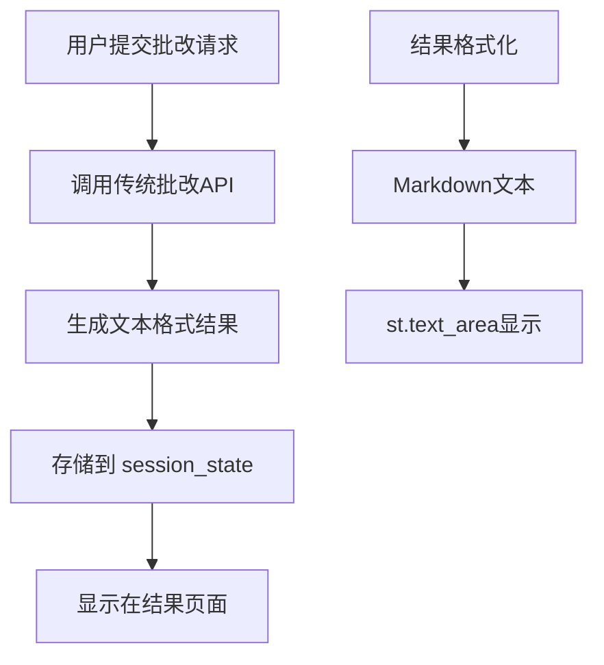
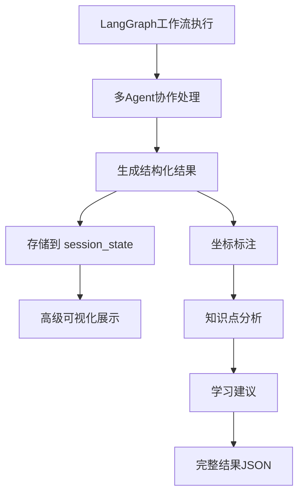
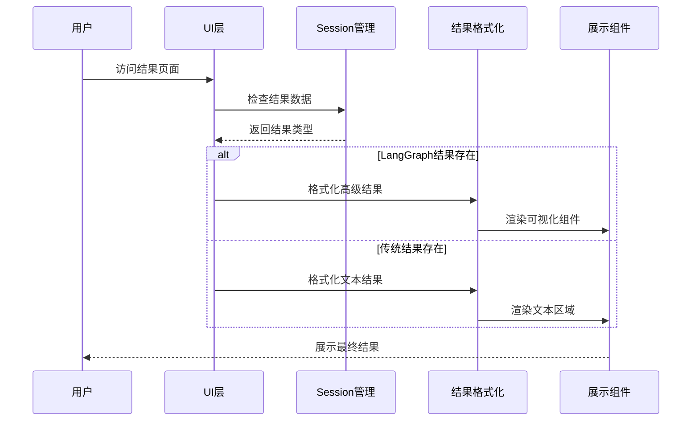
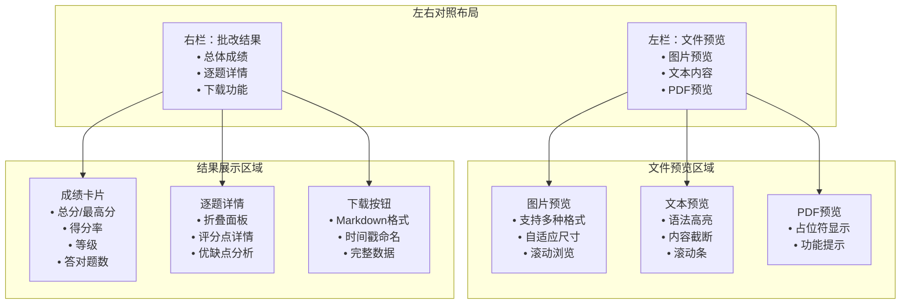
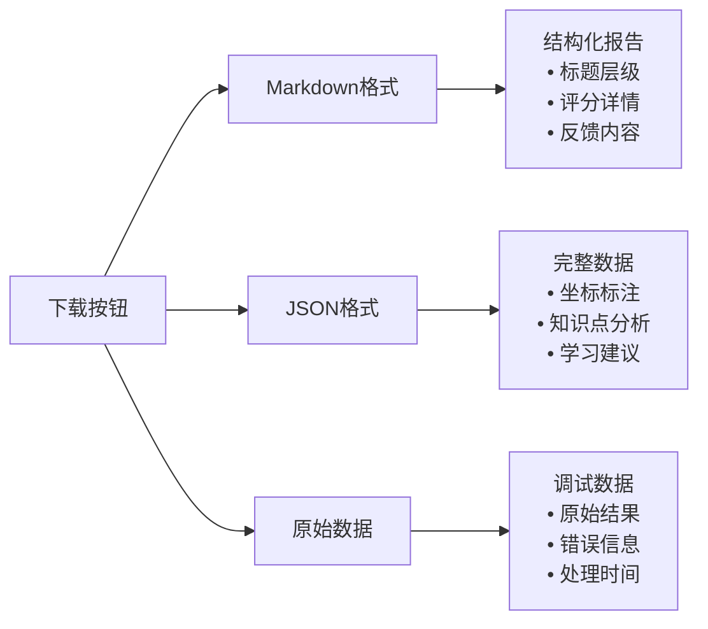
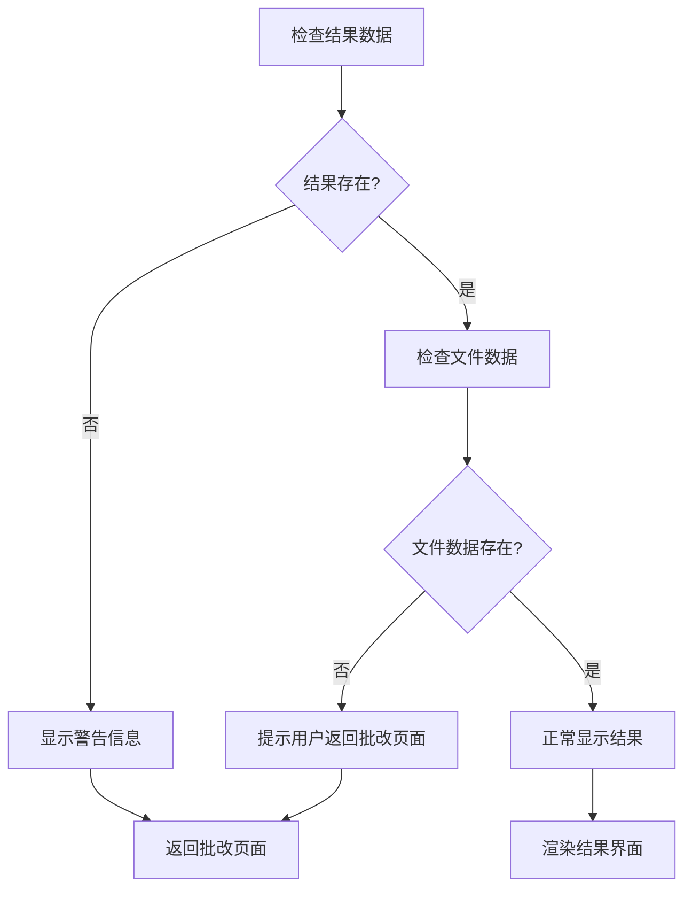
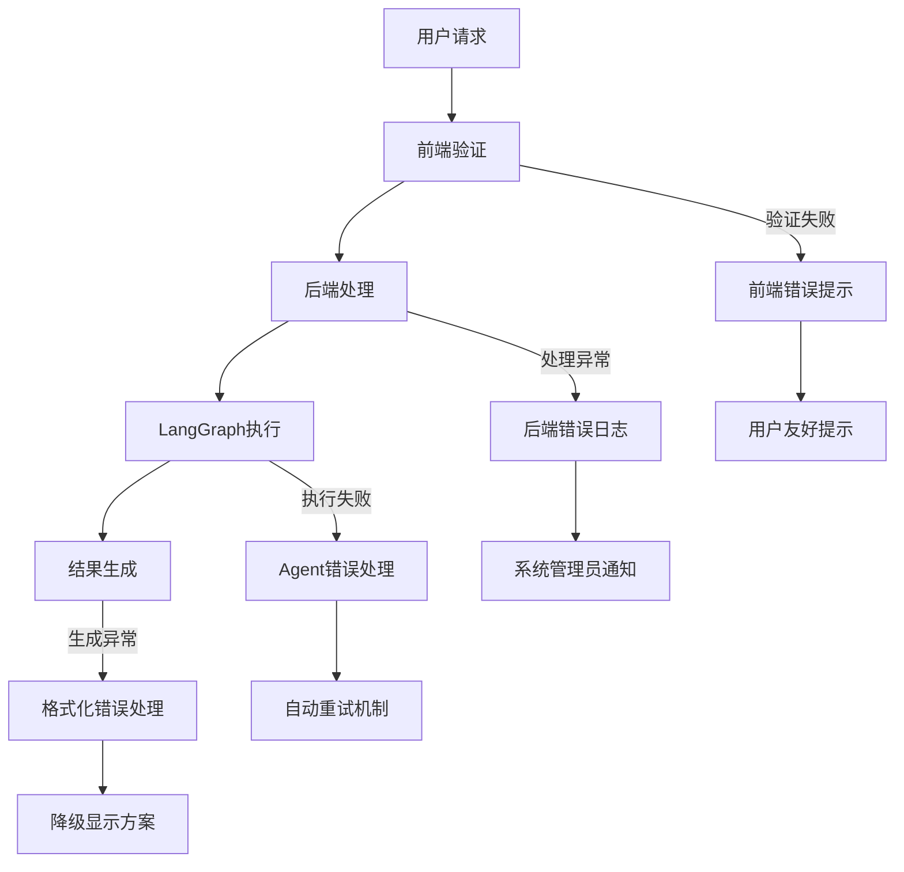
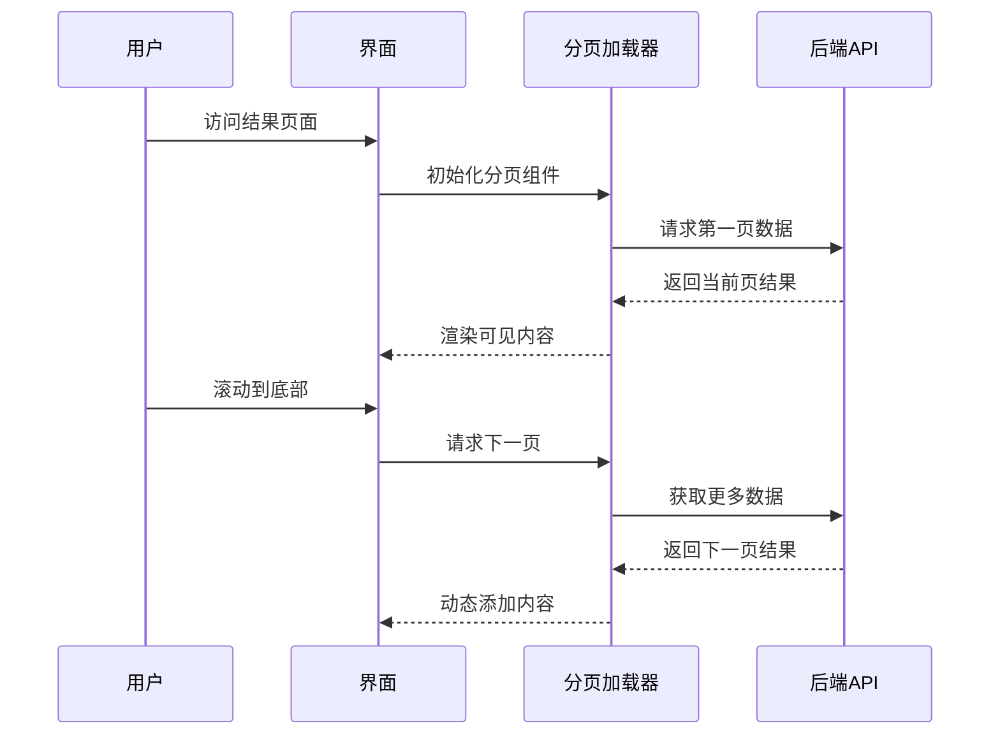
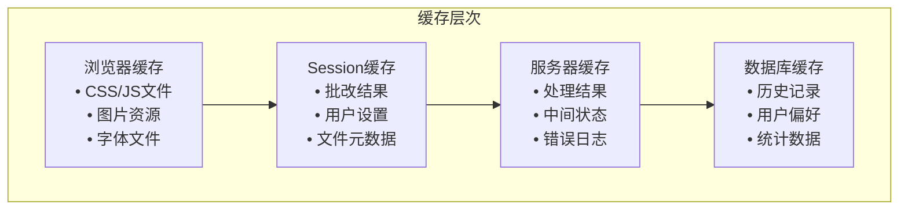

# 结果获取与展示机制详细文档

<cite>
**本文档引用的文件**
- [main.py](file://ai_correction/main.py)
- [langgraph_integration.py](file://ai_correction/functions/langgraph_integration.py)
- [result_formatter.py](file://ai_correction/functions/langgraph/result_formatter.py)
- [state.py](file://ai_correction/functions/langgraph/state.py)
- [workflow_multimodal.py](file://ai_correction/functions/langgraph/workflow_multimodal.py)
- [progress_ui.py](file://ai_correction/functions/progress_ui.py)
- [UI_OPTIMIZATION_SUMMARY.md](file://ai_correction/docs/UI_OPTIMIZATION_SUMMARY.md)
</cite>

## 目录
1. [概述](#概述)
2. [核心数据结构](#核心数据结构)
3. [结果存储机制](#结果存储机制)
4. [show_result函数实现](#show_result函数实现)
5. [结果渲染与展示](#结果渲染与展示)
6. [错误处理策略](#错误处理策略)
7. [性能优化建议](#性能优化建议)
8. [最佳实践](#最佳实践)

## 概述

AI智能批改系统采用现代化的前后端分离架构，通过`show_result`函数实现结果的获取、处理和展示。系统支持两种主要的结果存储机制：传统的`st.session_state.correction_result`和先进的`st.session_state.langgraph_result`，分别对应不同的批改模式和数据结构。

## 核心数据结构

### 批改结果数据结构

系统的核心数据结构基于LangGraph的状态模型，支持多层次的批改结果组织：

**图表来源**
- [state.py](file://ai_correction/functions/langgraph/state.py#L30-L268)

### 结果字段详解

| 字段名 | 类型 | 描述 | 示例值 |
|--------|------|------|--------|
| `total_score` | float | 总得分 | 85.5 |
| `max_score` | float | 最高分 | 100.0 |
| `score_percentage` | float | 得分百分比 | 85.5 |
| `grade` | str | 等级 | "A" |
| `correct_count` | int | 答对题数 | 8 |
| `total_questions` | int | 总题数 | 10 |
| `detailed_feedback` | List[Dict] | 详细反馈列表 | [{"type": "general", "content": "..."}] |
| `coordinate_annotations` | List[Dict] | 坐标标注 | [{"page": 1, "bbox": {...}}] |
| `knowledge_points` | List[Dict] | 知识点分析 | [{"topic": "三角函数", "mastery_status": "good"}] |

**章节来源**
- [state.py](file://ai_correction/functions/langgraph/state.py#L30-L150)

## 结果存储机制

### st.session_state.correction_result

传统批改模式下的结果存储方式，主要用于简单的文本格式批改结果：

**图表来源**
- [main.py](file://ai_correction/main.py#L832-L865)

### st.session_state.langgraph_result

LangGraph架构下的高级结果存储机制，支持丰富的多媒体和结构化数据：

**图表来源**
- [langgraph_integration.py](file://ai_correction/functions/langgraph_integration.py#L341-L397)

### 两种机制的区别

| 特性 | traditional_result | langgraph_result |
|------|-------------------|------------------|
| 数据格式 | 纯文本Markdown | 结构化JSON对象 |
| 可视化能力 | 基础文本显示 | 丰富的多媒体展示 |
| 坐标标注 | 不支持 | 支持精确的图像标注 |
| 知识点分析 | 简单文本 | 深度的知识点挖掘 |
| 学习建议 | 基础建议 | 个性化学习路径 |
| 性能开销 | 低 | 中等（支持复杂分析） |

**章节来源**
- [langgraph_integration.py](file://ai_correction/functions/langgraph_integration.py#L100-L150)

## show_result函数实现

### 函数架构

`show_result`函数是结果展示的核心入口，负责协调不同结果类型的显示：

**图表来源**
- [main.py](file://ai_correction/main.py#L832-L865)

### 核心实现逻辑

函数的主要执行流程包括：

1. **身份验证检查**：确保用户已登录
2. **数据完整性验证**：检查结果和文件数据是否存在
3. **结果类型判断**：根据session_state中的标志确定使用哪种展示方式
4. **界面布局设计**：创建左右分栏的对比展示布局
5. **文件预览渲染**：显示原始文件内容
6. **结果展示渲染**：根据结果类型渲染相应的UI组件

**章节来源**
- [main.py](file://ai_correction/main.py#L832-L865)

## 结果渲染与展示

### 左右对照布局

系统采用经典的左右对照布局，提供最佳的用户体验：

**图表来源**
- [main.py](file://ai_correction/main.py#L866-L950)

### 成绩卡片设计

系统使用四个大型卡片展示关键指标，采用颜色编码和渐变背景：

| 指标 | 颜色编码 | 显示格式 | 视觉效果 |
|------|----------|----------|----------|
| 总分 | 蓝色 | `13/20 分` | 渐变背景，大字体 |
| 得分率 | 绿色/橙色/红色 | `85.5% 💪` | 根据分数动态调整 |
| 等级 | 彩虹色 | `A+/B-/C` | 直观的等级表示 |
| 答对题数 | 蓝色 | `8/10 题` | 清晰的对比显示 |

### 逐题详情展示

每道题目的详细信息使用折叠面板（expander）展示，支持：

- **评分状态标识**：✅/❌图标表示正确与否
- **评分点详情**：每个评分点的得分和分析
- **学生答案对比**：与标准答案的对比展示
- **优缺点分析**：结构化的优点和不足说明
- **改进建议**：具体的提升建议

**章节来源**
- [UI_OPTIMIZATION_SUMMARY.md](file://ai_correction/docs/UI_OPTIMIZATION_SUMMARY.md#L67-L121)

### 下载功能实现

系统提供多种格式的下载选项：

**图表来源**
- [main.py](file://ai_correction/main.py#L850-L865)

**章节来源**
- [main.py](file://ai_correction/main.py#L850-L865)

## 错误处理策略

### 空结果处理

系统实现了完善的空结果检测和用户提示机制：

**图表来源**
- [main.py](file://ai_correction/main.py#L832-L840)

### 格式错误处理

针对不同类型的格式错误，系统提供分级的错误处理策略：

| 错误类型 | 处理策略 | 用户提示 | 恢复方案 |
|----------|----------|----------|----------|
| 结果为空 | 显示警告，引导返回 | "没有批改结果数据" | 自动跳转到批改页面 |
| 文件不存在 | 显示替代信息 | "历史记录，原始文件可能已被清理" | 提供预览而非下载 |
| 数据格式错误 | 降级显示 | "结果格式异常，显示简化版本" | 使用基础展示组件 |
| 网络超时 | 显示加载状态 | "正在获取结果，请稍候..." | 提供重试机制 |

### 异常捕获机制

系统在多个层面实现了异常捕获：

**图表来源**
- [langgraph_integration.py](file://ai_correction/functions/langgraph_integration.py#L30-L80)

**章节来源**
- [main.py](file://ai_correction/main.py#L832-L840)
- [langgraph_integration.py](file://ai_correction/functions/langgraph_integration.py#L30-L80)

## 性能优化建议

### 大结果集的分页加载

对于包含大量题目的批改结果，建议实施分页加载策略：

### 懒加载策略

实现智能的懒加载机制，优化首屏加载速度：

| 组件类型 | 懒加载策略 | 触发时机 | 性能收益 |
|----------|------------|----------|----------|
| 文件预览 | 图片延迟加载 | 用户滚动到预览区域 | 减少初始内存占用 |
| 逐题详情 | 内容延迟渲染 | 用户展开折叠面板 | 提升页面响应速度 |
| 坐标标注 | 图像延迟加载 | 用户查看标注区域 | 降低网络传输压力 |
| 知识点分析 | 数据延迟获取 | 用户关注学习建议 | 减少不必要的计算 |

### 缓存机制

建立多层缓存体系提升用户体验：

### 内存管理

针对大型批改结果的内存优化：

- **虚拟化渲染**：只渲染可见区域的内容
- **数据压缩**：对大型JSON数据进行压缩存储
- **及时清理**：定期清理过期的session数据
- **增量更新**：只更新变化的部分UI组件

**章节来源**
- [progress_ui.py](file://ai_correction/functions/progress_ui.py#L147-L181)

## 最佳实践

### 用户体验优化

1. **渐进式披露**：从总体成绩开始，逐步展示详细信息
2. **视觉层次**：使用颜色、大小、间距建立清晰的视觉层次
3. **交互反馈**：为用户操作提供即时的视觉反馈
4. **无障碍设计**：确保结果内容可以通过屏幕阅读器访问

### 数据安全考虑

1. **敏感信息保护**：对学生的个人信息进行脱敏处理
2. **数据加密**：在传输和存储过程中加密敏感数据
3. **访问控制**：确保只有授权用户可以访问特定结果
4. **审计日志**：记录所有结果访问和修改操作

### 可维护性设计

1. **模块化架构**：将结果处理逻辑分解为独立的模块
2. **配置驱动**：通过配置文件控制展示行为
3. **单元测试**：为结果处理逻辑编写全面的测试用例
4. **文档同步**：保持代码注释和文档的一致性

### 扩展性规划

1. **插件架构**：支持自定义结果展示组件
2. **API标准化**：提供统一的结果数据接口
3. **多语言支持**：为国际化做好准备
4. **移动端适配**：确保在移动设备上的良好体验

**章节来源**
- [UI_OPTIMIZATION_SUMMARY.md](file://ai_correction/docs/UI_OPTIMIZATION_SUMMARY.md#L198-L296)