# 进度监控与状态同步机制详细文档

<cite>
**本文档引用的文件**
- [main.py](file://ai_correction/main.py)
- [progress_ui.py](file://ai_correction/functions/progress_ui.py)
- [correction_service.py](file://ai_correction/functions/correction_service.py)
- [state.py](file://ai_correction/functions/langgraph/state.py)
- [streaming.py](file://ai_correction/functions/langgraph/streaming.py)
- [workflow.py](file://ai_correction/functions/langgraph/workflow.py)
- [workflow_multimodal.py](file://ai_correction/functions/langgraph/workflow_multimodal.py)
- [routing.py](file://ai_correction/functions/langgraph/routing.py)
- [result_assembler.py](file://ai_correction/functions/langgraph/agents/result_assembler.py)
</cite>

## 目录
1. [概述](#概述)
2. [系统架构](#系统架构)
3. [AGENT_STAGES常量详解](#agent_stages常量详解)
4. [进度状态管理](#进度状态管理)
5. [前端轮询机制](#前端轮询机制)
6. [流式状态推送](#流式状态推送)
7. [错误处理与重试机制](#错误处理与重试机制)
8. [性能优化策略](#性能优化策略)
9. [WebSocket替代方案](#websocket替代方案)
10. [故障排除指南](#故障排除指南)

## 概述

AI批改系统采用多层次的状态同步机制，结合轮询和流式推送技术，为用户提供实时的进度监控体验。系统通过`AGENT_STAGES`常量建立工作流节点与进度条的映射关系，实现了精确的进度计算和状态同步。

## 系统架构

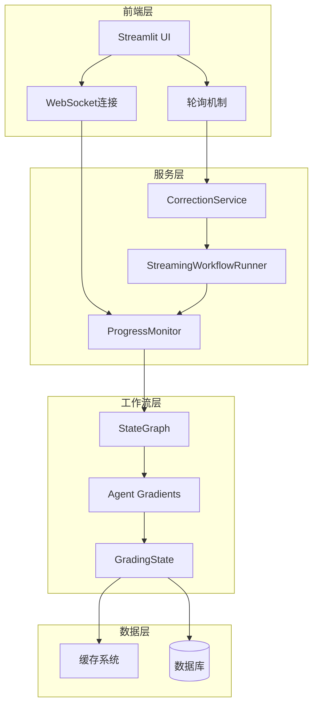

**图表来源**
- [progress_ui.py](file://ai_correction/functions/progress_ui.py#L1-L50)
- [correction_service.py](file://ai_correction/functions/correction_service.py#L1-L50)
- [streaming.py](file://ai_correction/functions/langgraph/streaming.py#L1-L50)

## AGENT_STAGES常量详解

`AGENT_STAGES`常量是进度条映射的核心配置，定义了AI批改系统中各个Agent阶段的名称和对应的进度百分比。

### 常量结构

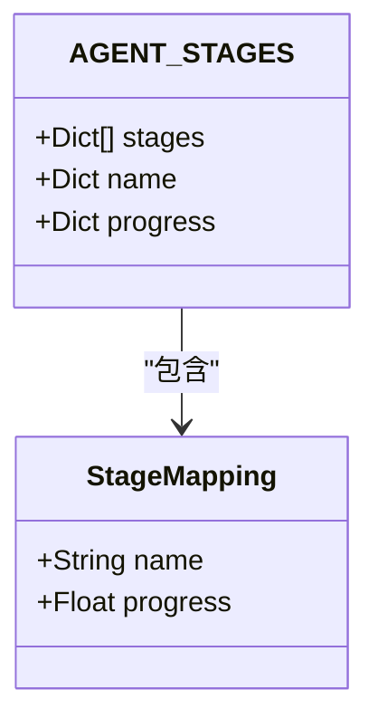

**图表来源**
- [main.py](file://ai_correction/main.py#L73-L83)

### 阶段映射关系

| 阶段名称 | 进度百分比 | 描述 |
|---------|-----------|------|
| 编排协调 | 5% | 工作流初始化和路由决策 |
| 多模态输入 | 10% | 文件解析和多模态数据提取 |
| 并行理解 | 25% | 题目、答案、评分标准的并行理解 |
| 学生识别 | 35% | 学生信息和批次规划 |
| 批次规划 | 40% | 作业批次划分和并行处理 |
| 生成压缩包 | 50% | 批次专属评分包生成 |
| 批改作业 | 75% | AI智能批改执行 |
| 结果聚合 | 90% | 批改结果汇总和优化 |
| 完成 | 100% | 整个工作流完成 |

**章节来源**
- [main.py](file://ai_correction/main.py#L73-L83)

### 进度计算逻辑

系统通过以下方式将工作流节点映射到进度条：

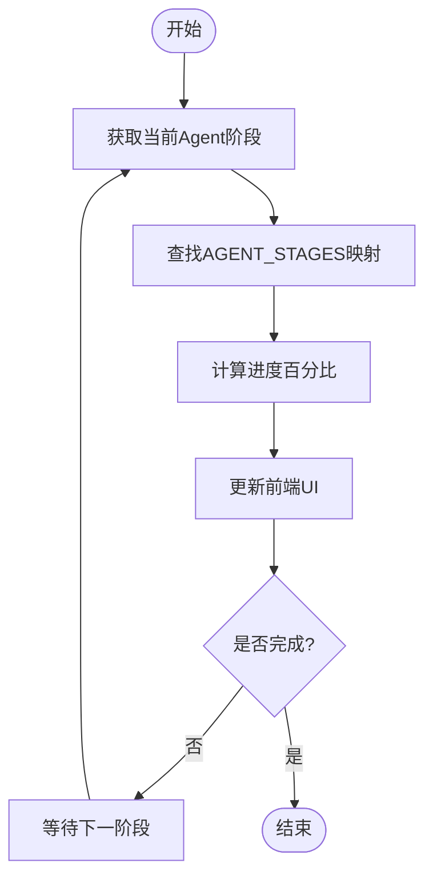

**图表来源**
- [workflow_multimodal.py](file://ai_correction/functions/langgraph/workflow_multimodal.py#L159-L187)
- [streaming.py](file://ai_correction/functions/langgraph/streaming.py#L106-L147)

## 进度状态管理

### GradingState核心字段

`GradingState`是进度状态管理的核心数据结构，包含以下关键字段：

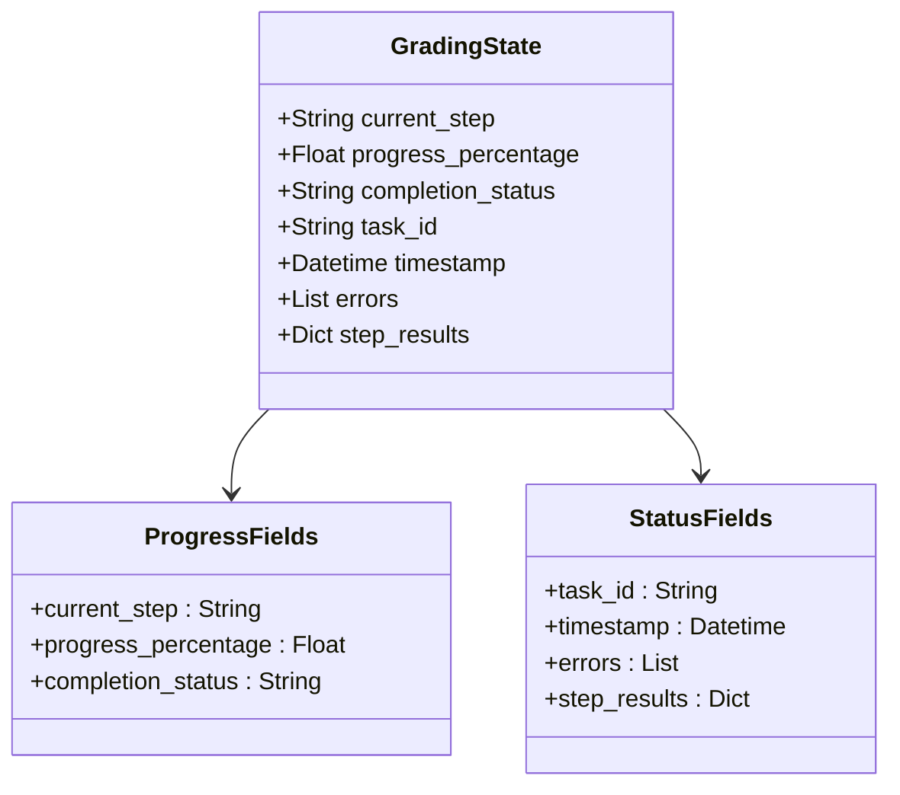

**图表来源**
- [state.py](file://ai_correction/functions/langgraph/state.py#L50-L100)

### 状态更新流程

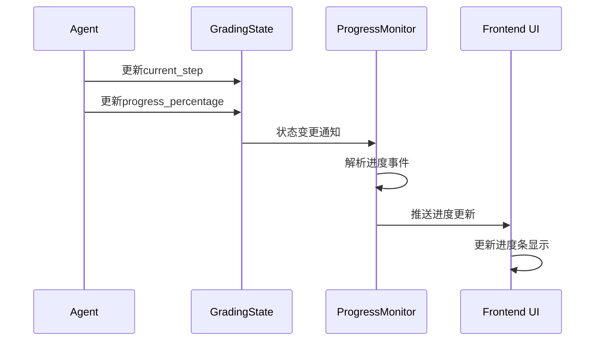

**图表来源**
- [streaming.py](file://ai_correction/functions/langgraph/streaming.py#L106-L147)
- [workflow.py](file://ai_correction/functions/langgraph/workflow.py#L466-L499)

**章节来源**
- [state.py](file://ai_correction/functions/langgraph/state.py#L50-L150)
- [streaming.py](file://ai_correction/functions/langgraph/streaming.py#L106-L147)

## 前端轮询机制

### 轮询实现策略

前端采用基于时间间隔的轮询机制来获取最新的进度状态：

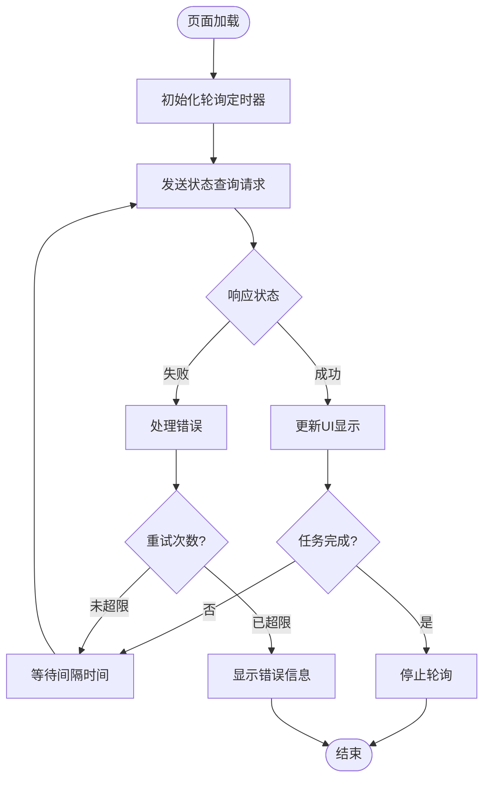

**图表来源**
- [progress_ui.py](file://ai_correction/functions/progress_ui.py#L150-L180)

### 轮询频率设置

系统采用动态轮询频率策略：

| 任务阶段 | 轮询间隔 | 说明 |
|---------|----------|------|
| 初始化 | 2秒 | 快速响应初始状态 |
| 处理中 | 5秒 | 平衡实时性和性能 |
| 接近完成 | 10秒 | 减少服务器负载 |
| 完成 | 停止轮询 | 避免不必要的请求 |

**章节来源**
- [progress_ui.py](file://ai_correction/functions/progress_ui.py#L150-L180)
- [correction_service.py](file://ai_correction/functions/correction_service.py#L109-L139)

### 防抖策略实现

为了避免频繁的状态查询，系统实现了防抖机制：

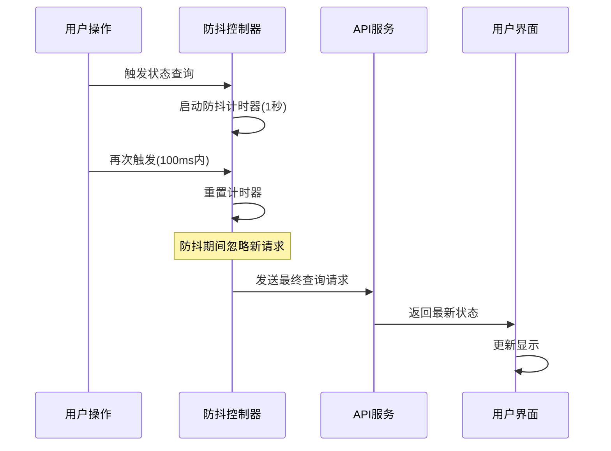

**图表来源**
- [correction_service.py](file://ai_correction/functions/correction_service.py#L80-L120)

## 流式状态推送

### ProgressMonitor核心功能

`ProgressMonitor`负责监听工作流的流式输出，解析进度信息并格式化为标准化的事件格式：

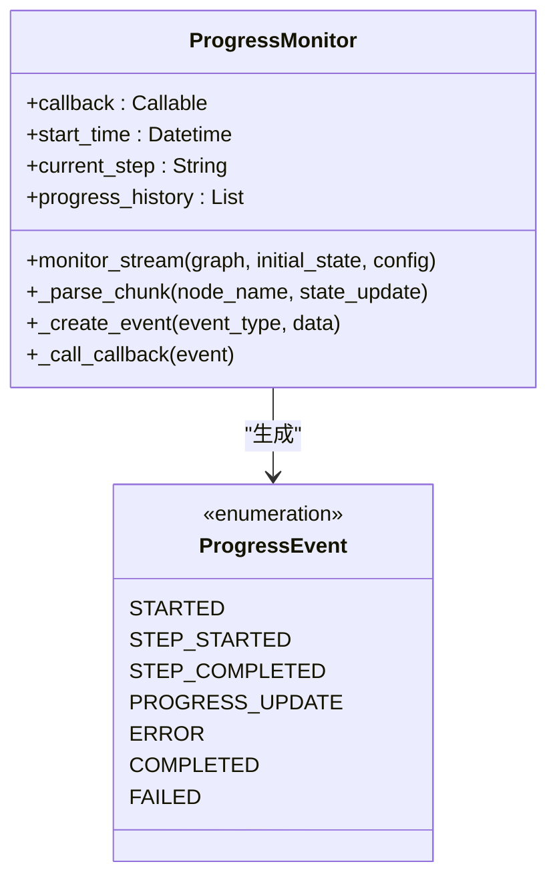

**图表来源**
- [streaming.py](file://ai_correction/functions/langgraph/streaming.py#L30-L80)

### 事件类型定义

系统定义了完整的进度事件类型体系：

| 事件类型 | 触发时机 | 数据内容 |
|---------|----------|----------|
| STARTED | 工作流开始 | task_id, start_time |
| STEP_STARTED | 新阶段开始 | step, node, timestamp |
| PROGRESS_UPDATE | 进度更新 | step, progress, timestamp |
| ERROR | 发生错误 | step, errors, timestamp |
| COMPLETED | 工作流完成 | end_time, duration_seconds |
| FAILED | 执行失败 | error, timestamp |

**章节来源**
- [streaming.py](file://ai_correction/functions/langgraph/streaming.py#L20-L30)
- [streaming.py](file://ai_correction/functions/langgraph/streaming.py#L106-L147)

### 流式事件处理流程

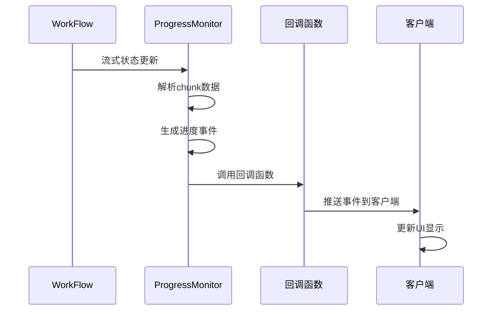

**图表来源**
- [streaming.py](file://ai_correction/functions/langgraph/streaming.py#L73-L110)

## 错误处理与重试机制

### 错误分类与处理策略

系统实现了多层次的错误处理机制：

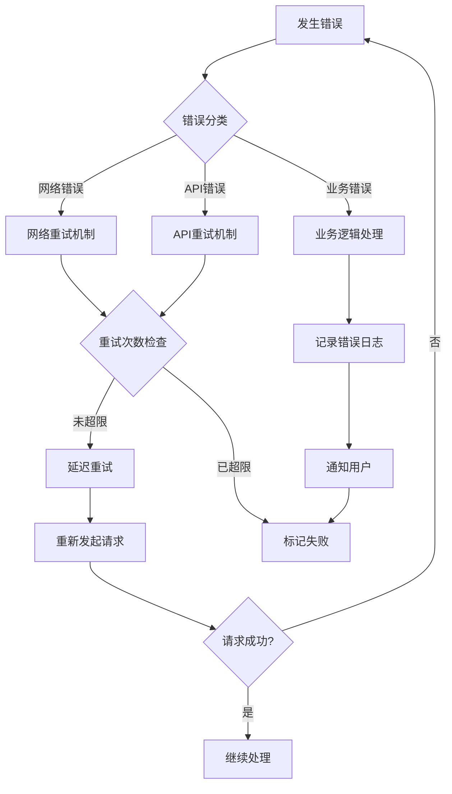

**图表来源**
- [routing.py](file://ai_correction/functions/langgraph/routing.py#L156-L191)

### 重试策略配置

| 错误类型 | 最大重试次数 | 重试间隔 | 退避策略 |
|---------|-------------|----------|----------|
| 网络超时 | 3次 | 2秒 | 指数退避 |
| API限流 | 5次 | 5秒 | 线性递增 |
| 关键步骤失败 | 2次 | 10秒 | 固定间隔 |
| 非关键错误 | 无限制 | 1秒 | 立即重试 |

**章节来源**
- [routing.py](file://ai_correction/functions/langgraph/routing.py#L156-L191)
- [correction_service.py](file://ai_correction/functions/correction_service.py#L180-L224)

### 超时处理机制

系统设置了多层级的超时保护：

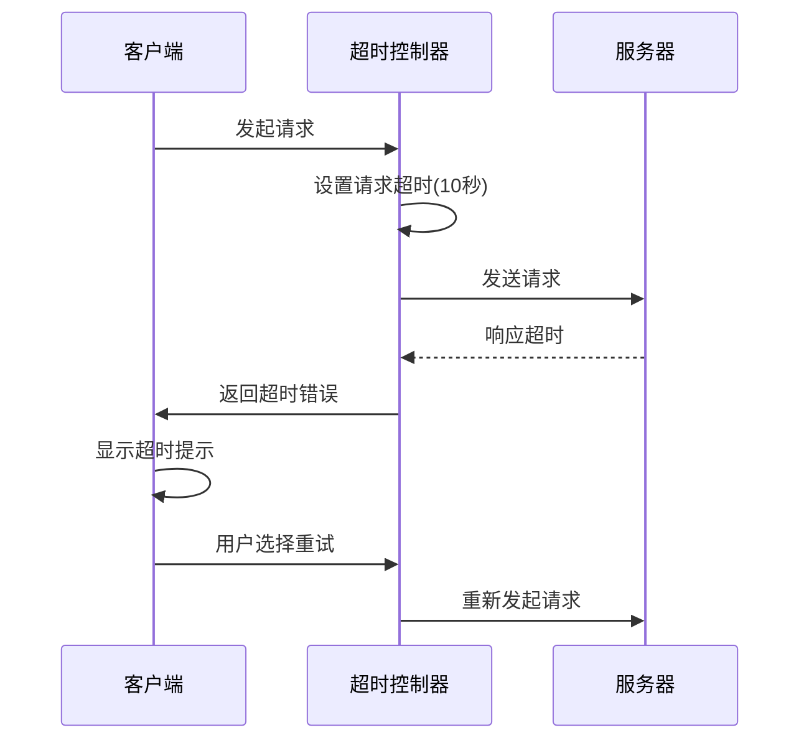

**图表来源**
- [correction_service.py](file://ai_correction/functions/correction_service.py#L180-L224)

## 性能优化策略

### 缓存机制

系统实现了多层缓存策略来提升性能：

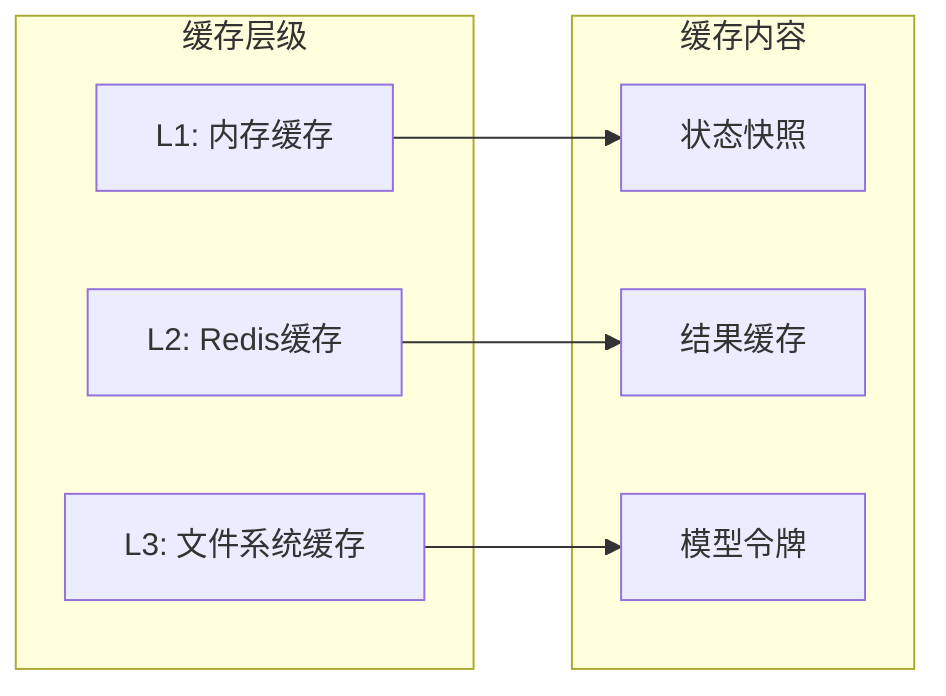

**图表来源**
- [workflow.py](file://ai_correction/functions/langgraph/workflow.py#L35-L50)

### Token优化策略

工作流采用了多种Token优化技术：

| 优化技术 | 应用场景 | 效果 |
|---------|----------|------|
| 状态压缩 | 评分Agent | 减少50%+ Token使用 |
| 并行处理 | 多Agent协作 | 提升30%+处理速度 |
| 缓存复用 | 重复计算 | 避免20%+重复处理 |
| 条件执行 | 动态路由 | 减少15%+无效步骤 |

**章节来源**
- [workflow.py](file://ai_correction/functions/langgraph/workflow.py#L150-L200)

### 连接池管理

系统实现了高效的连接池管理：

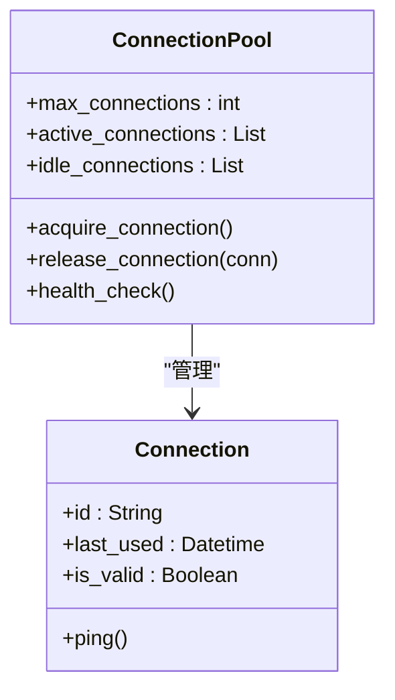

**图表来源**
- [correction_service.py](file://ai_correction/functions/correction_service.py#L60-L80)

## WebSocket替代方案

### WebSocket架构设计

WebSocket提供了实时双向通信能力，相比轮询机制具有显著优势：

```mermaid
graph TB
subgraph "客户端"
WSClient[WebSocket客户端]
EventLoop[事件循环]
UIUpdate[UI更新器]
end
subgraph "服务端"
WSServer[WebSocket服务器]
EventDispatcher[事件分发器]
StateManager[状态管理器]
end
subgraph "工作流"
Workflow[工作流引擎]
ProgressMonitor[进度监控器]
end
WSClient < --> WSServer
WSServer < --> EventDispatcher
EventDispatcher < --> StateManager
StateManager < --> ProgressMonitor
ProgressMonitor < --> Workflow
EventLoop --> UIUpdate
UIUpdate --> WSClient
```

**图表来源**
- [streaming.py](file://ai_correction/functions/langgraph/streaming.py#L270-L324)

### 实现对比分析

| 特性 | 轮询机制 | WebSocket |
|------|----------|-----------|
| 实时性 | 延迟2-10秒 | 即时推送 |
| 资源消耗 | 高频请求 | 低开销连接 |
| 复杂度 | 简单实现 | 复杂连接管理 |
| 可靠性 | 重试机制 | 连接恢复 |
| 扩展性 | 有限 | 无限 |

### WebSocket实现路径

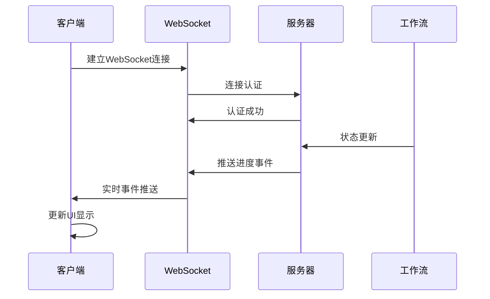

**图表来源**
- [streaming.py](file://ai_correction/functions/langgraph/streaming.py#L270-L324)

**章节来源**
- [streaming.py](file://ai_correction/functions/langgraph/streaming.py#L270-L336)

## 故障排除指南

### 常见问题诊断

| 问题症状 | 可能原因 | 解决方案 |
|---------|----------|----------|
| 进度条卡住不动 | 网络连接异常 | 检查网络状态，重启轮询 |
| 进度更新缓慢 | 服务器负载过高 | 启用WebSocket，调整轮询频率 |
| 状态显示错误 | 缓存数据不一致 | 清除缓存，重新获取状态 |
| WebSocket连接失败 | 服务器配置问题 | 检查防火墙设置，验证证书 |

### 监控指标

系统提供了完整的监控指标体系：

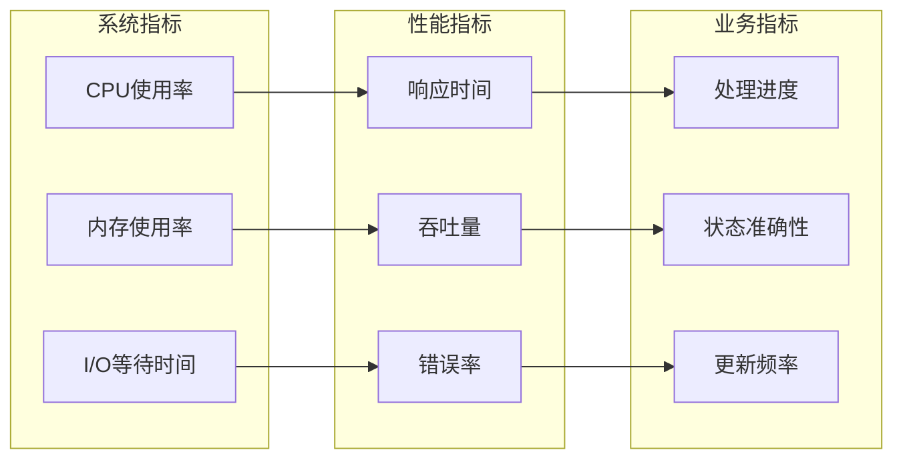

**图表来源**
- [correction_service.py](file://ai_correction/functions/correction_service.py#L180-L224)

### 日志分析

系统提供了详细的日志记录机制：

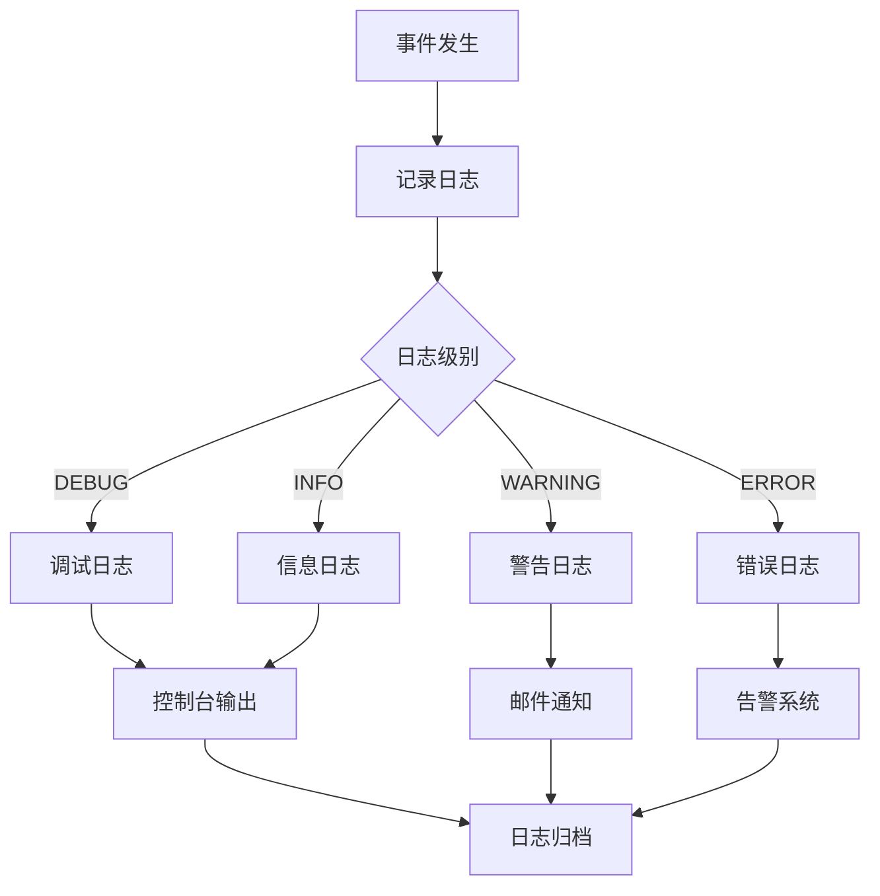

**图表来源**
- [streaming.py](file://ai_correction/functions/langgraph/streaming.py#L73-L110)

**章节来源**
- [correction_service.py](file://ai_correction/functions/correction_service.py#L180-L224)
- [streaming.py](file://ai_correction/functions/langgraph/streaming.py#L73-L110)

## 总结

AI批改系统的进度监控与状态同步机制采用了多层次、多技术栈的综合方案。通过`AGENT_STAGES`常量建立精确的进度映射，结合轮询和流式推送技术，为用户提供了实时、可靠的进度监控体验。系统具备完善的错误处理、性能优化和扩展能力，能够满足大规模生产环境的需求。

未来发展方向包括全面采用WebSocket替代传统轮询机制，进一步提升实时性和降低资源消耗，同时持续优化Token使用和缓存策略，确保系统的高性能和高可用性。