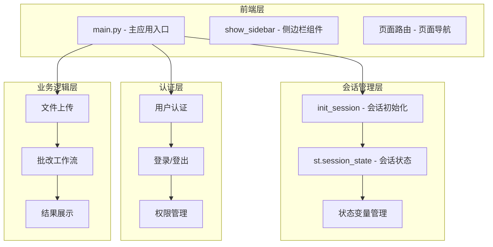
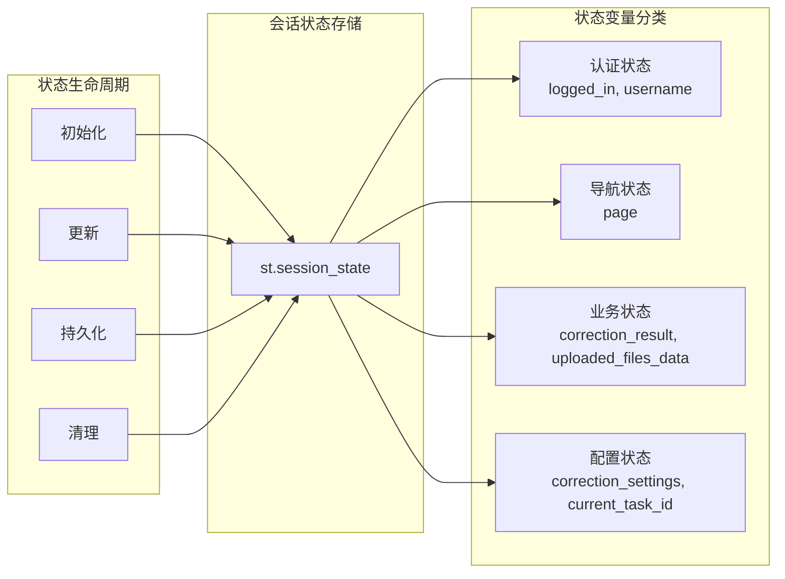
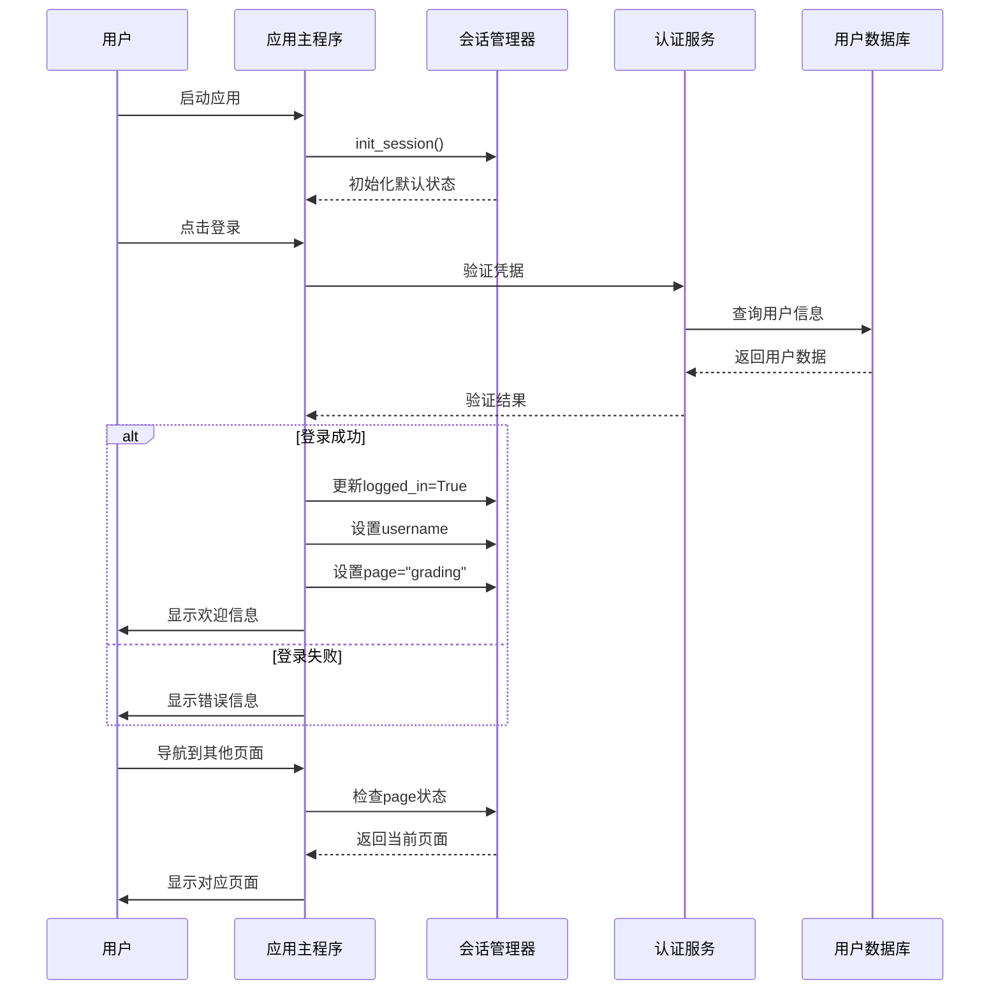
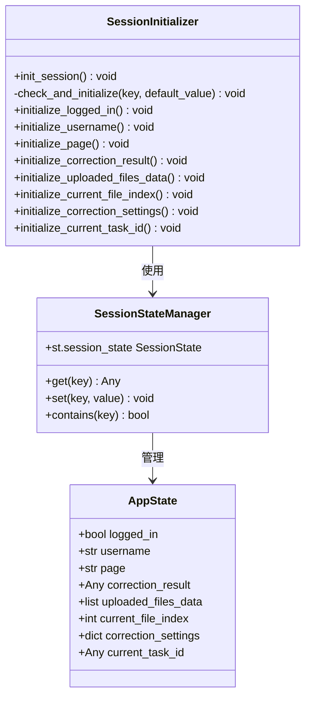
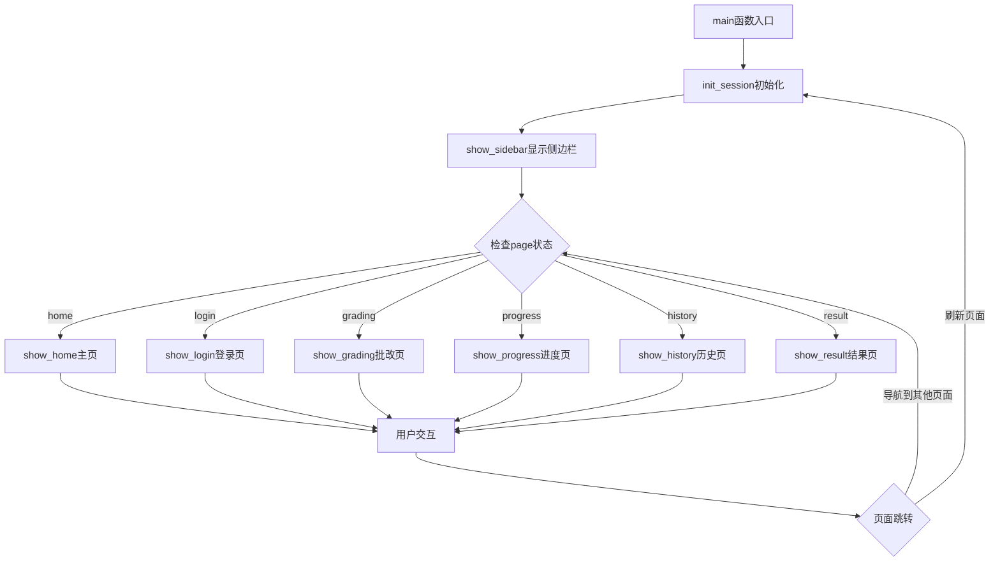
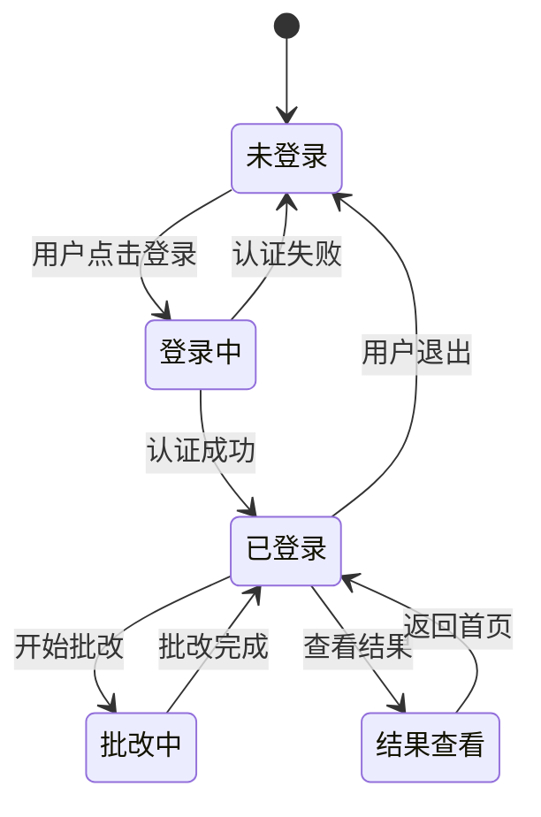
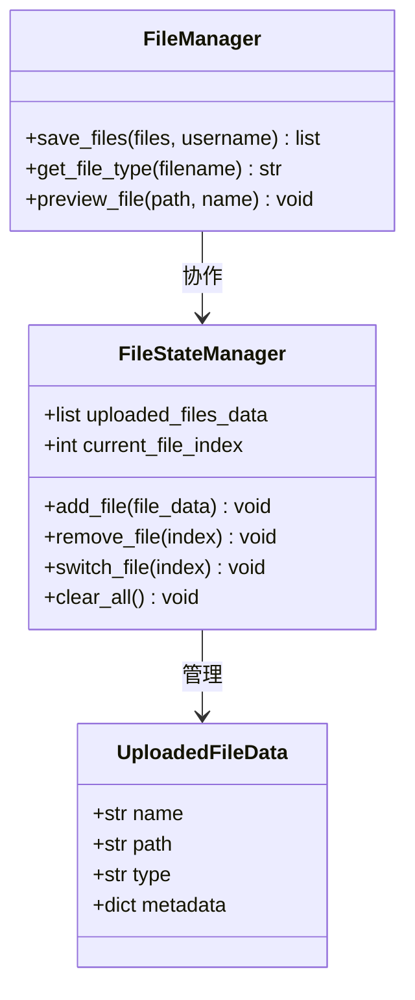
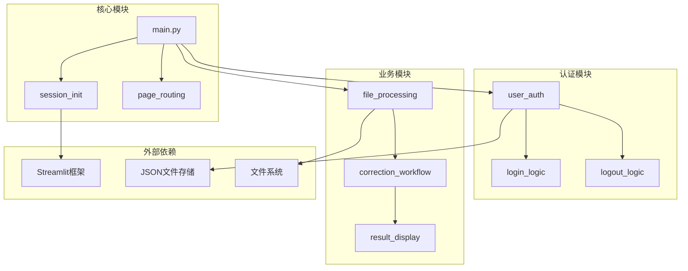

# 会话初始化

<cite>
**本文档中引用的文件**
- [main.py](file://ai_correction/main.py)
- [workflow_multimodal.py](file://ai_correction/functions/langgraph/workflow_multimodal.py)
- [multimodal_input_agent.py](file://ai_correction/functions/langgraph/agents/multimodal_input_agent.py)
- [redis_cache_session.md](file://ai_correction/docs/redis_cache_session.md)
- [auth_system_summary.md](file://ai_correction/docs/auth_system_summary.md)
</cite>

## 目录
1. [简介](#简介)
2. [项目结构概览](#项目结构概览)
3. [核心组件分析](#核心组件分析)
4. [架构概览](#架构概览)
5. [详细组件分析](#详细组件分析)
6. [依赖关系分析](#依赖关系分析)
7. [性能考虑](#性能考虑)
8. [故障排除指南](#故障排除指南)
9. [结论](#结论)

## 简介

本文档详细描述了Streamlit应用中会话初始化的核心功能，重点分析`init_session`函数如何为AI智能批改系统初始化用户会话状态。该系统采用基于Streamlit的会话状态管理机制，通过精心设计的状态变量确保用户在不同页面间导航时的状态一致性。

会话初始化是整个应用的基础，它负责建立用户认证状态、页面导航状态、批改结果状态等关键会话变量，为后续的用户交互提供稳定的状态基础。

## 项目结构概览

AI智能批改系统采用模块化的架构设计，主要包含以下核心模块：



**图表来源**
- [main.py](file://ai_correction/main.py#L407-L423)
- [main.py](file://ai_correction/main.py#L1062-L1083)

**章节来源**
- [main.py](file://ai_correction/main.py#L1-L50)

## 核心组件分析

### init_session函数详解

`init_session`函数是整个应用会话管理的核心入口点，负责初始化所有必要的会话状态变量：

```mermaid
flowchart TD
A[应用启动] --> B[init_session调用]
B --> C{检查logged_in}
C --> |不存在| D[设置logged_in=False]
C --> |存在| E{检查username}
D --> E
E --> |不存在| F[设置username=""]
E --> |存在| G{检查page}
F --> G
G --> |不存在| H[设置page="home"]
G --> |存在| I{检查correction_result}
H --> I
I --> |不存在| J[设置correction_result=None]
I --> |存在| K{检查uploaded_files_data}
J --> K
K --> |不存在| L[设置uploaded_files_data=[]]
K --> |存在| M{检查current_file_index}
L --> M
M --> |不存在| N[设置current_file_index=0]
M --> |存在| O{检查correction_settings}
N --> O
O --> |不存在| P[设置correction_settings={}]
O --> |存在| Q{检查current_task_id}
P --> Q
Q --> |不存在| R[设置current_task_id=None]
Q --> |存在| S[初始化完成]
R --> S
```

**图表来源**
- [main.py](file://ai_correction/main.py#L407-L423)

### 关键会话状态变量

系统维护以下核心会话状态变量：

| 变量名 | 类型 | 默认值 | 业务含义 | 用途说明 |
|--------|------|--------|----------|----------|
| `logged_in` | bool | False | 用户认证状态 | 标识用户是否已登录，影响页面访问权限 |
| `username` | str | "" | 用户标识 | 存储当前登录用户的用户名，用于个性化显示 |
| `page` | str | "home" | 页面导航状态 | 控制当前显示的页面，支持多页面导航 |
| `correction_result` | Any | None | 批改结果状态 | 存储AI批改的结果数据，支持结果展示 |
| `uploaded_files_data` | list | [] | 文件上传状态 | 记录用户上传的文件信息，支持文件管理 |
| `current_file_index` | int | 0 | 文件浏览状态 | 指示当前正在查看的文件索引 |
| `correction_settings` | dict | {} | 批改设置状态 | 存储批改模式、严格程度等设置参数 |
| `current_task_id` | Any | None | 任务状态 | 跟踪当前正在进行的批改任务ID |

**章节来源**
- [main.py](file://ai_correction/main.py#L407-L423)

## 架构概览

### 会话状态管理架构



**图表来源**
- [main.py](file://ai_correction/main.py#L407-L423)

### 用户认证流程与会话联动



**图表来源**
- [main.py](file://ai_correction/main.py#L555-L557)
- [main.py](file://ai_correction/main.py#L1062-L1083)

**章节来源**
- [main.py](file://ai_correction/main.py#L555-L557)

## 详细组件分析

### 会话初始化函数实现

`init_session`函数采用防御性编程策略，确保每个状态变量都得到适当的初始化：



**图表来源**
- [main.py](file://ai_correction/main.py#L407-L423)

### 页面导航机制

系统采用基于状态的页面路由机制，通过`page`状态变量控制页面显示：



**图表来源**
- [main.py](file://ai_correction/main.py#L1062-L1083)

### 用户认证状态管理

用户认证状态通过多个状态变量协同管理：



**图表来源**
- [main.py](file://ai_correction/main.py#L555-L557)
- [main.py](file://ai_correction/main.py#L1035-L1045)

**章节来源**
- [main.py](file://ai_correction/main.py#L555-L557)
- [main.py](file://ai_correction/main.py#L1035-L1045)

### 文件上传状态管理

文件上传状态通过`uploaded_files_data`数组管理多个上传文件：



**图表来源**
- [main.py](file://ai_correction/main.py#L417-L417)

**章节来源**
- [main.py](file://ai_correction/main.py#L417-L417)

## 依赖关系分析

### 模块依赖关系



**图表来源**
- [main.py](file://ai_correction/main.py#L1-L30)

### 状态变量依赖关系

| 状态变量 | 依赖变量 | 影响范围 | 业务规则 |
|----------|----------|----------|----------|
| `logged_in` | 无 | 全局 | 决定用户访问权限 |
| `username` | `logged_in` | 用户相关功能 | 仅在已登录状态下有效 |
| `page` | 无 | 页面导航 | 控制当前显示页面 |
| `correction_result` | `logged_in` | 结果展示 | 仅在已登录状态下可用 |
| `uploaded_files_data` | `logged_in` | 文件管理 | 仅在已登录状态下可用 |
| `current_file_index` | `uploaded_files_data` | 文件浏览 | 依赖文件数据存在 |
| `correction_settings` | 无 | 批改配置 | 独立的配置状态 |
| `current_task_id` | 无 | 任务跟踪 | 独立的任务状态 |

**章节来源**
- [main.py](file://ai_correction/main.py#L407-L423)

## 性能考虑

### 会话状态优化策略

1. **延迟初始化**: 只在需要时才初始化状态变量
2. **内存管理**: 及时清理不需要的状态数据
3. **状态同步**: 确保状态变化的原子性
4. **缓存策略**: 对频繁访问的状态进行缓存

### 最佳实践建议

1. **状态访问**: 使用`st.session_state.get()`方法安全访问状态
2. **状态更新**: 在适当的地方调用`st.rerun()`触发页面刷新
3. **状态清理**: 在用户登出时清理相关状态数据
4. **错误处理**: 实现状态恢复机制防止状态损坏

## 故障排除指南

### 常见问题及解决方案

| 问题类型 | 症状 | 可能原因 | 解决方案 |
|----------|------|----------|----------|
| 会话丢失 | 页面刷新后状态重置 | 会话超时或浏览器清除 | 检查浏览器Cookie设置 |
| 页面导航异常 | 无法正确跳转页面 | `page`状态值错误 | 重置`page`状态为"home" |
| 文件上传失败 | 文件无法上传 | `uploaded_files_data`状态异常 | 清空并重新初始化文件状态 |
| 认证状态错误 | 登录后仍显示未登录 | `logged_in`状态未正确设置 | 检查认证逻辑和状态更新 |

### 调试技巧

1. **状态检查**: 使用`st.session_state`查看当前状态
2. **日志记录**: 添加状态变化的日志记录
3. **状态快照**: 在关键节点保存状态快照
4. **单元测试**: 编写状态管理的单元测试

**章节来源**
- [main.py](file://ai_correction/main.py#L407-L423)

## 结论

Streamlit应用的会话初始化机制通过精心设计的状态变量管理，为AI智能批改系统提供了稳定可靠的用户状态基础。`init_session`函数作为核心入口，确保了应用启动时的正确状态初始化，为后续的用户交互提供了坚实的基础。

该系统的设计体现了以下优秀特性：

1. **模块化设计**: 清晰的状态变量分类和管理
2. **防御性编程**: 完善的空值检查和默认值设置
3. **状态一致性**: 确保跨页面的状态同步
4. **扩展性**: 易于添加新的状态变量和功能

通过遵循本文档描述的最佳实践，开发者可以有效地管理和扩展应用的会话状态功能，为用户提供流畅的交互体验。