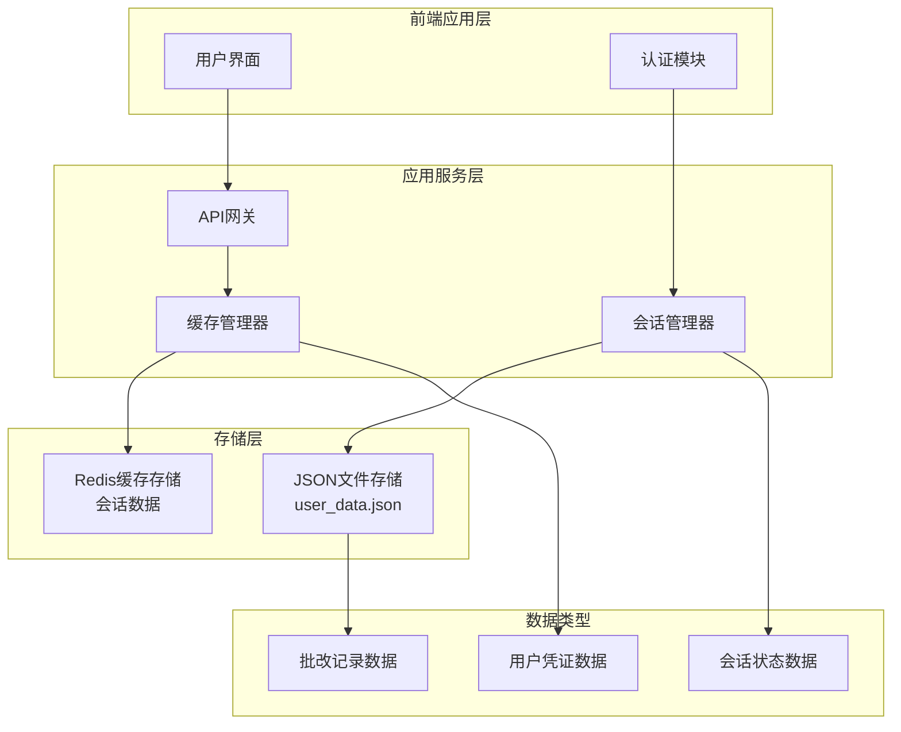
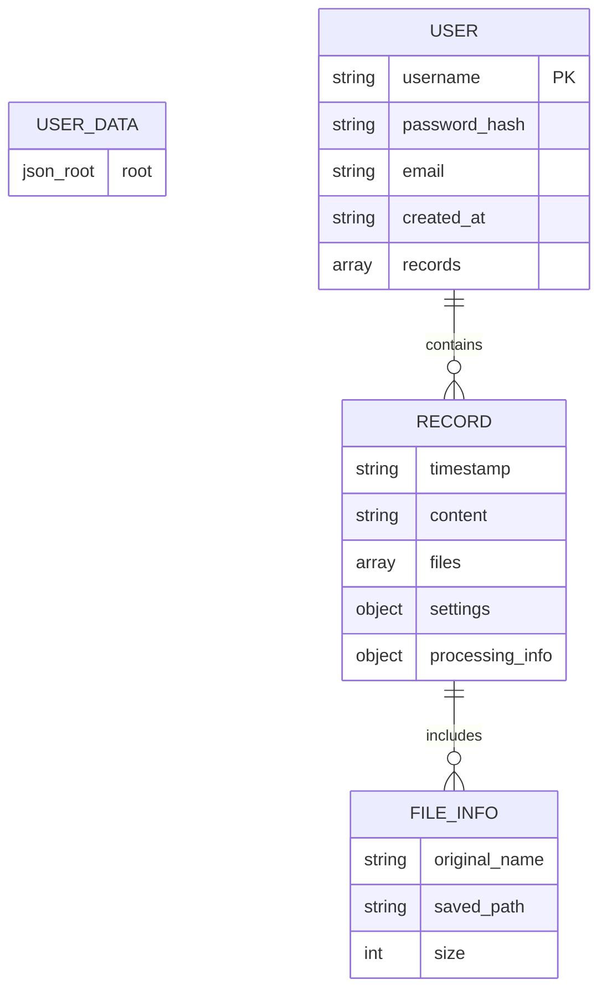
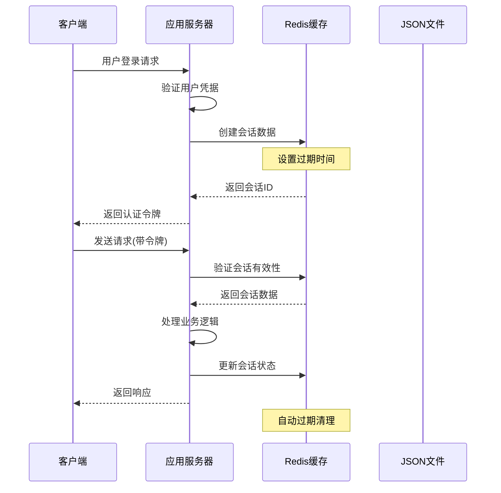
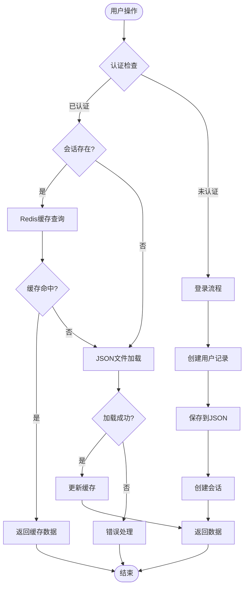
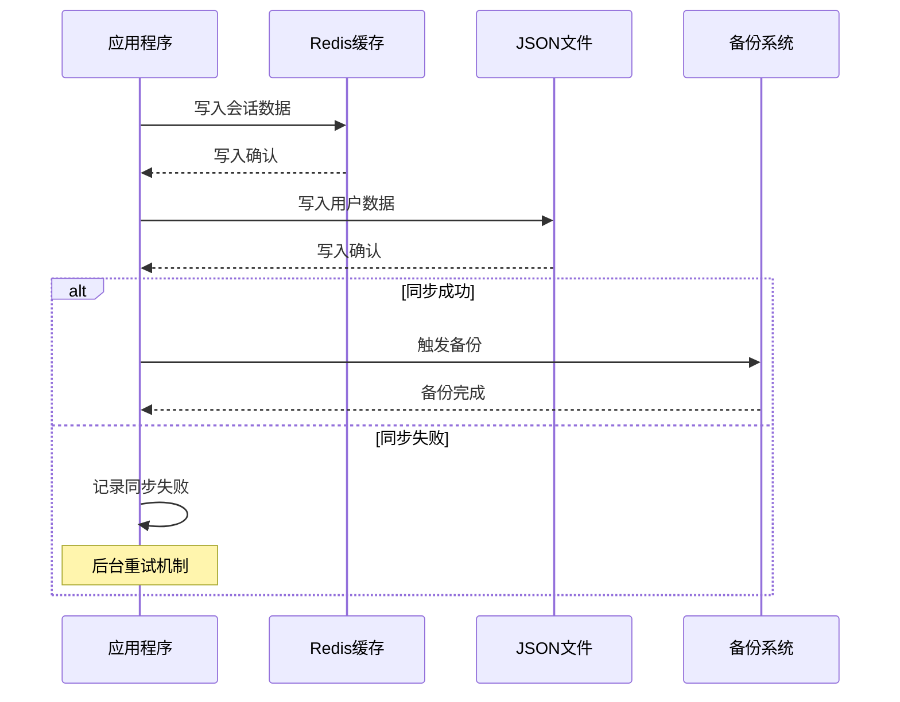

# 用户数据存储

<cite>
**本文档引用的文件**
- [user_data.json](file://ai_correction/user_data.json)
- [main.py](file://ai_correction/main.py)
- [redis_cache_session.md](file://ai_correction/docs/redis_cache_session.md)
- [config.py](file://ai_correction/config.py)
- [langgraph_integration.py](file://ai_correction/functions/langgraph_integration.py)
</cite>

## 目录
1. [简介](#简介)
2. [系统架构概览](#系统架构概览)
3. [JSON文件存储机制](#json文件存储机制)
4. [Redis缓存会话管理](#redis缓存会话管理)
5. [双重存储架构详解](#双重存储架构详解)
6. [数据同步与安全策略](#数据同步与安全策略)
7. [性能优化与监控](#性能优化与监控)
8. [故障排除指南](#故障排除指南)
9. [最佳实践建议](#最佳实践建议)

## 简介

AI智能批改系统采用双重存储架构，结合JSON文件持久化存储和Redis内存缓存，为用户提供高效、安全、可靠的数据管理服务。该架构在保证数据持久性的同时，通过Redis缓存提升系统性能，实现用户认证、会话管理和批改记录的统一管理。

## 系统架构概览

系统采用分层存储架构，将不同类型的数据分别存储在最适合的存储介质中：



**图表来源**
- [redis_cache_session.md](file://ai_correction/docs/redis_cache_session.md#L13-L45)
- [main.py](file://ai_correction/main.py#L81-L133)

## JSON文件存储机制

### 文件结构与组织

系统使用`user_data.json`作为主要的用户数据存储文件，采用层次化的JSON结构存储用户信息和批改记录。

#### 用户数据结构



**图表来源**
- [user_data.json](file://ai_correction/user_data.json#L1-L50)

#### 核心字段说明

| 字段名 | 类型 | 描述 | 示例值 |
|--------|------|------|--------|
| `username` | string | 用户唯一标识符 | `"test_user_1"` |
| `password` | string | SHA256哈希密码 | `"8d969eef6ecad3c29a3a629280e686cf0c3f5d5a86aff3ca12020c923adc6c92"` |
| `email` | string | 用户邮箱地址 | `"test_user_1@example.com"` |
| `created_at` | string | 账户创建时间 | `"2025-06-19 12:07:51"` |
| `records` | array | 批改记录数组 | `[]` |

### 文件操作函数

#### read_users()函数实现

[`read_users()`函数](file://ai_correction/main.py#L423-L466)负责从JSON文件读取用户数据，具有以下特点：

- **文件存在性检查**：检测`user_data.json`文件是否存在
- **自动初始化**：文件不存在时创建空数据结构
- **演示账户保障**：确保`demo`演示账户始终存在
- **异常处理**：捕获并优雅处理文件读取异常

#### save_users()函数实现

[`save_users()`函数](file://ai_correction/main.py#L468-L475)负责将用户数据写入JSON文件：

- **原子性写入**：确保数据完整性
- **编码处理**：支持UTF-8编码和中文字符
- **格式化输出**：使用缩进提高可读性
- **错误报告**：提供详细的保存失败信息

#### 演示账户自动创建

系统在读取用户数据时会自动检查并创建`demo`演示账户：

```python
# 确保demo用户存在
if "demo" not in data:
    data["demo"] = {
        "password": hashlib.sha256("demo".encode()).hexdigest(),
        "email": "demo@example.com",
        "created_at": datetime.now().strftime("%Y-%m-%d %H:%M:%S"),
        "records": []
    }
    save_users(data)
```

**章节来源**
- [main.py](file://ai_correction/main.py#L423-L475)
- [user_data.json](file://ai_correction/user_data.json#L1-L649)

## Redis缓存会话管理

### Redis架构设计

系统采用Redis作为高性能缓存和会话存储解决方案，提供分布式会话管理和实时数据缓存功能。



**图表来源**
- [redis_cache_session.md](file://ai_correction/docs/redis_cache_session.md#L13-L45)

### 核心组件功能

#### Redis Manager (Redis管理器)

负责底层Redis连接和基本操作：

- **异步连接池**：最大20个连接，支持并发操作
- **健康监控**：每30秒检查连接状态
- **自动重试**：连接超时时自动重试
- **JSON序列化**：复杂数据类型自动序列化

#### Cache Manager (缓存管理器)

提供高级缓存操作接口：

- **Get-or-Set模式**：工厂函数模式的缓存获取
- **批量操作**：支持多键值的批量读写
- **模式失效**：基于模式的缓存失效机制
- **专用方法**：针对用户、班级、作业等数据类型的专门方法

#### Session Manager (会话管理器)

专门处理用户会话生命周期：

- **安全令牌生成**：加密安全的随机令牌
- **过期处理**：自动会话过期清理
- **活动跟踪**：记录最后访问时间
- **多会话支持**：单用户多设备会话管理

### 会话数据结构

Redis中的会话数据采用标准化结构：

```json
{
  "user_id": "uuid",
  "created_at": "2024-01-01T00:00:00",
  "last_accessed": "2024-01-01T12:00:00", 
  "expires_at": "2024-01-02T00:00:00",
  "data": {
    "role": "student",
    "permissions": ["read", "write"],
    "custom_field": "value"
  }
}
```

### 缓存键命名规范

系统采用统一的缓存键命名模式：

| 前缀 | 用途 | 示例 |
|------|------|------|
| `user:` | 用户相关数据 | `user:profile:123` |
| `class:` | 班级相关数据 | `class:students:456` |
| `assignment:` | 作业相关数据 | `assignment:info:789` |
| `grading:` | AI批改结果 | `grading:result:task123` |
| `analytics:` | 分析统计数据 | `analytics:daily:2024-01-01` |

**章节来源**
- [redis_cache_session.md](file://ai_correction/docs/redis_cache_session.md#L60-L248)

## 双重存储架构详解

### 存储策略对比

| 特性 | JSON文件存储 | Redis缓存存储 |
|------|-------------|---------------|
| **持久性** | 永久保存 | 内存存储，可设置过期时间 |
| **容量** | 无限制 | 受内存限制 |
| **性能** | 顺序读写较慢 | O(1)查找，极高性能 |
| **适用场景** | 用户凭证、历史记录 | 会话状态、临时数据 |
| **数据类型** | 结构化JSON数据 | 键值对、集合、有序集合 |
| **备份策略** | 文件备份 | 主从复制、快照备份 |

### 数据流向图



**图表来源**
- [main.py](file://ai_correction/main.py#L423-L475)
- [redis_cache_session.md](file://ai_correction/docs/redis_cache_session.md#L300-L353)

### 数据一致性保证

系统通过以下机制确保数据一致性：

1. **写入顺序**：先写入Redis，再写入JSON文件
2. **事务处理**：使用Redis事务保证操作原子性
3. **缓存失效**：关键数据变更时主动失效相关缓存
4. **定期同步**：后台进程定期同步Redis和JSON数据

**章节来源**
- [main.py](file://ai_correction/main.py#L423-L475)
- [redis_cache_session.md](file://ai_correction/docs/redis_cache_session.md#L300-L440)

## 数据同步与安全策略

### 数据同步机制

#### 写入同步策略



#### 读取降级策略

系统具备优雅降级能力：

```python
# 缓存错误时的降级处理
try:
    cached_data = await cache_manager.get_user_data(user_id)
    if cached_data is None:
        # 缓存未命中，回退到数据库
        data = await database.get_user_data(user_id)
        # 尝试重新缓存（可能失败但不影响主流程）
        await cache_manager.cache_user_data(user_id, data)
        return data
except Exception as e:
    logger.warning(f"缓存错误，回退到数据库: {e}")
    return await database.get_user_data(user_id)
```

### 安全防护措施

#### 会话安全

- **令牌生成**：使用加密安全的随机数生成器
- **会话隔离**：每个用户的会话数据独立存储
- **自动清理**：过期会话自动删除
- **活动监控**：记录会话最后访问时间

#### 数据加密

- **密码哈希**：使用SHA256算法存储密码哈希
- **敏感数据**：避免在缓存中存储敏感信息
- **传输加密**：HTTPS确保数据传输安全

#### 访问控制

- **权限验证**：每次操作都验证用户权限
- **资源隔离**：用户数据严格隔离
- **审计日志**：记录所有关键操作

**章节来源**
- [redis_cache_session.md](file://ai_correction/docs/redis_cache_session.md#L354-L440)

## 性能优化与监控

### 性能指标监控

#### Redis性能监控

系统提供全面的Redis性能监控：

```python
# 会话统计信息
stats = await session_manager.get_session_stats()
# 返回: {
#   "total_sessions": 150,
#   "active_sessions": 120,
#   "expired_sessions": 30,
#   "unique_users": 85
# }

# 内存使用情况
redis_client = redis_manager.get_redis()
info = await redis_client.info("memory")
memory_usage = info["used_memory_human"]
```

#### 缓存命中率优化

- **预热策略**：启动时预加载热点数据
- **智能过期**：根据访问频率调整过期时间
- **压缩存储**：大对象启用压缩
- **批量操作**：减少网络往返次数

### 连接池配置

Redis连接池采用优化配置：

- **最大连接数**：20个连接
- **连接复用**：自动回收和重用连接
- **健康检查**：每30秒检查连接状态
- **超时处理**：5秒连接/套接字超时

### 性能优化建议

1. **缓存策略优化**
   - 用户资料：1小时过期
   - 班级信息：1小时过期
   - 作业结果：24小时过期
   - 分析数据：5分钟过期

2. **内存管理**
   - 使用一致的键前缀便于模式匹配
   - 定期清理过期数据
   - 监控内存使用情况

3. **网络优化**
   - 批量操作减少网络开销
   - 连接池复用连接
   - 合理设置超时时间

**章节来源**
- [redis_cache_session.md](file://ai_correction/docs/redis_cache_session.md#L300-L440)

## 故障排除指南

### 常见问题诊断

#### Redis连接问题

**症状**：缓存操作失败，会话验证失败

**排查步骤**：
1. 检查Redis服务状态
2. 验证连接配置
3. 查看连接池状态
4. 检查网络连通性

**解决方案**：
```python
# Redis连接健康检查
await redis_manager.health_check()

# 获取所有键（仅用于调试）
redis_client = redis_manager.get_redis()
keys = await redis_client.keys("*")
```

#### JSON文件问题

**症状**：用户数据丢失，文件读取异常

**排查步骤**：
1. 检查文件权限
2. 验证文件完整性
3. 查看磁盘空间
4. 检查文件编码

**解决方案**：
```python
# 文件存在性检查
if DATA_FILE.exists():
    with open(DATA_FILE, 'r', encoding='utf-8') as f:
        data = json.load(f)
else:
    # 自动初始化
    data = {}
```

#### 会话过期问题

**症状**：用户频繁需要重新登录

**排查步骤**：
1. 检查会话过期时间配置
2. 验证会话清理机制
3. 查看会话统计信息

**解决方案**：
```python
# 扩展会话时间
await session_service.extend_user_session(session_id, minutes=30)

# 检查会话是否过期
is_expired = await session_service.is_session_expired(session_id)
```

### 调试命令

系统提供多种调试工具：

```python
# 检查Redis连接
await redis_manager.health_check()

# 获取会话信息
session_data = await session_manager.get_session(session_id)

# 检查缓存命中
cached_value = await cache_manager.get_user_data(user_id)

# 列出所有Redis键（开发环境）
redis_client = redis_manager.get_redis()
keys = await redis_client.keys("*")
```

**章节来源**
- [redis_cache_session.md](file://ai_correction/docs/redis_cache_session.md#L423-L440)

## 最佳实践建议

### 开发最佳实践

1. **数据备份**
   - 定期备份`user_data.json`文件
   - 实现增量备份策略
   - 测试恢复流程

2. **性能监控**
   - 监控Redis内存使用率
   - 跟踪缓存命中率
   - 分析慢查询日志

3. **安全加固**
   - 定期轮换Redis密码
   - 限制Redis网络访问
   - 启用SSL加密

4. **容量规划**
   - 监控JSON文件大小增长
   - 预估Redis内存需求
   - 制定扩容计划

### 运维建议

1. **监控告警**
   - 设置Redis连接失败告警
   - 监控文件系统空间
   - 跟踪应用错误率

2. **维护窗口**
   - 定期重启Redis服务
   - 清理过期会话数据
   - 优化JSON文件结构

3. **灾难恢复**
   - 制定数据恢复计划
   - 测试备份恢复流程
   - 建立异地备份

### 扩展性考虑

随着用户量增长，建议考虑以下扩展策略：

1. **水平扩展**
   - Redis集群部署
   - 分片存储用户数据
   - 负载均衡配置

2. **垂直扩展**
   - 增加Redis内存
   - 优化索引结构
   - 升级硬件配置

3. **混合存储**
   - 热数据Redis缓存
   - 冷数据归档存储
   - 智能数据迁移

通过实施这些最佳实践，可以确保系统的稳定性、安全性和可扩展性，为用户提供优质的AI智能批改服务体验。