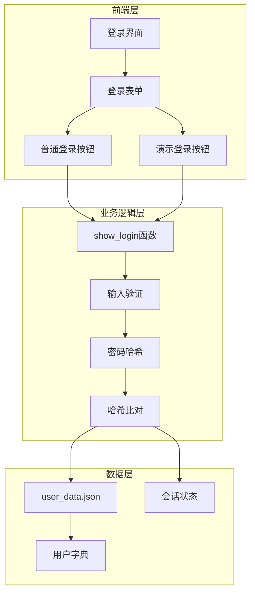
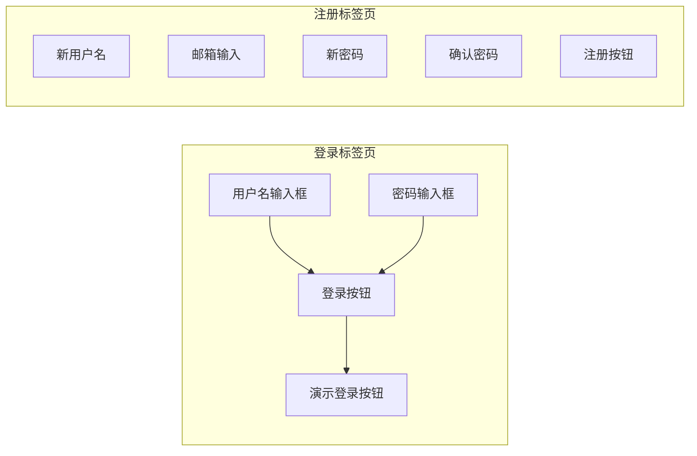
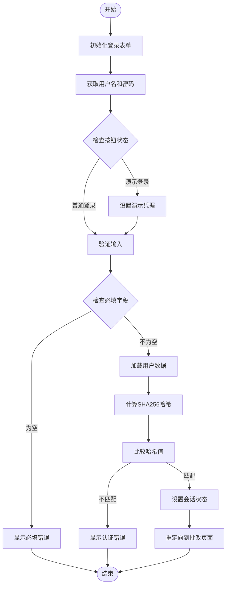
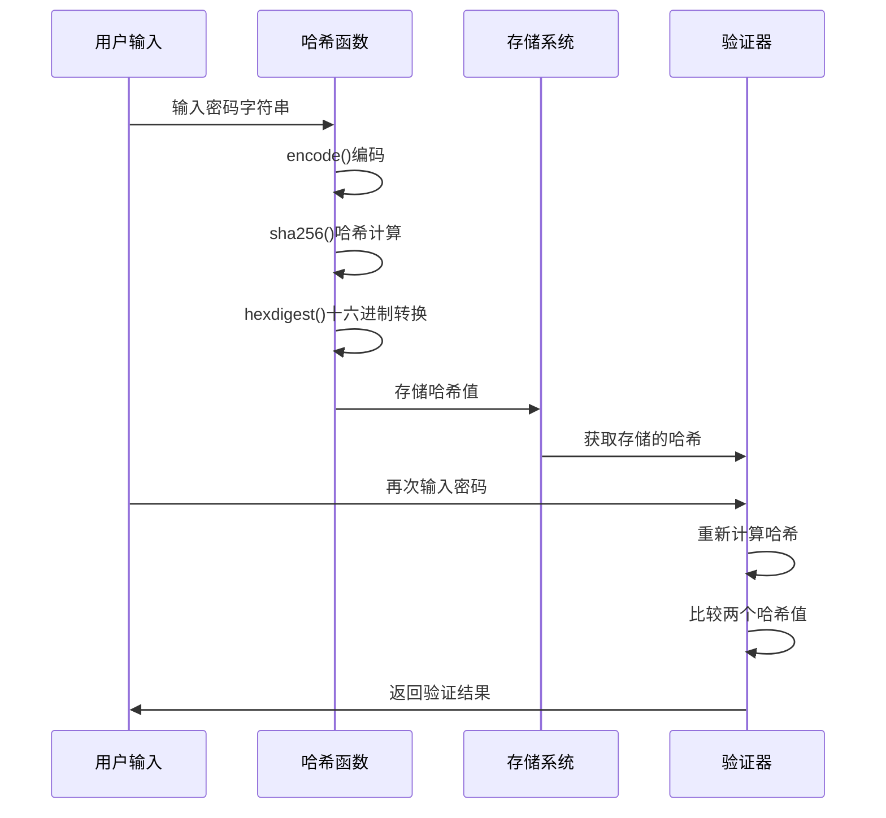
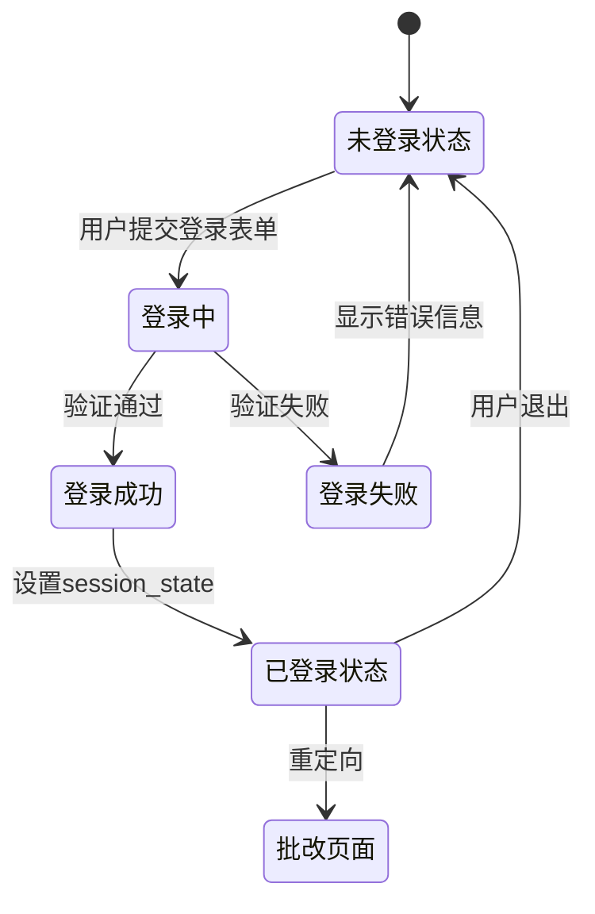
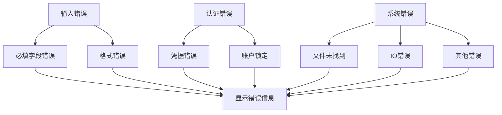
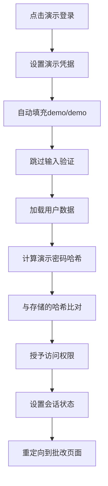

# 登录验证逻辑详细文档

<cite>
**本文档引用的文件**
- [main.py](file://ai_correction/main.py)
- [user_data.json](file://ai_correction/user_data.json)
- [config.py](file://ai_correction/config.py)
- [auth_system_summary.md](file://ai_correction/docs/auth_system_summary.md)
</cite>

## 目录
1. [概述](#概述)
2. [系统架构](#系统架构)
3. [登录表单构建](#登录表单构建)
4. [show_login函数详解](#show_login函数详解)
5. [密码验证机制](#密码验证机制)
6. [会话状态管理](#会话状态管理)
7. [错误处理与安全机制](#错误处理与安全机制)
8. [演示登录功能](#演示登录功能)
9. [安全防护建议](#安全防护建议)
10. [故障排除指南](#故障排除指南)

## 概述

本文档详细分析了AI智能批改系统中的登录验证逻辑，重点聚焦于`show_login`函数的实现。该系统采用基于JSON文件的简单认证机制，使用SHA256哈希算法保护用户凭据，并提供演示登录功能以方便用户体验。

### 核心特性
- **双重认证方式**：支持普通登录和演示登录
- **密码安全存储**：使用SHA256哈希算法
- **会话状态管理**：基于Streamlit的session_state
- **实时验证反馈**：即时的错误提示和成功通知
- **用户友好界面**：简洁直观的登录表单设计

## 系统架构



**图表来源**
- [main.py](file://ai_correction/main.py#L501-L570)

## 登录表单构建

### 表单布局设计

登录页面采用标签页布局，将登录和注册功能分离：



**图表来源**
- [main.py](file://ai_correction/main.py#L501-L570)

### 字段配置说明

| 字段名称 | 类型 | 验证规则 | 提示信息 |
|---------|------|----------|----------|
| 用户名 | 文本输入 | 必填字段 | 输入用户名 |
| 密码 | 密码输入 | 必填字段 | 输入密码 |
| 新用户名 | 文本输入 | 必填字段 | 用户名不能为空 |
| 邮箱 | 文本输入 | 可选 | 邮箱地址 |
| 新密码 | 密码输入 | 必填字段 | 密码不能为空 |
| 确认密码 | 密码输入 | 必填字段 | 确认密码 |

**章节来源**
- [main.py](file://ai_correction/main.py#L501-L570)

## show_login函数详解

### 函数结构分析

`show_login`函数是登录功能的核心实现，负责处理用户认证请求：



**图表来源**
- [main.py](file://ai_correction/main.py#L538-L570)

### 关键实现细节

#### 1. 表单提交处理
函数监听两个按钮的点击事件：
- **登录按钮**：触发普通登录流程
- **演示登录按钮**：自动填充演示凭据

#### 2. 输入验证逻辑
实现了多层次的输入验证：
- **必填字段检查**：确保用户名和密码不为空
- **数据类型验证**：确认输入为字符串类型
- **格式验证**：检查输入格式的正确性

#### 3. 错误处理机制
提供详细的错误提示：
- **必填字段错误**："请输入用户名和密码"
- **认证失败**："用户名或密码错误"
- **系统错误**：捕获并显示异常信息

**章节来源**
- [main.py](file://ai_correction/main.py#L538-L570)

## 密码验证机制

### SHA256哈希算法实现

系统采用SHA256哈希算法保护用户密码：



**图表来源**
- [main.py](file://ai_correction/main.py#L538-L570)

### 哈希存储流程

#### 1. 注册时的密码处理
- 用户输入明文密码
- 系统使用`hashlib.sha256()`进行哈希处理
- 将哈希值存储在`user_data.json`中

#### 2. 登录时的密码验证
- 用户输入密码
- 系统重新计算输入密码的哈希值
- 与存储的哈希值进行安全比对

#### 3. 安全特性
- **单向加密**：无法从哈希值还原原始密码
- **抗彩虹表攻击**：使用标准SHA256算法
- **字符集兼容**：支持Unicode字符

**章节来源**
- [main.py](file://ai_correction/main.py#L423-L466)
- [main.py](file://ai_correction/main.py#L568-L595)

## 会话状态管理

### Streamlit会话状态设计

系统使用Streamlit的`st.session_state`进行状态管理：



**图表来源**
- [main.py](file://ai_correction/main.py#L538-L570)

### 会话状态字段

| 字段名称 | 类型 | 默认值 | 用途 |
|---------|------|--------|------|
| logged_in | 布尔值 | False | 标识用户登录状态 |
| username | 字符串 | "" | 当前登录用户名 |
| page | 字符串 | "home" | 当前页面导航 |
| correction_result | 对象 | None | 批改结果缓存 |
| uploaded_files_data | 列表 | [] | 上传文件数据 |

### 状态变更流程

#### 登录成功后的状态变更
1. `st.session_state.logged_in = True`
2. `st.session_state.username = username`
3. `st.session_state.page = "grading"`
4. 显示欢迎消息
5. 触发页面重载

#### 退出登录的状态重置
1. `st.session_state.logged_in = False`
2. `st.session_state.username = ""`
3. 清空批改结果
4. 重定向到主页

**章节来源**
- [main.py](file://ai_correction/main.py#L538-L570)

## 错误处理与安全机制

### 错误提示系统

系统提供多层次的错误提示机制：



**图表来源**
- [main.py](file://ai_correction/main.py#L561-L563)

### 安全机制实现

#### 1. 输入验证
- **必填字段检查**：确保用户名和密码不为空
- **数据类型验证**：确认输入为字符串类型
- **长度限制**：防止超长输入攻击

#### 2. 错误信息设计
- **通用错误**："用户名或密码错误"
- **输入错误**："请输入用户名和密码"
- **注册错误**："用户名已存在"、"密码不一致"

#### 3. 安全最佳实践
- **错误信息一致性**：避免泄露系统内部信息
- **输入清理**：防止恶意输入
- **会话管理**：及时清理敏感信息

**章节来源**
- [main.py](file://ai_correction/main.py#L561-L563)
- [main.py](file://ai_correction/main.py#L590-L594)

## 演示登录功能

### 演示账户机制

系统提供演示登录功能，方便用户快速体验系统功能：



**图表来源**
- [main.py](file://ai_correction/main.py#L538-L570)

### 演示账户特性

#### 1. 预设凭据
- **用户名**：`demo`
- **密码**：`demo`
- **哈希值**：系统自动计算并存储

#### 2. 安全考虑
- **独立账户**：演示账户与其他用户隔离
- **权限限制**：演示账户具有受限功能
- **定期重置**：支持演示账户的重置和更新

#### 3. 用户体验
- **一键登录**：无需手动输入凭据
- **快速体验**：立即进入系统功能
- **安全性保证**：演示账户不影响正式数据

**章节来源**
- [main.py](file://ai_correction/main.py#L538-L570)
- [main.py](file://ai_correction/main.py#L423-L466)

## 安全防护建议

### 针对暴力破解的防护措施

#### 1. 当前实现的安全特性
- **SHA256哈希存储**：密码不以明文形式存储
- **即时验证反馈**：提供一致的错误响应
- **会话状态管理**：基于Web框架的安全机制

#### 2. 建议的改进措施

##### a. 登录尝试限制
```python
# 建议的登录尝试限制实现
class LoginAttemptTracker:
    def __init__(self):
        self.attempt_counts = {}
        self.lockout_times = {}
    
    def record_attempt(self, username):
        # 记录登录尝试
        pass
    
    def is_locked_out(self, username):
        # 检查是否被锁定
        pass
    
    def reset_attempts(self, username):
        # 重置尝试计数
        pass
```

##### b. IP地址限制
- **同一IP限制**：限制同一IP地址的并发连接数
- **地理位置检测**：识别异常登录位置
- **设备指纹**：跟踪设备特征

##### c. 时间延迟机制
- **响应时间延迟**：无论成功与否都等待固定时间
- **指数退避**：连续失败时增加延迟时间
- **随机延迟**：添加随机时间间隔

#### 3. 监控和审计

##### a. 登录事件记录
- **成功登录**：记录时间、IP地址、用户代理
- **失败登录**：记录失败次数、时间、IP地址
- **异常行为**：检测可疑登录模式

##### b. 报警机制
- **阈值报警**：达到一定失败次数时触发
- **实时通知**：发送安全警报邮件
- **自动封禁**：临时或永久封禁可疑账户

### 其他安全建议

#### 1. 密码策略
- **最小长度**：要求至少8位字符
- **复杂度要求**：包含大小写字母、数字、特殊字符
- **定期更换**：强制定期更新密码

#### 2. 传输安全
- **HTTPS强制**：所有通信使用加密连接
- **CSRF防护**：防止跨站请求伪造攻击
- **XSS防护**：过滤恶意脚本输入

#### 3. 存储安全
- **密钥管理**：使用专用密钥管理系统
- **数据加密**：敏感数据额外加密存储
- **备份安全**：加密备份文件传输和存储

## 故障排除指南

### 常见问题诊断

#### 1. 登录失败问题

**症状**：输入正确凭据仍提示"用户名或密码错误"

**排查步骤**：
1. 检查`user_data.json`文件是否存在且可读
2. 验证用户数据格式是否正确
3. 确认密码哈希值是否正确存储
4. 检查文件编码是否为UTF-8

**解决方案**：
```python
# 检查用户数据文件
import json
from pathlib import Path

data_file = Path("user_data.json")
if not data_file.exists():
    print("用户数据文件不存在")
elif data_file.stat().st_size == 0:
    print("用户数据文件为空")
else:
    try:
        with open(data_file, 'r', encoding='utf-8') as f:
            users = json.load(f)
        print(f"用户数量: {len(users)}")
    except json.JSONDecodeError:
        print("用户数据文件格式错误")
```

#### 2. 演示登录问题

**症状**：点击演示登录按钮无响应

**排查步骤**：
1. 检查`demo`用户是否存在于`user_data.json`
2. 验证演示用户的密码哈希值
3. 确认按钮事件绑定是否正确

**解决方案**：
```python
# 验证演示用户
def verify_demo_user():
    users = read_users()
    if "demo" in users:
        stored_hash = users["demo"]["password"]
        expected_hash = hashlib.sha256("demo".encode()).hexdigest()
        if stored_hash == expected_hash:
            print("演示用户验证成功")
        else:
            print("演示用户密码哈希不匹配")
    else:
        print("演示用户不存在")
```

#### 3. 会话状态问题

**症状**：登录后立即被重定向到登录页面

**排查步骤**：
1. 检查`st.session_state`是否正确设置
2. 验证页面重载是否正常
3. 确认会话状态持久化

**解决方案**：
```python
# 会话状态调试
def debug_session_state():
    print(f"logged_in: {st.session_state.get('logged_in')}")
    print(f"username: {st.session_state.get('username')}")
    print(f"page: {st.session_state.get('page')}")
    print(f"current_file_index: {st.session_state.get('current_file_index')}")
```

### 性能优化建议

#### 1. 数据加载优化
- **延迟加载**：只在需要时加载用户数据
- **缓存机制**：缓存常用用户信息
- **异步处理**：使用异步方式处理I/O操作

#### 2. 验证性能优化
- **索引优化**：为用户名建立索引
- **批量验证**：一次性验证多个凭据
- **内存优化**：减少不必要的对象创建

#### 3. 用户体验优化
- **加载指示器**：显示登录处理状态
- **错误恢复**：提供错误重试机制
- **响应式设计**：适配不同设备屏幕

**章节来源**
- [main.py](file://ai_correction/main.py#L423-L466)

## 结论

AI智能批改系统的登录验证逻辑实现了基本的安全性和可用性要求。通过SHA256哈希算法保护用户凭据，使用Streamlit的会话状态管理用户会话，提供演示登录功能以改善用户体验。

### 主要优势
- **简单可靠**：基于JSON文件的存储机制易于维护
- **安全基础**：采用标准哈希算法保护密码
- **用户友好**：提供演示功能降低使用门槛
- **错误处理**：完善的错误提示机制

### 改进方向
- **增强防护**：添加登录尝试限制和IP限制
- **监控审计**：实施登录事件记录和异常检测
- **性能优化**：优化数据加载和验证性能
- **安全加固**：完善传输和存储安全机制

该登录系统为AI批改系统提供了坚实的基础认证功能，为进一步的安全增强和功能扩展奠定了良好基础。