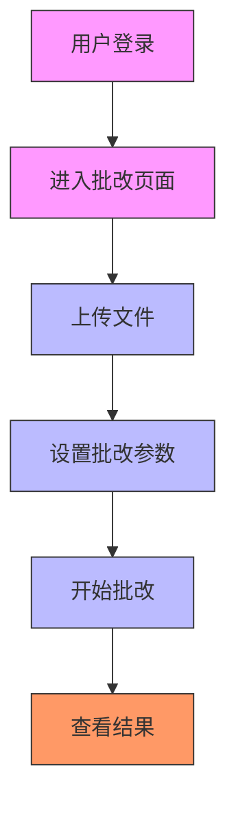
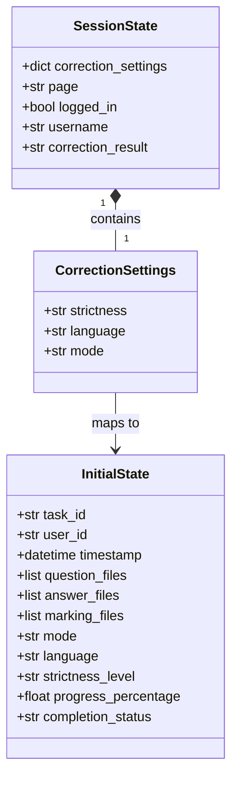
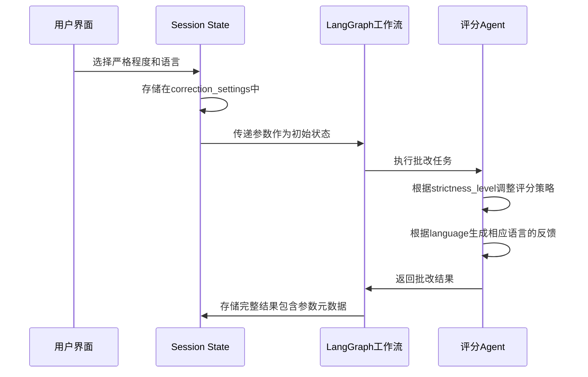

# 参数配置管理

<cite>
**本文档引用文件**  
- [main.py](file://ai_correction/main.py)
- [functions/langgraph/agents/scoring_agent.py](file://ai_correction/functions/langgraph/agents/scoring_agent.py)
- [functions/langgraph/agents/result_assembler.py](file://ai_correction/functions/langgraph/agents/result_assembler.py)
- [functions/langgraph/workflow_new.py](file://ai_correction/functions/langgraph/workflow_new.py)
- [docs/UI_OPTIMIZATION_SUMMARY.md](file://ai_correction/docs/UI_OPTIMIZATION_SUMMARY.md)
- [prompts/grading_prompts.md](file://ai_correction/prompts/grading_prompts.md)
- [user_data.json](file://ai_correction/user_data.json)
</cite>

## 目录
1. [引言](#引言)
2. [参数收集机制](#参数收集机制)
3. [UI优化与流程简化](#ui优化与流程简化)
4. [参数存储与传递](#参数存储与传递)
5. [参数对工作流的影响](#参数对工作流的影响)
6. [结论](#结论)

## 引言
本文档详细描述AI批改系统中批改参数的配置管理机制。系统通过Streamlit界面收集用户选择的批改参数，包括严格程度、语言等，并将其应用于LangGraph驱动的AI批改工作流中。文档重点说明了参数的收集、存储、传递过程，以及这些参数如何影响批改行为和结果。

## 参数收集机制

批改参数通过Streamlit界面中的`st.selectbox`组件进行收集。在批改页面中，用户可以选择批改的严格程度和输出语言，这些选择被实时捕获并存储。

系统通过`st.selectbox`组件提供直观的下拉选择界面，用户可以从预设选项中选择合适的参数值。这些参数随后被统一存储在`st.session_state.correction_settings`中，作为后续批改流程的配置依据。

**Section sources**
- [main.py](file://ai_correction/main.py#L393-L428)
- [main.py](file://ai_correction/main.py#L656-L693)

## UI优化与流程简化

通过`UI_OPTIMIZATION_SUMMARY.md`文档的指导，系统对批改流程进行了重大优化，删除了冗余的模式选择步骤。原先用户需要在高效模式、详细模式、批量模式等多个选项中进行选择，现在系统直接进入生产级AI批改模式。

这一优化显著简化了用户操作流程，从原先的7步减少到更简洁的流程。用户登录后直接进入生产级批改界面，上传文件并设置参数后即可开始批改，无需再选择批改模式。

**Diagram sources**
- [docs/UI_OPTIMIZATION_SUMMARY.md](file://ai_correction/docs/UI_OPTIMIZATION_SUMMARY.md#L0-L362)

**Section sources**
- [docs/UI_OPTIMIZATION_SUMMARY.md](file://ai_correction/docs/UI_OPTIMIZATION_SUMMARY.md#L0-L362)
- [main.py](file://ai_correction/main.py#L927-L956)

## 参数存储与传递

批改参数被统一存储在Streamlit的会话状态`st.session_state.correction_settings`中。系统在初始化时会检查并创建该状态变量，确保其存在。

当用户进行批改操作时，这些参数会从会话状态中提取，并作为初始状态的一部分传递给LangGraph工作流。在`run_production_grading`函数中，参数被整合到初始状态字典中，包括任务ID、用户ID、文件路径以及批改模式等信息。

**Diagram sources**
- [main.py](file://ai_correction/main.py#L393-L428)
- [functions/langgraph/workflow_new.py](file://ai_correction/functions/langgraph/workflow_new.py#L128-L166)

**Section sources**
- [main.py](file://ai_correction/main.py#L393-L428)
- [functions/langgraph/workflow_new.py](file://ai_correction/functions/langgraph/workflow_new.py#L128-L166)
- [user_data.json](file://ai_correction/user_data.json#L545-L586)

## 参数对工作流的影响

批改参数直接影响LangGraph工作流的行为，特别是评分Agent的批改策略。在`scoring_agent.py`中，严格程度参数被用来构建不同的评分提示词，从而影响批改的严格性。

例如，当严格程度设置为"宽松"时，系统会生成相应的提示词："请温和地批改，对小错误给予适当宽容"；而当设置为"严格"时，则会生成："请严格批改，对任何错误都要指出并合理扣分"。语言参数则决定了输出结果的语言，中文或英文。

这些参数还被记录在工作流的状态中，作为元数据保存在最终的批改结果里。在`result_assembler.py`中，配置信息被包含在元数据中，包括模式、语言和严格程度级别，确保批改过程的可追溯性。

**Diagram sources**
- [functions/langgraph/agents/scoring_agent.py](file://ai_correction/functions/langgraph/agents/scoring_agent.py#L154-L174)
- [functions/langgraph/agents/result_assembler.py](file://ai_correction/functions/langgraph/agents/result_assembler.py#L403-L438)
- [prompts/grading_prompts.md](file://ai_correction/prompts/grading_prompts.md#L226-L281)

**Section sources**
- [functions/langgraph/agents/scoring_agent.py](file://ai_correction/functions/langgraph/agents/scoring_agent.py#L154-L174)
- [functions/langgraph/agents/result_assembler.py](file://ai_correction/functions/langgraph/agents/result_assembler.py#L403-L438)
- [prompts/grading_prompts.md](file://ai_correction/prompts/grading_prompts.md#L226-L281)

## 结论
AI批改系统的参数配置管理机制通过Streamlit界面实现了用户友好的参数收集，将严格程度、语言等关键参数存储在会话状态中，并无缝传递给LangGraph工作流。通过删除冗余的模式选择步骤，系统直接进入生产级AI批改模式，简化了用户操作流程。这些参数在工作流中发挥重要作用，影响评分Agent的批改策略和输出语言，确保批改结果符合用户的期望和要求。