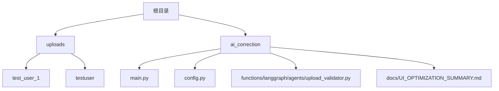
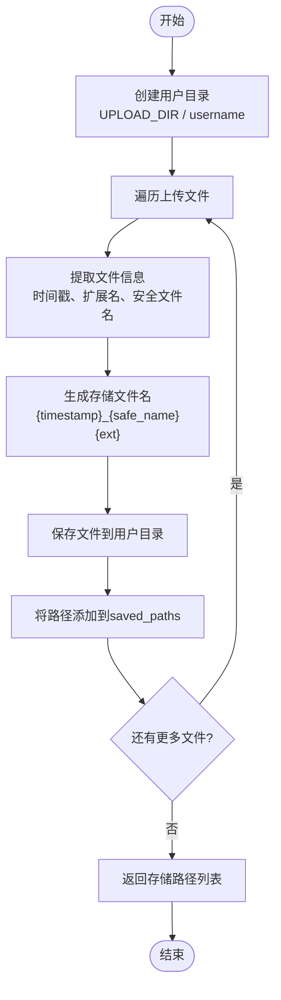
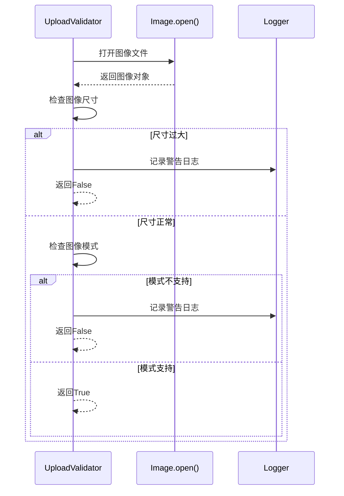
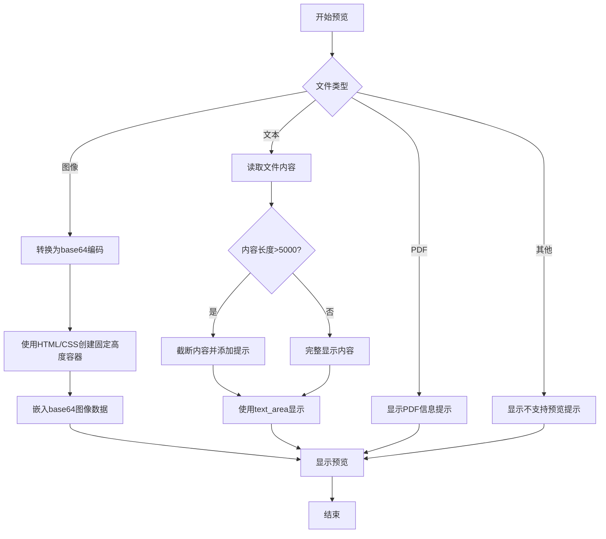

# 文件上传处理

<cite>
**本文档引用文件**  
- [main.py](file://ai_correction/main.py)
- [config.py](file://ai_correction/config.py)
- [upload_validator.py](file://ai_correction/functions/langgraph/agents/upload_validator.py)
- [UI_OPTIMIZATION_SUMMARY.md](file://ai_correction/docs/UI_OPTIMIZATION_SUMMARY.md)
</cite>

## 目录
1. [简介](#简介)
2. [项目结构](#项目结构)
3. [核心组件](#核心组件)
4. [架构概述](#架构概述)
5. [详细组件分析](#详细组件分析)
6. [依赖分析](#依赖分析)
7. [性能考虑](#性能考虑)
8. [故障排除指南](#故障排除指南)
9. [结论](#结论)

## 简介
本文档详细描述了AI批改系统中的文件上传处理机制，重点介绍Streamlit中文件上传的实现方式。文档涵盖了`save_files`函数如何根据用户名创建隔离的用户目录，生成带有时间戳和安全文件名的存储路径，以及支持的文件类型和大小限制的实现机制。同时结合UI优化策略，说明文件上传区域如何集成到批改流程中，并描述多文件上传后的预览机制。

## 项目结构
系统采用模块化设计，文件上传功能主要分布在核心模块中。上传文件存储在根目录下的`uploads`文件夹中，每个用户有独立的子目录。配置文件`config.py`和主应用文件`main.py`共同管理文件上传的核心逻辑。



**图示来源**  
- [main.py](file://ai_correction/main.py#L81-L133)
- [config.py](file://ai_correction/config.py#L48-L80)

**本节来源**  
- [main.py](file://ai_correction/main.py#L81-L133)
- [config.py](file://ai_correction/config.py#L48-L80)

## 核心组件
文件上传处理机制由多个核心组件构成，包括文件存储、格式验证、大小限制和用户隔离等功能。`save_files`函数负责将上传的文件安全地存储到用户专属目录中，`ALLOWED_EXTENSIONS`常量定义了支持的文件类型，`MAX_FILE_SIZE`常量设置了文件大小限制。

**本节来源**  
- [main.py](file://ai_correction/main.py#L423-L466)
- [config.py](file://ai_correction/config.py#L48-L80)

## 架构概述
文件上传处理采用分层架构设计，从用户界面到文件存储形成完整的处理链条。系统首先在Streamlit界面接收用户上传的文件，然后通过验证机制检查文件类型和大小，最后将合格的文件存储到基于用户名隔离的目录结构中。


**图示来源**  
- [main.py](file://ai_correction/main.py#L423-L466)
- [UI_OPTIMIZATION_SUMMARY.md](file://ai_correction/docs/UI_OPTIMIZATION_SUMMARY.md#L0-L389)

## 详细组件分析

### 文件存储机制分析
系统通过`save_files`函数实现安全的文件存储机制，为每个用户创建隔离的目录，并生成带有时间戳的唯一文件名。

#### 文件存储流程


**图示来源**  
- [main.py](file://ai_correction/main.py#L423-L466)

**本节来源**  
- [main.py](file://ai_correction/main.py#L423-L466)

### 文件验证机制分析
系统通过`upload_validator.py`中的验证器类实现全面的文件验证机制，确保上传文件的质量和安全性。

#### 图像文件验证流程


**图示来源**  
- [upload_validator.py](file://ai_correction/functions/langgraph/agents/upload_validator.py#L119-L153)

**本节来源**  
- [upload_validator.py](file://ai_correction/functions/langgraph/agents/upload_validator.py#L119-L153)

### 预览机制分析
系统实现了多文件类型的预览机制，支持图像、文本和PDF文件的可视化展示，与批改流程无缝集成。

#### 文件预览流程


**图示来源**  
- [main.py](file://ai_correction/main.py#L691-L759)
- [UI_OPTIMIZATION_SUMMARY.md](file://ai_correction/docs/UI_OPTIMIZATION_SUMMARY.md#L0-L389)

**本节来源**  
- [main.py](file://ai_correction/main.py#L691-L759)
- [UI_OPTIMIZATION_SUMMARY.md](file://ai_correction/docs/UI_OPTIMIZATION_SUMMARY.md#L0-L389)

## 依赖分析
文件上传处理机制依赖于多个外部库和系统组件，形成完整的功能链条。

```mermaid
graph TD
A[Streamlit] --> B[文件上传界面]
B --> C[Pathlib] --> D[文件路径处理]
C --> E[目录创建]
D --> F[文件名提取]
F --> G[安全文件名生成]
G --> H[re模块]
H --> I[特殊字符替换]
I --> J[文件存储]
J --> K[built-in open()]
K --> L[二进制写入]
L --> M[用户隔离目录]
M --> N[UPLOAD_DIR]
N --> O[config.py]
O --> P[常量定义]
P --> Q[ALLOWED_EXTENSIONS]
P --> R[MAX_FILE_SIZE]
```

**图示来源**  
- [main.py](file://ai_correction/main.py#L423-L466)
- [config.py](file://ai_correction/config.py#L48-L80)

**本节来源**  
- [main.py](file://ai_correction/main.py#L423-L466)
- [config.py](file://ai_correction/config.py#L48-L80)

## 性能考虑
文件上传处理机制在设计时充分考虑了性能因素，通过多种优化策略确保系统的高效运行。

- **目录隔离**: 为每个用户创建独立的目录，避免文件名冲突和权限问题
- **时间戳命名**: 使用精确到秒的时间戳作为文件名前缀，确保文件名的唯一性
- **安全文件名**: 通过正则表达式替换特殊字符，防止路径遍历攻击
- **固定高度预览**: 为所有文件预览区域设置固定高度（500px），确保界面布局的一致性
- **内容截断**: 对超过5000字符的文本文件进行截断显示，避免内存溢出
- **base64优化**: 对图像文件使用base64编码预览，避免多次文件读取

## 故障排除指南
当文件上传或预览出现问题时，可参考以下常见问题及解决方案：

**本节来源**  
- [main.py](file://ai_correction/main.py#L782-L807)
- [upload_validator.py](file://ai_correction/functions/langgraph/agents/upload_validator.py#L119-L153)

## 结论
AI批改系统的文件上传处理机制设计完善，通过用户目录隔离、安全文件名生成、严格的格式和大小验证，确保了文件处理的安全性和可靠性。系统支持多种文件类型的预览，与批改流程无缝集成，为用户提供直观的交互体验。未来可进一步优化图像质量检测算法，增加更多文件类型的预览支持，并实现更智能的文件分类和管理功能。